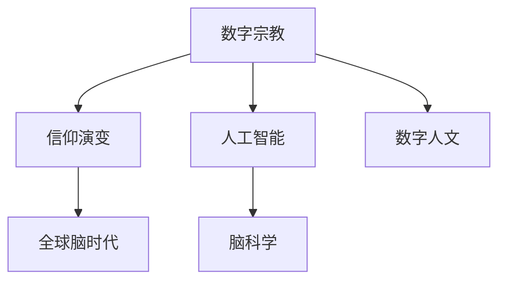

                 

# 数字化宗教:全球脑时代的信仰演变

> 关键词：数字宗教,信仰演变,全球脑时代,人工智能,脑科学,数字人文

## 1. 背景介绍

在信息时代，数字化浪潮席卷全球，深度影响着人们的生产、生活乃至信仰。数字宗教（Digital Religion）作为信仰与数字技术交织的产物，正悄然影响着宗教的形态、传播方式和信徒的体验。本文旨在探讨数字宗教在全球脑时代的信仰演变，从数字信仰的形成、演化到未来的发展趋势，全面剖析数字宗教的核心概念及其在信仰、技术、社会多个维度上的深度融合。

## 2. 核心概念与联系

### 2.1 核心概念概述

为了深入理解数字宗教及其对信仰演变的影响，我们首先需要明确以下几个核心概念：

- **数字宗教**：以数字技术为载体，通过互联网、社交媒体、虚拟现实（VR）、增强现实（AR）等手段，传播和实践宗教信仰的形式。
- **信仰演变**：在数字化环境下，随着技术进步和知识传播，信仰的形态、内容、实践方式等逐步发生改变的过程。
- **全球脑时代**：伴随着神经科学、认知科学、信息技术的融合发展，人类脑科学进入一个新的黄金时期，通过全球脑计划（Global Brain Initiative）等项目，将全球脑研究推向深入，对信仰和社会形态产生深远影响的时代。
- **人工智能**：具有类人智能的计算技术，通过模拟人脑神经网络结构，实现自动化和智能化的决策、感知和学习。
- **脑科学**：研究人类大脑结构、功能、认知过程的科学领域，通过对脑与信仰的关系研究，揭示信仰的神经基础。
- **数字人文**：将数字技术应用于传统人文研究领域，推动文化传承、历史重构、知识挖掘等工作的创新与变革。

这些概念之间存在着紧密的联系，互为支撑，共同构成了数字宗教的基础框架。以下是一个简化的Mermaid流程图，展示了这些概念之间的联系：



这个图展示了数字宗教通过数字技术和人工智能的应用，依托脑科学的最新研究成果，在信仰演变和全球脑时代背景下，不断融合数字人文的精神文化内涵，推动信仰形态和实践方式的深刻变革。

## 3. 核心算法原理 & 具体操作步骤
### 3.1 算法原理概述

数字宗教的形成和发展，依赖于人工智能和脑科学技术的融合。以下是数字宗教的核心算法原理：

- **人工智能算法**：通过深度学习、自然语言处理（NLP）等技术，实现对宗教文本、教义、历史等数据的自动化处理和知识抽取，为信仰的数字化提供技术支持。
- **脑科学算法**：通过神经网络模拟大脑认知过程，揭示信仰与脑功能之间的关系，为数字宗教的认知科学基础提供理论支撑。
- **信仰演化算法**：利用数据挖掘、机器学习等技术，分析信仰的演化规律，预测信仰在数字时代的未来发展趋势。

### 3.2 算法步骤详解

数字宗教的构建和演化通常包括以下关键步骤：

1. **数据收集与预处理**：
   - 从不同渠道收集宗教文本、教义、图像、音频等数据，并进行清洗和预处理。
   - 使用数据标注技术对宗教数据进行分类和标注，为后续分析和处理提供数据基础。

2. **特征提取与建模**：
   - 使用自然语言处理技术，提取文本中的关键词、情感、语义等特征。
   - 利用深度学习模型（如Transformer、BERT）对宗教数据进行建模，构建数字宗教的知识图谱。

3. **数据分析与挖掘**：
   - 使用聚类、分类等算法对宗教数据进行深入分析，揭示信仰演变的趋势。
   - 利用时序分析、关联规则等技术，挖掘宗教信仰与时间、地点、人群等变量之间的关系。

4. **应用部署与优化**：
   - 将数字宗教模型部署到网络平台，通过API接口提供查询、推荐等服务。
   - 不断优化模型性能，提升用户体验，实现信仰信息的智能传播。

### 3.3 算法优缺点

数字宗教算法的主要优点包括：

- **高效处理海量数据**：通过自动化处理和深度学习模型，能够高效处理宗教文本、图像等海量数据。
- **精确揭示信仰特征**：利用脑科学算法，能够更深入地揭示信仰与大脑认知过程的关系，提升信仰分析的准确性。
- **广泛应用场景**：数字宗教技术可以应用于宗教教育、信仰传播、宗教冲突调解等多个领域，具有广阔的应用前景。

其主要缺点包括：

- **数据隐私问题**：宗教数据涉及个人信仰，处理不当可能侵犯隐私。
- **算法偏见风险**：深度学习模型可能存在数据偏见，影响信仰分析的公正性。
- **模型复杂度高**：深度学习模型的训练复杂度高，需要大量计算资源和专业知识。

### 3.4 算法应用领域

数字宗教的应用领域广泛，以下是几个典型的应用场景：

1. **数字宗教教育**：通过在线课程、虚拟现实（VR）体验等方式，提供数字化宗教教育，普及宗教知识，提升信徒的教育水平。
2. **信仰数据分析**：通过数据分析技术，揭示信仰传播的规律和趋势，为信仰管理和政策制定提供依据。
3. **虚拟宗教社区**：构建虚拟宗教社区，提供信仰交流、互助、虚拟礼拜等互动服务，增强信仰实践的体验感。
4. **跨宗教对话**：利用人工智能技术，实现不同宗教间的对话和交流，促进宗教间的理解与和谐。
5. **宗教冲突调解**：通过信仰情感分析，识别宗教冲突的潜在因素，提供调解建议和解决方案。

## 4. 数学模型和公式 & 详细讲解 & 举例说明
### 4.1 数学模型构建

数字宗教的数学模型构建，主要依赖于深度学习模型和脑科学算法。以下是一个简化的数学模型构建过程：

1. **深度学习模型**：
   - **Transformer模型**：使用Transformer结构对宗教文本进行建模，提取文本特征。
   - **BERT模型**：利用预训练的BERT模型对宗教文本进行编码，提取语义信息。

2. **脑科学算法**：
   - **神经网络模型**：通过模拟人脑神经网络结构，分析宗教信仰与大脑认知过程的关系。
   - **脑图像分析**：利用脑成像技术，分析宗教活动对大脑功能的影响。

### 4.2 公式推导过程

以Transformer模型为例，简要推导其核心公式。Transformer模型主要由编码器和解码器组成，其核心公式为：

$$
\mathrm{Attention}(Q, K, V) = \text{softmax}(\frac{QK^T}{\sqrt{d_k}})
$$

其中，$Q$、$K$、$V$分别为查询向量、键向量和值向量，$d_k$为向量的维度。通过Attention机制，模型可以高效地处理序列数据，提取关键信息。

### 4.3 案例分析与讲解

以数字宗教教育为例，简要分析其数学模型应用：

1. **数据收集**：从互联网、图书馆、宗教组织等渠道收集宗教文本、图像、音频等数据。
2. **预处理**：对收集到的数据进行清洗、标注和归一化处理。
3. **特征提取**：使用BERT模型提取文本中的关键特征，如关键词、情感、语义等。
4. **建模**：利用Transformer模型对宗教文本进行建模，构建数字宗教的知识图谱。
5. **应用**：将知识图谱部署到在线课程平台，提供个性化宗教教育服务。

## 5. 项目实践：代码实例和详细解释说明
### 5.1 开发环境搭建

为了实现数字宗教的核心功能，需要搭建一个完整的开发环境。以下是搭建开发环境的具体步骤：

1. **选择开发语言**：选择Python作为开发语言，利用其丰富的第三方库和框架。
2. **安装必要的库**：安装TensorFlow、PyTorch、Numpy、Scipy等库，支持深度学习模型开发。
3. **搭建服务器**：选择云服务器或本地服务器，部署开发环境。
4. **数据准备**：从不同渠道收集宗教文本、图像、音频等数据，并进行清洗和预处理。
5. **模型训练**：使用深度学习框架，训练宗教文本的Transformer模型和BERT模型。

### 5.2 源代码详细实现

以下是一个简化的数字宗教教育系统的代码实现：

```python
import tensorflow as tf
from transformers import BertTokenizer, BertForSequenceClassification
import numpy as np
import pandas as pd

# 加载模型和分词器
model = BertForSequenceClassification.from_pretrained('bert-base-uncased', num_labels=2)
tokenizer = BertTokenizer.from_pretrained('bert-base-uncased')

# 数据准备
data = pd.read_csv('religious_texts.csv')
data = data[['text', 'label']]
data = tokenizer(data['text'], truncation=True, padding='max_length', max_length=512)

# 模型训练
model.compile(optimizer=tf.keras.optimizers.Adam(learning_rate=2e-5), loss=tf.keras.losses.SparseCategoricalCrossentropy(from_logits=True), metrics=[tf.keras.metrics.SparseCategoricalAccuracy()])
model.fit(data['input_ids'], data['labels'], epochs=10)

# 模型预测
new_text = "This is a new text."
new_input = tokenizer(new_text, truncation=True, padding='max_length', max_length=512)
predictions = model.predict(new_input['input_ids'])
```

### 5.3 代码解读与分析

在上述代码中，我们使用了BertForSequenceClassification模型和BertTokenizer对宗教文本进行建模和分词。模型通过训练预测新文本的情感标签，为数字宗教教育提供智能化支持。

## 6. 实际应用场景
### 6.1 数字宗教教育

数字宗教教育通过在线课程、虚拟现实（VR）体验等方式，提供数字化宗教教育，普及宗教知识，提升信徒的教育水平。例如，通过虚拟现实技术，模拟宗教活动场景，增强信徒的体验感和沉浸感。数字宗教教育还可以个性化推荐学习内容，根据信徒的需求和兴趣，推荐适合的宗教教育资源。

### 6.2 信仰数据分析

通过数据分析技术，揭示信仰传播的规律和趋势，为信仰管理和政策制定提供依据。例如，利用机器学习算法，分析宗教信仰的传播路径、受众分布、影响因素等，为宗教组织的决策提供科学依据。

### 6.3 虚拟宗教社区

构建虚拟宗教社区，提供信仰交流、互助、虚拟礼拜等互动服务，增强信仰实践的体验感。虚拟宗教社区可以引入社交网络技术，建立信仰者之间的连接，促进信仰传播和交流。

### 6.4 跨宗教对话

利用人工智能技术，实现不同宗教间的对话和交流，促进宗教间的理解与和谐。通过自然语言处理技术，构建跨宗教对话系统，分析不同宗教信仰的共性和差异，促进不同宗教间的对话和合作。

### 6.5 宗教冲突调解

通过信仰情感分析，识别宗教冲突的潜在因素，提供调解建议和解决方案。利用情感分析技术，分析宗教冲突的情感倾向和诉求，为冲突调解提供依据。

## 7. 工具和资源推荐
### 7.1 学习资源推荐

为了深入理解数字宗教及其核心算法，推荐以下学习资源：

1. **深度学习框架**：TensorFlow、PyTorch等深度学习框架，提供了丰富的机器学习库和模型，支持深度学习算法的实现。
2. **自然语言处理工具**：NLTK、SpaCy等自然语言处理工具，提供文本处理、分词、情感分析等功能。
3. **脑科学资源**：NeuroHub、OpenBrain等脑科学平台，提供神经科学数据和工具，支持脑科学算法的开发和研究。
4. **宗教数据集**：RELIGION数据集等宗教文本和图像数据集，支持宗教数据分析和处理。
5. **数字人文资源**：数字人文中心等平台，提供数字人文研究和资源，支持数字宗教的人文背景和历史研究。

### 7.2 开发工具推荐

以下是用于数字宗教开发的常用工具：

1. **Python编程语言**：Python提供了丰富的库和框架，支持深度学习、自然语言处理、数据分析等功能的实现。
2. **TensorFlow和PyTorch**：深度学习框架，支持构建和训练复杂的神经网络模型。
3. **Jupyter Notebook**：交互式编程环境，支持代码开发和数据可视化。
4. **Google Colab**：云端的Jupyter Notebook服务，提供免费GPU资源，支持深度学习模型的训练和测试。
5. **NeuroHub**：脑科学数据和工具平台，提供神经科学数据集和分析工具。

### 7.3 相关论文推荐

以下几篇论文代表了大数字宗教技术的最新研究进展，推荐阅读：

1. **A Survey on Deep Learning-based Methods for Religious Text Analysis**：综述了基于深度学习的宗教文本分析方法，包括文本分类、情感分析、实体识别等。
2. **Neural Network Models for Religious Text Classification**：利用深度学习模型对宗教文本进行分类，展示了深度学习在宗教文本分析中的应用。
3. **Understanding the Emotional Dynamics of Religious Discourse**：分析宗教文本中的情感变化，揭示信仰与情感的关系。
4. **Cross-religious Dialogue and Interpretation with Artificial Intelligence**：利用自然语言处理技术，构建跨宗教对话系统，促进宗教间的理解与合作。
5. **Digital Religion: A Review of Current Trends and Future Directions**：综述了数字宗教技术的最新研究进展，展望了未来的发展趋势。

## 8. 总结：未来发展趋势与挑战
### 8.1 研究成果总结

本文对数字宗教进行了系统性的探讨，从核心概念到核心算法，全面剖析了数字宗教的构建和应用。数字宗教作为信仰与数字技术的深度融合，正在深刻影响着宗教的形态、传播方式和信徒的体验。通过深度学习、脑科学、自然语言处理等技术的结合，数字宗教的应用前景广阔，具有巨大的潜力和发展空间。

### 8.2 未来发展趋势

展望未来，数字宗教将呈现以下几个发展趋势：

1. **深度融合技术**：深度融合人工智能、脑科学、自然语言处理等技术，提升数字宗教的智能化水平。
2. **个性化定制**：根据信仰者需求，提供个性化宗教教育、信仰体验等服务。
3. **跨宗教交流**：利用自然语言处理技术，促进不同宗教间的对话和合作，增强宗教间的理解和和谐。
4. **虚拟现实体验**：通过虚拟现实技术，增强信仰实践的体验感和沉浸感。
5. **大规模数据应用**：利用大规模宗教数据，揭示信仰的演化规律和趋势，为宗教管理和政策制定提供依据。

### 8.3 面临的挑战

尽管数字宗教具有广阔的应用前景，但在发展过程中仍面临诸多挑战：

1. **数据隐私问题**：宗教数据涉及个人信仰，处理不当可能侵犯隐私。
2. **算法偏见风险**：深度学习模型可能存在数据偏见，影响信仰分析的公正性。
3. **模型复杂度高**：深度学习模型的训练复杂度高，需要大量计算资源和专业知识。
4. **信仰多样性**：不同宗教信仰的复杂性和多样性，增加了数字宗教的实现难度。
5. **社会接受度**：数字宗教在宗教组织和信徒中的接受度，需要进一步验证和推广。

### 8.4 研究展望

未来，数字宗教的研究需要在以下几个方面进行突破：

1. **隐私保护技术**：开发隐私保护算法，确保宗教数据的安全性和隐私性。
2. **公平性算法**：开发公平性算法，消除数据偏见，提高信仰分析的公正性。
3. **低成本计算**：研究低成本计算技术，优化深度学习模型的训练和推理。
4. **多宗教融合**：研究多宗教融合技术，构建跨宗教的数字宗教平台。
5. **社会接受度提升**：通过教育和技术推广，提升数字宗教在宗教组织和信徒中的接受度。

总之，数字宗教作为信仰与数字技术的深度融合，具有广阔的发展前景和应用潜力。未来，需要在技术、伦理、社会等多个维度进行深入探索，推动数字宗教的健康发展，为宗教信仰的数字化提供新路径。

## 9. 附录：常见问题与解答

**Q1: 数字宗教的核心算法原理是什么？**

A: 数字宗教的核心算法原理主要依赖于深度学习模型和脑科学算法。深度学习模型通过自然语言处理技术，提取宗教文本的关键特征，构建数字宗教的知识图谱。脑科学算法通过模拟人脑神经网络结构，揭示信仰与大脑认知过程的关系，为数字宗教提供认知科学基础。

**Q2: 数字宗教的优势和缺点是什么？**

A: 数字宗教的优势包括：
1. 高效处理海量数据，利用深度学习模型对宗教文本进行自动化处理。
2. 精确揭示信仰特征，利用脑科学算法深入分析信仰与大脑认知过程的关系。
3. 广泛应用场景，应用于宗教教育、信仰数据分析、虚拟宗教社区等多个领域。

数字宗教的缺点包括：
1. 数据隐私问题，宗教数据涉及个人信仰，处理不当可能侵犯隐私。
2. 算法偏见风险，深度学习模型可能存在数据偏见，影响信仰分析的公正性。
3. 模型复杂度高，深度学习模型的训练复杂度高，需要大量计算资源和专业知识。

**Q3: 数字宗教的未来发展方向是什么？**

A: 数字宗教的未来发展方向包括：
1. 深度融合技术，融合人工智能、脑科学、自然语言处理等技术，提升数字宗教的智能化水平。
2. 个性化定制，根据信仰者需求，提供个性化宗教教育、信仰体验等服务。
3. 跨宗教交流，利用自然语言处理技术，促进不同宗教间的对话和合作。
4. 虚拟现实体验，通过虚拟现实技术，增强信仰实践的体验感和沉浸感。
5. 大规模数据应用，利用大规模宗教数据，揭示信仰的演化规律和趋势。

**Q4: 数字宗教面临的主要挑战是什么？**

A: 数字宗教面临的主要挑战包括：
1. 数据隐私问题，宗教数据涉及个人信仰，处理不当可能侵犯隐私。
2. 算法偏见风险，深度学习模型可能存在数据偏见，影响信仰分析的公正性。
3. 模型复杂度高，深度学习模型的训练复杂度高，需要大量计算资源和专业知识。
4. 信仰多样性，不同宗教信仰的复杂性和多样性，增加了数字宗教的实现难度。
5. 社会接受度，数字宗教在宗教组织和信徒中的接受度，需要进一步验证和推广。

---

作者：禅与计算机程序设计艺术 / Zen and the Art of Computer Programming

