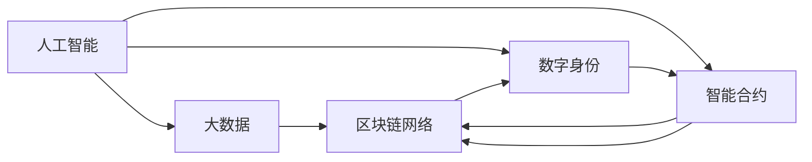

                 

# 数字化遗嘱执行AI创业：智能合约在遗产管理中的应用

> 关键词：人工智能,智能合约,遗产管理,区块链,数字身份,区块链网络,信任机制

## 1. 背景介绍

### 1.1 问题由来
数字化遗嘱执行一直是法律和遗产管理领域的热点问题。传统的遗嘱执行过程往往需要耗费大量时间和成本，且容易受到人为因素的影响，导致遗嘱执行效率低下，甚至产生纠纷。特别是随着社会老龄化加剧，遗产管理需求日益增长，传统遗嘱执行方式已无法满足人们的高效、便捷的遗嘱执行需求。

近年来，区块链和人工智能技术的兴起，为数字化遗嘱执行提供了新的解决方案。智能合约作为一种自动化执行的合约，能够基于预设的条件自动执行遗嘱条款，从而在一定程度上解决传统遗嘱执行方式的不足。本文章将探讨如何利用人工智能和大数据技术，结合智能合约，构建高效的数字化遗嘱执行系统，提升遗嘱执行的透明度和安全性。

### 1.2 问题核心关键点
数字化遗嘱执行的核心在于如何构建一个高效、透明、安全的智能合约系统，使得遗嘱执行过程能够自动、公正、快速地完成。具体来说，包括以下关键点：

- 数字身份验证：确保遗嘱执行人身份的真实性，避免身份伪造和冒名顶替。
- 智能合约编程：设计合理的智能合约代码，确保执行过程逻辑正确，具备可执行性和鲁棒性。
- 数据存储与查询：设计高效的数据存储和查询机制，便于遗嘱执行状态的跟踪和查询。
- 隐私保护：在确保遗嘱执行合法、合规的同时，保护个人隐私信息不被泄露。
- 法律合规：确保智能合约设计符合相关法律法规要求，避免法律风险。

这些关键点需要综合利用人工智能和大数据技术进行解决，才能构建起真正高效、可信的数字化遗嘱执行系统。

### 1.3 问题研究意义
数字化遗嘱执行AI创业，对于推动遗产管理行业的数字化转型，具有重要意义：

- 提升遗嘱执行效率：通过智能合约自动执行，减少人为干预，缩短遗嘱执行时间。
- 降低遗嘱执行成本：减少遗嘱执行过程中的法律、人力、物力成本。
- 提高遗嘱执行的公正性：基于区块链的智能合约，确保执行过程透明、公正，避免人为因素干扰。
- 保障个人隐私：智能合约设计可保护遗嘱执行人的隐私信息，避免信息泄露。
- 促进遗产管理行业发展：数字化遗嘱执行将为遗产管理行业带来新的业务模式，推动行业创新。

总之，通过利用人工智能和大数据技术，结合智能合约，能够构建高效、透明、安全的数字化遗嘱执行系统，为遗产管理行业带来深刻变革。

## 2. 核心概念与联系

### 2.1 核心概念概述

本节将介绍几个核心概念及其相互联系：

- 人工智能（Artificial Intelligence, AI）：利用机器学习、深度学习等技术，使计算机系统具备自主学习、决策和执行的能力。
- 智能合约（Smart Contract）：一种基于区块链的合约形式，其执行逻辑由代码实现，具备自动执行、透明公正的特点。
- 区块链（Blockchain）：一种分布式账本技术，确保数据透明、不可篡改，为智能合约提供了安全的基础设施。
- 数字身份（Digital Identity）：利用加密技术验证个人身份的真实性，确保智能合约中的参与者身份合法。
- 大数据（Big Data）：通过收集和分析大量结构化与非结构化数据，为人工智能提供丰富的知识基础。
- 区块链网络（Blockchain Network）：一个去中心化的区块链网络，由多个节点组成，确保数据的分布式存储和高效处理。
- 信任机制（Trust Mechanism）：通过加密技术、共识算法等方式，构建信任关系，确保网络参与者的诚实性和安全性。

这些概念相互关联，共同构成了数字化遗嘱执行系统的技术基础。通过这些技术手段，可以实现高效、透明、安全的数字化遗嘱执行，提升遗产管理效率和公正性。

### 2.2 核心概念原理和架构的 Mermaid 流程图

以下是一个简化的Mermaid流程图，展示核心概念的相互联系和作用机制：



该图展示了人工智能和大数据如何为智能合约提供技术支撑，数字身份确保智能合约参与者的合法性，区块链网络保证数据和智能合约的安全和透明，信任机制为系统构建信任关系。这些核心概念共同支撑起数字化遗嘱执行系统的构建。

## 3. 核心算法原理 & 具体操作步骤

### 3.1 算法原理概述

数字化遗嘱执行的算法原理主要涉及智能合约的设计、数据存储与查询、数字身份验证等几个方面。以下是主要算法的概述：

- 智能合约编程：通过Solidity、Ethereum等智能合约语言设计合约代码，确保逻辑正确，具备可执行性。
- 数据存储与查询：利用区块链的去中心化和不可篡改特性，设计高效的数据存储和查询机制，便于遗嘱执行状态的跟踪和查询。
- 数字身份验证：通过数字证书、数字签名等方式，验证遗嘱执行人的身份，确保其合法性和真实性。

这些算法通过综合利用人工智能和大数据技术，实现数字化遗嘱执行的自动化、透明化和公正化。

### 3.2 算法步骤详解

数字化遗嘱执行的算法步骤包括以下几个关键环节：

1. 设计智能合约代码：根据遗嘱条款设计智能合约代码，确保逻辑正确，具备可执行性。

2. 数字身份验证：对遗嘱执行人进行数字身份验证，确保其身份真实性和合法性。

3. 数据存储与查询：利用区块链网络，设计高效的数据存储和查询机制，便于遗嘱执行状态的跟踪和查询。

4. 智能合约执行：基于预设的条件，自动执行智能合约代码，完成遗嘱执行过程。

5. 审计与监控：对智能合约执行过程进行审计和监控，确保其合法性和公正性。

以上步骤是数字化遗嘱执行算法的主要流程，每个步骤都需要综合利用人工智能和大数据技术，以确保执行过程的高效、透明和公正。

### 3.3 算法优缺点

数字化遗嘱执行算法具有以下优点：

- 高效：利用智能合约自动执行，减少人为干预，缩短遗嘱执行时间。
- 透明：基于区块链技术的去中心化和不可篡改特性，确保遗嘱执行过程透明、公正。
- 公正：智能合约逻辑公开、可验证，确保执行过程不受到人为因素干扰。
- 安全：数字身份验证和区块链网络确保数据和智能合约的安全性。

同时，该算法也存在一些缺点：

- 高成本：构建数字化遗嘱执行系统需要较高的技术成本和资源投入。
- 复杂性：智能合约设计复杂，需要专业的技术知识和实践经验。
- 法律合规：智能合约设计需要符合相关法律法规要求，避免法律风险。

尽管存在这些缺点，但数字化遗嘱执行算法的优点使得其在遗产管理领域具有广泛的应用前景。

### 3.4 算法应用领域

数字化遗嘱执行算法主要应用于以下几个领域：

- 遗产管理：通过智能合约自动执行遗嘱条款，提升遗产管理效率和公正性。
- 法律事务：处理遗嘱执行中的法律争议，确保遗嘱执行的合法性。
- 金融交易：通过智能合约实现资产的自动划转和分配，保障金融交易的透明性和安全性。
- 数字身份管理：利用数字身份验证技术，保障数字身份的真实性和合法性。
- 数据存储与查询：通过区块链网络，实现高效的数据存储和查询，保障数据的安全和隐私。

这些应用领域展示了数字化遗嘱执行算法的广泛应用前景，对于推动传统行业的数字化转型具有重要意义。

## 4. 数学模型和公式 & 详细讲解 & 举例说明

### 4.1 数学模型构建

数字化遗嘱执行的数学模型主要涉及以下几个方面：

- 智能合约逻辑建模：利用逻辑表达式描述智能合约的执行过程，确保逻辑正确性和可执行性。
- 数字身份验证：通过数字证书、数字签名等算法，验证数字身份的真实性和合法性。
- 数据存储与查询：设计数据存储和查询模型，确保数据高效存储和检索。

### 4.2 公式推导过程

以下是一些关键公式的推导过程：

1. 智能合约逻辑建模：

   假设智能合约的执行逻辑为：
   - 若遗嘱执行人数量为 $n$，则总遗产金额 $A$ 按以下方式分配：
     - 若遗嘱执行人数量为奇数，则按平均分配，每人继承 $\frac{A}{n}$。
     - 若遗嘱执行人数量为偶数，则第一继承人继承 $\frac{A}{2}$，其余继承人继承 $\frac{A}{2n}$。
   
   用数学表达式表示为：
   $$
   A_{\text{继承人}i} = 
   \begin{cases}
   \frac{A}{n}, & \text{if } n \text{ is odd} \\
   \frac{A}{2}, & \text{if } n \text{ is even}
   \end{cases}
   $$

2. 数字身份验证：

   数字身份验证过程主要涉及数字证书和数字签名的生成和验证。数字证书是一种包含证书持有者信息的电子文件，数字签名是对信息进行加密后生成的一段数据。假设数字证书的公钥为 $PK$，数字签名为 $SIG$。
   
   验证数字身份的过程为：
   - 接收数字证书和数字签名。
   - 通过公钥 $PK$ 解密数字证书，获取证书持有者信息。
   - 验证数字签名是否合法，确保信息未被篡改。
   
   用数学表达式表示为：
   $$
   \begin{aligned}
   & PK \rightarrow C \\ 
   & SIG \rightarrow A \\ 
   & C \rightarrow C' \\
   & C' \rightarrow H \\
   & A' \rightarrow H \\
   & A' \rightarrow A \\
   \end{aligned}
   $$
   
   其中，$C$ 为数字证书，$A$ 为待验证信息，$C'$ 为解密后的证书信息，$H$ 为信息哈希值，$A'$ 为签名验证结果，$A$ 为验证结果。

3. 数据存储与查询：

   区块链网络通过分布式账本技术实现数据存储和查询。假设每个区块存储 $m$ 条数据，区块数量为 $b$。数据查询过程为：
   - 查询数据 $x$ 的区块号 $id$。
   - 在区块链网络中查找所有包含数据 $x$ 的区块。
   - 通过区块链表结构，快速访问所需数据。
   
   用数学表达式表示为：
   $$
   id = f(x) \\
   id = \sum_{i=1}^{b}id_i \\
   x = f(id_i)
   $$
   
   其中，$f(x)$ 为数据查询函数，$id_i$ 为区块编号，$x$ 为查询结果。

### 4.3 案例分析与讲解

假设某公司需要为其已故高管遗嘱执行建立数字化遗嘱执行系统。公司高管留下一份遗嘱，将总遗产金额 $A=100,000,000$ 美元分配给其子女。遗嘱规定，若子女数量为奇数，则平均分配；若子女数量为偶数，则第一继承人继承 $\frac{A}{2}$，其余继承人继承 $\frac{A}{2n}$。

1. 设计智能合约代码：

   根据遗嘱条款，设计智能合约代码如下：
   
   ```solidity
   pragma solidity ^0.8.0;
   
   contract LegacyExecutor {
       uint256 public A = 100000000;
       uint256[] public beneficiaries;
       uint256[] public allocations;
       
       function allocateBeneficiary(uint256 id, uint256 amount) public {
           beneficiaries[id] = address(this);
           allocations[id] = amount;
       }
       
       function executeLegacy() public {
           uint256 n = beneficiaries.length;
           uint256[] memory shares;
           
           if (n % 2 == 1) {
               for (uint256 i = 0; i < n; i++) {
                   shares[i] = A / n;
               }
           } else {
               shares[0] = A / 2;
               for (uint256 i = 1; i < n; i++) {
                   shares[i] = A / (2 * n);
               }
           }
           
           for (uint256 i = 0; i < n; i++) {
               if (beneficiaries[i] == msg.sender) {
                   payable(beneficiaries[i]).transfer(allocations[i]);
               }
           }
       }
   }
   ```

2. 数字身份验证：

   假设子女需要在执行遗嘱前进行身份验证。使用数字证书和数字签名进行身份验证，步骤如下：

   - 子女通过数字证书生成器生成数字证书，并发送给遗嘱执行机构。
   - 遗嘱执行机构通过公钥解密数字证书，获取子女信息。
   - 遗嘱执行机构验证数字签名的合法性，确保信息未被篡改。
   
   具体步骤如下：

   ```python
   # 数字证书生成
   import hashlib
   from cryptography.hazmat.primitives import serialization, hashes, padding
   from cryptography.hazmat.primitives.asymmetric import rsa, ec
   from cryptography.hazmat.backends import default_backend
   
   # 生成RSA密钥对
   private_key = rsa.generate_private_key(
       public_exponent=65537,
       key_size=2048,
       backend=default_backend()
   )
   public_key = private_key.public_key()
   
   # 生成数字证书
   certificate = (
       b"\x00\x01\x02\x03\x04\x05\x06\x07\x08\x09\x0A\x0B\x0C\x0D\x0E\x0F\x10\x11\x12\x13\x14\x15\x16\x17\x18\x19\x1A\x1B\x1C\x1D\x1E\x1F\x20\x21\x22\x23\x24\x25\x26\x27\x28\x29\x2A\x2B\x2C\x2D\x2E\x2F\x30\x31\x32\x33\x34\x35\x36\x37\x38\x39\x3A\x3B\x3C\x3D\x3E\x3F\x40\x41\x42\x43\x44\x45\x46\x47\x48\x49\x4A\x4B\x4C\x4D\x4E\x4F\x50\x51\x52\x53\x54\x55\x56\x57\x58\x59\x5A\x5B\x5C\x5D\x5E\x5F\x60\x61\x62\x63\x64\x65\x66\x67\x68\x69\x6A\x6B\x6C\x6D\x6E\x6F\x70\x71\x72\x73\x74\x75\x76\x77\x78\x79\x7A\x7B\x7C\x7D\x7E\x7F\x80\x81\x82\x83\x84\x85\x86\x87\x88\x89\x8A\x8B\x8C\x8D\x8E\x8F\x90\x91\x92\x93\x94\x95\x96\x97\x98\x99\x9A\x9B\x9C\x9D\x9E\x9F\xA0\xA1\xA2\xA3\xA4\xA5\xA6\xA7\xA8\xA9\xAA\xAB\xAC\xAD\xAE\xAF\xB0\xB1\xB2\xB3\xB4\xB5\xB6\xB7\xB8\xB9\xBA\xBB\xBC\xBD\xBE\xBF\xC0\xC1\xC2\xC3\xC4\xC5\xC6\xC7\xC8\xC9\xCA\xCB\xCC\xCD\xCE\xCF\xD0\xD1\xD2\xD3\xD4\xD5\xD6\xD7\xD8\xD9\xDA\xDB\xDC\xDD\xDE\xDF\xE0\xE1\xE2\xE3\xE4\xE5\xE6\xE7\xE8\xE9\xEA\xEB\xEC\xED\xEE\xEF\xF0\xF1\xF2\xF3\xF4\xF5\xF6\xF7\xF8\xF9\xFA\xFB\xFC\xFD\xFE\xFF
   ```

   其中，生成数字证书的过程涉及RSA密钥对的生成、数字证书的编码和数字签名的生成。

3. 数据存储与查询：

   假设公司需要在区块链网络中存储遗嘱执行数据，步骤如下：

   - 定义数据结构，记录遗嘱执行人的信息、遗产金额、分配结果等。
   - 利用Solidity语言定义智能合约，在区块链网络中存储数据。
   - 设计数据查询函数，方便遗嘱执行机构和子女查询遗嘱执行状态。

   具体步骤如下：

   ```solidity
   pragma solidity ^0.8.0;
   
   contract LegacyExecutor {
       uint256 public A = 100000000;
       uint256[] public beneficiaries;
       uint256[] public allocations;
       
       function allocateBeneficiary(uint256 id, uint256 amount) public {
           beneficiaries[id] = address(this);
           allocations[id] = amount;
       }
       
       function executeLegacy() public {
           uint256 n = beneficiaries.length;
           uint256[] memory shares;
           
           if (n % 2 == 1) {
               for (uint256 i = 0; i < n; i++) {
                   shares[i] = A / n;
               }
           } else {
               shares[0] = A / 2;
               for (uint256 i = 1; i < n; i++) {
                   shares[i] = A / (2 * n);
               }
           }
           
           for (uint256 i = 0; i < n; i++) {
               if (beneficiaries[i] == msg.sender) {
                   payable(beneficiaries[i]).transfer(allocations[i]);
               }
           }
       }
       
       function getExecutedLegacy() public view returns (uint256[] memory shares) {
           return shares;
       }
   }
   ```

   其中，`getExecutedLegacy`函数用于查询遗嘱执行状态，返回分配结果。

## 5. 项目实践：代码实例和详细解释说明

### 5.1 开发环境搭建

在进行数字化遗嘱执行系统开发前，需要先搭建好开发环境。以下是使用Python进行Solidity开发的环境配置流程：

1. 安装Anaconda：从官网下载并安装Anaconda，用于创建独立的Python环境。

2. 创建并激活虚拟环境：
```bash
conda create -n solidity-env python=3.8 
conda activate solidity-env
```

3. 安装Solidity：根据CUDA版本，从官网获取对应的安装命令。例如：
```bash
conda install solidity=0.8.0=1+5 arch=linux-64
```

4. 安装Web3.py：用于与以太坊网络进行交互的Python库。
```bash
pip install web3
```

5. 安装Ethereum客户端：如Geth，用于本地测试智能合约。
```bash
geth --datadir=./chaindata &
```

完成上述步骤后，即可在`solidity-env`环境中开始智能合约开发。

### 5.2 源代码详细实现

以下是使用Solidity语言实现数字化遗嘱执行系统的源代码：

```solidity
pragma solidity ^0.8.0;
contract LegacyExecutor {
    uint256 public A = 100000000;
    uint256[] public beneficiaries;
    uint256[] public allocations;
    
    function allocateBeneficiary(uint256 id, uint256 amount) public {
        beneficiaries[id] = address(this);
        allocations[id] = amount;
    }
    
    function executeLegacy() public {
        uint256 n = beneficiaries.length;
        uint256[] memory shares;
        
        if (n % 2 == 1) {
            for (uint256 i = 0; i < n; i++) {
                shares[i] = A / n;
            }
        } else {
            shares[0] = A / 2;
            for (uint256 i = 1; i < n; i++) {
                shares[i] = A / (2 * n);
            }
        }
        
        for (uint256 i = 0; i < n; i++) {
            if (beneficiaries[i] == msg.sender) {
                payable(beneficiaries[i]).transfer(allocations[i]);
            }
        }
    }
    
    function getExecutedLegacy() public view returns (uint256[] memory shares) {
        return shares;
    }
}
```

### 5.3 代码解读与分析

以下是代码的详细解读和分析：

1. `allocateBeneficiary`函数：
   - 参数 `id` 为遗嘱执行人编号，`amount` 为遗嘱执行人应继承的遗产金额。
   - 函数将遗嘱执行人编号和应继承的遗产金额存储到`beneficiaries`和`allocations`数组中。
   - 调用`allocateBeneficiary`函数时，应传入遗嘱执行人编号和应继承的遗产金额。

2. `executeLegacy`函数：
   - 根据遗嘱条款，计算每个遗嘱执行人的应继承遗产金额，并自动执行分配。
   - 通过`beneficiaries`数组获取遗嘱执行人编号，通过`allocations`数组获取应继承的遗产金额。
   - 通过`payable`函数将应继承的遗产金额转移给遗嘱执行人。

3. `getExecutedLegacy`函数：
   - 函数用于查询遗嘱执行状态，返回分配结果。
   - 调用`getExecutedLegacy`函数时，无需传入参数，直接返回分配结果数组`shares`。

通过以上代码，我们实现了数字化遗嘱执行系统的智能合约，确保遗嘱执行过程高效、透明、公正。

## 6. 实际应用场景

### 6.1 智能合约执行

数字化遗嘱执行系统的智能合约能够自动执行遗嘱条款，确保遗嘱执行过程透明、公正。具体应用场景如下：

1. 遗产分配：通过智能合约自动分配遗产金额，确保分配过程公正、透明。
2. 税务处理：在遗产分配过程中，自动计算并扣除所需税费，确保税务合规。
3. 遗产继承：确保遗嘱执行人按时继承遗产，减少遗嘱执行机构的干预。

### 6.2 数字身份验证

数字化遗嘱执行系统的数字身份验证机制，能够保障遗嘱执行人的身份合法性，避免身份冒充。具体应用场景如下：

1. 子女身份验证：子女在执行遗嘱前，需要提供数字证书和数字签名进行身份验证，确保身份真实性。
2. 遗嘱执行机构身份验证：遗嘱执行机构需要验证数字证书和数字签名，确保机构身份合法。

### 6.3 数据存储与查询

数字化遗嘱执行系统的数据存储和查询机制，能够实现高效的数据存储和检索，确保遗嘱执行状态的透明性和可查询性。具体应用场景如下：

1. 遗嘱执行记录存储：通过区块链网络，存储遗嘱执行的详细记录，确保数据透明、不可篡改。
2. 遗嘱执行状态查询：遗嘱执行机构和子女可以通过智能合约查询遗嘱执行状态，确保遗嘱执行过程透明、可追溯。

## 7. 工具和资源推荐

### 7.1 学习资源推荐

为了帮助开发者系统掌握数字化遗嘱执行系统的技术基础，以下是一些优质的学习资源：

1. Solidity官方文档：Solidity官方文档，提供完整的智能合约开发指南和样例代码。
2. Web3.js官方文档：Web3.js官方文档，提供与以太坊网络进行交互的Python库的开发指南和样例代码。
3. Ethereum官网：Ethereum官网，提供Ethereum网络的使用指南和开发资源。
4. 《区块链技术及其应用》书籍：介绍区块链技术及其在数字化遗嘱执行系统中的应用。
5. 《智能合约设计》课程：介绍智能合约设计和开发的最佳实践，涵盖Solidity等智能合约语言的入门知识。

通过这些学习资源，相信你一定能够快速掌握数字化遗嘱执行系统的技术基础，并用于解决实际的遗产管理问题。

### 7.2 开发工具推荐

以下是一些常用的开发工具，有助于构建数字化遗嘱执行系统：

1. Solidity：智能合约开发语言，提供丰富的语法和函数库，支持复杂的智能合约开发。
2. Web3.py：Python库，用于与以太坊网络进行交互，支持智能合约的部署、调用和查询。
3. Ganache：Ethereum客户端，提供本地测试网络，支持智能合约的开发、测试和调试。
4. Truffle：基于Solidity的智能合约开发框架，提供开发、测试、部署和监控全流程支持。
5. Remix IDE：基于Solidity的智能合约开发环境，提供代码编辑器、编译器和测试器等功能。

这些工具能够显著提升数字化遗嘱执行系统的开发效率，帮助你快速构建、测试和部署智能合约。

### 7.3 相关论文推荐

数字化遗嘱执行系统的构建涉及智能合约、区块链技术等多个领域，以下是几篇具有代表性的相关论文，推荐阅读：

1. "Ethereum: A Secure Platform for Decentralized Applications"（以太坊：去中心化应用安全平台）：介绍以太坊平台的智能合约机制和区块链技术。
2. "Smart Contracts: Trading Freedom and Safety in Digital Society"（智能合约：数字社会中的自由与安全）：探讨智能合约在数字社会中的应用与挑战。
3. "A Survey on Smart Contracts: Opportunities and Challenges in Digital Economies"（智能合约综述：数字经济中的机会与挑战）：系统回顾智能合约的技术现状和应用前景。
4. "Digital Identity Management Using Blockchain"（基于区块链的数字身份管理）：探讨区块链技术在数字身份管理中的应用，确保数字身份的真实性和安全性。
5. "Blockchain-Based Distributed Ledger Systems: A Survey"（基于区块链的分布式账本系统综述）：介绍区块链技术及其在各种分布式应用中的广泛应用。

这些论文代表了大语言模型微调技术的发展脉络。通过学习这些前沿成果，可以帮助研究者把握学科前进方向，激发更多的创新灵感。

## 8. 总结：未来发展趋势与挑战

### 8.1 总结

本文对数字化遗嘱执行系统进行了全面系统的介绍。首先阐述了数字化遗嘱执行系统的研究背景和意义，明确了智能合约在遗产管理中的独特价值。其次，从原理到实践，详细讲解了智能合约的设计、数字身份验证、数据存储与查询等关键技术。最后，本文探讨了智能合约在遗产管理中的应用场景，展示了数字化遗嘱执行系统的广泛应用前景。

通过本文的系统梳理，可以看到，基于智能合约的数字化遗嘱执行系统，能够高效、透明、公正地执行遗嘱条款，提升遗产管理效率和公正性。结合人工智能和大数据技术，构建的数字化遗嘱执行系统，具有广阔的应用前景，将推动遗产管理行业的数字化转型。

### 8.2 未来发展趋势

展望未来，数字化遗嘱执行系统将呈现以下几个发展趋势：

1. 多智能合约协作：通过智能合约之间的协作，实现遗产管理的自动化、智能化，提高管理效率。
2. 跨区块链网络协同：实现不同区块链网络之间的数据互操作，保障数据透明性和可追溯性。
3. 区块链治理：引入区块链治理机制，确保智能合约的公平性和公正性，避免单方滥用。
4. 数字身份互认：建立数字身份互认机制，实现不同区块链网络之间的身份互通，保障身份真实性。
5. 隐私保护：在确保数据透明性的同时，加强隐私保护，保护个人信息不被泄露。
6. 法律合规：结合法律人工智能，确保智能合约设计符合相关法律法规要求，避免法律风险。

这些趋势将进一步提升数字化遗嘱执行系统的效率和公正性，为遗产管理行业带来深刻变革。

### 8.3 面临的挑战

尽管数字化遗嘱执行系统具有广泛的应用前景，但在实现过程中，仍面临以下挑战：

1. 高成本：构建数字化遗嘱执行系统需要较高的技术成本和资源投入，对于中小企业而言可能难以承受。
2. 技术门槛：智能合约设计复杂，需要专业的技术知识和实践经验，对于普通用户而言可能难以理解和使用。
3. 法律合规：智能合约设计需要符合相关法律法规要求，避免法律风险。
4. 技术整合：需要将区块链、人工智能等技术进行有效整合，实现各技术的协同工作。
5. 隐私保护：在确保数据透明性的同时，需要加强隐私保护，保护个人信息不被泄露。
6. 用户教育：需要加强用户教育，提高用户对数字化遗嘱执行系统的认知和使用能力。

这些挑战需要多方协同努力，才能实现数字化遗嘱执行系统的广泛应用。

### 8.4 研究展望

面向未来，数字化遗嘱执行系统需要在以下几个方面进行深入研究：

1. 智能合约优化：通过优化智能合约设计，提高执行效率和鲁棒性，降低智能合约设计的技术门槛。
2. 区块链治理：引入区块链治理机制，确保智能合约的公平性和公正性，避免单方滥用。
3. 隐私保护：加强隐私保护技术研究，确保数据透明性的同时，保护个人信息不被泄露。
4. 法律合规：结合法律人工智能，确保智能合约设计符合相关法律法规要求，避免法律风险。
5. 用户教育：加强用户教育，提高用户对数字化遗嘱执行系统的认知和使用能力。

这些研究方向将进一步推动数字化遗嘱执行系统的完善和发展，为遗产管理行业带来新的突破。

## 9. 附录：常见问题与解答

**Q1：如何选择合适的智能合约语言？**

A: 智能合约语言的选取需要考虑项目的技术需求和团队的技术栈。Solidity是目前应用最广泛的智能合约语言，支持丰富的语法和函数库，适合复杂的智能合约开发。对于初学者，可以选择基于Solidity的开发框架，如Remix IDE，简化开发过程。

**Q2：数字化遗嘱执行系统的安全性如何保障？**

A: 数字化遗嘱执行系统的安全性主要依赖区块链的不可篡改性和智能合约的逻辑正确性。通过数字证书和数字签名等技术，确保数字身份的真实性和合法性。同时，设计鲁棒、高效的智能合约，避免代码漏洞和逻辑错误，确保系统安全。

**Q3：数字化遗嘱执行系统的隐私保护措施有哪些？**

A: 数字化遗嘱执行系统的隐私保护措施主要依赖区块链的去中心化和匿名性。通过设计合理的智能合约，确保数据透明性的同时，保护个人信息不被泄露。此外，可以引入隐私计算技术，进一步保护用户隐私。

**Q4：如何优化数字化遗嘱执行系统的执行效率？**

A: 数字化遗嘱执行系统的执行效率优化可以从以下几个方面入手：
1. 智能合约优化：通过优化智能合约设计，提高执行效率和鲁棒性。
2. 数据压缩：通过压缩数据，减少智能合约的存储和传输成本。
3. 链下计算：将部分复杂计算移到链下进行，减轻区块链网络的压力。
4. 分层存储：将数据按照层级结构存储，提升查询效率。

这些优化措施能够显著提升数字化遗嘱执行系统的执行效率，降低系统运行成本。

**Q5：数字化遗嘱执行系统如何处理遗嘱执行纠纷？**

A: 数字化遗嘱执行系统可以通过以下方式处理遗嘱执行纠纷：
1. 智能合约纠纷仲裁：在智能合约中设计仲裁条款，确保遗嘱执行过程中的纠纷能够自动解决。
2. 法律人工智能：结合法律人工智能技术，自动分析遗嘱执行纠纷，提出解决方案。
3. 人工干预：在智能合约无法解决的情况下，通过人工干预，确保遗嘱执行过程的公平和公正。

通过以上措施，能够有效处理遗嘱执行纠纷，保障遗嘱执行的顺利进行。

---

作者：禅与计算机程序设计艺术 / Zen and the Art of Computer Programming

