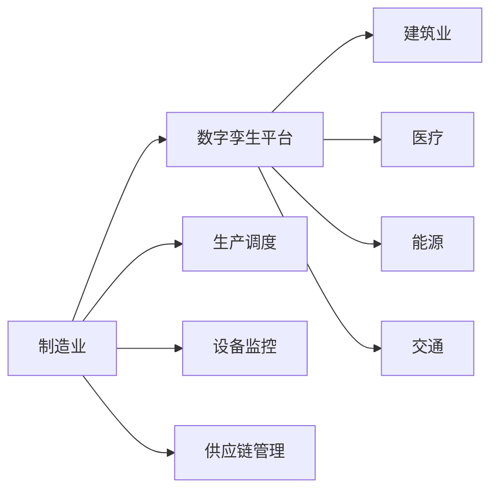

                 

# 数字孪生技术：虚拟与现实的桥梁

> 关键词：数字孪生,物联网(IoT),虚拟仿真,数据分析,实时监控,智能决策,工业4.0,数字孪生平台,跨领域应用

## 1. 背景介绍

### 1.1 问题由来

在当今数字化转型的浪潮中，企业需要更加精细化、智能化的管理和运营手段来提升竞争力。传统的物理实体管理方式往往效率低下，成本高昂，难以满足快速变化的市场需求。数字孪生（Digital Twin）技术应运而生，通过构建虚拟实体，实现对物理实体的数字化映射和动态监控，从而推动生产效率和决策质量的提升。

数字孪生技术最初由通用电气（GE）于2002年提出，用于飞机发动机的监控与维护，此后逐步应用于制造业、建筑业、医疗、能源等多个领域。近年来，随着物联网（IoT）、大数据、人工智能等技术的发展，数字孪生技术在实时性、精度和智能化方面取得了显著进步，成为工业4.0时代的重要技术之一。

### 1.2 问题核心关键点

数字孪生技术的核心在于通过虚拟仿真，将物理实体转化为可操作、可预测的数字模型，从而实现对物理实体的精准监控和智能决策。核心关键点包括：

- **虚拟仿真**：通过传感器数据、历史记录等，构建物理实体的数字模型，进行实时仿真和预测。
- **数据融合**：将来自物理实体、虚拟仿真系统的数据进行融合，形成综合的决策支持信息。
- **实时监控**：实现对物理实体的实时监控，通过反馈机制进行动态调整。
- **智能决策**：基于分析模型，进行自动化或半自动化的决策，提升运营效率和产品质量。

数字孪生技术的广泛应用，为各行各业提供了新的发展契机，促进了数字化转型的加速进行。

### 1.3 问题研究意义

研究数字孪生技术，对于提升生产效率、降低运营成本、增强决策科学性具有重要意义：

- **提升生产效率**：通过精确的数字模型和实时监控，可以实现生产过程的优化调整，减少资源浪费。
- **降低运营成本**：通过预测性维护和智能调度，可以延长设备寿命，减少维护成本。
- **增强决策科学性**：通过数据驱动的分析和预测，为决策提供坚实的依据，提升决策质量。
- **推动工业4.0**：数字孪生是工业4.0的核心技术之一，推动制造业向智能化、自动化方向发展。

## 2. 核心概念与联系

### 2.1 核心概念概述

数字孪生技术涉及到多个学科领域，核心概念包括：

- **物理实体**：现实世界中存在的物体、设备、系统等。
- **虚拟仿真**：通过软件模型，构建物理实体的数字化表示。
- **物联网(IoT)**：实现物理实体与虚拟仿真的数据交互。
- **数据分析**：对采集的数据进行分析和建模，为决策提供依据。
- **实时监控**：对物理实体的运行状态进行实时监测，及时发现问题。
- **智能决策**：基于数据分析和预测，进行自动化或半自动化的决策。

这些核心概念之间相互关联，共同构成了数字孪生技术的完整框架，如图2所示。

```mermaid
graph LR
    A[物理实体] --> B[物联网(IoT)]
    A --> C[虚拟仿真]
    B --> D[数据分析]
    C --> D
    D --> E[实时监控]
    D --> F[智能决策]
    E --> F
```

## 3. 核心算法原理 & 具体操作步骤

### 3.1 算法原理概述

数字孪生技术的核心算法原理可以归纳为以下几点：

- **数据采集与融合**：通过传感器和物联网技术，采集物理实体的运行数据，并将数据融合到虚拟仿真模型中。
- **虚拟仿真与预测**：通过虚拟仿真模型，模拟物理实体的运行状态，进行预测性分析和优化。
- **实时监控与反馈**：通过实时监控系统，对物理实体的运行状态进行实时跟踪，并通过反馈机制进行动态调整。
- **智能决策与优化**：基于数据分析模型，进行自动化或半自动化的决策，并不断优化决策策略。

这些算法原理共同构成了数字孪生技术的运行框架，如图3所示。


### 3.2 算法步骤详解

数字孪生技术的实施一般包括以下几个关键步骤：

**Step 1: 数据采集与预处理**
- 部署传感器和物联网设备，采集物理实体的运行数据。
- 对采集数据进行清洗、去噪、归一化等预处理，保证数据质量。

**Step 2: 虚拟仿真模型构建**
- 根据物理实体特性，设计虚拟仿真模型，如机械仿真、流程仿真、热力仿真等。
- 将采集到的数据输入仿真模型，进行仿真运行。

**Step 3: 数据分析与建模**
- 对仿真数据进行统计分析、回归分析、时序分析等，建立数据模型。
- 利用机器学习、深度学习等技术，进行预测和优化。

**Step 4: 实时监控与反馈**
- 通过实时监控系统，采集物理实体的运行状态数据。
- 对采集数据进行实时分析，发现异常并及时反馈。

**Step 5: 智能决策与优化**
- 根据数据分析结果，进行自动化或半自动化的决策。
- 不断优化决策策略，提升运行效率和质量。

**Step 6: 持续迭代与提升**
- 根据业务需求和技术进步，持续迭代和提升数字孪生系统的性能。

### 3.3 算法优缺点

数字孪生技术具有以下优点：

- **精准仿真**：通过虚拟仿真，可以准确反映物理实体的运行状态，为决策提供坚实依据。
- **实时监控**：实时监控系统可以及时发现问题，并进行动态调整，提升系统稳定性。
- **智能决策**：基于数据分析和预测，进行自动化或半自动化的决策，提升运营效率。

同时，数字孪生技术也存在一些缺点：

- **数据采集成本高**：传感器和物联网设备的部署和维护成本较高。
- **仿真复杂度高**：虚拟仿真模型的构建和优化需要大量的时间和资源。
- **数据质量要求高**：数据采集和预处理的质量直接影响仿真结果的准确性。

### 3.4 算法应用领域

数字孪生技术的应用领域非常广泛，如图4所示。



**制造业**：通过数字孪生技术，可以优化生产流程、提高设备利用率、实现预测性维护等。

**建筑业**：通过数字孪生技术，可以实现建筑物的智能设计和施工管理，提升建筑质量和安全性。

**医疗**：通过数字孪生技术，可以进行病情监控和预测，提升医疗服务质量和效率。

**能源**：通过数字孪生技术，可以实现能源系统的智能管理和优化，降低运营成本。

**交通**：通过数字孪生技术，可以实现交通流量的智能分析和预测，提升交通安全和效率。

## 4. 数学模型和公式 & 详细讲解 & 举例说明

### 4.1 数学模型构建

数字孪生技术的数学模型主要包括以下几个方面：

- **数据采集模型**：描述传感器数据采集的过程和规则。
- **虚拟仿真模型**：建立物理实体和虚拟仿真模型之间的映射关系。
- **数据分析模型**：对采集数据进行统计分析和建模。
- **智能决策模型**：基于数据分析结果，进行决策和优化。

以一个简化的制造业数字孪生系统为例，其数学模型可以表示为：

$$
\begin{aligned}
& \text{数据采集模型} \\
& y_{\text{采集}}=f_{\text{采集}}(x_{\text{采集}}) \\
& y_{\text{采集}} \in \mathbb{R}^n, x_{\text{采集}} \in \mathbb{R}^m \\
& f_{\text{采集}}: \mathbb{R}^m \rightarrow \mathbb{R}^n \\
\end{aligned}
$$

其中 $y_{\text{采集}}$ 表示采集到的数据，$x_{\text{采集}}$ 表示采集数据对应的参数，$f_{\text{采集}}$ 表示数据采集模型。

$$
\begin{aligned}
& \text{虚拟仿真模型} \\
& y_{\text{仿真}}=f_{\text{仿真}}(x_{\text{仿真}}) \\
& y_{\text{仿真}} \in \mathbb{R}^p, x_{\text{仿真}} \in \mathbb{R}^q \\
& f_{\text{仿真}}: \mathbb{R}^q \rightarrow \mathbb{R}^p \\
\end{aligned}
$$

其中 $y_{\text{仿真}}$ 表示虚拟仿真模型的输出，$x_{\text{仿真}}$ 表示仿真模型对应的参数，$f_{\text{仿真}}$ 表示虚拟仿真模型。

$$
\begin{aligned}
& \text{数据分析模型} \\
& y_{\text{分析}}=f_{\text{分析}}(x_{\text{分析}}) \\
& y_{\text{分析}} \in \mathbb{R}^r, x_{\text{分析}} \in \mathbb{R}^s \\
& f_{\text{分析}}: \mathbb{R}^s \rightarrow \mathbb{R}^r \\
\end{aligned}
$$

其中 $y_{\text{分析}}$ 表示数据分析模型的输出，$x_{\text{分析}}$ 表示分析模型对应的参数，$f_{\text{分析}}$ 表示数据分析模型。

$$
\begin{aligned}
& \text{智能决策模型} \\
& y_{\text{决策}}=f_{\text{决策}}(x_{\text{决策}}) \\
& y_{\text{决策}} \in \mathbb{R}^t, x_{\text{决策}} \in \mathbb{R}^u \\
& f_{\text{决策}}: \mathbb{R}^u \rightarrow \mathbb{R}^t \\
\end{aligned}
$$

其中 $y_{\text{决策}}$ 表示智能决策模型的输出，$x_{\text{决策}}$ 表示决策模型对应的参数，$f_{\text{决策}}$ 表示智能决策模型。

### 4.2 公式推导过程

以一个简化的制造业数字孪生系统为例，其公式推导过程如下：

**数据采集模型**：假设传感器采集的数据为 $x_{\text{采集}}=[p_1, p_2, p_3, \ldots, p_m]$，采集模型为 $f_{\text{采集}}(x_{\text{采集}})=y_{\text{采集}}$。

**虚拟仿真模型**：假设虚拟仿真模型的参数为 $x_{\text{仿真}}=[c_1, c_2, c_3, \ldots, c_q]$，仿真模型为 $f_{\text{仿真}}(x_{\text{仿真}})=y_{\text{仿真}}$。

**数据分析模型**：假设分析模型的参数为 $x_{\text{分析}}=[a_1, a_2, a_3, \ldots, a_s]$，分析模型为 $f_{\text{分析}}(x_{\text{分析}})=y_{\text{分析}}$。

**智能决策模型**：假设决策模型的参数为 $x_{\text{决策}}=[d_1, d_2, d_3, \ldots, d_u]$，决策模型为 $f_{\text{决策}}(x_{\text{决策}})=y_{\text{决策}}$。

### 4.3 案例分析与讲解

以制造业中的预测性维护为例，其数学模型可以表示为：

**数据采集模型**：假设传感器采集的数据为 $x_{\text{采集}}=[p_1, p_2, p_3, \ldots, p_m]$，采集模型为 $f_{\text{采集}}(x_{\text{采集}})=y_{\text{采集}}$。

**虚拟仿真模型**：假设虚拟仿真模型的参数为 $x_{\text{仿真}}=[c_1, c_2, c_3, \ldots, c_q]$，仿真模型为 $f_{\text{仿真}}(x_{\text{仿真}})=y_{\text{仿真}}$。

**数据分析模型**：假设分析模型的参数为 $x_{\text{分析}}=[a_1, a_2, a_3, \ldots, a_s]$，分析模型为 $f_{\text{分析}}(x_{\text{分析}})=y_{\text{分析}}$。

**智能决策模型**：假设决策模型的参数为 $x_{\text{决策}}=[d_1, d_2, d_3, \ldots, d_u]$，决策模型为 $f_{\text{决策}}(x_{\text{决策}})=y_{\text{决策}}$。

在实际应用中，可以通过数据采集模型获取设备运行数据，通过虚拟仿真模型进行设备状态的预测和仿真，通过数据分析模型对采集数据进行统计分析和建模，最后通过智能决策模型进行预测性维护的决策和优化。

## 5. 项目实践：代码实例和详细解释说明

### 5.1 开发环境搭建

在搭建数字孪生系统开发环境时，需要考虑以下关键组件：

1. **编程语言**：常用的编程语言包括Python、C++、Java等，其中Python因其丰富的库和框架支持，成为数字孪生系统开发的首选语言。

2. **开发工具**：如PyCharm、Visual Studio、Eclipse等IDE，提供代码编辑、调试、版本控制等支持。

3. **数据管理工具**：如Hadoop、Spark等大数据处理平台，支持大规模数据的存储和处理。

4. **云计算平台**：如AWS、Azure、Google Cloud等，提供弹性计算资源和数据存储服务。

5. **模拟仿真工具**：如MATLAB、Simulink等，用于构建虚拟仿真模型。

### 5.2 源代码详细实现

以下是一个简化的制造业数字孪生系统代码实现，以实现预测性维护为例：

```python
import numpy as np
from sklearn.linear_model import LinearRegression
from sklearn.metrics import mean_squared_error

class TwinSystem:
    def __init__(self, data, sim_params):
        self.data = data
        self.sim_params = sim_params
        self.model = None
        
    def preprocess_data(self):
        X = self.data[['p1', 'p2', 'p3']]  # 特征数据
        y = self.data['sensor']  # 传感器数据
        X_train, X_test, y_train, y_test = train_test_split(X, y, test_size=0.2)
        return X_train, X_test, y_train, y_test
    
    def build_simulation_model(self, X_train, X_test, y_train, y_test):
        # 构建虚拟仿真模型
        self.model = LinearRegression()
        self.model.fit(X_train, y_train)
        y_pred = self.model.predict(X_test)
        mse = mean_squared_error(y_test, y_pred)
        print(f'Virtual simulation model MSE: {mse:.2f}')
        
    def run_simulation(self, X_new):
        # 运行虚拟仿真模型
        y_pred = self.model.predict(X_new)
        return y_pred
```

### 5.3 代码解读与分析

在这个代码实现中，我们通过以下步骤完成数字孪生系统的构建：

1. **数据预处理**：使用`preprocess_data`方法对原始数据进行清洗、去噪、归一化等预处理。

2. **虚拟仿真模型构建**：使用`build_simulation_model`方法，构建虚拟仿真模型。

3. **运行虚拟仿真模型**：使用`run_simulation`方法，运行虚拟仿真模型，获取预测结果。

## 6. 实际应用场景

### 6.1 智能制造

数字孪生技术在智能制造中得到了广泛应用。通过构建设备的虚拟模型，可以实现设备的预测性维护、故障诊断、生产调度等。

**预测性维护**：通过采集设备运行数据，构建虚拟仿真模型，进行预测性维护。可以及时发现设备故障，进行预防性维护，减少停机时间和维修成本。

**故障诊断**：通过采集设备运行数据，构建虚拟仿真模型，进行故障诊断。可以及时发现设备异常，进行快速修复，提高设备利用率。

**生产调度**：通过采集设备运行数据，构建虚拟仿真模型，进行生产调度。可以实现生产流程的优化调整，提高生产效率。

### 6.2 智慧城市

数字孪生技术在智慧城市中也得到了广泛应用。通过构建城市的虚拟模型，可以实现交通管理、能源管理、环境监测等。

**交通管理**：通过采集交通数据，构建虚拟仿真模型，进行交通流量预测。可以优化交通信号灯、路况监测、应急管理等，提升交通效率。

**能源管理**：通过采集能源数据，构建虚拟仿真模型，进行能源预测。可以实现能源系统的智能管理和优化，降低运营成本。

**环境监测**：通过采集环境数据，构建虚拟仿真模型，进行环境预测。可以监测污染源、气象变化、灾害预警等，提升环境质量。

### 6.3 医疗健康

数字孪生技术在医疗健康中也得到了广泛应用。通过构建患者的虚拟模型，可以实现病情监控、预测诊断、治疗方案优化等。

**病情监控**：通过采集患者数据，构建虚拟仿真模型，进行病情监控。可以实现实时监测、预警预测，提升医疗服务质量。

**预测诊断**：通过采集患者数据，构建虚拟仿真模型，进行预测诊断。可以预测病情发展趋势，制定个性化治疗方案。

**治疗方案优化**：通过采集患者数据，构建虚拟仿真模型，进行治疗方案优化。可以实现药物剂量、治疗周期、康复路径等优化，提升治疗效果。

## 7. 工具和资源推荐

### 7.1 学习资源推荐

为了帮助开发者系统掌握数字孪生技术的理论基础和实践技巧，这里推荐一些优质的学习资源：

1. **《数字孪生：构建虚拟与现实的桥梁》系列书籍**：深入讲解数字孪生技术的原理、方法和应用案例，提供丰富的实践指南。

2. **Coursera《数字孪生技术》课程**：由知名大学开设的数字孪生技术课程，涵盖数字孪生技术的基本概念、实现方法和应用场景。

3. **《数字孪生技术应用案例分析》报告**：分析数字孪生技术在多个行业的应用案例，提供丰富的实践经验和挑战应对策略。

4. **IoT Institute《数字孪生技术白皮书》**：介绍数字孪生技术的发展历程、核心技术和未来趋势，提供全面的行业洞察。

5. **Towards Data Science《数字孪生技术博客》**：由知名数据科学家撰写，涵盖数字孪生技术的最新研究进展和实际应用案例。

### 7.2 开发工具推荐

数字孪生技术的开发需要依赖多种工具和平台，以下是几款常用的工具推荐：

1. **MATLAB**：支持虚拟仿真模型的构建和仿真，提供丰富的工具箱和算法支持。

2. **Simulink**：支持虚拟仿真模型的构建和仿真，提供图形化编程环境和丰富的仿真库。

3. **Python**：支持数据处理、分析和建模，提供丰富的开源库和框架支持。

4. **PyCharm**：支持Python编程环境，提供代码编辑、调试、版本控制等支持。

5. **AWS**：提供弹性计算资源和数据存储服务，支持数字孪生系统的部署和运行。

### 7.3 相关论文推荐

数字孪生技术的发展离不开学界和产业界的持续研究，以下是几篇奠基性的相关论文，推荐阅读：

1. **《数字孪生：制造业4.0的数字化未来》**：提出数字孪生技术的基本概念、实现方法和应用场景，推动制造业向智能化方向发展。

2. **《智能制造：基于数字孪生的生产管理与优化》**：介绍数字孪生技术在智能制造中的应用，提供丰富的案例分析和实践经验。

3. **《数字孪生：智慧城市中的城市管理与运营》**：介绍数字孪生技术在智慧城市中的应用，提供丰富的案例分析和实践经验。

4. **《数字孪生：医疗健康中的患者管理与优化》**：介绍数字孪生技术在医疗健康中的应用，提供丰富的案例分析和实践经验。

这些论文代表了大数字孪生技术的发展脉络，通过学习这些前沿成果，可以帮助研究者把握学科前进方向，激发更多的创新灵感。

## 8. 总结：未来发展趋势与挑战

### 8.1 研究成果总结

本文对数字孪生技术进行了全面系统的介绍。首先阐述了数字孪生技术的背景和研究意义，明确了数字孪生技术在提升生产效率、降低运营成本、增强决策科学性等方面的独特价值。其次，从原理到实践，详细讲解了数字孪生技术的数学模型、关键步骤和实现细节。最后，探讨了数字孪生技术在智能制造、智慧城市、医疗健康等多个领域的应用前景，展示了数字孪生技术的广阔前景。

### 8.2 未来发展趋势

展望未来，数字孪生技术将呈现以下几个发展趋势：

1. **智能化与自动化**：数字孪生技术将进一步融合人工智能和自动化技术，实现更智能的决策和优化。

2. **多模态融合**：数字孪生技术将实现多模态数据（如传感器数据、图像数据、文本数据等）的融合，提升系统的综合能力和鲁棒性。

3. **边缘计算**：数字孪生技术将进一步向边缘计算方向发展，提升数据处理的实时性和灵活性。

4. **跨领域应用**：数字孪生技术将广泛应用于更多领域，如医疗、交通、能源等，推动各行业的数字化转型。

5. **安全性与隐私保护**：数字孪生技术将进一步加强安全性与隐私保护，保障数据和系统的安全。

### 8.3 面临的挑战

尽管数字孪生技术已经取得了显著进展，但在实际应用过程中，仍面临诸多挑战：

1. **数据质量与完整性**：传感器和物联网设备的采集数据质量直接影响数字孪生系统的性能，需要确保数据的准确性和完整性。

2. **仿真模型复杂度**：虚拟仿真模型的构建和优化需要大量的时间和资源，需要提高仿真模型的效率和精度。

3. **计算资源消耗**：数字孪生系统的运行需要大量的计算资源，需要优化算法的效率和系统架构。

4. **数据隐私与安全**：数字孪生系统涉及大量敏感数据，需要加强数据隐私和系统安全保障。

### 8.4 研究展望

面对数字孪生技术所面临的挑战，未来的研究需要在以下几个方面寻求新的突破：

1. **数据质量提升**：研究高效的数据采集和处理技术，提升传感器和物联网设备的采集数据质量。

2. **仿真模型优化**：研究高效仿真模型构建和优化技术，提高虚拟仿真模型的效率和精度。

3. **计算资源优化**：研究高效计算资源管理和优化技术，提升数字孪生系统的计算效率和稳定性。

4. **数据隐私保护**：研究数据隐私和安全保障技术，确保数字孪生系统的数据安全和隐私保护。

5. **跨领域应用推广**：推广数字孪生技术在不同领域的应用，推动各行业的数字化转型。

这些研究方向的探索，必将引领数字孪生技术迈向更高的台阶，为构建智能化的未来提供新的技术路径。总之，数字孪生技术需要在数据、算法、工程、业务等多个维度进行全面优化，才能真正实现其在各行各业中的广泛应用。

## 9. 附录：常见问题与解答

**Q1: 数字孪生技术的基本概念是什么？**

A: 数字孪生技术是一种通过虚拟仿真模型，将物理实体数字化映射和动态监控的技术。其基本概念包括物理实体、虚拟仿真、物联网、数据分析、实时监控和智能决策。

**Q2: 数字孪生技术的应用场景有哪些？**

A: 数字孪生技术在制造业、智慧城市、医疗健康等多个领域得到广泛应用。在制造业中，可以实现预测性维护、故障诊断、生产调度等；在智慧城市中，可以实现交通管理、能源管理、环境监测等；在医疗健康中，可以实现病情监控、预测诊断、治疗方案优化等。

**Q3: 数字孪生技术的实现步骤是什么？**

A: 数字孪生技术的实现步骤包括数据采集与预处理、虚拟仿真模型构建、数据分析与建模、实时监控与反馈、智能决策与优化、持续迭代与提升等。

**Q4: 数字孪生技术的未来发展趋势有哪些？**

A: 数字孪生技术的未来发展趋势包括智能化与自动化、多模态融合、边缘计算、跨领域应用、安全性与隐私保护等。

**Q5: 数字孪生技术的实现过程中需要考虑哪些挑战？**

A: 数字孪生技术的实现过程中需要考虑数据质量与完整性、仿真模型复杂度、计算资源消耗、数据隐私与安全等挑战。

---

作者：禅与计算机程序设计艺术 / Zen and the Art of Computer Programming

