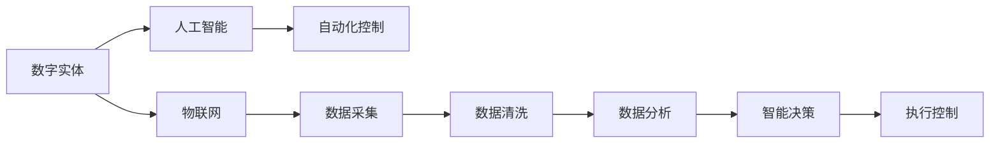
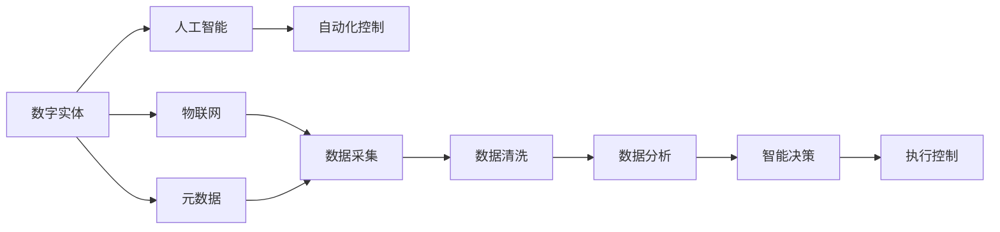

                 

# 数字实体与物理实体的自动化未来

在科技飞速发展的今天，数字实体与物理实体的深度融合，正在引领一场自动化与智能化的革命。本文将探讨这一趋势的核心概念、技术原理、实现步骤，并展望其未来发展方向。希望通过这篇技术文章，让读者更好地理解这一领域，抓住自动化未来带来的机遇。

## 1. 背景介绍

### 1.1 问题由来

随着物联网、人工智能等技术的进步，数字实体与物理实体的交互越来越频繁，从工业生产到智能家居，从智能医疗到智慧城市，数字世界正日益嵌入到物理世界的各个角落。如何更高效地管理物理实体，提升其智能化程度，成为当下亟待解决的问题。

在实际应用中，我们常常需要采集、处理大量的物理数据，并通过算法进行分析和决策。例如，在智能制造领域，需要对生产设备的运行状态进行实时监控，及时发现并解决异常，提高生产效率和产品质量；在智能医疗领域，需要对患者的健康数据进行智能分析，辅助医生进行精准诊断和治疗；在智慧交通领域，需要对交通流数据进行分析，优化交通管理，减少拥堵和事故。

传统的数据采集与处理方式通常效率低下、准确性差，且无法实现实时决策。因此，将物理实体与数字实体相结合，实现自动化处理，成为提升效率、改善服务质量的关键。

### 1.2 问题核心关键点

为更好地理解数字实体与物理实体的自动化融合，本文将介绍几个关键概念：

- **数字实体**：指通过数字技术构建的虚拟对象，如设备状态数据、患者健康数据等。
- **物理实体**：指现实世界的物质对象，如生产设备、医疗设备等。
- **物联网(IoT)**：指连接物理实体与数字实体的技术体系，通过传感器、网络等技术实现数据采集与传输。
- **人工智能(AI)**：指使用机器学习、深度学习等技术，实现数据的智能化处理和决策。
- **自动化控制**：指通过算法自动控制物理实体的行为，实现智能管理。
- **元数据**：指描述数据源、处理方式、质量等信息，用于数据管理和分析。

这些概念之间的逻辑关系可以通过以下Mermaid流程图来展示：



这个流程图展示了数字实体与物理实体融合的核心流程：

1. 数字实体通过物联网技术被采集到。
2. 采集的数据经清洗和分析，通过人工智能技术处理成有价值的信息。
3. 处理后的信息用于智能决策。
4. 决策结果通过自动化控制反馈到物理实体，实现自动化的管理与控制。

## 2. 核心概念与联系

### 2.1 核心概念概述

- **数字实体**：指通过数字技术构建的虚拟对象，如设备状态数据、患者健康数据等。
- **物理实体**：指现实世界的物质对象，如生产设备、医疗设备等。
- **物联网(IoT)**：指连接物理实体与数字实体的技术体系，通过传感器、网络等技术实现数据采集与传输。
- **人工智能(AI)**：指使用机器学习、深度学习等技术，实现数据的智能化处理和决策。
- **自动化控制**：指通过算法自动控制物理实体的行为，实现智能管理。
- **元数据**：指描述数据源、处理方式、质量等信息，用于数据管理和分析。

这些概念之间存在紧密的联系，共同构成了数字实体与物理实体融合的技术体系。数字实体与物理实体的结合，不仅需要强大的数据采集和处理能力，更需要高度智能化的人工智能系统来支撑决策。

### 2.2 核心概念原理和架构的 Mermaid 流程图



此图展示了数字实体与物理实体融合的技术架构：

1. 数字实体通过物联网技术被采集到。
2. 采集的数据经清洗和分析，通过人工智能技术处理成有价值的信息。
3. 处理后的信息用于智能决策。
4. 决策结果通过自动化控制反馈到物理实体，实现自动化的管理与控制。
5. 数字实体与物理实体的元数据管理系统，用于描述数据源、处理方式和质量等，保障数据管理的规范性和一致性。

## 3. 核心算法原理 & 具体操作步骤

### 3.1 算法原理概述

数字实体与物理实体的自动化融合，本质上是一个多源数据融合与智能决策的过程。其核心思想是：通过物联网技术采集物理实体的状态数据，利用人工智能技术对数据进行智能化处理和分析，形成有价值的信息，再通过自动化控制技术对物理实体进行自动化管理与控制。

形式化地，假设物理实体为 $O$，数字实体为 $D$，采集到的数据为 $S$，智能决策系统为 $A$，自动化控制系统为 $C$。融合过程可以表示为：

$$
A(O, D, S) = C(O, D, S)
$$

其中，$A$ 为智能决策系统，$C$ 为自动化控制系统，$O$ 和 $D$ 分别为物理实体和数字实体，$S$ 为采集到的数据。

### 3.2 算法步骤详解

基于数字实体与物理实体的自动化融合，具体步骤如下：

**Step 1: 数据采集**
- 通过物联网传感器、设备等采集物理实体的状态数据。
- 将数据存储到数字实体中，如数据库、数据仓库等。

**Step 2: 数据清洗与预处理**
- 对采集的数据进行清洗，去除噪音和异常值。
- 进行数据预处理，如归一化、去重、特征选择等。

**Step 3: 数据分析与建模**
- 对预处理后的数据进行统计分析、特征提取等。
- 建立机器学习或深度学习模型，对数据进行智能化处理。

**Step 4: 智能决策**
- 利用建立好的模型对采集到的数据进行预测或分类，形成有价值的信息。
- 将信息输入智能决策系统，进行自动化决策。

**Step 5: 自动化控制**
- 根据决策结果，通过自动化控制系统，控制物理实体。
- 通过反馈机制，不断优化决策过程。

### 3.3 算法优缺点

数字实体与物理实体的自动化融合算法，具有以下优点：

- **实时性**：通过物联网和自动化控制系统，可以实现数据的实时采集与处理，提高自动化管理效率。
- **智能化**：利用人工智能技术，可以实现数据的智能分析和决策，提升管理质量。
- **自动化**：通过自动化控制技术，可以实现对物理实体的精准控制，减少人工干预。

同时，该算法也存在一些局限性：

- **数据质量要求高**：需要采集和处理的数据质量高，以保证模型训练和预测的准确性。
- **系统复杂度高**：融合过程中涉及多个子系统，如数据采集、清洗、建模、决策等，系统复杂度高，维护难度大。
- **隐私和安全问题**：采集到的数据涉及物理实体的隐私信息，可能面临隐私泄露和数据安全问题。

### 3.4 算法应用领域

数字实体与物理实体的自动化融合，已经在多个领域得到广泛应用，例如：

- **智能制造**：通过采集生产设备的运行状态数据，实时监控设备状态，自动调整生产参数，提高生产效率和产品质量。
- **智能医疗**：采集患者的健康数据，通过智能分析进行疾病预测和诊断，辅助医生进行精准治疗。
- **智慧交通**：采集交通流数据，进行实时分析，优化交通管理，减少拥堵和事故。
- **智能安防**：采集监控视频和音频数据，进行实时分析，发现异常行为，提高安全管理水平。
- **智慧农业**：采集农田土壤和气象数据，进行智能分析和决策，提高农业生产效率和资源利用率。

除了上述这些经典应用外，数字实体与物理实体的自动化融合技术还在不断拓展新的应用场景，为各行业的数字化转型提供强有力的支持。

## 4. 数学模型和公式 & 详细讲解 & 举例说明

### 4.1 数学模型构建

为了更好地理解数字实体与物理实体的自动化融合算法，本文将使用数学语言对其实现过程进行更严格的刻画。

假设物理实体 $O$ 的状态向量为 $\mathbf{x}_O = [x_{O1}, x_{O2}, ..., x_{On}]^T$，数字实体 $D$ 的状态向量为 $\mathbf{x}_D = [x_{D1}, x_{D2}, ..., x_{Dm}]^T$，采集到的数据 $S$ 为 $[x_1, x_2, ..., x_n]^T$。智能决策系统 $A$ 的决策向量为 $\mathbf{x}_A = [x_{A1}, x_{A2}, ..., x_{Ak}]^T$，自动化控制系统 $C$ 的控制向量为 $\mathbf{x}_C = [x_{C1}, x_{C2}, ..., x_{Cl}]^T$。

融合过程可以表示为：

$$
A(O, D, S) = C(O, D, S)
$$

其中，$\mathbf{x}_A$ 和 $\mathbf{x}_C$ 分别表示智能决策和自动化控制的结果。

### 4.2 公式推导过程

以下我们以智能制造领域为例，推导数据融合与智能决策的数学模型。

假设采集到的设备状态数据 $S$ 为 $[x_1, x_2, ..., x_n]^T$，智能决策系统 $A$ 的决策向量为 $\mathbf{x}_A = [x_{A1}, x_{A2}, ..., x_{Ak}]^T$，其中 $x_{Ai}$ 表示对第 $i$ 个状态变量的决策结果。则融合过程可以表示为：

$$
x_{Ai} = f(x_{Oi}, x_{Di}, x_{Si})
$$

其中 $f$ 为融合函数，将物理实体状态 $\mathbf{x}_{Oi}$、数字实体状态 $\mathbf{x}_{Di}$ 和采集到的数据 $x_{Si}$ 映射到决策向量 $\mathbf{x}_{Ai}$。

在实际应用中，通常使用机器学习或深度学习模型实现 $f$。例如，可以使用神经网络对数据进行非线性映射，具体如下：

$$
x_{Ai} = g(\mathbf{W}x_{Si} + \mathbf{b})
$$

其中 $\mathbf{W}$ 为神经网络权重，$\mathbf{b}$ 为偏置项，$g$ 为激活函数。

### 4.3 案例分析与讲解

以智能制造领域为例，下面给出基于深度学习模型的数据融合与智能决策的实现过程：

1. **数据采集与清洗**：
   - 通过传感器采集设备状态数据 $S$，进行预处理，如去噪、归一化等。
   - 将数据存储到数据库中。

2. **模型训练**：
   - 设计神经网络模型，输入为 $x_1, x_2, ..., x_n$，输出为 $x_{A1}, x_{A2}, ..., x_{Ak}$。
   - 使用历史数据进行模型训练，调整权重和偏置，最小化损失函数。

3. **智能决策**：
   - 将新的设备状态数据 $S'$ 输入训练好的模型，得到决策向量 $\mathbf{x}_A'$。
   - 根据 $\mathbf{x}_A'$ 进行自动化控制。

### 4.4 案例分析与讲解

以智能制造领域为例，下面给出基于深度学习模型的数据融合与智能决策的实现过程：

1. **数据采集与清洗**：
   - 通过传感器采集设备状态数据 $S$，进行预处理，如去噪、归一化等。
   - 将数据存储到数据库中。

2. **模型训练**：
   - 设计神经网络模型，输入为 $x_1, x_2, ..., x_n$，输出为 $x_{A1}, x_{A2}, ..., x_{Ak}$。
   - 使用历史数据进行模型训练，调整权重和偏置，最小化损失函数。

3. **智能决策**：
   - 将新的设备状态数据 $S'$ 输入训练好的模型，得到决策向量 $\mathbf{x}_A'$。
   - 根据 $\mathbf{x}_A'$ 进行自动化控制。

## 5. 项目实践：代码实例和详细解释说明

### 5.1 开发环境搭建

在进行数字实体与物理实体的自动化融合实践前，我们需要准备好开发环境。以下是使用Python进行TensorFlow开发的环境配置流程：

1. 安装Anaconda：从官网下载并安装Anaconda，用于创建独立的Python环境。

2. 创建并激活虚拟环境：
```bash
conda create -n tf-env python=3.8 
conda activate tf-env
```

3. 安装TensorFlow：根据CUDA版本，从官网获取对应的安装命令。例如：
```bash
conda install tensorflow -c pytorch -c conda-forge
```

4. 安装TensorBoard：
```bash
pip install tensorboard
```

5. 安装各类工具包：
```bash
pip install numpy pandas scikit-learn matplotlib tqdm jupyter notebook ipython
```

完成上述步骤后，即可在`tf-env`环境中开始自动化融合实践。

### 5.2 源代码详细实现

下面我们以智能制造领域为例，给出使用TensorFlow对设备状态数据进行智能决策的PyTorch代码实现。

首先，定义数据预处理函数：

```python
import tensorflow as tf
from tensorflow.keras import layers

def preprocess_data(data):
    # 数据去噪、归一化等预处理操作
    return preprocessed_data
```

然后，定义神经网络模型：

```python
model = tf.keras.Sequential([
    layers.Dense(64, activation='relu', input_shape=(num_features,)),
    layers.Dense(64, activation='relu'),
    layers.Dense(num_labels, activation='softmax')
])
```

接着，定义训练和评估函数：

```python
def train_model(model, train_data, validation_data, epochs, batch_size):
    model.compile(optimizer='adam', loss='categorical_crossentropy', metrics=['accuracy'])
    model.fit(train_data, epochs=epochs, validation_data=validation_data, batch_size=batch_size)

def evaluate_model(model, test_data):
    test_loss, test_acc = model.evaluate(test_data)
    print(f'Test accuracy: {test_acc:.2f}')
```

最后，启动训练流程并在测试集上评估：

```python
# 准备数据集
train_dataset = ...
val_dataset = ...
test_dataset = ...

# 训练模型
epochs = 10
batch_size = 32

model = train_model(model, train_dataset, val_dataset, epochs, batch_size)

# 评估模型
evaluate_model(model, test_dataset)
```

以上就是使用TensorFlow对设备状态数据进行智能决策的完整代码实现。可以看到，得益于TensorFlow的强大封装，我们可以用相对简洁的代码完成神经网络的训练和评估。

### 5.3 代码解读与分析

让我们再详细解读一下关键代码的实现细节：

**preprocess_data函数**：
- 定义数据预处理函数，包括数据去噪、归一化等操作。

**神经网络模型**：
- 定义一个包含两个隐藏层的神经网络模型，输入为设备状态数据，输出为决策结果。

**train_model函数**：
- 使用Adam优化器和交叉熵损失函数训练模型，并设置训练轮数和批大小。
- 在训练集上训练模型，并在验证集上进行评估，返回模型实例。

**evaluate_model函数**：
- 在测试集上评估模型性能，输出测试准确率。

**训练流程**：
- 定义总的训练轮数和批大小，开始循环迭代
- 每个epoch内，在训练集上训练，输出模型性能
- 在验证集上评估，调整模型参数
- 所有epoch结束后，在测试集上评估，给出最终测试结果

可以看到，TensorFlow提供了丰富的API和工具，使得神经网络模型的训练和评估变得高效便捷。通过这些工具，我们可以快速迭代和优化模型，提升自动化融合的效率和效果。

当然，工业级的系统实现还需考虑更多因素，如模型的保存和部署、超参数的自动搜索、更灵活的任务适配层等。但核心的自动化融合过程基本与此类似。

## 6. 实际应用场景

### 6.1 智能制造

数字实体与物理实体的自动化融合，在智能制造领域具有广阔的应用前景。通过采集生产设备的运行状态数据，实时监控设备状态，自动调整生产参数，提高生产效率和产品质量。

在技术实现上，可以设计神经网络模型，将设备状态数据作为输入，输出为设备的维护和生产参数调整策略。模型训练时，使用历史数据进行监督学习，调整权重和偏置，最小化损失函数。训练好的模型部署在生产线上，可以实时采集设备状态数据，进行智能决策，自动调整生产参数，提高生产效率和产品质量。

### 6.2 智能医疗

采集患者的健康数据，通过智能分析进行疾病预测和诊断，辅助医生进行精准治疗。在技术实现上，可以设计神经网络模型，将患者健康数据作为输入，输出为疾病预测和诊断结果。模型训练时，使用历史病历数据进行监督学习，调整权重和偏置，最小化损失函数。训练好的模型部署在医疗系统中，可以实时采集患者健康数据，进行智能分析，辅助医生进行精准治疗。

### 6.3 智慧交通

采集交通流数据，进行实时分析，优化交通管理，减少拥堵和事故。在技术实现上，可以设计神经网络模型，将交通流数据作为输入，输出为交通管理策略。模型训练时，使用历史交通数据进行监督学习，调整权重和偏置，最小化损失函数。训练好的模型部署在交通管理中心，可以实时采集交通流数据，进行智能分析，优化交通管理策略，减少拥堵和事故。

### 6.4 未来应用展望

随着数字实体与物理实体的深度融合，未来的自动化技术将更加智能化、普适化，带来更多新的应用场景。

在智慧农业领域，采集农田土壤和气象数据，进行智能分析和决策，提高农业生产效率和资源利用率。

在智慧城市治理中，采集城市事件数据，进行实时分析，优化城市管理，提升城市运行效率和居民生活质量。

在智能物流领域，采集物流数据，进行实时分析，优化物流路线和仓储管理，提高物流效率和成本控制能力。

此外，在金融、能源、教育等更多领域，数字实体与物理实体的自动化融合技术也将不断拓展，为各行业的数字化转型提供强有力的支持。

## 7. 工具和资源推荐

### 7.1 学习资源推荐

为了帮助开发者系统掌握数字实体与物理实体的自动化融合技术，这里推荐一些优质的学习资源：

1. 《深度学习与数据融合》系列博文：由大模型技术专家撰写，深入浅出地介绍了深度学习在数据融合中的应用。

2. 《物联网技术与应用》课程：清华大学开设的物联网课程，有Lecture视频和配套作业，带你入门物联网技术。

3. 《人工智能基础》书籍：深度学习领域的入门书籍，详细介绍了人工智能的基本概念和经典模型。

4. TensorFlow官方文档：TensorFlow的官方文档，提供了丰富的API和工具，是进行神经网络模型训练和部署的重要参考资料。

5. TensorBoard使用指南：TensorFlow配套的可视化工具，可实时监测模型训练状态，并提供丰富的图表呈现方式，是调试模型的得力助手。

通过学习这些资源，相信你一定能够快速掌握数字实体与物理实体的自动化融合技术的精髓，并用于解决实际的自动化问题。

### 7.2 开发工具推荐

高效的开发离不开优秀的工具支持。以下是几款用于数字实体与物理实体的自动化融合开发的常用工具：

1. TensorFlow：由Google主导开发的开源深度学习框架，生产部署方便，适合大规模工程应用。提供了丰富的API和工具，适合神经网络模型的训练和部署。

2. PyTorch：基于Python的开源深度学习框架，灵活动态的计算图，适合快速迭代研究。

3. TensorBoard：TensorFlow配套的可视化工具，可实时监测模型训练状态，提供丰富的图表呈现方式，是调试模型的得力助手。

4. Jupyter Notebook：Python编程的交互式开发环境，方便快速迭代和验证模型。

5. Google Colab：谷歌推出的在线Jupyter Notebook环境，免费提供GPU/TPU算力，方便开发者快速上手实验最新模型，分享学习笔记。

合理利用这些工具，可以显著提升数字实体与物理实体的自动化融合任务的开发效率，加快创新迭代的步伐。

### 7.3 相关论文推荐

数字实体与物理实体的自动化融合技术的发展源于学界的持续研究。以下是几篇奠基性的相关论文，推荐阅读：

1. 《IoT数据融合与分析》：综述了物联网数据融合与分析的技术方法，介绍了常见的数据采集和处理技术。

2. 《深度学习在智能制造中的应用》：探讨了深度学习在智能制造中的具体应用，如设备状态监测、故障诊断等。

3. 《智慧医疗中的数据融合与分析》：探讨了智慧医疗中的数据融合与分析技术，介绍了常见的智能分析方法。

4. 《基于深度学习的多源数据融合方法》：综述了基于深度学习的多源数据融合方法，介绍了不同的融合模型和算法。

5. 《智能交通中的数据融合与决策》：探讨了智能交通中的数据融合与决策技术，介绍了常见的交通数据分析方法。

这些论文代表了大规模数据融合与智能决策的研究脉络。通过学习这些前沿成果，可以帮助研究者把握学科前进方向，激发更多的创新灵感。

## 8. 总结：未来发展趋势与挑战

### 8.1 总结

本文对数字实体与物理实体的自动化融合方法进行了全面系统的介绍。首先阐述了数字实体与物理实体的自动化融合技术的研究背景和意义，明确了融合技术在提升效率、改善服务质量方面的独特价值。其次，从原理到实践，详细讲解了融合技术的数学原理和关键步骤，给出了融合任务开发的完整代码实例。同时，本文还广泛探讨了融合技术在智能制造、智能医疗、智慧交通等多个行业领域的应用前景，展示了融合技术的巨大潜力。最后，本文精选了融合技术的各类学习资源，力求为读者提供全方位的技术指引。

通过本文的系统梳理，可以看到，数字实体与物理实体的自动化融合技术正在成为各行业的数字化转型的重要手段，为传统行业带来变革性影响。未来，伴随数据采集和处理技术的不断进步，以及深度学习模型的不断发展，数字实体与物理实体的融合将更加深入和广泛，为智能化、自动化提供更多可能。

### 8.2 未来发展趋势

展望未来，数字实体与物理实体的自动化融合技术将呈现以下几个发展趋势：

1. **智能化水平提升**：随着深度学习模型的不断发展，自动化融合技术将更加智能化，具备更强的决策能力和智能分析能力。

2. **普适性增强**：自动化融合技术将更加普适化，可以应用于更多行业和场景，提升各行业的智能化水平。

3. **边缘计算支持**：在物联网设备众多、数据量巨大的场景下，边缘计算技术将为自动化融合提供更高效的数据处理和分析支持。

4. **5G/6G技术应用**：5G/6G技术的普及将为自动化融合提供更高效的通信支持，进一步提升数据采集和处理的实时性和可靠性。

5. **联邦学习应用**：通过联邦学习技术，可以实现数据在本地设备上的分布式训练，保护数据隐私的同时，提升模型性能。

6. **多模态融合**：将数字实体与物理实体的数据进行多模态融合，如视觉、语音、传感器数据等，提升融合模型的综合感知能力。

以上趋势凸显了数字实体与物理实体的自动化融合技术的广阔前景。这些方向的探索发展，必将进一步提升各行业的智能化水平，为社会的数字化转型提供强有力的支持。

### 8.3 面临的挑战

尽管数字实体与物理实体的自动化融合技术已经取得了显著进展，但在迈向更加智能化、普适化应用的过程中，仍面临诸多挑战：

1. **数据质量要求高**：需要采集和处理的数据质量高，以保证模型训练和预测的准确性。
2. **系统复杂度高**：融合过程中涉及多个子系统，如数据采集、清洗、建模、决策等，系统复杂度高，维护难度大。
3. **隐私和安全问题**：采集到的数据涉及物理实体的隐私信息，可能面临隐私泄露和数据安全问题。
4. **计算资源需求高**：大规模数据处理和深度学习模型的训练需要高计算资源，可能面临计算资源瓶颈。
5. **实时性要求高**：在实时决策场景下，对数据处理和模型推理的速度要求高，可能面临实时性挑战。

### 8.4 研究展望

面对数字实体与物理实体的自动化融合技术所面临的挑战，未来的研究需要在以下几个方面寻求新的突破：

1. **数据采集与处理技术**：提升数据采集和处理的自动化程度，降低人工干预，提高数据质量。

2. **深度学习模型的优化**：设计更加高效、灵活的深度学习模型，提升融合过程的智能化水平。

3. **数据隐私与安全保护**：研究数据隐私保护技术，如差分隐私、联邦学习等，保护数据安全。

4. **计算资源优化**：优化计算资源配置，如使用混合精度训练、模型并行等技术，提高计算效率。

5. **实时性提升**：研究高效的计算图优化和推理加速技术，提升数据处理和模型推理的速度。

6. **多模态融合**：研究多模态数据融合技术，提升融合模型的综合感知能力。

这些研究方向的探索，必将引领数字实体与物理实体的自动化融合技术迈向更高的台阶，为构建智能化的自动化系统提供坚实的技术保障。

## 9. 附录：常见问题与解答

**Q1：数字实体与物理实体的自动化融合技术是否适用于所有场景？**

A: 数字实体与物理实体的自动化融合技术在大多数场景下都有广泛应用，如智能制造、智能医疗、智慧交通等。但对于一些特殊场景，如极端环境、高风险领域等，可能还需要结合专家知识进行人工干预。

**Q2：融合过程中如何选择最优的融合方法？**

A: 融合方法的选择需要根据具体场景和数据特点进行综合考虑。常用的融合方法包括多源数据融合、加权平均、softmax融合等。在实际应用中，可以使用交叉验证等方法，评估不同融合方法的效果，选择最优的融合策略。

**Q3：融合过程中如何处理数据丢失和异常值？**

A: 数据丢失和异常值是数据采集过程中常见的现象。处理方法包括插值法、数据补全、异常值检测和处理等。在实际应用中，需要根据数据特点选择合适的方法，保证数据处理的准确性。

**Q4：融合过程中如何提升模型的实时性？**

A: 提升模型的实时性可以通过优化计算图、使用分布式训练、优化模型结构等方法实现。同时，可以使用边缘计算等技术，在本地设备上进行数据处理和模型推理，减少数据传输时间。

**Q5：融合过程中如何保护数据隐私和安全？**

A: 数据隐私和安全是自动化融合技术中重要的考虑因素。常用的方法包括差分隐私、联邦学习、加密传输等。在实际应用中，需要结合具体场景，选择合适的方法，保护数据隐私和安全。

综上所述，数字实体与物理实体的自动化融合技术正引领一场自动化与智能化的革命，为各行业的数字化转型提供了强有力的支持。通过不断优化融合技术，提升智能化水平，未来将迎来更加智能化、普适化的自动化新时代。

