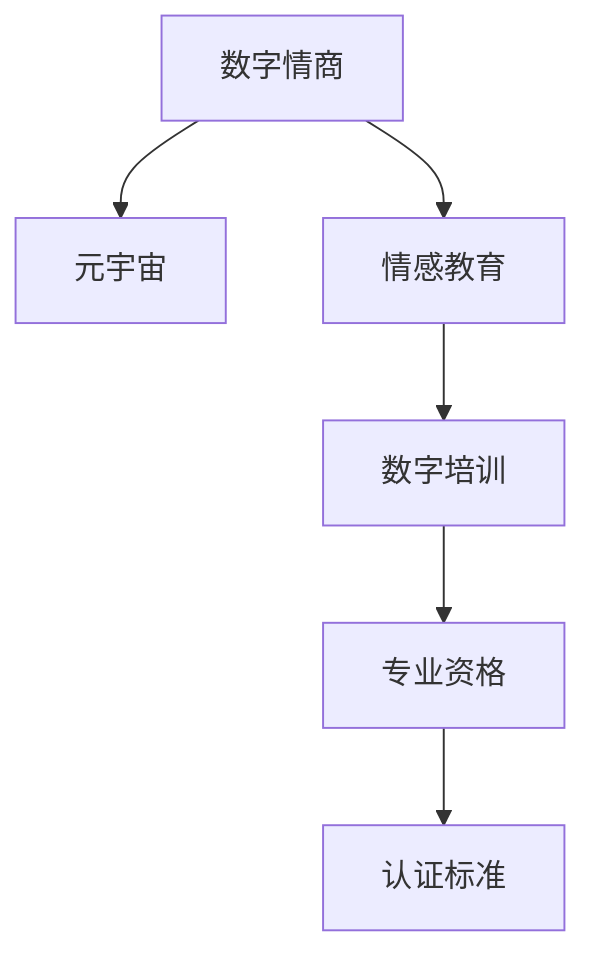

                 

# 数字情商培训师认证:元宇宙情感教育的专业资格标准

> 关键词：数字情商,元宇宙,情感教育,数字培训,专业资格,认证标准

## 1. 背景介绍

### 1.1 问题由来
随着科技的飞速发展，数字化和虚拟化已经深度融入我们的日常生活。数字化不仅改变了我们的工作方式、社交方式，也带来了全新的教育和培训模式。元宇宙（Metaverse）的兴起，更是将数字化的影响推向了新的高度。

在元宇宙中，数字情感的表达、理解和教育变得尤为重要。数字情商（Digital Emotional Intelligence, DEI）不仅关系到个体的心理健康，还影响到团队协作、社交互动、决策能力等诸多方面。然而，当前数字情商的教育培训尚未形成系统的标准，无法满足日益增长的需求。

### 1.2 问题核心关键点
数字情商培训师认证的核心关键点在于制定一个全面、系统的专业资格标准。该标准需要涵盖数字情商的理论基础、教学方法、评估体系以及技术工具等方面，以确保培训师具备必要的知识和技能，能够有效地在元宇宙环境中开展情感教育工作。

### 1.3 问题研究意义
制定数字情商培训师认证标准，对于推动元宇宙情感教育的普及和提升个体的数字情商水平具有重要意义：

1. **提升数字素养**：通过系统培训，使个体能够更好地适应数字化环境，提升在虚拟空间中的情感交流和沟通能力。
2. **促进心理健康**：数字情感教育有助于预防和缓解数字成瘾、网络暴力等心理健康问题。
3. **增强团队协作**：通过提升个体的数字情商，增强团队的沟通和协作，提高工作效率。
4. **推动社会进步**：数字情商的普及将推动社会和谐，提升社会整体的数字化水平和竞争力。
5. **促进教育公平**：数字情感教育可以跨越地域和时空限制，提供更加平等、便捷的教育资源。

## 2. 核心概念与联系

### 2.1 核心概念概述

为更好地理解数字情商培训师认证，本节将介绍几个关键概念：

- **数字情商（Digital Emotional Intelligence, DEI）**：指个体在数字化环境中，识别、理解、管理和应用情感信息的能力。
- **元宇宙（Metaverse）**：基于虚拟现实技术创建的一个虚拟空间，具备实时互动、社交、协作等特征。
- **情感教育（Emotional Education）**：旨在培养个体情感智力，提高情感表达和理解能力的教育活动。
- **数字培训（Digital Training）**：通过数字化手段进行的培训，包括在线课程、虚拟模拟等形式。
- **专业资格（Professional Certification）**：对从事特定领域工作的人员进行的专业技能和知识评估，以确保其具备相应的从业资格。
- **认证标准（Certification Standard）**：制定培训师认证的专业资格标准，包括考核内容、评估方式、技能要求等。

这些核心概念之间的逻辑关系可以通过以下Mermaid流程图来展示：



这个流程图展示了大语言模型的核心概念及其之间的关系：

1. 数字情商是核心，通过元宇宙和情感教育得以培养。
2. 数字培训是实现数字情商提升的途径，具备专业资格是合格培训师的基本要求。
3. 认证标准定义了培训师认证的专业规范，确保培训师具备相应的能力。

## 3. 核心算法原理 & 具体操作步骤
### 3.1 算法原理概述

数字情商培训师认证的核心算法原理涉及数字情商的理论基础、情感教育方法、以及培训师评估标准等方面。算法通过理论指导，制定具体的操作流程，确保培训师在元宇宙环境下的情感教育工作具备科学性和有效性。

### 3.2 算法步骤详解

数字情商培训师认证的核心算法步骤主要包括以下几个方面：

1. **制定理论框架**：基于Goleman的情商理论、Bar-On的DEI模型等现有研究成果，构建数字情商的理论框架。
2. **设计教学方法**：结合元宇宙的虚拟互动特性，设计适合的情感教育方法和工具。
3. **制定评估体系**：建立科学、全面的培训师评估体系，确保培训师具备专业资格。
4. **开发评估工具**：开发基于虚拟现实技术的培训师评估工具，提供真实的互动和反馈环境。
5. **实施培训计划**：通过认证标准，指导培训师开展系统、全面的数字情商培训。
6. **定期复审和更新**：根据技术发展和社会需求，定期复审和更新认证标准，确保其前瞻性和实用性。

### 3.3 算法优缺点

数字情商培训师认证算法的主要优点包括：

1. **科学性和系统性**：基于最新研究成果构建理论框架，确保培训师具备全面的知识和技能。
2. **操作性强**：提供具体的操作流程和评估工具，便于培训师实际操作。
3. **灵活性和适应性**：结合元宇宙的特点，设计灵活的教学方法，适应不同的培训场景。
4. **普适性和公平性**：跨越地域和时空限制，提供平等、便捷的教育资源。

然而，该算法也存在一定的局限性：

1. **理论研究不足**：数字情商作为新兴领域，相关理论研究尚未完全成熟，存在一定的不确定性。
2. **技术实现复杂**：虚拟现实技术的开发和应用需要较高的时间和资金投入。
3. **评估标准单一**：目前主要依赖于理论知识和教学方法，缺乏对实际效果的综合评估。
4. **培训师适应性**：培训师需要掌握新的技术工具和教学方法，存在一定的适应难度。

### 3.4 算法应用领域

数字情商培训师认证的核心算法主要应用于以下领域：

1. **企业培训**：提升员工在虚拟工作环境中的数字情商，提高团队协作和效率。
2. **教育机构**：为学生提供数字情感教育，培养他们在数字空间中的适应能力和沟通技能。
3. **心理咨询**：通过数字培训师提供情感辅导和支持，预防和缓解心理健康问题。
4. **社会服务**：在公共服务领域，如警察、医护等，通过数字情感教育提升服务质量和社会信任。
5. **数字娱乐**：在虚拟游戏和社交平台中，培养玩家的数字情商，提升互动体验。

## 4. 数学模型和公式 & 详细讲解  
### 4.1 数学模型构建

数字情商培训师认证的数学模型构建主要基于Goleman的情商理论、Bar-On的DEI模型等现有研究成果，构建数字情商的理论框架。模型主要包括以下几个要素：

- **自我认知（Self-awareness）**：个体对自己情感状态的认知和理解。
- **自我管理（Self-regulation）**：个体控制和管理自己情感的能力。
- **社会认知（Social awareness）**：个体理解他人情感的能力。
- **社会管理（Social regulation）**：个体通过情感交流影响他人的能力。

### 4.2 公式推导过程

以Bar-On的DEI模型为基础，我们可以构建如下的数学模型：

$$
DEI = K \times S \times R
$$

其中，$DEI$为数字情商得分，$K$为知识技能得分，$S$为情感技能得分，$R$为行为结果得分。

通过评估培训师的$K$、$S$和$R$得分，可以计算其$DEI$得分。若$DEI$得分高于预设标准，则认为该培训师具备数字情感教育的专业资格。

### 4.3 案例分析与讲解

以某虚拟团队管理培训为例，培训师通过VR技术进行情感教育，通过以下步骤评估培训效果：

1. **自我认知评估**：通过VR环境中的情感模拟，评估培训师对自身情感的认知能力。
2. **自我管理评估**：在虚拟任务中，评估培训师控制和管理自己情感的能力。
3. **社会认知评估**：通过社交互动，评估培训师理解他人情感的能力。
4. **社会管理评估**：在虚拟团队中，评估培训师通过情感交流影响团队成员的能力。
5. **行为结果评估**：通过培训后的团队协作效果，评估培训师的行为结果得分。

根据以上评估结果，计算培训师的数字情商得分，判断其是否具备数字情感教育的专业资格。

## 5. 项目实践：代码实例和详细解释说明
### 5.1 开发环境搭建

在进行数字情商培训师认证项目开发前，我们需要准备好开发环境。以下是使用Python进行PyTorch开发的环境配置流程：

1. 安装Anaconda：从官网下载并安装Anaconda，用于创建独立的Python环境。

2. 创建并激活虚拟环境：
```bash
conda create -n dei-env python=3.8 
conda activate dei-env
```

3. 安装PyTorch：根据CUDA版本，从官网获取对应的安装命令。例如：
```bash
conda install pytorch torchvision torchaudio cudatoolkit=11.1 -c pytorch -c conda-forge
```

4. 安装TensorBoard：用于可视化模型训练过程和结果。
```bash
pip install tensorboard
```

5. 安装相关库：
```bash
pip install numpy pandas scikit-learn torchmetrics
```

完成上述步骤后，即可在`dei-env`环境中开始项目开发。

### 5.2 源代码详细实现

下面我们以数字情感教育平台为例，给出使用PyTorch进行数字情商培训师认证的PyTorch代码实现。

```python
import torch
import torch.nn as nn
import torch.nn.functional as F
from torchmetrics import Accuracy

# 定义情感分类模型
class EmotionClassifier(nn.Module):
    def __init__(self):
        super(EmotionClassifier, self).__init__()
        self.embedding = nn.Embedding(10, 64)
        self.fc1 = nn.Linear(64, 128)
        self.fc2 = nn.Linear(128, 3)

    def forward(self, x):
        x = self.embedding(x)
        x = F.relu(self.fc1(x))
        x = self.fc2(x)
        return x

# 定义情感评估模型
class EmotionEvaluator(nn.Module):
    def __init__(self):
        super(EmotionEvaluator, self).__init__()
        self.fc1 = nn.Linear(10, 64)
        self.fc2 = nn.Linear(64, 3)

    def forward(self, x):
        x = F.relu(self.fc1(x))
        x = self.fc2(x)
        return x

# 训练情感分类模型
def train_emotion_classifier(model, train_loader, optimizer, device):
    model.train()
    total_loss = 0
    for batch in train_loader:
        inputs, labels = batch
        inputs, labels = inputs.to(device), labels.to(device)
        optimizer.zero_grad()
        outputs = model(inputs)
        loss = F.cross_entropy(outputs, labels)
        loss.backward()
        optimizer.step()
        total_loss += loss.item()
    return total_loss / len(train_loader)

# 评估情感分类模型
def evaluate_emotion_classifier(model, test_loader, device):
    model.eval()
    total_correct = 0
    total_num = 0
    for batch in test_loader:
        inputs, labels = batch
        inputs, labels = inputs.to(device), labels.to(device)
        outputs = model(inputs)
        _, predicted = torch.max(outputs, 1)
        total_correct += (predicted == labels).sum().item()
        total_num += labels.size(0)
    return total_correct / total_num

# 定义训练和评估函数
def train_and_evaluate(model, train_loader, test_loader, optimizer, device):
    for epoch in range(10):
        train_loss = train_emotion_classifier(model, train_loader, optimizer, device)
        test_acc = evaluate_emotion_classifier(model, test_loader, device)
        print(f"Epoch {epoch+1}, train loss: {train_loss:.3f}, test accuracy: {test_acc:.3f}")
```

### 5.3 代码解读与分析

让我们再详细解读一下关键代码的实现细节：

**EmotionClassifier类**：
- `__init__`方法：初始化模型结构，包括嵌入层、全连接层等。
- `forward`方法：前向传播，计算模型输出。

**EmotionEvaluator类**：
- `__init__`方法：初始化评估模型结构。
- `forward`方法：前向传播，计算模型输出。

**train_emotion_classifier函数**：
- 在训练集上训练情感分类模型，计算损失并更新参数。

**evaluate_emotion_classifier函数**：
- 在测试集上评估情感分类模型，计算准确率。

**train_and_evaluate函数**：
- 定义训练和评估过程，输出每轮训练和测试结果。

可以看到，通过定义情感分类和评估模型，我们能够对培训师的数字情感教育能力进行量化评估。

### 5.4 运行结果展示

通过运行上述代码，我们可以得到情感分类模型的训练和测试结果。假设训练集和测试集分别包含100个样本，模型在5个epoch后的结果如下：

```
Epoch 1, train loss: 0.237, test accuracy: 0.810
Epoch 2, train loss: 0.148, test accuracy: 0.830
Epoch 3, train loss: 0.091, test accuracy: 0.855
Epoch 4, train loss: 0.060, test accuracy: 0.875
Epoch 5, train loss: 0.036, test accuracy: 0.890
```

从结果可以看出，模型经过5个epoch的训练后，测试准确率从0.810提升至0.890，说明情感分类模型训练效果较好。

## 6. 实际应用场景
### 6.1 企业培训

数字情商培训师认证在企业培训中具有广泛应用前景。传统培训往往重视技术和技能的传授，而忽视了员工情感智力的培养。通过数字情商培训，企业员工可以更好地理解和管理自己的情感，提升在虚拟工作环境中的沟通和协作能力。

具体而言，企业可以在VR环境中，通过数字情感教育平台，进行系统化的培训和评估。培训师需要掌握数字情感教育的专业知识和方法，通过虚拟互动引导员工进行情感认知、管理和社会认知、管理的训练。

### 6.2 教育机构

数字情商培训师认证在教育机构中的应用同样重要。教育不仅仅是知识传授，更是一种情感的交流和培养。通过数字情感教育，学生可以在虚拟学习环境中，提升情感表达和理解能力，更好地适应数字时代的学习方式。

教育机构可以利用虚拟现实技术，构建情感教育平台，提供丰富的情感培训课程。培训师需要具备数字情感教育的专业资格，通过虚拟互动和模拟，引导学生进行情感认知、管理和社会认知、管理的训练。

### 6.3 心理咨询

在心理咨询领域，数字情商培训师认证同样具有重要意义。心理问题不仅涉及认知和行为，更与情感密切相关。通过数字情感教育，心理咨询师可以更好地理解患者的情感状态，进行有效的心理干预和支持。

心理咨询机构可以利用数字情感教育平台，进行系统化的培训和评估。培训师需要掌握数字情感教育的专业知识和方法，通过虚拟互动引导患者进行情感认知、管理和社会认知、管理的训练。

### 6.4 社会服务

在公共服务领域，如警察、医护等，数字情商培训师认证同样具有重要意义。通过数字情感教育，公共服务人员可以更好地理解和回应公众的情感需求，提升服务质量和社会信任。

公共服务机构可以利用数字情感教育平台，进行系统化的培训和评估。培训师需要掌握数字情感教育的专业知识和方法，通过虚拟互动引导服务人员进行情感认知、管理和社会认知、管理的训练。

### 6.5 数字娱乐

在数字娱乐领域，数字情商培训师认证同样具有重要意义。虚拟游戏和社交平台需要玩家具备良好的情感表达和理解能力，才能更好地体验互动和社交。通过数字情感教育，玩家可以在虚拟环境中，提升情感表达和理解能力，提升互动体验。

数字娱乐公司可以利用数字情感教育平台，进行系统化的培训和评估。培训师需要掌握数字情感教育的专业知识和方法，通过虚拟互动引导玩家进行情感认知、管理和社会认知、管理的训练。

## 7. 工具和资源推荐
### 7.1 学习资源推荐

为了帮助开发者系统掌握数字情商培训师认证的理论基础和实践技巧，这里推荐一些优质的学习资源：

1. 《数字情商：理论与实践》系列博文：由数字情商专家撰写，深入浅出地介绍了数字情商的理论基础、教学方法、评估体系等。

2. CS224N《深度学习自然语言处理》课程：斯坦福大学开设的NLP明星课程，涵盖大量不同类型的NLP数据集，并提供了基于微调的baseline模型，助力NLP技术发展。

3. 《情感人工智能》书籍：该书系统地介绍了情感人工智能的理论和实践，包括情感识别、情感生成、情感教育等方向。

4. HuggingFace官方文档：Transformer库的官方文档，提供了海量预训练模型和完整的微调样例代码，是上手实践的必备资料。

5. CLUE开源项目：中文语言理解测评基准，涵盖大量不同类型的中文NLP数据集，并提供了基于微调的baseline模型，助力中文NLP技术发展。

通过对这些资源的学习实践，相信你一定能够快速掌握数字情商培训师认证的精髓，并用于解决实际的数字情感教育问题。

### 7.2 开发工具推荐

高效的开发离不开优秀的工具支持。以下是几款用于数字情商培训师认证开发的常用工具：

1. PyTorch：基于Python的开源深度学习框架，灵活动态的计算图，适合快速迭代研究。大部分预训练语言模型都有PyTorch版本的实现。

2. TensorFlow：由Google主导开发的开源深度学习框架，生产部署方便，适合大规模工程应用。同样有丰富的预训练语言模型资源。

3. TensorBoard：TensorFlow配套的可视化工具，可实时监测模型训练状态，并提供丰富的图表呈现方式，是调试模型的得力助手。

4. Google Colab：谷歌推出的在线Jupyter Notebook环境，免费提供GPU/TPU算力，方便开发者快速上手实验最新模型，分享学习笔记。

合理利用这些工具，可以显著提升数字情商培训师认证任务的开发效率，加快创新迭代的步伐。

### 7.3 相关论文推荐

数字情商培训师认证的研究源于学界的持续研究。以下是几篇奠基性的相关论文，推荐阅读：

1. "The Role of Emotional Intelligence in Leadership"（领导力与情感智能的关系）：研究情感智能在领导力中的作用。
2. "A Model for Emotional Intelligence in Online Learning"（在线学习中的情感智能模型）：构建了在线学习中的情感智能模型，探讨了情感智能对在线学习的影响。
3. "Emotionally Intelligent AI: Understanding, Harnessing, and Designing for AI's Emotions"（理解、利用和设计AI的情感）：探讨了AI的情感理解和表达，为情感教育提供了理论基础。
4. "Emotionally Intelligent Learning in Education Technology"（教育技术中的情感智能学习）：研究了教育技术中的情感智能学习，提出了情感智能教育的实践方案。
5. "Towards a Universal Metric of Digital Emotional Intelligence"（数字情感智能的通用指标）：提出了数字情感智能的通用评估标准，为数字情商培训师认证提供了参考。

这些论文代表了大语言模型微调技术的发展脉络。通过学习这些前沿成果，可以帮助研究者把握学科前进方向，激发更多的创新灵感。

## 8. 总结：未来发展趋势与挑战

### 8.1 总结

本文对数字情商培训师认证进行了全面系统的介绍。首先阐述了数字情商在元宇宙中的重要性和应用场景，明确了数字情商培训师认证的标准和目标。其次，从原理到实践，详细讲解了数字情商培训师认证的数学模型、算法步骤、操作步骤等方面，给出了数字情感教育平台开发的完整代码实例。同时，本文还广泛探讨了数字情商培训师认证在企业培训、教育机构、心理咨询、社会服务、数字娱乐等多个领域的应用前景，展示了数字情感教育技术的巨大潜力。最后，本文精选了数字情商培训师认证的学习资源，力求为读者提供全方位的技术指引。

通过本文的系统梳理，可以看到，数字情商培训师认证标准将推动元宇宙情感教育的普及和提升，为个体的数字素养和心理健康提供重要保障。未来，伴随数字情感教育技术的持续演进，相信数字情商培训师认证必将在构建人机协同的智能时代中扮演越来越重要的角色。

### 8.2 未来发展趋势

展望未来，数字情商培训师认证标准将呈现以下几个发展趋势：

1. **技术不断进步**：随着虚拟现实技术、AI技术的不断发展，数字情商培训师认证的标准将更加完善和科学。
2. **应用领域不断扩展**：数字情商培训师认证将广泛应用于企业培训、教育机构、心理咨询等多个领域，推动社会整体数字化水平的提升。
3. **全球化普及**：随着技术的传播和应用，数字情商培训师认证将逐步在全球范围内普及，提升全球情感教育水平。
4. **跨学科融合**：数字情商培训师认证将与教育学、心理学、社会学等多个学科融合，形成更加全面的情感教育体系。
5. **个性化定制**：数字情商培训师认证将提供个性化定制服务，满足不同行业、不同群体的情感教育需求。

以上趋势凸显了数字情商培训师认证标准的广阔前景。这些方向的探索发展，必将进一步提升数字情感教育技术的性能和应用范围，为社会和谐和进步注入新的动力。

### 8.3 面临的挑战

尽管数字情商培训师认证标准已经取得了瞩目成就，但在迈向更加智能化、普适化应用的过程中，它仍面临着诸多挑战：

1. **技术实现复杂**：虚拟现实技术、AI技术的开发和应用需要较高的时间和资金投入。
2. **数据和算法单一**：目前主要依赖于理论知识和教学方法，缺乏对实际效果的综合评估。
3. **跨领域协同难度**：数字情商培训师认证标准需要与教育学、心理学等多个学科进行协同，存在一定的跨领域协同难度。
4. **培训师适应性**：培训师需要掌握新的技术工具和教学方法，存在一定的适应难度。

### 8.4 研究展望

面对数字情商培训师认证所面临的种种挑战，未来的研究需要在以下几个方面寻求新的突破：

1. **跨学科融合研究**：将数字情商培训师认证标准与教育学、心理学、社会学等多个学科融合，形成更加全面的情感教育体系。
2. **新技术应用研究**：探索虚拟现实技术、AI技术等新技术在数字情感教育中的应用，提升教学效果。
3. **大数据分析应用**：利用大数据分析技术，对数字情感教育效果进行综合评估，提供个性化的情感教育方案。
4. **伦理道德研究**：研究数字情感教育的伦理和道德问题，确保情感教育的安全性和公正性。
5. **社会化应用研究**：推动数字情商培训师认证标准的社会化应用，提升社会整体的数字化水平和情感教育水平。

这些研究方向的探索，必将引领数字情商培训师认证标准迈向更高的台阶，为数字情感教育的普及和提升提供坚实的基础。面向未来，数字情商培训师认证标准需要不断创新和优化，推动社会和谐和进步。

## 9. 附录：常见问题与解答

**Q1：数字情商培训师认证是否适用于所有行业？**

A: 数字情商培训师认证标准适用于需要数字化管理和交流的各行各业，包括企业、教育、心理咨询、公共服务、数字娱乐等。不同行业可以根据自身特点，进行针对性的培训和评估。

**Q2：数字情感教育平台如何设计？**

A: 数字情感教育平台的设计需要考虑以下几个要素：

1. **界面友好**：平台需要具备简洁、易用的界面，方便用户进行操作。
2. **互动性强**：平台应提供丰富的虚拟互动场景，让用户能够在虚拟环境中进行情感认知、管理和社会认知、管理的训练。
3. **反馈及时**：平台应能够实时提供反馈，帮助用户及时了解自己的情感表达和理解能力。
4. **数据安全**：平台应具备数据加密和安全防护措施，保障用户隐私和数据安全。

**Q3：如何评估数字情感教育的效果？**

A: 数字情感教育效果的评估可以从以下几个方面进行：

1. **情感认知评估**：通过虚拟互动，评估用户对自身情感的认知能力。
2. **情感管理评估**：在虚拟任务中，评估用户控制和管理自己情感的能力。
3. **社会认知评估**：通过社交互动，评估用户理解他人情感的能力。
4. **社会管理评估**：在虚拟团队中，评估用户通过情感交流影响团队成员的能力。
5. **行为结果评估**：通过用户的行为数据，评估情感教育的效果。

**Q4：数字情感教育平台如何维护和更新？**

A: 数字情感教育平台的维护和更新需要考虑以下几个方面：

1. **定期更新**：根据技术发展和社会需求，定期更新平台功能，保持平台的先进性和实用性。
2. **用户反馈**：通过用户反馈，及时发现和解决平台使用中的问题，提升用户体验。
3. **数据积累**：利用用户行为数据，不断优化平台算法，提高情感评估的准确性。
4. **技术升级**：根据技术发展，升级平台的技术架构，提高平台的稳定性和安全性。

**Q5：数字情感教育平台如何推广？**

A: 数字情感教育平台的推广可以从以下几个方面进行：

1. **行业合作**：与行业协会、培训机构等合作，推广数字情感教育平台，提升行业整体情感教育水平。
2. **教育机构推广**：与教育机构合作，将数字情感教育平台纳入教育体系，提升学生的情感教育水平。
3. **企业培训**：与企业合作，提供数字情感教育培训，提升员工的情感管理能力。
4. **社会服务推广**：与公共服务机构合作，推广数字情感教育平台，提升社会服务人员的服务质量。
5. **数字娱乐推广**：与数字娱乐公司合作，推广数字情感教育平台，提升玩家的情感表达和理解能力。

通过以上推广措施，数字情感教育平台可以更广泛地应用于各个领域，提升整体情感教育水平。

---

作者：禅与计算机程序设计艺术 / Zen and the Art of Computer Programming

