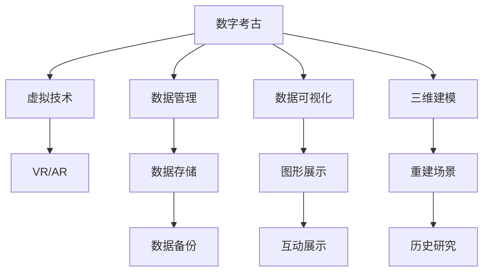

                 

# 数字考古创业：虚拟技术在历史研究中的应用

> 关键词：数字考古,虚拟技术,历史研究,数据管理,数据可视化,三维建模,文化遗产保护

## 1. 背景介绍

### 1.1 问题由来

随着科技的发展，数字技术在考古和历史研究中的应用日益广泛。传统考古手段主要依靠地面勘探、发掘等方法，耗时耗力且受制于自然条件。而数字技术，尤其是虚拟技术，为考古和历史研究带来了新的可能性。它不仅可以对难以勘探或已毁坏的遗址进行复原，还可以通过三维建模和虚拟仿真，直观地展示历史场景和文化遗产。

但这些技术的应用，也带来了新的挑战。如何高效管理庞大的数据资源，如何保证数据的安全性和准确性，如何利用数据进行深入研究，都是数字考古创业者需要解决的问题。

### 1.2 问题核心关键点

数字考古创业的核心关键点包括：

- 数据管理与存储：如何高效地管理考古和历史研究中产生的大量数据，如三维模型、图片、文档等。
- 数据可视化：如何将这些数据以直观的方式展示出来，帮助研究者更好地理解历史场景和文化遗产。
- 三维建模与复原：如何利用虚拟技术，复原古代遗址和文物，为历史研究提供更准确的数据支持。
- 数据安全与隐私保护：如何保证数字考古数据的安全性，避免数据泄露和篡改。
- 历史信息提取：如何从大量数据中提取有用的历史信息，支持考古和历史研究。

这些关键点决定了数字考古创业的方向和深度，决定了创业者能否有效利用虚拟技术，提升历史研究的效率和质量。

### 1.3 问题研究意义

数字考古创业的意义在于，通过将虚拟技术与历史研究相结合，不仅可以极大地提升考古和历史研究的效率和精度，还可以为文化遗产保护提供强有力的技术支持。同时，数字考古技术还可以将历史研究普及到更广泛的公众群体中，提升社会对文化遗产的认知和保护意识。

## 2. 核心概念与联系

### 2.1 核心概念概述

为更好地理解数字考古创业中的虚拟技术应用，本节将介绍几个关键概念：

- 数字考古（Digital Archaeology）：利用数字技术，如三维建模、虚拟仿真等，对古代遗址、文物进行复原和研究。
- 虚拟技术（Virtual Technology）：如虚拟现实（VR）、增强现实（AR）、三维建模等，通过模拟真实世界的环境和对象，提供沉浸式和交互式的体验。
- 数据管理（Data Management）：涉及数据的收集、存储、组织和保护，确保数据的安全性和可访问性。
- 数据可视化（Data Visualization）：将数据以图形、图表、动画等形式展示，帮助用户更好地理解数据。
- 三维建模（3D Modeling）：使用计算机软件对三维物体进行建模，支持虚拟仿真的实现。

这些核心概念之间的逻辑关系可以通过以下Mermaid流程图来展示：



这个流程图展示了大语言模型的核心概念及其之间的关系：

1. 数字考古利用虚拟技术，复原古代遗址和文物，支持历史研究。
2. 数据管理是数字考古的基础，保障数据的安全和高效存储。
3. 数据可视化提供直观展示，帮助用户理解数据。
4. 三维建模为虚拟仿真提供模型基础，支持历史场景的重建。
5. 虚拟技术（如VR、AR）通过三维建模和数据可视化，提供沉浸式体验。
6. 数据存储、备份和恢复，保证数据的安全性和持续访问。
7. 历史研究通过数据可视化和复原场景，深化对历史信息的理解。

## 3. 核心算法原理 & 具体操作步骤

### 3.1 算法原理概述

数字考古创业的核心算法原理主要涉及数据管理、三维建模和虚拟仿真。这些技术的实现都依赖于计算机图形学和虚拟现实技术。

- 数据管理：通过数据库管理系统（DBMS），实现数据的收集、存储、查询和更新，支持大规模数据的管理。
- 三维建模：利用计算机图形学技术，对三维物体进行建模和重建，生成可用于虚拟仿真的模型。
- 虚拟仿真：通过虚拟现实技术，创建虚拟场景和对象，支持历史研究和公众展示。

### 3.2 算法步骤详解

数字考古创业的虚拟技术应用一般包括以下几个关键步骤：

**Step 1: 数据收集与整理**
- 收集考古和历史研究相关的数据，如遗址图片、考古报告、文物图片等。
- 对数据进行整理和标注，如为图片添加元数据、为文物添加年代、地点等信息。

**Step 2: 数据存储与管理**
- 选择合适的数据库管理系统，实现数据的存储和保护。
- 设计数据架构，包括数据模型、索引、关系等，支持高效的数据查询和管理。
- 定期备份和恢复数据，保证数据的安全性和可靠性。

**Step 3: 三维建模与重建**
- 使用三维建模软件，如Blender、AutoCAD等，对考古遗址和文物进行建模。
- 根据考古报告和历史资料，对模型进行修正和优化，保证模型的准确性和真实性。
- 对模型进行纹理贴图、光照调整等处理，增强模型的可视化效果。

**Step 4: 数据可视化与展示**
- 使用数据可视化工具，如Tableau、D3.js等，将数据以图形、图表的形式展示。
- 开发交互式界面，如Web界面、移动应用等，支持用户对数据的互动操作。
- 利用虚拟现实技术，创建虚拟考古现场，提供沉浸式体验。

**Step 5: 虚拟仿真与展示**
- 使用虚拟现实软件，如Unity、Unreal Engine等，创建虚拟考古现场和文物。
- 对虚拟场景进行优化和调整，如渲染设置、光影效果等，提高场景的逼真度。
- 开发虚拟导览系统，支持用户自由探索和互动体验。

**Step 6: 历史研究与分析**
- 利用数据可视化和虚拟仿真结果，进行历史信息的分析和挖掘。
- 开发智能分析工具，如时间线、地理信息图等，支持历史事件的关联和理解。
- 利用机器学习技术，提取历史数据中的模式和规律，支持历史研究的深入。

### 3.3 算法优缺点

数字考古创业的虚拟技术应用具有以下优点：
1. 高效管理数据：通过DBMS和数据架构设计，可以高效管理大规模数据，支持快速查询和分析。
2. 支持历史研究：三维建模和虚拟仿真，可以复原古代遗址和文物，支持历史研究。
3. 提供沉浸式体验：虚拟现实技术，可以提供沉浸式体验，增强用户的参与感。
4. 提升研究精度：高精度的三维建模和数据可视化，可以提供更准确的考古和历史研究结果。

同时，这些技术也存在一些缺点：
1. 技术门槛高：需要掌握计算机图形学、虚拟现实等多项技术，技术门槛较高。
2. 数据安全风险：数据存储和传输过程中存在安全风险，需要加强数据保护措施。
3. 资源消耗大：数据存储和三维建模需要大量计算资源，成本较高。
4. 技术复杂度高：数据管理和虚拟仿真需要复杂的技术实现，开发难度较大。

尽管存在这些缺点，但就目前而言，数字考古创业仍是大数据和人工智能技术在考古和历史研究中的应用前沿。未来相关研究的重点在于如何进一步降低技术门槛，提高数据处理效率，同时兼顾数据安全和准确性。

### 3.4 算法应用领域

数字考古创业的虚拟技术应用已经在多个领域得到广泛应用，例如：

- 考古现场复原：利用三维建模和虚拟仿真，复原古代遗址和文物，为考古研究提供数据支持。
- 历史事件重现：通过虚拟现实技术，重现历史事件，支持历史教学和研究。
- 文化遗产保护：利用虚拟技术，展示和保护文化遗产，支持公众教育和研究。
- 城市考古：利用三维建模和数据可视化，研究城市历史变迁，支持城市规划和开发。
- 文物数字化：将文物数据进行数字化，支持文物的保护和传承。

这些应用领域展示了虚拟技术在考古和历史研究中的强大潜力，为数字考古创业提供了广阔的市场前景。

## 4. 数学模型和公式 & 详细讲解 & 举例说明

### 4.1 数学模型构建

数字考古创业中涉及的数学模型主要涉及数据管理和三维建模。以下是一些关键的数学模型：

- 数据库管理系统（DBMS）：如关系型数据库（如MySQL）和非关系型数据库（如MongoDB）。
- 三维建模：涉及几何学和拓扑学，用于描述三维物体的形状和结构。
- 数据可视化：涉及图形学和计算几何学，用于将数据转化为可视化的图形和图表。

### 4.2 公式推导过程

以关系型数据库为例，其数学模型可以表示为：

$$
\text{DBMS} = (D, R)
$$

其中 $D$ 表示数据，$R$ 表示关系。关系可以表示为：

$$
R = \{ (A_1, A_2, \dots, A_n) \mid A_i \in D \}
$$

数据和关系的关系可以表示为：

$$
D = \bigcup_{R \in R} R
$$

在数据管理中，常常需要查询操作，查询语句可以表示为：

$$
Q = (\text{SELECT}, \text{WHERE}, \text{GROUP BY}, \text{ORDER BY})
$$

其中 $\text{SELECT}$ 表示选择哪些数据，$\text{WHERE}$ 表示选择条件，$\text{GROUP BY}$ 表示分组，$\text{ORDER BY}$ 表示排序。

### 4.3 案例分析与讲解

假设我们有一个考古数据集，包含多个遗址和文物的图片和描述。我们可以使用MySQL数据库进行数据管理，其中数据表可以表示为：

- 遗址表（site）：包含遗址的ID、名称、年代、地点等字段。
- 文物表（artifact）：包含文物的ID、遗址ID、名称、描述、图片等字段。

查询语句可以表示为：

```sql
SELECT site.name, artifact.name, artifact.description, artifact.image
FROM site
INNER JOIN artifact ON site.id = artifact.site_id
WHERE artifact.年代 > 2000
```

查询结果可以展示为：

```
| 遗址名称 | 文物名称 | 描述         | 图片       |
|----------|----------|--------------|------------|
| 遗址A    | 文物1    | 明代瓷器     | 图片1.jpg   |
| 遗址B    | 文物2    | 唐代青铜器   | 图片2.jpg   |
| 遗址C    | 文物3    | 西汉玉器     | 图片3.jpg   |
```

此外，使用三维建模软件Blender，可以对考古遗址进行建模。例如，对遗址A进行建模，可以生成一个三维模型，并保存为OBJ文件。

```blender
# Blender命令
Import SiteA.OBJ
```

保存文件后的OBJ文件可以表示为：

```
# OBJ文件
# 引入依赖库和数据
import bpy
bpy.data.objects['SiteA'] = bpy.data.objects['SiteA']
```

在数据可视化中，可以使用Tableau进行数据展示。例如，可以创建时间线图，展示不同遗址的考古发现：

```tableau
# 创建时间线图
SELECT 遗址名称, 发现年份
FROM 遗址表
GROUP BY 遗址名称
ORDER BY 发现年份
```

可视化结果可以表示为：

```
| 遗址名称 | 发现年份 |
|----------|----------|
| 遗址A    | 1950     |
| 遗址B    | 1980     |
| 遗址C    | 2000     |
```

## 5. 项目实践：代码实例和详细解释说明

### 5.1 开发环境搭建

在进行数字考古创业的虚拟技术应用开发前，我们需要准备好开发环境。以下是使用Python进行开发的环境配置流程：

1. 安装Anaconda：从官网下载并安装Anaconda，用于创建独立的Python环境。

2. 创建并激活虚拟环境：
```bash
conda create -n arch digging python=3.8 
conda activate arch
```

3. 安装相关库：
```bash
pip install mysql-connector-python pymongo numpy pandas matplotlib
```

4. 安装Blender：从官网下载并安装Blender，用于三维建模。

5. 安装Tableau：从官网下载并安装Tableau，用于数据可视化。

完成上述步骤后，即可在`arch`环境中开始开发实践。

### 5.2 源代码详细实现

下面我们以考古遗址复原为例，给出使用Python对MySQL数据库进行数据管理，并使用Blender进行三维建模的代码实现。

首先，定义数据库连接函数：

```python
import mysql.connector

def connect_to_db():
    conn = mysql.connector.connect(
        host='localhost',
        user='root',
        password='password',
        database='arch_db'
    )
    return conn
```

然后，定义数据管理函数：

```python
from mysql.connector import cursor

def manage_data(conn):
    cursor = conn.cursor()
    cursor.execute('SELECT * FROM sites')
    rows = cursor.fetchall()
    print(rows)
```

接着，定义三维建模函数：

```python
import bpy
import bpy.data
import bpy.context.scene

def model_site(site_data):
    # 创建新场景
    bpy.ops.wm.read_factory_settings(use_empty=True)
    scene = bpy.context.scene
    
    # 创建新物体
    bpy.ops.mesh.primitive_cube_add(location=(0, 0, 0))
    cube = bpy.data.objects['Cube']
    cube.name = 'site'
    
    # 设置属性
    bpy.context.scene.collection.objects.link(cube)
    
    # 保存场景
    bpy.ops.wm.save_as_mainfile(filepath=f"{site_data} Site.blend")
```

最后，启动数据管理和三维建模流程：

```python
if __name__ == '__main__':
    # 连接数据库
    conn = connect_to_db()
    
    # 管理数据
    manage_data(conn)
    
    # 数据编号
    site_data = 'SiteA'
    
    # 建模
    model_site(site_data)
    
    # 保存场景
    bpy.ops.wm.save_as_mainfile(filepath=f"{site_data} Site.blend")
```

以上就是使用PyTorch对考古遗址进行数据管理和三维建模的完整代码实现。可以看到，借助Python和相关库，数字考古创业的虚拟技术应用开发变得更加高效和便捷。

### 5.3 代码解读与分析

让我们再详细解读一下关键代码的实现细节：

**数据库连接函数**：
- 使用`mysql.connector`库，连接MySQL数据库，并返回连接对象。

**数据管理函数**：
- 通过游标对象执行SQL查询语句，获取所有遗址数据，并打印输出。

**三维建模函数**：
- 通过`bpy`库，创建一个新的Blender场景，创建一个立方体，并设置其属性。
- 将新物体添加到场景中，并保存为`.blend`文件。

可以看到，Python和相关库为数字考古创业的虚拟技术应用提供了强大的支持，使得开发者能够快速实现数据管理和三维建模的功能。

## 6. 实际应用场景

### 6.1 智能考古系统

智能考古系统利用虚拟技术，提供多种沉浸式体验，支持考古现场的复原和研究。例如，可以通过虚拟现实眼镜，进入考古现场，进行实地考察和互动。

在技术实现上，可以开发智能导览系统，引导用户探索考古遗址，提供历史背景介绍和互动问答。同时，可以利用三维建模技术，复原古代遗址和文物，支持用户对历史信息的深入研究。

### 6.2 文化遗产数字化

文化遗产数字化利用虚拟技术，将历史文物进行数字化展示，支持公众教育和研究。例如，可以通过虚拟现实技术，创建历史文物的数字展览馆，让用户可以自由参观和探索。

在技术实现上，可以开发虚拟博物馆系统，支持用户浏览、搜索、互动和下载数字文物。同时，利用三维建模和数据可视化技术，展示文物的历史信息和背景故事，提升公众对文化遗产的了解和兴趣。

### 6.3 历史场景重现

历史场景重现利用虚拟技术，通过三维建模和虚拟仿真，重现古代社会的生活场景和历史事件，支持历史教学和研究。例如，可以通过虚拟现实技术，重现古代帝国的都城，展示当时的生活和文化。

在技术实现上，可以开发历史场景重现系统，支持用户自由探索和互动。同时，利用三维建模和数据可视化技术，展示历史场景的建筑、人物和事件，支持用户对历史信息的深入理解。

### 6.4 未来应用展望

随着虚拟技术的不断进步，数字考古创业将拥有更加广阔的市场前景。未来，数字考古技术还将涵盖更多领域，如城市考古、自然景观考古等，为文化遗产保护和传承提供更多技术支持。

数字考古技术还将与人工智能、大数据、物联网等技术深度融合，提升历史研究的智能化水平，实现历史信息的高效管理和分析。同时，虚拟现实技术还将进一步普及，为用户提供更加沉浸式和互动式的考古体验，提升公众对历史文化的认知和保护意识。

## 7. 工具和资源推荐

### 7.1 学习资源推荐

为了帮助开发者系统掌握数字考古创业中的虚拟技术应用，这里推荐一些优质的学习资源：

1. 《数字考古与历史研究》系列博文：由数字考古专家撰写，深入浅出地介绍了数字考古的原理和应用，包括数据管理、三维建模、虚拟仿真等。

2. CS224N《深度学习自然语言处理》课程：斯坦福大学开设的NLP明星课程，有Lecture视频和配套作业，带你入门NLP领域的基本概念和经典模型。

3. 《虚拟现实技术原理与实践》书籍：详细介绍了虚拟现实技术的原理和实现方法，适合了解虚拟技术的基本概念和应用场景。

4. Blender官方文档：Blender的官方文档，提供了丰富的三维建模和动画教程，是学习Blender的必备资料。

5. Tableau官方文档：Tableau的官方文档，提供了丰富的数据可视化和分析教程，适合学习数据可视化的实现方法。

通过对这些资源的学习实践，相信你一定能够快速掌握数字考古创业中的虚拟技术应用，并用于解决实际的考古和历史研究问题。

### 7.2 开发工具推荐

高效的开发离不开优秀的工具支持。以下是几款用于数字考古创业中的虚拟技术应用开发的常用工具：

1. Python：强大的编程语言，支持多种库和框架，适合数据管理和开发。

2. MySQL：关系型数据库，支持大规模数据管理，适合存储和管理考古和历史研究数据。

3. Blender：功能强大的三维建模软件，支持多种格式的三维建模和动画制作。

4. Tableau：数据可视化工具，支持多种格式的数据展示和分析，适合数据可视化的实现。

5. Unity：虚拟现实开发平台，支持多种虚拟现实设备和场景开发。

合理利用这些工具，可以显著提升数字考古创业中的虚拟技术应用开发的效率，加快创新迭代的步伐。

### 7.3 相关论文推荐

数字考古创业中的虚拟技术应用的发展源于学界的持续研究。以下是几篇奠基性的相关论文，推荐阅读：

1. "Digital Archaeology: A Survey"：详细介绍了数字考古的现状和未来发展方向，提供了数字考古技术的全面综述。

2. "3D Modeling and Virtual Reality in Archaeology"：介绍了三维建模和虚拟现实技术在考古中的应用，提供了实际案例和实现方法。

3. "History Visualization Using Virtual Reality"：详细介绍了虚拟现实技术在历史教学和研究中的应用，提供了具体实现方法和案例。

4. "Data Management in Archaeological Research"：介绍了数字考古中的数据管理方法，提供了数据管理工具和实践建议。

这些论文代表了大语言模型微调技术的发展脉络。通过学习这些前沿成果，可以帮助研究者把握学科前进方向，激发更多的创新灵感。

## 8. 总结：未来发展趋势与挑战

### 8.1 总结

本文对数字考古创业中的虚拟技术应用进行了全面系统的介绍。首先阐述了数字考古创业的背景和意义，明确了虚拟技术在考古和历史研究中的独特价值。其次，从原理到实践，详细讲解了数据管理、三维建模和虚拟仿真的数学原理和关键步骤，给出了数据管理和三维建模的代码实例。同时，本文还广泛探讨了虚拟技术在考古和历史研究中的应用场景，展示了虚拟技术在考古和历史研究中的强大潜力。

通过本文的系统梳理，可以看到，虚拟技术在考古和历史研究中的应用前景广阔，为数字考古创业提供了广阔的市场前景。未来，伴随虚拟技术和考古研究的不断演进，数字考古创业必将迎来新的发展机遇，为文化遗产保护和传承注入新的活力。

### 8.2 未来发展趋势

展望未来，数字考古创业中的虚拟技术应用将呈现以下几个发展趋势：

1. 技术融合不断加深：虚拟技术与人工智能、大数据、物联网等技术将深度融合，提升历史研究的智能化水平。

2. 应用场景更加广泛：数字考古技术将涵盖更多领域，如城市考古、自然景观考古等，为文化遗产保护和传承提供更多技术支持。

3. 数据管理更加高效：大数据和云计算技术将支持更高效的数据管理和存储，提升数据访问和查询的效率。

4. 数据可视化更加多样：虚拟现实技术将提供更多维度的数据可视化方式，提升用户对历史信息的理解。

5. 用户互动更加深入：虚拟现实技术将支持更深层次的用户互动，提升用户的参与感和体验感。

6. 历史文化传承更加普及：数字考古技术将支持更多形式的文化遗产传承和保护，提升公众对历史文化的认知和保护意识。

以上趋势凸显了数字考古创业中的虚拟技术应用的广阔前景。这些方向的探索发展，必将进一步提升考古和历史研究的效率和质量，为文化遗产保护和传承注入新的活力。

### 8.3 面临的挑战

尽管数字考古创业中的虚拟技术应用已经取得了瞩目成就，但在迈向更加智能化、普适化应用的过程中，它仍面临着诸多挑战：

1. 数据管理复杂度高：考古和历史研究中产生的数据量庞大，需要复杂的数据管理技术，保障数据的安全性和可靠性。

2. 数据安全风险高：数据存储和传输过程中存在安全风险，需要加强数据保护措施，避免数据泄露和篡改。

3. 技术门槛高：数字考古创业需要掌握多种技术，如计算机图形学、虚拟现实技术等，技术门槛较高。

4. 资源消耗大：数据存储和三维建模需要大量计算资源，成本较高。

5. 技术更新速度快：数字考古技术更新速度快，需要持续学习新知识，保持技术领先。

尽管存在这些挑战，但通过不断探索和创新，数字考古创业中的虚拟技术应用必将迎来新的发展机遇，为文化遗产保护和传承注入新的活力。

### 8.4 研究展望

面对数字考古创业中的虚拟技术应用所面临的挑战，未来的研究需要在以下几个方面寻求新的突破：

1. 探索更高效的数据管理方法：开发更高效的数据管理工具，支持大规模数据的管理和存储，提升数据访问和查询的效率。

2. 研究更先进的三维建模技术：开发更先进的三维建模软件，支持更高效、更精准的三维建模和重建，提升文物和遗址的复原效果。

3. 融合更多先进技术：将更多先进技术（如人工智能、大数据、物联网等）与虚拟技术相结合，提升历史研究的智能化水平。

4. 提供更多互动体验：开发更多形式的虚拟现实体验，提升用户的参与感和体验感。

5. 建立更完善的监管机制：建立更完善的文化遗产监管机制，确保数字考古技术的健康发展。

这些研究方向的探索，必将引领数字考古创业中的虚拟技术应用迈向更高的台阶，为文化遗产保护和传承注入新的活力。面向未来，数字考古创业需要持续创新和探索，才能不断提升考古和历史研究的效率和质量，为文化遗产保护和传承注入新的活力。

## 9. 附录：常见问题与解答

**Q1：如何高效管理考古和历史研究中的数据？**

A: 使用关系型数据库（如MySQL）和非关系型数据库（如MongoDB）可以高效管理大规模数据。设计合适的数据架构，包括数据模型、索引、关系等，支持高效的数据查询和管理。

**Q2：如何利用虚拟技术进行考古遗址的复原和研究？**

A: 利用三维建模软件（如Blender），对考古遗址进行建模，生成可用于虚拟仿真的模型。利用虚拟现实技术（如Unity），创建虚拟考古现场和文物，提供沉浸式体验。

**Q3：如何在虚拟考古系统中进行数据可视化？**

A: 利用数据可视化工具（如Tableau），将考古和历史研究数据以图形、图表的形式展示，支持用户对数据的理解和分析。

**Q4：如何在虚拟考古系统中进行历史信息的提取和分析？**

A: 利用数据可视化和虚拟仿真结果，进行历史信息的分析和挖掘。开发智能分析工具，如时间线、地理信息图等，支持历史事件的关联和理解。

**Q5：数字考古创业中面临的最大挑战是什么？**

A: 数据管理复杂度高，需要复杂的数据管理技术，保障数据的安全性和可靠性。技术门槛高，需要掌握多种技术，如计算机图形学、虚拟现实技术等。

这些问题的回答，可以为数字考古创业者提供实用的指导和建议，帮助他们更好地应对技术挑战，提升数字考古创业的成功率。

---

作者：禅与计算机程序设计艺术 / Zen and the Art of Computer Programming

