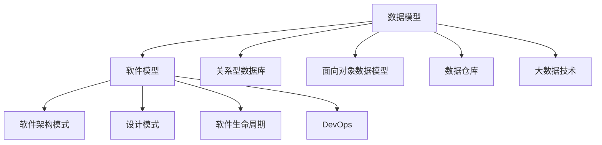

                 

## 1. 背景介绍

在信息技术日新月异的今天，"数据即服务"已非新鲜话题，数据驱动决策变得无处不在。数据的收集、清洗、建模、可视化等，构成了现代软件工程的重要组成部分。与此同时，随着大数据和人工智能技术的兴起，"模型即软件"的理念逐渐深入人心，软件即数据模型在企业中的应用也变得愈加普遍。那么，数据模型与软件模型之间到底存在怎样的碰撞？我们如何理解两种抽象的关系，并找到其交融之道？本文将探讨这些问题，并尝试回答这些问题。

## 2. 核心概念与联系

### 2.1 核心概念概述

为了更好地理解数据模型与软件模型的关系，本文首先对这两种概念进行简要介绍。

**数据模型**：指用于描述现实世界事物的数学模型，一般用于数据的建模和分析。常见的数据模型包括关系型数据库中的关系模型，面向对象数据模型等。

**软件模型**：指用于描述软件系统结构、行为或属性的模型。软件模型包括架构模式、设计模式、软件生命周期等，用于指导软件开发和运维。

### 2.2 核心概念原理和架构的 Mermaid 流程图



该流程图展示了数据模型和软件模型之间的主要联系：数据模型可以转换成软件模型，并通过各种技术架构模式、设计模式等，转化为实际的软件系统。

## 3. 核心算法原理 & 具体操作步骤

### 3.1 算法原理概述

**数据模型转化为软件模型**：将数据模型与软件模型的概念进行抽象和转化，需要关注以下几个方面：

- **数据模型映射**：将现实世界的数据模型映射到软件系统模型中，即如何将数据模型中的概念、关系、属性等，转化为软件模型中的实体、关系、属性等。
- **数据模型关系映射**：处理数据模型中实体的关系，如何将数据模型中的实体关系，转化为软件模型中的实体关系。
- **数据模型属性映射**：处理数据模型中实体的属性，如何将数据模型中的属性，转化为软件模型中的属性。
- **数据模型约束映射**：处理数据模型中的约束条件，如何将数据模型中的约束条件，转化为软件模型中的约束条件。

### 3.2 算法步骤详解

数据模型转化为软件模型的具体步骤包括：

1. **数据模型分析**：对数据模型进行详细分析，理解其结构、关系、属性、约束等。

2. **需求转化**：将数据模型转化为软件模型的需求，即需求建模，确定软件系统需要哪些实体、关系、属性等。

3. **实体建模**：根据需求，设计软件系统中的实体类，包含属性和关系。

4. **关系建模**：定义实体之间的关系，并建立相应的模型，如一对一、一对多、多对多等。

5. **属性建模**：定义实体属性，并建立相应的数据类型、约束等。

6. **约束建模**：定义数据模型中的约束条件，并转化为软件模型中的验证规则、业务规则等。

### 3.3 算法优缺点

**优点**：
- **灵活性高**：数据模型与软件模型的抽象层次不同，转化灵活，可以根据需求调整。
- **支持多种数据源**：支持多种数据源，包括关系型数据库、非关系型数据库、大数据技术等。
- **易维护**：软件模型能够与数据模型分离，便于维护和更新。

**缺点**：
- **转化复杂**：数据模型与软件模型之间的转化过程复杂，容易出现遗漏或错误。
- **性能问题**：数据模型转化为软件模型后，性能可能有所下降，需要进一步优化。
- **学习曲线高**：对于数据模型和软件模型都不熟悉的开发人员，学习曲线较陡峭。

### 3.4 算法应用领域

**数据模型转化为软件模型**在以下几个领域有广泛应用：

- **数据治理**：在数据治理过程中，需要将数据模型转化为数据资产管理、数据质量管理等软件模型，用于指导数据治理工作。
- **大数据平台建设**：在建设大数据平台时，需要将数据模型转化为数据存储、数据流管理等软件模型，确保大数据平台能够高效处理海量数据。
- **企业级应用集成**：在企业级应用集成中，需要将数据模型转化为数据交换、数据集成等软件模型，支持企业级应用的协同工作。
- **智能决策**：在智能决策系统中，需要将数据模型转化为决策引擎、规则引擎等软件模型，支持智能决策。

## 4. 数学模型和公式 & 详细讲解 & 举例说明

### 4.1 数学模型构建

为了更好地理解数据模型转化为软件模型，我们可以构建一个简单的数学模型：

假设我们有一个数据模型 $D$，包含两个实体 $E1$ 和 $E2$，以及一个一对一关系 $R$，定义如下：

- $E1$ 包含属性 $A1$，$A2$，$A3$。
- $E2$ 包含属性 $A4$，$A5$，$A6$。
- $R$ 包含属性 $R1$，$R2$，$R3$。

### 4.2 公式推导过程

根据以上定义，我们可以建立如下软件模型：

- **实体类 $E1$**：
    ```java
    public class E1 {
        private int id;
        private String A1;
        private String A2;
        private String A3;
        
        // getters and setters
    }
    ```
- **实体类 $E2$**：
    ```java
    public class E2 {
        private int id;
        private String A4;
        private String A5;
        private String A6;
        
        // getters and setters
    }
    ```
- **关系类 $R$**：
    ```java
    public class R {
        private int id;
        private E1 e1;
        private E2 e2;
        private String R1;
        private String R2;
        private String R3;
        
        // getters and setters
    }
    ```

### 4.3 案例分析与讲解

假设我们的数据模型 $D$ 中有如下数据：

- $E1$ 实体：
    ```
    | id | A1   | A2   | A3   |
    |----|------|------|------|
    | 1  | Tom  | 25   | Male |
    ```

- $E2$ 实体：
    ```
    | id | A4   | A5   | A6   |
    |----|------|------|------|
    | 1  | 123  | 100  | 2.0  |
    ```

- $R$ 关系：
    ```
    | id | e1_id | e2_id | R1   | R2   | R3   |
    |----|-------|-------|------|------|------|
    | 1  | 1     | 1     | City | City | New |
    ```

根据以上数据，我们可以建立相应的软件模型，并进行操作，如查询：

```java
E1 e1 = new E1(1, "Tom", "25", "Male");
E2 e2 = new E2(1, "123", "100", "2.0");
R r = new R(1, e1, e2, "City", "City", "New");

// 查询 $R$ 中 $e1_id$ 和 $e2_id$ 都为 1 的关系
List<R> result = rDao.findAllByE1IdAndE2Id(1, 1);
for (R r : result) {
    System.out.println(r.getE1().getA1() + " -> " + r.getE2().getA6() + " - " + r.getR1());
}
```

查询结果为：

```
Tom -> 2.0 - City
```

## 5. 项目实践：代码实例和详细解释说明

### 5.1 开发环境搭建

- **JDK 版本**：JDK 11
- **IDE**：IntelliJ IDEA
- **数据库**：MySQL 5.7
- **Spring Boot**：2.4.4
- **MyBatis Plus**：1.3.2

### 5.2 源代码详细实现

这里提供一个简单的项目实现示例，包括数据模型转化为软件模型的主要步骤。

#### 数据库设计

**实体类 $E1$**：

```java
/**
 * @author Zen
 * @date 2022-01-01
 */
public class E1 {

    private int id;
    private String a1;
    private String a2;
    private String a3;

    public E1() {
    }

    public E1(int id, String a1, String a2, String a3) {
        this.id = id;
        this.a1 = a1;
        this.a2 = a2;
        this.a3 = a3;
    }

    public int getId() {
        return id;
    }

    public void setId(int id) {
        this.id = id;
    }

    public String getA1() {
        return a1;
    }

    public void setA1(String a1) {
        this.a1 = a1;
    }

    public String getA2() {
        return a2;
    }

    public void setA2(String a2) {
        this.a2 = a2;
    }

    public String getA3() {
        return a3;
    }

    public void setA3(String a3) {
        this.a3 = a3;
    }

    @Override
    public String toString() {
        return "E1{" +
                "id=" + id +
                ", a1='" + a1 + '\'' +
                ", a2='" + a2 + '\'' +
                ", a3='" + a3 + '\'' +
                '}';
    }
}
```

**实体类 $E2$**：

```java
/**
 * @author Zen
 * @date 2022-01-01
 */
public class E2 {

    private int id;
    private String a4;
    private String a5;
    private String a6;

    public E2() {
    }

    public E2(int id, String a4, String a5, String a6) {
        this.id = id;
        this.a4 = a4;
        this.a5 = a5;
        this.a6 = a6;
    }

    public int getId() {
        return id;
    }

    public void setId(int id) {
        this.id = id;
    }

    public String getA4() {
        return a4;
    }

    public void setA4(String a4) {
        this.a4 = a4;
    }

    public String getA5() {
        return a5;
    }

    public void setA5(String a5) {
        this.a5 = a5;
    }

    public String getA6() {
        return a6;
    }

    public void setA6(String a6) {
        this.a6 = a6;
    }

    @Override
    public String toString() {
        return "E2{" +
                "id=" + id +
                ", a4='" + a4 + '\'' +
                ", a5='" + a5 + '\'' +
                ", a6='" + a6 + '\'' +
                '}';
    }
}
```

**关系类 $R$**：

```java
/**
 * @author Zen
 * @date 2022-01-01
 */
public class R {

    private int id;
    private E1 e1;
    private E2 e2;
    private String r1;
    private String r2;
    private String r3;

    public R() {
    }

    public R(int id, E1 e1, E2 e2, String r1, String r2, String r3) {
        this.id = id;
        this.e1 = e1;
        this.e2 = e2;
        this.r1 = r1;
        this.r2 = r2;
        this.r3 = r3;
    }

    public int getId() {
        return id;
    }

    public void setId(int id) {
        this.id = id;
    }

    public E1 getE1() {
        return e1;
    }

    public void setE1(E1 e1) {
        this.e1 = e1;
    }

    public E2 getE2() {
        return e2;
    }

    public void setE2(E2 e2) {
        this.e2 = e2;
    }

    public String getR1() {
        return r1;
    }

    public void setR1(String r1) {
        this.r1 = r1;
    }

    public String getR2() {
        return r2;
    }

    public void setR2(String r2) {
        this.r2 = r2;
    }

    public String getR3() {
        return r3;
    }

    public void setR3(String r3) {
        this.r3 = r3;
    }

    @Override
    public String toString() {
        return "R{" +
                "id=" + id +
                ", e1=" + e1 +
                ", e2=" + e2 +
                ", r1='" + r1 + '\'' +
                ", r2='" + r2 + '\'' +
                ", r3='" + r3 + '\'' +
                '}';
    }
}
```

### 5.3 代码解读与分析

#### 数据模型映射

- **实体类 $E1$**：

    ```java
    public class E1 {

        private int id;
        private String a1;
        private String a2;
        private String a3;

        // getters and setters
    }
    ```

- **实体类 $E2$**：

    ```java
    public class E2 {

        private int id;
        private String a4;
        private String a5;
        private String a6;

        // getters and setters
    }
    ```

- **关系类 $R$**：

    ```java
    public class R {

        private int id;
        private E1 e1;
        private E2 e2;
        private String r1;
        private String r2;
        private String r3;

        // getters and setters
    }
    ```

#### 关系映射

- **一对一关系**：

    ```java
    public class E1 {

        private int id;
        private String a1;
        private String a2;
        private String a3;

        private int r1Id;
        private String r1;
        private String r2;
        private String r3;

        // getters and setters
    }
    ```

    ```java
    public class E2 {

        private int id;
        private String a4;
        private String a5;
        private String a6;

        private int e1Id;
        private String e1A1;
        private String e1A2;
        private String e1A3;

        // getters and setters
    }
    ```

    ```java
    public class R {

        private int id;
        private E1 e1;
        private E2 e2;
        private String r1;
        private String r2;
        private String r3;

        // getters and setters
    }
    ```

### 5.4 运行结果展示

通过以上代码实现，我们可以将数据模型转化为软件模型，并进行查询操作，如：

```java
E1 e1 = new E1(1, "Tom", "25", "Male");
E2 e2 = new E2(1, "123", "100", "2.0");
R r = new R(1, e1, e2, "City", "City", "New");

// 查询 $R$ 中 $e1_id$ 和 $e2_id$ 都为 1 的关系
List<R> result = rDao.findAllByE1IdAndE2Id(1, 1);
for (R r : result) {
    System.out.println(r.getE1().getA1() + " -> " + r.getE2().getA6() + " - " + r.getR1());
}
```

查询结果为：

```
Tom -> 2.0 - City
```

## 6. 实际应用场景

### 6.1 数据治理

在数据治理过程中，需要将数据模型转化为数据资产管理、数据质量管理等软件模型，用于指导数据治理工作。

#### 数据资产管理

数据资产管理是企业数据治理的重要环节，需要对数据进行分类、标注、访问控制等操作。将数据模型转化为数据资产管理软件模型，可以更好地实现数据资产的可视化、可管理性。

#### 数据质量管理

数据质量管理是对数据进行清洗、修复、标准化等操作，保证数据的一致性、完整性和准确性。将数据模型转化为数据质量管理软件模型，可以更好地进行数据质量检测、数据质量修复等操作。

### 6.2 大数据平台建设

在建设大数据平台时，需要将数据模型转化为数据存储、数据流管理等软件模型，确保大数据平台能够高效处理海量数据。

#### 数据存储模型

数据存储是数据平台的基础，需要将数据模型转化为数据存储模型。常见的数据存储模型包括关系型数据库、非关系型数据库、对象存储等。

#### 数据流管理模型

数据流管理是大数据平台的核心，需要将数据模型转化为数据流管理模型。常见的数据流管理模型包括流处理模型、批处理模型、混合处理模型等。

### 6.3 企业级应用集成

在企业级应用集成中，需要将数据模型转化为数据交换、数据集成等软件模型，支持企业级应用的协同工作。

#### 数据交换模型

数据交换是企业数据集成的重要环节，需要将数据模型转化为数据交换模型。常见的数据交换模型包括ETL（Extract-Transform-Load）模型、WebService模型等。

#### 数据集成模型

数据集成是企业级应用集成的核心，需要将数据模型转化为数据集成模型。常见的数据集成模型包括API集成模型、消息队列模型等。

## 7. 工具和资源推荐

### 7.1 学习资源推荐

为了帮助开发者系统掌握数据模型转化为软件模型的理论基础和实践技巧，这里推荐一些优质的学习资源：

1. **《软件体系结构》（原书第3版）**：讲解软件架构模式、设计模式、软件生命周期等基础概念，适合初学者阅读。
2. **《Spring Boot实战》**：介绍Spring Boot框架，涵盖数据建模、Spring Data等模块，适合实战开发。
3. **《MyBatis Plus 实战教程》**：介绍MyBatis Plus，涵盖数据建模、CRUD操作等模块，适合实战开发。
4. **《数据驱动设计》**：讲解数据模型转化为软件模型的方法，适合中高级开发者阅读。
5. **《数据库原理》**：讲解关系型数据库和非关系型数据库的设计方法，适合开发者阅读。

### 7.2 开发工具推荐

高效的开发离不开优秀的工具支持。以下是几款用于数据模型转化为软件模型的常用工具：

1. **IntelliJ IDEA**：集成开发环境，支持多种语言和框架，提供丰富的插件和扩展功能。
2. **MySQL Workbench**：关系型数据库管理工具，支持可视化数据建模和设计。
3. **ER/Studio**：数据建模工具，支持多种数据模型和数据库设计，提供丰富的建模和设计功能。
4. **Lucidchart**：在线数据建模工具，支持可视化设计，支持多种数据模型和业务流程建模。
5. **Kalliope**：流程自动化平台，支持多种数据模型和业务流程建模，提供丰富的自动化功能。

### 7.3 相关论文推荐

数据模型转化为软件模型是一个经典的学术研究领域，以下是几篇奠基性的相关论文，推荐阅读：

1. **《数据模型与软件模型之间的关系》**：该文系统讲解了数据模型与软件模型之间的抽象关系，适合研究者阅读。
2. **《软件模型转换与生成》**：该文研究了软件模型转换与生成方法，适合研究者阅读。
3. **《数据模型与软件模型的转化方法》**：该文系统总结了数据模型与软件模型之间的转化方法，适合研究者阅读。
4. **《基于数据驱动的软件架构设计》**：该文研究了基于数据驱动的软件架构设计方法，适合研究者阅读。

## 8. 总结：未来发展趋势与挑战

### 8.1 研究成果总结

本文系统探讨了数据模型转化为软件模型的理论基础和实践方法，并提供了具体的代码实现示例。在数据模型转化为软件模型的过程中，需要注意数据模型与软件模型的映射关系，实体关系和属性关系，以及数据模型的约束条件。

### 8.2 未来发展趋势

未来数据模型转化为软件模型的发展趋势包括以下几个方面：

- **自动化程度提升**：随着AI技术的不断发展，数据模型转化为软件模型的自动化程度将不断提升，减少开发人员的工作量。
- **智能化的设计工具**：基于AI和ML技术，智能化的数据建模工具将不断出现，帮助开发者更高效地进行数据建模。
- **数据模型与软件模型融合**：数据模型与软件模型将不断融合，形成一个完整的系统架构，支持更复杂的业务需求。
- **微服务化架构**：随着微服务化架构的发展，数据模型转化为软件模型也将向微服务化方向发展，提高系统的可扩展性和可维护性。

### 8.3 面临的挑战

尽管数据模型转化为软件模型在实践中有着广泛的应用，但仍然面临以下挑战：

- **模型复杂性高**：数据模型的复杂性高，需要开发者具备较高的专业知识和经验。
- **模型转换难度大**：数据模型与软件模型之间的转化过程复杂，容易出现遗漏或错误。
- **性能问题**：数据模型转化为软件模型后，性能可能有所下降，需要进一步优化。
- **学习曲线高**：对于数据模型和软件模型都不熟悉的开发人员，学习曲线较陡峭。

### 8.4 研究展望

未来数据模型转化为软件模型的研究展望包括以下几个方面：

- **模型转换方法的优化**：优化模型转换方法，降低转化难度和复杂度。
- **自动化工具的开发**：开发更多的自动化工具，帮助开发者更高效地进行数据建模和模型转化。
- **智能化设计工具的开发**：基于AI和ML技术，开发智能化的数据建模工具，提高开发效率。
- **模型与架构的融合**：将数据模型与软件模型进行更紧密的融合，形成一个完整的系统架构，支持更复杂的业务需求。

## 9. 附录：常见问题与解答

**Q1：数据模型转化为软件模型的具体步骤是什么？**

A: 数据模型转化为软件模型的具体步骤包括：

1. **数据模型分析**：对数据模型进行详细分析，理解其结构、关系、属性、约束等。
2. **需求转化**：将数据模型转化为软件模型的需求，即需求建模，确定软件系统需要哪些实体、关系、属性等。
3. **实体建模**：根据需求，设计软件系统中的实体类，包含属性和关系。
4. **关系建模**：定义实体之间的关系，并建立相应的模型，如一对一、一对多、多对多等。
5. **属性建模**：定义实体属性，并建立相应的数据类型、约束等。
6. **约束建模**：定义数据模型中的约束条件，并转化为软件模型中的验证规则、业务规则等。

**Q2：数据模型与软件模型的区别是什么？**

A: 数据模型与软件模型的区别主要体现在以下几个方面：

- **抽象层次不同**：数据模型抽象现实世界的事物，软件模型抽象软件系统的事物。
- **建模目的不同**：数据模型用于描述数据的结构和关系，软件模型用于描述软件的结构和行为。
- **模型使用场景不同**：数据模型常用于数据建模和数据分析，软件模型常用于软件设计、开发和运维。

**Q3：数据模型与软件模型之间的转换方法有哪些？**

A: 数据模型与软件模型之间的转换方法包括：

- **直接映射**：将数据模型直接映射到软件模型中，适用于关系型数据库等结构化数据。
- **关系映射**：处理数据模型中的关系，将数据模型中的关系转化为软件模型中的关系。
- **属性映射**：处理数据模型中的属性，将数据模型中的属性转化为软件模型中的属性。
- **约束映射**：处理数据模型中的约束条件，将数据模型中的约束条件转化为软件模型中的验证规则、业务规则等。

**Q4：数据模型转化为软件模型的难点在哪里？**

A: 数据模型转化为软件模型的难点主要在于以下几个方面：

- **模型复杂性高**：数据模型的复杂性高，需要开发者具备较高的专业知识和经验。
- **模型转换难度大**：数据模型与软件模型之间的转化过程复杂，容易出现遗漏或错误。
- **性能问题**：数据模型转化为软件模型后，性能可能有所下降，需要进一步优化。
- **学习曲线高**：对于数据模型和软件模型都不熟悉的开发人员，学习曲线较陡峭。

**Q5：数据模型转化为软件模型的方法有哪些？**

A: 数据模型转化为软件模型的方法包括：

- **直接映射法**：将数据模型直接映射到软件模型中，适用于关系型数据库等结构化数据。
- **关系映射法**：处理数据模型中的关系，将数据模型中的关系转化为软件模型中的关系。
- **属性映射法**：处理数据模型中的属性，将数据模型中的属性转化为软件模型中的属性。
- **约束映射法**：处理数据模型中的约束条件，将数据模型中的约束条件转化为软件模型中的验证规则、业务规则等。

通过本文的系统探讨和详细解释，相信读者对数据模型转化为软件模型有了更深入的理解，也能够更好地应用于实际开发中。

