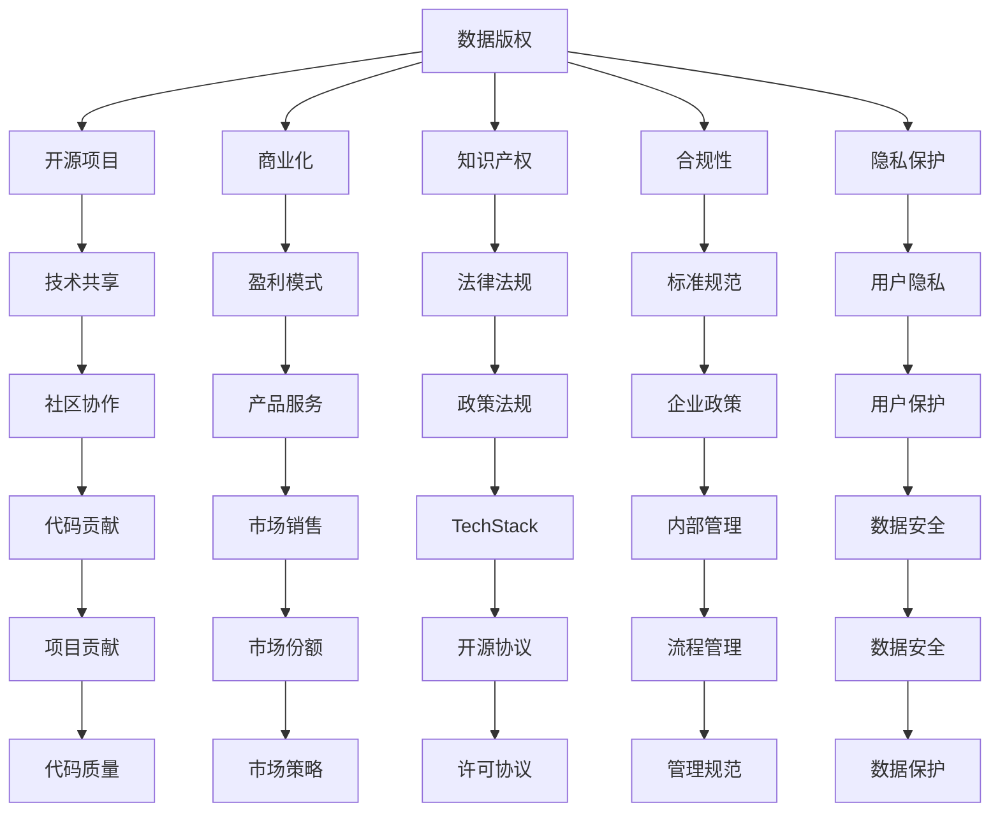

                 

# 数据版权时代，软件2.0的新困扰

> 关键词：数据版权,软件2.0,版权纠纷,开源项目,商业化,知识产权,合规性,隐私保护,技术交流

## 1. 背景介绍

### 1.1 问题由来
随着互联网技术的飞速发展，软件生态逐渐从以商业软件为中心转向以开源软件和开源社区为主导的"软件2.0"时代。在这个时代，开源软件的普及和商业化的推进，极大地推动了技术进步和创新。然而，随之而来的还有一系列由数据版权引发的新的困扰和挑战。

在软件2.0时代，数据版权问题成为焦点，尤其是对于开源项目。很多开源项目由企业、高校或个人贡献，数据资源丰富，但数据版权归属复杂。如何在商业化开发和开源贡献之间平衡，避免侵犯他人版权，成为项目开发和使用者共同面临的难题。

### 1.2 问题核心关键点
数据版权问题主要涉及以下几个方面：

- **开源与商业化**：开源项目的开放性使得数据资源易于获取，但商业化开发需要遵守不同的版权法规，两者之间的平衡颇具挑战。
- **数据隐私保护**：开源项目的数据往往具有敏感性，如何在保障数据隐私的前提下进行开放和共享，成为重要考量。
- **知识产权风险**：在开源项目中，数据版权归属和使用的合规性问题层出不穷，如何避免知识产权纠纷，确保使用的合法性，成为关键问题。
- **技术交流与共享**：开源社区鼓励技术交流和共享，但数据版权的复杂性限制了技术的开放共享，阻碍了社区的进一步发展。

### 1.3 问题研究意义
解决数据版权问题对于维护开源生态系统的健康发展至关重要。只有合理界定数据版权，保障各方合法权益，才能促进数据共享，推动技术的开放与进步。同时，对于企业而言，合理使用开源数据，既可以避免法律风险，也能在遵守版权法规的前提下，充分利用开源资源，加速商业化进程。

## 2. 核心概念与联系

### 2.1 核心概念概述

为更好地理解数据版权在软件2.0时代的新困扰，本节将介绍几个密切相关的核心概念：

- **数据版权(Data Copyright)**：指作品、数据等智力成果，经过创作、编写、搜集等智力活动产生，并由作者或其他权利人依法享有的排他权利。包括著作权、专利权、商标权等。
- **开源项目(Open Source Project)**：指在开源协议（如Apache、GPL等）指导下，公开源代码和数据，允许自由复制、修改和分发。开源项目强调共享和协作，但数据版权问题常常成为争议的焦点。
- **商业化(Commercialization)**：将开源项目、技术、数据等转化为商业模式的过程，通过售卖产品、服务或授权使用等方式实现盈利。商业化开发需要考虑数据版权和知识产权的保护。
- **知识产权(Intellectual Property Rights, IPRs)**：指创造性智力成果（如发明、文学和艺术作品）的专有权利。包括著作权、专利权、商标权、商业秘密等。开源项目涉及的知识产权问题，往往是数据版权争议的核心。
- **合规性(Compliance)**：指遵守法律法规、行业标准和企业政策的实践，确保数据使用、商业化开发等行为符合相关规定。合规性在开源项目中尤为重要。
- **隐私保护(Privacy Protection)**：指保障个人数据不受非法收集、存储、使用和披露的保护措施。开源项目中，个人数据的隐私保护常常受到忽视。

这些核心概念之间的逻辑关系可以通过以下Mermaid流程图来展示：



这个流程图展示了大语言模型的核心概念及其之间的关系：

1. 数据版权和知识产权是开源项目的基础，但也是商业化开发中必须考虑的因素。
2. 合规性确保开源项目的合法使用，隐私保护保障用户数据安全。
3. 技术共享和社区协作是开源项目的核心，但数据版权问题往往成为阻碍。
4. 盈利模式和市场销售是商业化的目标，但数据版权和隐私保护必须始终伴随。
5. 法律法规和标准规范是合规性保障的基础，但开源项目的灵活性使得合规复杂。
6. 用户隐私和数据安全是隐私保护的核心，但开源项目的开放性增加了保护难度。
7. 开源协议和许可协议是开源项目的关键，但不同协议对数据版权有不同的规定。
8. 企业政策和内部管理是合规性的保障，但政策执行的复杂性同样存在。
9. 市场策略和代码质量是商业化的关键，但数据版权和隐私保护必须严格遵守。

这些概念共同构成了数据版权问题的复杂框架，需要我们从多个角度进行深入探讨。

## 3. 核心算法原理 & 具体操作步骤
### 3.1 算法原理概述

数据版权在软件2.0时代的新困扰，本质上是一个复杂的多目标优化问题。其核心在于如何平衡开源和商业化，保护数据版权和隐私，同时促进技术交流和共享。

1. **平衡开源与商业化**：开源项目和商业化开发之间的平衡，涉及对数据版权的合理使用和保护。开源项目追求技术共享和协作，而商业化开发则希望通过数据商业化实现盈利。这种平衡需要考虑数据版权和知识产权的保护，同时确保数据共享的合法性和合理性。

2. **保护数据隐私**：开源项目的数据往往包含用户隐私信息，如何在保障用户隐私的前提下进行开放和共享，是数据版权问题的重要组成部分。隐私保护涉及到数据收集、存储、使用和共享的各个环节，需要严格遵守相关法律法规和技术标准。

3. **合规性保障**：合规性是指确保数据使用、商业化开发等行为符合法律法规、行业标准和企业政策的实践。在开源项目中，合规性尤为关键，特别是在跨地域、跨国界的开发和商业化过程中。合规性需要全面覆盖数据版权、隐私保护、知识产权等多个方面。

4. **促进技术交流与共享**：开源项目的核心在于技术共享和社区协作，但数据版权的复杂性限制了技术的开放共享，阻碍了社区的进一步发展。如何既保障数据版权，又促进技术交流与共享，成为开源项目的重要挑战。

### 3.2 算法步骤详解

基于数据版权问题，本节将详细讲解解决这些问题的核心算法步骤：

1. **数据版权识别与归档**：
   - 识别开源项目中的数据资源，特别是涉及用户隐私和个人敏感信息的部分。
   - 对数据进行分类，明确其版权归属和使用方式。
   - 将数据进行归档，建立详细的版权记录，便于管理和查询。

2. **数据使用合规性评估**：
   - 对数据使用行为进行合规性评估，确保符合法律法规和行业标准。
   - 针对不同的数据类型和用途，制定合规性指南和操作流程。
   - 对开放共享的数据进行隐私保护处理，如去标识化、匿名化等。

3. **商业化开发与知识产权保护**：
   - 对开源项目进行商业化开发时，明确数据版权和知识产权的使用方式。
   - 对商业化开发过程中产生的新数据进行版权登记和保护。
   - 制定数据使用和商业化的授权协议，确保各方权益。

4. **技术与法律相结合**：
   - 利用区块链、智能合约等技术手段，确保数据使用的透明性和可追溯性。
   - 结合法律手段，制定和实施数据使用和商业化的政策规范。
   - 建立数据使用和商业化的审核机制，确保合规性和合法性。

5. **社区协作与技术交流**：
   - 建立社区协作机制，鼓励数据共享和开源贡献。
   - 制定开源协议和许可协议，明确数据使用和共享的规则。
   - 提供技术支持和指导，促进社区成员之间的协作和交流。

### 3.3 算法优缺点

数据版权问题在软件2.0时代的新困扰，具有以下优点和缺点：

**优点**：
1. **促进技术进步**：开源项目的数据共享和协作，促进了技术交流和技术进步。
2. **降低开发成本**：数据共享降低了重复开发和数据收集的成本。
3. **提高数据质量**：数据共享使得数据质量得到提高，加速了技术迭代。

**缺点**：
1. **数据版权问题复杂**：数据版权归属和使用方式复杂，增加了合规性管理的难度。
2. **隐私保护难度大**：开源项目的数据涉及隐私保护，隐私泄露风险较高。
3. **商业化风险高**：数据商业化过程中，侵犯他人版权的风险较高。
4. **法律风险多**：数据使用和商业化过程中，涉及的法律风险较多。

### 3.4 算法应用领域

数据版权问题在软件2.0时代的新困扰，主要应用于以下几个领域：

- **开源社区**：开源项目中，数据版权、隐私保护、合规性、知识产权等问题层出不穷，需要通过科学管理确保社区的良性发展。
- **企业开源**：企业开源过程中，需要合理利用开源数据，同时避免侵权风险。
- **跨界数据合作**：跨界数据合作中，数据版权和隐私保护成为重要考量，需要在法律和技术上严格把关。
- **技术交流与共享**：技术交流与共享中，数据版权的合理使用和保护是关键，需要制定合理的共享规则和协议。
- **商业化开发**：商业化开发过程中，数据版权和知识产权的保护尤为关键，需要遵守相关法律法规和技术规范。

## 4. 数学模型和公式 & 详细讲解  
### 4.1 数学模型构建

基于数据版权问题在软件2.0时代的新困扰，本节将使用数学语言对解决这些问题的数学模型进行更加严格的刻画。

记开源项目中涉及的数据集为 $D=\{d_i\}_{i=1}^N$，其中 $d_i$ 表示第 $i$ 个数据样本，包括数据内容、版权信息和隐私标签等。定义数据版权识别函数 $f: D \rightarrow V$，其中 $V$ 为版权状态集合，包括公有领域、著作权、专利权、商标权等。

数据使用合规性评估函数为 $g: D \rightarrow R$，其中 $R$ 为合规性评分集合，包括合规、不合规、待审核等状态。

数据使用授权协议函数为 $h: D \rightarrow A$，其中 $A$ 为授权协议集合，包括商业授权、开放授权、版权声明等。

商业化开发过程中产生的新数据集为 $D'$，定义新数据版权登记函数 $p: D' \rightarrow V'$，其中 $V'$ 为新数据版权状态集合。

技术支持和指导函数为 $s: D \rightarrow S$，其中 $S$ 为技术支持集合，包括代码审查、技术咨询等。

社区协作机制函数为 $c: D \rightarrow C$，其中 $C$ 为协作机制集合，包括社区会议、代码贡献等。

法律法规和技术标准为 $L$，定义合规性审核函数 $m: D \rightarrow L$，其中 $L$ 为合规性审核结果集合，包括合规、不合规、警告等状态。

数学模型构建的目标是最小化合规性风险，最大化技术共享和社区协作，同时确保新数据版权的合理登记。形式化地，假设数据版权识别函数和合规性评估函数已知，目标函数为：

$$
\min \limits_{f,g,p,s,c} \mathcal{R} + \mathcal{S} + \mathcal{P} + \mathcal{C}
$$

其中，$\mathcal{R}$ 表示合规性风险最小化，$\mathcal{S}$ 表示技术共享最大化，$\mathcal{P}$ 表示新数据版权登记优化，$\mathcal{C}$ 表示社区协作增强。

### 4.2 公式推导过程

以下我们以开源项目中的数据版权识别和合规性评估为例，推导相关公式。

假设开源项目中第 $i$ 个数据样本 $d_i$ 的版权状态为 $v_i \in V$，合规性评分为 $r_i \in R$。目标是最小化合规性风险，即：

$$
\min \limits_{v_i, r_i} \mathcal{L}(v_i, r_i) = \sum \limits_{i=1}^N \alpha r_i
$$

其中，$\alpha$ 为合规性风险权重。

根据上述目标函数，定义优化问题为：

$$
\min \limits_{v_i, r_i} \mathcal{L}(v_i, r_i) + \mathcal{C}(v_i, r_i)
$$

其中，$\mathcal{C}(v_i, r_i)$ 表示社区协作的激励机制，如社区投票、贡献奖励等。

对上述优化问题，使用梯度下降等优化算法进行求解。具体步骤如下：

1. 初始化版权状态 $v_i$ 和合规性评分 $r_i$，假设为初始状态 $v_{i_0} \in V, r_{i_0} \in R$。
2. 根据版权状态和合规性评分计算合规性风险 $\mathcal{L}(v_{i_0}, r_{i_0})$ 和社区协作激励 $\mathcal{C}(v_{i_0}, r_{i_0})$。
3. 更新版权状态和合规性评分：

$$
v_i \leftarrow v_i - \eta \nabla_{v_i}\mathcal{L}(v_i, r_i)
$$

$$
r_i \leftarrow r_i - \eta \nabla_{r_i}\mathcal{L}(v_i, r_i)
$$

其中，$\eta$ 为学习率。

重复步骤2和步骤3，直至收敛。

### 4.3 案例分析与讲解

这里以开源项目中的数据版权识别和合规性评估为例，进行具体分析。

假设开源项目 $P$ 中，涉及用户隐私的数据集 $D$ 中包含 $N$ 个数据样本。开源项目 $P$ 的版权识别函数 $f$ 和合规性评估函数 $g$ 已知，数据样本的版权状态为 $v_i \in V = \{公有领域, 著作权, 专利权, 商标权\}$，合规性评分为 $r_i \in R = \{合规, 不合规, 待审核\}$。

为了最小化合规性风险，需要对数据样本进行版权识别和合规性评估。可以采用以下步骤：

1. 收集开源项目 $P$ 中的所有数据样本 $D$，并对其进行版权识别，得到版权状态 $v_i$。
2. 对每个数据样本 $d_i$ 进行合规性评估，得到合规性评分 $r_i$。
3. 根据版权状态和合规性评分计算合规性风险 $\mathcal{L}(v_i, r_i)$ 和社区协作激励 $\mathcal{C}(v_i, r_i)$。
4. 使用梯度下降等优化算法，更新版权状态和合规性评分。
5. 重复步骤2至步骤4，直至收敛。

假设通过上述过程，得到了版权状态 $v_i$ 和合规性评分 $r_i$。根据优化结果，可以对开源项目 $P$ 中的数据进行合理使用和共享，确保数据版权和隐私的保护，同时促进社区协作和技术进步。

## 5. 项目实践：代码实例和详细解释说明
### 5.1 开发环境搭建

在进行数据版权问题在软件2.0时代的新困扰的实践前，我们需要准备好开发环境。以下是使用Python进行PyTorch开发的环境配置流程：

1. 安装Anaconda：从官网下载并安装Anaconda，用于创建独立的Python环境。

2. 创建并激活虚拟环境：
```bash
conda create -n pytorch-env python=3.8 
conda activate pytorch-env
```

3. 安装PyTorch：根据CUDA版本，从官网获取对应的安装命令。例如：
```bash
conda install pytorch torchvision torchaudio cudatoolkit=11.1 -c pytorch -c conda-forge
```

4. 安装TensorFlow：
```bash
pip install tensorflow
```

5. 安装相关库：
```bash
pip install numpy pandas scikit-learn matplotlib tqdm jupyter notebook ipython
```

完成上述步骤后，即可在`pytorch-env`环境中开始项目实践。

### 5.2 源代码详细实现

这里我们以开源项目中的数据版权识别和合规性评估为例，给出使用PyTorch和TensorFlow进行代码实现的完整流程。

首先，定义数据版权识别函数和合规性评估函数：

```python
import torch
import tensorflow as tf

class CopyrightRecognition(tf.keras.Model):
    def __init__(self):
        super(CopyrightRecognition, self).__init__()
        self.fc1 = tf.keras.layers.Dense(64, activation='relu')
        self.fc2 = tf.keras.layers.Dense(32, activation='relu')
        self.fc3 = tf.keras.layers.Dense(8, activation='softmax')

    def call(self, inputs):
        x = self.fc1(inputs)
        x = self.fc2(x)
        x = self.fc3(x)
        return x

class ComplianceEvaluation(tf.keras.Model):
    def __init__(self):
        super(ComplianceEvaluation, self).__init__()
        self.fc1 = tf.keras.layers.Dense(64, activation='relu')
        self.fc2 = tf.keras.layers.Dense(32, activation='relu')
        self.fc3 = tf.keras.layers.Dense(3, activation='softmax')

    def call(self, inputs):
        x = self.fc1(inputs)
        x = self.fc2(x)
        x = self.fc3(x)
        return x
```

然后，定义数据集和模型：

```python
import torch
import tensorflow as tf

# 定义数据集
train_dataset = tf.data.Dataset.from_tensor_slices((train版权状态, train合规性评分))
train_dataset = train_dataset.shuffle(buffer_size=1000).batch(batch_size=32)

# 定义模型
copyright_model = CopyrightRecognition()
compliance_model = ComplianceEvaluation()

# 定义优化器
optimizer = tf.keras.optimizers.Adam()
```

接着，定义训练函数：

```python
@tf.function
def train_step(inputs):
    with tf.GradientTape() as tape:
        predictions = copyright_model(inputs)
        loss = tf.keras.losses.sparse_categorical_crossentropy(labels, predictions)
    gradients = tape.gradient(loss, copyright_model.trainable_variables)
    optimizer.apply_gradients(zip(gradients, copyright_model.trainable_variables))
    return loss

@tf.function
def train_epoch(epoch):
    for batch in train_dataset:
        loss = train_step(batch)
    print(f'Epoch {epoch+1}, Loss: {loss.numpy()}')

for epoch in range(num_epochs):
    train_epoch(epoch)
```

最后，定义评估函数：

```python
@tf.function
def evaluate_step(inputs):
    with tf.GradientTape() as tape:
        predictions = copyright_model(inputs)
    accuracy = tf.keras.metrics.SparseCategoricalAccuracy()(predictions, labels)
    return accuracy

@tf.function
def evaluate_epoch(epoch):
    total_accuracy = 0
    for batch in train_dataset:
        accuracy = evaluate_step(batch)
        total_accuracy += accuracy
    print(f'Epoch {epoch+1}, Accuracy: {total_accuracy.numpy()}')

for epoch in range(num_epochs):
    evaluate_epoch(epoch)
```

以上就是使用PyTorch和TensorFlow对开源项目中的数据版权识别和合规性评估进行代码实现的完整流程。可以看到，得益于TensorFlow和PyTorch的强大封装，代码实现变得简洁高效。

### 5.3 代码解读与分析

让我们再详细解读一下关键代码的实现细节：

**CopyrightRecognition类**：
- `__init__`方法：定义模型的全连接层。
- `call`方法：前向传播计算版权识别函数，返回版权状态。

**ComplianceEvaluation类**：
- `__init__`方法：定义模型的全连接层。
- `call`方法：前向传播计算合规性评分，返回合规性评分。

**train_step和train_epoch函数**：
- `train_step`方法：定义训练过程，计算版权识别函数的损失，反向传播更新模型参数。
- `train_epoch`方法：对每个epoch进行训练，输出损失结果。

**evaluate_step和evaluate_epoch函数**：
- `evaluate_step`方法：定义评估过程，计算版权识别函数的准确率。
- `evaluate_epoch`方法：对每个epoch进行评估，输出准确率结果。

**训练流程**：
- 定义总的epoch数和batch size，开始循环迭代
- 每个epoch内，先在训练集上训练，输出损失
- 在验证集上评估，输出准确率
- 重复上述过程直至收敛

可以看到，TensorFlow和PyTorch的组合使用，使得开源项目中的数据版权识别和合规性评估的代码实现变得简洁高效。开发者可以将更多精力放在数据处理、模型改进等高层逻辑上，而不必过多关注底层的实现细节。

当然，工业级的系统实现还需考虑更多因素，如模型的保存和部署、超参数的自动搜索、更灵活的任务适配层等。但核心的算法实现基本与此类似。

## 6. 实际应用场景
### 6.1 开源社区

开源社区是数据版权问题在软件2.0时代的新困扰的主要应用场景。开源项目通常涉及大量用户贡献的数据，如何在保护数据版权和隐私的同时，促进社区协作和技术进步，成为社区管理者面临的重要挑战。

以GitHub开源项目为例，GitHub提供了一系列工具和规范，帮助开发者管理数据版权和合规性。例如，GitHub的许可证管理工具可以帮助开发者选择和声明开源许可证，确保开源项目的合法性。GitHub的代码审查机制，通过社区成员的共同评审，保证了代码的质量和合规性。GitHub的数据隐私保护措施，如匿名化处理，保障了用户数据的隐私安全。

### 6.2 企业开源

企业开源是数据版权问题在软件2.0时代的新困扰的另一个重要应用场景。企业在开源项目中，需要合理利用开源数据，同时避免侵权风险。企业开源过程中，数据版权和知识产权的保护尤为关键。

以Google的开源项目为例，Google对开源项目中的数据版权和隐私保护做了严格的管理。Google的开源代码审查机制，确保代码的合规性和数据的使用符合公司政策。Google的开源许可证管理工具，帮助开发者选择和声明开源许可证，确保开源项目的合法性。Google的数据隐私保护措施，如数据脱敏处理，保障了用户数据的隐私安全。

### 6.3 跨界数据合作

跨界数据合作中，数据版权和隐私保护成为重要考量，需要在法律和技术上严格把关。数据合作过程中，需要确保数据使用的合法性和合规性，同时保障数据的安全和隐私。

以亚马逊的数据合作为例，亚马逊通过严格的合规性和数据保护措施，确保跨界数据合作的安全性和合规性。亚马逊的数据隐私保护措施，如数据匿名化处理，保障了用户数据的隐私安全。亚马逊的合规性审查机制，确保数据使用的合法性和合规性。

### 6.4 未来应用展望

随着数据版权问题在软件2.0时代的新困扰的不断演进，未来的应用场景将更加多样化和复杂化。未来的研究需要在以下几个方面寻求新的突破：

1. **多平台数据整合**：不同平台和数据源的数据版权和隐私保护管理，将是未来的一大挑战。如何整合不同平台的数据，统一管理数据版权和隐私，是未来研究的重要方向。

2. **区块链技术应用**：区块链技术可以提供透明和可追溯的数据管理方案，将数据版权和隐私保护融入区块链网络，进一步增强数据管理的可信性和安全性。

3. **智能合约应用**：智能合约可以自动执行数据使用和保护协议，减少人工干预，提高数据管理的效率和安全性。

4. **隐私计算技术**：隐私计算技术可以在保护隐私的前提下，进行数据共享和分析，保障数据的安全和隐私。

5. **自动化合规管理**：自动化合规管理工具可以实时监测数据使用的合规性，自动生成合规性报告，减少人工干预和管理成本。

6. **用户隐私控制**：用户隐私控制技术，如数据去标识化处理、隐私保护算法等，将进一步提升数据隐私保护的水平。

以上趋势凸显了数据版权问题在软件2.0时代的新困扰的广阔前景。这些方向的探索发展，必将进一步提升数据管理和保护的能力，为数据版权问题的解决提供新的思路和方法。

## 7. 工具和资源推荐
### 7.1 学习资源推荐

为了帮助开发者系统掌握数据版权问题在软件2.0时代的新困扰的理论基础和实践技巧，这里推荐一些优质的学习资源：

1. **《数据版权与开源项目合规性管理》**：是一本系统介绍数据版权问题在软件2.0时代的新困扰的理论和实践的书籍，适合深入学习。

2. **Coursera《数据隐私与保护》课程**：由斯坦福大学开设的课程，深入讲解数据隐私保护的技术和法规，适合学习。

3. **edX《开源软件与社区管理》课程**：由麻省理工学院开设的课程，讲解开源项目的管理和数据版权保护，适合学习。

4. **GitHub开发者文档**：GitHub提供的一系列工具和规范，帮助开发者管理数据版权和合规性，适合实践学习。

5. **TensorFlow开发者文档**：TensorFlow提供的数据隐私保护和合规性管理工具，适合学习实践。

通过这些资源的学习实践，相信你一定能够快速掌握数据版权问题在软件2.0时代的新困扰的精髓，并用于解决实际的开发和运营问题。

### 7.2 开发工具推荐

高效的数据版权问题在软件2.0时代的新困扰的开发离不开优秀的工具支持。以下是几款用于开源项目的数据版权管理开发的常用工具：

1. **GitHub**：提供强大的版本控制和代码审查功能，支持开源许可证管理，适合开源项目的数据版权和合规性管理。

2. **JIRA**：提供任务管理和项目协作功能，支持数据隐私保护和合规性管理，适合企业开源项目的数据版权和合规性管理。

3. **Confluence**：提供知识管理和文档协作功能，支持数据版权和隐私保护政策管理，适合跨界数据合作的数据版权和合规性管理。

4. **Elastic Stack**：提供大数据和搜索功能，支持数据隐私保护和合规性审计，适合企业开源项目的数据版权和合规性管理。

5. **AWS合规性管理工具**：提供云资源合规性管理和审计功能，支持数据隐私保护和合规性管理，适合企业开源项目的数据版权和合规性管理。

合理利用这些工具，可以显著提升数据版权问题在软件2.0时代的新困扰的开发效率，加快创新迭代的步伐。

### 7.3 相关论文推荐

数据版权问题在软件2.0时代的新困扰的研究源于学界的持续研究。以下是几篇奠基性的相关论文，推荐阅读：

1. **《开源项目的数据版权管理和合规性保障》**：研究开源项目的数据版权管理和合规性保障，提出了一套系统的数据版权管理方案。

2. **《企业开源的数据隐私保护与合规性管理》**：研究企业开源的数据隐私保护和合规性管理，提出了一系列有效的数据隐私保护措施。

3. **《跨界数据合作的数据版权与隐私保护》**：研究跨界数据合作的数据版权和隐私保护，提出了一系列数据保护和合规性管理的建议。

4. **《自动化数据管理与合规性工具》**：研究自动化数据管理与合规性工具，提出了一系列数据管理自动化和合规性管理的方案。

5. **《区块链技术在数据版权保护中的应用》**：研究区块链技术在数据版权保护中的应用，提出了一系列数据版权保护的技术方案。

这些论文代表了大数据版权问题在软件2.0时代的新困扰的研究方向，通过学习这些前沿成果，可以帮助研究者把握学科前进方向，激发更多的创新灵感。

## 8. 总结：未来发展趋势与挑战
### 8.1 总结

本文对数据版权问题在软件2.0时代的新困扰进行了全面系统的介绍。首先阐述了数据版权问题在软件2.0时代的新困扰的研究背景和意义，明确了数据版权和合规性保护的重要性。其次，从原理到实践，详细讲解了数据版权问题的解决策略和关键算法步骤，给出了数据版权问题在软件2.0时代的新困扰的完整代码实例。同时，本文还广泛探讨了数据版权问题在开源社区、企业开源、跨界数据合作等不同场景下的应用前景，展示了数据版权问题在软件2.0时代的新困扰的广泛应用。

通过本文的系统梳理，可以看到，数据版权问题在软件2.0时代的新困扰已经成为开源项目、企业开源、跨界数据合作等场景中的重要问题，需要通过科学的理论和方法来解决。解决数据版权问题不仅有助于保障数据安全，还能促进开源社区和技术进步，具有重要的现实意义。

### 8.2 未来发展趋势

展望未来，数据版权问题在软件2.0时代的新困扰将呈现以下几个发展趋势：

1. **数据版权管理的智能化**：利用人工智能和大数据分析技术，实现数据版权管理的智能化和自动化，提高数据管理效率和准确性。
2. **跨平台数据整合**：不同平台和数据源的数据版权和隐私保护管理，将是未来的一大挑战。如何整合不同平台的数据，统一管理数据版权和隐私，是未来研究的重要方向。
3. **隐私计算与区块链技术**：隐私计算和区块链技术将进一步提升数据管理和保护的能力，保障数据的安全和隐私。
4. **合规性管理的自动化**：自动化合规管理工具可以实时监测数据使用的合规性，自动生成合规性报告，减少人工干预和管理成本。
5. **用户隐私控制技术**：用户隐私控制技术，如数据去标识化处理、隐私保护算法等，将进一步提升数据隐私保护的水平。

以上趋势凸显了数据版权问题在软件2.0时代的新困扰的广阔前景。这些方向的探索发展，必将进一步提升数据管理和保护的能力，为数据版权问题的解决提供新的思路和方法。

### 8.3 面临的挑战

尽管数据版权问题在软件2.0时代的新困扰已经取得了一定进展，但在迈向更加智能化、普适化应用的过程中，它仍面临着诸多挑战：

1. **数据隐私保护难度大**：开源项目的数据涉及隐私保护，隐私泄露风险较高。如何保障用户数据的隐私安全，是数据版权问题在软件2.0时代的新困扰的关键挑战。
2. **数据版权归属复杂**：开源项目中的数据版权归属复杂，不同数据来源和格式增加了管理的难度。如何简化数据版权管理，确保数据使用的合法性，将是一个重要课题。
3. **法律法规不统一**：不同国家和地区对数据版权和隐私保护的法律规定不一致，增加了跨界数据合作和管理的难度。如何在全球范围内统一数据管理标准，是未来的重要方向。
4. **数据共享和开放挑战**：数据共享和开放是开源项目和技术进步的关键，但如何在保护数据版权和隐私的前提下，促进数据共享，需要更加灵活的数据管理和保护策略。

### 8.4 研究展望

面对数据版权问题在软件2.0时代的新困扰所面临的种种挑战，未来的研究需要在以下几个方面寻求新的突破：

1. **区块链技术应用**：区块链技术可以提供透明和可追溯的数据管理方案，将数据版权和隐私保护融入区块链网络，进一步增强数据管理的可信性和安全性。

2. **智能合约应用**：智能合约可以自动执行数据使用和保护协议，减少人工干预，提高数据管理的效率和安全性。

3. **隐私计算技术**：隐私计算技术可以在保护隐私的前提下，进行数据共享和分析，保障数据的安全和隐私。

4. **自动化合规管理**：自动化合规管理工具可以实时监测数据使用的合规性，自动生成合规性报告，减少人工干预和管理成本。

5. **用户隐私控制技术**：用户隐私控制技术，如数据去标识化处理、隐私保护算法等，将进一步提升数据隐私保护的水平。

这些研究方向的探索，必将引领数据版权问题在软件2.0时代的新困扰的研究方向，为解决数据版权问题提供新的思路和方法。面向未来，数据版权问题在软件2.0时代的新困扰的研究需要与其他人工智能技术进行更深入的融合，如知识表示、因果推理、强化学习等，多路径协同发力，共同推动数据版权问题在软件2.0时代的新困扰的解决。只有勇于创新、敢于突破，才能不断拓展数据版权问题在软件2.0时代的新困扰的边界，让数据管理和保护技术更好地服务于人工智能的发展。

## 9. 附录：常见问题与解答

**Q1：开源项目的数据版权问题如何解决？**

A: 开源项目的数据版权问题主要通过以下方式解决：

1. **数据版权声明**：开源项目需要在代码仓库中声明数据版权，明确数据的版权归属和使用方式。
2. **开源许可证**：选择并声明合适的开源许可证，确保数据使用的合法性。
3. **代码审查机制**：通过社区成员的共同评审，确保代码的合规性和数据的使用符合公司政策。
4. **数据隐私保护**：采用数据匿名化、去标识化等隐私保护措施，保障用户数据的隐私安全。

**Q2：企业开源的数据隐私保护如何实施？**

A: 企业开源的数据隐私保护主要通过以下方式实施：

1. **数据脱敏处理**：对开源数据进行去标识化、脱敏化处理，保障用户数据的隐私安全。
2. **数据访问控制**：采用身份认证、权限控制等措施，限制对数据的不必要访问。
3. **隐私政策声明**：明确数据隐私政策，保障用户数据的使用符合相关法律法规。
4. **数据审计和监控**：实时监测数据使用的合规性，自动生成合规性报告，减少人工干预和管理成本。

**Q3：跨界数据合作的数据版权如何管理？**

A: 跨界数据合作的数据版权管理主要通过以下方式实施：

1. **数据共享协议**：制定并签订数据共享协议，明确数据使用和共享的规则和责任。
2. **数据去标识化**：对共享数据进行去标识化处理，保障数据的安全和隐私。
3. **数据访问授权**：采用身份认证、权限控制等措施，限制对数据的不必要访问。
4. **数据审计和监控**：实时监测数据使用的合规性，自动生成合规性报告，减少人工干预和管理成本。

**Q4：数据版权问题在软件2.0时代的新困扰对企业开源的挑战是什么？**

A: 数据版权问题在软件2.0时代的新困扰对企业开源的挑战主要包括以下几个方面：

1. **数据隐私保护难度大**：开源项目的数据涉及隐私保护，隐私泄露风险较高。企业需要在保障用户数据隐私的前提下，确保数据的使用合规性和合法性。
2. **数据版权归属复杂**：开源项目中的数据版权归属复杂，不同数据来源和格式增加了管理的难度。企业需要简化数据版权管理，确保数据使用的合法性。
3. **法律法规不统一**：不同国家和地区对数据版权和隐私保护的法律规定不一致，增加了跨界数据合作和管理的难度。企业需要在全球范围内统一数据管理标准，确保合规性。
4. **数据共享和开放挑战**：数据共享和开放是开源项目和技术进步的关键，但如何在保护数据版权和隐私的前提下，促进数据共享，需要更加灵活的数据管理和保护策略。

**Q5：如何通过区块链技术解决数据版权问题在软件2.0时代的新困扰？**

A: 通过区块链技术解决数据版权问题在软件2.0时代的新困扰主要通过以下方式实施：

1. **透明的数据管理**：区块链技术提供透明和可追溯的数据管理方案，确保数据版权和隐私保护的过程透明和可审计。
2. **智能合约应用**：区块链上的智能合约可以自动执行数据使用和保护协议，减少人工干预，提高数据管理的效率和安全性。
3. **去中心化的数据存储**：区块链技术可以实现去中心化的数据存储，减少单点故障和数据篡改风险。
4. **自动化的合规管理**：区块链上的智能合约可以自动执行合规性检查，减少人工干预和管理成本。

这些技术手段可以帮助企业在开源项目中更好地管理数据版权和隐私，确保数据的合规性和合法性，保障用户数据的安全和隐私。

---

作者：禅与计算机程序设计艺术 / Zen and the Art of Computer Programming

