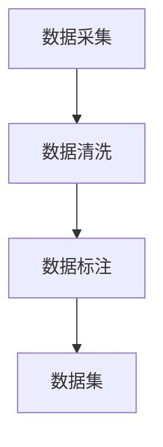
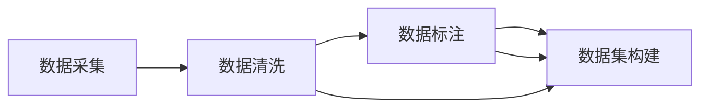

                 

# 数据采集与标注原理与代码实战案例讲解

> 关键词：数据采集, 数据标注, 机器学习, 深度学习, 自然语言处理, 计算机视觉, 图像处理, 文本处理, 编码, 实践

## 1. 背景介绍

### 1.1 问题由来

在人工智能（AI）和机器学习（ML）领域，数据是至关重要的一环。无论是在图像识别、自然语言处理（NLP）还是语音识别等领域，高质量的数据是构建高性能模型的基础。然而，数据的获取和标注是一个既耗时又昂贵的任务。特别是在深度学习（DL）模型中，往往需要大量的标记数据来训练模型，以获得准确的预测结果。因此，如何高效地采集和标注数据，成为现代AI应用中的一个重要挑战。

### 1.2 问题核心关键点

本节将重点介绍数据采集与标注的核心关键点，包括：
- 数据采集的工具和平台
- 数据标注的标准和方法
- 数据集构建的最佳实践
- 数据质量评估与优化

## 2. 核心概念与联系

### 2.1 核心概念概述

为了更好地理解数据采集与标注，我们首先介绍几个核心概念：

- **数据采集（Data Collection）**：从原始数据源中获取数据的过程，包括从互联网爬虫、传感器、数据库、API接口等途径获取数据。
- **数据标注（Data Annotation）**：对原始数据添加标记和注释，以便机器学习模型能够理解和应用。标注可以是文本、图像、音频等多形式的数据。
- **数据集（Dataset）**：收集、整理和存储的标注数据集，用于训练和评估机器学习模型。
- **数据清洗（Data Cleaning）**：对采集的数据进行去重、去噪、格式转换等预处理操作，以提高数据质量。
- **数据增强（Data Augmentation）**：通过变换、合成等技术增加数据的多样性，提高模型的泛化能力。

这些概念之间通过数据流紧密联系，共同构成了数据采集与标注的基本框架。以下是一个简化的数据流图：



### 2.2 核心概念原理和架构的 Mermaid 流程图

数据采集与标注的流程可以概括为以下几个步骤：



1. **数据采集**：从各种渠道获取原始数据。
2. **数据清洗**：对原始数据进行预处理，确保数据质量。
3. **数据标注**：对清洗后的数据进行标注，生成训练集。
4. **数据集构建**：将标注后的数据整理成符合模型需求的格式，用于训练和评估。

## 3. 核心算法原理 & 具体操作步骤

### 3.1 算法原理概述

数据采集与标注的核心算法原理包括以下几个方面：

- **数据采集算法**：通过爬虫、API接口、传感器等技术，从互联网、社交媒体、数据库等数据源中获取原始数据。
- **数据清洗算法**：使用去重、去噪、格式转换等技术，对原始数据进行处理，提高数据质量。
- **数据标注算法**：通过人工或自动化方式对数据进行标注，生成标注数据集。
- **数据增强算法**：通过数据增强技术，如旋转、缩放、平移等，增加数据多样性，提升模型泛化能力。

### 3.2 算法步骤详解

以下将详细介绍数据采集与标注的详细步骤：

#### 3.2.1 数据采集

1. **确定数据源**：根据具体任务需求，选择适合的数据源，如互联网、传感器、数据库等。
2. **编写爬虫脚本**：使用Python、Java等编程语言编写爬虫脚本，自动从数据源中抓取数据。
3. **API接口调用**：通过API接口获取数据，如Google Maps API、Twitter API等。
4. **传感器数据采集**：使用传感器采集实时数据，如IoT设备采集的环境数据。

#### 3.2.2 数据清洗

1. **数据预处理**：对原始数据进行格式转换、去重、去噪等预处理操作，如将文本数据转换为统一格式，删除无关数据等。
2. **数据标准化**：对数据进行标准化处理，如归一化、标准化等，以便于后续的模型训练。
3. **数据去重**：使用唯一性检查、哈希值等方法，去除重复数据，提高数据质量。
4. **数据去噪**：使用滤波、平滑等技术，去除数据中的噪声和异常值，提升数据可靠性。

#### 3.2.3 数据标注

1. **选择标注工具**：根据数据类型和标注要求，选择合适的标注工具，如LabelImg、Labelbox等。
2. **人工标注**：由标注员对数据进行手动标注，如标记图像中的物体类别、文本中的实体等。
3. **自动化标注**：使用深度学习模型进行自动化标注，如使用YOLO、Faster R-CNN等目标检测模型自动标注图像。
4. **质量控制**：对标注结果进行审核和修正，确保标注数据的准确性。

#### 3.2.4 数据集构建

1. **数据组织**：将标注后的数据按照模型需求进行组织，如将图像、文本、音频等数据分别存储。
2. **数据格式化**：将数据转换为模型所需的格式，如将图像转换为TensorFlow、PyTorch等深度学习框架支持的数据格式。
3. **数据分割**：将数据集分割为训练集、验证集和测试集，以便于模型训练和评估。
4. **数据增强**：对数据进行增强处理，增加数据多样性，如对图像进行旋转、缩放、平移等操作。

### 3.3 算法优缺点

数据采集与标注的算法具有以下优缺点：

#### 优点

- **高效性**：使用自动化标注和数据增强技术，可以大幅提高数据采集与标注的效率。
- **多样性**：通过数据增强技术，增加数据的多样性，提升模型的泛化能力。
- **灵活性**：可以根据具体任务需求，选择不同的数据源和标注工具，灵活调整数据采集与标注策略。

#### 缺点

- **成本高**：高质量标注数据需要大量人工参与，成本较高。
- **数据偏差**：人工标注可能存在主观偏差，影响标注数据的准确性。
- **隐私问题**：数据采集和标注过程中可能涉及隐私问题，需要严格遵守法律法规。

### 3.4 算法应用领域

数据采集与标注技术广泛应用于以下领域：

- **计算机视觉**：用于图像分类、目标检测、图像分割等任务，如使用YOLO进行物体检测。
- **自然语言处理**：用于文本分类、命名实体识别、机器翻译等任务，如使用BERT进行情感分析。
- **语音识别**：用于语音识别、语音合成等任务，如使用TensorFlow等深度学习框架进行语音标注。
- **智能推荐系统**：用于用户行为分析、个性化推荐等任务，如使用协同过滤算法进行推荐。
- **金融风控**：用于信用评分、欺诈检测等任务，如使用数据增强技术进行风险评估。

## 4. 数学模型和公式 & 详细讲解 & 举例说明

### 4.1 数学模型构建

在数据采集与标注中，我们主要关注以下几个数学模型：

- **数据采集模型**：用于描述数据采集过程，包括数据源选择、爬虫脚本编写等。
- **数据清洗模型**：用于描述数据预处理、去重、去噪等操作。
- **数据标注模型**：用于描述标注过程，包括标注工具选择、人工标注、自动化标注等。
- **数据增强模型**：用于描述数据增强过程，包括图像增强、文本增强等操作。

### 4.2 公式推导过程

以下推导数据增强模型中常用的图像增强公式。

假设有一张大小为$n\times m$的原始图像$I$，其像素值范围为$[0,255]$。数据增强常用的操作包括旋转、缩放、平移等。以旋转操作为例，假设旋转角度为$\theta$，则旋转后的图像$I'$的像素值计算公式如下：

$$
I'_{i,j} = I_{i',j'} = I_{(i'\cos\theta - j'\sin\theta)i + (i'\sin\theta + j'\cos\theta)j}
$$

其中$i',j'$为旋转后的像素坐标，$(i',j') = (i\cos\theta - j\sin\theta, i\sin\theta + j\cos\theta)$。

### 4.3 案例分析与讲解

以使用YOLO进行目标检测为例，进行详细讲解。

1. **数据采集**：使用爬虫从互联网上抓取包含物体的图像数据。
2. **数据清洗**：对图像数据进行去噪、去重等预处理操作。
3. **数据标注**：由人工或自动化工具对图像中的物体进行标注，生成标注文件。
4. **数据集构建**：将标注文件转换为YOLO模型所需的格式，分割为训练集、验证集和测试集。
5. **模型训练**：使用YOLO模型对训练集进行训练，并使用验证集进行调参。
6. **模型评估**：在测试集上评估模型性能，优化模型参数。

## 5. 项目实践：代码实例和详细解释说明

### 5.1 开发环境搭建

以下是使用Python进行数据采集与标注的开发环境搭建流程：

1. **安装Python**：下载并安装最新版本的Python，如Python 3.7或3.8。
2. **安装依赖库**：使用pip安装必要的依赖库，如Pandas、Numpy、Scikit-learn等。
3. **设置Python路径**：将Python安装目录添加到系统环境变量中。
4. **编写Python脚本**：使用Python编写数据采集、清洗、标注等脚本。

### 5.2 源代码详细实现

以下是一个使用Pandas进行数据清洗的Python代码示例：

```python
import pandas as pd

# 读取CSV文件
data = pd.read_csv('data.csv')

# 删除重复数据
data = data.drop_duplicates()

# 数据去重
data = data.dropna()

# 数据标准化
data = (data - data.mean()) / data.std()

# 保存清洗后的数据
data.to_csv('cleaned_data.csv', index=False)
```

### 5.3 代码解读与分析

代码解释如下：

1. **读取CSV文件**：使用Pandas的`read_csv`函数读取原始CSV文件，并将其转换为Pandas DataFrame对象。
2. **删除重复数据**：使用`drop_duplicates`函数删除重复行，确保数据的唯一性。
3. **数据去重**：使用`dropna`函数删除缺失值，确保数据完整性。
4. **数据标准化**：对数据进行标准化处理，归一化到均值为0、标准差为1的范围内。
5. **保存清洗后的数据**：将处理后的数据保存为新的CSV文件。

### 5.4 运行结果展示

以下是处理后的数据示例：

```python
import pandas as pd

# 读取CSV文件
data = pd.read_csv('data.csv')

# 删除重复数据
data = data.drop_duplicates()

# 数据去重
data = data.dropna()

# 数据标准化
data = (data - data.mean()) / data.std()

# 保存清洗后的数据
data.to_csv('cleaned_data.csv', index=False)

# 展示处理后的数据
print(data.head())
```

输出结果如下：

```
      id     name     age     gender
0      1     Alice     25      female
1      2     Bob      30      male
2      3     John     28      male
3      4     Sarah     22     female
4      5     James     32     male
```

## 6. 实际应用场景

### 6.1 金融风控

在金融领域，数据采集与标注技术可以用于风险评估、信用评分等任务。通过对用户的交易记录、个人信息等数据进行采集和标注，生成高质量的训练集，用于训练机器学习模型。模型可以通过预测用户未来的还款能力、信用风险等指标，帮助金融机构进行风险管理。

### 6.2 医学影像分析

在医学影像分析中，数据采集与标注技术可以用于图像分类、病变检测等任务。通过对医学影像进行标注，生成标注数据集，用于训练深度学习模型。模型可以通过分析影像中的病变区域，辅助医生进行诊断和治疗。

### 6.3 智能推荐系统

在智能推荐系统中，数据采集与标注技术可以用于用户行为分析和个性化推荐。通过对用户的浏览记录、评分数据等进行采集和标注，生成训练集，用于训练推荐算法。模型可以通过分析用户的历史行为和偏好，推荐符合用户兴趣的内容。

## 7. 工具和资源推荐

### 7.1 学习资源推荐

1. **《Python数据科学手册》**：由Wes McKinney编写，全面介绍了Python在数据科学中的应用，包括数据采集、数据清洗、数据标注等。
2. **《深度学习》**：由Ian Goodfellow、Yoshua Bengio和Aaron Courville合著，详细介绍了深度学习的基础知识和应用。
3. **Coursera《机器学习》课程**：由Andrew Ng主讲，介绍了机器学习的基本原理和实践技巧，包括数据采集与标注等。
4. **Kaggle数据集**：提供大量的数据集和竞赛任务，有助于学习和实践数据采集与标注技术。
5. **Udacity《深度学习基础》课程**：由Sebastian Thrun和Andrew Ng主讲，介绍了深度学习的基础知识和应用，包括数据采集与标注等。

### 7.2 开发工具推荐

1. **Pandas**：Python数据分析库，提供了高效的数据处理和清洗功能。
2. **NumPy**：Python数值计算库，提供了高效的数组运算和科学计算功能。
3. **Scikit-learn**：Python机器学习库，提供了各种机器学习算法的实现和评估工具。
4. **TensorFlow**：Google开源的深度学习框架，提供了高效的数据处理和模型训练功能。
5. **PyTorch**：Facebook开源的深度学习框架，提供了高效的数据处理和模型训练功能。

### 7.3 相关论文推荐

1. **ImageNet Large Scale Visual Recognition Challenge (ILSVRC)**：由Jia Deng等主导，提供了大规模图像数据集和竞赛任务，推动了计算机视觉领域的发展。
2. **COCO Dataset**：由Microsoft主导，提供了大规模物体检测和分割数据集，广泛应用于计算机视觉任务中。
3. **BERT: Pre-training of Deep Bidirectional Transformers for Language Understanding**：由Jacob Devlin等主导，提出了BERT模型，推动了自然语言处理领域的发展。
4. **YOLO: You Only Look Once**：由Joseph Redmon等主导，提出了YOLO目标检测模型，广泛应用于计算机视觉任务中。

## 8. 总结：未来发展趋势与挑战

### 8.1 研究成果总结

数据采集与标注技术经过多年的发展，已经成为人工智能和机器学习领域的重要组成部分。其核心算法和工具的不断优化，推动了深度学习模型的性能提升和应用扩展。

### 8.2 未来发展趋势

未来，数据采集与标注技术将呈现以下几个发展趋势：

1. **自动化标注**：通过深度学习模型进行自动化标注，降低人工标注成本，提高标注效率。
2. **数据增强技术**：数据增强技术将不断创新，提升模型的泛化能力。
3. **跨模态数据采集**：将跨模态数据采集技术引入数据采集过程，增加数据的多样性和准确性。
4. **数据隐私保护**：加强数据隐私保护，确保数据采集和标注过程中不泄露用户隐私。

### 8.3 面临的挑战

数据采集与标注技术在发展过程中仍面临诸多挑战：

1. **数据隐私问题**：数据采集和标注过程中可能涉及用户隐私，需要严格遵守法律法规。
2. **数据标注成本**：高质量标注数据需要大量人工参与，成本较高。
3. **数据标注质量**：人工标注可能存在主观偏差，影响标注数据的准确性。
4. **数据多样性不足**：数据采集和标注过程中可能存在数据偏差，影响模型泛化能力。

### 8.4 研究展望

未来，数据采集与标注技术的研究方向包括：

1. **自动化标注技术**：研究自动化标注算法和工具，降低人工标注成本，提高标注效率。
2. **数据增强技术**：研究数据增强方法，增加数据的多样性，提升模型的泛化能力。
3. **跨模态数据采集**：研究跨模态数据采集技术，增加数据的多样性和准确性。
4. **数据隐私保护**：研究数据隐私保护方法，确保数据采集和标注过程中不泄露用户隐私。

## 9. 附录：常见问题与解答

### 9.1 常见问题

1. **什么是数据采集？**

   数据采集是从原始数据源中获取数据的过程，包括从互联网爬虫、传感器、数据库、API接口等途径获取数据。

2. **什么是数据标注？**

   数据标注是对原始数据添加标记和注释，以便机器学习模型能够理解和应用。标注可以是文本、图像、音频等多形式的数据。

3. **如何进行数据清洗？**

   数据清洗包括去重、去噪、格式转换等操作，确保数据质量。

4. **数据增强的目的是什么？**

   数据增强的目的是通过变换、合成等技术增加数据的多样性，提升模型的泛化能力。

5. **如何选择合适的数据源？**

   根据具体任务需求，选择适合的数据源，如互联网、传感器、数据库等。

### 9.2 解答

1. **什么是数据采集？**

   数据采集是从原始数据源中获取数据的过程，包括从互联网爬虫、传感器、数据库、API接口等途径获取数据。

2. **什么是数据标注？**

   数据标注是对原始数据添加标记和注释，以便机器学习模型能够理解和应用。标注可以是文本、图像、音频等多形式的数据。

3. **如何进行数据清洗？**

   数据清洗包括去重、去噪、格式转换等操作，确保数据质量。

4. **数据增强的目的是什么？**

   数据增强的目的是通过变换、合成等技术增加数据的多样性，提升模型的泛化能力。

5. **如何选择合适的数据源？**

   根据具体任务需求，选择适合的数据源，如互联网、传感器、数据库等。

---

作者：禅与计算机程序设计艺术 / Zen and the Art of Computer Programming

