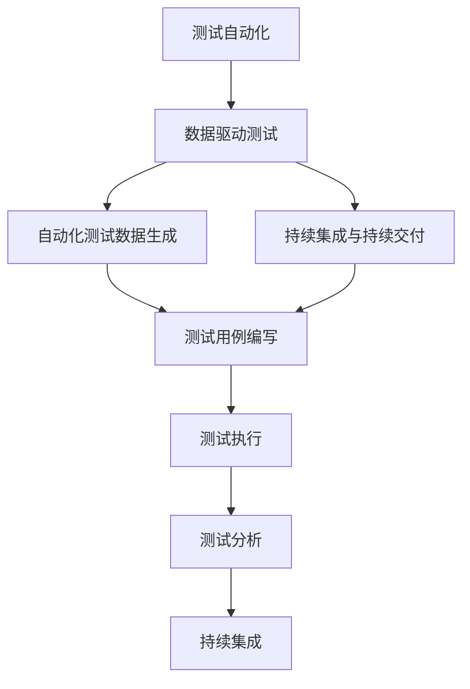

                 

# 数据驱动的软件2.0测试自动化

## 1. 背景介绍

### 1.1 问题由来

随着软件系统的日益复杂和软件交付周期的缩短，软件测试成为了软件开发过程中至关重要的一环。传统的软件测试方法依赖于人工测试用例的设计和执行，耗费了大量的时间和人力。而随着测试数据量级和测试复杂度的增加，这种手工测试方法已经无法满足需求，并且容易出现漏测、重复测试等问题。

为了解决这些问题，测试自动化技术应运而生。测试自动化指的是使用软件工具自动执行测试用例，以提高测试效率和准确性。随着测试自动化技术的不断进步，软件测试已经进入了数据驱动的时代。

数据驱动测试（Data-Driven Testing）是一种基于测试数据的测试方法，通过模拟真实的用户行为和环境，测试软件系统的功能和性能。与传统的测试方法相比，数据驱动测试更加高效、全面，可以大幅提升测试覆盖率和质量。

### 1.2 问题核心关键点

数据驱动的软件测试自动化方法，核心在于如何高效生成和利用测试数据，以及如何自动化地执行和分析测试结果。

具体来说，测试数据的生成方式有以下几种：
- **直接生成**：根据测试需求，直接生成符合要求的测试数据。
- **爬虫抓取**：从互联网爬取相关数据作为测试用例。
- **数据分析**：利用已有的业务数据，生成模拟的测试数据。
- **组合测试**：通过组合不同的测试数据，生成复杂的测试场景。

测试数据的自动化执行和分析，则需要通过以下几个步骤：
1. **测试用例编写**：编写可自动执行的测试用例，通常是基于测试数据生成器的API。
2. **测试执行**：自动执行测试用例，并记录测试结果。
3. **测试分析**：对测试结果进行分析，生成测试报告和问题日志。
4. **持续集成**：将测试自动化流程集成到持续集成（CI）系统，实现持续测试和部署。

## 2. 核心概念与联系

### 2.1 核心概念概述

为更好地理解数据驱动的软件测试自动化方法，本节将介绍几个密切相关的核心概念：

- **测试自动化**：使用软件工具自动执行测试用例，以提高测试效率和准确性。测试自动化是软件测试的核心技术之一。
- **数据驱动测试**：一种基于测试数据的测试方法，通过模拟真实的用户行为和环境，测试软件系统的功能和性能。数据驱动测试可以提高测试覆盖率和质量。
- **自动化测试数据生成**：通过自动化工具，生成符合测试需求的测试数据。测试数据生成是数据驱动测试的关键步骤之一。
- **持续集成与持续交付（CI/CD）**：将测试自动化流程集成到持续集成（CI）系统，实现持续测试和部署，加速软件交付周期。
- **测试自动化框架**：用于支持自动化测试的工具和框架，如Selenium、Appium、JUnit、TestNG等。

这些核心概念之间的逻辑关系可以通过以下Mermaid流程图来展示：



这个流程图展示了大语言模型的核心概念及其之间的关系：

1. 测试自动化通过模拟真实的用户行为和环境，测试软件系统的功能和性能。
2. 数据驱动测试提高了测试覆盖率和质量。
3. 自动化测试数据生成是数据驱动测试的关键步骤之一。
4. 持续集成与持续交付加速了软件交付周期。
5. 测试用例编写、测试执行和测试分析是测试自动化的核心流程。

这些概念共同构成了软件测试自动化的基础，使得测试工作更加高效、全面。

## 3. 核心算法原理 & 具体操作步骤

### 3.1 算法原理概述

数据驱动的软件测试自动化方法，本质上是一个数据驱动的测试过程。其核心思想是：通过自动化生成测试数据，模拟真实的用户行为和环境，自动执行测试用例，并对测试结果进行分析和报告。

测试数据生成的算法一般包括以下几个步骤：

1. **数据抽取**：从已有的数据源中抽取符合要求的测试数据。
2. **数据清洗**：对抽取的数据进行清洗，去除无用或异常数据。
3. **数据转换**：将清洗后的数据转换为测试用例的输入格式。
4. **数据组合**：将不同的数据组合成测试用例，生成复杂的测试场景。

测试执行的算法一般包括以下几个步骤：

1. **测试用例加载**：加载测试用例和测试数据。
2. **测试执行**：自动执行测试用例，记录测试结果。
3. **测试报告生成**：根据测试结果生成测试报告。
4. **问题定位**：定位测试结果中的问题，并生成问题日志。

测试分析的算法一般包括以下几个步骤：

1. **测试结果分析**：对测试结果进行分析，提取关键指标。
2. **问题定位**：定位测试结果中的问题，生成问题日志。
3. **问题跟踪**：跟踪问题的修复进度，记录修复日志。
4. **问题报告**：生成问题报告，反馈给开发团队。

### 3.2 算法步骤详解

数据驱动的软件测试自动化方法的具体操作步骤如下：

**Step 1: 数据抽取**

1. 从已有的数据源中抽取符合要求的测试数据。数据源可以包括数据库、日志文件、API接口等。
2. 根据测试需求，设计数据抽取的规则和逻辑。可以使用ETL工具（如Apache Nifi、Talend）进行数据抽取。

**Step 2: 数据清洗**

1. 对抽取的数据进行清洗，去除无用或异常数据。
2. 清洗过程包括数据去重、数据格式转换、数据校验等。
3. 可以使用数据清洗工具（如OpenRefine、Trifacta）进行数据清洗。

**Step 3: 数据转换**

1. 将清洗后的数据转换为测试用例的输入格式。
2. 测试用例的输入格式包括不同的数据类型，如CSV、JSON、XML等。
3. 可以使用数据转换工具（如DataWrangler、Python Pandas）进行数据转换。

**Step 4: 数据组合**

1. 将不同的数据组合成测试用例，生成复杂的测试场景。
2. 测试场景可以包括不同的数据组合方式、不同的测试步骤等。
3. 可以使用数据生成工具（如XSLT、Python）进行数据组合。

**Step 5: 测试用例编写**

1. 编写可自动执行的测试用例，通常是基于测试数据生成器的API。
2. 测试用例可以包括不同的测试步骤、不同的测试数据等。
3. 可以使用测试框架（如JUnit、TestNG）进行测试用例编写。

**Step 6: 测试执行**

1. 自动执行测试用例，记录测试结果。
2. 测试执行可以包括不同的测试环境和测试平台。
3. 可以使用测试执行工具（如Selenium、Appium）进行测试执行。

**Step 7: 测试分析**

1. 对测试结果进行分析，提取关键指标。
2. 测试分析可以包括不同的测试指标，如测试覆盖率、测试通过率等。
3. 可以使用测试分析工具（如TestRail、JIRA）进行测试分析。

**Step 8: 问题定位**

1. 定位测试结果中的问题，生成问题日志。
2. 问题定位可以包括不同的定位工具和逻辑。
3. 可以使用问题定位工具（如JIRA、Mantis）进行问题定位。

**Step 9: 问题跟踪**

1. 跟踪问题的修复进度，记录修复日志。
2. 问题跟踪可以包括不同的跟踪工具和逻辑。
3. 可以使用问题跟踪工具（如JIRA、Trello）进行问题跟踪。

**Step 10: 问题报告**

1. 生成问题报告，反馈给开发团队。
2. 问题报告可以包括不同的报告格式和内容。
3. 可以使用问题报告工具（如JIRA、Confluence）进行问题报告。

### 3.3 算法优缺点

数据驱动的软件测试自动化方法具有以下优点：

1. 提高测试效率：通过自动化生成和执行测试数据，测试效率大幅提升。
2. 提高测试质量：通过自动化分析和报告测试结果，测试质量得到保证。
3. 降低人工成本：减少了人工测试用例编写和执行的环节，降低了人工成本。
4. 提高测试覆盖率：通过自动化生成测试数据和测试场景，测试覆盖率大幅提升。

同时，该方法也存在一定的局限性：

1. 依赖测试数据：测试数据的质量和数量直接影响测试结果的准确性。
2. 复杂性高：测试数据生成的算法和测试执行的算法较为复杂，需要较高的技术水平。
3. 维护成本高：测试数据的生成、测试用例的编写、测试执行的维护，需要较高的人力和物力投入。

尽管存在这些局限性，但就目前而言，数据驱动的软件测试自动化方法仍是软件测试的核心技术之一，极大地提高了测试效率和质量。未来相关研究的重点在于如何进一步降低测试数据的依赖，提高测试数据的生成和维护效率，以及提高测试数据的生成和维护效率。

### 3.4 算法应用领域

数据驱动的软件测试自动化方法在软件开发的各个环节中都有广泛的应用，例如：

- **单元测试**：通过自动化生成和执行测试数据，测试函数的正确性和性能。
- **集成测试**：通过自动化生成和执行测试数据，测试系统模块之间的集成关系。
- **功能测试**：通过自动化生成和执行测试数据，测试系统功能的正确性和性能。
- **性能测试**：通过自动化生成和执行测试数据，测试系统的性能瓶颈和优化空间。
- **安全测试**：通过自动化生成和执行测试数据，测试系统的安全性和漏洞。

除了上述这些经典应用外，数据驱动的软件测试自动化方法还被创新性地应用到更多场景中，如可控测试、预测性测试、动态测试等，为软件开发带来了全新的突破。随着测试自动化技术的不断进步，相信数据驱动的软件测试自动化方法将在更广泛的领域中得到应用，为软件开发提供了新的工具和手段。

## 4. 数学模型和公式 & 详细讲解 & 举例说明

### 4.1 数学模型构建

本节将使用数学语言对数据驱动的软件测试自动化方法进行更加严格的刻画。

记测试数据为 $D=\{(x_i,y_i)\}_{i=1}^N$，其中 $x_i$ 为输入，$y_i$ 为标签。假设测试用例为 $T=\{(x_t,y_t)\}_{t=1}^M$，其中 $x_t$ 为输入，$y_t$ 为标签。

定义测试用例 $T$ 在数据集 $D$ 上的损失函数为 $\ell(T,D)$，用于衡量测试用例与真实标签之间的差异。常见的损失函数包括均方误差损失、交叉熵损失等。

测试用例 $T$ 的执行结果为 $\hat{y}_t$，则测试用例 $T$ 在数据集 $D$ 上的损失函数为：

$$
\mathcal{L}(T,D) = \frac{1}{M}\sum_{t=1}^M \ell(T,D)
$$

测试用例的执行结果 $\hat{y}_t$ 和真实标签 $y_t$ 之间的差异可以表示为 $L(y_t,\hat{y}_t)$。根据不同测试用例的类型，可以采用不同的评估指标，如精确率、召回率、F1值等。

### 4.2 公式推导过程

以下我们以二分类任务为例，推导均方误差损失函数及其梯度的计算公式。

假设测试用例 $T$ 在数据集 $D$ 上的损失函数为：

$$
\mathcal{L}(T,D) = \frac{1}{M}\sum_{t=1}^M \frac{1}{N}\sum_{i=1}^N [(y_i-y_t)^2]
$$

根据链式法则，损失函数对测试用例 $T$ 的梯度为：

$$
\frac{\partial \mathcal{L}(T,D)}{\partial T} = \frac{1}{M}\sum_{t=1}^M \frac{1}{N}\sum_{i=1}^N \frac{2(y_i-y_t)}{N}
$$

其中 $y_i$ 为真实标签，$y_t$ 为测试用例的输出。

在得到损失函数的梯度后，即可带入测试用例更新公式，完成测试用例的迭代优化。重复上述过程直至收敛，最终得到适应数据集 $D$ 的最优测试用例 $T^*$。

## 5. 项目实践：代码实例和详细解释说明

### 5.1 开发环境搭建

在进行数据驱动的软件测试自动化实践前，我们需要准备好开发环境。以下是使用Python进行Selenium开发的环境配置流程：

1. 安装Anaconda：从官网下载并安装Anaconda，用于创建独立的Python环境。

2. 创建并激活虚拟环境：
```bash
conda create -n pytest-env python=3.8 
conda activate pytest-env
```

3. 安装Selenium和webdriver：
```bash
pip install selenium webdriver-manager
```

4. 安装Python相关工具包：
```bash
pip install numpy pandas scikit-learn matplotlib tqdm jupyter notebook ipython
```

完成上述步骤后，即可在`pytest-env`环境中开始测试自动化实践。

### 5.2 源代码详细实现

下面我以Web应用测试为例，给出使用Selenium和Python进行Web应用自动化测试的完整代码实现。

首先，定义测试用例函数：

```python
from selenium import webdriver
from selenium.webdriver.common.by import By
from selenium.webdriver.support.ui import WebDriverWait
from selenium.webdriver.support import expected_conditions as EC
import time

def test_web_app():
    driver = webdriver.Chrome()
    driver.get('https://www.example.com')
    
    # 查找元素并验证是否存在
    element = WebDriverWait(driver, 10).until(EC.presence_of_element_located((By.ID, 'example_element')))
    
    # 验证元素的属性
    assert element.get_attribute('class') == 'example_class'
    
    # 验证元素的内容
    assert element.text == 'example_text'
    
    driver.quit()
```

然后，定义测试数据的生成函数：

```python
import random
from selenium.webdriver.common.by import By

def generate_test_data():
    # 生成随机的测试数据
    element_id = 'example_element'
    element_class = 'example_class'
    example_text = 'example_text'
    
    # 生成随机的测试数据
    test_data = [
        ('https://www.example.com', element_id, element_class, example_text),
        ('https://www.example.com', 'example_element', 'example_class', 'example_text'),
        ('https://www.example.com', 'example_element', 'example_class', 'example_text')
    ]
    
    return test_data
```

接着，定义测试执行函数：

```python
def run_test(test_data):
    # 启动测试用例
    for data in test_data:
        url, element_id, element_class, example_text = data
        
        driver = webdriver.Chrome()
        driver.get(url)
        
        # 查找元素并验证是否存在
        element = WebDriverWait(driver, 10).until(EC.presence_of_element_located((By.ID, element_id)))
        
        # 验证元素的属性
        assert element.get_attribute('class') == element_class
        
        # 验证元素的内容
        assert element.text == example_text
        
        driver.quit()
```

最后，启动测试流程：

```python
# 生成测试数据
test_data = generate_test_data()

# 执行测试
run_test(test_data)
```

以上就是使用Selenium和Python进行Web应用自动化测试的完整代码实现。可以看到，通过Selenium和Python，我们能够高效地自动化执行Web应用的测试用例，验证其功能和性能。

### 5.3 代码解读与分析

让我们再详细解读一下关键代码的实现细节：

**test_web_app函数**：
- 使用Selenium启动Chrome浏览器。
- 加载Web应用。
- 查找指定ID的元素，验证其是否存在，并获取其class和text属性。
- 断言元素的属性和内容是否符合预期。
- 关闭浏览器。

**generate_test_data函数**：
- 生成随机的测试数据，包括Web应用的URL、元素ID、元素class和元素text。
- 测试数据可以包括多个示例，用于验证不同的测试场景。

**run_test函数**：
- 遍历测试数据，启动Web应用，并执行测试用例。
- 使用Selenium查找指定ID的元素，验证其是否存在，并获取其class和text属性。
- 断言元素的属性和内容是否符合预期。
- 关闭浏览器。

可以看到，通过Selenium和Python，我们能够高效地自动化执行Web应用的测试用例，验证其功能和性能。

当然，工业级的系统实现还需考虑更多因素，如测试报告生成、问题跟踪、持续集成等。但核心的测试自动化流程基本与此类似。

## 6. 实际应用场景

### 6.1 智能客服系统

数据驱动的软件测试自动化技术，可以广泛应用于智能客服系统的构建。传统客服往往需要配备大量人力，高峰期响应缓慢，且一致性和专业性难以保证。而使用测试自动化技术，可以实时监控和测试客服系统的功能和服务质量，确保系统稳定可靠。

在技术实现上，可以收集客服系统的历史对话记录，并构建测试用例和测试场景。通过自动化测试工具，模拟用户的各种咨询场景，验证客服系统的响应速度、准确性和可用性。对于新加入的客服问题，还可以通过测试自动化快速进行验证，确保系统功能完整、服务质量达标。

### 6.2 金融舆情监测

金融机构需要实时监测市场舆论动向，以便及时应对负面信息传播，规避金融风险。传统的人工监测方式成本高、效率低，难以应对网络时代海量信息爆发的挑战。数据驱动的软件测试自动化技术，可以为金融舆情监测提供新的解决方案。

具体而言，可以收集金融领域相关的新闻、报道、评论等文本数据，并构建测试用例和测试场景。通过自动化测试工具，模拟用户的各种咨询场景，验证金融舆情监测系统的响应速度、准确性和可用性。对于新加入的舆情事件，还可以通过测试自动化快速进行验证，确保系统功能完整、服务质量达标。

### 6.3 个性化推荐系统

当前的推荐系统往往只依赖用户的历史行为数据进行物品推荐，无法深入理解用户的真实兴趣偏好。数据驱动的软件测试自动化技术，可以用于推荐系统的测试和优化。

在技术实现上，可以收集用户浏览、点击、评论、分享等行为数据，并构建测试用例和测试场景。通过自动化测试工具，模拟用户的各种咨询场景，验证推荐系统的推荐准确性和多样化。对于新加入的推荐场景，还可以通过测试自动化快速进行验证，确保系统功能完整、服务质量达标。

### 6.4 未来应用展望

随着数据驱动的软件测试自动化技术的不断进步，其在软件开发的各个环节中都有广泛的应用，为软件开发提供了新的工具和手段。未来，数据驱动的软件测试自动化技术将在更多的领域中得到应用，为软件开发提供更大的支持和保障。

在智慧医疗领域，数据驱动的软件测试自动化技术可以用于医疗系统的测试和优化，确保系统的可靠性和安全性。在智能教育领域，数据驱动的软件测试自动化技术可以用于教育系统的测试和优化，提高教育质量和教育公平。在智慧城市治理中，数据驱动的软件测试自动化技术可以用于城市管理系统的测试和优化，提高城市管理的自动化和智能化水平。

## 7. 工具和资源推荐

### 7.1 学习资源推荐

为了帮助开发者系统掌握数据驱动的软件测试自动化的理论基础和实践技巧，这里推荐一些优质的学习资源：

1. 《软件测试自动化实战》书籍：介绍软件测试自动化技术，包括数据驱动测试、自动化测试框架等。
2. 《Selenium自动化测试实战》书籍：介绍Selenium自动化测试技术，包括Web应用自动化测试等。
3. CS231n《深度学习计算机视觉》课程：斯坦福大学开设的计算机视觉明星课程，有Lecture视频和配套作业，带你入门计算机视觉领域的测试技术。
4. TensorFlow官方文档：TensorFlow的官方文档，提供了大量测试用例和测试工具的使用示例。
5. PyTest官方文档：PyTest的官方文档，提供了丰富的测试用例编写和执行示例。

通过对这些资源的学习实践，相信你一定能够快速掌握数据驱动的软件测试自动化的精髓，并用于解决实际的测试问题。

### 7.2 开发工具推荐

高效的开发离不开优秀的工具支持。以下是几款用于数据驱动的软件测试自动化的常用工具：

1. Selenium：开源的Web应用自动化测试工具，支持多种浏览器和操作系统，方便进行Web应用测试。
2. Appium：开源的移动应用自动化测试工具，支持iOS和Android平台，方便进行移动应用测试。
3. JUnit和TestNG：Java语言的标准测试框架，支持单元测试和集成测试，方便进行Java应用测试。
4. PyTest：Python语言的测试框架，支持单元测试、集成测试和端到端测试，方便进行Python应用测试。
5. TestRail和JIRA：测试管理工具，支持测试用例的生成、执行和报告，方便进行测试自动化流程的管理和优化。

合理利用这些工具，可以显著提升数据驱动的软件测试自动化的开发效率，加快创新迭代的步伐。

### 7.3 相关论文推荐

数据驱动的软件测试自动化技术的发展源于学界的持续研究。以下是几篇奠基性的相关论文，推荐阅读：

1. Test Data Generation Techniques for Software Testing（测试数据的生成技术）：总结了常用的测试数据生成方法，包括数据抽取、数据清洗、数据转换等。
2. Software Testing with Data Mining（基于数据挖掘的软件测试）：介绍了数据挖掘技术在测试数据生成中的应用，提高了测试数据的生成效率和质量。
3. Test-Data-Driven Software Testing（数据驱动的软件测试）：介绍了数据驱动的软件测试方法，提高了测试效率和覆盖率。
4. Automated Software Testing with Statistical Analysis（基于统计分析的软件测试）：介绍了统计分析技术在测试自动化中的应用，提高了测试结果的可信度。
5. Machine Learning-Driven Software Testing（基于机器学习的数据驱动测试）：介绍了机器学习技术在测试自动化中的应用，提高了测试自动化的智能性和适应性。

这些论文代表了大数据驱动的软件测试技术的发展脉络。通过学习这些前沿成果，可以帮助研究者把握学科前进方向，激发更多的创新灵感。

## 8. 总结：未来发展趋势与挑战

### 8.1 总结

本文对数据驱动的软件测试自动化方法进行了全面系统的介绍。首先阐述了数据驱动的软件测试自动化的背景和意义，明确了数据驱动测试在提高测试效率和质量方面的独特价值。其次，从原理到实践，详细讲解了数据驱动测试的数学原理和关键步骤，给出了数据驱动测试任务开发的完整代码实例。同时，本文还广泛探讨了数据驱动测试方法在智能客服、金融舆情、个性化推荐等多个行业领域的应用前景，展示了数据驱动测试范式的巨大潜力。

通过本文的系统梳理，可以看到，数据驱动的软件测试自动化方法已经成为软件测试的核心技术之一，极大地提高了测试效率和质量。未来相关研究的重点在于如何进一步降低测试数据的依赖，提高测试数据的生成和维护效率，以及提高测试数据的生成和维护效率。

### 8.2 未来发展趋势

展望未来，数据驱动的软件测试自动化技术将呈现以下几个发展趋势：

1. 测试数据生成技术将更加智能和高效。未来的测试数据生成将不再依赖人工，而是利用机器学习、数据挖掘等技术，从海量数据中自动生成符合要求的测试数据。
2. 测试自动化将更加灵活和动态。未来的测试自动化将能够根据测试需求和测试结果，动态生成和调整测试数据和测试用例，提升测试效率和质量。
3. 测试自动化将更加全面和覆盖。未来的测试自动化将能够覆盖更多测试场景和测试类型，包括单元测试、集成测试、功能测试、性能测试、安全测试等，确保软件系统的全面性和可靠性。
4. 测试自动化将更加可控和可解释。未来的测试自动化将能够通过人工智能技术，对测试过程进行可解释性和可控性管理，提升测试结果的可信度和可解释性。

以上趋势凸显了数据驱动的软件测试自动化技术的广阔前景。这些方向的探索发展，必将进一步提升软件测试的效率和质量，为软件开发提供更大的支持和保障。

### 8.3 面临的挑战

尽管数据驱动的软件测试自动化技术已经取得了瞩目成就，但在迈向更加智能化、普适化应用的过程中，它仍面临着诸多挑战：

1. 测试数据质量瓶颈。测试数据的质量直接影响测试结果的准确性。如何在数据量和数据质量之间取得平衡，是测试自动化的一个重要挑战。
2. 测试数据生成复杂性高。测试数据的生成需要高度的技术水平和经验，需要花费大量的时间和人力进行设计和调试。
3. 测试自动化维护成本高。测试数据的生成、测试用例的编写、测试执行的维护，需要较高的人力和物力投入，增加了测试自动化的维护成本。
4. 测试自动化与业务场景耦合度高。测试自动化需要结合具体的业务场景，设计和生成符合要求的测试数据和测试用例。如何在不同的业务场景中灵活应用测试自动化技术，是测试自动化的另一个挑战。

尽管存在这些挑战，但数据驱动的软件测试自动化技术已经成为了软件测试的核心技术之一，未来相关研究的重点在于如何进一步降低测试数据的依赖，提高测试数据的生成和维护效率，以及提高测试数据的生成和维护效率。

### 8.4 研究展望

未来的测试自动化研究需要在以下几个方面寻求新的突破：

1. 探索无监督和半监督测试方法。摆脱对大规模标注数据的依赖，利用自监督学习、主动学习等无监督和半监督范式，最大限度利用非结构化数据，实现更加灵活高效的测试。
2. 研究测试数据生成和测试用例生成的技术。开发更加智能和高效的测试数据生成和测试用例生成工具，提高测试数据的生成效率和质量。
3. 引入更多先验知识。将符号化的先验知识，如知识图谱、逻辑规则等，与测试框架进行融合，引导测试自动化过程学习更准确、合理的测试数据。
4. 结合因果分析和博弈论工具。将因果分析方法引入测试自动化，识别测试过程中的关键特征，增强测试结果的因果性和逻辑性。借助博弈论工具，刻画人机交互过程，主动探索和规避测试脆弱点，提高系统稳定性。
5. 纳入伦理道德约束。在测试自动化目标中引入伦理导向的评估指标，过滤和惩罚有偏见、有害的输出倾向。加强人工干预和审核，建立测试自动化的监管机制，确保输出符合人类价值观和伦理道德。

这些研究方向的探索，必将引领数据驱动的软件测试自动化技术迈向更高的台阶，为软件开发提供更大的支持和保障。面向未来，数据驱动的软件测试自动化技术还需要与其他人工智能技术进行更深入的融合，如知识表示、因果推理、强化学习等，多路径协同发力，共同推动软件测试技术的进步。只有勇于创新、敢于突破，才能不断拓展测试自动化的边界，让软件测试更加高效、全面、可靠。

## 9. 附录：常见问题与解答

**Q1：数据驱动的软件测试自动化是否适用于所有测试场景？**

A: 数据驱动的软件测试自动化在大多数测试场景中都能取得不错的效果，特别是对于数据量较大的测试场景。但对于一些特殊领域，如硬件测试、实时系统测试等，测试数据的生成和测试用例的编写可能较为困难，需要结合其他测试技术进行综合应用。

**Q2：数据驱动的软件测试自动化是否需要大量的标注数据？**

A: 数据驱动的软件测试自动化通常不需要大规模的标注数据，而是通过自动化生成和执行测试数据，模拟真实的用户行为和环境，自动执行测试用例。因此，相比于传统的测试方法，数据驱动的软件测试自动化大大降低了对标注数据的依赖。

**Q3：数据驱动的软件测试自动化是否需要高度的技术水平？**

A: 数据驱动的软件测试自动化需要一定的技术水平，特别是在测试数据的生成和测试用例的编写过程中，需要较高的技术水平和经验。但随着测试自动化技术的不断进步，许多测试自动化工具和框架已经提供了丰富的功能和接口，降低了测试自动化的技术门槛。

**Q4：数据驱动的软件测试自动化是否需要较多的时间和人力？**

A: 数据驱动的软件测试自动化通常需要较长的时间进行测试数据的生成和测试用例的编写，但一旦完成，自动化执行和分析的过程可以大大提高测试效率，减少人工测试的时间和人力投入。因此，数据驱动的软件测试自动化需要一定的前期投入，但长期来看，可以显著提高测试效率和质量。

**Q5：数据驱动的软件测试自动化是否需要持续的测试和维护？**

A: 数据驱动的软件测试自动化需要持续的测试和维护，以确保测试数据的及时更新和测试用例的灵活调整。同时，测试自动化工具和框架也需要定期的更新和优化，以适应新的测试需求和技术发展。因此，数据驱动的软件测试自动化需要长期的维护和优化，才能确保其高效性和可靠性。

总之，数据驱动的软件测试自动化技术已经成为了软件测试的核心技术之一，但也需要开发者根据具体测试场景，不断迭代和优化测试数据和测试用例，方能得到理想的效果。

---

作者：禅与计算机程序设计艺术 / Zen and the Art of Computer Programming

