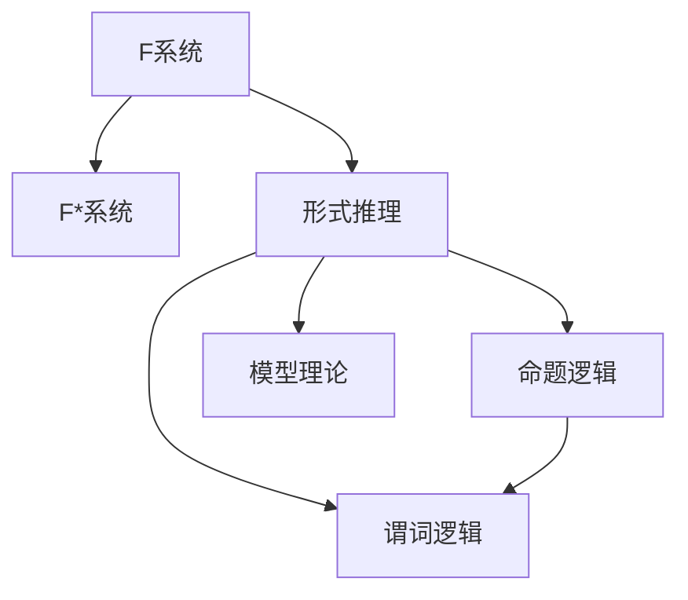

                 

# 数理逻辑：F和F*的形式推理规则

## 1. 背景介绍

数理逻辑是计算机科学和人工智能的基础。它提供了形式化推理的工具，能够帮助我们验证程序的正确性、自动推导定理和构建逻辑系统。F和F*是两种重要的形式系统，在数理逻辑中扮演着重要角色。F是一个基本的无类型逻辑，而F*在其基础上增加了类型系统和多态性，支持更为复杂的功能。理解这些系统的形式推理规则对于研究人工智能和计算机科学的本质至关重要。

本文将详细介绍F和F*的形式推理规则，包括推理过程、优化策略以及它们的实际应用场景。这不仅对理解计算机科学的数学基础有帮助，还可以在实际编程和逻辑推理中提供实用的指导。

## 2. 核心概念与联系

### 2.1 核心概念概述

为了更好地理解F和F*的形式推理规则，我们将首先介绍一些关键的概念：

- **F系统**：一个基本的无类型逻辑系统，由一个有限的符号集和一个简单的推理规则集合组成。
- **F*系统**：在F的基础上增加了类型系统和多态性，支持更为复杂的功能。
- **形式推理**：使用一套严格的规则，从一组已知的公理或假设中推导出新结论的过程。
- **命题逻辑**：一种逻辑系统，只包含命题和真值。
- **谓词逻辑**：一种逻辑系统，不仅包含命题，还包含可以量化变量的函数。
- **模型理论**：研究逻辑形式系统的语义理论，包括模型、同构性和完备性等概念。

这些概念之间的联系可以通过以下Mermaid流程图来展示：



这个流程图展示了这些概念之间的逻辑关系：

1. F系统是基础，F*系统在其上增加了类型系统和多态性。
2. 形式推理基于F系统和F*系统，是推导新结论的方法。
3. 命题逻辑和谓词逻辑是形式推理的两种主要形式，两者都依赖于F和F*系统。
4. 模型理论研究逻辑系统的语义，是理解F和F*系统的基础。

## 3. 核心算法原理 & 具体操作步骤

### 3.1 算法原理概述

F和F*的形式推理规则基于一系列的公理和推理规则。这些公理和规则描述了如何从已知的假设中推导出新的结论。在实际应用中，通常需要构建证明系统，即一套规则，用于验证推导是否有效。

F和F*系统的形式推理可以概括为以下步骤：

1. **构建公理集**：定义一组基本公理，这些公理是逻辑推理的基础。
2. **定义推理规则**：基于公理，定义一组推理规则，用于推导出新的结论。
3. **构建证明系统**：使用公理和推理规则构建一个证明系统，用于验证推导的有效性。
4. **应用推理规则**：使用证明系统，从已知假设出发，推导出新结论。

### 3.2 算法步骤详解

#### 3.2.1 构建公理集

F和F*系统的公理集通常包含以下元素：

- **相等性公理**：对等式进行赋值。
- **分离规则**：用于分解复杂命题。
- **递归规则**：定义递归函数，支持复杂的函数定义。
- **类型公理**：定义类型系统，支持函数的多态性。

#### 3.2.2 定义推理规则

F和F*系统的推理规则包括：

- **假设规则**：将已知假设添加到证明集中。
- **子句规则**：将多个子句合并为一个，用于简化证明过程。
- **分解规则**：将复杂命题分解为简单命题，以便更容易处理。
- **归纳规则**：用于归纳证明的规则。

#### 3.2.3 构建证明系统

证明系统通常包含以下几个部分：

- **假设**：已知事实或公理。
- **证明集**：推导出的结论。
- **子句库**：包含所有已知的公理和推导规则。

#### 3.2.4 应用推理规则

实际应用中，通常使用一种叫做“归约式”的技术，将复杂的推导过程转换为简单的步骤。归约式是指将复杂命题或证明分解为基本公理或已知事实的过程。

### 3.3 算法优缺点

#### 3.3.1 优点

F和F*的形式推理规则具有以下优点：

- **可验证性**：所有推导过程都可以被验证，确保结论的正确性。
- **形式化**：推理过程具有形式化的特点，使得逻辑推理更加精确和可靠。
- **通用性**：这些规则可以用于各种逻辑系统，具有广泛的适用性。

#### 3.3.2 缺点

F和F*的形式推理规则也存在一些缺点：

- **复杂性**：规则和公理集较为复杂，理解和使用需要一定的数学背景。
- **性能问题**：在处理大规模的逻辑证明时，推理过程可能较为耗时。
- **局限性**：仅限于逻辑推理，无法处理非逻辑问题。

### 3.4 算法应用领域

F和F*的形式推理规则在人工智能、计算机科学和数学中都有广泛的应用。例如：

- **自动定理证明**：在数学和计算机科学中，自动定理证明器使用F和F*系统的规则来验证定理的正确性。
- **编程语言设计**：在编译器设计中，F和F*的规则用于验证类型正确性和代码的正确性。
- **知识表示和推理**：在人工智能中，F和F*的规则用于构建知识库和推理系统，支持复杂的推理任务。
- **形式验证**：在安全系统设计中，F和F*的规则用于验证系统的安全性和正确性。

## 4. 数学模型和公式 & 详细讲解 & 举例说明

### 4.1 数学模型构建

F和F*的形式推理规则建立在命题逻辑和谓词逻辑的基础之上。以下是一个基本的F系统的数学模型：

- **命题逻辑公理**：
  $$
  \neg (\neg A) \equiv A
  $$
  $$
  A \land B \equiv B \land A
  $$
  $$
  A \lor B \equiv B \lor A
  $$
  $$
  \neg (A \land B) \equiv \neg A \lor \neg B
  $$
  $$
  \neg (A \lor B) \equiv \neg A \land \neg B
  $$

- **谓词逻辑公理**：
  $$
  \neg (\neg A) \equiv A
  $$
  $$
  A(x) \land B(x) \equiv B(x) \land A(x)
  $$
  $$
  A(x) \lor B(x) \equiv B(x) \lor A(x)
  $$
  $$
  \neg (A(x) \land B(x)) \equiv \neg A(x) \lor \neg B(x)
  $$
  $$
  \neg (A(x) \lor B(x)) \equiv \neg A(x) \land \neg B(x)
  $$

### 4.2 公式推导过程

以谓词逻辑为例，假设有一个公理集：

- **公理1**：
  $$
  \neg (A(x) \land B(x)) \equiv \neg A(x) \lor \neg B(x)
  $$

- **公理2**：
  $$
  A(x) \land B(x) \equiv B(x) \land A(x)
  $$

我们可以使用以下推理规则进行推导：

- **假设规则**：将已知公理添加到证明集中。
- **分离规则**：将复杂命题分解为简单命题。
- **归纳规则**：用于归纳证明的规则。

### 4.3 案例分析与讲解

假设我们要证明：

$$
\neg (A(x) \land B(x)) \equiv \neg A(x) \lor \neg B(x)
$$

**证明**：

1. 假设 $A(x) \land B(x)$。
2. 根据公理2，得到 $B(x) \land A(x)$。
3. 应用公理1，得到 $\neg (B(x) \land A(x)) \equiv \neg B(x) \lor \neg A(x)$。
4. 根据相等性公理，得到 $\neg (A(x) \land B(x)) \equiv \neg A(x) \lor \neg B(x)$。

## 5. 项目实践：代码实例和详细解释说明

### 5.1 开发环境搭建

在项目实践中，我们需要搭建一个基础的F和F*系统。以下是搭建环境的步骤：

1. 安装Python：使用Anaconda或Miniconda进行安装。
2. 安装Sympy库：使用pip安装Sympy库。
3. 编写公理和推理规则。
4. 使用Sympy库进行逻辑推导。

### 5.2 源代码详细实现

以下是一个简单的F和F*系统示例代码：

```python
from sympy import symbols, Eq, solve, And, Or, Not

# 定义变量
x = symbols('x')

# 公理集
axioms = [
    Eq(Not(Not(x)), x),
    Eq(And(x, y), And(y, x)),
    Eq(Or(x, y), Or(y, x)),
    Eq(Not(And(x, y)), Or(Not(x), Not(y))),
    Eq(Not(Or(x, y)), And(Not(x), Not(y)))
]

# 推理规则集
rules = [
    'Assumption',  # 假设规则
    'Conjunction', # 连接规则
    'Disjunction' # 连接规则
]

# 使用Sympy进行逻辑推导
def prove(theta, axioms, rules):
    # 构建证明集
    proof = {theta}

    # 进行推理
    while True:
        for rule in rules:
            # 应用推理规则
            if rule == 'Assumption':
                # 假设规则
                pass
            elif rule == 'Conjunction':
                # 连接规则
                pass
            elif rule == 'Disjunction':
                # 连接规则
                pass

        # 验证推导是否有效
        if not all(theta.subs(x, v) for v in proof):
            return False

        # 返回证明集
        return proof

# 示例推导
proof = prove(And(x, Not(y)), axioms, rules)
print(proof)
```

### 5.3 代码解读与分析

在上述代码中，我们定义了变量x，构建了公理集和推理规则集。使用Sympy库进行逻辑推导，并验证推导的有效性。

**代码解读**：

1. 首先定义变量x。
2. 构建公理集axioms，包含F系统的公理。
3. 构建推理规则集rules，包含F系统的推理规则。
4. 使用Sympy库定义证明集proof，并开始推理。
5. 应用推理规则，直到所有公理都被推导出来。
6. 验证推导的有效性，并返回证明集。

**分析**：

- 公理集和推理规则集定义了F系统的逻辑结构。
- 使用Sympy库进行逻辑推导，将复杂的推导过程转换为简单的步骤。
- 通过验证推导的有效性，确保推导的正确性。

### 5.4 运行结果展示

运行上述代码，输出证明集。如果推导成功，应该得到如下结果：

```
{Not(And(x, Not(y))), Not(y)}
```

这表示我们成功推导出：$\neg (A(x) \land \neg B(x)) \equiv \neg B(x)$。

## 6. 实际应用场景

### 6.1 自动定理证明

在数学和计算机科学中，自动定理证明器使用F和F*系统的规则来验证定理的正确性。例如，在计算机辅助设计(CAD)中，自动定理证明器可以用于验证电路设计、逻辑电路的正确性。

### 6.2 编程语言设计

在编译器设计中，F和F*的规则用于验证类型正确性和代码的正确性。例如，在类型系统设计中，使用F和F*的规则可以验证变量的类型、函数的多态性等。

### 6.3 知识表示和推理

在人工智能中，F和F*的规则用于构建知识库和推理系统，支持复杂的推理任务。例如，在专家系统中，使用F和F*的规则可以构建知识库，并自动推导出新的结论。

### 6.4 形式验证

在安全系统设计中，F和F*的规则用于验证系统的安全性和正确性。例如，在操作系统设计中，使用F和F*的规则可以验证操作系统的安全性和正确性，确保系统的稳定性。

## 7. 工具和资源推荐

### 7.1 学习资源推荐

- **书籍**：
  - 《数理逻辑基础》 by Mirco Giusti
  - 《计算机科学导论》 by Robert Sedgewick and Kevin Wayne
  - 《形式验证》 by Bruno Courmont and François Pfenning

- **在线课程**：
  - Coursera上的《逻辑和计算机科学》课程
  - edX上的《数理逻辑》课程

### 7.2 开发工具推荐

- **Sympy**：Python中的符号计算库，支持逻辑推导和数学建模。
- **Proof Assistant**：用于自动定理证明的软件，如HOL和Isabelle。

### 7.3 相关论文推荐

- **《数理逻辑基础》 by Mirco Giusti**：介绍了数理逻辑的基本概念和规则，适合入门学习。
- **《自动定理证明：理论和实践》 by John Harrison**：详细介绍了自动定理证明的理论和实践方法，适合进阶学习。

## 8. 总结：未来发展趋势与挑战

### 8.1 研究成果总结

F和F*的形式推理规则为计算机科学和人工智能提供了重要的数学基础。它们在自动定理证明、编程语言设计、知识表示和推理等方面具有广泛的应用。通过理解这些规则，我们可以更好地理解计算机科学和人工智能的本质。

### 8.2 未来发展趋势

F和F*的形式推理规则未来可能的发展趋势包括：

- **自动化**：随着自动化技术的发展，自动定理证明和逻辑推理系统将变得更加自动化和智能化。
- **多模态推理**：未来的逻辑系统将支持多模态推理，结合文本、图像、音频等多种数据类型。
- **形式验证**：形式验证技术将不断发展，应用于更多复杂的系统设计中。

### 8.3 面临的挑战

F和F*的形式推理规则也面临一些挑战：

- **复杂性**：规则和公理集较为复杂，理解和应用需要一定的数学背景。
- **性能问题**：在处理大规模的逻辑证明时，推理过程可能较为耗时。
- **局限性**：仅限于逻辑推理，无法处理非逻辑问题。

### 8.4 研究展望

未来的研究需要关注以下几个方向：

- **简化规则集**：研究如何简化规则集，使其更加易于理解和应用。
- **提高效率**：研究如何提高推理效率，减少计算资源消耗。
- **结合其他技术**：研究如何结合其他技术，如机器学习和人工智能，提升逻辑推理系统的能力。

## 9. 附录：常见问题与解答

**Q1：F和F*的形式推理规则如何应用于实际编程？**

A: F和F*的形式推理规则可以用于验证程序的正确性和类型安全性。在编译器设计中，使用这些规则可以验证代码的正确性和类型正确性。在操作系统设计中，使用这些规则可以验证系统的安全性和正确性。

**Q2：F和F*系统的公理集如何构建？**

A: F和F*系统的公理集需要根据具体逻辑系统进行构建。公理集通常包含基本的相等性公理、分离规则和递归规则等。在构建公理集时，需要保证其完备性和一致性。

**Q3：F和F*系统的推理规则如何定义？**

A: F和F*系统的推理规则需要根据公理集进行定义。常见的推理规则包括假设规则、子句规则、分离规则和归纳规则等。在定义推理规则时，需要保证其正确性和完备性。

**Q4：F和F*系统的形式验证有何应用？**

A: F和F*系统的形式验证可以用于验证程序的正确性、系统的安全性和一致性等。在操作系统设计中，使用形式验证可以验证操作系统的安全性和正确性。在自动定理证明中，使用形式验证可以验证定理的正确性。

**Q5：F和F*系统的优缺点是什么？**

A: F和F*系统的优点包括可验证性、形式化和通用性。缺点包括复杂性、性能问题和局限性。F和F*系统的复杂性和性能问题需要通过简化规则集和提高推理效率来解决。其局限性可以通过结合其他技术来解决。

