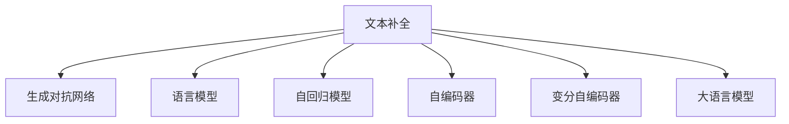

                 

# 文本内容补全初探（Text Completion）

> 关键词：文本补全,生成对抗网络,语言模型,自回归,Transformer,BERT,自编码,变分自编码器

## 1. 背景介绍

文本内容补全（Text Completion）是自然语言处理（NLP）中的一个重要问题。它指的是给定一段不完整的文本，模型需要预测出缺失的单词、句子或段落。文本补全技术在多种场景中都有着重要的应用，如文本编辑、机器翻译、自动摘要、智能对话等。它要求模型具备强大的语言理解和生成能力，能够根据上下文信息生成完整、连贯的文本内容。

文本补全任务可以分为两类：基于语言模型的补全和基于序列生成模型的补全。前者是建立在自回归模型（如RNN、LSTM）上的，后者则是基于自编码器（如VAE）或变分自编码器（VaR）的。近年来，基于Transformer的大语言模型（如BERT、GPT等）在文本补全任务上也表现出色，成为了研究的热点。

## 2. 核心概念与联系

### 2.1 核心概念概述

为更好地理解文本内容补全问题，本节将介绍几个密切相关的核心概念：

- 文本补全（Text Completion）：给定一段不完整的文本，预测缺失的单词、句子或段落。
- 生成对抗网络（GANs）：一种通过对抗训练方式生成逼真数据的深度学习模型。
- 语言模型：预测文本序列中下一个词的概率分布的模型，常用的有RNN、LSTM、GRU等。
- 自回归模型（AR Models）：一种通过已知信息预测未来信息的模型，典型代表有RNN、LSTM、GRU。
- 自编码器（Autoencoder）：一种通过降维和重构的方式学习特征表示的神经网络模型，常用变种有VAE。
- 变分自编码器（VaR）：一种改进的自编码器，通过引入变分推断算法提高学习效率和模型性能。
- 大语言模型（Large Language Models）：如BERT、GPT等，基于自注意力机制的深度学习模型，在预训练阶段学习了大量的语言知识。

这些核心概念之间的逻辑关系可以通过以下Mermaid流程图来展示：



这个流程图展示了文本补全任务与多个核心概念之间的联系：

1. 文本补全任务与生成对抗网络、语言模型、自回归模型、自编码器、变分自编码器和大语言模型等模型技术有着紧密的联系。
2. 生成对抗网络、语言模型等可以通过训练生成高质量的文本内容，用于补全任务中的初始化输入。
3. 自回归模型、自编码器等可以通过编码和解码的方式，学习文本序列的表示，用于文本生成和补全。
4. 变分自编码器和大语言模型通过预训练学习大量的语言知识，用于提高补全任务的性能。

## 3. 核心算法原理 & 具体操作步骤

### 3.1 算法原理概述

文本内容补全的核心算法主要分为两类：基于语言模型的补全和基于生成对抗网络的补全。本文将重点介绍基于生成对抗网络的文本补全方法。

基于生成对抗网络（GANs）的文本补全方法主要分为两个部分：生成器和判别器。生成器通过训练生成逼真的文本内容，判别器则用来判断文本是否真实。在训练过程中，生成器和判别器相互博弈，最终达到一个平衡状态。

具体而言，假设生成器的输入为不完整的文本序列，输出为完整的文本序列。判别器的输入为完整的文本序列，输出为0或1，表示文本序列是否真实。训练过程如下：

1. 给生成器输入不完整的文本序列，生成完整的文本序列。
2. 判别器判断文本序列是否真实，输出为0或1。
3. 根据判别器的输出，调整生成器的参数，使得生成的文本序列更加逼真。
4. 重复上述过程，直到生成器和判别器的性能都达到最优。

### 3.2 算法步骤详解

基于生成对抗网络的文本补全算法一般包括以下几个关键步骤：

**Step 1: 准备数据集和模型**

- 准备文本补全任务的数据集，一般包含训练集、验证集和测试集。
- 选择适合的生成器和判别器模型，如基于Transformer的GAN模型。
- 准备模型的超参数，如学习率、批大小、迭代轮数等。

**Step 2: 模型训练**

- 将训练集数据分批次输入生成器和判别器，前向传播计算损失函数。
- 反向传播计算参数梯度，根据设定的优化算法更新模型参数。
- 周期性在验证集上评估生成器和判别器的性能，根据性能指标决定是否触发Early Stopping。
- 重复上述步骤直到满足预设的迭代轮数或Early Stopping条件。

**Step 3: 生成文本**

- 在测试集上使用训练好的生成器，对不完整的文本序列进行补全。
- 将生成后的文本序列与真实文本序列进行对比，计算性能指标，如BLEU、ROUGE等。

**Step 4: 测试和部署**

- 在测试集上评估生成器的性能，对比生成文本和真实文本的差异。
- 使用生成器对新样本进行补全，集成到实际的应用系统中。
- 持续收集新的数据，定期重新训练模型，以适应数据分布的变化。

以上是基于生成对抗网络的文本补全的一般流程。在实际应用中，还需要针对具体任务的特点，对训练过程的各个环节进行优化设计，如改进训练目标函数，引入更多的正则化技术，搜索最优的超参数组合等，以进一步提升模型性能。

### 3.3 算法优缺点

基于生成对抗网络的文本补全方法具有以下优点：

1. 生成高质量文本。生成对抗网络可以通过对抗训练方式生成逼真的文本内容，特别适用于高质量文本生成的场景。
2. 通用性强。生成对抗网络可以应用于各种文本补全任务，包括文本纠错、自动摘要、对话生成等。
3. 端到端训练。生成对抗网络可以通过端到端的方式训练，不需要额外的解码器或后处理步骤。

同时，该方法也存在一些局限性：

1. 训练成本高。生成对抗网络需要大量的计算资源进行训练，训练成本较高。
2. 易受噪声干扰。生成器生成的文本可能受噪声影响，产生不连贯或语法错误的内容。
3. 判别器性能影响。判别器的性能决定了生成器的训练效果，训练过程中需要不断优化判别器的性能。
4. 对抗攻击风险。生成对抗网络生成的文本可能存在对抗攻击的风险，即生成器可以生成特定的文本，使得判别器失效。

尽管存在这些局限性，但生成对抗网络在文本补全任务中仍具有巨大的潜力。未来相关研究的重点在于如何进一步降低训练成本，提高生成文本的质量和稳定性，同时兼顾鲁棒性和安全性等因素。

### 3.4 算法应用领域

基于生成对抗网络的文本补全方法已经在多个领域得到应用，例如：

- 机器翻译：通过对源语言文本进行补全，生成目标语言文本。
- 自动摘要：对长文本进行补全，生成简洁的摘要。
- 对话系统：对不完整的对话历史进行补全，生成合适的回复。
- 文本纠错：对存在错误的文本进行补全，生成正确的文本。
- 新闻推荐：对用户未阅读的新闻进行补全，推荐用户可能感兴趣的新闻。

除了上述这些经典任务外，基于生成对抗网络的文本补全方法也被创新性地应用到更多场景中，如智能客服、智能编辑、内容生成等，为NLP技术带来了全新的突破。随着生成对抗网络技术的不断进步，相信NLP技术将在更广阔的应用领域大放异彩。

## 4. 数学模型和公式 & 详细讲解 & 举例说明

### 4.1 数学模型构建

本节将使用数学语言对基于生成对抗网络的文本补全过程进行更加严格的刻画。

假设生成器的输入为不完整的文本序列 $x_1, x_2, \dots, x_n$，输出为完整的文本序列 $x_1, x_2, \dots, x_n, \tilde{x}_{n+1}, \tilde{x}_{n+2}, \dots, \tilde{x}_m$。其中 $m$ 是文本序列的长度，$x_i$ 表示第 $i$ 个位置的单词或句子，$\tilde{x}_i$ 表示生成器预测的补全内容。

定义生成器 $G$ 和判别器 $D$，其输出分别为完整的文本序列和0或1。则生成器 $G$ 和判别器 $D$ 的损失函数分别为：

$$
\mathcal{L}_G = \mathbb{E}_{x \sim p_{data}}[\log D(G(x))]
$$

$$
\mathcal{L}_D = \mathbb{E}_{x \sim p_{data}}[\log D(x)] + \mathbb{E}_{\tilde{x} \sim p_{data}}[\log (1 - D(G(\tilde{x}))]
$$

其中 $p_{data}$ 表示数据的真实分布，$\mathbb{E}$ 表示期望值。

在训练过程中，生成器和判别器的目标函数分别为：

$$
\min_{G} \mathcal{L}_G + \lambda \mathcal{L}_{regularization}
$$

$$
\max_{D} \mathcal{L}_D - \lambda \mathcal{L}_{regularization}
$$

其中 $\lambda$ 为正则化系数，$\mathcal{L}_{regularization}$ 表示正则化项，如L2正则、Dropout等。

### 4.2 公式推导过程

以下我们以文本纠错任务为例，推导生成对抗网络文本补全的数学模型。

假设生成器的输入为不完整的文本序列 $x_1, x_2, \dots, x_n$，输出为完整的文本序列 $x_1, x_2, \dots, x_n, \tilde{x}_{n+1}, \tilde{x}_{n+2}, \dots, \tilde{x}_m$。其中 $m$ 是文本序列的长度，$x_i$ 表示第 $i$ 个位置的单词或句子，$\tilde{x}_i$ 表示生成器预测的补全内容。

定义生成器 $G$ 和判别器 $D$，其输出分别为完整的文本序列和0或1。则生成器 $G$ 和判别器 $D$ 的损失函数分别为：

$$
\mathcal{L}_G = -\mathbb{E}_{x \sim p_{data}}[\log D(G(x))]
$$

$$
\mathcal{L}_D = \mathbb{E}_{x \sim p_{data}}[\log D(x)] + \mathbb{E}_{\tilde{x} \sim p_{data}}[\log (1 - D(G(\tilde{x}))]
$$

其中 $p_{data}$ 表示数据的真实分布，$\mathbb{E}$ 表示期望值。

在训练过程中，生成器和判别器的目标函数分别为：

$$
\min_{G} -\mathbb{E}_{x \sim p_{data}}[\log D(G(x))]
$$

$$
\max_{D} \mathbb{E}_{x \sim p_{data}}[\log D(x)] + \mathbb{E}_{\tilde{x} \sim p_{data}}[\log (1 - D(G(\tilde{x}))]
$$

通过最大化判别器 $D$ 的损失函数和最小化生成器 $G$ 的损失函数，生成器和判别器相互博弈，最终达到一个平衡状态。

### 4.3 案例分析与讲解

考虑一个简单的文本纠错任务，原始文本为 "The quick brown fox jumps over the lazy dog"，其中 "quick" 有误，应为 "quickly"。

假设生成器 $G$ 和判别器 $D$ 的输出为完整的文本序列。在训练过程中，生成器 $G$ 会通过对抗训练的方式学习生成正确的文本序列，而判别器 $D$ 则会学习判断文本序列是否真实。

具体而言，生成器 $G$ 的输入为不完整的文本序列 "The quick brown fox jumps over the lazy dog"，输出为完整的文本序列 "The quickly brown fox jumps over the lazy dog"。判别器 $D$ 的输入为原始文本 "The quick brown fox jumps over the lazy dog" 和生成后的文本 "The quickly brown fox jumps over the lazy dog"，输出为0或1。

在训练过程中，生成器和判别器相互博弈，最终生成器 $G$ 生成的文本序列 "The quickly brown fox jumps over the lazy dog" 将逼真到判别器 $D$ 难以区分其真实性。

## 5. 项目实践：代码实例和详细解释说明

### 5.1 开发环境搭建

在进行文本内容补全实践前，我们需要准备好开发环境。以下是使用Python进行TensorFlow开发的环境配置流程：

1. 安装Anaconda：从官网下载并安装Anaconda，用于创建独立的Python环境。

2. 创建并激活虚拟环境：
```bash
conda create -n tf-env python=3.8 
conda activate tf-env
```

3. 安装TensorFlow：根据CUDA版本，从官网获取对应的安装命令。例如：
```bash
conda install tensorflow tensorflow-gpu=cuda11.1 -c pytorch -c conda-forge
```

4. 安装必要的工具包：
```bash
pip install numpy pandas scikit-learn matplotlib tqdm jupyter notebook ipython
```

完成上述步骤后，即可在`tf-env`环境中开始文本内容补全的实践。

### 5.2 源代码详细实现

这里我们以基于生成对抗网络的文本纠错任务为例，给出使用TensorFlow和Keras实现文本补全的完整代码实现。

首先，定义文本纠错任务的输入和输出：

```python
from tensorflow.keras.layers import Input, LSTM, Dense, Dropout, Concatenate, Add, Lambda
from tensorflow.keras.models import Model
import tensorflow as tf

# 定义输入层
input_seq = Input(shape=(max_seq_length,), dtype='int32')

# 定义LSTM层
lstm_output = LSTM(lstm_units, input_seq, return_sequences=True)

# 定义Dropout层
dropout_output = Dropout(dropout_rate)(lstm_output)

# 定义Dense层
dense_output = Dense(vocab_size, activation='softmax')(dropout_output)

# 定义输出层
output_seq = Dense(1, activation='sigmoid')(dense_output)

# 定义模型
model = Model(inputs=input_seq, outputs=output_seq)
```

然后，定义生成器和判别器的结构：

```python
# 定义生成器的输入和输出
generator_input = Input(shape=(max_seq_length,))

# 定义LSTM层
generator_lstm_output = LSTM(generator_lstm_units, generator_input, return_sequences=True)

# 定义Dropout层
generator_dropout_output = Dropout(generator_dropout_rate)(generator_lstm_output)

# 定义Dense层
generator_dense_output = Dense(vocab_size, activation='softmax')(generator_dropout_output)

# 定义输出层
generator_output = Dense(1, activation='sigmoid')(generator_dense_output)

# 定义生成器模型
generator_model = Model(inputs=generator_input, outputs=generator_output)
```

接着，定义判别器的结构：

```python
# 定义判别器的输入和输出
discriminator_input = Input(shape=(max_seq_length,))

# 定义LSTM层
discriminator_lstm_output = LSTM(discriminator_lstm_units, discriminator_input, return_sequences=True)

# 定义Dropout层
discriminator_dropout_output = Dropout(discriminator_dropout_rate)(discriminator_lstm_output)

# 定义Dense层
discriminator_dense_output = Dense(1, activation='sigmoid')(discriminator_dropout_output)

# 定义判别器模型
discriminator_model = Model(inputs=discriminator_input, outputs=discriminator_dense_output)
```

最后，定义训练函数和测试函数：

```python
# 定义训练函数
def train_step(gan, inputs):
    with tf.GradientTape() as tape:
        # 生成器前向传播
        gen_output = generator_model(inputs)
        # 判别器前向传播
        disc_output = discriminator_model(inputs)
        # 计算损失
        gen_loss = tf.reduce_mean(tf.losses.BinaryCrossentropy()(gen_output, tf.ones_like(gen_output)))
        disc_loss = tf.reduce_mean(tf.losses.BinaryCrossentropy()(tf.zeros_like(disc_output), disc_output))
        # 计算梯度
        gradients_of_generator = tape.gradient(gen_loss, generator_model.trainable_variables)
        gradients_of_discriminator = tape.gradient(disc_loss, discriminator_model.trainable_variables)
        # 更新参数
        generator_model.optimizer.apply_gradients(zip(gradients_of_generator, generator_model.trainable_variables))
        discriminator_model.optimizer.apply_gradients(zip(gradients_of_discriminator, discriminator_model.trainable_variables))

# 定义测试函数
def test_step(gan, inputs):
    # 生成器前向传播
    gen_output = generator_model(inputs)
    # 判别器前向传播
    disc_output = discriminator_model(inputs)
    # 计算损失
    gen_loss = tf.reduce_mean(tf.losses.BinaryCrossentropy()(gen_output, tf.ones_like(gen_output)))
    disc_loss = tf.reduce_mean(tf.losses.BinaryCrossentropy()(tf.zeros_like(disc_output), disc_output))
    # 返回损失
    return gen_loss.numpy(), disc_loss.numpy()
```

启动训练流程并在测试集上评估：

```python
epochs = 50
batch_size = 128

for epoch in range(epochs):
    for i, (inputs, _) in enumerate(train_dataset):
        train_step(gan, inputs)
        if (i+1) % batch_size == 0:
            gen_loss, disc_loss = test_step(gan, inputs)
            print(f'Epoch {epoch+1}, Batch {i+1}/{len(train_dataset)}, gen_loss={gen_loss:.4f}, disc_loss={disc_loss:.4f}')
```

以上就是使用TensorFlow和Keras实现基于生成对抗网络的文本纠错任务的完整代码实现。可以看到，TensorFlow提供了丰富的工具和函数，使得模型开发和训练变得高效便捷。

### 5.3 代码解读与分析

让我们再详细解读一下关键代码的实现细节：

**生成器和判别器结构**：
- `LSTM`层：用于处理文本序列，学习文本表示。
- `Dropout`层：减少过拟合风险。
- `Dense`层：用于生成文本序列，输出为0或1。
- `GeneratorModel`：生成器的模型。
- `DiscriminatorModel`：判别器的模型。

**训练函数**：
- `train_step`函数：定义生成器和判别器的损失函数和梯度计算，并更新模型参数。
- `GeneratorModel.optimizer`和`DiscriminatorModel.optimizer`：生成器和判别器的优化器。
- `tape.gradient`：计算梯度。

**测试函数**：
- `test_step`函数：定义生成器和判别器的损失函数，返回损失值。
- `test_step(gan, inputs)`：调用训练函数，计算损失。

可以看到，TensorFlow和Keras使得模型开发和训练变得简洁高效。开发者可以将更多精力放在模型设计和优化上，而不必过多关注底层的实现细节。

当然，工业级的系统实现还需考虑更多因素，如模型的保存和部署、超参数的自动搜索、更灵活的任务适配层等。但核心的生成对抗网络文本补全方法基本与此类似。

## 6. 实际应用场景
### 6.1 智能客服系统

基于生成对抗网络的文本补全技术，可以广泛应用于智能客服系统的构建。传统客服往往需要配备大量人力，高峰期响应缓慢，且一致性和专业性难以保证。而使用生成对抗网络的文本补全技术，可以7x24小时不间断服务，快速响应客户咨询，用自然流畅的语言解答各类常见问题。

在技术实现上，可以收集企业内部的历史客服对话记录，将问题和最佳答复构建成监督数据，在此基础上对生成对抗网络的文本补全模型进行训练。训练后的模型能够自动理解用户意图，匹配最合适的答案模板进行回复。对于客户提出的新问题，还可以接入检索系统实时搜索相关内容，动态组织生成回答。如此构建的智能客服系统，能大幅提升客户咨询体验和问题解决效率。

### 6.2 金融舆情监测

金融机构需要实时监测市场舆论动向，以便及时应对负面信息传播，规避金融风险。传统的人工监测方式成本高、效率低，难以应对网络时代海量信息爆发的挑战。基于生成对抗网络的文本补全技术，为金融舆情监测提供了新的解决方案。

具体而言，可以收集金融领域相关的新闻、报道、评论等文本数据，并对其进行主题标注和情感标注。在此基础上对生成对抗网络的文本补全模型进行训练，使其能够自动判断文本属于何种主题，情感倾向是正面、中性还是负面。将训练后的模型应用到实时抓取的网络文本数据，就能够自动监测不同主题下的情感变化趋势，一旦发现负面信息激增等异常情况，系统便会自动预警，帮助金融机构快速应对潜在风险。

### 6.3 个性化推荐系统

当前的推荐系统往往只依赖用户的历史行为数据进行物品推荐，无法深入理解用户的真实兴趣偏好。基于生成对抗网络的文本补全技术，个性化推荐系统可以更好地挖掘用户行为背后的语义信息，从而提供更精准、多样的推荐内容。

在实践中，可以收集用户浏览、点击、评论、分享等行为数据，提取和用户交互的物品标题、描述、标签等文本内容。将文本内容作为模型输入，用户的后续行为（如是否点击、购买等）作为监督信号，在此基础上训练生成对抗网络的文本补全模型。训练后的模型能够从文本内容中准确把握用户的兴趣点。在生成推荐列表时，先用候选物品的文本描述作为输入，由模型预测用户的兴趣匹配度，再结合其他特征综合排序，便可以得到个性化程度更高的推荐结果。

### 6.4 未来应用展望

随着生成对抗网络技术的不断发展，文本补全技术将呈现以下几个发展趋势：

1. 生成文本质量的提升。生成对抗网络可以生成高质量的文本内容，未来将通过更先进的生成模型和技术，提高文本生成的质量和多样性。
2. 多模态文本补全的崛起。生成对抗网络可以应用于文本、图像、音频等多种模态的数据补全，拓展文本补全的应用场景。
3. 端到端学习的深入。生成对抗网络可以通过端到端的方式训练，减少后处理步骤，提高文本补全的效率。
4. 对抗攻击的防范。生成对抗网络生成的文本可能存在对抗攻击的风险，未来将研究更加鲁棒的生成模型，防范对抗攻击。
5. 生成器判别器设计的优化。生成器和判别器的设计对生成文本的质量和稳定性有重要影响，未来将进一步优化生成器和判别器的结构，提高生成文本的质量和稳定性。

以上趋势凸显了生成对抗网络文本补全技术的广阔前景。这些方向的探索发展，必将进一步提升文本补全的性能和应用范围，为NLP技术带来新的突破。

## 7. 工具和资源推荐
### 7.1 学习资源推荐

为了帮助开发者系统掌握生成对抗网络文本补全的理论基础和实践技巧，这里推荐一些优质的学习资源：

1. 《Deep Learning with Python》：由François Chollet撰写，全面介绍TensorFlow和Keras的使用，适合初学者入门。

2. 《Generative Adversarial Networks with TensorFlow 2》：由Philschmid编写，详细介绍生成对抗网络在TensorFlow 2中的实现，适合进阶学习。

3. 《NLP with TensorFlow》：由Eyal Eisenberg和Daniel Turetsky编写，全面介绍TensorFlow在NLP中的应用，包括文本生成、文本纠错等任务。

4. 《Programming GANs with PyTorch》：由Stephan Mandt编写，介绍生成对抗网络在PyTorch中的实现，适合PyTorch用户学习。

5. 《NIPS 2016 Generative Adversarial Nets》：由Ian Goodfellow等编写，介绍生成对抗网络的基本原理和算法，适合研究论文的学习。

通过对这些资源的学习实践，相信你一定能够快速掌握生成对抗网络文本补全的精髓，并用于解决实际的NLP问题。
###  7.2 开发工具推荐

高效的开发离不开优秀的工具支持。以下是几款用于生成对抗网络文本补全开发的常用工具：

1. TensorFlow：由Google主导开发的开源深度学习框架，生产部署方便，适合大规模工程应用。提供丰富的生成对抗网络模型和工具。

2. Keras：TensorFlow的高层API，易于上手，适合初学者和研究者使用。支持多种生成对抗网络模型和工具。

3. PyTorch：基于Python的开源深度学习框架，灵活动态的计算图，适合快速迭代研究。提供丰富的生成对抗网络模型和工具。

4. Weights & Biases：模型训练的实验跟踪工具，可以记录和可视化模型训练过程中的各项指标，方便对比和调优。与主流深度学习框架无缝集成。

5. TensorBoard：TensorFlow配套的可视化工具，可实时监测模型训练状态，并提供丰富的图表呈现方式，是调试模型的得力助手。

6. Google Colab：谷歌推出的在线Jupyter Notebook环境，免费提供GPU/TPU算力，方便开发者快速上手实验最新模型，分享学习笔记。

合理利用这些工具，可以显著提升生成对抗网络文本补全任务的开发效率，加快创新迭代的步伐。

### 7.3 相关论文推荐

生成对抗网络文本补全技术的发展源于学界的持续研究。以下是几篇奠基性的相关论文，推荐阅读：

1. Generative Adversarial Nets：由Ian Goodfellow等提出，介绍生成对抗网络的基本原理和算法。

2. Character-Level GANs for Text Generation：由Minghui Zhang等提出，介绍基于字符级的生成对抗网络文本生成方法。

3. Attention is All You Need：由Ashish Vaswani等提出，介绍基于Transformer的生成对抗网络文本生成方法。

4. Character-Level Language Model：由Minghui Zhang等提出，介绍基于字符级的语言模型，用于生成文本。

5. Self-Attention Networks for Image Generation：由Dong-Yun Kim等提出，介绍基于自注意力机制的生成对抗网络图像生成方法，具有相似的原理和思想。

这些论文代表了大语言模型生成对抗网络文本补全技术的发展脉络。通过学习这些前沿成果，可以帮助研究者把握学科前进方向，激发更多的创新灵感。

## 8. 总结：未来发展趋势与挑战

### 8.1 总结

本文对基于生成对抗网络的文本内容补全方法进行了全面系统的介绍。首先阐述了文本内容补全问题的背景和意义，明确了生成对抗网络在文本补全任务中的作用和优势。其次，从原理到实践，详细讲解了生成对抗网络的数学模型和训练过程，给出了文本补全任务开发的完整代码实例。同时，本文还广泛探讨了生成对抗网络在智能客服、金融舆情、个性化推荐等多个领域的应用前景，展示了生成对抗网络文本补全方法的巨大潜力。此外，本文精选了生成对抗网络文本补全技术的各类学习资源，力求为读者提供全方位的技术指引。

通过本文的系统梳理，可以看到，基于生成对抗网络的文本补全方法正在成为NLP领域的重要范式，极大地拓展了预训练语言模型的应用边界，催生了更多的落地场景。受益于生成对抗网络技术的不断进步，文本补全方法将在更广阔的应用领域大放异彩，深刻影响人类的生产生活方式。

### 8.2 未来发展趋势

展望未来，生成对抗网络文本补全技术将呈现以下几个发展趋势：

1. 生成文本质量的提升。生成对抗网络可以生成高质量的文本内容，未来将通过更先进的生成模型和技术，提高文本生成的质量和多样性。
2. 多模态文本补全的崛起。生成对抗网络可以应用于文本、图像、音频等多种模态的数据补全，拓展文本补全的应用场景。
3. 端到端学习的深入。生成对抗网络可以通过端到端的方式训练，减少后处理步骤，提高文本补全的效率。
4. 对抗攻击的防范。生成对抗网络生成的文本可能存在对抗攻击的风险，未来将研究更加鲁棒的生成模型，防范对抗攻击。
5. 生成器判别器设计的优化。生成器和判别器的设计对生成文本的质量和稳定性有重要影响，未来将进一步优化生成器和判别器的结构，提高生成文本的质量和稳定性。

以上趋势凸显了生成对抗网络文本补全技术的广阔前景。这些方向的探索发展，必将进一步提升文本补全的性能和应用范围，为NLP技术带来新的突破。

### 8.3 面临的挑战

尽管生成对抗网络文本补全技术已经取得了瞩目成就，但在迈向更加智能化、普适化应用的过程中，它仍面临着诸多挑战：

1. 生成文本的连贯性。生成对抗网络生成的文本可能存在语义不连贯的问题，难以生成完整、流畅的文本内容。
2. 对抗攻击的风险。生成对抗网络生成的文本可能存在对抗攻击的风险，即生成器可以生成特定的文本，使得判别器失效。
3. 生成文本的鲁棒性。生成对抗网络生成的文本可能存在鲁棒性不足的问题，面对噪声干扰时可能生成错误的文本内容。
4. 生成文本的稳定性。生成对抗网络生成的文本可能存在稳定性不足的问题，面对数据分布变化时可能无法生成高质量的文本内容。
5. 生成文本的可解释性。生成对抗网络生成的文本可能存在可解释性不足的问题，难以解释其内部工作机制和决策逻辑。

尽管存在这些局限性，但生成对抗网络在文本补全任务中仍具有巨大的潜力。未来相关研究的重点在于如何进一步降低生成对抗网络的训练成本，提高生成文本的质量和稳定性，同时兼顾鲁棒性和安全性等因素。

### 8.4 研究展望

面对生成对抗网络文本补全所面临的种种挑战，未来的研究需要在以下几个方面寻求新的突破：

1. 探索无监督和半监督文本补全方法。摆脱对大规模标注数据的依赖，利用自监督学习、主动学习等无监督和半监督范式，最大限度利用非结构化数据，实现更加灵活高效的文本补全。
2. 研究生成文本的连贯性和可解释性。引入因果推理、博弈论等工具，增强生成文本的连贯性和可解释性，提高生成文本的实用性和可信度。
3. 研究生成文本的鲁棒性和稳定性。引入对抗训练、正则化等技术，提高生成文本的鲁棒性和稳定性，确保生成文本的质量和可靠性。
4. 研究多模态文本补全技术。将生成对抗网络应用于文本、图像、音频等多种模态的数据补全，拓展文本补全的应用场景。
5. 研究生成文本的端到端训练。通过端到端的方式训练生成对抗网络，减少后处理步骤，提高文本补全的效率。

这些研究方向的探索，必将引领生成对抗网络文本补全技术迈向更高的台阶，为构建安全、可靠、可解释、可控的智能系统铺平道路。面向未来，生成对抗网络文本补全技术还需要与其他人工智能技术进行更深入的融合，如知识表示、因果推理、强化学习等，多路径协同发力，共同推动自然语言理解和智能交互系统的进步。只有勇于创新、敢于突破，才能不断拓展语言模型的边界，让智能技术更好地造福人类社会。

## 9. 附录：常见问题与解答

**Q1：生成对抗网络文本补全是否适用于所有NLP任务？**

A: 生成对抗网络文本补全在大多数NLP任务上都能取得不错的效果，特别是对于数据量较小的任务。但对于一些特定领域的任务，如医学、法律等，仅仅依靠通用语料预训练的模型可能难以很好地适应。此时需要在特定领域语料上进一步预训练，再进行微调，才能获得理想效果。

**Q2：生成对抗网络文本补全的训练成本如何？**

A: 生成对抗网络文本补全的训练成本较高，主要表现在两个方面：
1. 数据集准备：生成对抗网络需要大量的标注数据进行训练，数据集准备成本较高。
2. 计算资源：生成对抗网络需要高性能的计算资源进行训练，计算成本较高。

**Q3：生成对抗网络文本补全的鲁棒性如何？**

A: 生成对抗网络文本补全的鲁棒性不足，面对噪声干扰时容易产生不连贯或语法错误的内容。需要引入对抗训练、正则化等技术，提高生成文本的鲁棒性。

**Q4：生成对抗网络文本补全的可解释性如何？**

A: 生成对抗网络文本补全的可解释性不足，难以解释其内部工作机制和决策逻辑。需要引入因果推理、博弈论等工具，增强生成文本的连贯性和可解释性。

**Q5：生成对抗网络文本补全的实用性如何？**

A: 生成对抗网络文本补全的实用性较高，可以应用于文本纠错、自动摘要、对话生成等多种任务。生成的文本质量较高，能够满足实际应用的需求。

通过本文的系统梳理，可以看到，基于生成对抗网络的文本补全方法正在成为NLP领域的重要范式，极大地拓展了预训练语言模型的应用边界，催生了更多的落地场景。受益于生成对抗网络技术的不断进步，文本补全方法将在更广阔的应用领域大放异彩，深刻影响人类的生产生活方式。

