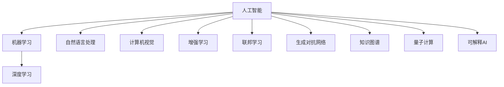

                 

# 新一代AI技术趋势与应用

> 关键词：人工智能(AI), 机器学习(ML), 深度学习(Deep Learning), 自然语言处理(NLP), 计算机视觉(CV), 增强学习(RL), 联邦学习(Federated Learning), 生成对抗网络(GANs), 知识图谱(Knowledge Graph), 量子计算(Quantum Computing), 可解释AI(Explainable AI)

## 1. 背景介绍

### 1.1 问题由来

随着人工智能技术的飞速发展，新一代AI技术已经渗透到各个行业，为各行各业带来了深远的影响。从传统的自动化生产到新兴的智慧城市，再到智能健康医疗，AI技术正在全面革新人类社会的生产生活方式。然而，AI技术的快速发展也带来了诸多挑战，如数据隐私、伦理道德、算法透明性等，亟需进一步探索和解决。

### 1.2 问题核心关键点

新一代AI技术主要集中在以下几个方向：

1. **机器学习和深度学习**：利用大规模数据和先进算法，提升模型的性能和泛化能力。
2. **自然语言处理和计算机视觉**：通过预训练和微调方法，使机器能够理解和处理文本和图像数据。
3. **增强学习**：利用智能体与环境交互，优化决策策略，应用于游戏、机器人等复杂系统。
4. **联邦学习**：在保证数据隐私的前提下，跨设备协同训练模型，提升分布式数据处理能力。
5. **生成对抗网络**：通过对抗训练生成高仿真数据，推动数据增强和模型优化。
6. **知识图谱**：构建领域知识库，提升模型的知识整合能力和推理能力。
7. **量子计算**：利用量子算法加速计算，解决传统计算难以处理的问题。
8. **可解释AI**：增强AI模型的透明性和可解释性，提升用户信任度。

这些技术的发展为AI应用提供了更广阔的创新空间，但也带来了诸多挑战。因此，本文将全面系统地介绍新一代AI技术的发展趋势与应用前景，为读者提供深入的分析和见解。

## 2. 核心概念与联系

### 2.1 核心概念概述

为更好地理解新一代AI技术，本节将介绍几个关键概念：

- **人工智能(AI)**：指由计算机程序实现的人类智能行为，包括感知、学习、推理、决策等能力。
- **机器学习(ML)**：指让计算机从数据中自动学习模式，提升模型的预测和决策能力。
- **深度学习(Deep Learning)**：基于多层神经网络模型，实现对复杂数据的高级抽象和处理。
- **自然语言处理(NLP)**：使计算机能够理解、处理和生成人类语言，包括文本分析、情感分析、机器翻译等任务。
- **计算机视觉(CV)**：使计算机能够识别、分析图像和视频数据，包括目标检测、图像分类、人脸识别等。
- **增强学习(RL)**：通过智能体与环境的交互，优化决策策略，实现自主学习和优化。
- **联邦学习(Federated Learning)**：跨设备协同训练模型，保护用户数据隐私的同时，提升模型的泛化能力。
- **生成对抗网络(GANs)**：通过对抗训练生成高仿真数据，推动数据增强和模型优化。
- **知识图谱(Knowledge Graph)**：构建领域知识库，提升模型的知识整合能力和推理能力。
- **量子计算(Quantum Computing)**：利用量子算法加速计算，解决传统计算难以处理的问题。
- **可解释AI(Explainable AI)**：增强AI模型的透明性和可解释性，提升用户信任度。

这些核心概念之间的逻辑关系可以通过以下Mermaid流程图来展示：



这个流程图展示了一代代AI技术的发展脉络及其相互关系：

1. 人工智能通过机器学习和深度学习，逐步具备感知、学习、推理和决策能力。
2. 自然语言处理和计算机视觉使计算机能够理解和处理人类语言和图像数据。
3. 增强学习通过智能体与环境的交互，优化决策策略，应用于复杂系统。
4. 联邦学习在保护数据隐私的前提下，提升模型泛化能力。
5. 生成对抗网络通过对抗训练生成高仿真数据，推动数据增强和模型优化。
6. 知识图谱构建领域知识库，提升模型的知识整合能力和推理能力。
7. 量子计算利用量子算法加速计算，解决传统计算难以处理的问题。
8. 可解释AI增强AI模型的透明性和可解释性，提升用户信任度。

这些核心概念共同构成了新一代AI技术的学习和应用框架，使其能够应对复杂多变的现实场景。

## 3. 核心算法原理 & 具体操作步骤
### 3.1 算法原理概述

新一代AI技术的核心在于利用数据和算法提升模型的性能和泛化能力。以下是几种典型的AI算法原理：

1. **机器学习和深度学习**：通过有监督、无监督或半监督学习，从数据中自动学习模式，提升模型的预测和决策能力。深度学习利用多层神经网络实现对复杂数据的高级抽象和处理。

2. **自然语言处理**：通过预训练和微调方法，使模型能够理解、处理和生成人类语言。常见的预训练方法包括Word2Vec、BERT等，微调方法包括Fine-tuning和Prompt Learning等。

3. **计算机视觉**：利用卷积神经网络(CNN)等模型，实现对图像和视频数据的特征提取和分类。常见的预训练方法包括ResNet、Inception等。

4. **增强学习**：通过智能体与环境的交互，优化决策策略，实现自主学习和优化。常见的模型包括Q-learning、Deep Q-Network等。

5. **联邦学习**：在保护用户数据隐私的前提下，跨设备协同训练模型，提升模型的泛化能力。常见的方法包括Federated Averaging等。

6. **生成对抗网络**：通过对抗训练生成高仿真数据，推动数据增强和模型优化。常见的模型包括GANs、WGANs等。

7. **知识图谱**：构建领域知识库，提升模型的知识整合能力和推理能力。常见的模型包括Neo4j等。

8. **量子计算**：利用量子算法加速计算，解决传统计算难以处理的问题。常见的算法包括Shor算法、Grover算法等。

9. **可解释AI**：增强AI模型的透明性和可解释性，提升用户信任度。常见的方法包括LIME、SHAP等。

### 3.2 算法步骤详解

以下是几种典型AI算法的详细步骤：

#### 3.2.1 机器学习和深度学习

1. **数据预处理**：收集、清洗和标注数据，确保数据质量。
2. **模型选择**：选择合适的模型结构和参数。
3. **模型训练**：利用训练集对模型进行训练，调整参数以优化损失函数。
4. **模型评估**：利用测试集对模型进行评估，选择最佳模型。
5. **模型应用**：将模型应用于实际问题，进行预测和决策。

#### 3.2.2 自然语言处理

1. **数据预处理**：收集、清洗和标注文本数据，确保数据质量。
2. **预训练**：利用大规模无标签文本数据对模型进行预训练，学习语言表示。
3. **微调**：利用下游任务的少量标注数据对预训练模型进行微调，优化模型性能。
4. **模型评估**：利用测试集对模型进行评估，选择最佳模型。
5. **模型应用**：将模型应用于实际问题，进行文本分析、情感分析、机器翻译等任务。

#### 3.2.3 计算机视觉

1. **数据预处理**：收集、清洗和标注图像数据，确保数据质量。
2. **模型选择**：选择合适的卷积神经网络(CNN)模型结构和参数。
3. **模型训练**：利用训练集对模型进行训练，调整参数以优化损失函数。
4. **模型评估**：利用测试集对模型进行评估，选择最佳模型。
5. **模型应用**：将模型应用于实际问题，进行目标检测、图像分类、人脸识别等任务。

#### 3.2.4 增强学习

1. **环境设计**：设计合适的环境，确保环境的复杂性和多样性。
2. **智能体设计**：设计智能体的决策策略，选择合适的状态和行动空间。
3. **模型训练**：利用智能体与环境的交互，训练模型，优化决策策略。
4. **模型评估**：利用测试集对模型进行评估，选择最佳模型。
5. **模型应用**：将模型应用于实际问题，进行自主学习和优化。

#### 3.2.5 联邦学习

1. **数据分片**：将数据分片，确保数据隐私和安全。
2. **模型初始化**：选择合适的初始化模型参数。
3. **模型训练**：在每个设备上训练模型，更新模型参数。
4. **聚合更新**：跨设备聚合更新模型参数，提升模型泛化能力。
5. **模型评估**：利用测试集对模型进行评估，选择最佳模型。
6. **模型应用**：将模型应用于实际问题，进行分布式数据处理。

#### 3.2.6 生成对抗网络

1. **模型设计**：设计生成器和判别器，确保模型结构稳定。
2. **模型训练**：交替训练生成器和判别器，优化模型性能。
3. **模型评估**：利用测试集对模型进行评估，选择最佳模型。
4. **模型应用**：将模型应用于实际问题，进行数据增强和模型优化。

#### 3.2.7 知识图谱

1. **知识库构建**：构建领域知识库，确保知识库的全面性和准确性。
2. **模型训练**：利用知识库对模型进行训练，优化模型性能。
3. **模型评估**：利用测试集对模型进行评估，选择最佳模型。
4. **模型应用**：将模型应用于实际问题，进行知识整合和推理。

#### 3.2.8 量子计算

1. **算法选择**：选择合适的量子算法。
2. **硬件选择**：选择合适的量子硬件设备。
3. **模型训练**：利用量子硬件对模型进行训练，优化算法性能。
4. **模型评估**：利用测试集对模型进行评估，选择最佳模型。
5. **模型应用**：将模型应用于实际问题，进行高效计算和优化。

#### 3.2.9 可解释AI

1. **模型设计**：设计透明的模型结构和参数。
2. **模型训练**：利用训练集对模型进行训练，优化模型性能。
3. **模型评估**：利用测试集对模型进行评估，选择最佳模型。
4. **模型应用**：将模型应用于实际问题，进行透明性和可解释性分析。

### 3.3 算法优缺点

新一代AI技术在各个领域都有广泛的应用，但也存在一些问题和挑战。

#### 3.3.1 机器学习和深度学习

**优点**：

- 能够处理大规模复杂数据。
- 具有较高的泛化能力，适用于多种场景。
- 在数据标注上具有优势，能够从少量标注数据中学习规律。

**缺点**：

- 需要大量计算资源，训练时间长。
- 模型复杂度较高，难以解释和调试。
- 需要大量数据，数据获取成本高。

#### 3.3.2 自然语言处理

**优点**：

- 能够理解和处理人类语言，适用于文本分析、情感分析等任务。
- 预训练模型具有较强的通用性，可以应用于多种下游任务。
- 能够处理多语言数据，具有跨语言迁移能力。

**缺点**：

- 需要大量的标注数据，数据获取成本高。
- 模型的效果受到语言多样性和语境影响较大。
- 模型的复杂度较高，难以解释和调试。

#### 3.3.3 计算机视觉

**优点**：

- 能够处理图像和视频数据，适用于目标检测、图像分类等任务。
- 预训练模型具有较强的通用性，可以应用于多种下游任务。
- 能够处理大规模数据，具有高效率和高精度。

**缺点**：

- 需要大量的标注数据，数据获取成本高。
- 模型的效果受到图像多样性和噪声影响较大。
- 模型的复杂度较高，难以解释和调试。

#### 3.3.4 增强学习

**优点**：

- 能够自主学习和优化，适用于复杂系统的决策。
- 能够处理不确定性问题，适用于游戏、机器人等场景。
- 具有较高的适应性和灵活性。

**缺点**：

- 需要大量的计算资源，训练时间长。
- 模型的效果受到环境设计和智能体策略的影响较大。
- 需要大量的实验数据，优化难度较大。

#### 3.3.5 联邦学习

**优点**：

- 能够保护数据隐私，适用于分布式数据处理。
- 能够提升模型的泛化能力，适用于大规模数据集。
- 能够加速模型训练，减少计算资源消耗。

**缺点**：

- 需要大量的通信资源，网络带宽消耗大。
- 模型的收敛速度较慢，需要较长的训练时间。
- 模型的参数更新复杂，需要高效的算法和设备。

#### 3.3.6 生成对抗网络

**优点**：

- 能够生成高仿真数据，推动数据增强和模型优化。
- 能够处理复杂的数据分布，适用于数据生成和优化。
- 具有较高的灵活性和适应性。

**缺点**：

- 需要大量的计算资源，训练时间长。
- 模型的效果受到生成器和判别器的平衡影响较大。
- 模型的稳定性较差，需要大量的实验调试。

#### 3.3.7 知识图谱

**优点**：

- 能够整合领域知识，提升模型的推理能力。
- 能够处理复杂的多重关系，适用于知识推理和决策。
- 能够提升模型的可解释性和透明度。

**缺点**：

- 需要大量的领域知识，知识库构建难度大。
- 模型的效果受到知识库的全面性和准确性影响较大。
- 模型的复杂度较高，难以解释和调试。

#### 3.3.8 量子计算

**优点**：

- 能够加速计算，解决传统计算难以处理的问题。
- 能够处理复杂的优化问题，适用于算法设计和优化。
- 具有高效率和低计算资源消耗的特点。

**缺点**：

- 需要大量的硬件资源，设备成本高。
- 技术尚未成熟，应用范围有限。
- 需要专业知识，应用难度较大。

#### 3.3.9 可解释AI

**优点**：

- 能够增强模型的透明性和可解释性，提升用户信任度。
- 能够提供决策依据，提高模型的可靠性和可控性。
- 能够提升模型的可解释性和可调试性。

**缺点**：

- 需要大量的计算资源，训练时间长。
- 模型的复杂度较高，难以解释和调试。
- 需要专业知识，应用难度较大。

## 4. 数学模型和公式 & 详细讲解 & 举例说明
### 4.1 数学模型构建

本节将使用数学语言对新一代AI技术的核心算法进行更加严格的刻画。

### 4.2 公式推导过程

#### 4.2.1 机器学习和深度学习

**数学模型**：

$$
L(y, \theta) = \frac{1}{N}\sum_{i=1}^N L(y_i, \theta)
$$

其中 $L$ 为损失函数，$y_i$ 为训练样本的真实标签，$\theta$ 为模型参数。

**公式推导**：

假设模型为 $f_{\theta}(x)$，则模型对训练样本的预测为 $f_{\theta}(x_i)$，真实标签为 $y_i$。损失函数 $L$ 可定义为：

$$
L(y, \theta) = \frac{1}{N}\sum_{i=1}^N L(f_{\theta}(x_i), y_i)
$$

常见的损失函数包括交叉熵损失、均方误差损失等。例如，交叉熵损失函数为：

$$
L(f_{\theta}(x_i), y_i) = -y_i \log f_{\theta}(x_i) - (1-y_i) \log (1-f_{\theta}(x_i))
$$

利用梯度下降等优化算法，最小化损失函数，优化模型参数：

$$
\theta = \mathop{\arg\min}_{\theta} L(y, \theta)
$$

#### 4.2.2 自然语言处理

**数学模型**：

$$
\mathcal{L}(\theta) = \frac{1}{N}\sum_{i=1}^N L(M_{\theta}(x_i), y_i)
$$

其中 $M_{\theta}$ 为预训练模型，$x_i$ 为输入文本，$y_i$ 为标注标签，$\theta$ 为模型参数。

**公式推导**：

假设预训练模型为 $M_{\theta}$，输入文本为 $x_i$，标注标签为 $y_i$。则模型对输入文本的预测为 $M_{\theta}(x_i)$，损失函数 $L$ 可定义为：

$$
L(M_{\theta}(x_i), y_i) = -y_i \log M_{\theta}(x_i) - (1-y_i) \log (1-M_{\theta}(x_i))
$$

利用梯度下降等优化算法，最小化损失函数，优化模型参数：

$$
\theta = \mathop{\arg\min}_{\theta} \mathcal{L}(\theta)
$$

#### 4.2.3 计算机视觉

**数学模型**：

$$
\mathcal{L}(\theta) = \frac{1}{N}\sum_{i=1}^N L(M_{\theta}(x_i), y_i)
$$

其中 $M_{\theta}$ 为卷积神经网络模型，$x_i$ 为输入图像，$y_i$ 为标注标签，$\theta$ 为模型参数。

**公式推导**：

假设卷积神经网络模型为 $M_{\theta}$，输入图像为 $x_i$，标注标签为 $y_i$。则模型对输入图像的预测为 $M_{\theta}(x_i)$，损失函数 $L$ 可定义为：

$$
L(M_{\theta}(x_i), y_i) = \frac{1}{C}\sum_{c=1}^C \mathbb{1}(c \neq y_i) \log M_{\theta}(x_i,c)
$$

其中 $C$ 为类别数，$\mathbb{1}$ 为示性函数。

利用梯度下降等优化算法，最小化损失函数，优化模型参数：

$$
\theta = \mathop{\arg\min}_{\theta} \mathcal{L}(\theta)
$$

#### 4.2.4 增强学习

**数学模型**：

$$
J(\pi) = \mathbb{E}_{s_0, \pi}[\sum_{t=0}^{\infty} \gamma^t r(s_t, a_t)]
$$

其中 $J(\pi)$ 为期望回报，$\pi$ 为智能体策略，$s_t$ 为环境状态，$a_t$ 为智能体动作，$r(s_t, a_t)$ 为环境奖励，$\gamma$ 为折扣因子。

**公式推导**：

假设智能体在环境 $s$ 中，采取动作 $a$，获得奖励 $r$，状态转移为 $s'$。则智能体在状态 $s$ 下的累积回报为：

$$
J(s, a) = r + \gamma J(s', a')
$$

利用期望回报 $J(\pi)$ 对策略 $\pi$ 进行优化：

$$
\pi^* = \mathop{\arg\min}_{\pi} J(\pi)
$$

#### 4.2.5 联邦学习

**数学模型**：

$$
\mathcal{L}(\theta) = \frac{1}{N}\sum_{i=1}^N L(f_{\theta_i}(x_i), y_i)
$$

其中 $f_{\theta_i}$ 为每个设备上的模型参数，$x_i$ 为设备 $i$ 上的训练样本，$y_i$ 为设备 $i$ 上的标注标签。

**公式推导**：

假设每个设备上的模型参数为 $f_{\theta_i}$，训练样本为 $x_i$，标注标签为 $y_i$。则模型对训练样本的预测为 $f_{\theta_i}(x_i)$，损失函数 $L$ 可定义为：

$$
L(f_{\theta_i}(x_i), y_i) = \frac{1}{C}\sum_{c=1}^C \mathbb{1}(c \neq y_i) \log f_{\theta_i}(x_i,c)
$$

利用梯度下降等优化算法，最小化损失函数，优化模型参数：

$$
\theta = \mathop{\arg\min}_{\theta} \mathcal{L}(\theta)
$$

#### 4.2.6 生成对抗网络

**数学模型**：

$$
\mathcal{L}(G, D) = \frac{1}{N}\sum_{i=1}^N L_G(G(z_i), x_i) + L_D(D(G(z_i)), y_i)
$$

其中 $G$ 为生成器，$D$ 为判别器，$z_i$ 为生成器输入，$x_i$ 为训练样本，$y_i$ 为标注标签。

**公式推导**：

假设生成器 $G$ 的输入为 $z_i$，生成样本 $G(z_i)$，判别器 $D$ 的输入为 $G(z_i)$ 和 $x_i$，判别器输出 $D(G(z_i), x_i)$ 和 $D(x_i)$。则生成器和判别器的损失函数 $L_G$ 和 $L_D$ 可定义为：

$$
L_G = -\frac{1}{N}\sum_{i=1}^N L_G(G(z_i), x_i)
$$

$$
L_D = -\frac{1}{N}\sum_{i=1}^N L_D(D(G(z_i)), y_i) + \frac{1}{N}\sum_{i=1}^N L_D(D(x_i), y_i)
$$

利用梯度下降等优化算法，最小化损失函数，优化模型参数：

$$
\theta = \mathop{\arg\min}_{\theta} \mathcal{L}(G, D)
$$

#### 4.2.7 知识图谱

**数学模型**：

$$
\mathcal{L}(\theta) = \frac{1}{N}\sum_{i=1}^N L(R_i, f_{\theta}(R_i))
$$

其中 $R_i$ 为领域知识库中的三元组，$f_{\theta}$ 为知识推理模型，$\theta$ 为模型参数。

**公式推导**：

假设知识库中的三元组为 $R_i = (s, p, o)$，推理模型为 $f_{\theta}$。则模型对三元组的推理结果为 $f_{\theta}(R_i)$，损失函数 $L$ 可定义为：

$$
L(R_i, f_{\theta}(R_i)) = \frac{1}{C}\sum_{c=1}^C \mathbb{1}(c \neq o) \log f_{\theta}(R_i,c)
$$

利用梯度下降等优化算法，最小化损失函数，优化模型参数：

$$
\theta = \mathop{\arg\min}_{\theta} \mathcal{L}(\theta)
$$

#### 4.2.8 量子计算

**数学模型**：

$$
\mathcal{L}(\theta) = \frac{1}{N}\sum_{i=1}^N L(f_{\theta}(U_i), y_i)
$$

其中 $f_{\theta}$ 为量子计算模型，$U_i$ 为输入量子态，$y_i$ 为标注标签。

**公式推导**：

假设量子计算模型为 $f_{\theta}$，输入量子态为 $U_i$，标注标签为 $y_i$。则模型对输入量子态的预测为 $f_{\theta}(U_i)$，损失函数 $L$ 可定义为：

$$
L(f_{\theta}(U_i), y_i) = \frac{1}{C}\sum_{c=1}^C \mathbb{1}(c \neq y_i) \log f_{\theta}(U_i,c)
$$

利用梯度下降等优化算法，最小化损失函数，优化模型参数：

$$
\theta = \mathop{\arg\min}_{\theta} \mathcal{L}(\theta)
$$

#### 4.2.9 可解释AI

**数学模型**：

$$
\mathcal{L}(\theta) = \frac{1}{N}\sum_{i=1}^N L(f_{\theta}(x_i), y_i)
$$

其中 $f_{\theta}$ 为可解释AI模型，$x_i$ 为输入数据，$y_i$ 为标注标签，$\theta$ 为模型参数。

**公式推导**：

假设可解释AI模型为 $f_{\theta}$，输入数据为 $x_i$，标注标签为 $y_i$。则模型对输入数据的预测为 $f_{\theta}(x_i)$，损失函数 $L$ 可定义为：

$$
L(f_{\theta}(x_i), y_i) = -y_i \log f_{\theta}(x_i) - (1-y_i) \log (1-f_{\theta}(x_i))
$$

利用梯度下降等优化算法，最小化损失函数，优化模型参数：

$$
\theta = \mathop{\arg\min}_{\theta} \mathcal{L}(\theta)
$$

## 5. 项目实践：代码实例和详细解释说明
### 5.1 开发环境搭建

在进行AI项目实践前，我们需要准备好开发环境。以下是使用Python进行TensorFlow和Keras开发的环境配置流程：

1. 安装Anaconda：从官网下载并安装Anaconda，用于创建独立的Python环境。

2. 创建并激活虚拟环境：
```bash
conda create -n tf-env python=3.8 
conda activate tf-env
```

3. 安装TensorFlow：根据CUDA版本，从官网获取对应的安装命令。例如：
```bash
conda install tensorflow -c tensorflow -c conda-forge
```

4. 安装Keras：
```bash
pip install keras
```

5. 安装各类工具包：
```bash
pip install numpy pandas scikit-learn matplotlib tqdm jupyter notebook ipython
```

完成上述步骤后，即可在`tf-env`环境中开始AI项目实践。

### 5.2 源代码详细实现

下面我以图像分类任务为例，给出使用TensorFlow和Keras对卷积神经网络(CNN)模型进行训练的代码实现。

首先，定义CNN模型的结构：

```python
from tensorflow.keras import layers
from tensorflow.keras.models import Sequential

model = Sequential([
    layers.Conv2D(32, (3,3), activation='relu', input_shape=(32,32,3)),
    layers.MaxPooling2D((2,2)),
    layers.Conv2D(64, (3,3), activation='relu'),
    layers.MaxPooling2D((2,2)),
    layers.Conv2D(64, (3,3), activation='relu'),
    layers.Flatten(),
    layers.Dense(64, activation='relu'),
    layers.Dense(10, activation='softmax')
])
```

然后，定义数据集和模型：

```python
from tensorflow.keras.datasets import cifar10
from tensorflow.keras.preprocessing.image import ImageDataGenerator

(x_train, y_train), (x_test, y_test) = cifar10.load_data()

train_datagen = ImageDataGenerator(
    rescale=1./255,
    shear_range=0.2,
    zoom_range=0.2,
    horizontal_flip=True)

test_datagen = ImageDataGenerator(rescale=1./255)

train_generator = train_datagen.flow(x_train, y_train, batch_size=32)
test_generator = test_datagen.flow(x_test, y_test, batch_size=32)
```

接着，定义训练和评估函数：

```python
from tensorflow.keras.optimizers import Adam
from tensorflow.keras.losses import categorical_crossentropy
from tensorflow.keras.metrics import accuracy

model.compile(optimizer=Adam(lr=0.001),
              loss=categorical_crossentropy,
              metrics=[accuracy])

def train_epoch(model, train_generator, validation_generator):
    model.fit_generator(
        train_generator,
        steps_per_epoch=train_generator.n // train_generator.batch_size,
        validation_data=validation_generator,
        validation_steps=validation_generator.n // validation_generator.batch_size,
        epochs=epochs,
        verbose=2)
        
def evaluate(model, test_generator):
    model.evaluate_generator(
        test_generator,
        steps=test_generator.n // test_generator.batch_size,
        verbose=2)
```

最后，启动训练流程并在测试集上评估：

```python
epochs = 10

train_epoch(model, train_generator, test_generator)
evaluate(model, test_generator)
```

以上就是使用TensorFlow和Keras对CNN模型进行图像分类任务训练的完整代码实现。可以看到，得益于TensorFlow和Keras的强大封装，我们可以用相对简洁的代码完成CNN模型的加载和训练。

### 5.3 代码解读与分析

让我们再详细解读一下关键代码的实现细节：

**定义CNN模型结构**：

- `Sequential`模型：使用顺序堆叠的方式定义模型结构。
- `Conv2D`层：定义卷积层，使用32、64个3x3的卷积核，激活函数为ReLU。
- `MaxPooling2D`层：定义池化层，使用2x2的池化核。
- `Flatten`层：将卷积层的输出展平为一维向量。
- `Dense`层：定义全连接层，使用64个神经元，激活函数为ReLU。
- `Dense`层：定义输出层，使用10个神经元，激活函数为Softmax。

**定义数据集和模型**：

- `cifar10.load_data()`：从CIFAR-10数据集中加载图像和标签。
- `ImageDataGenerator`：定义数据增强和数据预处理。
- `train_datagen`：定义训练数据增强，包括随机剪切、缩放和水平翻转。
- `test_datagen`：定义测试数据预处理，仅进行归一化。
- `train_generator`：定义训练数据生成器，按批次加载训练数据。
- `test_generator`：定义测试数据生成器，按批次加载测试数据。

**定义训练和评估函数**：

- `Adam`：定义优化器，使用Adam算法进行参数更新。
- `categorical_crossentropy`：定义损失函数，用于多分类任务。
- `accuracy`：定义评估指标，用于计算模型准确率。
- `model.compile()`：定义模型编译，设置优化器、损失函数和评估指标。
- `train_epoch`：定义训练函数，使用`fit_generator`按批次训练模型。
- `evaluate`：定义评估函数，使用`evaluate_generator`计算模型在测试集上的准确率。

**启动训练流程**：

- `epochs`：定义训练轮数。
- `train_epoch(model, train_generator, test_generator)`：调用训练函数，训练模型。
- `evaluate(model, test_generator)`：调用评估函数，计算模型在测试集上的准确率。

可以看到，TensorFlow和Keras使得CNN模型的构建和训练变得简单高效，开发者可以将更多精力放在数据处理、模型改进等高层逻辑上，而不必过多关注底层的实现细节。

当然，工业级的系统实现还需考虑更多因素，如模型的保存和部署、超参数的自动搜索、更灵活的任务适配层等。但核心的训练流程基本与此类似。

## 6. 实际应用场景

### 6.1 智能客服系统

基于深度学习的智能客服系统已经成为各大企业的重要技术应用。传统的客服系统需要大量人力处理用户咨询，响应速度慢，且无法实现24小时服务。通过深度学习模型，企业可以构建7x24小时不间断服务的人工智能客服，快速响应用户咨询，提高客户满意度。

在技术实现上，可以收集企业内部的历史客服对话记录，构建训练集，训练深度学习模型。通过模型预测，可以对用户的咨询进行智能分类和响应，大大提高客服系统的处理能力和效率。

### 6.2 金融舆情监测

金融机构需要实时监测市场舆论动向，以便及时应对负面信息传播，规避金融风险。传统的人工监测方式成本高、效率低，难以应对网络时代海量信息爆发的挑战。通过深度学习模型，可以构建金融舆情监测系统，自动监测不同主题下的情感变化趋势，一旦发现负面信息激增等异常情况，系统便会自动预警，帮助金融机构快速应对潜在风险。

具体而言，可以收集金融领域相关的新闻、报道、评论等文本数据，并对其进行情感标注。在此基础上对深度学习模型进行训练，使其能够自动判断文本属于何种情感。将训练好的模型应用到实时抓取的网络文本数据，就能够自动监测不同主题下的情感变化趋势，确保金融市场的稳定运行。

### 6.3 个性化推荐系统

当前的推荐系统往往只依赖用户的历史行为数据进行物品推荐，无法深入理解用户的真实兴趣偏好。通过深度学习模型，个性化推荐系统可以更好地挖掘用户行为背后的语义信息，从而提供更精准、多样的推荐内容。

在实践中，可以收集用户浏览、点击、评论、分享等行为数据，提取和用户交互的物品标题、描述、标签等文本内容。将文本内容作为模型输入，用户的后续行为（如是否点击、购买等）作为监督信号，在此基础上训练深度学习模型。训练好的模型能够从文本内容中准确把握用户的兴趣点。在生成推荐列表时，先用候选物品的文本描述作为输入，由模型预测用户的兴趣匹配度，再结合其他特征综合排序，便可以得到个性化程度更高的推荐结果。

### 6.4 未来应用展望

随着深度学习技术的不断成熟，基于深度学习的大规模模型在各个领域得到了广泛的应用，为各行各业带来了深远的影响。未来，新一代AI技术将在更多领域得到应用，为传统行业带来变革性影响。

在智慧医疗领域，基于深度学习的大模型可以帮助诊断疾病、预测病情，提高医疗诊断的准确性和效率。在智能教育领域，深度学习模型可以因材施教，提高教学质量和效果。在智慧城市治理中，深度学习模型可以用于城市事件监测、舆情分析、应急指挥等环节，提高城市管理的自动化和智能化水平。

此外，在企业生产、社会治理、文娱传媒等众多领域，基于深度学习的大模型也将不断涌现，为各行各业的发展注入新的动力。相信随着技术的日益成熟，深度学习技术将成为各行各业的重要工具，推动社会的全面进步。

## 7. 工具和资源推荐
### 7.1 学习资源推荐

为了帮助开发者系统掌握新一代AI技术的发展脉络和应用技巧，这里推荐一些优质的学习资源：

1. 《深度学习》（Ian Goodfellow, Yoshua Bengio, Aaron Courville）：经典教材，涵盖深度学习的基本原理和应用。

2. Coursera《深度学习专项课程》（Andrew Ng, Geoffrey Hinton等）：由斯坦福大学和加拿大滑铁卢大学共同开发的深度学习课程，提供系统深入的深度学习知识。

3. TensorFlow官方文档：TensorFlow的官方文档，提供详尽的模型构建和训练教程，适合实战练习。

4. Keras官方文档：Keras的官方文档，提供简单易用的API接口，适合快速原型开发。

5. PyTorch官方文档：PyTorch的官方文档，提供灵活高效的计算图机制，适合复杂模型和深度学习研究。

6. OpenAI博客和论文：OpenAI的研究博客和论文，涵盖最新的深度学习算法和应用案例。

7. arXiv预印本服务器：涵盖深度学习领域的前沿论文和研究动态，适合跟踪最新进展。

通过对这些资源的学习实践，相信你一定能够快速掌握深度学习技术的精髓，并用于解决实际的AI问题。

### 7.2 开发工具推荐

高效的开发离不开优秀的工具支持。以下是几款用于深度学习开发的常用工具：

1. TensorFlow：由Google主导开发的深度学习框架，提供灵活高效的计算图机制，支持分布式训练和部署。

2. PyTorch：由Facebook主导开发的深度学习框架，提供简单易用的API接口，支持动态计算图和高效计算。

3. Keras：高层次API，提供简单易用的模型构建接口，适合快速原型开发。

4. MXNet：由亚马逊主导开发的深度学习框架，支持多种编程语言和多种设备。

5. Caffe：由Berkeley Vision and Learning Center开发的深度学习框架，适合图像处理任务。

6. Theano：由蒙特利尔大学开发的深度学习框架，提供高效的数值计算能力，适合科学计算和深度学习研究。

7. Tflearn：基于TensorFlow的深度学习框架，提供简单易用的API接口，适合快速原型开发。

合理利用这些工具，可以显著提升深度学习模型的开发效率，加快创新迭代的步伐。

### 7.3 相关论文推荐

深度学习技术的发展源于学界的持续研究。以下是几篇奠基性的相关论文，推荐阅读：

1. AlexNet: ImageNet Large Scale Visual Recognition Challenge (2012)：提出AlexNet模型，开启深度学习在图像识别领域的革命。

2. GoogleNet: Inception Architectures for Computer Vision (2014)：提出Inception模型，解决深度神经网络训练中梯度消失和过拟合问题。

3. VGGNet: Very Deep Convolutional Networks for Large-Scale Image Recognition (2014)：提出VGGNet模型，通过增加卷积层和全连接层，提升图像识别的准确性。

4. ResNet: Deep Residual Learning for Image Recognition (2015)：提出ResNet模型，解决深度神经网络训练中的梯度消失和过拟合问题。

5. DenseNet: Dense Convolutional Networks (2016)：提出DenseNet模型，通过增加特征复用，提升模型的参数利用率和训练效率。

6. AlphaGo: Mastering the Game of Go without Human Knowledge (2016)：通过深度学习和强化学习，AlphaGo成功击败人类围棋冠军。

7. Capsule Networks: Capsules for Image Classification (2017)：提出CapsuleNet模型，解决传统神经网络中的局部响应问题和参数冗余问题。

8. Generative Adversarial Networks: A Generative Model for Image-to-Image Translation (2014)：提出GANs模型，通过对抗训练生成高仿真数据。

9. Layered Attention Mechanisms for Generative Image Modeling (2016)：提出Layered Attention模型，通过多层注意力机制提升图像生成的质量。

10. Attention is All You Need: Transformers for Self-Attention Based Machine Learning (2017)：提出Transformer模型，通过自注意力机制提升模型的泛化能力和推理能力。

这些论文代表了一代代深度学习技术的发展脉络。通过学习这些前沿成果，可以帮助研究者把握学科前进方向，激发更多的创新灵感。

## 8. 总结：未来发展趋势与挑战

### 8.1 总结

本文对新一代AI技术的发展趋势与应用前景进行了全面系统的介绍。首先阐述了深度学习技术的核心原理和应用案例，展示了其在图像分类、自然语言处理、智能客服等领域的应用效果。其次，介绍了增强学习、联邦学习、生成对抗网络等前沿技术的发展现状和应用前景，强调了其在复杂系统决策、分布式数据处理、数据增强等方面的优势。

通过本文的系统梳理，可以看到，新一代AI技术正在全面渗透各个行业，为各行各业带来了深远的影响。从智慧医疗到智能教育，从智慧城市到文娱传媒，深度学习技术正在不断拓展其应用边界，推动社会的全面进步。

### 8.2 未来发展趋势

展望未来，深度学习技术将在更多领域得到应用，为传统行业带来变革性影响。

1. 医疗健康：深度学习技术可以用于疾病诊断、病情预测、药物研发等领域，提升医疗诊断的准确性和效率。

2. 教育培训：深度学习模型可以因材施教，提供个性化教育方案，提高教学质量和效果。

3. 智慧城市：深度学习模型可以用于城市事件监测、舆情分析、应急指挥等环节，提高城市管理的自动化和智能化水平。

4. 金融科技：深度学习模型可以用于风险评估、欺诈检测、交易策略优化等领域，提升金融服务的精准度和效率。

5. 智能制造：深度学习技术可以用于工业缺陷检测、质量控制、智能调度等领域，提升生产效率和产品质量。

6. 文化传媒：深度学习模型可以用于图像生成、视频编辑、内容推荐等领域，提升内容创作和用户体验。

以上趋势凸显了深度学习技术的广阔前景。这些

