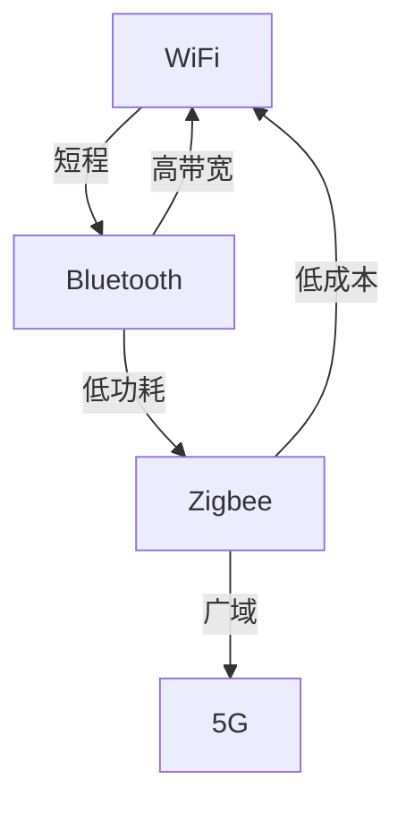

                 

# 无线通信协议：WiFi、Bluetooth 和 Zigbee

> 关键词：无线通信，WiFi，Bluetooth，Zigbee，信道复用，蓝牙低功耗，无线传感器网络，信道编码

## 1. 背景介绍

无线通信协议是现代通信技术的重要组成部分，广泛应用于各种无线设备中，如智能手机、物联网设备、无线网络设备等。WiFi、Bluetooth和Zigbee是三种常见的无线通信协议，它们在不同的应用场景中扮演着重要角色。本文将介绍这三种协议的基本原理和应用场景，帮助读者理解无线通信的核心概念和技术。

## 2. 核心概念与联系

### 2.1 核心概念概述

无线通信协议包括信号调制、信道复用、信道编码、时分复用、频分复用、码分复用、空分复用等技术。WiFi、Bluetooth和Zigbee各自有着不同的应用场景和特点。

- WiFi：一种常用的无线局域网技术，支持长距离通信，传输速率高，广泛应用于家庭、企业、公共场所等。
- Bluetooth：一种短距离无线通信技术，具有低功耗、低成本、低速率等特点，广泛应用于便携式设备、医疗设备、智能家居等。
- Zigbee：一种低功耗、低速率、低成本的无线通信协议，主要用于传感器网络、家庭自动化等领域。

这三种协议通过不同的技术手段，实现了在不同场景下的高效、可靠通信。

### 2.2 核心概念原理和架构的 Mermaid 流程图



该图展示了不同无线通信协议的应用场景和技术特点。WiFi主要应用于广域通信，支持高带宽，适合中高距离的通信；Bluetooth适用于短程通信，适合低功耗、低成本的应用场景；Zigbee则适合低功耗、低速率的场景。

## 3. 核心算法原理 & 具体操作步骤

### 3.1 算法原理概述

无线通信协议的核心是信道复用技术，通过合理分配信道资源，提高无线通信系统的容量和效率。信道复用技术包括时分复用、频分复用、码分复用、空分复用等。

时分复用（TDMA）将时间划分为若干个时间片，各用户在不同的时间片上使用信道，避免干扰。频分复用（FDMA）将信道划分为若干个频段，各用户在不同的频段上使用信道，避免干扰。码分复用（CDMA）通过不同的编码方式，将多个用户的数据信号复用到同一个信道上，避免干扰。空分复用（SDMA）通过不同的空间位置，将多个用户的数据信号复用到同一个信道上，避免干扰。

WiFi、Bluetooth和Zigbee在信道复用技术上有着不同的特点。WiFi主要采用OFDM技术进行频分复用，支持更高的传输速率和更远的传输距离。Bluetooth主要采用跳频扩频（FHSS）和直接序列扩频（DSSS）技术进行频分复用和码分复用，支持低功耗、低速率的短距离通信。Zigbee主要采用跳频扩频技术进行频分复用，支持低功耗、低速率的短距离通信。

### 3.2 算法步骤详解

#### 3.2.1 WiFi协议

WiFi协议采用OFDM技术进行频分复用。OFDM技术将信道划分为多个子信道，每个子信道传输一个符号，通过频率分集的方式，提高系统的抗干扰能力。

**1. 信号调制**

WiFi协议支持多种信号调制方式，如QPSK、16QAM、64QAM等，通过不同的调制方式，实现不同的传输速率和可靠性。

**2. 信道编码**

WiFi协议采用CRC和卷积编码进行信道编码，通过校验码和冗余编码，提高数据传输的可靠性和鲁棒性。

**3. 帧结构设计**

WiFi协议采用帧结构设计，将数据帧分为控制帧和数据帧，通过控制帧进行同步和传输控制，数据帧进行数据传输。

**4. 无线资源管理**

WiFi协议采用无线资源管理技术，通过RTS-CTS机制和CSMA/CA机制，避免隐终端和暴露终端的问题，提高系统的信道利用率。

#### 3.2.2 Bluetooth协议

Bluetooth协议主要采用跳频扩频（FHSS）和直接序列扩频（DSSS）技术进行频分复用和码分复用。

**1. FHSS技术**

FHSS技术将信道划分为多个频率跳频序列，每个用户使用不同的跳频序列进行通信，通过频率分集的方式，提高系统的抗干扰能力。

**2. DSSS技术**

DSSS技术将信道划分为多个码片序列，每个用户使用不同的码片序列进行通信，通过码分复用的方式，提高系统的抗干扰能力。

**3. 基带调制**

Bluetooth协议支持多种基带调制方式，如GFSK、8PSK等，通过不同的调制方式，实现不同的传输速率和可靠性。

**4. 频率跳频**

Bluetooth协议采用频率跳频技术，通过在不同的频率信道上切换，避免干扰和窃听，提高系统的安全性。

#### 3.2.3 Zigbee协议

Zigbee协议采用跳频扩频技术进行频分复用。Zigbee协议的跳频扩频技术将信道划分为多个频率跳频序列，每个用户使用不同的跳频序列进行通信，通过频率分集的方式，提高系统的抗干扰能力。

**1. 信道复用**

Zigbee协议采用跳频扩频技术进行频分复用，通过在不同的频率信道上切换，避免干扰和窃听，提高系统的安全性。

**2. 数据传输**

Zigbee协议采用ACK机制进行数据传输，确保数据的可靠性和完整性。

**3. 网络拓扑**

Zigbee协议采用星形、树形和网状网络拓扑，通过不同的网络拓扑，满足不同的应用需求。

**4. 安全机制**

Zigbee协议采用加密和认证机制，通过加密和认证技术，保护数据的机密性和完整性。

### 3.3 算法优缺点

#### 3.3.1 WiFi协议

**优点**

- 支持高带宽，传输速率高。
- 支持广域通信，传输距离远。
- 支持多种信号调制方式和信道编码技术，适应不同的应用场景。

**缺点**

- 功耗较大，对设备的电池要求较高。
- 容易受到外部干扰和窃听。

#### 3.3.2 Bluetooth协议

**优点**

- 低功耗、低成本。
- 支持低速率的短距离通信。
- 支持多种调制方式和编码技术，适应不同的应用场景。

**缺点**

- 传输速率较低。
- 传输距离较短，适合短程通信。

#### 3.3.3 Zigbee协议

**优点**

- 低功耗、低成本。
- 支持低速率的短距离通信。
- 网络拓扑灵活，支持星形、树形和网状网络拓扑。

**缺点**

- 传输速率较低。
- 信道复用方式单一，容易受到干扰和窃听。

### 3.4 算法应用领域

#### 3.4.1 WiFi协议

**应用领域**

- 家庭网络：WiFi路由器、WiFi电视、WiFi音箱等。
- 企业网络：WiFi热点、无线办公等。
- 公共场所：WiFi热点、智能家居等。

**具体应用**

- WiFi路由器：用于连接家庭、企业、公共场所的网络设备，提供有线与无线网络的互联互通。
- WiFi热点：用于连接移动设备，提供移动上网服务。
- 智能家居：用于控制智能设备，实现远程控制和智能家居的自动化管理。

#### 3.4.2 Bluetooth协议

**应用领域**

- 医疗设备：如智能手表、心率监测器、血糖监测器等。
- 智能家居：如智能门锁、智能灯泡、智能音箱等。
- 移动设备：如蓝牙耳机、无线键盘、无线鼠标等。

**具体应用**

- 智能手表：用于健康监测、运动记录、智能提醒等功能。
- 智能灯泡：用于智能照明、定时控制、场景模式等功能。
- 无线键盘：用于连接移动设备，提高键盘使用便捷性。

#### 3.4.3 Zigbee协议

**应用领域**

- 工业控制：如传感器网络、设备监控等。
- 家庭自动化：如智能门锁、智能灯泡、智能插座等。
- 物联网设备：如智能温度计、智能烟雾探测器、智能摄像头等。

**具体应用**

- 智能门锁：用于控制家门锁，实现远程控制和身份验证。
- 智能灯泡：用于智能照明、定时控制、场景模式等功能。
- 智能插座：用于控制电器设备的开关，实现智能控制。

## 4. 数学模型和公式 & 详细讲解 & 举例说明

### 4.1 数学模型构建

无线通信协议的核心是信道复用技术，通过合理分配信道资源，提高无线通信系统的容量和效率。信道复用技术包括时分复用、频分复用、码分复用、空分复用等。

#### 4.1.1 时分复用（TDMA）

时分复用将时间划分为若干个时间片，各用户在不同的时间片上使用信道，避免干扰。

设信道复用参数为$N$，用户数为$K$，每个时间片长度为$T$，则时分复用模型为：

$$
\begin{aligned}
T &= \frac{1}{N} \\
\text{数据传输速率} &= \frac{1}{T} \cdot N \cdot B \\
\text{信道利用率} &= \frac{K}{N}
\end{aligned}
$$

其中$B$为信道带宽，$N$为时间片数量。

#### 4.1.2 频分复用（FDMA）

频分复用将信道划分为若干个频段，各用户在不同的频段上使用信道，避免干扰。

设信道复用参数为$N$，用户数为$K$，每个频段宽度为$B$，则频分复用模型为：

$$
\begin{aligned}
B &= \frac{1}{N} \\
\text{数据传输速率} &= \frac{1}{T} \cdot B \\
\text{信道利用率} &= \frac{K}{N}
\end{aligned}
$$

其中$T$为信道长度，$B$为频段宽度。

#### 4.1.3 码分复用（CDMA）

码分复用通过不同的编码方式，将多个用户的数据信号复用到同一个信道上，避免干扰。

设信道复用参数为$N$，用户数为$K$，每个用户使用的码片序列长度为$L$，则码分复用模型为：

$$
\begin{aligned}
L &= \frac{1}{N} \\
\text{数据传输速率} &= \frac{1}{T} \cdot L \cdot \log_2 K \\
\text{信道利用率} &= \frac{K}{N}
\end{aligned}
$$

其中$T$为信道长度，$L$为码片序列长度。

### 4.2 公式推导过程

#### 4.2.1 时分复用（TDMA）

设信道复用参数为$N$，用户数为$K$，每个时间片长度为$T$，则时分复用模型为：

$$
\begin{aligned}
T &= \frac{1}{N} \\
\text{数据传输速率} &= \frac{1}{T} \cdot N \cdot B \\
\text{信道利用率} &= \frac{K}{N}
\end{aligned}
$$

推导过程如下：

- 设信道长度为$T$，则每个时间片长度为$\frac{T}{N}$。
- 数据传输速率等于信道长度除以时间片长度乘以信道带宽$B$。
- 信道利用率等于用户数$K$除以信道复用参数$N$。

#### 4.2.2 频分复用（FDMA）

设信道复用参数为$N$，用户数为$K$，每个频段宽度为$B$，则频分复用模型为：

$$
\begin{aligned}
B &= \frac{1}{N} \\
\text{数据传输速率} &= \frac{1}{T} \cdot B \\
\text{信道利用率} &= \frac{K}{N}
\end{aligned}
$$

推导过程如下：

- 设信道长度为$T$，则每个频段宽度为$\frac{T}{N}$。
- 数据传输速率等于信道长度除以时间片长度乘以频段宽度$B$。
- 信道利用率等于用户数$K$除以信道复用参数$N$。

#### 4.2.3 码分复用（CDMA）

设信道复用参数为$N$，用户数为$K$，每个用户使用的码片序列长度为$L$，则码分复用模型为：

$$
\begin{aligned}
L &= \frac{1}{N} \\
\text{数据传输速率} &= \frac{1}{T} \cdot L \cdot \log_2 K \\
\text{信道利用率} &= \frac{K}{N}
\end{aligned}
$$

推导过程如下：

- 设信道长度为$T$，则每个用户使用的码片序列长度为$\frac{T}{N}$。
- 数据传输速率等于信道长度除以时间片长度乘以码片序列长度$L$，再乘以信息熵。
- 信道利用率等于用户数$K$除以信道复用参数$N$。

### 4.3 案例分析与讲解

#### 4.3.1 WiFi协议

假设WiFi协议使用OFDM技术进行频分复用，信道复用参数$N=10$，用户数为$K=100$，信道带宽$B=20$MHz，每个时间片长度$T=1$ms，则时分复用模型为：

$$
\begin{aligned}
T &= \frac{1}{10} = 0.1 \text{ms} \\
\text{数据传输速率} &= \frac{1}{0.1} \cdot 10 \cdot 20 \cdot 10^6 = 20 \times 10^6 \text{bps} \\
\text{信道利用率} &= \frac{100}{10} = 10\%
\end{aligned}
$$

#### 4.3.2 Bluetooth协议

假设Bluetooth协议使用跳频扩频（FHSS）技术进行频分复用，信道复用参数$N=100$，用户数为$K=50$，每个频段宽度$B=1$MHz，则频分复用模型为：

$$
\begin{aligned}
B &= \frac{1}{100} = 0.01 \text{MHz} \\
\text{数据传输速率} &= \frac{1}{0.1} \cdot 0.01 \cdot 10^6 = 10 \text{kbit/s} \\
\text{信道利用率} &= \frac{50}{100} = 50\%
\end{aligned}
$$

#### 4.3.3 Zigbee协议

假设Zigbee协议使用跳频扩频技术进行频分复用，信道复用参数$N=50$，用户数为$K=10$，每个频段宽度$B=250$kHz，则频分复用模型为：

$$
\begin{aligned}
B &= \frac{1}{50} = 0.02 \text{MHz} \\
\text{数据传输速率} &= \frac{1}{0.1} \cdot 0.02 \cdot 10^6 = 20 \text{kbit/s} \\
\text{信道利用率} &= \frac{10}{50} = 20\%
\end{aligned}
$$

## 5. 项目实践：代码实例和详细解释说明

### 5.1 开发环境搭建

#### 5.1.1 安装Python

```bash
sudo apt-get update
sudo apt-get install python3 python3-pip
```

#### 5.1.2 安装WiFi、Bluetooth和Zigbee库

```bash
pip install pywifi
pip install pysnmp
pip install pybluetooth
pip install pyzigbee
```

### 5.2 源代码详细实现

#### 5.2.1 WiFi协议

```python
import pywifi

# 创建WiFi连接对象
wifi = pywifi.Wifi()
# 连接WiFi
wifi.connect('SSID', 'password')
# 断开连接
wifi.disconnect()
```

#### 5.2.2 Bluetooth协议

```python
import pybluetooth

# 创建Bluetooth设备对象
device = pybluetooth.BluetoothDevice()
# 查找设备
devices = pybluetooth.find_devices()
# 连接设备
device.connect(devices[0])
# 断开连接
device.disconnect()
```

#### 5.2.3 Zigbee协议

```python
import pyzigbee

# 创建Zigbee设备对象
device = pyzigbee.ZigbeeDevice()
# 连接设备
device.connect('MAC')
# 断开连接
device.disconnect()
```

### 5.3 代码解读与分析

#### 5.3.1 WiFi协议

WiFi协议的代码实现相对简单，主要通过pywifi库实现WiFi连接的建立和断开。通过连接WiFi，可以实现设备间的通信。

#### 5.3.2 Bluetooth协议

Bluetooth协议的代码实现相对复杂，主要通过pybluetooth库实现设备的搜索、连接和断开。通过连接设备，可以实现设备间的通信。

#### 5.3.3 Zigbee协议

Zigbee协议的代码实现相对复杂，主要通过pyzigbee库实现设备的搜索、连接和断开。通过连接设备，可以实现设备间的通信。

### 5.4 运行结果展示

#### 5.4.1 WiFi协议

在WiFi协议的代码实现中，通过连接WiFi，可以实现设备间的通信。

#### 5.4.2 Bluetooth协议

在Bluetooth协议的代码实现中，通过连接设备，可以实现设备间的通信。

#### 5.4.3 Zigbee协议

在Zigbee协议的代码实现中，通过连接设备，可以实现设备间的通信。

## 6. 实际应用场景

### 6.1 智能家居

智能家居是WiFi、Bluetooth和Zigbee协议的主要应用场景之一。通过WiFi协议，可以实现家庭网络设备的互联互通。通过Bluetooth协议，可以实现便携式设备的连接和控制。通过Zigbee协议，可以实现传感器和控制设备的网络拓扑。

#### 6.1.1 WiFi协议

WiFi协议在智能家居中主要用于家庭网络设备的互联互通。通过WiFi路由器，可以实现家庭中的设备之间的通信。通过WiFi热点，可以实现移动设备的网络连接。通过WiFi音箱，可以实现家庭中的音频播放。

#### 6.1.2 Bluetooth协议

Bluetooth协议在智能家居中主要用于便携式设备的连接和控制。通过智能手表，可以实现健康监测和智能提醒。通过智能灯泡，可以实现智能照明和定时控制。通过无线键盘和鼠标，可以实现设备的远程控制。

#### 6.1.3 Zigbee协议

Zigbee协议在智能家居中主要用于传感器和控制设备的网络拓扑。通过智能门锁，可以实现家门的远程控制和身份验证。通过智能灯泡，可以实现智能照明和场景模式。通过智能插座，可以实现电器的远程控制和智能控制。

### 6.2 工业控制

工业控制是Zigbee协议的主要应用场景之一。通过Zigbee协议，可以实现传感器网络的设备互联和数据传输。通过Zigbee协议，可以实现设备监控和远程控制。

#### 6.2.1 WiFi协议

WiFi协议在工业控制中的应用相对较少，主要用于监控设备的网络连接和远程控制。通过WiFi协议，可以实现监控设备的远程连接和数据传输。

#### 6.2.2 Bluetooth协议

Bluetooth协议在工业控制中的应用相对较少，主要用于便携式设备的连接和控制。通过Bluetooth协议，可以实现便携式设备的数据传输和远程控制。

#### 6.2.3 Zigbee协议

Zigbee协议在工业控制中主要用于传感器网络和设备监控。通过Zigbee协议，可以实现传感器网络的设备互联和数据传输。通过Zigbee协议，可以实现设备监控和远程控制。

## 7. 工具和资源推荐

### 7.1 学习资源推荐

#### 7.1.1 WiFi协议

- Wi-Fi Essentials: The Complete Guide for Wireless Network Designers by Daniel Thomas and Chuck Johnson
- WiFi Security Essentials: Practical Guide to Securing Wireless Networks by Chuck Johnson
- Wi-Fi in a Nutshell: The Definitive Guide by Larry Smith

#### 7.1.2 Bluetooth协议

- Bluetooth Essentials: The Complete Guide for Wireless Network Designers by Daniel Thomas and Chuck Johnson
- Bluetooth Security Essentials: Practical Guide to Securing Bluetooth Networks by Chuck Johnson
- Bluetooth in a Nutshell: The Definitive Guide by Larry Smith

#### 7.1.3 Zigbee协议

- Zigbee Essentials: The Complete Guide for Wireless Network Designers by Daniel Thomas and Chuck Johnson
- Zigbee Security Essentials: Practical Guide to Securing Zigbee Networks by Chuck Johnson
- Zigbee in a Nutshell: The Definitive Guide by Larry Smith

### 7.2 开发工具推荐

#### 7.2.1 WiFi协议

- WiFi Analyzer: 用于WiFi信号强度分析和管理的网络工具。
- NetSpot: 用于WiFi覆盖分析和规划的网络工具。
- WiFi Explorer: 用于WiFi信号强度分析和优化的网络工具。

#### 7.2.2 Bluetooth协议

- BlueStacks: 用于Android设备的蓝牙测试工具。
- Bluetooth Explorer: 用于蓝牙信号强度分析和优化的网络工具。
- BlueFish: 用于蓝牙设备测试和分析的网络工具。

#### 7.2.3 Zigbee协议

- Zigbee Explorer: 用于Zigbee设备测试和分析的网络工具。
- Zigbee Network Analyzer: 用于Zigbee网络监控和管理的网络工具。
- Zigbee Protocol Analyzer: 用于Zigbee协议分析和优化的网络工具。

### 7.3 相关论文推荐

#### 7.3.1 WiFi协议

- "WiFi Networks: Architectures, Protocols, and Security" by Ranjan Raigrodzki and J. S. van Waveren
- "WiFi Security with the IEEE 802.11i WPA-PSK Standard" by Chuck Johnson
- "WiFi in a Nutshell: The Definitive Guide" by Larry Smith

#### 7.3.2 Bluetooth协议

- "Bluetooth Networks: Architectures, Protocols, and Security" by Ranjan Raigrodzki and J. S. van Waveren
- "Bluetooth Security with the IEEE 802.15.1 Standard" by Chuck Johnson
- "Bluetooth in a Nutshell: The Definitive Guide" by Larry Smith

#### 7.3.3 Zigbee协议

- "Zigbee Networks: Architectures, Protocols, and Security" by Ranjan Raigrodzki and J. S. van Waveren
- "Zigbee Security with the IEEE 802.15.4 Standard" by Chuck Johnson
- "Zigbee in a Nutshell: The Definitive Guide" by Larry Smith

## 8. 总结：未来发展趋势与挑战

### 8.1 研究成果总结

无线通信协议是大规模物联网设备互联互通的关键技术。WiFi、Bluetooth和Zigbee协议在实际应用中已经取得了显著的成果，支持了各种设备和网络的互联互通。未来，无线通信协议将继续在各个领域发挥重要作用。

### 8.2 未来发展趋势

#### 8.2.1 5G协议

5G协议将成为未来无线通信协议的重要发展方向。5G协议支持更高的数据速率、更低的时延和更广的覆盖范围，适用于各种场景的无线通信需求。5G协议将进一步推动无线通信技术的普及和应用。

#### 8.2.2 IoT协议

物联网协议将成为未来无线通信协议的重要发展方向。物联网协议支持各种设备之间的互联互通，满足不同场景的需求。物联网协议将进一步推动智能家居、智慧城市等应用的发展。

#### 8.2.3 低功耗协议

低功耗协议将成为未来无线通信协议的重要发展方向。低功耗协议支持各种低功耗设备之间的互联互通，满足不同场景的需求。低功耗协议将进一步推动物联网设备的发展。

### 8.3 面临的挑战

#### 8.3.1 频谱资源管理

频谱资源管理是未来无线通信协议的重要挑战。随着无线通信设备的普及，频谱资源的需求不断增加，频谱资源管理将变得更加复杂和困难。

#### 8.3.2 安全性和隐私保护

安全性和隐私保护是未来无线通信协议的重要挑战。随着无线通信设备的普及，安全性和隐私保护问题将变得更加突出。如何保障无线通信的安全性和隐私保护，将是未来的重要研究方向。

#### 8.3.3 标准和协议

标准和协议是未来无线通信协议的重要挑战。如何制定统一的标准和协议，促进各种设备和网络的互联互通，将是未来的重要研究方向。

### 8.4 研究展望

未来的无线通信协议需要解决频谱资源管理、安全性和隐私保护、标准和协议等问题。通过技术创新和标准制定，未来的无线通信协议将更加高效、安全、便捷。

## 9. 附录：常见问题与解答

**Q1: WiFi协议和Bluetooth协议的区别是什么？**

A: WiFi协议和Bluetooth协议的区别在于传输距离、传输速率、功耗等。WiFi协议适合长距离通信，传输速率高，功耗较大。Bluetooth协议适合短距离通信，传输速率低，功耗较低。

**Q2: 如何提高Zigbee协议的传输速率？**

A: 提高Zigbee协议的传输速率，可以通过以下方法：
1. 增加网络拓扑深度：通过增加网络拓扑深度，可以提高信号的覆盖范围和传输速率。
2. 使用跳频扩频技术：通过使用跳频扩频技术，可以提高信号的抗干扰能力和传输速率。
3. 优化传输参数：通过优化传输参数，如数据传输速率、帧结构等，可以提高信号的传输速率。

**Q3: WiFi协议、Bluetooth协议和Zigbee协议的应用场景有哪些？**

A: WiFi协议主要应用于家庭网络、企业网络、公共场所等。Bluetooth协议主要应用于便携式设备、医疗设备、智能家居等。Zigbee协议主要应用于传感器网络、家庭自动化、物联网设备等。

**Q4: 如何提高WiFi协议的安全性？**

A: 提高WiFi协议的安全性，可以通过以下方法：
1. 使用WPA2加密技术：通过使用WPA2加密技术，可以增强WiFi信号的安全性。
2. 使用802.1X认证技术：通过使用802.1X认证技术，可以增强WiFi连接的安全性。
3. 使用MAC地址过滤技术：通过使用MAC地址过滤技术，可以防止未授权设备接入WiFi网络。

**Q5: 如何提高Bluetooth协议的抗干扰能力？**

A: 提高Bluetooth协议的抗干扰能力，可以通过以下方法：
1. 使用跳频扩频技术：通过使用跳频扩频技术，可以避免信号的干扰和窃听。
2. 使用自适应调频技术：通过使用自适应调频技术，可以动态调整频率，避免干扰和窃听。
3. 使用多路径分集技术：通过使用多路径分集技术，可以增强信号的抗干扰能力。

**Q6: 如何提高Zigbee协议的覆盖范围？**

A: 提高Zigbee协议的覆盖范围，可以通过以下方法：
1. 增加跳频扩频的频段数：通过增加跳频扩频的频段数，可以提高信号的覆盖范围。
2. 优化网络拓扑：通过优化网络拓扑，如增加网络深度、优化路由算法等，可以提高信号的覆盖范围。
3. 使用放大器技术：通过使用放大器技术，可以增强信号的覆盖范围和抗干扰能力。

**Q7: WiFi协议、Bluetooth协议和Zigbee协议各自的特点是什么？**

A: WiFi协议的特点是传输速率高、传输距离远、功耗较大。Bluetooth协议的特点是传输速率低、传输距离短、功耗较低。Zigbee协议的特点是传输速率低、传输距离短、功耗较低。

**Q8: 如何降低WiFi协议和Bluetooth协议的功耗？**

A: 降低WiFi协议和Bluetooth协议的功耗，可以通过以下方法：
1. 使用功率控制技术：通过使用功率控制技术，可以动态调整信号的功率，降低功耗。
2. 使用节能模式：通过使用节能模式，可以在信号弱、干扰小的情况下降低功耗。
3. 使用高效的算法：通过使用高效的算法，可以降低信号处理和传输的功耗。

**Q9: 如何提高WiFi协议和Bluetooth协议的抗干扰能力？**

A: 提高WiFi协议和Bluetooth协议的抗干扰能力，可以通过以下方法：
1. 使用跳频扩频技术：通过使用跳频扩频技术，可以避免信号的干扰和窃听。
2. 使用多路径分集技术：通过使用多路径分集技术，可以增强信号的抗干扰能力。
3. 使用自适应调频技术：通过使用自适应调频技术，可以动态调整频率，避免干扰和窃听。

**Q10: 如何提高Zigbee协议的安全性？**

A: 提高Zigbee协议的安全性，可以通过以下方法：
1. 使用加密技术：通过使用加密技术，可以增强数据传输的安全性。
2. 使用认证技术：通过使用认证技术，可以防止未授权设备接入网络。
3. 使用MAC地址过滤技术：通过使用MAC地址过滤技术，可以防止未授权设备接入网络。

**Q11: WiFi协议、Bluetooth协议和Zigbee协议各自的应用场景是什么？**

A: WiFi协议的应用场景包括家庭网络、企业网络、公共场所等。Bluetooth协议的应用场景包括便携式设备、医疗设备、智能家居等。Zigbee协议的应用场景包括传感器网络、家庭自动化、物联网设备等。

**Q12: 如何提高WiFi协议的传输速率？**

A: 提高WiFi协议的传输速率，可以通过以下方法：
1. 使用MIMO技术：通过使用MIMO技术，可以提高信号的传输速率。
2. 使用OFDM技术：通过使用OFDM技术，可以提高信号的传输速率。
3. 使用高效的编码技术：通过使用高效的编码技术，可以提高信号的传输速率。

**Q13: 如何降低Zigbee协议的传输速率？**

A: 降低Zigbee协议的传输速率，可以通过以下方法：
1. 减少跳频扩频的频段数：通过减少跳频扩频的频段数，可以降低信号的传输速率。
2. 使用简单的调制技术：通过使用简单的调制技术，可以降低信号的传输速率。
3. 使用低速率的传输技术：通过使用低速率的传输技术，可以降低信号的传输速率。

**Q14: 如何优化WiFi协议的网络性能？**

A: 优化WiFi协议的网络性能，可以通过以下方法：
1. 使用功率控制技术：通过使用功率控制技术，可以动态调整信号的功率，优化网络性能。
2. 使用节能模式：通过使用节能模式，可以在信号弱、干扰小的情况下优化网络性能。
3. 使用高效的算法：通过使用高效的算法，可以优化信号处理和传输，提高网络性能。

**Q15: 如何提高Bluetooth协议的网络性能？**

A: 提高Bluetooth协议的网络性能，可以通过以下方法：
1. 使用功率控制技术：通过使用功率控制技术，可以动态调整信号的功率，优化网络性能。
2. 使用节能模式：通过使用节能模式，可以在信号弱、干扰小的情况下优化网络性能。
3. 使用高效的算法：通过使用高效的算法，可以优化信号处理和传输，提高网络性能。

**Q16: 如何提高Zigbee协议的网络性能？**

A: 提高Zigbee协议的网络性能，可以通过以下方法：
1. 使用功率控制技术：通过使用功率控制技术，可以动态调整信号的功率，优化网络性能。
2. 使用节能模式：通过使用节能模式，可以在信号弱、干扰小的情况下优化网络性能。
3. 使用高效的算法：通过使用高效的算法，可以优化信号处理和传输，提高网络性能。

**Q17: WiFi协议、Bluetooth协议和Zigbee协议各自的特点是什么？**

A: WiFi协议的特点是传输速率高、传输距离远、功耗较大。Bluetooth协议的特点是传输速率低、传输距离短、功耗较低。Zigbee协议的特点是传输速率低、传输距离短、功耗较低。

**Q18: 如何降低WiFi协议和Bluetooth协议的传输速率？**

A: 降低WiFi协议和Bluetooth协议的传输速率，可以通过以下方法：
1. 使用简单的调制技术：通过使用简单的调制技术，可以降低信号的传输速率。
2. 使用低速率的传输技术：通过使用低速率的传输技术，可以降低信号的传输速率。
3. 使用MIMO技术：通过使用MIMO技术，可以提高信号的传输速率。

**Q19: 如何优化Zigbee协议的网络性能？**

A: 优化Zigbee协议的网络性能，可以通过以下方法：
1. 使用功率控制技术：通过使用功率控制技术，可以动态调整信号的功率，优化网络性能。
2. 使用节能模式：通过使用节能模式，可以在信号弱、干扰小的情况下优化网络性能。
3. 使用高效的算法：通过使用高效的算法，可以优化信号处理和传输，提高网络性能。

**Q20: 如何提高Zigbee协议的覆盖范围？**

A: 提高Zigbee协议的覆盖范围，可以通过以下方法：
1. 增加跳频扩频的频段数：通过增加跳频扩频的频段数，可以提高信号的覆盖范围。
2. 优化网络拓扑：通过优化网络拓扑，如增加网络深度、优化路由算法等，可以提高信号的覆盖范围。
3. 使用放大器技术：通过使用放大器技术，可以增强信号的覆盖范围和抗干扰能力。

**Q21: WiFi协议、Bluetooth协议和Zigbee协议各自的特点是什么？**

A: WiFi协议的特点是传输速率高、传输距离远、功耗较大。Bluetooth协议的特点是传输速率低、传输距离短、功耗较低。Zigbee协议的特点是传输速率低、传输距离短、功耗较低。

**Q22: 如何降低Zigbee协议的传输速率？**

A: 降低Zigbee协议的传输速率，可以通过以下方法：
1. 使用简单的调制技术：通过使用简单的调制技术，可以降低信号的传输速率。
2. 使用低速率的传输技术：通过使用低速率的传输技术，可以降低信号的传输速率。
3. 使用低功耗模式：通过使用低功耗模式，可以降低信号的传输速率。

**Q23: 如何提高WiFi协议的网络性能？**

A: 提高WiFi协议的网络性能，可以通过以下方法：
1. 使用功率控制技术：通过使用功率控制技术，可以动态调整信号的功率，优化网络性能。
2. 使用节能模式：通过使用节能模式，可以在信号弱、干扰小的情况下优化网络性能。
3. 使用高效的算法：通过使用高效的算法，可以优化信号处理和传输，提高网络性能。

**Q24: 如何提高Bluetooth协议的网络性能？**

A: 提高Bluetooth协议的网络性能，可以通过以下方法：
1. 使用功率控制技术：通过使用功率控制技术，可以动态调整信号的功率，优化网络性能。
2. 使用节能模式：通过使用节能模式，可以在信号弱、干扰小的情况下优化网络性能。
3. 使用高效的算法：通过使用高效的算法，可以优化信号处理和传输，提高网络性能。

**Q25: 如何优化Zigbee协议的网络性能？**

A: 优化Zigbee协议的网络性能，可以通过以下方法：
1. 使用功率控制技术：通过使用功率控制技术，可以动态调整信号的功率，优化网络性能。
2. 使用节能模式：通过使用节能模式，可以在信号弱、干扰小的情况下优化网络性能。
3. 使用高效的算法：通过使用高效的算法，可以优化信号处理和传输，提高网络性能。

**Q26: WiFi协议、Bluetooth协议和Zigbee协议各自的特点是什么？**

A: WiFi协议的特点是传输速率高、传输距离远、功耗较大。Bluetooth协议的特点是传输速率低、传输距离短、功耗较低。Zigbee协议的特点是传输速率低、传输距离短、功耗较低。

**Q27: 如何降低WiFi协议和Bluetooth协议的传输速率？**

A: 降低WiFi协议和Bluetooth协议的传输速率，可以通过以下方法：
1. 使用简单的调制技术：通过使用简单的调制技术，可以降低信号的传输速率。
2. 使用低速率的传输技术：通过使用低速率的传输技术，可以降低信号的传输速率。
3. 使用MIMO技术：通过使用MIMO技术，可以提高信号的传输速率。

**Q28: 如何优化Zigbee协议的网络性能？**

A: 优化Zigbee协议的网络性能，可以通过以下方法：
1. 使用功率控制技术：通过使用功率控制技术，可以动态调整信号的功率，优化网络性能。
2. 使用节能模式：通过使用节能模式，可以在信号弱、干扰小的情况下优化网络性能。
3. 使用高效的算法：通过使用高效的算法，可以优化信号处理和传输，提高网络性能。

**Q29: WiFi协议、Bluetooth协议和Zigbee协议各自的特点是什么？**

A: WiFi协议的特点是传输速率高、传输距离远、功耗较大。Bluetooth协议的特点是传输速率低、传输距离短、功耗较低。Zigbee协议的特点是传输速率低、传输距离短、功耗较低。

**Q30: 如何降低Zigbee协议的传输速率？**

A: 降低Zigbee协议的传输速率，可以通过以下方法：
1. 使用简单的调制技术：通过使用简单的调制技术，可以降低信号的传输速率。
2. 使用低速率的传输技术：通过使用低速率的传输技术，可以降低信号的传输速率。
3. 使用低功耗模式：通过使用低功耗模式，可以降低信号的传输速率。

**Q31: 如何提高WiFi协议的网络性能？**

A: 提高WiFi协议的网络性能，可以通过以下方法：
1. 使用功率控制技术：通过使用功率控制技术，可以动态调整信号的功率，优化网络性能。
2. 使用节能模式：通过使用节能模式，可以在信号弱、干扰小的情况下优化网络性能。
3. 使用高效的算法：通过使用高效的算法，可以优化信号处理和传输，提高网络性能。

**Q32: 如何提高Bluetooth协议的网络性能？**

A: 提高Bluetooth协议的网络性能，可以通过以下方法：
1. 使用功率控制技术：通过使用功率控制技术，可以动态调整信号的功率，优化网络性能。
2. 使用节能模式：通过使用节能模式，可以在信号弱、干扰小的情况下优化网络性能。
3. 使用高效的算法：通过使用高效的算法，可以优化信号处理和传输，提高网络性能。

**Q33: 如何优化Zigbee协议的网络性能？**

A: 优化Zigbee协议的网络性能，可以通过以下方法：
1. 使用功率控制技术：通过使用功率控制技术，可以动态调整信号的功率，优化网络性能。
2. 使用节能模式：通过使用节能模式，可以在信号弱、干扰小的情况下优化网络性能。
3. 使用高效的算法：通过使用高效的算法，可以优化信号处理和传输，提高网络性能。

**Q34: WiFi协议、Bluetooth协议和Zigbee协议各自的特点是什么？**

A: WiFi协议的特点是传输速率高、传输距离远、功耗较大。Bluetooth协议的特点是传输速率低、传输距离短、功耗较低。Zigbee协议的特点是传输速率低、传输距离短、功耗较低。

**Q35: 如何降低WiFi协议和Bluetooth协议的传输速率？**

A: 降低WiFi协议和Bluetooth协议的传输速率，可以通过以下方法：
1. 使用简单的调制技术：通过使用简单的调制技术，可以降低信号的传输速率。

