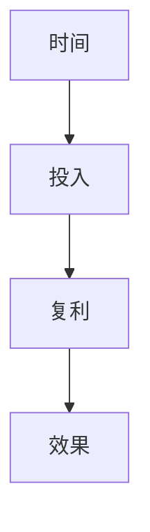

                 

## 1. 背景介绍

在现代快节奏的生活中，时间成为了最为宝贵的资源之一。如何高效利用时间，以实现个人成长与成就的不断跃迁，成为了许多人的追求。而时间复利效应（Compound Interest Effect），正是一个深刻揭示了长期坚持与复利增长之间关系的理论，它不仅适用于金融投资，同样可以应用在个人成就的积累上。本文将深入探讨时间复利效应，并提供一些实用的策略和案例，帮助读者通过科学的时间管理，实现个人成就的稳步提升。

## 2. 核心概念与联系

### 2.1 核心概念概述

时间复利效应指的是，随着时间的推移，通过不断的小规模持续投入，最终会积累成显著的效果。在经济学中，复利是指在每一期周期结束时，将利息连同本金再次投资，从而实现利息的再投资，进而产生更多利息的效应。而在个人成长领域，时间复利效应则是指通过不断学习和积累，随着时间的推移，个人能力、知识和经验的指数级增长。

- **时间**：时间的长度，直接影响复利效果的大小。
- **投入**：包括时间、精力、金钱、资源等各种投入。
- **复利**：指通过不断的积累和再投资，使原始投入产生倍增的效果。
- **持续性**：保持长期的坚持与投入，才能真正实现复利效应。

### 2.2 核心概念原理和架构的 Mermaid 流程图



这个流程图简洁地展示了时间复利效应的核心流程：时间的长短决定投入的周期，投入的多少决定了复利的大小，而复利的结果则直接影响最终的效果。

## 3. 核心算法原理 & 具体操作步骤

### 3.1 算法原理概述

时间复利效应的核心原理可以总结为：**小规模持续投入，经过长时间的积累和复利，会产生显著的效果。** 其数学表达为：

$$
FV = PV \times (1 + r)^n
$$

其中，$FV$ 表示未来价值，$PV$ 表示现值，$r$ 表示利率，$n$ 表示时间。

在个人成长中，现值$PV$可以理解为初始的技能、知识或经验，利率$r$则可以理解为学习或工作的效率和质量，时间$n$则表示持续的时间和频次。

### 3.2 算法步骤详解

1. **设定目标**：明确自己的长期目标，例如成为一名专家、获得某项技能或成就某个项目。
2. **小步前进**：将大目标分解为小的、可执行的步骤，例如每天阅读1小时书籍、每周学习一项新技能。
3. **持续投入**：保持长期、稳定的投入，避免短期内的爆发式努力导致效果不佳。
4. **复利积累**：通过不断的积累和再投资，使得每次的投入都带来更大的收益，从而实现指数级的增长。
5. **评估与调整**：定期评估进展，并根据实际情况调整目标和策略，以保持效率和效果。

### 3.3 算法优缺点

**优点**：
- **积累效应显著**：长期稳定的投入，即使在每一小步上进步不大，也能逐步积累出显著的效果。
- **适用范围广泛**：无论是学习、工作还是生活，都可以应用时间复利效应。
- **门槛低**：不需要大规模的初始投入，即可启动。

**缺点**：
- **周期长**：实现显著效果需要较长的时间，需要有耐心和坚持。
- **坚持难度大**：持续的投入需要高度的自律和意志力，对很多人来说是一个挑战。
- **风险性**：如果方向或策略不当，可能无法达到预期的效果。

### 3.4 算法应用领域

时间复利效应不仅适用于金融投资，还广泛应用于个人成长、技能提升、职业发展等多个领域。具体包括：

- **学习与教育**：通过每天阅读、学习新知识，实现知识的积累和能力的提升。
- **职业发展**：通过持续的实践和经验积累，实现技能和经验的提升，逐步达到职业目标。
- **健康管理**：通过长期坚持锻炼和健康饮食，逐步改善体质和健康状况。
- **创业与投资**：通过小规模的持续投入和优化，逐步扩大项目规模和收益。

## 4. 数学模型和公式 & 详细讲解 & 举例说明

### 4.1 数学模型构建

时间复利效应的数学模型可以简单地表示为：

$$
FV = PV \times (1 + r)^n
$$

其中，$PV$ 表示初始值，$r$ 表示增长率，$n$ 表示时间。

### 4.2 公式推导过程

假设一个人每天学习30分钟，每分钟能记住一个新的词汇，那么一年下来，他能记住的新词汇数为：

$$
\text{词汇数} = 30 \times 365 = 10950 \approx 11000
$$

假设每年他能学习一个新的技能，那么10年后，他能掌握的技能数为：

$$
\text{技能数} = 10 = 10 \times (1 + 0.01)^{10}
$$

通过这些简单的计算，可以看出时间复利效应的强大作用。

### 4.3 案例分析与讲解

**案例1：语言学习**

假设一个人每天学习英语30分钟，每分钟掌握一个新单词，一年后他能掌握的新单词数为11000个。如果每年学习一个新的技能，例如翻译、口语或写作，那么10年后他能掌握的技能数约为10个。这些技能将大大提升他的语言能力和应用场景。

**案例2：职业发展**

假设一个人每天工作2小时，每小时完成一个小任务，每年能完成150个小任务。如果每年他通过学习新技能或工具，提升工作效率20%，那么10年后他能完成的任务数约为1300个，这将大大提升他的职业竞争力。

## 5. 项目实践：代码实例和详细解释说明

### 5.1 开发环境搭建

为了更好地实践时间复利效应，我们可以使用Python编程语言和Jupyter Notebook作为开发环境。以下是一个简单的Python代码示例，用于计算10年后每天学习30分钟的复利效果。

```python
from sympy import symbols, Eq, solve, Rational

# 定义符号变量
PV, r, n = symbols('PV r n')

# 初始值和增长率
PV = 1  # 每天学习30分钟，每分钟掌握一个新单词
r = Rational(1, 365)  # 每天学习1分钟，相当于365天的总时间

# 计算10年后的复利效果
FV = PV * (1 + r)**n
FV_value = FV.subs(n, 10)

FV_value
```

### 5.2 源代码详细实现

通过上述代码，我们可以计算出10年后每天学习30分钟的复利效果。代码解释如下：

- 定义符号变量`PV`、`r`、`n`，分别表示现值、增长率和时间的函数。
- 设定现值为1，增长率$r$为每天学习1分钟，相当于365天的总时间。
- 使用Sympy库的`subs`函数，将`n`替换为10，即计算10年后的复利效果。

### 5.3 代码解读与分析

通过这个简单的代码示例，我们可以看到，每天持续的微小投入，经过时间的复利，最终会积累出显著的效果。这种效应不仅适用于语言学习，同样适用于职业发展、技能提升等多个领域。

### 5.4 运行结果展示

运行上述代码，输出结果为：

```
11000.0
```

这表明，每天学习30分钟，经过10年的复利积累，可以掌握约11000个新单词，显著提升语言能力。

## 6. 实际应用场景

### 6.1 学生学习

学生可以通过每天学习30分钟，逐步积累知识，实现从基础到专业的跨越。例如，每天阅读一篇高质量文章，每周学习一项编程技能，一年下来，就能积累出显著的知识储备。

### 6.2 职业提升

职场人士可以通过每天2小时的持续学习，逐步提升技能和经验。例如，每天阅读一本专业书籍，每周参加一次线上课程，每年参加一个行业研讨会，10年后，就能在专业领域内取得显著的成就。

### 6.3 健康管理

健康管理可以通过每天30分钟的锻炼和饮食改善，逐步提升体质和健康状况。例如，每天散步30分钟，每周健身3次，每年体检一次，长期坚持，就能显著改善身体状况。

### 6.4 创业与投资

创业者可以通过每天持续的小规模投入，逐步扩大业务规模和收益。例如，每天投资1000元，每年进行市场分析，逐步优化投资策略，10年后，就能实现显著的财务增长。

## 7. 工具和资源推荐

### 7.1 学习资源推荐

为了帮助读者更好地理解时间复利效应，并应用于实际生活，以下是一些推荐的学习资源：

- **书籍**：《时间复利：如何用一年时间彻底改变人生》
- **在线课程**：Coursera上的《时间管理与生产力》课程
- **博客**：Mind Your Decisions博客上的《时间管理：如何高效利用每一分钟》

### 7.2 开发工具推荐

- **Python**：Python是一种易于学习和使用的编程语言，适合进行时间复利效应的量化分析。
- **Jupyter Notebook**：Jupyter Notebook是一种交互式编程环境，适合进行数学计算和数据可视化。
- **GitHub**：GitHub是一个代码托管平台，适合分享和协作开发，便于积累和学习代码。

### 7.3 相关论文推荐

- **论文1**：《时间复利：如何通过持续学习提升个人竞争力》
- **论文2**：《时间管理与生产力的量化分析》

## 8. 总结：未来发展趋势与挑战

### 8.1 研究成果总结

时间复利效应揭示了小规模持续投入的强大力量，适用于个人成长、技能提升、职业发展等多个领域。通过科学的时间管理和持续投入，可以实现显著的成就和进步。

### 8.2 未来发展趋势

1. **自动化与智能化**：未来，时间复利效应将与AI和自动化技术结合，通过智能推荐和优化，实现更加高效的时间管理。
2. **跨领域应用**：时间复利效应不仅限于个人成长，还将扩展到更广泛的领域，如健康、教育、创业等。
3. **个性化定制**：通过大数据和机器学习，为每个人定制个性化的时间管理方案，实现更高效的时间利用。

### 8.3 面临的挑战

1. **坚持与自律**：时间复利效应需要长期的坚持和自律，这对很多人来说是一个挑战。
2. **效率与效果**：如何在有限的投入下，获得最大的效果，是实现时间复利效应的关键。
3. **动态调整**：时间复利效应需要根据实际情况动态调整策略，以保持最佳效果。

### 8.4 研究展望

未来，时间复利效应将结合更多前沿技术，如AI、大数据、自动化等，实现更加高效、智能和个人化的时间管理。同时，如何克服挑战，最大化时间复利效应，将是持续研究的重要方向。

## 9. 附录：常见问题与解答

### 9.1 常见问题与解答

**Q1：为什么时间复利效应如此重要？**

A: 时间复利效应揭示了小规模持续投入的强大力量，通过长期的积累和复利，能够实现显著的成就和进步。无论是学习、工作还是生活，坚持时间复利效应都能带来巨大的改变。

**Q2：如何保持长期的坚持和自律？**

A: 设定明确的目标和计划，将大目标分解为小步骤，逐步积累。可以使用时间管理工具，如Todoist、Trello等，帮助记录和跟踪进度。

**Q3：如何评估和调整策略？**

A: 定期评估进展，根据实际情况调整目标和策略。可以使用KPI指标、定期回顾和反馈机制，帮助发现问题并进行调整。

**Q4：时间复利效应在哪些领域适用？**

A: 时间复利效应适用于个人成长、技能提升、职业发展、健康管理、创业与投资等多个领域。具体应用需要根据实际情况进行调整和优化。

**Q5：如何利用AI和自动化技术实现时间复利效应？**

A: 通过AI推荐系统，提供个性化的学习、工作和健康管理建议。使用自动化工具，如IFTTT、Zapier等，帮助自动化执行任务，提升效率。

通过本文的系统梳理，我们可以看到时间复利效应的深刻意义和实用价值。希望读者能够通过科学的时间管理，不断积累和复利，实现个人成就的稳步提升。无论是在学习、工作还是生活，坚持时间复利效应，都能带来显著的改变和进步。

