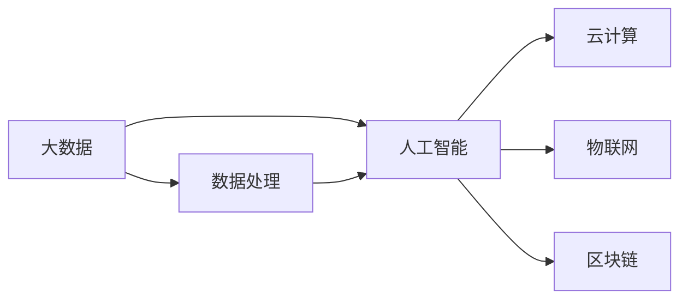

                 

# 智能创业：如何利用新技术颠覆传统行业

## 1. 背景介绍

在当今数字化、智能化浪潮下，各行各业都在经历着前所未有的变革。互联网、大数据、人工智能等新技术的涌现，为传统行业带来了颠覆性的机会。尤其是人工智能，正通过算法创新和数据应用，推动产业升级和商业模式重塑。智能创业，即通过人工智能技术，颠覆传统行业，开创新的发展模式和市场空间。

## 2. 核心概念与联系

### 2.1 核心概念概述

为了更好地理解智能创业的核心概念和相互联系，我们先对几个关键概念进行介绍：

- **人工智能（AI）**：指通过模拟人类智能行为，使计算机系统具备学习、推理、感知和决策能力的技术。涵盖机器学习、深度学习、自然语言处理、计算机视觉等众多分支。
- **大数据**：指规模庞大、结构复杂、速度快且来源多样化的数据集。通过数据挖掘和分析，能够揭示潜在的商业价值和趋势。
- **云计算**：指通过网络提供可伸缩、易扩展的计算资源，支持数据处理、应用开发、存储和传输等功能。
- **物联网（IoT）**：指将物体和设备通过互联网连接起来，实现设备间的数据交互和自动化控制。
- **区块链**：指通过去中心化、共识机制等技术，实现安全、透明、可追溯的交易记录和数据存储。

这些技术彼此交织，构成了智能创业的基石。通过大数据分析和人工智能算法，可以从海量数据中提炼出有价值的洞察，指导决策。云计算和物联网则提供了强大的计算和数据传输能力，保障了智能系统的实时性和可靠性。区块链则为数据安全、透明度和可信度提供了新的解决方案。

### 2.2 核心概念原理和架构的 Mermaid 流程图



这个流程图展示了大数据、人工智能、云计算、物联网、区块链等技术之间的联系。数据处理是人工智能的基石，云计算和物联网为数据处理提供了基础设施，而区块链保证了数据的安全性和可信度。这些技术的融合应用，推动了智能创业的发展。

## 3. 核心算法原理 & 具体操作步骤

### 3.1 算法原理概述

智能创业的核心在于利用人工智能技术，从大数据中提取有价值的知识，并通过模型训练和算法优化，构建智能系统，重塑行业格局。其核心算法原理包括以下几个方面：

- **数据预处理**：从原始数据中提取特征，去除噪音，提升数据质量。
- **模型选择与训练**：选择适合的算法模型，利用标注数据训练模型，优化参数，提升模型泛化能力。
- **算法集成与融合**：将多种算法和模型集成在一起，形成更复杂的智能系统，增强决策鲁棒性和适用性。
- **实时优化与迭代**：通过在线学习、强化学习等技术，实时更新模型，提升系统性能。

### 3.2 算法步骤详解

智能创业的具体操作步骤可以概括为以下几步：

**Step 1: 数据收集与预处理**
- 收集行业相关的数据，包括销售数据、客户反馈、运营数据等。
- 对数据进行清洗和预处理，去除噪音、填补缺失值、标准化数据格式。

**Step 2: 模型选择与训练**
- 根据业务需求，选择适合的机器学习或深度学习模型。
- 利用标注数据训练模型，优化超参数，提升模型性能。

**Step 3: 算法集成与融合**
- 将多个模型集成在一起，形成更复杂的智能系统。例如，集成决策树、随机森林、深度学习等模型。
- 利用融合技术，如集成学习、堆叠学习，提升系统性能和鲁棒性。

**Step 4: 实时优化与迭代**
- 通过在线学习、强化学习等技术，实时更新模型，适应新数据和新场景。
- 定期对模型进行评估和优化，确保模型性能和数据适应性。

### 3.3 算法优缺点

智能创业中的核心算法具有以下优缺点：

**优点**：
- 利用大数据和人工智能技术，能够从海量数据中提取有价值的知识，提升决策准确性和效率。
- 通过算法集成和融合，能够构建复杂的智能系统，增强决策鲁棒性和适用性。
- 通过实时优化和迭代，能够适应新数据和新场景，保持系统性能和可靠性。

**缺点**：
- 数据质量对算法效果有较大影响，需要大量高质量的标注数据。
- 算法复杂度高，需要高性能计算资源和专业技术人员支持。
- 系统复杂性高，调试和维护难度大。

### 3.4 算法应用领域

智能创业中的核心算法广泛应用于多个领域，包括但不限于：

- **金融科技（FinTech）**：利用大数据和人工智能技术，进行风险评估、信用评分、欺诈检测、智能投顾等。
- **医疗健康**：通过大数据分析和人工智能算法，实现疾病预测、医疗影像分析、个性化治疗等。
- **制造业**：利用物联网和人工智能技术，进行设备监控、质量控制、供应链优化等。
- **零售电商**：通过大数据分析和人工智能算法，进行客户分析、推荐系统、库存管理等。
- **智能城市**：通过物联网和人工智能技术，实现交通管理、环境监测、公共安全等。

## 4. 数学模型和公式 & 详细讲解 & 举例说明

### 4.1 数学模型构建

在智能创业中，常见的数学模型包括回归模型、分类模型、聚类模型等。这里以回归模型为例，介绍其基本构建过程。

假设有一个销售数据集，包含了多个特征变量 $X$ 和一个目标变量 $Y$。回归模型的目标是通过特征 $X$ 预测目标变量 $Y$。常用的回归模型有线性回归、多项式回归、决策树回归等。这里以线性回归为例，模型构建如下：

$$
\hat{Y} = \theta_0 + \theta_1 X_1 + \theta_2 X_2 + ... + \theta_n X_n
$$

其中 $\theta_0, \theta_1, ..., \theta_n$ 为模型参数，$X_1, X_2, ..., X_n$ 为特征变量，$\hat{Y}$ 为预测值。

### 4.2 公式推导过程

线性回归的参数 $\theta$ 可以通过最小二乘法求解，使得预测值 $\hat{Y}$ 与实际值 $Y$ 的误差平方和最小。推导过程如下：

1. 计算误差平方和：

$$
SSE = \sum_{i=1}^n (Y_i - \hat{Y}_i)^2
$$

2. 对误差平方和关于 $\theta$ 求偏导数：

$$
\frac{\partial SSE}{\partial \theta} = -2\sum_{i=1}^n (Y_i - \hat{Y}_i)
$$

3. 求解方程 $\frac{\partial SSE}{\partial \theta} = 0$，得到参数 $\theta$：

$$
\theta = (\mathbf{X}^T \mathbf{X})^{-1} \mathbf{X}^T \mathbf{Y}
$$

其中 $\mathbf{X}$ 为特征矩阵，$\mathbf{Y}$ 为目标变量向量。

### 4.3 案例分析与讲解

假设有一个电子商务网站，想要预测用户购买某个商品的点击率。首先，收集用户的浏览历史、购买历史、兴趣爱好等数据，作为特征变量。然后，构建线性回归模型，对点击率进行预测。具体步骤如下：

1. 数据收集：收集用户的浏览数据、购买数据、评价数据等，作为特征变量。
2. 数据预处理：对数据进行清洗、标准化处理，去除噪音和异常值。
3. 模型训练：利用标注数据训练线性回归模型，得到预测公式。
4. 模型评估：在测试集上评估模型性能，调整参数优化模型。
5. 实时预测：将用户的新数据输入模型，实时预测点击率。

## 5. 项目实践：代码实例和详细解释说明

### 5.1 开发环境搭建

要进行智能创业项目实践，首先需要搭建开发环境。以下是一个基本的Python开发环境搭建流程：

1. 安装Python：从官网下载并安装Python，并设置路径。
2. 安装第三方库：安装必要的Python库，如Numpy、Pandas、Scikit-learn、TensorFlow等。
3. 安装IDE：选择适合的项目管理IDE，如PyCharm、Jupyter Notebook等。
4. 配置虚拟环境：创建虚拟环境，隔离项目依赖，避免库版本冲突。

### 5.2 源代码详细实现

以下是一个基于Python的智能推荐系统示例代码，展示了如何利用机器学习算法进行用户推荐：

```python
import pandas as pd
from sklearn.model_selection import train_test_split
from sklearn.ensemble import RandomForestRegressor
from sklearn.metrics import mean_squared_error

# 数据预处理
data = pd.read_csv('data.csv')
data.dropna(inplace=True)
data['item_id'] = data['item_id'].astype(str)

# 特征工程
features = ['user_id', 'item_id', 'category', 'price', 'rating']
X = data[features]
y = data['sales']

# 模型训练
X_train, X_test, y_train, y_test = train_test_split(X, y, test_size=0.2)
model = RandomForestRegressor(n_estimators=100, random_state=42)
model.fit(X_train, y_train)

# 模型评估
y_pred = model.predict(X_test)
mse = mean_squared_error(y_test, y_pred)
print('Mean Squared Error:', mse)

# 模型预测
new_data = pd.DataFrame({
    'user_id': 'new_user',
    'item_id': 'new_item',
    'category': 'new_category',
    'price': 50,
    'rating': 4
})
new_data = new_data[features]
prediction = model.predict(new_data)
print('Predicted Sales:', prediction)
```

### 5.3 代码解读与分析

上述代码展示了如何使用Python和Scikit-learn库，构建一个基于随机森林算法的推荐系统。具体解读如下：

- 数据预处理：读取数据，清洗数据，去除缺失值，标准化数据格式。
- 特征工程：选择有用的特征，进行特征编码和处理。
- 模型训练：划分数据集，训练随机森林模型，得到预测公式。
- 模型评估：在测试集上评估模型性能，计算均方误差。
- 模型预测：将新数据输入模型，得到预测结果。

### 5.4 运行结果展示

运行上述代码，可以得到推荐系统的均方误差和预测结果。均方误差越小，模型性能越好。预测结果可以用来指导实际业务，提升销售转化率。

## 6. 实际应用场景

### 6.1 智能制造

智能制造是智能创业的重要应用场景之一。通过物联网技术，实现设备互联和数据集成，利用人工智能算法进行预测性维护、质量控制、供应链优化等。例如，利用预测性维护模型，可以实时监控设备状态，提前预测设备故障，避免停机损失。利用质量控制模型，可以对生产过程中的质量数据进行分析，优化生产流程。利用供应链优化模型，可以实现库存管理、需求预测、物流调度等功能，提升生产效率和资源利用率。

### 6.2 智能医疗

智能医疗是智能创业的另一重要应用场景。通过大数据分析和人工智能算法，可以实现疾病预测、医疗影像分析、个性化治疗等。例如，利用机器学习模型，可以对患者病历进行分析，预测疾病风险，提供早期干预方案。利用计算机视觉技术，可以自动分析医学影像，辅助医生诊断，提高诊断准确性。利用自然语言处理技术，可以分析患者问诊记录，提供个性化治疗方案，提升治疗效果。

### 6.3 智能交通

智能交通是智能创业的又一重要应用场景。通过物联网和人工智能技术，可以实现交通流量监测、智能调度、安全预警等功能。例如，利用预测性交通模型，可以实时监测交通流量，预测拥堵情况，优化交通信号控制。利用智能调度系统，可以实现公交调度、车辆路线规划，提高交通效率。利用安全预警系统，可以实时监测交通异常，预警潜在风险，保障交通安全。

## 7. 工具和资源推荐

### 7.1 学习资源推荐

为了帮助开发者系统掌握智能创业的核心技术，以下是一些优质的学习资源：

1. **《Python数据科学手册》**：由Jake VanderPlas所著，全面介绍了Python在数据科学中的应用，包括数据分析、机器学习、数据可视化等。
2. **《深度学习》课程**：由Coursera和斯坦福大学联合推出，由Andrew Ng主讲，涵盖深度学习基础、神经网络、卷积神经网络等。
3. **《机器学习实战》书籍**：由Peter Harrington所著，涵盖机器学习算法、特征工程、模型评估等内容，适合初学者入门。
4. **Kaggle平台**：提供大量的数据集和竞赛，锻炼数据分析和机器学习技能，结识数据科学社区。
5. **Udacity课程**：提供系统化的数据科学和人工智能课程，涵盖深度学习、机器学习、数据分析等。

### 7.2 开发工具推荐

高效的开发离不开优秀的工具支持。以下是几款用于智能创业开发的常用工具：

1. **PyTorch**：基于Python的开源深度学习框架，灵活性强，支持动态图和静态图计算。
2. **TensorFlow**：由Google主导开发的开源深度学习框架，支持分布式计算，适合大规模工程应用。
3. **Jupyter Notebook**：交互式的数据分析和代码编写工具，适合快速迭代实验。
4. **Google Colab**：谷歌提供的在线Jupyter Notebook环境，免费提供GPU/TPU算力，方便开发者快速实验。
5. **TQDM**：进度条可视化工具，适合展示复杂模型的训练过程。

### 7.3 相关论文推荐

智能创业中的核心算法不断发展，以下是几篇奠基性的相关论文，推荐阅读：

1. **《深度学习》论文**：Yann LeCun等著，介绍了深度学习的基本概念和应用，奠定了深度学习理论基础。
2. **《深度学习框架TensorFlow》论文**：Jeff Dean等著，介绍了TensorFlow的设计思想和应用实践。
3. **《大数据技术综述》论文**：Hadoop团队著，全面介绍了大数据技术栈，涵盖Hadoop、Spark、Hive等。
4. **《区块链技术综述》论文**：Vitalik Buterin等著，全面介绍了区块链技术原理和应用场景。
5. **《机器学习：理论与算法》论文**：Tom Mitchell等著，介绍了机器学习的基本理论和算法，涵盖监督学习、非监督学习、强化学习等。

## 8. 总结：未来发展趋势与挑战

### 8.1 研究成果总结

本文对智能创业中的人工智能技术进行了全面系统的介绍。首先阐述了智能创业的核心理念，即利用人工智能技术，通过数据驱动决策，推动行业变革。其次，从算法原理和具体操作步骤，详细讲解了智能创业的核心算法。最后，展示了智能创业在实际应用中的多种场景，以及未来的发展趋势和面临的挑战。

通过本文的系统梳理，可以看到，智能创业将为传统行业带来革命性的变化，推动产业升级和转型。利用人工智能技术，可以在智能制造、智能医疗、智能交通等多个领域，实现产业效率和质量的提升。然而，智能创业也面临数据隐私、算法透明、伦理安全等挑战，需要更多的理论和实践突破。

### 8.2 未来发展趋势

展望未来，智能创业的发展趋势如下：

1. **自动化和智能化**：随着人工智能技术的发展，更多的行业将实现自动化和智能化。例如，自动驾驶、智能家居、智能客服等领域，将大幅提升生产力和用户体验。
2. **数据驱动的决策**：数据将成为行业决策的重要依据。通过大数据分析和人工智能技术，企业能够更好地理解市场和客户需求，做出更加科学的决策。
3. **跨行业融合**：不同行业之间将实现深度融合。例如，金融科技、智能医疗、智能交通等领域，将通过数据共享和业务协同，提升整体效率和竞争力。
4. **个性化和定制化**：利用人工智能技术，企业能够更好地满足客户个性化需求，提供定制化服务。例如，智能推荐系统、智能客服、个性化医疗等。
5. **多模态融合**：人工智能技术将突破传统数据模态的界限，实现多模态数据的融合。例如，结合语音、图像、文本等数据，提供更加全面和精准的服务。

### 8.3 面临的挑战

尽管智能创业具备巨大的潜力，但在发展过程中，也面临诸多挑战：

1. **数据隐私和安全**：数据隐私和安全问题日益严重，如何保护用户数据隐私，防止数据泄露和滥用，是一个重要课题。
2. **算法透明和可解释性**：人工智能算法的复杂性和不透明性，导致其难以被理解和解释。如何提高算法的透明性和可解释性，是一个重要研究方向。
3. **伦理和道德**：人工智能技术的应用可能带来伦理和道德问题，例如算法偏见、决策失误等。如何构建公平、公正、可控的AI系统，是一个重要课题。
4. **计算资源和成本**：人工智能技术的计算资源需求大，成本高。如何降低计算成本，优化计算效率，是一个重要研究方向。
5. **模型泛化能力**：现有AI模型在特定场景下的泛化能力有限，如何提高模型的泛化能力，是一个重要研究方向。

### 8.4 研究展望

面对智能创业中的挑战，未来的研究需要在以下几个方面寻求新的突破：

1. **数据隐私保护**：开发数据加密、差分隐私等技术，保护用户数据隐私。
2. **算法透明和可解释性**：利用可解释AI技术，提高算法的透明性和可解释性。
3. **伦理和道德约束**：构建伦理导向的AI模型，确保决策公平和公正。
4. **计算资源优化**：开发高效算法和硬件加速技术，降低计算成本和提高计算效率。
5. **模型泛化能力提升**：利用迁移学习、少样本学习等技术，提升模型的泛化能力。

这些研究方向的探索，必将推动智能创业技术的发展，使其更好地服务于各行各业，提升社会生产力和经济效益。总之，智能创业是大数据和人工智能时代的必然选择，未来的发展充满无限可能。

## 9. 附录：常见问题与解答

**Q1: 智能创业中的人工智能技术有哪些应用场景？**

A: 智能创业中的人工智能技术广泛应用于多个领域，包括但不限于：

- **金融科技（FinTech）**：利用大数据和人工智能技术，进行风险评估、信用评分、欺诈检测、智能投顾等。
- **医疗健康**：通过大数据分析和人工智能算法，实现疾病预测、医疗影像分析、个性化治疗等。
- **制造业**：利用物联网和人工智能技术，进行设备监控、质量控制、供应链优化等。
- **零售电商**：通过大数据分析和人工智能算法，进行客户分析、推荐系统、库存管理等。
- **智能城市**：通过物联网和人工智能技术，实现交通管理、环境监测、公共安全等。

**Q2: 如何提高智能创业中的人工智能模型的泛化能力？**

A: 提高智能创业中的人工智能模型的泛化能力，可以从以下几个方面进行：

1. **数据增强**：通过数据增强技术，扩充数据集，提升模型的泛化能力。例如，通过旋转、裁剪、变换等技术，生成更多的训练样本。
2. **迁移学习**：利用已有模型的知识，在新任务上进行微调，提升模型的泛化能力。例如，利用预训练模型，在新任务上进行微调。
3. **少样本学习**：利用少数样本，进行模型训练，提升模型的泛化能力。例如，利用对抗性样本和噪声数据，进行模型训练。
4. **多模态融合**：结合多种数据模态，提高模型的泛化能力。例如，结合图像、语音、文本等数据，进行多模态学习。

**Q3: 智能创业中的人工智能技术有哪些优势？**

A: 智能创业中的人工智能技术具备以下优势：

1. **数据驱动决策**：通过大数据分析，企业能够更好地理解市场和客户需求，做出更加科学的决策。
2. **自动化和智能化**：通过人工智能技术，实现生产自动化和智能化，提升生产效率和质量。
3. **个性化和定制化**：利用人工智能技术，企业能够更好地满足客户个性化需求，提供定制化服务。
4. **跨行业融合**：不同行业之间实现深度融合，提升整体效率和竞争力。
5. **多模态融合**：结合多种数据模态，提供更加全面和精准的服务。

**Q4: 智能创业中的人工智能技术有哪些劣势？**

A: 智能创业中的人工智能技术也存在一些劣势：

1. **数据隐私和安全问题**：数据隐私和安全问题日益严重，如何保护用户数据隐私，防止数据泄露和滥用，是一个重要课题。
2. **算法透明和可解释性不足**：人工智能算法的复杂性和不透明性，导致其难以被理解和解释。
3. **伦理和道德问题**：人工智能技术的应用可能带来伦理和道德问题，例如算法偏见、决策失误等。
4. **计算资源需求大**：人工智能技术的计算资源需求大，成本高，如何降低计算成本，优化计算效率，是一个重要研究方向。
5. **模型泛化能力有限**：现有AI模型在特定场景下的泛化能力有限，如何提高模型的泛化能力，是一个重要研究方向。

通过本文的系统梳理，可以看到，智能创业中的人工智能技术既有巨大潜力，也面临诸多挑战。只有在技术、伦理、法律等多方面进行全面优化，才能真正实现人工智能技术的广泛应用，推动社会进步和经济发展。

