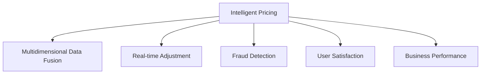

                 

## 1. 背景介绍

### 1.1 问题由来
智能定价技术在电子商务、金融服务、物流配送等领域得到了广泛应用，显著提升了业务效率和用户体验。然而，传统定价模型往往依赖于人工经验，缺乏数据驱动和动态调整能力，难以适应快速变化的市场环境。近年来，随着深度学习和大数据技术的成熟，智能定价技术正逐步向数据驱动、实时调整的方向发展，显著提升了定价策略的科学性和适应性。

### 1.2 问题核心关键点
智能定价技术的核心在于利用机器学习算法，结合市场数据、用户行为数据、产品特征等多元数据源，构建动态定价模型，实现对商品价格的实时调整。具体而言，主要涉及以下几个方面：
1. **市场数据**：包括历史销售数据、价格变化趋势、竞争产品信息等，用于描述市场环境。
2. **用户行为数据**：包括用户浏览历史、购买记录、评分评论等，用于反映用户偏好和行为模式。
3. **产品特征**：包括产品属性、类别、品质等，用于刻画产品自身特点。
4. **实时反馈**：包括订单量、成交率、库存状态等，用于动态调整价格策略。

本文聚焦于智能定价技术的实际应用效果，通过一系列典型案例分析，探讨其如何在不同领域实现高效精准的定价策略，同时揭示面临的挑战与未来发展方向。

## 2. 核心概念与联系

### 2.1 核心概念概述

为更好地理解智能定价技术的实践效果，本节将介绍几个密切相关的核心概念：

- **智能定价**：通过机器学习算法，结合多维数据源，构建动态定价模型，实现对商品价格的实时调整。
- **多维数据融合**：将市场数据、用户行为数据、产品特征等多元数据源融合，提升定价模型的泛化能力和预测精度。
- **实时调整**：基于实时反馈信息，动态调整定价策略，适应市场变化，提高资源利用效率。
- **反欺诈与风险控制**：利用机器学习算法，识别和防范价格欺诈行为，确保定价公平和市场稳定。
- **用户满意度**：通过动态定价策略，优化用户购物体验，提升用户满意度和品牌忠诚度。
- **业绩提升**：通过智能定价技术，优化库存管理、增加销量、提高利润率等，提升企业业绩。

这些核心概念之间的逻辑关系可以通过以下Mermaid流程图来展示：



这个流程图展示出智能定价技术的核心流程和关键因素：

1. 智能定价系统通过多维数据融合构建价格模型。
2. 系统根据实时反馈动态调整价格策略。
3. 系统通过反欺诈和风险控制确保定价公正。
4. 智能定价提升用户满意度和企业业绩。

## 3. 核心算法原理 & 具体操作步骤
### 3.1 算法原理概述

智能定价技术的核心算法原理可以概括为以下步骤：

1. **数据收集与预处理**：从多渠道收集市场、用户、产品等数据，并进行清洗和标准化处理。
2. **特征工程**：设计并提取有意义的特征，如价格趋势、用户评分、产品类别等，构建特征向量。
3. **模型构建**：选择或设计合适的机器学习模型，如线性回归、随机森林、神经网络等，进行训练和调参。
4. **定价策略制定**：结合模型预测结果和业务规则，制定动态定价策略，包括基础定价、折扣策略、促销策略等。
5. **实时调整与反馈**：基于实时反馈数据（如订单量、库存状态等），动态调整定价策略，实现价格优化。
6. **性能评估与优化**：定期评估定价效果，如销售增长率、用户满意度等，并进行模型优化。

### 3.2 算法步骤详解

以下详细介绍智能定价技术的具体实现步骤：

**Step 1: 数据收集与预处理**
1. **数据来源**：收集市场数据（如历史销售、价格变化）、用户数据（如浏览记录、评分评论）、产品数据（如类别、品质）等。
2. **数据清洗**：去除缺失、重复、异常数据，处理数据类型和格式。
3. **特征提取**：设计特征提取方法，如基于文本的TF-IDF特征、基于时间序列的滑动窗口特征等。

**Step 2: 特征工程**
1. **特征选择**：通过统计分析和特征选择算法（如卡方检验、Lasso回归等），选择有意义的特征。
2. **特征变换**：对原始特征进行变换，如归一化、标准化、PCA降维等。
3. **特征构造**：构造新的复合特征，如价格趋势、季节性特征等。

**Step 3: 模型构建**
1. **选择模型**：根据数据特性和业务需求，选择适合的机器学习模型。
2. **模型训练**：使用历史数据训练模型，进行交叉验证和调参。
3. **模型评估**：使用测试数据评估模型性能，如均方误差、R²、AUC等。

**Step 4: 定价策略制定**
1. **基础定价**：根据模型预测结果，制定初始定价策略。
2. **折扣策略**：结合促销活动、季节性变化等，制定动态折扣策略。
3. **促销策略**：根据用户行为和市场反应，调整促销策略，如限时折扣、满减优惠等。

**Step 5: 实时调整与反馈**
1. **实时数据收集**：实时监控订单量、库存状态等关键指标。
2. **动态调整**：基于实时反馈数据，动态调整定价策略。
3. **反馈机制**：定期分析定价效果，形成反馈循环，持续优化定价策略。

**Step 6: 性能评估与优化**
1. **效果评估**：评估定价效果，如销售额、利润率、用户满意度等。
2. **模型优化**：根据评估结果，调整模型参数和特征，提升模型性能。
3. **业务规则融合**：结合业务规则和专家经验，优化定价策略。

### 3.3 算法优缺点

智能定价技术具有以下优点：
1. **数据驱动**：利用大量历史和实时数据，提升定价策略的科学性和精度。
2. **动态调整**：根据实时反馈数据，动态调整价格策略，提高资源利用效率。
3. **灵活性**：结合多维数据源和业务规则，灵活调整定价策略，适应不同场景。
4. **可解释性**：通过特征工程和模型评估，提升定价策略的可解释性，增强决策透明度。

同时，该技术也存在一些局限性：
1. **数据质量要求高**：高质量、全面、及时的数据是智能定价的基础，数据收集和处理成本较高。
2. **模型复杂度高**：复杂的机器学习模型和特征工程需要较高的技术和资源投入。
3. **市场环境复杂**：价格变化受多因素影响，模型的泛化能力和鲁棒性需要不断优化。
4. **隐私和合规风险**：处理用户隐私数据需遵守相关法规，避免数据泄露和滥用。

尽管存在这些局限性，但就目前而言，智能定价技术仍是在线业务不可或缺的工具，通过合理设计和持续优化，可以实现高效精准的定价策略。

### 3.4 算法应用领域

智能定价技术在多个领域得到了广泛应用，例如：

- **电子商务**：通过智能定价提升商品销量，优化库存管理，增加利润率。
- **金融服务**：根据用户行为和市场反馈，动态调整贷款利率和保险费用。
- **物流配送**：根据订单量和库存状态，优化运输路径和定价策略。
- **旅游服务**：根据季节性变化和市场需求，调整机票、酒店等价格。
- **在线广告**：通过动态定价优化广告投放策略，提高广告效果和点击率。

除了上述这些经典领域，智能定价技术还在更多场景中得到了创新性的应用，如个性化推荐、资源定价、竞价广告等，为各行业带来新的突破。

## 4. 数学模型和公式 & 详细讲解
### 4.1 数学模型构建

本节将使用数学语言对智能定价技术的实践效果进行更加严格的刻画。

记市场数据为 $X$，用户行为数据为 $Y$，产品特征为 $Z$，则智能定价的数学模型可以表示为：

$$
P = f(X, Y, Z)
$$

其中 $P$ 为商品价格，$f$ 为定价函数，$X$、$Y$、$Z$ 为模型的输入变量。

假设 $X$、$Y$、$Z$ 均为向量，则定价函数可以进一步表示为：

$$
P = W^TX + BY + V^TZ
$$

其中 $W$、$B$、$V$ 为模型的权重矩阵，$X$、$Y$、$Z$ 为模型的输入向量。

### 4.2 公式推导过程

以下我们以线性定价模型为例，推导定价函数及梯度计算公式。

假设线性定价模型为 $P = W^TX + BY + V^TZ$，则定价函数 $f(X, Y, Z) = W^TX + BY + V^TZ$。其梯度计算公式为：

$$
\frac{\partial f(X, Y, Z)}{\partial W} = X^T, \quad \frac{\partial f(X, Y, Z)}{\partial B} = Y, \quad \frac{\partial f(X, Y, Z)}{\partial V} = Z^T
$$

将梯度代入权重更新公式：

$$
W \leftarrow W - \eta\frac{\partial f(X, Y, Z)}{\partial W}, \quad B \leftarrow B - \eta\frac{\partial f(X, Y, Z)}{\partial B}, \quad V \leftarrow V - \eta\frac{\partial f(X, Y, Z)}{\partial V}
$$

其中 $\eta$ 为学习率。

在得到定价函数的梯度后，即可带入权重更新公式，完成模型的迭代优化。重复上述过程直至收敛，最终得到定价模型的最优参数 $W^*, B^*, V^*$。

## 5. 项目实践：代码实例和详细解释说明
### 5.1 开发环境搭建

在进行智能定价技术实践前，我们需要准备好开发环境。以下是使用Python进行TensorFlow开发的环境配置流程：

1. 安装Anaconda：从官网下载并安装Anaconda，用于创建独立的Python环境。

2. 创建并激活虚拟环境：
```bash
conda create -n tf-env python=3.8 
conda activate tf-env
```

3. 安装TensorFlow：根据CUDA版本，从官网获取对应的安装命令。例如：
```bash
conda install tensorflow -c pytorch -c conda-forge
```

4. 安装其他相关工具包：
```bash
pip install pandas numpy scikit-learn matplotlib tqdm jupyter notebook ipython
```

完成上述步骤后，即可在`tf-env`环境中开始智能定价技术的开发。

### 5.2 源代码详细实现

这里我们以一个简单的线性定价模型为例，给出TensorFlow代码实现。

首先，定义模型和数据：

```python
import tensorflow as tf
import pandas as pd
import numpy as np

# 读取数据
data = pd.read_csv('data.csv')

# 分离特征和标签
features = data[['price', 'category', 'date']]
labels = data['quantity']

# 标准化处理
features = (features - features.mean()) / features.std()

# 定义模型
model = tf.keras.Sequential([
    tf.keras.layers.Dense(64, activation='relu', input_shape=(features.shape[1],)),
    tf.keras.layers.Dense(64, activation='relu'),
    tf.keras.layers.Dense(1)
])
```

然后，定义损失函数和优化器：

```python
# 定义损失函数和优化器
loss_fn = tf.keras.losses.MeanSquaredError()
optimizer = tf.keras.optimizers.Adam()
```

接着，训练模型：

```python
# 训练模型
model.compile(optimizer=optimizer, loss=loss_fn)
history = model.fit(features, labels, epochs=50, batch_size=32, validation_split=0.2)
```

最后，使用模型进行预测：

```python
# 加载模型
model.load_weights('model_weights.h5')

# 测试数据
test_features = pd.read_csv('test_data.csv')
test_features = (test_features - test_features.mean()) / test_features.std()

# 预测价格
predictions = model.predict(test_features)
```

### 5.3 代码解读与分析

让我们再详细解读一下关键代码的实现细节：

**数据处理**：
- 读取CSV文件，提取特征和标签。
- 使用标准化方法对特征进行归一化处理，提高模型的训练效果。

**模型定义**：
- 使用TensorFlow的Sequential模型定义线性回归模型，包含3个全连接层。
- 激活函数选择ReLU，以提高模型的非线性拟合能力。

**损失函数和优化器**：
- 选择均方误差损失函数，衡量模型预测值与真实值之间的差异。
- 使用Adam优化器，调整模型参数。

**模型训练**：
- 使用训练数据集进行模型训练，设置迭代次数和批量大小。
- 在训练过程中，使用验证集评估模型性能，防止过拟合。

**模型预测**：
- 加载训练好的模型，对测试数据进行价格预测。
- 使用预测结果评估模型的效果。

## 6. 实际应用场景
### 6.1 智能推荐系统

智能定价技术在智能推荐系统中的应用，主要体现在推荐商品价格的动态调整上。通过分析用户历史行为和市场反馈，实时调整商品价格，提升推荐效果。

在技术实现上，可以收集用户的历史浏览、购买记录和评分评论等数据，结合商品类别、品牌、季节性特征等，构建多维特征向量。利用线性回归等机器学习算法，训练定价模型。模型训练完成后，对新的用户行为进行实时预测，并根据预测结果动态调整商品价格，提升推荐效果和用户满意度。

### 6.2 金融产品定价

金融服务行业利用智能定价技术，优化贷款利率、保险费用等金融产品定价。通过收集用户历史信用记录、贷款期限、还款能力等数据，结合市场利率、产品类别等特征，构建定价模型。模型训练完成后，对新申请进行实时定价，并根据市场反馈动态调整，确保定价的公平性和合理性。

### 6.3 物流配送定价

物流配送公司通过智能定价技术，优化运输路径和定价策略，提升运输效率和利润率。通过收集历史订单数据、产品特征、运输距离等，结合实时市场需求和库存状态，构建定价模型。模型训练完成后，对新订单进行实时定价，并根据订单量和库存状态动态调整，确保运输成本和利润率最优。

### 6.4 未来应用展望

随着智能定价技术的发展，未来将在更多领域得到应用，为各行各业带来新的突破。

在智慧医疗领域，基于智能定价的药物定价模型，可以实时调整药品价格，确保药品的可及性和经济性，提升患者医疗体验。

在智能教育领域，智能定价技术可以用于动态调整在线课程和教材的定价策略，根据学生的学习行为和成绩，优化课程内容和价格，提升教育效果和用户满意度。

在智慧城市治理中，智能定价技术可以用于交通定价、公共资源定价等，优化资源配置，提高城市管理效率和公共服务质量。

此外，在农业、能源、环保等众多领域，智能定价技术也将带来新的应用场景，推动产业升级和可持续发展。

## 7. 工具和资源推荐
### 7.1 学习资源推荐

为了帮助开发者系统掌握智能定价技术的理论基础和实践技巧，这里推荐一些优质的学习资源：

1. 《深度学习实战》系列博文：由大模型技术专家撰写，深入浅出地介绍了深度学习模型的原理和应用，包括智能定价技术。

2. CS229《机器学习》课程：斯坦福大学开设的机器学习经典课程，有Lecture视频和配套作业，带你入门机器学习的基本概念和经典模型。

3. 《TensorFlow实战》书籍：TensorFlow官方文档的补充，全面介绍了如何使用TensorFlow进行深度学习模型的开发和部署，包括智能定价技术。

4. Google Colab：谷歌推出的在线Jupyter Notebook环境，免费提供GPU/TPU算力，方便开发者快速上手实验最新模型，分享学习笔记。

通过对这些资源的学习实践，相信你一定能够快速掌握智能定价技术的精髓，并用于解决实际的NLP问题。

### 7.2 开发工具推荐

高效的开发离不开优秀的工具支持。以下是几款用于智能定价开发的常用工具：

1. TensorFlow：由Google主导开发的开源深度学习框架，生产部署方便，适合大规模工程应用。

2. PyTorch：基于Python的开源深度学习框架，灵活动态的计算图，适合快速迭代研究。

3. Scikit-learn：Python的机器学习库，提供了丰富的机器学习算法和工具，适合快速原型开发。

4. Pandas：Python的数据处理库，支持数据清洗、数据预处理等，适合数据密集型任务。

5. Matplotlib：Python的可视化库，支持各类数据可视化，适合模型评估和结果展示。

6. Jupyter Notebook：交互式开发环境，支持代码编写、数据处理、模型训练等，适合数据科学家和工程师协同工作。

合理利用这些工具，可以显著提升智能定价技术的开发效率，加快创新迭代的步伐。

### 7.3 相关论文推荐

智能定价技术的发展源于学界的持续研究。以下是几篇奠基性的相关论文，推荐阅读：

1. Pricing Mechanism Design: Theory and Applications（定价机制设计）：介绍了定价机制的理论基础和应用场景，为智能定价技术提供了理论支撑。

2. Dynamic Pricing: How Much Should You Charge?（动态定价策略）：详细讨论了动态定价的理论模型和实际应用，提出了多种动态定价策略。

3. Adaptive Pricing Algorithms in Electricity Markets（电力市场的适应性定价算法）：展示了在电力市场中的智能定价应用，优化了电力价格，提升了市场效率。

4. Revenue Management in the Streaming Media Industry（流媒体行业的收益管理）：介绍了流媒体行业的定价策略和收益管理技术，为智能定价技术提供了实际案例。

这些论文代表了大模型定价技术的发展脉络。通过学习这些前沿成果，可以帮助研究者把握学科前进方向，激发更多的创新灵感。

## 8. 总结：未来发展趋势与挑战
### 8.1 总结

本文对智能定价技术的实践效果进行了全面系统的介绍。首先阐述了智能定价技术的研究背景和意义，明确了智能定价在提升资源利用效率、优化用户体验方面的重要价值。其次，从原理到实践，详细讲解了智能定价的数学模型和关键步骤，给出了智能定价任务开发的完整代码实例。同时，本文还广泛探讨了智能定价技术在推荐系统、金融产品、物流配送等多个领域的应用前景，展示了智能定价技术的巨大潜力。此外，本文精选了智能定价技术的各类学习资源，力求为读者提供全方位的技术指引。

通过本文的系统梳理，可以看到，智能定价技术正在成为在线业务不可或缺的工具，极大地提升了业务效率和用户体验。未来，伴随智能定价技术的不断演进，相信将为各行业带来新的突破，推动智能化进程的加速发展。

### 8.2 未来发展趋势

展望未来，智能定价技术将呈现以下几个发展趋势：

1. **数据驱动**：智能定价将更加依赖大数据和多元数据源，构建更加精准的定价模型，提升决策的科学性和有效性。
2. **实时调整**：实时数据反馈和动态定价策略将更加普及，提升资源利用效率和市场响应速度。
3. **多维融合**：结合多维数据源和业务规则，实现更加全面、准确的定价策略，适应复杂多变的市场环境。
4. **个性化定制**：基于用户行为和历史数据，实现个性化定价，提升用户体验和满意度。
5. **智能推荐**：智能定价与智能推荐技术结合，提供更精准的商品推荐和定价建议。
6. **可持续性**：注重资源和环境成本，实现可持续发展定价，提升企业的社会责任感。

以上趋势凸显了智能定价技术的发展前景。这些方向的探索发展，必将进一步提升定价策略的科学性和灵活性，为各行业带来新的突破。

### 8.3 面临的挑战

尽管智能定价技术已经取得了瞩目成就，但在迈向更加智能化、普适化应用的过程中，它仍面临着诸多挑战：

1. **数据质量要求高**：高质量、全面、及时的数据是智能定价的基础，数据收集和处理成本较高。
2. **模型复杂度高**：复杂的机器学习模型和特征工程需要较高的技术和资源投入。
3. **市场环境复杂**：价格变化受多因素影响，模型的泛化能力和鲁棒性需要不断优化。
4. **隐私和合规风险**：处理用户隐私数据需遵守相关法规，避免数据泄露和滥用。
5. **技术壁垒高**：智能定价技术需要较高的技术储备和工程能力，对从业人员的素质要求较高。

尽管存在这些挑战，但就目前而言，智能定价技术仍是在线业务不可或缺的工具，通过合理设计和持续优化，可以实现高效精准的定价策略。

### 8.4 研究展望

面对智能定价面临的挑战，未来的研究需要在以下几个方面寻求新的突破：

1. **数据质量提升**：探索更好的数据收集和处理方法，提高数据质量和覆盖面。
2. **模型优化**：开发更简单、高效的定价模型，提升模型的训练速度和泛化能力。
3. **多模态融合**：结合多种数据源和信息源，提升定价策略的全面性和鲁棒性。
4. **隐私保护**：引入隐私保护技术，确保用户数据的安全和合规。
5. **伦理和公平性**：设计更加公平和透明的定价策略，避免价格歧视和数据偏见。
6. **可持续发展**：注重环境成本和资源利用效率，实现可持续发展的定价策略。

这些研究方向的探索，必将引领智能定价技术迈向更高的台阶，为各行业带来新的突破，推动智能化进程的加速发展。

## 9. 附录：常见问题与解答

**Q1：智能定价是否适用于所有业务场景？**

A: 智能定价技术适用于大多数业务场景，尤其是数据密集型和用户行为驱动的业务，如电子商务、金融服务、物流配送等。对于某些需要高度专业知识的领域，可能需要结合专家经验进行人工调整。

**Q2：智能定价模型如何处理季节性变化？**

A: 智能定价模型可以通过引入季节性特征来处理季节性变化。例如，在定价模型中加入月度或季度特征，反映不同季节的市场需求和价格变化趋势。同时，可以通过模型调参和特征工程，优化模型对季节性变化的适应能力。

**Q3：智能定价模型如何避免过拟合？**

A: 智能定价模型可以通过正则化、dropout、early stopping等技术避免过拟合。此外，可以通过数据增强、特征降维等手段，提高模型的泛化能力和鲁棒性。

**Q4：智能定价模型如何处理异常数据？**

A: 智能定价模型可以通过异常检测和处理技术，识别和处理异常数据。例如，在模型训练和预测过程中，对异常数据进行标记或剔除，确保模型的稳定性和鲁棒性。

**Q5：智能定价模型如何应对市场变化？**

A: 智能定价模型可以通过持续学习和在线优化，及时应对市场变化。例如，在模型训练过程中，定期更新模型参数，引入新的数据和特征，确保模型始终保持最新状态。

作者：禅与计算机程序设计艺术 / Zen and the Art of Computer Programming

