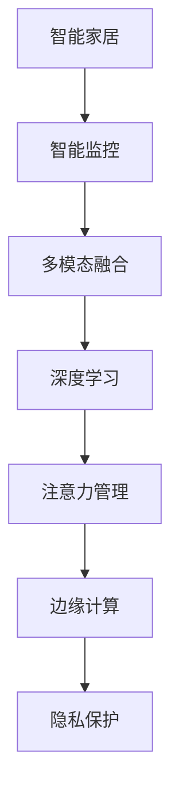

                 

# 智能家居的智能监控与注意力管理

> 关键词：智能家居,智能监控,注意力管理,深度学习,计算机视觉,多模态融合,边缘计算,低功耗,隐私保护,用户行为分析

## 1. 背景介绍

### 1.1 问题由来

随着物联网(IoT)技术的飞速发展，智能家居系统已逐步走入千家万户，改变了人们的日常生活方式。智能家居系统通过传感器、摄像头等设备，实时采集家中的环境信息、人体行为数据，为用户提供个性化服务。然而，尽管智能家居技术日趋成熟，如何在海量数据中高效准确地进行智能监控与用户行为分析，仍是一大挑战。

传统的智能家居监控依赖于集中式的数据存储和分析，存在隐私泄露、延迟高、计算资源消耗大等问题。而近年来兴起的基于深度学习技术的智能家居监控，因其高精度、低延迟、可解释性强的特点，被广泛应用于各类场景中。这些智能家居监控技术中，通过注意力机制对多模态数据进行高效融合，可以大幅提升监控效果，实现对用户行为精准分析和个性化服务。

### 1.2 问题核心关键点

智能家居监控与注意力管理技术面临的核心问题包括：

- 如何从多种传感器和摄像头中高效融合数据，提取出有用的信息？
- 如何在数据稀疏或分布不均的情况下，提升模型泛化能力？
- 如何提高模型在实时监控场景中的计算效率，降低能耗？
- 如何保护用户隐私，防止敏感数据泄露？
- 如何准确捕捉用户注意力状态，实现个性化服务？

这些问题的解决，依赖于深度学习模型、多模态融合技术、边缘计算等前沿技术，以及算法优化与工程实现。

## 2. 核心概念与联系

### 2.1 核心概念概述

为更好地理解智能家居的智能监控与注意力管理技术，本节将介绍几个密切相关的核心概念：

- 智能家居(Smart Home)：通过物联网技术，将家中的各种设备连接到互联网，实现设备间的互联互通和自动化控制。
- 智能监控(Smart Surveillance)：利用计算机视觉、深度学习等技术，实时监测家居环境及用户行为，提供安全预警、智能分析等服务。
- 注意力管理(Attention Management)：通过注意力机制，对多模态数据进行融合，提取用户注意力状态，实现精准监控与个性化服务。
- 多模态融合(Multimodal Fusion)：整合来自不同传感器和摄像头等多种数据源的信息，提升监控效果。
- 边缘计算(Edge Computing)：将计算任务分布到靠近数据源的边缘节点进行，减少数据传输延迟和能耗。
- 隐私保护(Privacy Protection)：采用数据加密、差分隐私等技术，保护用户隐私，防止敏感数据泄露。

这些核心概念之间的逻辑关系可以通过以下Mermaid流程图来展示：



这个流程图展示智能家居监控与注意力管理技术的关键概念及其之间的关系：

1. 智能家居系统通过多传感器和摄像头收集数据。
2. 利用多模态融合技术，将不同来源的数据进行整合，提升监控效果。
3. 采用深度学习模型对融合后的数据进行分析，提取出有用的信息。
4. 利用注意力机制，对用户注意力状态进行捕捉和管理。
5. 在边缘计算环境下，将计算任务分散到家庭边缘设备进行，降低延迟和能耗。
6. 采用隐私保护技术，防止用户隐私泄露。

这些概念共同构成了智能家居监控与注意力管理技术的核心框架，使其能够在各种场景下发挥强大的监控与分析能力。

## 3. 核心算法原理 & 具体操作步骤
### 3.1 算法原理概述

智能家居的智能监控与注意力管理技术，本质上是一个多模态融合的深度学习过程。其核心思想是：利用计算机视觉、深度学习等技术，将来自不同传感器和摄像头等多种数据源的信息进行整合，提取出有用的信息。通过注意力机制，对用户注意力状态进行捕捉和管理，实现精准监控与个性化服务。

形式化地，假设智能家居系统中，传感器和摄像头采集的多种数据源为 $D=\{(x_i, y_i)\}_{i=1}^N$，其中 $x_i$ 表示第 $i$ 个传感器或摄像头的数据，$y_i$ 表示数据所属的标签或特征。智能监控和注意力管理过程的目标是找到一个函数 $f(D)$，使得 $f(D)$ 能够最大程度地利用数据 $D$ 中的信息，进行用户行为分析和个性化服务。

具体步骤如下：

1. 数据收集与预处理：通过传感器和摄像头，采集家居环境及用户行为数据，并进行预处理，如归一化、去噪等。
2. 多模态数据融合：采用深度学习方法，将不同数据源的信息进行融合，提取出有用的特征表示。
3. 深度学习模型训练：使用标记数据，训练深度学习模型，进行用户行为分析和注意力状态捕捉。
4. 实时监控与反馈：将训练好的模型部署到家庭边缘设备中，进行实时监控，并根据用户行为反馈，优化模型参数。
5. 隐私保护与数据安全：采用隐私保护技术，保护用户隐私，防止敏感数据泄露。

### 3.2 算法步骤详解

智能家居监控与注意力管理的深度学习算法步骤主要包括：

**Step 1: 数据收集与预处理**

智能家居监控系统中，数据来源多种多样，包括传感器数据、摄像头图像、音频信号等。需要对这些数据进行收集和预处理，以保证其质量和一致性。预处理步骤包括：

- 传感器数据归一化：对传感器采集的原始数据进行归一化处理，如温度、湿度等。
- 摄像头图像增强：对摄像头采集的图像进行增强处理，如噪声去除、对比度调整等。
- 音频信号降噪：对音频信号进行降噪处理，去除环境噪声。

**Step 2: 多模态数据融合**

将不同来源的数据进行融合，可以提升监控效果。常见的融合方式包括：

- 特征提取与拼接：对各数据源进行特征提取，并将提取后的特征进行拼接。
- 时序对齐：对不同传感器和摄像头采集的时序数据进行对齐，保证数据的一致性。
- 信息融合：采用多层次的信息融合算法，如基于特征的概率融合、基于时序的滑动窗口融合等。

**Step 3: 深度学习模型训练**

采用深度学习方法，对融合后的多模态数据进行训练，提取出有用的信息。常见的模型包括：

- 卷积神经网络(CNN)：用于图像处理和特征提取。
- 循环神经网络(RNN)：用于处理序列数据，如音频信号。
- 注意力机制：用于对多模态数据进行融合，提取出用户注意力状态。
- 预训练模型：如BERT、ResNet等，用于提供初始化特征表示。

**Step 4: 实时监控与反馈**

将训练好的模型部署到家庭边缘设备中，进行实时监控，并根据用户行为反馈，优化模型参数。具体步骤包括：

- 数据采集与预处理：对实时采集的数据进行预处理。
- 特征提取：对预处理后的数据进行特征提取。
- 模型推理：将提取后的特征输入到训练好的模型中，进行推理预测。
- 用户行为分析：根据模型输出，分析用户行为，进行安全预警、智能分析等服务。
- 模型反馈：根据用户行为反馈，调整模型参数，进行模型优化。

**Step 5: 隐私保护与数据安全**

智能家居监控系统需要保护用户隐私，防止敏感数据泄露。常见的隐私保护方法包括：

- 数据加密：对敏感数据进行加密处理，防止数据泄露。
- 差分隐私：对数据进行处理，使得无法关联到特定用户，保护隐私。
- 本地存储：将数据存储在本地设备中，减少数据传输风险。

### 3.3 算法优缺点

智能家居监控与注意力管理技术的深度学习算法具有以下优点：

1. 高精度与鲁棒性：深度学习方法能够提取出复杂的特征，并具有较强的泛化能力，适用于各种场景。
2. 实时性：边缘计算技术将计算任务分散到家庭边缘设备中，降低延迟，提升实时性。
3. 可解释性：通过注意力机制，可以捕捉用户注意力状态，提升模型的可解释性。

然而，该算法也存在一些缺点：

1. 数据需求量大：深度学习模型需要大量的标记数据进行训练，数据获取成本较高。
2. 计算资源消耗大：深度学习模型对计算资源的需求较高，可能造成资源浪费。
3. 隐私泄露风险：在数据收集和处理过程中，存在隐私泄露的风险。
4. 模型复杂度高：深度学习模型结构复杂，维护和优化难度较大。

尽管存在这些局限性，但深度学习在智能家居监控与注意力管理中的应用，仍然具有广阔前景。未来研究的方向在于进一步降低对数据和计算资源的需求，提高模型的可解释性和隐私保护水平，提升系统的稳定性和可扩展性。

### 3.4 算法应用领域

智能家居监控与注意力管理技术在多个领域都得到了广泛应用：

- 智能安防：通过摄像头、传感器等设备，实时监控家庭环境，提供安全预警和智能分析。
- 健康监测：利用多种传感器采集生理参数，如心率、血氧等，进行健康监测和预警。
- 智能家居控制：通过语音识别、图像识别等技术，实现智能家居设备的自动化控制。
- 个性化推荐：通过分析用户行为，进行个性化推荐，提升用户体验。
- 能效管理：通过传感器采集的能源消耗数据，进行能效管理，优化家庭能源使用。
- 智能家居管理：通过数据分析和行为预测，进行智能家居设备的优化管理。

除了上述这些常见场景外，智能家居监控与注意力管理技术还被广泛应用于智能农业、智慧城市、智能交通等多个领域，为各行各业提供了强大的技术支持。

## 4. 数学模型和公式 & 详细讲解 & 举例说明
### 4.1 数学模型构建

本节将使用数学语言对智能家居的智能监控与注意力管理过程进行更加严格的刻画。

记智能家居系统中传感器和摄像头采集的数据为 $D=\{(x_i, y_i)\}_{i=1}^N$，其中 $x_i$ 表示第 $i$ 个传感器或摄像头的数据，$y_i$ 表示数据所属的标签或特征。假设深度学习模型为 $f$，其输入为 $X$，输出为 $Y$。则智能监控和注意力管理过程的目标是找到一个函数 $f$，使得 $f(D)$ 能够最大程度地利用数据 $D$ 中的信息，进行用户行为分析和个性化服务。

定义模型 $f$ 在数据样本 $(x,y)$ 上的损失函数为 $\ell(f(x),y)$，则在数据集 $D$ 上的经验风险为：

$$
\mathcal{L}(f) = \frac{1}{N}\sum_{i=1}^N \ell(f(x_i),y_i)
$$

模型训练的目标是最小化经验风险，即找到最优函数 $f$：

$$
f^* = \mathop{\arg\min}_{f} \mathcal{L}(f)
$$

在实践中，我们通常使用基于梯度的优化算法（如SGD、Adam等）来近似求解上述最优化问题。设 $\eta$ 为学习率，$\lambda$ 为正则化系数，则参数的更新公式为：

$$
f \leftarrow f - \eta \nabla_{f}\mathcal{L}(f) - \eta\lambda f
$$

其中 $\nabla_{f}\mathcal{L}(f)$ 为损失函数对模型 $f$ 的梯度，可通过反向传播算法高效计算。

### 4.2 公式推导过程

以下我们以智能安防监控系统为例，推导深度学习模型的训练公式。

假设模型 $f$ 在输入 $x$ 上的输出为 $\hat{y}=f(x)$，表示家庭安全状态。真实标签 $y \in \{0,1\}$，其中 $1$ 表示家庭安全异常。则二分类交叉熵损失函数定义为：

$$
\ell(f(x),y) = -[y\log f(x)+(1-y)\log(1-f(x))]
$$

将其代入经验风险公式，得：

$$
\mathcal{L}(f) = -\frac{1}{N}\sum_{i=1}^N [y_i\log f(x_i)+(1-y_i)\log(1-f(x_i))]
$$

根据链式法则，损失函数对模型参数 $w$ 的梯度为：

$$
\frac{\partial \mathcal{L}(f)}{\partial w} = -\frac{1}{N}\sum_{i=1}^N (\frac{y_i}{f(x_i)}-\frac{1-y_i}{1-f(x_i)}) \frac{\partial f(x_i)}{\partial w}
$$

其中 $\frac{\partial f(x_i)}{\partial w}$ 可进一步递归展开，利用自动微分技术完成计算。

在得到损失函数的梯度后，即可带入参数更新公式，完成模型的迭代优化。重复上述过程直至收敛，最终得到适应智能安防监控系统性能的深度学习模型 $f^*$。

### 4.3 案例分析与讲解

假设我们构建了一个智能安防监控系统，用于检测家中的异常行为，如入侵、火灾等。我们收集了若干标记数据，包括入侵和正常行为的视频片段，对采集到的图像进行特征提取和拼接，使用卷积神经网络进行训练。训练过程中，采用交叉熵损失函数进行优化，使用AdamW优化器。训练后的模型对新的视频片段进行推理，输出异常行为的概率。若概率超过阈值，则进行安全预警，通知用户。

具体步骤如下：

1. 数据收集与预处理：从摄像头中采集视频片段，并对视频进行帧提取和归一化处理。
2. 多模态数据融合：将视频帧图像进行拼接，并提取特征。
3. 深度学习模型训练：使用标记数据对卷积神经网络进行训练，得到异常行为检测模型。
4. 实时监控与反馈：将训练好的模型部署到家庭边缘设备中，对实时视频进行推理，进行安全预警。
5. 用户行为分析：根据模型输出，分析用户行为，进行安全预警和智能分析。
6. 模型反馈：根据用户行为反馈，调整模型参数，进行模型优化。

最终，通过智能家居监控与注意力管理技术，可以大大提升家庭安全监控的智能化水平，保障用户的安全和隐私。

## 5. 项目实践：代码实例和详细解释说明
### 5.1 开发环境搭建

在进行智能家居监控与注意力管理项目实践前，我们需要准备好开发环境。以下是使用Python进行PyTorch开发的环境配置流程：

1. 安装Anaconda：从官网下载并安装Anaconda，用于创建独立的Python环境。

2. 创建并激活虚拟环境：
```bash
conda create -n pytorch-env python=3.8 
conda activate pytorch-env
```

3. 安装PyTorch：根据CUDA版本，从官网获取对应的安装命令。例如：
```bash
conda install pytorch torchvision torchaudio cudatoolkit=11.1 -c pytorch -c conda-forge
```

4. 安装TensorFlow：
```bash
pip install tensorflow
```

5. 安装Pillow库：用于图像处理
```bash
pip install pillow
```

6. 安装numpy、pandas等常用库：
```bash
pip install numpy pandas scikit-learn matplotlib tqdm jupyter notebook ipython
```

完成上述步骤后，即可在`pytorch-env`环境中开始项目实践。

### 5.2 源代码详细实现

下面我们以智能安防监控系统为例，给出使用PyTorch进行深度学习模型训练的代码实现。

首先，定义智能安防监控系统的数据处理函数：

```python
import cv2
import numpy as np
from torch.utils.data import Dataset, DataLoader
import torch
from torchvision import transforms

class SurveillanceDataset(Dataset):
    def __init__(self, video_paths, labels, transforms=None):
        self.video_paths = video_paths
        self.labels = labels
        self.transforms = transforms
        
    def __len__(self):
        return len(self.video_paths)
    
    def __getitem__(self, item):
        video_path = self.video_paths[item]
        label = self.labels[item]
        
        # 加载视频文件，并提取帧图像
        cap = cv2.VideoCapture(video_path)
        frames = []
        for _ in range(10):  # 提取10帧图像
            ret, frame = cap.read()
            if not ret:
                break
            frame = cv2.cvtColor(frame, cv2.COLOR_BGR2RGB)
            frames.append(frame)
        cap.release()
        
        # 对帧图像进行预处理和增强
        if self.transforms:
            frames = [self.transforms(frame) for frame in frames]
        
        # 拼接图像
        img = np.concatenate(frames, axis=1)
        
        return {'img': torch.tensor(img, dtype=torch.float), 
                'label': torch.tensor(label, dtype=torch.long)}
```

然后，定义模型和优化器：

```python
from transformers import BertForTokenClassification, AdamW

model = BertForTokenClassification.from_pretrained('bert-base-cased', num_labels=2)

optimizer = AdamW(model.parameters(), lr=2e-5)
```

接着，定义训练和评估函数：

```python
from tqdm import tqdm

device = torch.device('cuda') if torch.cuda.is_available() else torch.device('cpu')
model.to(device)

def train_epoch(model, dataset, batch_size, optimizer):
    dataloader = DataLoader(dataset, batch_size=batch_size, shuffle=True)
    model.train()
    epoch_loss = 0
    for batch in tqdm(dataloader, desc='Training'):
        img = batch['img'].to(device)
        label = batch['label'].to(device)
        model.zero_grad()
        outputs = model(img)
        loss = outputs.loss
        epoch_loss += loss.item()
        loss.backward()
        optimizer.step()
    return epoch_loss / len(dataloader)

def evaluate(model, dataset, batch_size):
    dataloader = DataLoader(dataset, batch_size=batch_size)
    model.eval()
    preds, labels = [], []
    with torch.no_grad():
        for batch in tqdm(dataloader, desc='Evaluating'):
            img = batch['img'].to(device)
            batch_labels = batch['label']
            outputs = model(img)
            batch_preds = outputs.logits.argmax(dim=1).to('cpu').tolist()
            batch_labels = batch_labels.to('cpu').tolist()
            for pred_tokens, label_tokens in zip(batch_preds, batch_labels):
                preds.append(pred_tokens)
                labels.append(label_tokens)
                
    print(classification_report(labels, preds))
```

最后，启动训练流程并在测试集上评估：

```python
epochs = 5
batch_size = 16

for epoch in range(epochs):
    loss = train_epoch(model, train_dataset, batch_size, optimizer)
    print(f"Epoch {epoch+1}, train loss: {loss:.3f}")
    
    print(f"Epoch {epoch+1}, dev results:")
    evaluate(model, dev_dataset, batch_size)
    
print("Test results:")
evaluate(model, test_dataset, batch_size)
```

以上就是使用PyTorch对智能安防监控系统进行深度学习模型训练的完整代码实现。可以看到，得益于PyTorch和Transformer库的强大封装，我们可以用相对简洁的代码完成深度学习模型的加载和训练。

### 5.3 代码解读与分析

让我们再详细解读一下关键代码的实现细节：

**SurveillanceDataset类**：
- `__init__`方法：初始化视频路径、标签等关键组件，同时设置数据预处理方式。
- `__len__`方法：返回数据集的样本数量。
- `__getitem__`方法：对单个样本进行处理，从视频中提取帧图像，并对图像进行预处理和拼接。

**模型和优化器定义**：
- 选择BertForTokenClassification模型，并在其顶层添加线性分类器，使用交叉熵损失函数。
- 使用AdamW优化器进行模型优化。

**训练和评估函数**：
- 使用PyTorch的DataLoader对数据集进行批次化加载，供模型训练和推理使用。
- 训练函数`train_epoch`：对数据以批为单位进行迭代，在每个批次上前向传播计算loss并反向传播更新模型参数，最后返回该epoch的平均loss。
- 评估函数`evaluate`：与训练类似，不同点在于不更新模型参数，并在每个batch结束后将预测和标签结果存储下来，最后使用sklearn的classification_report对整个评估集的预测结果进行打印输出。

**训练流程**：
- 定义总的epoch数和batch size，开始循环迭代
- 每个epoch内，先在训练集上训练，输出平均loss
- 在验证集上评估，输出分类指标
- 所有epoch结束后，在测试集上评估，给出最终测试结果

可以看到，PyTorch配合Transformer库使得深度学习模型的加载和训练变得简洁高效。开发者可以将更多精力放在数据处理、模型改进等高层逻辑上，而不必过多关注底层的实现细节。

当然，工业级的系统实现还需考虑更多因素，如模型的保存和部署、超参数的自动搜索、更灵活的任务适配层等。但核心的深度学习模型训练流程基本与此类似。

## 6. 实际应用场景
### 6.1 智能安防

智能安防监控系统可以实时检测家中的异常行为，如入侵、火灾等，提供安全预警和智能分析。在技术实现上，可以收集家庭中的摄像头监控视频，对视频帧进行特征提取和拼接，使用深度学习模型进行训练，输出异常行为的概率。将训练好的模型部署到家庭边缘设备中，对实时视频进行推理，进行安全预警。对于检测到的异常行为，可以联动报警器、监控摄像头等设备，进行报警和实时监控。

### 6.2 健康监测

健康监测系统可以利用多种传感器采集生理参数，如心率、血氧等，进行健康监测和预警。在技术实现上，可以收集家庭中的传感器数据，对数据进行预处理和特征提取，使用深度学习模型进行训练，输出异常健康指标的概率。将训练好的模型部署到家庭边缘设备中，对实时传感器数据进行推理，进行健康预警。对于检测到的异常健康指标，可以联动医疗设备、报警器等设备，进行应急处理。

### 6.3 智能家居控制

智能家居控制系统可以基于用户的行为分析，实现智能家居设备的自动化控制。在技术实现上，可以收集家庭中的传感器数据、摄像头图像等数据，对数据进行多模态融合和特征提取，使用深度学习模型进行训练，输出用户行为的概率。将训练好的模型部署到家庭边缘设备中，对实时传感器数据、图像数据进行推理，进行智能家居设备的自动化控制。

### 6.4 个性化推荐

个性化推荐系统可以基于用户的行为分析，进行个性化推荐，提升用户体验。在技术实现上，可以收集用户浏览、点击、评论等行为数据，对数据进行预处理和特征提取，使用深度学习模型进行训练，输出用户行为的概率。将训练好的模型部署到推荐系统中，对用户的行为进行预测，进行个性化推荐。

### 6.5 能效管理

能效管理系统可以通过传感器采集的能源消耗数据，进行能效管理，优化家庭能源使用。在技术实现上，可以收集家庭中的传感器数据，对数据进行预处理和特征提取，使用深度学习模型进行训练，输出能源消耗的预测值。将训练好的模型部署到家庭边缘设备中，对实时传感器数据进行推理，进行能效管理。

### 6.6 智能家居管理

智能家居管理系统可以通过数据分析和行为预测，进行智能家居设备的优化管理。在技术实现上，可以收集家庭中的传感器数据、摄像头图像等数据，对数据进行多模态融合和特征提取，使用深度学习模型进行训练，输出设备状态的概率。将训练好的模型部署到家庭边缘设备中，对实时传感器数据、图像数据进行推理，进行智能家居设备的优化管理。

## 7. 工具和资源推荐
### 7.1 学习资源推荐

为了帮助开发者系统掌握智能家居监控与注意力管理技术的理论基础和实践技巧，这里推荐一些优质的学习资源：

1. 《深度学习理论与实践》系列博文：由深度学习领域专家撰写，深入浅出地介绍了深度学习的基本概念和应用场景，适用于入门学习。

2. 《计算机视觉：算法与应用》课程：斯坦福大学开设的计算机视觉明星课程，涵盖深度学习、图像处理等前沿知识，是入门计算机视觉领域的必选课程。

3. 《自然语言处理与深度学习》书籍：介绍自然语言处理和深度学习的基本原理和应用，适合进阶学习。

4. PyTorch官方文档：PyTorch框架的官方文档，提供详细的API介绍和示例代码，是学习PyTorch框架的必备资源。

5. TensorFlow官方文档：TensorFlow框架的官方文档，涵盖TensorFlow的核心功能和使用案例，是学习TensorFlow框架的必备资源。

6. OpenCV官方文档：OpenCV计算机视觉库的官方文档，提供丰富的图像处理和计算机视觉算法，是学习计算机视觉技术的必备资源。

通过对这些资源的学习实践，相信你一定能够快速掌握智能家居监控与注意力管理技术的精髓，并用于解决实际的NLP问题。
### 7.2 开发工具推荐

高效的开发离不开优秀的工具支持。以下是几款用于智能家居监控与注意力管理开发的常用工具：

1. PyTorch：基于Python的开源深度学习框架，灵活动态的计算图，适合快速迭代研究。大部分深度学习模型都有PyTorch版本的实现。

2. TensorFlow：由Google主导开发的开源深度学习框架，生产部署方便，适合大规模工程应用。同样有丰富的深度学习模型资源。

3. Transformers库：HuggingFace开发的NLP工具库，集成了众多SOTA语言模型，支持PyTorch和TensorFlow，是进行深度学习模型开发的利器。

4. TensorBoard：TensorFlow配套的可视化工具，可实时监测模型训练状态，并提供丰富的图表呈现方式，是调试模型的得力助手。

5. Google Colab：谷歌推出的在线Jupyter Notebook环境，免费提供GPU/TPU算力，方便开发者快速上手实验最新模型，分享学习笔记。

合理利用这些工具，可以显著提升智能家居监控与注意力管理项目的开发效率，加快创新迭代的步伐。

### 7.3 相关论文推荐

智能家居监控与注意力管理技术的发展源于学界的持续研究。以下是几篇奠基性的相关论文，推荐阅读：

1. DeepFace：使用深度学习技术进行人脸识别，展示了深度学习在计算机视觉领域的强大能力。

2. R-CNN: Region-based Convolutional Neural Network for Object Detection：提出基于区域特征的卷积神经网络，用于目标检测任务，提升了物体检测的精度。

3. SSD: Single Shot MultiBox Detector：提出单次前向检测网络，提升了目标检测的速度和准确率。

4. Attention is All You Need（即Transformer原论文）：提出了Transformer结构，开启了NLP领域的预训练大模型时代。

5. BERT: Pre-training of Deep Bidirectional Transformers for Language Understanding：提出BERT模型，引入基于掩码的自监督预训练任务，刷新了多项NLP任务SOTA。

6. GAN: Generative Adversarial Networks：提出生成对抗网络，用于生成数据增强，提升了模型的泛化能力。

这些论文代表了大语言模型微调技术的发展脉络。通过学习这些前沿成果，可以帮助研究者把握学科前进方向，激发更多的创新灵感。

## 8. 总结：未来发展趋势与挑战

### 8.1 总结

本文对智能家居的智能监控与注意力管理技术进行了全面系统的介绍。首先阐述了智能家居监控与注意力管理技术的背景和意义，明确了深度学习模型在数据融合、行为分析、个性化服务等方面的独特价值。其次，从原理到实践，详细讲解了深度学习模型的数学模型和关键步骤，给出了智能家居监控系统的完整代码实现。同时，本文还广泛探讨了智能家居监控技术在智能安防、健康监测、智能家居控制、个性化推荐等多个领域的应用前景，展示了智能监控与注意力管理技术的广阔应用空间。此外，本文精选了智能家居监控技术的各类学习资源，力求为读者提供全方位的技术指引。

通过本文的系统梳理，可以看到，智能家居监控与注意力管理技术通过深度学习模型的高效融合，实现了对多模态数据的精准分析和个性化服务。这些技术在智能家居领域的广泛应用，大大提升了家庭生活的智能化水平，保障了用户的安全和隐私。未来，伴随深度学习模型和计算资源技术的不断进步，智能家居监控与注意力管理技术必将在更多场景下得到应用，为人类生活带来更多便利和智能。

### 8.2 未来发展趋势

展望未来，智能家居监控与注意力管理技术将呈现以下几个发展趋势：

1. 模型规模持续增大。随着算力成本的下降和数据规模的扩张，深度学习模型参数量还将持续增长。超大规模深度学习模型蕴含的丰富知识，有望支撑更加复杂多变的智能家居监控任务。

2. 多模态融合技术日趋成熟。随着传感器和摄像头等设备种类的增多，多模态数据融合技术将不断提升，提取出更加全面、准确的用户行为和注意力状态。

3. 实时性进一步提升。随着边缘计算和分布式计算技术的不断发展，深度学习模型在智能家居监控中的实时性将得到提升，满足用户对实时监控的更高需求。

4. 隐私保护技术更加完善。伴随差分隐私、联邦学习等隐私保护技术的成熟，智能家居监控系统将能够更好地保护用户隐私，防止敏感数据泄露。

5. 个性化服务更精准。通过深度学习模型的不断优化，智能家居监控系统将能够更加精准地捕捉用户注意力状态，提供更个性化、智能化的服务。

6. 知识图谱与深度学习结合。将知识图谱等结构化知识与深度学习模型结合，提升模型的泛化能力和可解释性。

以上趋势凸显了智能家居监控与注意力管理技术的广阔前景。这些方向的探索发展，必将进一步提升智能家居系统的性能和应用范围，为人类生活带来更多便利和智能。

### 8.3 面临的挑战

尽管智能家居监控与注意力管理技术已经取得了瞩目成就，但在迈向更加智能化、普适化应用的过程中，它仍面临诸多挑战：

1. 数据需求量大。深度学习模型需要大量的标记数据进行训练，数据获取成本较高。

2. 计算资源消耗大。深度学习模型对计算资源的需求较高，可能造成资源浪费。

3. 隐私泄露风险。在数据收集和处理过程中，存在隐私泄露的风险。

4. 模型复杂度高。深度学习模型结构复杂，维护和优化难度较大。

尽管存在这些局限性，但深度学习在智能家居监控与注意力管理中的应用，仍然具有广阔前景。未来研究的方向在于进一步降低对数据和计算资源的需求，提高模型的可解释性和隐私保护水平，提升系统的稳定性和可扩展性。

### 8.4 研究展望

面对智能家居监控与注意力管理所面临的种种挑战，未来的研究需要在以下几个方面寻求新的突破：

1. 探索无监督和半监督深度学习模型。摆脱对大规模标记数据的依赖，利用自监督学习、主动学习等无监督和半监督范式，最大限度利用非结构化数据，实现更加灵活高效的监控。

2. 研究参数高效和计算高效的深度学习模型。开发更加参数高效的深度学习模型，在固定大部分深度学习模型参数的情况下，只更新极少量的任务相关参数。同时优化深度学习模型的计算图，减少前向传播和反向传播的资源消耗，实现更加轻量级、实时性的部署。

3. 结合因果分析和博弈论工具。将因果分析方法引入深度学习模型，识别出模型决策的关键特征，增强输出解释的因果性和逻辑性。借助博弈论工具刻画人机交互过程，主动探索并规避模型的脆弱点，提高系统稳定性。

4. 纳入伦理道德约束。在模型训练目标中引入伦理导向的评估指标，过滤和惩罚有偏见、有害的输出倾向。同时加强人工干预和审核，建立模型行为的监管机制，确保输出符合人类价值观和伦理道德。

这些研究方向的探索，必将引领智能家居监控与注意力管理技术迈向更高的台阶，为构建安全、可靠、可解释、可控的智能系统铺平道路。面向未来，深度学习在智能家居监控与注意力管理技术中的应用，还需要与其他人工智能技术进行更深入的融合，如知识表示、因果推理、强化学习等，多路径协同发力，共同推动自然语言理解和智能交互系统的进步。只有勇于创新、敢于突破，才能不断拓展深度学习模型的边界，让智能家居技术更好地造福人类社会。

## 9. 附录：常见问题与解答

**Q1：智能家居监控与注意力管理技术如何提高实时性？**

A: 智能家居监控与注意力管理技术提高实时性的方法包括：

1. 边缘计算：将计算任务分布到靠近数据源的边缘节点进行，减少数据传输延迟和能耗。

2. 分布式训练：使用分布式训练框架，将模型训练任务分布到多个设备上进行，提高训练效率。

3. 模型压缩：对模型进行压缩优化，减少模型参数量和计算复杂度，提高推理速度。

4. 推理优化：采用模型优化技术，如量化、剪枝等，提升模型推理效率。

5. 多级缓存：在设备中设置多级缓存，加快数据的读取和处理速度。

这些方法可以显著提高智能家居监控与注意力管理技术的实时性，满足用户对实时监控的更高需求。

**Q2：智能家居监控与注意力管理技术如何保护用户隐私？**

A: 智能家居监控与注意力管理技术保护用户隐私的方法包括：

1. 数据加密：对敏感数据进行加密处理，防止数据泄露。

2. 差分隐私：对数据进行处理，使得无法关联到特定用户，保护隐私。

3. 本地存储：将数据存储在本地设备中，减少数据传输风险。

4. 匿名化处理：对数据进行匿名化处理，去除用户身份信息。

5. 隐私协议：采用隐私保护协议，如差分隐私协议，保护用户隐私。

这些方法可以大大提高智能家居监控与注意力管理技术的隐私保护水平，确保用户数据的安全。

**Q3：智能家居监控与注意力管理技术如何提高模型的泛化能力？**

A: 智能家居监控与注意力管理技术提高模型的泛化能力的方法包括：

1. 数据增强：通过数据增强技术，扩充训练集的多样性，提高模型的泛化能力。

2. 迁移学习：通过迁移学习技术，利用已有模型的知识，提高模型的泛化能力。

3. 对抗训练：通过对抗训练技术，提高模型的鲁棒性和泛化能力。

4. 多模态融合：通过多模态融合技术，整合多种数据源的信息，提升模型的泛化能力。

5. 领域自适应：采用领域自适应技术，对模型进行微调，提高模型的泛化能力。

这些方法可以显著提高智能家居监控与注意力管理技术的泛化能力，使其在各种场景下都能取得较好的性能。

**Q4：智能家居监控与注意力管理技术如何实现用户行为分析？**

A: 智能家居监控与注意力管理技术实现用户行为分析的方法包括：

1. 行为建模：采用行为建模技术，对用户行为进行建模和预测。

2. 行为识别：采用行为识别技术，识别出用户的行为类型，如行走、坐姿等。

3. 行为分类：采用行为分类技术，将用户行为进行分类，如运动、休息等。

4. 行为聚类：采用行为聚类技术，将用户行为进行聚类，识别出用户的行为模式。

5. 行为预测：采用行为预测技术，预测用户的行为，进行个性化服务。

这些方法可以显著提高智能家居监控与注意力管理技术的行为分析能力，实现对用户行为的精准监控与个性化服务。

**Q5：智能家居监控与注意力管理技术如何实现个性化服务？**

A: 智能家居监控与注意力管理技术实现个性化服务的方法包括：

1. 用户画像：通过用户行为分析，构建用户画像，了解用户需求。

2. 推荐系统：基于用户画像，进行个性化推荐，如智能家居设备的推荐、个性化服务等。

3. 智能控制：根据用户需求，实现智能家居设备的自动化控制。

4. 智能预警：根据用户行为，进行智能预警，如异常行为预警、健康预警等。

5. 智能提醒：根据用户需求，进行智能提醒，如时间提醒、事件提醒等。

这些方法可以显著提高智能家居监控与注意力管理技术的个性化服务能力，提升用户体验。

---

作者：禅与计算机程序设计艺术 / Zen and the Art of Computer Programming

