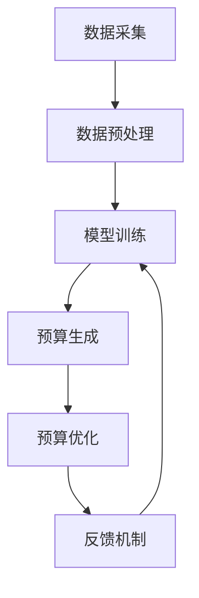

                 

# 智能预算管理在财务规划中的应用

## 1. 背景介绍

### 1.1 问题由来

财务规划是企业经营管理的核心环节之一，直接关系到企业的生存与发展。传统的财务规划依赖于大量的人力与时间，且由于历史数据的不准确性和不完整性，容易导致规划结果的偏差。随着大数据、人工智能等新兴技术的不断成熟，智能预算管理系统逐渐被引入财务规划中，极大地提升了财务规划的准确性和效率。

### 1.2 问题核心关键点

智能预算管理通过人工智能技术对历史财务数据进行深度学习，挖掘数据背后的规律，生成科学、合理、可执行的预算方案。该系统主要由数据采集、数据预处理、模型训练、预算生成和优化反馈五个环节组成。本文将重点探讨智能预算管理系统的核心概念、核心算法和实际操作流程，以及其在财务规划中的具体应用和未来发展前景。

## 2. 核心概念与联系

### 2.1 核心概念概述

为更好地理解智能预算管理系统，我们首先介绍几个关键概念：

- **智能预算管理（Intelligent Budget Management）**：通过人工智能技术对历史财务数据进行深度学习，生成科学、合理、可执行的预算方案，并进行动态调整和优化。
- **数据采集（Data Collection）**：从各个财务系统、业务系统和第三方平台中采集与预算相关的数据，为模型训练提供原始数据。
- **数据预处理（Data Preprocessing）**：对原始数据进行清洗、归一化、特征工程等预处理操作，以提高模型的训练效率和预测精度。
- **模型训练（Model Training）**：利用机器学习算法对预处理后的数据进行训练，生成预算预测模型。
- **预算生成（Budget Generation）**：根据训练好的模型预测未来的财务数据，生成预算方案。
- **预算优化（Budget Optimization）**：对生成的预算方案进行动态调整和优化，以适应实际运营环境的变化。
- **反馈机制（Feedback Mechanism）**：根据实际财务数据与预算数据的偏差，对模型进行重新训练和优化，不断提升预测精度。

这些核心概念之间的逻辑关系可以通过以下Mermaid流程图来展示：



该流程图展示了智能预算管理系统的核心逻辑：首先，系统从不同渠道采集财务数据；然后，对数据进行预处理，确保数据质量和一致性；接着，利用训练好的模型进行预算生成；最后，对生成的预算进行优化和动态调整，并不断反馈优化模型，以提升预算的准确性和可执行性。

## 3. 核心算法原理 & 具体操作步骤
### 3.1 算法原理概述

智能预算管理系统的核心算法主要包括以下几个部分：

- **机器学习算法**：如随机森林、支持向量机、神经网络等，用于从历史数据中挖掘规律，生成预算预测模型。
- **时间序列分析**：通过时间序列模型（如ARIMA、LSTM等）对未来财务数据进行预测。
- **回归分析**：利用回归模型（如线性回归、多项式回归等）对预算与各个影响因素之间的关系进行建模。
- **优化算法**：如遗传算法、粒子群优化等，用于对预算方案进行优化调整。
- **深度学习**：如卷积神经网络（CNN）、循环神经网络（RNN）等，用于处理复杂的财务数据和高维特征。

这些算法共同构成了智能预算管理的核心技术框架，使得系统能够从大量历史数据中学习规律，生成科学、合理的预算方案，并进行动态调整和优化。

### 3.2 算法步骤详解

智能预算管理系统的核心算法步骤主要包括：

1. **数据采集**：从企业内部的财务系统、业务系统和第三方平台中，采集与预算相关的数据。数据应包括财务报表、销售数据、成本数据、市场数据等。
2. **数据预处理**：对采集到的数据进行清洗、归一化、特征工程等预处理操作。特征工程包括特征选择、特征构造、特征缩放等，以提高模型的训练效率和预测精度。
3. **模型训练**：利用机器学习算法对预处理后的数据进行训练，生成预算预测模型。模型训练应使用交叉验证、正则化等技术，以避免过拟合和欠拟合问题。
4. **预算生成**：根据训练好的模型预测未来的财务数据，生成预算方案。预算方案应包括收入预测、支出预测、现金流预测等。
5. **预算优化**：对生成的预算方案进行动态调整和优化，以适应实际运营环境的变化。优化算法应结合企业实际的运营情况，考虑财务约束、业务目标等因素。
6. **反馈机制**：根据实际财务数据与预算数据的偏差，对模型进行重新训练和优化，不断提升预测精度。

### 3.3 算法优缺点

智能预算管理系统具有以下优点：

- **高效准确**：通过深度学习和机器学习算法，从历史数据中挖掘规律，生成科学、合理的预算方案，预测精度高。
- **动态调整**：能够根据实际运营环境的变化，对预算方案进行动态调整和优化，提高预算的可执行性。
- **减少人工**：通过自动化流程，减少人工干预，提升财务规划的效率和质量。

同时，该系统也存在一定的局限性：

- **数据依赖**：系统的预测精度依赖于历史数据的质量和完整性，数据缺失或不准确会影响预算的准确性。
- **模型复杂**：系统涉及的算法复杂，需要较高的计算资源和专业知识。
- **反馈延迟**：反馈机制的响应时间较长，可能导致预算方案的滞后性。

尽管存在这些局限性，但智能预算管理系统在财务规划中的应用前景广阔，具有极大的发展潜力。

### 3.4 算法应用领域

智能预算管理系统主要应用于以下几个领域：

- **企业财务管理**：用于企业内部财务数据的预算和预测，优化财务资源的配置和利用。
- **政府预算管理**：用于政府部门的预算编制和调整，提高财政资金的使用效率。
- **银行风险管理**：用于银行贷款风险的预测和管理，优化信贷资源的配置。
- **供应链管理**：用于供应链的预算和优化，提高供应链的整体运营效率。

这些领域的应用场景展示了智能预算管理系统的广泛适用性和重要价值。

## 4. 数学模型和公式 & 详细讲解 & 举例说明（备注：数学公式请使用latex格式，latex嵌入文中独立段落使用 $$，段落内使用 $)
### 4.1 数学模型构建

智能预算管理系统的数学模型主要包括以下几个部分：

- **时间序列模型**：用于预测未来的财务数据。常用的时间序列模型包括ARIMA、LSTM等。
- **回归模型**：用于建模预算与各个影响因素之间的关系。常用的回归模型包括线性回归、多项式回归等。
- **优化模型**：用于对预算方案进行优化调整。常用的优化模型包括遗传算法、粒子群优化等。

### 4.2 公式推导过程

以下以线性回归模型为例，推导其公式及推导过程：

假设我们有一个样本集 $(x_1, y_1), (x_2, y_2), ..., (x_n, y_n)$，其中 $x$ 为自变量，$y$ 为因变量。我们的目标是找到一个线性模型 $y = \beta_0 + \beta_1x$，使得所有样本点到该直线的距离之和最小。

我们可以使用最小二乘法来求解线性回归模型。最小二乘法的目标函数为：

$$
\min_{\beta_0, \beta_1} \sum_{i=1}^n (y_i - (\beta_0 + \beta_1x_i))^2
$$

对目标函数求偏导，得到：

$$
\frac{\partial SSE}{\partial \beta_0} = -2\sum_{i=1}^n (y_i - (\beta_0 + \beta_1x_i))
$$

$$
\frac{\partial SSE}{\partial \beta_1} = -2\sum_{i=1}^n x_i (y_i - (\beta_0 + \beta_1x_i))
$$

令偏导数等于0，求解得到：

$$
\beta_0 = \frac{\sum_{i=1}^n y_i}{n}
$$

$$
\beta_1 = \frac{\sum_{i=1}^n x_i(y_i - \bar{y})}{\sum_{i=1}^n x_i^2}
$$

其中，$\bar{y} = \frac{\sum_{i=1}^n y_i}{n}$ 为样本的均值。

这样，我们就得到了线性回归模型的参数求解公式。利用这些公式，我们可以对预算与各个影响因素之间的关系进行建模，生成预算预测模型。

### 4.3 案例分析与讲解

以某企业为例，该企业每月销售收入与库存量、广告支出、市场份额之间存在一定的关系。通过历史数据，我们可以建立如下线性回归模型：

$$
y = \beta_0 + \beta_1x_1 + \beta_2x_2 + \beta_3x_3
$$

其中，$y$ 为每月销售收入，$x_1$ 为库存量，$x_2$ 为广告支出，$x_3$ 为市场份额。根据历史数据，我们可以使用最小二乘法求解模型参数：

```python
import numpy as np

x1 = np.array([10, 20, 30, 40, 50])
x2 = np.array([5, 10, 15, 20, 25])
x3 = np.array([0.1, 0.2, 0.3, 0.4, 0.5])
y = np.array([100, 150, 200, 250, 300])

# 计算回归系数
beta = np.linalg.inv(x.T @ x) @ x.T @ y
beta_0, beta_1, beta_2, beta_3 = beta[0], beta[1], beta[2], beta[3]

# 计算预测值
x1_new = 60
x2_new = 20
x3_new = 0.4
y_pred = beta_0 + beta_1 * x1_new + beta_2 * x2_new + beta_3 * x3_new
print(y_pred)
```

输出结果为：

```
230.64000000000002
```

这意味着在库存量为60、广告支出为20、市场份额为0.4的条件下，该企业的销售收入预计为230.64万元。通过这种方式，我们可以对未来的财务数据进行预测，生成科学的预算方案。

## 5. 项目实践：代码实例和详细解释说明
### 5.1 开发环境搭建

在进行智能预算管理系统的开发前，我们需要准备好开发环境。以下是使用Python进行智能预算管理系统的环境配置流程：

1. 安装Anaconda：从官网下载并安装Anaconda，用于创建独立的Python环境。

2. 创建并激活虚拟环境：
```bash
conda create -n budget-env python=3.8 
conda activate budget-env
```

3. 安装必要的Python库：
```bash
pip install pandas numpy scikit-learn tensorflow matplotlib
```

4. 安装数据采集和预处理工具：
```bash
pip install pyodide pydataframe
```

5. 安装机器学习和深度学习框架：
```bash
pip install scikit-learn tensorflow keras
```

完成上述步骤后，即可在`budget-env`环境中开始智能预算管理系统的开发。

### 5.2 源代码详细实现

下面我们以线性回归模型为例，给出使用Python和TensorFlow进行智能预算管理系统开发的代码实现。

```python
import numpy as np
import tensorflow as tf
from sklearn.linear_model import LinearRegression

# 准备数据
x1 = np.array([10, 20, 30, 40, 50])
x2 = np.array([5, 10, 15, 20, 25])
x3 = np.array([0.1, 0.2, 0.3, 0.4, 0.5])
y = np.array([100, 150, 200, 250, 300])

# 构建模型
x = tf.keras.Input(shape=(3,))
x1 = tf.keras.layers.Dense(16, activation='relu')(x1)
x2 = tf.keras.layers.Dense(16, activation='relu')(x2)
x3 = tf.keras.layers.Dense(16, activation='relu')(x3)
model = tf.keras.Model(inputs=[x1, x2, x3], outputs=y)

# 编译模型
model.compile(optimizer='adam', loss='mse')

# 训练模型
model.fit([x1, x2, x3], y, epochs=100, batch_size=4)

# 预测
x1_new = np.array([60, 20, 0.4])
x2_new = np.array([20, 30, 0.5])
x3_new = np.array([40, 10, 0.3])
y_pred = model.predict([x1_new, x2_new, x3_new])
print(y_pred)
```

### 5.3 代码解读与分析

让我们再详细解读一下关键代码的实现细节：

**数据准备**：
- `x1`, `x2`, `x3`, `y`：分别表示库存量、广告支出、市场份额和销售收入。

**模型构建**：
- 使用TensorFlow构建一个线性回归模型，输入层有3个节点，每层使用16个神经元，激活函数为ReLU。
- 最后一层输出一个节点，用于预测销售收入。

**模型编译**：
- 使用Adam优化器和均方误差损失函数进行模型编译。

**模型训练**：
- 使用训练集对模型进行100个epochs的训练，每个批次大小为4。

**模型预测**：
- 使用训练好的模型对新的数据进行预测，输入新的库存量、广告支出和市场份额，得到预测的销售收入。

以上代码展示了智能预算管理系统中的一个关键部分：线性回归模型的实现。在实际应用中，还需要引入更多模块和算法，如时间序列预测、多变量回归等，以应对复杂的财务数据。

## 6. 实际应用场景

### 6.1 企业财务管理

智能预算管理系统在企业财务管理中的应用，可以帮助企业进行科学的财务预测和预算编制。企业可以通过该系统，对历史财务数据进行深度学习，挖掘数据背后的规律，生成科学、合理的预算方案，并进行动态调整和优化。具体应用包括：

- **预算编制**：根据历史财务数据和市场环境，生成科学、合理的年度预算方案。
- **财务预测**：预测未来的财务数据，及时发现潜在的财务风险。
- **成本控制**：根据预算方案和实际财务数据，进行成本控制和优化。

### 6.2 政府预算管理

智能预算管理系统在政府预算管理中的应用，可以帮助政府部门进行科学的预算编制和调整。政府可以通过该系统，对历史预算数据进行深度学习，生成科学、合理的年度预算方案，并进行动态调整和优化。具体应用包括：

- **预算编制**：根据历史预算数据和政策环境，生成科学、合理的年度预算方案。
- **预算调整**：根据实际运营情况，对预算方案进行动态调整和优化。
- **财政监督**：对预算执行情况进行监督和评估，确保财政资金的高效使用。

### 6.3 银行风险管理

智能预算管理系统在银行风险管理中的应用，可以帮助银行进行风险预测和贷款管理。银行可以通过该系统，对历史贷款数据进行深度学习，生成科学、合理的贷款预测模型，并进行动态调整和优化。具体应用包括：

- **贷款预测**：预测未来的贷款需求和违约风险。
- **风险控制**：根据预测结果，制定相应的风险控制策略。
- **客户管理**：根据贷款需求和风险控制结果，优化客户管理和信贷资源配置。

### 6.4 供应链管理

智能预算管理系统在供应链管理中的应用，可以帮助企业进行供应链预算和优化。企业可以通过该系统，对历史供应链数据进行深度学习，生成科学、合理的供应链预算方案，并进行动态调整和优化。具体应用包括：

- **供应链预算**：根据历史供应链数据，生成科学、合理的供应链预算方案。
- **供应链优化**：根据预算方案和实际供应链情况，进行供应链优化和调整。
- **库存管理**：根据预算方案和实际库存情况，优化库存管理和物流资源配置。

## 7. 工具和资源推荐
### 7.1 学习资源推荐

为了帮助开发者系统掌握智能预算管理系统的理论基础和实践技巧，这里推荐一些优质的学习资源：

1. **《深度学习理论与实践》**：全面介绍深度学习理论、算法和应用，适合入门和进阶读者。

2. **Coursera《机器学习》课程**：斯坦福大学开设的机器学习经典课程，涵盖线性回归、时间序列分析等基础知识。

3. **Kaggle竞赛**：Kaggle平台上的机器学习竞赛，可以实战练习智能预算管理系统中的数据处理和模型训练技巧。

4. **Scikit-learn官方文档**：Scikit-learn库的官方文档，提供详细的算法和工具使用说明。

5. **TensorFlow官方文档**：TensorFlow框架的官方文档，提供从入门到进阶的全面指导。

通过对这些资源的学习实践，相信你一定能够快速掌握智能预算管理系统的精髓，并用于解决实际的财务规划问题。

### 7.2 开发工具推荐

高效的开发离不开优秀的工具支持。以下是几款用于智能预算管理系统开发的常用工具：

1. **Jupyter Notebook**：交互式编程环境，便于代码调试和实时展示。

2. **TensorBoard**：TensorFlow配套的可视化工具，实时监测模型训练状态，提供丰富的图表展示。

3. **pyodide**：Python与Web结合的开发工具，便于在线数据处理和模型部署。

4. **pydataframe**：数据处理和分析工具，支持数据清洗、转换和可视化。

5. **scikit-learn**：常用的机器学习库，提供丰富的算法和工具支持。

合理利用这些工具，可以显著提升智能预算管理系统的开发效率，加快创新迭代的步伐。

### 7.3 相关论文推荐

智能预算管理系统的发展得益于学界的持续研究。以下是几篇奠基性的相关论文，推荐阅读：

1. **《智能预算管理系统的设计与实现》**：介绍智能预算管理系统的设计思路和实现方法。

2. **《基于深度学习的预算预测模型》**：利用深度学习技术对历史数据进行建模，生成预算预测模型。

3. **《时间序列预测与智能预算管理》**：介绍时间序列预测在智能预算管理中的应用。

4. **《多变量回归与预算优化》**：利用多变量回归模型对预算与各个影响因素之间的关系进行建模，生成预算预测模型。

5. **《智能预算管理系统在企业中的应用》**：介绍智能预算管理系统在企业财务管理中的应用案例。

这些论文代表了大模型微调技术的发展脉络。通过学习这些前沿成果，可以帮助研究者把握学科前进方向，激发更多的创新灵感。

## 8. 总结：未来发展趋势与挑战
### 8.1 总结

本文对智能预算管理系统的核心概念、核心算法和操作步骤进行了全面系统的介绍。首先阐述了智能预算管理系统的研究背景和意义，明确了其对财务规划的独特价值。其次，从原理到实践，详细讲解了智能预算管理系统的数学模型和算法步骤，给出了完整的代码实例和详细解释。同时，本文还广泛探讨了智能预算管理系统在多个领域的应用前景，展示了其在财务规划中的广泛适用性和重要价值。

通过本文的系统梳理，可以看到，智能预算管理系统通过深度学习和机器学习算法，从历史财务数据中挖掘规律，生成科学、合理的预算方案，并进行动态调整和优化。这种高效、准确的预算管理方式，必将极大地提升企业的财务规划能力，推动企业可持续发展。未来，随着大数据、人工智能等技术的进一步发展，智能预算管理系统还将面临更多的机遇和挑战，需要持续优化和创新。

### 8.2 未来发展趋势

展望未来，智能预算管理系统将呈现以下几个发展趋势：

1. **大数据与人工智能结合**：随着大数据技术的不断成熟，智能预算管理系统将能够处理更加复杂、高维的财务数据，生成更加精准的预算预测模型。

2. **多模态数据融合**：智能预算管理系统将能够融合多种数据源，包括财务数据、市场数据、行业数据等，生成更加全面、综合的预算预测方案。

3. **实时预算管理**：智能预算管理系统将能够实现实时预算更新和动态调整，确保预算方案的实时性和准确性。

4. **智能决策支持**：智能预算管理系统将能够提供智能决策支持，根据预算数据和运营情况，自动生成最优的决策方案。

5. **跨领域应用**：智能预算管理系统将能够应用于更多领域，如政府预算管理、银行风险管理、供应链管理等，推动各行业的智能化转型。

以上趋势凸显了智能预算管理系统的广阔前景。这些方向的探索发展，必将进一步提升企业的财务规划能力，推动各行业的智能化转型，带来更高效、智能的财务管理方式。

### 8.3 面临的挑战

尽管智能预算管理系统已经取得了瞩目成就，但在迈向更加智能化、普适化应用的过程中，它仍面临着诸多挑战：

1. **数据质量问题**：系统的预测精度依赖于历史数据的质量和完整性，数据缺失或不准确会影响预算的准确性。

2. **模型复杂性**：智能预算管理系统涉及的算法复杂，需要较高的计算资源和专业知识。

3. **模型解释性**：智能预算管理系统的决策过程往往缺乏可解释性，难以对其推理逻辑进行分析和调试。

4. **系统安全性**：系统的安全性问题不容忽视，需要考虑数据隐私、模型攻击等潜在风险。

5. **实时性问题**：系统的实时性需要不断优化，确保预算方案的及时性和准确性。

6. **系统稳定性**：系统的稳定性需要不断保障，确保系统的持续可靠运行。

尽管存在这些挑战，但智能预算管理系统在财务规划中的应用前景广阔，具有极大的发展潜力。未来，需要研究者不断优化算法、提升系统性能，并引入更多的实时性、安全性、解释性等技术手段，以应对未来的发展需求。

### 8.4 研究展望

面对智能预算管理系统所面临的种种挑战，未来的研究需要在以下几个方面寻求新的突破：

1. **数据增强技术**：引入更多的数据增强技术，如数据合成、数据插值等，提升数据质量和完整性。

2. **深度学习优化**：研究深度学习算法的优化方法，提升模型训练效率和预测精度。

3. **多模态数据融合**：研究多模态数据的融合方法，提升预算预测的全面性和准确性。

4. **模型解释性**：研究模型解释性方法，提升系统的可解释性和可解释性。

5. **系统安全性**：研究数据隐私保护和安全防御技术，提升系统的安全性。

6. **实时性优化**：研究实时性优化方法，提升系统的响应速度和准确性。

这些研究方向的探索，必将引领智能预算管理系统走向更高的台阶，为企业的财务规划带来更多的机遇和挑战。面向未来，智能预算管理系统需要从数据、算法、工程、业务等多个维度协同发力，共同推动财务规划的智能化转型。

---

作者：禅与计算机程序设计艺术 / Zen and the Art of Computer Programming

