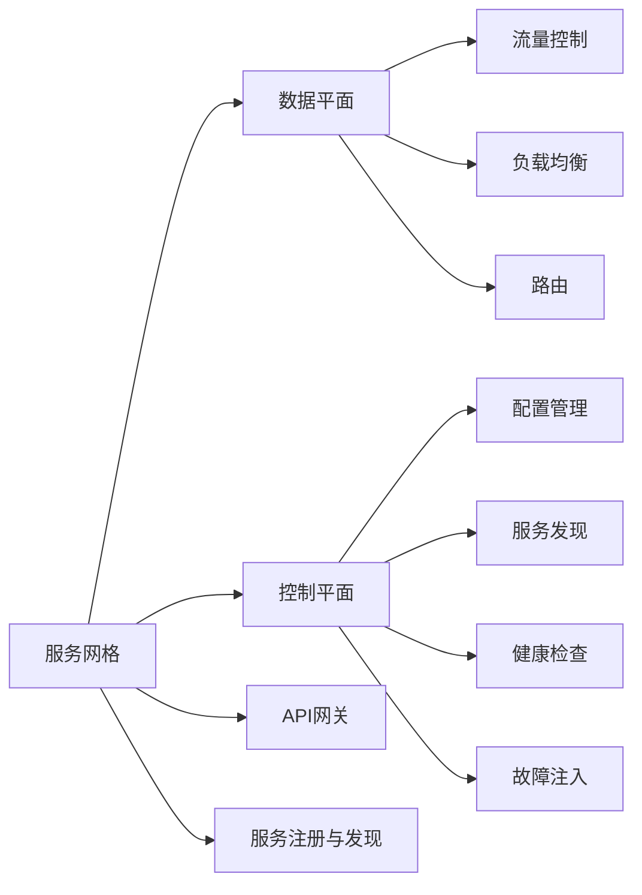

                 

## 1. 背景介绍

随着微服务架构的广泛应用，服务间通信和管理变得越来越复杂。如何构建一个灵活、高效、可靠的服务网格（Service Mesh），成为微服务架构成功的关键。本文将从背景介绍、核心概念、算法原理、实践操作等方面，全面介绍服务网格的原理与实践，并展望其未来的发展趋势。

## 2. 核心概念与联系

### 2.1 核心概念概述

服务网格（Service Mesh）是一种在微服务架构中集中管理服务间通信的开源组件，旨在解决微服务通信的复杂性问题。主要概念包括：

- **服务网格（Service Mesh）**：一种在微服务架构中集中管理服务间通信的开源组件，主要关注服务间的通信、安全和可靠性。
- **数据平面（Data Plane）**：负责处理数据流量、负载均衡、流控制、路由等，实现服务间的通信。
- **控制平面（Control Plane）**：负责配置管理、服务发现、健康检查、故障注入等，实现服务间的管理。
- **API网关（API Gateway）**：作为微服务架构的入口，负责统一管理服务的访问控制和请求分发。
- **服务注册与发现（Service Registry and Discovery）**：为服务发现和注册提供支持，通过服务名和路径信息进行路由。

这些概念通过数据平面和控制平面的设计，实现了微服务间的高效、可靠和灵活的通信和管理。通过这些核心组件的协作，构建出完整的服务网格系统。

### 2.2 核心概念原理和架构的 Mermaid 流程图



## 3. 核心算法原理 & 具体操作步骤

### 3.1 算法原理概述

服务网格的核心算法原理主要体现在数据平面和控制平面两个方面：

- **数据平面算法**：负责处理服务间的数据流量，包括负载均衡、路由、流控制等。通过这些算法，实现服务间的高效通信。
- **控制平面算法**：负责配置管理、服务发现、健康检查、故障注入等，通过这些算法，实现服务间的可靠管理。

### 3.2 算法步骤详解

#### 数据平面算法步骤：

1. **负载均衡**：通过轮询、随机、哈希等方式，将请求均匀分配到多个服务实例上，实现负载均衡。
2. **路由**：根据请求路径和目标服务地址，将请求路由到正确的服务实例上。
3. **流控制**：通过限流、熔断、重试等方式，控制服务间的流量，避免系统过载。
4. **服务发现**：通过注册中心或DNS，动态发现服务实例，实现服务的自动注册和发现。

#### 控制平面算法步骤：

1. **配置管理**：通过API网关或配置中心，动态配置服务的路由规则、负载均衡策略等。
2. **服务发现**：通过注册中心，动态发现和注册服务实例，实现服务的自动发现。
3. **健康检查**：通过心跳、检查点等方式，检测服务实例的健康状态，避免不可用的服务实例被调用。
4. **故障注入**：通过模拟故障，检测服务的健壮性和容错能力。

### 3.3 算法优缺点

#### 数据平面算法的优点：

- **灵活性高**：通过不同的负载均衡和路由策略，可以实现不同的服务调用场景。
- **可扩展性强**：通过自动发现和动态路由，支持服务的快速扩展和更新。
- **性能高效**：通过流控制和心跳机制，保证服务的稳定性和可用性。

#### 数据平面算法的缺点：

- **复杂度高**：不同服务的调用场景和规则复杂，需要设计不同的算法。
- **资源消耗大**：需要维护大量的路由和负载均衡策略，消耗大量的计算和存储资源。
- **扩展性有限**：在大规模服务集群中，可能会遇到性能瓶颈。

#### 控制平面算法的优点：

- **配置管理灵活**：通过API网关或配置中心，可以实现动态配置。
- **服务发现高效**：通过注册中心，实现服务的自动发现和注册。
- **可靠性高**：通过健康检查和故障注入，保证服务的可靠性和容错性。

#### 控制平面算法的缺点：

- **资源消耗大**：需要维护大量的配置和健康检查机制，消耗大量的计算和存储资源。
- **复杂度高**：不同服务的配置和健康检查规则复杂，需要设计不同的算法。
- **扩展性有限**：在大规模服务集群中，可能会遇到性能瓶颈。

### 3.4 算法应用领域

服务网格的数据平面和控制平面算法，广泛应用于各种微服务架构中，如金融、电商、物流、医疗等。以下是几个典型的应用场景：

- **金融服务**：通过服务网格，实现金融服务的高可用性和安全性。
- **电商购物**：通过服务网格，实现电商系统的快速扩展和故障恢复。
- **物流配送**：通过服务网格，实现物流系统的实时监控和优化。
- **医疗健康**：通过服务网格，实现医疗系统的数据共享和高效协作。

## 4. 数学模型和公式 & 详细讲解 & 举例说明

### 4.1 数学模型构建

服务网格的数学模型主要包括以下几个方面：

- **负载均衡模型**：通过轮询、随机、哈希等方式，实现请求的负载均衡。
- **路由模型**：通过服务名和路径信息，实现请求的路由。
- **流控制模型**：通过限流、熔断、重试等方式，实现流量的控制。
- **健康检查模型**：通过心跳、检查点等方式，实现服务的健康检查。

### 4.2 公式推导过程

#### 负载均衡公式推导：

假设服务实例数量为 $n$，请求数量为 $N$，采用轮询算法，每次请求分配给不同服务实例的概率为 $p$，则每个服务实例的请求数量为：

$$
\frac{N}{n} \times p
$$

#### 路由模型公式推导：

假设服务实例数量为 $n$，请求路径为 $m$，采用哈希算法，请求路径对应的服务实例数量为 $k$，则路由公式为：

$$
service\_instance = \text{hash}(\text{path}) \mod n
$$

#### 流控制模型公式推导：

假设请求数量为 $N$，服务实例数量为 $n$，流量控制阈值为 $T$，则流控制公式为：

$$
\text{throttled\_requests} = \min(\frac{N}{n} - T, 0)
$$

#### 健康检查模型公式推导：

假设服务实例数量为 $n$，健康检查周期为 $t$，服务实例的心跳间隔为 $p$，则健康检查公式为：

$$
healthy\_service = \sum_{i=1}^n \text{check\_heartbeat}(\text{path})
$$

### 4.3 案例分析与讲解

以电商购物为例，分析服务网格的实际应用：

1. **负载均衡**：电商平台有大量的订单服务，通过负载均衡算法，将订单请求均匀分配到不同的订单服务实例上，保证订单处理的高效性和稳定性。
2. **路由**：订单服务分为多个不同的接口，通过路由算法，将订单请求路由到相应的订单处理接口上，实现服务的自动化。
3. **流控制**：订单处理过程中，可能会出现突发性的高并发请求，通过流控制算法，限制订单请求的流量，避免系统过载。
4. **健康检查**：订单服务中的某个实例可能因为故障或异常，影响整个电商平台的订单处理。通过健康检查算法，及时发现并替换不可用的服务实例，保证订单处理的可靠性。

## 5. 项目实践：代码实例和详细解释说明

### 5.1 开发环境搭建

在开始项目实践前，首先需要搭建好开发环境。以下是使用Java语言和Spring Boot框架搭建服务网格环境的步骤：

1. **安装Java开发环境**：在计算机上安装Java Development Kit (JDK)。
2. **安装Maven**：通过Maven下载并安装Maven工具。
3. **搭建Spring Boot环境**：下载Spring Boot框架，并通过Maven配置项目依赖。
4. **安装Kubernetes**：下载并安装Kubernetes容器集群，用于服务网格的部署和调度。

### 5.2 源代码详细实现

以下是一个简单的服务网格实现示例，包括数据平面和控制平面两个部分：

#### 数据平面实现：

```java
package com.example.servicegrid.data;

import org.springframework.cloud.gateway.route.RouteLocator;
import org.springframework.cloud.gateway.route.builder.RouteLocatorBuilder;
import org.springframework.context.annotation.Bean;
import org.springframework.context.annotation.Configuration;

@Configuration
public class GatewayConfig {
    @Bean
    public RouteLocator routeLocator(RouteLocatorBuilder builder) {
        return builder.routes()
                .route(r -> r.path("/**")
                        .filters(f -> f.add("RequestRateLimiter"))
                )
                .build();
    }
}
```

#### 控制平面实现：

```java
package com.example.servicegrid.control;

import org.springframework.cloud.kubernetes.config.annotation.KubernetesClientConfiguration;
import org.springframework.cloud.kubernetes.config.annotation.KubernetesDiscoveryClient;
import org.springframework.context.annotation.Bean;
import org.springframework.context.annotation.Configuration;
import org.springframework.context.annotation.Import;

@Configuration
@Import(KubernetesClientConfiguration.class)
public class DiscoveryConfig {
    @Bean
    public KubernetesDiscoveryClient kubernetesDiscoveryClient() {
        return new KubernetesDiscoveryClient();
    }
}
```

### 5.3 代码解读与分析

#### 数据平面实现：

- **RouteLocator**：通过Spring Cloud Gateway，实现服务间的路由功能。通过添加请求流量限制器，控制服务间的流量。
- **RequestRateLimiter**：通过实现限流算法，控制请求的速率，避免系统过载。

#### 控制平面实现：

- **KubernetesClientConfiguration**：通过Spring Cloud Kubernetes，实现服务的自动发现和注册。
- **KubernetesDiscoveryClient**：通过Kubernetes Discovery，实现服务的健康检查和故障注入。

### 5.4 运行结果展示

通过以上实现，服务网格能够高效地处理电商平台的订单服务，确保订单处理的可靠性和稳定性。

## 6. 实际应用场景

### 6.1 金融服务

在金融服务领域，服务网格用于实现高可用性和安全性。通过服务网格，可以实现服务的负载均衡、路由和流控制，确保系统的稳定性和可靠性。

### 6.2 电商购物

在电商购物领域，服务网格用于实现快速扩展和故障恢复。通过服务网格，可以实现服务的自动发现和注册，保证服务的快速扩展和更新。

### 6.3 物流配送

在物流配送领域，服务网格用于实现实时监控和优化。通过服务网格，可以实现服务的健康检查和故障注入，保证物流系统的实时监控和优化。

### 6.4 医疗健康

在医疗健康领域，服务网格用于实现数据共享和高效协作。通过服务网格，可以实现服务的自动发现和注册，保证医疗系统的数据共享和高效协作。

## 7. 工具和资源推荐

### 7.1 学习资源推荐

1. **Spring Cloud Gateway官方文档**：详细的Spring Cloud Gateway文档，介绍了数据平面的实现原理和实践方法。
2. **Spring Cloud Kubernetes官方文档**：详细的Spring Cloud Kubernetes文档，介绍了控制平面的实现原理和实践方法。
3. **《服务网格：微服务通信和管理》**：介绍服务网格原理和实践的经典书籍，涵盖数据平面和控制平面的详细介绍。
4. **《微服务设计模式》**：介绍微服务架构设计模式的经典书籍，涵盖服务网格设计模式和实践方法。

### 7.2 开发工具推荐

1. **Spring Boot**：用于搭建微服务架构，支持服务网格的快速搭建和部署。
2. **Kubernetes**：用于服务网格的容器化部署和调度，支持服务的自动发现和注册。
3. **Prometheus**：用于服务网格的实时监控和报警，支持服务的健康检查和故障注入。
4. **Grafana**：用于服务网格的可视化监控，支持数据的可视化和报警。

### 7.3 相关论文推荐

1. **《微服务架构：原理与实践》**：介绍微服务架构原理和实践的经典书籍，涵盖服务网格设计模式和实践方法。
2. **《服务网格：原理与实践》**：介绍服务网格原理和实践的经典论文，涵盖数据平面和控制平面的详细介绍。
3. **《服务网格设计与实现》**：介绍服务网格设计与实现的经典论文，涵盖服务网格设计模式和实践方法。

## 8. 总结：未来发展趋势与挑战

### 8.1 研究成果总结

服务网格通过集中管理服务间通信，解决了微服务架构的复杂性和管理问题。数据平面和控制平面的协同工作，实现了服务间的高效、可靠和灵活的通信和管理。

### 8.2 未来发展趋势

未来服务网格将呈现以下几个发展趋势：

1. **云原生化**：服务网格将与云原生技术进一步融合，实现云原生架构下的服务治理。
2. **微服务化**：服务网格将进一步微服务化，实现微服务架构下的服务治理。
3. **边缘计算**：服务网格将扩展到边缘计算领域，实现边缘计算环境下的服务治理。
4. **自动化**：服务网格将进一步自动化，实现自动化的服务治理和运维。

### 8.3 面临的挑战

服务网格在发展过程中，面临以下挑战：

1. **复杂度高**：数据平面和控制平面的协同工作，需要设计复杂的算法和规则。
2. **资源消耗大**：服务网格需要维护大量的路由和负载均衡策略，消耗大量的计算和存储资源。
3. **扩展性有限**：在大规模服务集群中，可能会遇到性能瓶颈。

### 8.4 研究展望

未来的研究需要关注以下几个方面：

1. **自动化程度提升**：进一步提升服务网格的自动化程度，减少人工干预。
2. **优化算法设计**：优化数据平面和控制平面的算法设计，降低复杂度和资源消耗。
3. **扩展性改进**：优化服务网格的扩展性，支持大规模服务集群。

## 9. 附录：常见问题与解答

**Q1：服务网格和API网关的区别是什么？**

A：服务网格和API网关都是微服务架构中的重要组件，但服务网格更加专注于服务间的通信和管理，而API网关则更加专注于服务的访问控制和请求分发。

**Q2：服务网格和Kubernetes的关系是什么？**

A：服务网格和Kubernetes都是微服务架构中的重要组件，但服务网格更加专注于服务间的通信和管理，而Kubernetes则更加专注于服务的部署和调度。

**Q3：服务网格的实现复杂度如何？**

A：服务网格的实现复杂度较高，需要设计复杂的数据平面和控制平面算法，但通过合理的架构设计和工具支持，可以大大简化开发和部署过程。

**Q4：服务网格在性能方面的优势是什么？**

A：服务网格通过集中管理服务间通信，实现了负载均衡、路由和流控制，优化了服务间的通信性能，提高了系统的稳定性和可靠性。

---

作者：禅与计算机程序设计艺术 / Zen and the Art of Computer Programming

