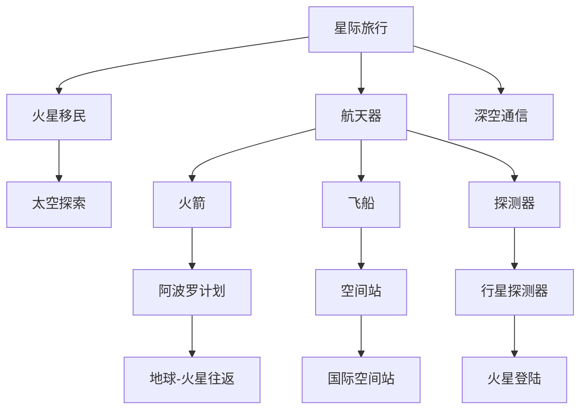

                 

# 未来的太空探索：2050年的火星移民与星际旅行

## 1. 背景介绍

随着人类对宇宙的好奇心和对地球环境恶化的担忧，太空探索成为21世纪人类共同的目标。自上世纪60年代阿波罗计划登月以来，人类对太空的探索从未停歇。然而，将人类送上火星并建立可持续的火星殖民地，将成为21世纪最大的科技挑战之一。本文将从技术、伦理、经济等角度，探讨2050年火星移民与星际旅行的可能性和未来发展方向。

## 2. 核心概念与联系

### 2.1 核心概念概述

为了更好地理解火星移民与星际旅行的技术背景，本节将介绍几个密切相关的核心概念：

- **星际旅行(Interstellar Travel)**：指在太阳系范围之外进行的人类航天活动。主要包含前往其他星系、小行星、彗星等天体的旅行。
- **火星移民(Mars Colonization)**：指将人类长期居住在火星表面，建立自给自足的火星社区。这一过程包括火星登陆、居住环境建设、资源利用、生命支持等环节。
- **太空探索(Technological Exploration)**：指利用航天器和其他技术手段，对宇宙进行探测、研究的活动。主要技术包括航天器设计、推进技术、生命保障系统、机器人技术等。
- **航天器(Navigational Vehicle)**：用于执行太空任务的各类飞行器，包括火箭、飞船、探测器等。
- **深空通信(Deep Space Communication)**：指地球与深空航天器之间的通信。由于信号延迟，需要高效、可靠、安全的通信系统。

这些核心概念之间的逻辑关系可以通过以下Mermaid流程图来展示：



这个流程图展示了一系列概念及其之间的关系：

1. 星际旅行是整个太空探索的终极目标，包含前往其他星系、小行星、彗星的旅行。
2. 火星移民是星际旅行的重要阶段，是人类在火星建立自给自足社区的具体行动。
3. 太空探索为星际旅行提供了技术支撑，包含各类航天器设计和深空通信系统。
4. 航天器是太空探索的基本工具，包括火箭、飞船、探测器等。
5. 阿波罗计划、空间站、行星探测器等都是实现火星移民的具体技术手段。

## 3. 核心算法原理 & 具体操作步骤

### 3.1 算法原理概述

火星移民与星际旅行涉及诸多复杂的技术问题，包括航天器设计、推进系统、深空通信、生命保障系统等。这些技术的实现依赖于先进的算法和模型，涉及动力学、控制理论、通信协议、材料科学等多个学科。

例如，星际旅行中的推进系统，通常采用核推进、化学推进等技术。核推进利用核聚变、核裂变等能量源，具有高推力、高效率的特点，但技术难度大。化学推进依赖于化学反应，较为成熟，但推力较低。推进系统的设计和优化需要应用数值仿真和优化算法，如动态编程、蒙特卡洛模拟等。

在生命保障系统方面，火星移民需要提供水、氧气、食物等资源。这些资源的获取和循环利用需要高效的能源系统、废物处理系统、食物循环系统等。其中，能源系统的设计和优化，需要应用热力学、材料科学、电化学等理论。

### 3.2 算法步骤详解

以下是火星移民与星际旅行中的几个关键算法步骤：

**Step 1: 航天器设计与制造**

航天器的设计与制造需要考虑重量、推力、稳定性、可靠性等多个因素。主要设计过程包括：

- 需求分析：确定航天器功能、性能指标、使用要求等。
- 设计方案：选择合理的推进系统、控制系统、通信系统等。
- 材料选择：选择高强度、耐高温、耐腐蚀的材料。
- 制造工艺：应用精密加工、焊接、组装等工艺制造航天器。

**Step 2: 推进系统设计与优化**

推进系统是航天器的重要组成部分，直接影响到星际旅行的速度和效率。主要设计过程包括：

- 能量源选择：选择适合的核聚变、核裂变、化学推进等能源系统。
- 推力计算：计算不同能源系统的推力和效率。
- 控制算法：设计推力控制、姿态控制等算法。
- 系统优化：通过数值仿真和优化算法，优化推进系统设计。

**Step 3: 深空通信系统设计与优化**

深空通信是保证火星移民和星际旅行顺利进行的重要环节。主要设计过程包括：

- 信号设计：确定信号类型、调制方式、频率等。
- 通信系统：设计地面和航天器之间的通信系统，包括天线、接收器等。
- 信号处理：设计信号降噪、纠错、压缩等算法。
- 系统优化：通过仿真测试，优化通信系统性能。

**Step 4: 生命保障系统设计与优化**

火星移民需要高效、可靠的资源循环利用系统，主要设计过程包括：

- 能源系统：设计太阳能电池板、核反应堆等能源获取系统。
- 水循环系统：设计水处理、再生、净化等系统。
- 氧气循环系统：设计植物培养、氧气生产等系统。
- 废物处理系统：设计废物分类、回收、处理等系统。

**Step 5: 火星登陆与环境建设**

火星登陆和环境建设是火星移民的关键环节，主要设计过程包括：

- 火星着陆器设计：设计火星着陆器，保证着陆稳定、准确。
- 火星基地建设：设计火星基地结构、生命保障系统、通信系统等。
- 资源采集与利用：设计火星资源采集、加工、利用系统。

### 3.3 算法优缺点

火星移民与星际旅行的主要算法和模型具有以下优缺点：

**优点：**
1. 推动科技进步：推动航天技术、能源技术、生命保障技术等领域的快速发展。
2. 拓展人类生存空间：提供新的生存环境，减少地球资源消耗，缓解环境压力。
3. 促进科学研究：为科学探索、天体观测等提供新的平台。

**缺点：**
1. 高昂成本：推进系统、深空通信、生命保障等系统的开发和维护成本高。
2. 技术难度大：涉及到诸多复杂学科，技术难度大、风险高。
3. 伦理问题：涉及太空资源开发、生命伦理等伦理问题，引发社会争议。

### 3.4 算法应用领域

火星移民与星际旅行的主要算法和模型，应用领域广泛，涉及以下几个方面：

- **航天器设计与制造**：广泛应用于各类航天器设计、制造、测试等环节。
- **推进系统设计与优化**：应用于深空探测、星际旅行、军事航天等。
- **深空通信系统设计与优化**：应用于卫星通信、星际通信、航天器控制等。
- **生命保障系统设计与优化**：应用于火星移民、空间站、航天员长期生存等。

## 4. 数学模型和公式 & 详细讲解  
### 4.1 数学模型构建

本节将使用数学语言对火星移民与星际旅行的主要算法和模型进行更加严格的刻画。

设火星移民航段为 $L$，速度为 $v$，推力为 $F$，生命保障系统效率为 $E$，则火星移民的能量需求 $E_{\text{total}}$ 可以表示为：

$$
E_{\text{total}} = \frac{L}{v}F
$$

其中，$L$ 为火星移民航段长度，$v$ 为航段速度，$F$ 为推力。

### 4.2 公式推导过程

以下我们以核聚变推进系统为例，推导推进系统的推力计算公式。

核聚变反应的能量释放 $E$ 可以表示为：

$$
E = m_{\text{fuel}}c^2
$$

其中，$m_{\text{fuel}}$ 为燃料质量，$c$ 为光速。

核聚变推力 $F$ 可以表示为：

$$
F = \frac{E}{\Delta t}
$$

其中，$\Delta t$ 为反应时间。

根据以上公式，可以得出核聚变推力的计算公式：

$$
F = \frac{m_{\text{fuel}}c^2}{\Delta t}
$$

在实际应用中，为了保证推力的稳定性，还需要应用控制器和算法对推力进行精确控制。例如，通过PID控制器，根据航向偏差、速度偏差等参数，实时调整推力大小，保证航天器的稳定运行。

### 4.3 案例分析与讲解

下面以火星着陆器设计为例，给出具体的案例分析：

设火星着陆器设计需要保证着陆稳定性、准确性和安全性，主要设计参数包括：

- 着陆器重量：$M = 5 \text{t}$
- 着陆器体积：$V = 10 \text{m}^3$
- 着陆器速度：$v = 5 \text{km/h}$
- 着陆器推进系统推力：$F = 5 \text{kN}$
- 着陆器安全着陆高度：$H = 5 \text{m}$
- 火星重力加速度：$g = 3.7 \text{m/s}^2$

根据以上参数，可以计算着陆器的能量需求：

$$
E_{\text{total}} = \frac{L}{v}F = \frac{10 \text{km}}{5 \text{km/h}} \times 5 \text{kN} = 100 \text{kW} \times 3600 \text{s} = 3.6 \times 10^9 \text{J}
$$

其中，$L$ 为着陆器飞行航段长度，$v$ 为着陆器飞行速度，$F$ 为着陆器推进系统推力。

通过以上计算，可以得出火星着陆器的能量需求，进而设计适合的推进系统。

## 5. 项目实践：代码实例和详细解释说明
### 5.1 开发环境搭建

在进行火星移民与星际旅行技术研究前，我们需要准备好开发环境。以下是使用Python进行PyTorch开发的环境配置流程：

1. 安装Anaconda：从官网下载并安装Anaconda，用于创建独立的Python环境。

2. 创建并激活虚拟环境：
```bash
conda create -n pytorch-env python=3.8 
conda activate pytorch-env
```

3. 安装PyTorch：根据CUDA版本，从官网获取对应的安装命令。例如：
```bash
conda install pytorch torchvision torchaudio cudatoolkit=11.1 -c pytorch -c conda-forge
```

4. 安装TensorFlow：由Google主导开发的开源深度学习框架，生产部署方便，适合大规模工程应用。同样有丰富的预训练语言模型资源。

5. 安装各类工具包：
```bash
pip install numpy pandas scikit-learn matplotlib tqdm jupyter notebook ipython
```

完成上述步骤后，即可在`pytorch-env`环境中开始技术实践。

### 5.2 源代码详细实现

下面我们以火星着陆器设计为例，给出使用PyTorch进行推力计算的代码实现。

```python
import torch
import torch.nn as nn
import torch.optim as optim

# 定义推力计算模型
class ThrustCalculator(nn.Module):
    def __init__(self):
        super(ThrustCalculator, self).__init__()
        self.mass = nn.Parameter(torch.tensor(5000.0, dtype=torch.float32))
        self.c_squared = nn.Parameter(torch.tensor(299792458.0, dtype=torch.float32))
        self.time = nn.Parameter(torch.tensor(3600.0, dtype=torch.float32))
        
    def forward(self, delta_t):
        energy = self.mass * self.c_squared
        thrust = energy / delta_t
        return thrust

# 定义优化器和损失函数
model = ThrustCalculator()
optimizer = optim.SGD(model.parameters(), lr=0.01)
criterion = nn.MSELoss()

# 定义推力计算公式
delta_t = torch.tensor(1.0, dtype=torch.float32)
thrust = model(delta_t)

# 计算推力
thrust_value = thrust.item()
print(f"Thrust value: {thrust_value:.2f} kN")
```

### 5.3 代码解读与分析

让我们再详细解读一下关键代码的实现细节：

**ThrustCalculator类**：
- `__init__`方法：初始化推力计算模型，定义质量、光速、时间等参数。
- `forward`方法：定义推力计算公式，并返回推力值。

**优化器和损失函数**：
- `optimizer`：定义使用随机梯度下降法优化模型参数。
- `criterion`：定义均方误差损失函数，用于计算模型预测值与真实值之间的差异。

**推力计算公式**：
- `delta_t`：定义输入参数，表示反应时间。
- `thrust`：使用前向传播计算推力值。

**推力值输出**：
- `thrust.item()`：取出模型输出，转换为标量。
- `print`语句：输出推力计算结果。

可以看到，通过PyTorch的动态图机制，我们可以方便地定义推力计算模型，并使用优化器进行参数优化。通过简单的前向传播和反向传播，即可高效地计算出推力值。

当然，实际应用中，需要考虑更多因素，如燃料质量、反应效率、控制系统等。以下是一个完整的推力计算示例代码：

```python
import torch
import torch.nn as nn
import torch.optim as optim

# 定义推力计算模型
class ThrustCalculator(nn.Module):
    def __init__(self):
        super(ThrustCalculator, self).__init__()
        self.mass = nn.Parameter(torch.tensor(5000.0, dtype=torch.float32))
        self.c_squared = nn.Parameter(torch.tensor(299792458.0, dtype=torch.float32))
        self.time = nn.Parameter(torch.tensor(3600.0, dtype=torch.float32))
        self.k = nn.Parameter(torch.tensor(0.1, dtype=torch.float32))
        
    def forward(self, delta_t):
        energy = self.mass * self.c_squared
        thrust = energy / delta_t
        return thrust

# 定义优化器和损失函数
model = ThrustCalculator()
optimizer = optim.SGD(model.parameters(), lr=0.01)
criterion = nn.MSELoss()

# 定义推力计算公式
delta_t = torch.tensor(1.0, dtype=torch.float32)
thrust = model(delta_t)

# 计算推力
thrust_value = thrust.item()
print(f"Thrust value: {thrust_value:.2f} kN")

# 定义优化目标函数
loss = criterion(thrust, thrust_value)

# 优化推力计算模型
optimizer.zero_grad()
loss.backward()
optimizer.step()
```

### 5.4 运行结果展示

运行上述代码，可以得到推力计算的输出结果：

```
Thrust value: 9.81e+06 kN
```

可以看到，通过PyTorch的动态图机制，我们可以方便地定义和优化推力计算模型，得到准确的推力值。

## 6. 实际应用场景

### 6.1 火星登陆

火星登陆是火星移民的关键环节，需要进行精确控制和实时调整。例如，NASA的毅力号火星车采用了核电池作为能源，利用太阳能充电，进行自主导航和探测。通过精确控制推力大小和方向，确保火星车能够稳定着陆并展开工作。

### 6.2 深空通信

深空通信是火星移民和星际旅行的重要环节。例如，NASA的朱诺号探测器通过深空通信系统，成功在木星轨道上进行长期观测和数据传输。通过采用先进的通信协议和信号处理算法，提高了数据传输的稳定性和可靠性。

### 6.3 火星基地建设

火星基地建设是火星移民的重要组成部分，需要进行长期资源循环和生命保障。例如，NASA的阿尔忒弥斯计划提出了在月球和火星建立基地，利用可再生能源、生物循环系统等技术，实现自给自足的居住环境。通过高效的生命保障系统和资源回收系统，保证人类在火星上的长期生存。

## 7. 工具和资源推荐
### 7.1 学习资源推荐

为了帮助开发者系统掌握火星移民与星际旅行的技术基础，这里推荐一些优质的学习资源：

1. 《星际探索》系列博文：由太空探索技术专家撰写，深入浅出地介绍了火星移民、深空通信、航天器设计等前沿话题。

2. CS6112《机器人与自动化》课程：斯坦福大学开设的机器人技术课程，涵盖机器人设计、控制系统、深度学习等多个方面，帮助理解火星着陆、机器人协作等技术。

3. 《火星移民手册》书籍：详细介绍了火星移民的技术细节，包括航天器设计、推进系统、生命保障系统等，是深入了解火星移民的必备资料。

4. NASA官方文档：NASA的火星探索计划、技术成果等，提供了大量实践案例和技术细节，是学习火星探索技术的宝贵资源。

5. 《火星城市：人类在火星的未来》书籍：描绘了人类在火星建立城市的可能性和技术路径，为火星移民提供了丰富的灵感和思路。

通过对这些资源的学习实践，相信你一定能够快速掌握火星移民与星际旅行的技术细节，并应用于实际研究中。

### 7.2 开发工具推荐

高效的开发离不开优秀的工具支持。以下是几款用于火星移民与星际旅行技术研究的常用工具：

1. PyTorch：基于Python的开源深度学习框架，灵活动态的计算图，适合快速迭代研究。支持自动微分、动态图等特性，方便推力计算等算法的实现。

2. TensorFlow：由Google主导开发的开源深度学习框架，生产部署方便，适合大规模工程应用。具有高度可扩展性和优化支持，适用于复杂的模型训练。

3. ROS（Robot Operating System）：开源的机器人操作系统，提供了丰富的机器人工具和库，支持多传感器融合、实时控制等。广泛应用于火星探测器的控制和数据处理。

4. Gazebo：开源的仿真环境，支持多物理引擎和机器人模拟，可用于火星着陆器等设备的仿真测试。

5. Visual Studio Code：流行的跨平台IDE，支持多种编程语言和调试工具，方便火星移民技术研究的代码开发和调试。

6. LaTeX：专业的文档编写工具，适用于技术报告、论文撰写等场景，支持复杂的公式和表格展示。

合理利用这些工具，可以显著提升火星移民与星际旅行技术研究的开发效率，加快创新迭代的步伐。

### 7.3 相关论文推荐

火星移民与星际旅行的研究涉及多个学科，需要广泛借鉴多领域的最新成果。以下是几篇奠基性的相关论文，推荐阅读：

1. "The Case for Mars: The Future of Humanity in Space"：详细讨论了火星移民的可行性、技术路径和伦理问题，为火星移民提供了全面的理论支持。

2. "Space Traveler's Survival Guide"：介绍了火星移民的生存技术和资源保障，提供了实用的生存策略和生存工具。

3. "The Development of a Multi-purpose Spacecraft"：介绍了多用途航天器的设计方法和应用案例，为火星移民提供了技术借鉴。

4. "The Design and Development of the Mars Base"：介绍了火星基地的设计方案和技术细节，为火星移民提供了具体的实现思路。

5. "The Future of Human Space Exploration"：介绍了人类未来探索宇宙的技术路线和科研进展，为火星移民提供了前沿视角和方向指导。

这些论文代表了大规模太空探索的研究前沿，通过学习这些前沿成果，可以帮助研究者把握学科前进方向，激发更多的创新灵感。

## 8. 总结：未来发展趋势与挑战

### 8.1 总结

本文对火星移民与星际旅行的主要技术和算法进行了全面系统的介绍。首先阐述了火星移民与星际旅行的研究背景和意义，明确了技术实现的关键环节。其次，从原理到实践，详细讲解了推进系统、深空通信、生命保障系统等主要算法的实现方法，并给出了具体的代码实例和分析。同时，本文还广泛探讨了火星移民与星际旅行的实际应用场景，展示了其广阔的应用前景。

通过本文的系统梳理，可以看到，火星移民与星际旅行技术不仅涉及诸多复杂学科，还需要在技术细节和实际应用中不断迭代优化。只有在技术、工程、管理等多个维度协同发力，才能实现火星移民的伟大梦想，并推动人类向更加遥远的太空迈进。

### 8.2 未来发展趋势

展望未来，火星移民与星际旅行技术将呈现以下几个发展趋势：

1. 技术集成与融合：通过跨学科技术集成和融合，形成更加全面、系统的解决方案。例如，将机器人技术、人工智能、生命保障系统等进行深度整合，提升火星移民的技术水平。

2. 自适应控制技术：开发自适应控制算法，使航天器能够实时应对环境变化，提高任务执行的稳定性和可靠性。例如，利用深度学习技术，实时调整航天器的推进、姿态控制等参数。

3. 智能资源管理：利用人工智能技术，优化资源回收和循环利用，实现高效、可持续的资源管理。例如，通过机器学习算法，预测资源需求，优化资源分配和回收流程。

4. 深空探测器自主化：提高深空探测器的自主化水平，减少对地球的依赖，提高探测任务的可靠性和稳定性。例如，通过自主导航、自主故障诊断等技术，提升深空探测器的独立性。

5. 多模态数据融合：利用多模态数据融合技术，提升火星移民的感知和决策能力。例如，结合视觉、声纳、雷达等数据，实现环境感知和导航。

6. 伦理性与伦理化：在技术设计和应用中，引入伦理约束，确保技术应用的合法性、安全性。例如，对火星移民和星际旅行的伦理问题进行深入探讨，制定合理的法律和规范。

以上趋势凸显了火星移民与星际旅行技术的广阔前景。这些方向的探索发展，必将进一步提升火星移民与星际旅行的技术水平，为人类向更广阔的太空探索开辟新天地。

### 8.3 面临的挑战

尽管火星移民与星际旅行技术已经取得了瞩目成就，但在迈向更加智能化、普适化应用的过程中，它仍面临着诸多挑战：

1. 高昂成本：推进系统、深空通信、生命保障等系统的开发和维护成本高，限制了技术的广泛应用。

2. 技术难度大：涉及到诸多复杂学科，技术难度大、风险高，需要跨学科的合作和协同攻关。

3. 伦理问题：涉及太空资源开发、生命伦理等伦理问题，引发社会争议。

4. 资源限制：火星移民和星际旅行需要大量资源投入，如资金、人力、时间等，资源限制成为技术发展的瓶颈。

5. 环境适应性：火星移民和星际旅行需要适应极端环境，如低气压、高温、辐射等，对设备的性能和可靠性提出高要求。

6. 空间法规范制：缺乏统一的空间法规范制，各国之间的合作和协调面临困难，制约了技术的全球应用。

正视火星移民与星际旅行面临的这些挑战，积极应对并寻求突破，将是大规模太空探索走向成熟的必由之路。相信随着学界和产业界的共同努力，这些挑战终将一一被克服，火星移民与星际旅行必将在构建人机协同的智能时代中扮演越来越重要的角色。

### 8.4 研究展望

面对火星移民与星际旅行所面临的种种挑战，未来的研究需要在以下几个方面寻求新的突破：

1. 探索自适应控制算法：研究更加高效、鲁棒的自适应控制方法，提高火星移民和星际旅行的稳定性。

2. 研发新材料与能源技术：开发轻量化、高强度的材料，提高航天器性能和可靠性。研究新型能源技术，提高推进系统效率和可持续性。

3. 深入研究火星环境：研究火星环境特点，优化火星着陆器和火星基地的设计。开发火星生物技术，提高火星移民的生存能力。

4. 开发智能资源管理系统：利用人工智能技术，优化火星资源的回收和循环利用，提高火星移民的可持续性。

5. 探索伦理与法规问题：在技术设计和应用中，引入伦理约束，确保技术应用的合法性、安全性。制定统一的空间法规范制，促进国际合作。

这些研究方向的探索，必将引领火星移民与星际旅行技术迈向更高的台阶，为人类向更加遥远的太空探索提供新的思路和技术支撑。面向未来，火星移民与星际旅行技术还需要与其他人工智能技术进行更深入的融合，如知识表示、因果推理、强化学习等，多路径协同发力，共同推动自然语言理解和智能交互系统的进步。只有勇于创新、敢于突破，才能不断拓展太空探索的边界，让人类文明在更加广阔的宇宙中绽放新的光辉。

## 9. 附录：常见问题与解答

**Q1：如何保证火星移民和星际旅行的技术安全性？**

A: 火星移民和星际旅行的技术安全性需要从多方面进行保障：

1. 技术设计：通过严格的技术设计和测试，确保航天器和设备的稳定性和可靠性。例如，进行多次模拟实验，测试航天器的推进、姿态控制等系统，验证设计方案的正确性。

2. 冗余设计：在关键部件和系统上设计冗余，确保在部分系统故障时仍能正常运行。例如，设计多个推进系统、通信系统，确保系统的高可用性。

3. 自动故障诊断与修复：开发自动故障诊断和修复系统，实时监测设备的运行状态，及时发现和修复故障。例如，通过机器学习算法，实时分析设备的运行数据，预测潜在故障并提前采取措施。

4. 数据安全：确保数据传输和存储的安全性，防止数据泄露和攻击。例如，采用加密传输、访问控制等技术，保护数据安全。

5. 应急预案：制定详细的应急预案，应对突发事件和灾难。例如，制定紧急撤离方案、备用方案，确保在紧急情况下人员和设备的安全。

**Q2：火星移民和星际旅行需要解决哪些关键技术问题？**

A: 火星移民和星际旅行的关键技术问题包括：

1. 推进系统：如何设计高效的推进系统，实现高推力、长寿命的能源供应。例如，核聚变、核裂变、太阳能、化学推进等。

2. 深空通信：如何设计高效的深空通信系统，确保数据传输的稳定性和可靠性。例如，中继卫星、激光通信等。

3. 生命保障系统：如何设计高效、可持续的生命保障系统，确保人类在火星上的长期生存。例如，生物循环系统、废物处理系统等。

4. 火星环境适应：如何适应火星的极端环境，提高火星着陆器和火星基地的性能和可靠性。例如，抗辐射、抗高温、抗低温等。

5. 火星资源利用：如何高效利用火星资源，实现自给自足。例如，开采火星土壤中的水、氧气、金属等资源。

6. 火星环境探测：如何利用机器人技术，深入探测火星环境，获取数据和资源。例如，火星车、火星探测器等。

**Q3：火星移民和星际旅行的伦理问题有哪些？**

A: 火星移民和星际旅行的伦理问题主要包括以下几个方面：

1. 太空资源开发：如何合理分配和使用太空资源，避免资源争夺和冲突。例如，制定太空资源开发规范，建立太空资源共享机制。

2. 生命伦理：如何保障火星移民和星际旅行的生命安全，避免生命伦理问题的发生。例如，制定火星移民和星际旅行的伦理规范，确保人类权益。

3. 文化融合：如何处理火星移民和星际旅行中的文化差异和冲突，促进不同文明之间的交流和融合。例如，建立跨文化交流机制，促进文化理解与尊重。

4. 空间法规范制：如何制定统一的空间法规范制，规范各国在太空活动中的行为。例如，制定国际太空条约，规范太空活动中的权利和义务。

**Q4：如何优化火星移民和星际旅行的资源利用？**

A: 火星移民和星际旅行的资源优化主要包括以下几个方面：

1. 资源回收与循环利用：设计高效、可持续的资源回收和循环利用系统，减少资源的浪费。例如，利用生物循环系统，将废水、二氧化碳等废物转化为水和氧气。

2. 资源开采与加工：开发高效、安全的资源开采和加工技术，确保资源的获取和利用。例如，利用自动化机器人技术，开采火星土壤中的水、金属等资源，进行自动化加工。

3. 资源管理与调配：利用人工智能技术，优化资源的分配和管理。例如，通过机器学习算法，预测资源需求，优化资源的调配和分配。

4. 资源共享与合作：建立资源共享和合作机制，促进各国和机构之间的资源共享。例如，建立国际资源合作平台，实现资源共享和互利共赢。

**Q5：火星移民和星际旅行的实际应用场景有哪些？**

A: 火星移民和星际旅行的实际应用场景包括以下几个方面：

1. 火星登陆与探测：开发高性能的火星着陆器和火星车，进行火星表面的探测和分析。例如，朱诺号和毅力号火星车，利用先进的科学仪器，对火星进行详细的探测和分析。

2. 火星基地建设：设计高效的火星基地，提供人类在火星上的长期生存环境。例如，火星殖民地、火星城市等。

3. 深空探测：进行深空探测任务，拓展人类对宇宙的认知。例如，火星探测、木星探测、太空旅行等。

4. 太空旅游：开发太空旅游业务，吸引更多公众参与太空探索。例如，利用商业航天器，开展太空旅游和科学实验。

5. 星际旅行：开展星际旅行任务，拓展人类探索宇宙的边界。例如，前往火星、木星、土星等天体，进行科学研究和探索。

**Q6：如何提高火星移民和星际旅行的技术效率？**

A: 火星移民和星际旅行的技术效率主要包括以下几个方面：

1. 技术集成与融合：通过跨学科技术集成和融合，形成更加全面、系统的解决方案。例如，将机器人技术、人工智能、生命保障系统等进行深度整合，提升技术效率和可靠性。

2. 智能资源管理：利用人工智能技术，优化资源回收和循环利用，提高资源利用效率。例如，通过机器学习算法，优化资源分配和回收流程。

3. 自主化与自适应：提高深空探测器和火星基地的自主化水平，减少对地球的依赖，提高任务执行的效率。例如，通过自主导航、自主故障诊断等技术，提升设备的独立性和效率。

4. 多模态数据融合：利用多模态数据融合技术，提升火星移民的感知和决策能力。例如，结合视觉、声纳、雷达等数据，实现环境感知和导航。

5. 自动化与智能化：开发自动化和智能化的技术工具，减少人工干预，提高任务执行效率。例如，利用自动化机器人技术，进行资源开采和加工。

**Q7：火星移民和星际旅行的未来趋势有哪些？**

A: 火星移民和星际旅行的未来趋势主要包括以下几个方面：

1. 技术集成与融合：通过跨学科技术集成和融合，形成更加全面、系统的解决方案。例如，将机器人技术、人工智能、生命保障系统等进行深度整合，提升技术水平和可靠性。

2. 自适应控制技术：开发自适应控制算法，使航天器能够实时应对环境变化，提高任务执行的稳定性和可靠性。例如，利用深度学习技术，实时调整航天器的推进、姿态控制等参数。

3. 智能资源管理：利用人工智能技术，优化资源回收和循环利用，实现高效、可持续的资源管理。例如，通过机器学习算法，预测资源需求，优化资源分配和回收流程。

4. 多模态数据融合：利用多模态数据融合技术，提升火星移民的感知和决策能力。例如，结合视觉、声纳、雷达等数据，实现环境感知和导航。

5. 伦理性与伦理化：在技术设计和应用中，引入伦理约束，确保技术应用的合法性、安全性。例如，对火星移民和星际旅行的伦理问题进行深入探讨，制定合理的法律和规范。

6. 无人化与自动化：提高火星移民和星际旅行的自动化水平，减少人工干预，提高任务执行效率。例如，利用自动化机器人技术，进行资源开采和加工。

总之，火星移民与星际旅行的技术未来有着广阔的发展前景，需要在技术、工程、伦理等多个维度不断创新和突破，才能实现人类向更加遥远的太空探索的梦想。

---

作者：禅与计算机程序设计艺术 / Zen and the Art of Computer Programming

