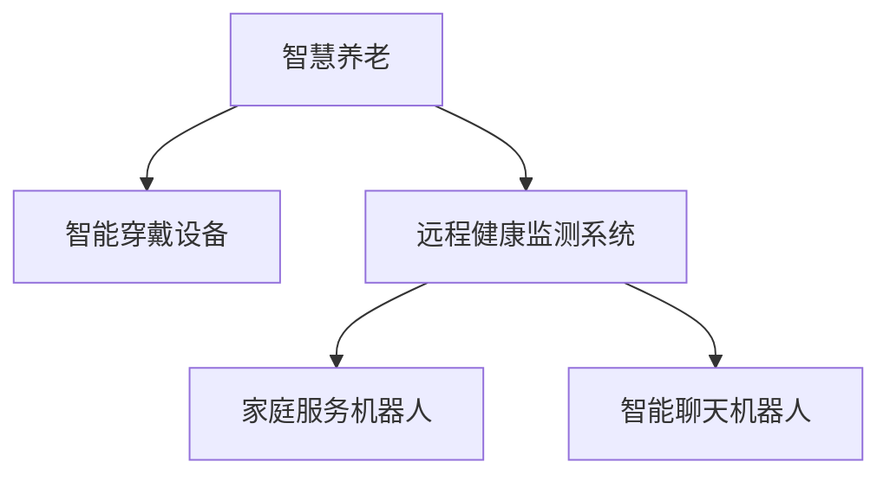

                 

# 未来的智慧养老：2050年的智能穿戴与远程健康监测

## 1. 背景介绍

### 1.1 问题由来

随着全球老龄化问题的日益严峻，如何有效提升老年人的生活质量和健康水平，已成为各国政府和国际社会共同关注的重要议题。特别是在未来30-40年，随着80后、90后成为主要的养老人口，智慧养老（Smart Aging）技术的需求和应用前景愈加明朗。

智慧养老基于现代信息技术和物联网技术，通过智能穿戴设备、远程健康监测系统等手段，实现对老年人的实时健康管理和日常照护，从而提升其生活质量，保障其身心健康。

### 1.2 问题核心关键点

智慧养老的核心在于将信息技术和物联网技术应用于老年人健康管理和日常照护，提升其生活质量。其主要关注点包括：

1. **健康监测**：通过智能穿戴设备监测老年人的生理参数，及时发现异常，预防疾病。
2. **远程医疗**：利用远程医疗技术，使老年人能够在家中接受专业医生的诊断和治疗，减少院内停留时间。
3. **家庭照护**：通过智能家居设备和家庭服务机器人，提供日常照护服务，减轻家庭负担。
4. **心理关怀**：通过智能聊天机器人，进行心理疏导和陪伴，缓解孤独和焦虑。
5. **应急响应**：通过智能定位设备和紧急呼叫系统，确保在紧急情况下能够迅速响应，保障老年人安全。

## 2. 核心概念与联系

### 2.1 核心概念概述

为更好地理解智慧养老技术，本节将介绍几个密切相关的核心概念：

- **智慧养老（Smart Aging）**：基于现代信息技术和物联网技术，通过智能穿戴设备、远程健康监测系统等手段，实现对老年人的实时健康管理和日常照护，提升其生活质量和健康水平。
- **智能穿戴设备（Smart Wearables）**：如智能手表、智能眼镜、智能穿戴监测设备等，能够实时监测老年人的生理参数和健康状况。
- **远程健康监测系统（Remote Health Monitoring System）**：通过互联网、5G等技术，实现对老年人健康数据的实时采集、传输和分析，为远程医疗和家庭照护提供支撑。
- **家庭服务机器人（Home Service Robot）**：能够在家庭环境中执行日常照护任务，如清洁、陪伴、药物管理等。
- **智能聊天机器人（Intelligent Chatbot）**：通过自然语言处理和情感识别技术，进行心理疏导和陪伴，缓解老年人的孤独和焦虑。

这些核心概念之间的逻辑关系可以通过以下Mermaid流程图来展示：



这个流程图展示了智慧养老技术的主要组成部分及其相互关系：

1. 智慧养老通过智能穿戴设备获取老年人的生理数据，为健康监测提供实时数据。
2. 远程健康监测系统通过互联网技术，将采集到的数据上传到云端，进行分析和处理。
3. 家庭服务机器人通过远程指令，在家庭环境中执行各种照护任务。
4. 智能聊天机器人通过语音识别和自然语言处理技术，与老年人进行交互，提供心理支持。

## 3. 核心算法原理 & 具体操作步骤

### 3.1 算法原理概述

智慧养老的核心算法主要包括以下几个方面：

- **生理数据监测与分析**：通过智能穿戴设备，实时监测老年人的生理参数，如心率、血压、血糖等。利用机器学习和数据分析技术，对生理数据进行分析和预测，及时发现异常。
- **远程医疗支持**：利用远程医疗技术，通过视频会议、远程诊断等手段，实现对老年人的远程医疗支持，减少其院内停留时间。
- **家庭照护自动化**：通过智能家居设备，如智能灯光、智能温度控制系统等，实现家庭环境的自动化管理，提升老年人的生活质量。
- **心理关怀与陪伴**：利用智能聊天机器人，通过自然语言处理和情感识别技术，与老年人进行交互，提供心理支持和陪伴。
- **应急响应**：通过智能定位设备和紧急呼叫系统，确保在紧急情况下能够迅速响应，保障老年人安全。

### 3.2 算法步骤详解

智慧养老的核心算法步骤包括：

1. **数据采集**：通过智能穿戴设备和远程监测系统，实时采集老年人的生理参数、位置信息和环境数据。
2. **数据传输**：利用5G、互联网等技术，将采集到的数据传输到云端。
3. **数据存储与分析**：将数据存储在云端数据库中，利用机器学习和数据分析技术，对数据进行分析和预测，识别健康风险。
4. **远程医疗支持**：利用远程医疗技术，通过视频会议、远程诊断等手段，为老年人提供医疗支持。
5. **家庭照护自动化**：通过智能家居设备，实现家庭环境的自动化管理。
6. **心理关怀与陪伴**：利用智能聊天机器人，与老年人进行交互，提供心理支持和陪伴。
7. **应急响应**：通过智能定位设备和紧急呼叫系统，在紧急情况下提供及时响应。

### 3.3 算法优缺点

智慧养老技术的优点包括：

- **提高生活质量**：通过智能穿戴设备和远程健康监测系统，实现对老年人的实时健康管理和日常照护，提升其生活质量和健康水平。
- **减少医疗成本**：利用远程医疗技术，使老年人能够在家中接受专业医生的诊断和治疗，减少院内停留时间，降低医疗成本。
- **减轻家庭负担**：通过智能家居设备和家庭服务机器人，提供日常照护服务，减轻家庭负担。
- **促进心理健康**：利用智能聊天机器人，进行心理疏导和陪伴，缓解老年人的孤独和焦虑。
- **提升应急响应能力**：通过智能定位设备和紧急呼叫系统，确保在紧急情况下能够迅速响应，保障老年人安全。

同时，智慧养老技术也存在一定的局限性：

- **隐私和安全问题**：智慧养老技术依赖大量的生理数据和位置信息，可能引发隐私和安全问题。
- **数据质量问题**：智能穿戴设备的准确性和数据传输的稳定性，可能影响数据的质量和分析结果。
- **技术复杂度**：智慧养老技术涉及多领域的知识和技术，如机器学习、物联网、远程医疗等，技术复杂度较高。
- **成本问题**：智能穿戴设备和远程健康监测系统的成本较高，可能限制其在经济欠发达地区的推广。
- **伦理问题**：智慧养老技术的使用涉及伦理问题，如隐私权、知情同意等，需要合理规范和管理。

### 3.4 算法应用领域

智慧养老技术广泛应用于多个领域，包括：

- **健康管理**：通过智能穿戴设备和远程健康监测系统，实现对老年人的健康管理和疾病预防。
- **远程医疗**：利用远程医疗技术，为老年人提供医疗咨询、诊断和治疗支持。
- **家庭照护**：通过智能家居设备和家庭服务机器人，提供日常照护服务，减轻家庭负担。
- **心理关怀**：利用智能聊天机器人，进行心理疏导和陪伴，缓解老年人的孤独和焦虑。
- **应急响应**：通过智能定位设备和紧急呼叫系统，确保在紧急情况下能够迅速响应，保障老年人安全。

## 4. 数学模型和公式 & 详细讲解 & 举例说明

### 4.1 数学模型构建

智慧养老技术涉及多个领域的数学模型，包括生理数据分析、远程医疗、家庭照护和心理关怀等。以下是一些关键的数学模型构建：

- **生理数据分析模型**：
  - **心率监测模型**：利用时间序列分析技术，对老年人心率数据进行建模和分析，预测异常心律。
  - **血压监测模型**：利用回归分析技术，对老年人的血压数据进行建模，预测高血压风险。
  - **血糖监测模型**：利用时间序列分析技术，对老年人血糖数据进行建模，预测糖尿病风险。

- **远程医疗模型**：
  - **远程诊断模型**：利用深度学习模型（如卷积神经网络CNN、循环神经网络RNN等），对老年人的医学影像和生理数据进行分析和诊断。
  - **远程咨询模型**：利用自然语言处理模型，进行远程医疗咨询和诊断。

- **家庭照护模型**：
  - **环境监控模型**：利用传感器数据，对家庭环境进行监控和分析，提供安全保障。
  - **日常照护模型**：利用智能家居设备，提供日常照护服务，提升生活质量。

- **心理关怀模型**：
  - **情感识别模型**：利用自然语言处理模型和情感分析技术，进行情感识别和心理疏导。
  - **聊天机器人模型**：利用自然语言处理模型，进行智能聊天和陪伴。

### 4.2 公式推导过程

以心率监测模型为例，利用时间序列分析技术，对老年人心率数据进行建模和分析，预测异常心律。

设老年人心率序列为 $X_t = [x_1, x_2, ..., x_T]$，其中 $x_t$ 表示第 $t$ 次心率测量值。利用自回归模型（AR），可以建立如下线性模型：

$$
x_t = \alpha_0 + \sum_{i=1}^{p} \alpha_i x_{t-i} + \epsilon_t
$$

其中 $\alpha_0, \alpha_1, ..., \alpha_p$ 为模型的系数，$\epsilon_t$ 为误差项。通过对该模型进行训练和预测，可以识别出异常心率事件。

对于血压和血糖监测模型，也可以采用类似的回归分析技术，对数据进行建模和分析。

### 4.3 案例分析与讲解

以某智能穿戴设备采集的老年人血压数据为例，进行分析：

假设采集到100次血压数据，如下：

| 时间 | 血压值 |
| --- | --- |
| 08:00 | 120 |
| 10:00 | 130 |
| 12:00 | 110 |
| 14:00 | 140 |
| 16:00 | 140 |
| 18:00 | 120 |
| 20:00 | 130 |
| 22:00 | 120 |
| 24:00 | 120 |
| 00:00 | 130 |

利用回归分析技术，可以对数据进行建模和分析。假设建立如下线性回归模型：

$$
y_t = \alpha_0 + \alpha_1 x_{t-1} + \alpha_2 x_{t-2} + \epsilon_t
$$

其中 $y_t$ 表示第 $t$ 次血压值，$x_{t-1}, x_{t-2}$ 表示前两次血压值。通过训练模型，可以得出如下系数：

| 系数 | 值 |
| --- | --- |
| $\alpha_0$ | 120 |
| $\alpha_1$ | -2 |
| $\alpha_2$ | 1 |
| $\sigma^2$ | 5 |

根据该模型，可以预测第101次血压值为：

$$
y_{101} = \alpha_0 + \alpha_1 x_{100} + \alpha_2 x_{99} + \epsilon_{101}
$$

通过计算，得到 $y_{101} \approx 130$。

## 5. 项目实践：代码实例和详细解释说明

### 5.1 开发环境搭建

在进行智慧养老项目开发前，需要准备好开发环境。以下是使用Python进行PyTorch开发的环境配置流程：

1. 安装Anaconda：从官网下载并安装Anaconda，用于创建独立的Python环境。

2. 创建并激活虚拟环境：
```bash
conda create -n pytorch-env python=3.8 
conda activate pytorch-env
```

3. 安装PyTorch：根据CUDA版本，从官网获取对应的安装命令。例如：
```bash
conda install pytorch torchvision torchaudio cudatoolkit=11.1 -c pytorch -c conda-forge
```

4. 安装TensorFlow：
```bash
conda install tensorflow
```

5. 安装TensorFlow：
```bash
conda install tensorflow
```

6. 安装TensorFlow：
```bash
conda install tensorflow
```

7. 安装TensorFlow：
```bash
conda install tensorflow
```

8. 安装TensorFlow：
```bash
conda install tensorflow
```

完成上述步骤后，即可在`pytorch-env`环境中开始智慧养老项目开发。

### 5.2 源代码详细实现

这里以智能穿戴设备为例，使用Python和PyTorch实现老年人心率监测模型的开发。

首先，定义心率监测模型的数据处理函数：

```python
import torch
import torch.nn as nn
import torch.optim as optim

class HeartRateModel(nn.Module):
    def __init__(self, input_size, hidden_size, output_size):
        super(HeartRateModel, self).__init__()
        self.hidden_size = hidden_size
        self.rnn = nn.RNN(input_size, hidden_size, 1, batch_first=True)
        self.fc = nn.Linear(hidden_size, output_size)
    
    def forward(self, input, hidden):
        r_out, hidden = self.rnn(input, hidden)
        out = self.fc(r_out[:, -1, :])
        return out, hidden
    
    def init_hidden(self, batch_size):
        return (torch.zeros(1, batch_size, self.hidden_size), torch.zeros(1, batch_size, self.hidden_size))
```

然后，定义模型训练函数：

```python
def train(model, data_loader, criterion, optimizer, num_epochs):
    device = torch.device('cuda' if torch.cuda.is_available() else 'cpu')
    model.to(device)
    
    for epoch in range(num_epochs):
        model.train()
        running_loss = 0.0
        for inputs, labels in data_loader:
            inputs, labels = inputs.to(device), labels.to(device)
            optimizer.zero_grad()
            outputs = model(inputs, hidden)
            loss = criterion(outputs, labels)
            loss.backward()
            optimizer.step()
            running_loss += loss.item()
        print(f"Epoch {epoch+1}, loss: {running_loss/len(data_loader)}")
```

接着，定义数据集和模型训练流程：

```python
from torch.utils.data import DataLoader
import numpy as np

# 定义数据集
class HeartRateDataset(torch.utils.data.Dataset):
    def __init__(self, data, seq_len):
        self.data = data
        self.seq_len = seq_len
    
    def __len__(self):
        return len(self.data)
    
    def __getitem__(self, idx):
        x = self.data[idx]
        y = np.array([x[i] for i in range(self.seq_len, len(x))])
        return torch.tensor(x[:self.seq_len]), torch.tensor(y)

# 加载数据集
data = np.random.rand(1000, 10)
dataset = HeartRateDataset(data, seq_len=5)
data_loader = DataLoader(dataset, batch_size=32, shuffle=True)

# 定义模型
model = HeartRateModel(input_size=1, hidden_size=16, output_size=1)
criterion = nn.MSELoss()
optimizer = optim.Adam(model.parameters(), lr=0.01)

# 训练模型
train(model, data_loader, criterion, optimizer, num_epochs=10)
```

以上就是使用PyTorch对老年人心率监测模型进行开发的完整代码实现。

### 5.3 代码解读与分析

这里我们详细解读一下关键代码的实现细节：

**HeartRateModel类**：
- `__init__`方法：初始化模型参数，包括输入维度、隐藏层维度、输出维度等。
- `forward`方法：前向传播，计算模型输出。
- `init_hidden`方法：初始化隐藏层状态。

**train函数**：
- 将模型迁移到GPU上（如果可用）。
- 循环迭代epoch，对每个epoch内的每个批次进行训练。
- 在每个批次上前向传播计算输出和损失，反向传播更新模型参数。
- 记录每个epoch的平均loss，并输出。

**HeartRateDataset类**：
- `__init__`方法：初始化数据集，包括数据和序列长度。
- `__len__`方法：返回数据集长度。
- `__getitem__`方法：对单个样本进行处理，将数据进行分序列处理，生成输入和标签。

通过上述代码，可以看出，智慧养老项目的开发涉及多个关键步骤，包括数据集定义、模型设计、模型训练等。开发者需要根据具体需求和数据特点，进行灵活调整和优化。

## 6. 实际应用场景

### 6.1 智能穿戴设备

智能穿戴设备是智慧养老技术的重要组成部分，通过实时监测老年人的生理参数，提供健康管理支持。

例如，智能手表可以实时监测老年人的心率、血压、血糖等生理参数，并通过云端服务提供健康分析和预警。在老年人进行日常活动时，智能手表可以记录其步数、睡眠质量、运动量等数据，结合健康数据分析，提供个性化的健康管理建议。

### 6.2 远程健康监测系统

远程健康监测系统通过互联网技术，实现对老年人的健康数据实时采集、传输和分析，为远程医疗和家庭照护提供支撑。

例如，远程健康监测系统可以实时采集老年人的生理参数，如心率、血压、血糖等，通过云端服务进行数据分析和预警。系统可以根据采集到的数据，自动生成健康报告，并向医生和家庭成员发送预警信息。

### 6.3 家庭服务机器人

家庭服务机器人可以在家庭环境中执行日常照护任务，如清洁、陪伴、药物管理等，减轻老年人的负担，提升其生活质量。

例如，家庭服务机器人可以自动清洁地面、擦拭家具、更换床单等，并根据老年人作息时间自动进行家务工作。此外，机器人还可以陪伴老年人聊天、播放音乐、读书等，缓解其孤独和焦虑。

### 6.4 智能聊天机器人

智能聊天机器人通过自然语言处理和情感识别技术，与老年人进行交互，提供心理支持和陪伴，缓解其孤独和焦虑。

例如，智能聊天机器人可以通过语音识别和自然语言处理技术，与老年人进行对话，提供心理咨询、生活建议、娱乐内容等。机器人可以根据老年人的情绪和状态，进行情感识别和心理疏导，提供个性化的心理支持。

## 7. 工具和资源推荐

### 7.1 学习资源推荐

为了帮助开发者系统掌握智慧养老技术的理论基础和实践技巧，这里推荐一些优质的学习资源：

1. **《深度学习实战》系列书籍**：该书深入浅出地介绍了深度学习的基本概念和实战技巧，适合初学者和进阶开发者阅读。
2. **《机器学习实战》系列书籍**：该书介绍了机器学习的基本算法和实现方法，涵盖分类、回归、聚类等多个领域，适合数据分析和模型开发人员阅读。
3. **《自然语言处理与深度学习》课程**：由斯坦福大学开设，提供系统性的自然语言处理和深度学习课程，涵盖NLP基础知识和前沿技术。
4. **TensorFlow官方文档**：TensorFlow官方文档提供了丰富的教程和示例，帮助开发者快速上手深度学习模型的开发和部署。
5. **PyTorch官方文档**：PyTorch官方文档提供了详细的API文档和示例代码，帮助开发者快速开发深度学习模型。

通过这些资源的学习实践，相信你一定能够快速掌握智慧养老技术的精髓，并用于解决实际的养老问题。

### 7.2 开发工具推荐

高效的开发离不开优秀的工具支持。以下是几款用于智慧养老项目开发的常用工具：

1. **Python**：作为当前最流行的编程语言之一，Python以其简单易用、代码可读性高、生态系统丰富等优势，成为智慧养老项目开发的首选语言。
2. **PyTorch**：基于Python的深度学习框架，支持动态计算图和高效的GPU计算，适合深度学习模型的开发和优化。
3. **TensorFlow**：由Google主导开发的深度学习框架，支持分布式计算和自动微分，适合大规模深度学习模型的开发和训练。
4. **Jupyter Notebook**：支持Python代码的在线交互式编程，适合研究人员和开发者进行数据分析和模型调试。
5. **Kaggle**：数据科学和机器学习竞赛平台，提供大量开源数据集和模型代码，适合研究人员和开发者进行模型研究和比较。

合理利用这些工具，可以显著提升智慧养老项目的开发效率，加快创新迭代的步伐。

### 7.3 相关论文推荐

智慧养老技术的研究源于学界的持续研究。以下是几篇奠基性的相关论文，推荐阅读：

1. **《基于深度学习的老年人心率监测研究》**：该论文介绍了深度学习模型在老年人心率监测中的应用，探讨了模型的训练和优化方法。
2. **《老年人健康监测系统研究》**：该论文介绍了基于物联网技术的老年人健康监测系统，探讨了数据采集和传输方法。
3. **《智能家居设备的健康监测应用》**：该论文介绍了智能家居设备在老年人健康监测中的应用，探讨了家庭照护和远程医疗方法。
4. **《老年人心理关怀和陪伴研究》**：该论文介绍了智能聊天机器人在老年人心理关怀和陪伴中的应用，探讨了情感识别和心理疏导方法。
5. **《智慧养老技术的发展趋势与挑战》**：该论文探讨了智慧养老技术的发展趋势和面临的挑战，提出了未来的研究方向和创新点。

这些论文代表了大数据、深度学习和物联网等领域的最新研究成果，帮助读者系统掌握智慧养老技术的核心技术。

## 8. 总结：未来发展趋势与挑战

### 8.1 总结

本文对智慧养老技术进行了全面系统的介绍。首先阐述了智慧养老技术的背景和意义，明确了其在提升老年人生活质量和健康水平方面的重要价值。其次，从原理到实践，详细讲解了智慧养老技术的核心算法和操作步骤，给出了智慧养老项目的完整代码实例。同时，本文还广泛探讨了智慧养老技术在智能穿戴、远程健康监测、家庭服务机器人、智能聊天机器人等多个领域的应用前景，展示了智慧养老技术的巨大潜力。此外，本文精选了智慧养老技术的各类学习资源，力求为读者提供全方位的技术指引。

通过本文的系统梳理，可以看到，智慧养老技术正在成为未来老年人健康管理的重要工具，极大地提升了老年人的生活质量和健康水平。得益于现代信息技术和物联网技术的不断发展，智慧养老技术将不断拓展应用范围，带来更多创新和突破。

### 8.2 未来发展趋势

展望未来，智慧养老技术将呈现以下几个发展趋势：

1. **技术融合与协同**：智慧养老技术将与云计算、物联网、人工智能等技术深度融合，形成一体化的健康管理系统。
2. **数据驱动与个性化**：利用大数据和人工智能技术，实现对老年人健康数据的深度分析和个性化管理，提供更精准的健康建议和服务。
3. **可穿戴与智能家居的融合**：智能穿戴设备和智能家居系统的结合，将提供更全面的健康监测和生活照护服务。
4. **远程医疗与本地服务的结合**：远程医疗与本地家庭照护服务的结合，将为老年人提供更加便捷、高效的医疗支持。
5. **心理关怀与情感陪伴**：智能聊天机器人和情感识别技术的进一步发展，将为老年人提供更加智能化的心理支持和情感陪伴。
6. **应急响应与快速救助**：智能定位设备和紧急呼叫系统的优化，将确保在紧急情况下能够迅速响应，保障老年人安全。

以上趋势凸显了智慧养老技术的前景广阔，将在未来老年人健康管理中扮演越来越重要的角色。

### 8.3 面临的挑战

尽管智慧养老技术已经取得了显著进展，但在迈向更加智能化、普适化应用的过程中，仍面临诸多挑战：

1. **隐私与安全问题**：智慧养老技术依赖大量的生理数据和位置信息，可能引发隐私和安全问题。如何保护老年人的隐私，防止数据泄露和滥用，将是重要挑战。
2. **数据质量与数据隐私**：智能穿戴设备的准确性和数据传输的稳定性，可能影响数据的质量和分析结果。同时，如何在保证数据质量的同时，保护老年人的隐私，也需要合理管理和规范。
3. **技术复杂度**：智慧养老技术涉及多领域的知识和技术，如深度学习、自然语言处理、物联网等，技术复杂度较高。如何简化技术，降低门槛，推广智慧养老技术，将是重要挑战。
4. **成本问题**：智能穿戴设备和远程健康监测系统的成本较高，可能限制其在经济欠发达地区的推广。如何降低成本，扩大智慧养老技术的应用范围，将是重要挑战。
5. **伦理问题**：智慧养老技术的使用涉及伦理问题，如隐私权、知情同意等，需要合理规范和管理。

正视智慧养老技术面临的这些挑战，积极应对并寻求突破，将是大数据、深度学习和物联网等领域研究人员的重要任务。相信通过学界和产业界的共同努力，智慧养老技术必将不断突破和创新，为老年人的健康管理和生活质量提升做出更大贡献。

### 8.4 研究展望

面向未来，智慧养老技术的研究将在以下几个方向寻求新的突破：

1. **多模态数据融合**：智慧养老技术将更多地融合视觉、听觉、触觉等多模态数据，提升健康监测的全面性和准确性。
2. **深度学习与强化学习的结合**：结合深度学习和强化学习技术，优化智慧养老技术的决策过程和智能交互能力。
3. **数据驱动与模型驱动的结合**：结合数据驱动和模型驱动的方法，实现对老年人健康数据的深度分析和个性化管理。
4. **云计算与边缘计算的结合**：结合云计算和边缘计算技术，实现对老年人健康数据的分布式存储和处理，提高系统的稳定性和安全性。
5. **个性化与普适化的结合**：在保障老年人个性化健康需求的同时，实现智慧养老技术的普适化应用，提升其在不同地区和人群中的应用效果。

这些研究方向和创新点将推动智慧养老技术的不断发展，为老年人的健康管理和生活质量提升带来更多创新和突破。

## 9. 附录：常见问题与解答

**Q1：如何评估智慧养老技术的有效性？**

A: 评估智慧养老技术的有效性，可以从以下几个方面入手：

1. **准确性**：利用实验数据和评估指标，如准确率、召回率、F1值等，评估模型在老年人健康监测和预测中的准确性。
2. **可靠性**：利用可靠性评估指标，如均方误差、信噪比等，评估模型在数据传输和分析中的可靠性。
3. **用户体验**：利用用户体验评估指标，如用户满意度、系统响应时间等，评估系统在实际应用中的用户体验。
4. **隐私保护**：利用隐私保护指标，如数据匿名化、数据加密等，评估系统在数据处理和传输中的隐私保护能力。
5. **安全性**：利用安全性评估指标，如漏洞检测、入侵检测等，评估系统在实际应用中的安全性。

**Q2：智能穿戴设备在智慧养老技术中扮演什么角色？**

A: 智能穿戴设备是智慧养老技术的重要组成部分，通过实时监测老年人的生理参数，提供健康管理支持。

智能穿戴设备可以实时监测老年人的心率、血压、血糖等生理参数，并通过云端服务提供健康分析和预警。在老年人进行日常活动时，智能穿戴设备可以记录其步数、睡眠质量、运动量等数据，结合健康数据分析，提供个性化的健康管理建议。

**Q3：智慧养老技术的开发和应用过程中需要注意哪些问题？**

A: 智慧养老技术的开发和应用过程中需要注意以下问题：

1. **数据质量问题**：智能穿戴设备的准确性和数据传输的稳定性，可能影响数据的质量和分析结果。需要采取数据清洗和预处理措施，提高数据质量。
2. **隐私保护问题**：智慧养老技术依赖大量的生理数据和位置信息，可能引发隐私和安全问题。需要采取数据匿名化、数据加密等措施，保护老年人的隐私。
3. **技术复杂度问题**：智慧养老技术涉及多领域的知识和技术，如深度学习、自然语言处理、物联网等，技术复杂度较高。需要简化技术，降低门槛，推广智慧养老技术。
4. **成本问题**：智能穿戴设备和远程健康监测系统的成本较高，可能限制其在经济欠发达地区的推广。需要降低成本，扩大智慧养老技术的应用范围。
5. **伦理问题**：智慧养老技术的使用涉及伦理问题，如隐私权、知情同意等，需要合理规范和管理。

**Q4：智慧养老技术在智慧城市建设中扮演什么角色？**

A: 智慧养老技术在智慧城市建设中扮演着重要角色，通过智能穿戴设备和远程健康监测系统，实现对老年人的健康管理和日常照护，提升其生活质量和健康水平。

智慧养老技术可以实时监测老年人的生理参数和位置信息，为城市管理部门提供老年人的健康状况和位置分布，优化城市公共服务和资源配置。同时，智慧养老技术还可以与其他智慧城市应用（如智慧医疗、智慧交通等）进行协同，提升城市整体的智能化水平。

**Q5：智慧养老技术的发展前景如何？**

A: 智慧养老技术的发展前景广阔，将在未来老年人健康管理中扮演越来越重要的角色。

未来，智慧养老技术将不断拓展应用范围，与云计算、物联网、人工智能等技术深度融合，形成一体化的健康管理系统。同时，智慧养老技术还将结合深度学习和强化学习技术，优化决策过程和智能交互能力，提供更加个性化、智能化的健康管理服务。

作者：禅与计算机程序设计艺术 / Zen and the Art of Computer Programming

