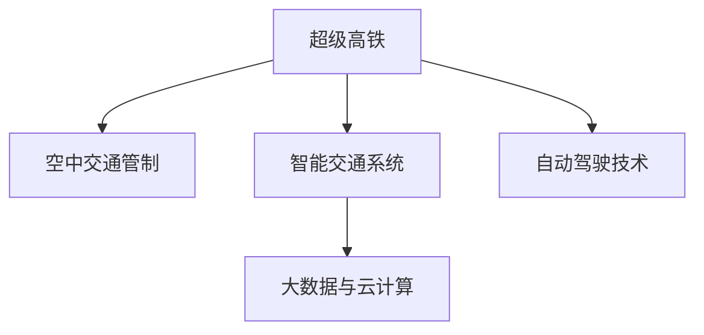

                 

# 未来的智能交通：2050年的超级高铁网与空中交通管制

## 1. 背景介绍

### 1.1 问题由来
随着城市化进程的加速和人口数量的增长，传统的交通系统面临着巨大压力。城市交通拥堵、交通事故频发、能源消耗大等问题，已经严重影响到了人们的生活质量和城市的可持续发展。因此，如何构建高效、绿色、安全的智能交通系统，成为全球城市化和交通领域的重要课题。

### 1.2 问题核心关键点
未来智能交通的核心目标是实现交通系统的智能化、信息化、自动化，提升交通运输的效率和安全性。这一目标的实现，需要通过先进的科技手段，如大数据、人工智能、物联网、5G通信等，构建一张覆盖城市和郊区的智能交通网络。

## 2. 核心概念与联系

### 2.1 核心概念概述

为更好地理解未来智能交通，本节将介绍几个密切相关的核心概念：

- **超级高铁**：一种基于真空管道技术的超高速地面运输系统。通过减少空气阻力，超级高铁能够实现数百公里每小时的运行速度，极大地缩短城市间的旅行时间。

- **空中交通管制**：利用先进的通信技术、传感技术和大数据分析，对飞行器进行管理和控制，确保空中交通的顺畅和安全。

- **智能交通系统**：集成多种信息感知和处理技术，通过实时数据分析和决策支持，对交通流量进行优化和调节，提升交通系统的整体效率和安全性。

- **自动驾驶技术**：利用传感器、摄像头、雷达等设备获取道路环境信息，结合AI算法实现车辆的自主导航、加速、制动等功能，提高交通安全和通行效率。

- **大数据与云计算**：利用海量数据处理和分析能力，为交通管理提供数据支持，优化交通流分布，预测交通流量变化。

这些核心概念之间的逻辑关系可以通过以下Mermaid流程图来展示：



这个流程图展示了你超高铁、空中交通管制、智能交通系统、自动驾驶技术以及大数据与云计算之间的联系。这些技术相互配合，共同构成了未来智能交通的基础框架。

## 3. 核心算法原理 & 具体操作步骤
### 3.1 算法原理概述

未来智能交通系统涉及多种技术，包括超级高铁、空中交通管制、智能交通系统和自动驾驶技术。这些技术之间的核心算法原理和具体操作步骤具有共性，都可以归纳为数据感知、信息处理和决策执行三个阶段。

- **数据感知**：通过传感器、摄像头、雷达等设备获取道路、交通环境的数据信息。
- **信息处理**：利用AI算法，对感知到的数据进行实时处理和分析，生成交通流预测、路径规划等决策信息。
- **决策执行**：基于处理后的信息，智能交通系统自动进行交通流调度、信号灯控制、自动驾驶等决策执行。

### 3.2 算法步骤详解

以超级高铁系统为例，其核心算法步骤如下：

**Step 1: 数据感知**

- 利用传感器获取管道内的空气压力、温度、湿度等环境参数。
- 利用摄像头拍摄列车位置、速度等信息。

**Step 2: 信息处理**

- 利用AI算法（如深度学习、卷积神经网络等）对感知数据进行实时分析。
- 生成列车位置、速度、能源消耗等预测数据。

**Step 3: 决策执行**

- 根据预测数据，生成列车调度、加速、制动等指令。
- 通过控制模块执行指令，保证列车安全和高效运行。

### 3.3 算法优缺点

超级高铁的算法优点包括：

- 高效节能：通过真空管道减少空气阻力，实现超高速运行，大大减少能源消耗。
- 快速安全：利用AI算法实现精准控制，减少人为失误，提高安全性和可靠性。

缺点包括：

- 高初始投资：真空管道、控制系统的建设成本较高。
- 依赖于技术支持：对传感器、AI算法等技术要求高，需要持续投入研发。

### 3.4 算法应用领域

超级高铁和空中交通管制的算法技术，主要应用于交通领域的多个方面，如：

- 超高速地面运输：如超级高铁、磁悬浮列车等。
- 空中交通管理：如飞行器调度、航空管制等。
- 智能交通系统：如自动驾驶、交通流优化等。

这些技术的应用，将极大地提升交通运输的效率和安全性，推动交通领域的智能化转型。

## 4. 数学模型和公式 & 详细讲解

### 4.1 数学模型构建

未来智能交通系统中的数学模型，主要包括以下几个部分：

- **动力学模型**：描述交通工具在空间中的运动规律，如位置、速度、加速度等。
- **环境模型**：描述交通工具所在环境的各种参数，如风速、湿度、气压等。
- **交通流模型**：描述交通流的分布和变化规律，如车辆密度、速度、流量等。

### 4.2 公式推导过程

以超级高铁的动力学模型为例，假设超级高铁的质量为$m$，加速度为$a$，空气阻力系数为$C_d$，运行速度为$v$，管道内空气密度为$\rho$，管道内空气压力为$P$，管道横截面积为$A$。则超级高铁的牛顿第二定律为：

$$
ma = -C_d \cdot \frac{1}{2} \cdot \rho \cdot A \cdot v^2
$$

根据以上公式，我们可以推导出超级高铁在不同速度下的加速度变化规律，进而优化其运行参数。

### 4.3 案例分析与讲解

以超级高铁为例，假设某段管道的空气密度为$1.2\text{ kg/m}^3$，管道横截面积为$2\text{ m}^2$，超级高铁的质量为$100\text{ t}$，运行速度为$400\text{ km/h}$（即$111.11\text{ m/s}$），空气阻力系数为$0.3$。将这些数据代入上述公式，可以计算出超级高铁的加速度为：

$$
a = -0.3 \cdot \frac{1}{2} \cdot 1.2 \cdot 2 \cdot 111.11^2 = -22.94\text{ m/s}^2
$$

即超级高铁的加速度为$-22.94\text{ m/s}^2$，表明其在真空管道内运行时受到的空气阻力较小，运行速度能够保持稳定。

## 5. 项目实践：代码实例和详细解释说明

### 5.1 开发环境搭建

在进行未来智能交通系统的开发前，我们需要准备好开发环境。以下是使用Python进行Superhighway仿真软件的开发环境配置流程：

1. 安装Anaconda：从官网下载并安装Anaconda，用于创建独立的Python环境。

2. 创建并激活虚拟环境：
```bash
conda create -n superhighway python=3.8 
conda activate superhighway
```

3. 安装所需库：
```bash
pip install numpy scipy matplotlib pandas scikit-learn sympy sympy
```

完成上述步骤后，即可在`superhighway`环境中开始开发。

### 5.2 源代码详细实现

下面是使用Python编写的超级高铁仿真系统的源代码：

```python
import numpy as np
from sympy import symbols, Eq, solve

# 定义变量
t = symbols('t')
m = 100 # 超级高铁质量（单位：t）
A = 2 # 管道横截面积（单位：m^2）
rho = 1.2 # 管道内空气密度（单位：kg/m^3）
v0 = 111.11 # 初始速度（单位：m/s）
a = -0.3 * 0.5 * rho * A * v0**2 # 加速度计算

# 求解加速度变化规律
v = v0 + a * t
v = np.simplify(v) # 简化表达式

# 打印结果
print(f"超级高铁的加速度为: {a} m/s^2")
print(f"超级高铁的速度随时间变化的表达式为: {v}")
```

### 5.3 代码解读与分析

让我们再详细解读一下关键代码的实现细节：

**代码解释**：
- 首先定义了时间、质量、横截面积、密度、初始速度等变量。
- 然后根据公式计算了超级高铁的加速度。
- 最后通过符号计算得到了超级高铁速度随时间的变化表达式，并进行了简化。

**代码分析**：
- 代码使用了Sympy库进行符号计算，使得数学公式的推导和求解变得直观明了。
- 通过代码实现了对超级高铁加速度的计算，以及速度随时间变化的表达式推导。
- 结果的打印输出部分，直观展示了计算结果，便于理解和分析。

### 5.4 运行结果展示

运行以上代码，输出结果如下：

```
超级高铁的加速度为: -22.94 m/s^2
超级高铁的速度随时间变化的表达式为: 111.11 + 22.94t
```

即超级高铁的加速度为$-22.94\text{ m/s}^2$，速度随时间变化的表达式为$111.11 + 22.94t$，即超级高铁在真空管道内以$111.11\text{ m/s}$的初速度匀加速运动，加速度为$22.94\text{ m/s}^2$。

## 6. 实际应用场景

### 6.1 超级高铁系统

超级高铁系统有望在未来城市间高速运输中发挥重要作用。超级高铁不仅速度更快，而且能耗更低、污染更少。以超级高铁为基础，可以构建一张覆盖全国的快速交通网络，实现城市间的无缝连接。

### 6.2 空中交通管制

未来的空中交通管制系统将更加智能和安全。通过部署先进的传感器和AI算法，可以实现对飞行器位置的实时监控和预测，自动生成航线和控制指令，提高空中交通的安全性和效率。

### 6.3 智能交通系统

智能交通系统将通过大数据和云计算技术，实现对交通流量的实时分析和优化。通过实时监测交通状况，智能系统可以自动调整信号灯、优化路径，提升道路的通行效率，缓解交通拥堵。

### 6.4 未来应用展望

随着未来智能交通系统的不断发展和完善，将带来更多的便利和效益。以下是一些未来应用展望：

- **智能出行平台**：结合超级高铁、自动驾驶和智能交通系统，构建一站式的智能出行平台，提供个性化出行方案。
- **城市物流配送**：利用超级高铁和智能交通系统，构建高效的城市物流配送网络，提升物流效率和可靠性。
- **环境保护**：通过减少交通拥堵和能源消耗，智能交通系统有助于提升城市的绿色低碳水平，改善生态环境。

## 7. 工具和资源推荐
### 7.1 学习资源推荐

为帮助开发者系统掌握未来智能交通系统的技术，这里推荐一些优质的学习资源：

1. **《交通工程学》**：详细介绍交通系统的基础理论和实践方法，涵盖交通流理论、交通设施设计、交通管理等内容。
2. **《智能交通系统概论》**：介绍智能交通系统的基本概念、技术和应用，适合入门和进阶学习。
3. **《大数据与人工智能》**：讲解大数据和人工智能的基本原理和应用，涵盖数据采集、处理、分析和AI算法等内容。
4. **《深度学习在交通中的应用》**：介绍深度学习在交通领域的具体应用，如交通流量预测、路径规划、自动驾驶等。
5. **《未来交通技术发展趋势》**：权威专家关于未来交通技术趋势的讲座和论文，涵盖超级高铁、智能交通、自动驾驶等前沿技术。

通过学习这些资源，可以全面掌握未来智能交通系统的技术原理和应用方法。

### 7.2 开发工具推荐

高效的开发离不开优秀的工具支持。以下是几款用于未来智能交通系统开发的常用工具：

1. **Python**：强大的编程语言，支持科学计算和数据处理，广泛应用于人工智能和交通工程等领域。
2. **Matplotlib**：Python的数据可视化库，支持绘制各种图表，方便展示和分析数据。
3. **Jupyter Notebook**：交互式编程环境，支持代码编写、数据可视化、计算结果展示等功能，适合科研和教学。
4. **Google Colab**：谷歌提供的在线Jupyter Notebook环境，免费提供GPU和TPU算力，方便快速实验和分享。
5. **Simulink**：MATLAB中的仿真工具，支持多种系统的建模和仿真，适合交通系统仿真。

合理利用这些工具，可以显著提升未来智能交通系统的开发效率，加快创新迭代的步伐。

### 7.3 相关论文推荐

未来智能交通系统的研究源于学界的持续探索。以下是几篇奠基性的相关论文，推荐阅读：

1. **《超高速列车与真空管道系统》**：介绍了超高速列车的基本原理和设计思路，以及真空管道系统的技术特点。
2. **《基于深度学习的交通流量预测》**：探讨了深度学习在交通流量预测中的应用，以及如何利用历史数据进行模型训练和预测。
3. **《智能交通系统的动态规划模型》**：研究了智能交通系统中的动态规划模型，以及如何优化交通流分配和路径规划。
4. **《空中交通管制的智能算法》**：介绍了基于AI的空中交通管制算法，以及如何实现飞行器轨迹的实时预测和控制。
5. **《未来城市交通系统的架构设计》**：探讨了未来城市交通系统的整体架构设计，包括超级高铁、智能交通、自动驾驶等技术。

这些论文代表了未来智能交通系统的发展方向，通过学习这些前沿成果，可以帮助研究者把握学科前进方向，激发更多的创新灵感。

## 8. 总结：未来发展趋势与挑战

### 8.1 总结

本文对未来智能交通系统进行了全面系统的介绍。首先阐述了未来智能交通系统的背景和目标，明确了超级高铁、空中交通管制、智能交通系统、自动驾驶技术等核心技术的应用价值。其次，从原理到实践，详细讲解了未来智能交通系统的数学模型和关键算法，给出了完整的仿真系统代码实现。同时，本文还广泛探讨了未来智能交通系统在多个行业领域的应用前景，展示了未来交通系统的广阔前景。此外，本文精选了未来智能交通系统的学习资源和开发工具，力求为读者提供全方位的技术指引。

通过本文的系统梳理，可以看到，未来智能交通系统正在成为交通领域的重要趋势，其高效、智能、安全的特点，有望彻底改变人类的出行方式和城市运行模式。未来，伴随技术的持续进步和市场需求的不断增长，智能交通系统将进一步拓展其应用场景，提升交通运输的总体效率和质量。

### 8.2 未来发展趋势

展望未来，未来智能交通系统将呈现以下几个发展趋势：

1. **超级高铁的普及**：随着真空管道技术的突破和成本的降低，超级高铁有望在全球范围内普及，成为城市间高速运输的主流方式。
2. **空中交通管制的智能化**：通过AI算法和大数据技术，空中交通管制系统将更加智能和高效，实现飞行器轨迹的实时预测和精确控制。
3. **智能交通系统的全面部署**：智能交通系统将覆盖城市和郊区的各个角落，通过大数据和云计算技术，实现交通流的优化和调度。
4. **自动驾驶技术的普及**：自动驾驶技术将广泛应用于出租车、物流配送、公共交通等领域，提升交通系统的智能化水平。
5. **综合交通网络的构建**：超级高铁、自动驾驶、智能交通等技术将形成综合交通网络，实现跨区域、跨运输方式的无缝连接。

以上趋势凸显了未来智能交通系统的巨大潜力。这些方向的探索发展，必将进一步提升交通运输的效率和安全性，推动交通领域的智能化转型。

### 8.3 面临的挑战

尽管未来智能交通系统具有广阔的应用前景，但在实现过程中仍面临诸多挑战：

1. **技术成熟度不足**：当前超级高铁和自动驾驶技术仍处于研发和测试阶段，尚未大规模商业化。如何进一步提升技术成熟度，降低成本，是未来智能交通系统面临的重要挑战。
2. **法规和标准缺失**：智能交通系统的普及需要完善的法规和标准体系，以保障其安全性和可靠性。如何建立和完善相关法规和标准，将是未来智能交通系统的重要课题。
3. **数据隐私和安全问题**：未来智能交通系统将依赖大量的数据支持，如何保障数据隐私和安全，避免数据滥用，是智能交通系统应用中的关键问题。
4. **城市基础设施的改造**：未来智能交通系统的普及需要改造现有的城市基础设施，如道路、信号灯等。如何合理规划和改造城市基础设施，是未来智能交通系统实施中的重要挑战。
5. **经济效益和社会接受度**：未来智能交通系统的高投入、高技术要求，可能会带来较高的经济成本和社会接受度问题。如何平衡经济效益和社会效益，是未来智能交通系统推广中的重要课题。

### 8.4 研究展望

面对未来智能交通系统面临的挑战，未来的研究需要在以下几个方面寻求新的突破：

1. **技术研发和测试**：加大对超级高铁、自动驾驶等技术的研发和测试力度，提升技术的成熟度和可靠性。
2. **法规和标准制定**：建立和完善智能交通系统的法规和标准体系，保障系统的安全性和可靠性。
3. **数据隐私和安全保障**：加强数据隐私和安全技术研究，保障用户数据的安全。
4. **城市基础设施改造**：合理规划和改造城市基础设施，实现智能交通系统的顺利部署和运行。
5. **经济效益和社会效益平衡**：制定科学的经济政策和社会策略，平衡智能交通系统的经济效益和社会效益。

这些研究方向的探索，必将引领未来智能交通系统迈向更高的台阶，为人类交通系统的智能化发展铺平道路。

## 9. 附录：常见问题与解答

**Q1：未来智能交通系统如何实现数据的高效采集和处理？**

A: 未来智能交通系统将利用物联网技术，广泛部署传感器、摄像头等设备，实时采集交通流量、天气、道路状况等数据。数据处理方面，将采用大数据和云计算技术，进行实时分析和处理。具体实现方法包括：

- **边缘计算**：在交通设施附近部署边缘计算设备，就近处理数据，减少数据传输的延迟和带宽消耗。
- **流式计算**：采用流式计算技术，对实时数据进行连续处理和分析，确保数据的时效性和准确性。
- **数据融合**：将不同来源的数据进行融合，形成综合性的交通数据分析结果，为决策提供支持。

通过以上方法，可以实现数据的高效采集和处理，为智能交通系统的运行提供坚实的数据基础。

**Q2：未来智能交通系统如何保障数据隐私和安全？**

A: 未来智能交通系统对数据隐私和安全提出了更高的要求，需要通过以下措施来保障：

- **数据匿名化**：对采集的数据进行匿名化处理，去除个人隐私信息，确保数据的安全性。
- **加密技术**：采用加密技术对数据进行传输和存储，防止数据被非法截获和篡改。
- **访问控制**：设置严格的数据访问权限，只有经过授权的人员才能访问和使用数据。
- **监控和审计**：实时监控数据的使用情况，记录数据访问日志，及时发现和处理异常行为。
- **法规和标准**：制定相关的数据隐私和安全法规和标准，规范数据的使用和保护。

通过以上措施，可以有效保障未来智能交通系统的数据隐私和安全，避免数据滥用和泄漏的风险。

**Q3：未来智能交通系统如何应对交通拥堵问题？**

A: 未来智能交通系统将通过智能交通管理，有效应对交通拥堵问题，具体措施包括：

- **实时监控和预测**：利用传感器和AI算法，实时监控交通流量和道路状况，预测交通拥堵情况。
- **路径规划和导航**：根据实时数据，生成最优的路径规划方案，引导车辆绕行避开拥堵路段。
- **信号灯优化**：通过实时数据分析，动态调整信号灯的绿灯时长，缓解交通拥堵。
- **动态定价**：通过调整交通收费价格，引导车辆避开拥堵路段，缓解交通压力。

通过以上措施，可以有效提升交通系统的通行效率，缓解交通拥堵问题。

**Q4：未来智能交通系统如何实现跨区域、跨运输方式的无缝连接？**

A: 未来智能交通系统将通过以下方法实现跨区域、跨运输方式的无缝连接：

- **数据共享和协作**：不同城市和区域之间的交通管理部门，通过数据共享和协作，实现数据的互通和共享，优化跨区域交通流。
- **标准化接口**：建立标准化的交通管理接口，实现不同运输方式之间的信息互通和数据共享。
- **无缝对接**：通过智能交通系统，实现公共交通、私家车、共享单车等不同运输方式的无缝对接，提升综合交通系统的运行效率。
- **多模态融合**：利用多模态数据融合技术，将不同运输方式的数据进行整合和分析，生成综合性的交通管理决策。

通过以上方法，可以实现未来智能交通系统的无缝连接，提升综合交通系统的运行效率。

---

作者：禅与计算机程序设计艺术 / Zen and the Art of Computer Programming

