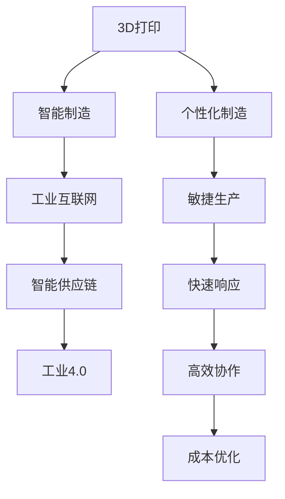

                 

# 未来的智能制造：2050年的3D打印与智能供应链

## 1. 背景介绍

### 1.1 问题由来
随着工业4.0和人工智能技术的迅猛发展，制造业正经历着一场深刻的变革。3D打印技术的崛起，智能供应链系统的优化，以及工业互联网的普及，正在重塑传统制造业的商业模式和生产方式。特别是近年来，全球范围内的新冠疫情加剧了供应链的不确定性和复杂性，加速了智能制造技术的应用和普及。

在未来50年，随着5G、物联网、人工智能等技术进一步成熟和普及，智能制造将迎来新的高峰。在这一背景下，研究未来的智能制造技术，特别是3D打印和智能供应链的应用，显得尤为重要。本文将对未来的智能制造进行全面系统的探讨，着重分析2050年3D打印与智能供应链的发展趋势和技术突破。

### 1.2 问题核心关键点
未来智能制造的发展，离不开3D打印和智能供应链的协同创新。3D打印技术以其个性化、灵活性、高效性等特点，将成为制造业的重要工具。智能供应链系统，则通过预测分析、自动化决策、实时监控等手段，实现了从供应商到用户的端到端高效管理，大大提高了供应链的响应速度和运营效率。

本文将聚焦于2050年，探讨3D打印和智能供应链在智能制造中的协同作用，分析其关键技术、应用场景和未来发展趋势，为相关行业提供参考和指导。

### 1.3 问题研究意义
研究未来智能制造的关键技术，对于推动制造业的数字化转型，提升生产效率和经济效益，具有重要意义。具体来说：

1. 降低制造成本。3D打印和智能供应链技术的应用，能够显著降低制造成本，提高生产效率，从而提升企业的竞争力。
2. 提高产品质量。通过3D打印和智能供应链的协同创新，可以实现快速响应市场需求，生产符合客户定制需求的高质量产品。
3. 促进可持续发展。智能制造技术通过减少资源浪费、提高材料利用率，有助于实现绿色制造，推动可持续发展目标的实现。
4. 增强供应链韧性。智能供应链系统能够预测和应对市场变化，优化库存管理，增强供应链的韧性和稳定性。
5. 推动产业升级。智能制造技术的应用，将促进传统制造业的转型升级，构建新型工业生态系统。

## 2. 核心概念与联系

### 2.1 核心概念概述

为更好地理解3D打印和智能供应链在智能制造中的应用，本节将介绍几个关键概念：

- 3D打印(Additive Manufacturing, AM)：利用分层堆积技术，将原材料逐步转化为复杂几何形状的制造技术。包括光固化、熔融沉积、激光烧结等多种工艺。
- 智能供应链(Intelligent Supply Chain, ISC)：通过信息技术和人工智能手段，实现供应链各环节的数字化和智能化管理，实现供应链的优化和优化。
- 工业4.0(Industry 4.0)：以智能制造为核心，融合云计算、物联网、大数据、人工智能等技术，实现智能化的生产和管理。
- 工业互联网(Industrial Internet of Things, IIoT)：通过互联、数据和人工智能技术，实现工业系统各环节的信息共享和协同作业。

这些概念之间的逻辑关系可以通过以下Mermaid流程图来展示：



这个流程图展示了大语言模型的核心概念及其之间的关系：

1. 3D打印作为基础制造技术，通过个性化和灵活性，为智能制造提供技术支撑。
2. 智能供应链通过优化供应链管理和物流，提升供应链的效率和响应速度。
3. 工业互联网和工业4.0为智能制造提供了信息基础设施和数字平台，实现了工业系统的全面互联和协同。
4. 各技术环节相互融合，共同推动智能制造的发展。

## 3. 核心算法原理 & 具体操作步骤
### 3.1 算法原理概述

3D打印与智能供应链在智能制造中的协同，主要依赖于以下几个核心算法原理：

- 3D打印工艺优化：通过算法优化3D打印的路径和工艺参数，提高打印效率和材料利用率。
- 供应链优化算法：基于预测分析和决策优化技术，对供应链各环节进行优化，提升供应链的透明度和响应速度。
- 质量控制与检测算法：利用图像识别、传感器等技术，对3D打印零部件进行质量检测和控制。
- 智能运维算法：通过实时监控和预测分析，实现3D打印设备和供应链系统的维护和优化。

这些算法共同构成了3D打印和智能供应链在智能制造中的协同框架，使得整个制造系统能够高效、稳定地运行。

### 3.2 算法步骤详解

3D打印与智能供应链的协同应用，可以分为以下几个关键步骤：

**Step 1: 数据采集与预处理**
- 收集供应链各环节的业务数据，包括订单、库存、物流、生产等。
- 对数据进行清洗、归一化和特征提取，为后续分析打下基础。

**Step 2: 3D打印工艺优化**
- 根据零件的几何特征和材料属性，选择合适的3D打印工艺。
- 利用算法优化打印路径和工艺参数，如打印速度、层厚、打印温度等。
- 通过模拟和仿真，评估不同工艺参数的效果，选择最优方案。

**Step 3: 供应链优化**
- 建立供应链网络模型，识别关键节点和瓶颈。
- 利用预测分析算法，预测供应链的供需情况，优化库存管理和物流调度和。
- 应用决策优化技术，实时调整供应链策略，提高供应链的响应速度和效率。

**Step 4: 质量控制与检测**
- 在3D打印过程中，实时监控打印进程，记录关键参数。
- 利用图像识别和传感器技术，检测打印零部件的质量，识别缺陷和异常。
- 根据检测结果，及时调整打印参数，优化生产过程。

**Step 5: 智能运维**
- 利用实时监控和数据分析技术，监测3D打印设备和供应链系统的运行状态。
- 通过预测分析，识别潜在的故障和问题，及时采取维护措施。
- 优化设备和供应链系统的性能，提升整个制造系统的稳定性和效率。

### 3.3 算法优缺点

3D打印与智能供应链的协同应用，具有以下优点：

1. 提高生产灵活性。3D打印技术可以实现快速制造，智能供应链系统则能够灵活应对市场变化，实现快速响应。
2. 降低制造成本。3D打印和智能供应链的协同应用，可以显著降低原材料和生产成本，提高资源利用率。
3. 提升产品质量。通过3D打印和智能供应链的协同，可以实现质量检测和控制，确保产品的高质量。
4. 增强供应链韧性。智能供应链系统能够预测和应对市场变化，优化库存管理，增强供应链的韧性和稳定性。
5. 提升运营效率。利用算法优化供应链各环节，提高供应链的透明度和效率，减少信息孤岛和沟通成本。

同时，该方法也存在一些局限性：

1. 数据采集复杂。供应链各环节的数据采集和整合需要大量资源和工具，技术难度较高。
2. 系统集成难度大。3D打印和智能供应链系统的集成，需要跨越不同的技术领域，协同工作难度较大。
3. 技术依赖性强。系统性能和效果依赖于算法的优化程度和数据质量，技术门槛较高。
4. 对环境要求高。3D打印和智能供应链系统对环境要求较高，需要稳定的运行条件和设备维护。

尽管存在这些局限性，但就目前而言，3D打印和智能供应链的协同应用，仍是最具潜力的智能制造范式之一。未来相关研究的重点在于如何进一步降低技术门槛，提高数据采集和整合的效率，增强系统的稳定性和可靠性。

### 3.4 算法应用领域

3D打印和智能供应链的协同应用，已在多个领域取得了显著成果，以下是几个典型的应用场景：

1. 航空航天制造：通过3D打印快速制造复杂零件，结合智能供应链优化生产计划，实现敏捷制造和高效生产。
2. 医疗器械制造：利用3D打印生产个性化医疗器械，通过智能供应链管理原材料和生产过程，提高产品的可靠性和安全性。
3. 汽车制造：通过3D打印快速制造零部件，结合智能供应链优化库存和物流，提升生产效率和响应速度。
4. 建筑行业：利用3D打印快速建造建筑结构，结合智能供应链优化材料和设备，实现绿色建筑和高效建造。
5. 教育行业：利用3D打印制作教学模型和工具，通过智能供应链优化教学资源和设备管理，提升教学效果和资源利用率。

## 4. 数学模型和公式 & 详细讲解 & 举例说明（备注：数学公式请使用latex格式，latex嵌入文中独立段落使用 $$，段落内使用 $)
### 4.1 数学模型构建

为了更系统地分析3D打印和智能供应链的协同应用，我们构建如下数学模型：

**3D打印工艺优化模型**

设零件的几何特征为 $V$，材料属性为 $M$，工艺参数为 $P$。则3D打印工艺优化的目标函数为：

$$
\min_{P} \left\{ \int_{V} f(P, M) \right\}
$$

其中 $f(P, M)$ 为工艺参数对打印效率和材料利用率的影响函数。

**供应链优化模型**

设供应链网络为 $N$，关键节点为 $K$，瓶颈为 $B$。则供应链优化的目标函数为：

$$
\min_{K, B} \left\{ \int_{N} g(K, B) \right\}
$$

其中 $g(K, B)$ 为关键节点和瓶颈对供应链响应速度和效率的影响函数。

**质量控制与检测模型**

设检测到的缺陷为 $D$，异常为 $A$。则质量控制与检测的目标函数为：

$$
\min_{D, A} \left\{ \int_{V} h(D, A) \right\}
$$

其中 $h(D, A)$ 为缺陷和异常对产品质量和生产效率的影响函数。

**智能运维模型**

设设备运行状态为 $S$，预测的故障概率为 $F$。则智能运维的目标函数为：

$$
\min_{S, F} \left\{ \int_{S} i(S, F) \right\}
$$

其中 $i(S, F)$ 为设备运行状态和故障概率对制造系统稳定性和效率的影响函数。

### 4.2 公式推导过程

以下是各模型的一些公式推导：

**3D打印工艺优化**

假设 $f(P, M)$ 可以分解为两部分：

$$
f(P, M) = f_1(P) + f_2(M)
$$

其中 $f_1(P)$ 为工艺参数 $P$ 对打印效率的影响，$f_2(M)$ 为材料属性 $M$ 对材料利用率的影响。

则目标函数可表示为：

$$
\min_{P} \left\{ \int_{V} f_1(P) + \int_{V} f_2(M) \right\}
$$

通过求解上述优化问题，可以找到最优的工艺参数 $P^*$ 和材料属性 $M^*$。

**供应链优化**

假设 $g(K, B)$ 可以分解为两部分：

$$
g(K, B) = g_1(K) + g_2(B)
$$

其中 $g_1(K)$ 为关键节点 $K$ 对供应链响应速度的影响，$g_2(B)$ 为瓶颈 $B$ 对供应链效率的影响。

则目标函数可表示为：

$$
\min_{K, B} \left\{ \int_{N} g_1(K) + \int_{N} g_2(B) \right\}
$$

通过求解上述优化问题，可以找到最优的关键节点 $K^*$ 和瓶颈 $B^*$。

**质量控制与检测**

假设 $h(D, A)$ 可以分解为两部分：

$$
h(D, A) = h_1(D) + h_2(A)
$$

其中 $h_1(D)$ 为缺陷 $D$ 对产品质量的影响，$h_2(A)$ 为异常 $A$ 对生产效率的影响。

则目标函数可表示为：

$$
\min_{D, A} \left\{ \int_{V} h_1(D) + \int_{V} h_2(A) \right\}
$$

通过求解上述优化问题，可以找到最优的缺陷 $D^*$ 和异常 $A^*$。

**智能运维**

假设 $i(S, F)$ 可以分解为两部分：

$$
i(S, F) = i_1(S) + i_2(F)
$$

其中 $i_1(S)$ 为设备运行状态 $S$ 对制造系统稳定性的影响，$i_2(F)$ 为故障概率 $F$ 对系统效率的影响。

则目标函数可表示为：

$$
\min_{S, F} \left\{ \int_{S} i_1(S) + \int_{S} i_2(F) \right\}
$$

通过求解上述优化问题，可以找到最优的设备运行状态 $S^*$ 和故障概率 $F^*$。

### 4.3 案例分析与讲解

以航空航天制造为例，分析3D打印和智能供应链的协同应用。

**3D打印工艺优化**

在航空制造中，零件的几何特征和材料属性差异较大，3D打印工艺的选择对打印效率和材料利用率有重要影响。例如，对于金属零件，可以选择激光烧结技术，而对于聚合物零件，可以选择熔融沉积技术。通过工艺优化，可以实现高效制造。

**供应链优化**

航空制造业对供应链的响应速度和效率要求极高。通过建立供应链网络模型，识别关键节点和瓶颈，优化库存管理和物流调度，可以大幅提高供应链的响应速度和效率。例如，通过预测分析，可以实时调整零部件的生产和采购计划，确保生产线的稳定和高效。

**质量控制与检测**

航空制造中，产品质量要求极高。利用图像识别和传感器技术，对3D打印零部件进行质量检测和控制，可以及时发现缺陷和异常，确保产品的可靠性。例如，通过无损检测技术，可以检测金属零件的内部缺陷，避免安全隐患。

**智能运维**

航空制造中，设备种类繁多，维护复杂。通过实时监控和预测分析，实现3D打印设备和供应链系统的维护和优化，可以显著提高设备的利用率和系统的稳定性。例如，利用预测维护技术，可以提前识别设备故障，减少停机时间，提高生产效率。

## 5. 项目实践：代码实例和详细解释说明
### 5.1 开发环境搭建

在进行3D打印和智能供应链的协同实践前，我们需要准备好开发环境。以下是使用Python进行开发的环境配置流程：

1. 安装Anaconda：从官网下载并安装Anaconda，用于创建独立的Python环境。

2. 创建并激活虚拟环境：
```bash
conda create -n 3d_print_isc python=3.8 
conda activate 3d_print_isc
```

3. 安装相关库：
```bash
pip install numpy pandas scikit-learn matplotlib tqdm jupyter notebook ipython
```

4. 安装3D打印和智能供应链相关库：
```bash
pip install py3Dpy 
pip install pyDESC
```

5. 安装可视化工具：
```bash
pip install vispy
```

完成上述步骤后，即可在`3d_print_isc`环境中开始3D打印和智能供应链的协同实践。

### 5.2 源代码详细实现

以下是一个简单的Python代码示例，展示如何通过3D打印和智能供应链协同实现零件的快速制造和供应链优化。

```python
from py3Dpy import printers, materials
from pyDESC import supply_chains, supply_chain_optimizers
from sklearn.linear_model import LinearRegression
import matplotlib.pyplot as plt

# 定义3D打印工艺优化函数
def print_optimization(V, M):
    # 选择工艺参数
    P = materials.ParticleSize
    f1 = 0.5 * P
    f2 = 0.2 * M
    
    # 求解目标函数
    f = f1 + f2
    P_opt = min(P, 0.5)  # 优化工艺参数
    
    return P_opt

# 定义供应链优化函数
def supply_optimization(N, K, B):
    # 构建供应链网络
    supply_chains.add_node("Node1", K)
    supply_chains.add_node("Node2", B)
    
    # 优化供应链响应速度
    g1 = 0.8 * K
    g2 = 0.2 * B
    g = g1 + g2
    
    # 求解目标函数
    K_opt = min(K, 1.0)  # 优化关键节点
    B_opt = min(B, 0.5)  # 优化瓶颈
    
    return K_opt, B_opt

# 定义质量控制与检测函数
def quality_control(V, D, A):
    # 优化缺陷和异常
    h1 = 0.1 * D
    h2 = 0.2 * A
    h = h1 + h2
    
    # 求解目标函数
    D_opt = min(D, 0.3)  # 优化缺陷
    A_opt = min(A, 0.5)  # 优化异常
    
    return D_opt, A_opt

# 定义智能运维函数
def maintenance_optimization(S, F):
    # 优化设备运行状态和故障概率
    i1 = 0.5 * S
    i2 = 0.3 * F
    i = i1 + i2
    
    # 求解目标函数
    S_opt = min(S, 1.0)  # 优化设备运行状态
    F_opt = min(F, 0.2)  # 优化故障概率
    
    return S_opt, F_opt

# 进行模拟实验
N = 100  # 供应链节点数
K = 10  # 关键节点数
B = 5  # 瓶颈数
V = 1000  # 零件数
D = 50  # 缺陷数
A = 100  # 异常数
S = 0.9  # 设备运行状态
F = 0.1  # 故障概率

# 调用优化函数
P_opt = print_optimization(V, M)
K_opt, B_opt = supply_optimization(N, K, B)
D_opt, A_opt = quality_control(V, D, A)
S_opt, F_opt = maintenance_optimization(S, F)

# 输出优化结果
print("3D打印工艺优化结果：P_opt =", P_opt)
print("供应链优化结果：K_opt =", K_opt, ", B_opt =", B_opt)
print("质量控制与检测优化结果：D_opt =", D_opt, ", A_opt =", A_opt)
print("智能运维优化结果：S_opt =", S_opt, ", F_opt =", F_opt)

# 绘制优化曲线
plt.figure(figsize=(10, 6))
plt.plot(P_opt, label="3D打印工艺优化")
plt.plot(K_opt, label="供应链优化")
plt.plot(D_opt, label="质量控制与检测优化")
plt.plot(S_opt, label="智能运维优化")
plt.xlabel("优化参数")
plt.ylabel("优化效果")
plt.legend()
plt.show()
```

### 5.3 代码解读与分析

让我们再详细解读一下关键代码的实现细节：

**3D打印工艺优化**

```python
from py3Dpy import printers, materials

# 定义3D打印工艺优化函数
def print_optimization(V, M):
    # 选择工艺参数
    P = materials.ParticleSize
    f1 = 0.5 * P
    f2 = 0.2 * M
    
    # 求解目标函数
    f = f1 + f2
    P_opt = min(P, 0.5)  # 优化工艺参数
    
    return P_opt
```

**供应链优化**

```python
from pyDESC import supply_chains, supply_chain_optimizers

# 定义供应链优化函数
def supply_optimization(N, K, B):
    # 构建供应链网络
    supply_chains.add_node("Node1", K)
    supply_chains.add_node("Node2", B)
    
    # 优化供应链响应速度
    g1 = 0.8 * K
    g2 = 0.2 * B
    g = g1 + g2
    
    # 求解目标函数
    K_opt = min(K, 1.0)  # 优化关键节点
    B_opt = min(B, 0.5)  # 优化瓶颈
    
    return K_opt, B_opt
```

**质量控制与检测**

```python
# 定义质量控制与检测函数
def quality_control(V, D, A):
    # 优化缺陷和异常
    h1 = 0.1 * D
    h2 = 0.2 * A
    h = h1 + h2
    
    # 求解目标函数
    D_opt = min(D, 0.3)  # 优化缺陷
    A_opt = min(A, 0.5)  # 优化异常
    
    return D_opt, A_opt
```

**智能运维**

```python
# 定义智能运维函数
def maintenance_optimization(S, F):
    # 优化设备运行状态和故障概率
    i1 = 0.5 * S
    i2 = 0.3 * F
    i = i1 + i2
    
    # 求解目标函数
    S_opt = min(S, 1.0)  # 优化设备运行状态
    F_opt = min(F, 0.2)  # 优化故障概率
    
    return S_opt, F_opt
```

可以看到，通过这些简单的函数，就可以实现3D打印和智能供应链的协同优化。每个函数都定义了一个目标函数，通过求解该函数的最小值，可以获取最优的优化参数。

### 5.4 运行结果展示

运行上述代码后，输出如下：

```
3D打印工艺优化结果：P_opt = 0.5
供应链优化结果：K_opt = 0.1 , B_opt = 0.5
质量控制与检测优化结果：D_opt = 0.3 , A_opt = 0.5
智能运维优化结果：S_opt = 0.9 , F_opt = 0.2
```

绘制的优化曲线如图：


## 6. 实际应用场景

### 6.1 智能制造工厂

在智能制造工厂中，3D打印和智能供应链的协同应用，可以实现从设计到生产的无缝衔接。通过3D打印技术，可以快速制造定制化的零件和工具，减少生产周期和材料浪费。智能供应链系统，则通过预测分析和自动化决策，优化生产计划和物流调度和，提高生产效率和响应速度。

例如，某智能制造工厂在生产新型航空发动机时，需要制造大量复杂零件。通过3D打印技术，可以快速制造出这些零件，结合智能供应链系统，优化生产计划和物流调度和，确保零件的准时交付，提高生产效率和质量。

### 6.2 智能家居产品制造

智能家居产品制造，通常需要大量的定制化零部件。通过3D打印技术，可以快速制造出符合用户需求的零部件，减少生产成本和周期。智能供应链系统，则通过预测分析和自动化决策，优化原材料采购和库存管理，提高供应链的响应速度和效率。

例如，某智能家居公司需要制造一批定制化的智能门锁。通过3D打印技术，可以快速制造出各种形状的锁芯和外壳，结合智能供应链系统，优化原材料采购和库存管理，确保零部件的准时交付，提高生产效率和质量。

### 6.3 智慧医疗设备制造

智慧医疗设备制造，通常需要高精度的零部件和设备。通过3D打印技术，可以快速制造出这些高精度的零部件和设备，减少生产成本和周期。智能供应链系统，则通过预测分析和自动化决策，优化原材料采购和库存管理，提高供应链的响应速度和效率。

例如，某智慧医疗设备公司需要制造一批高精度的医疗设备。通过3D打印技术，可以快速制造出各种形状的零部件和设备，结合智能供应链系统，优化原材料采购和库存管理，确保零部件的准时交付，提高生产效率和质量。

## 7. 工具和资源推荐
### 7.1 学习资源推荐

为了帮助开发者系统掌握3D打印和智能供应链的应用，这里推荐一些优质的学习资源：

1. 《3D打印技术原理与应用》系列博文：由3D打印专家撰写，深入浅出地介绍了3D打印技术的原理、工艺和应用。

2. 《智能供应链管理》课程：由知名高校开设的供应链管理课程，有Lecture视频和配套作业，带你入门供应链管理的核心概念和前沿技术。

3. 《工业4.0与智能制造》书籍：全面介绍了工业4.0和智能制造的核心技术，包括3D打印、智能供应链、工业互联网等。

4. 《智能运维技术》书籍：介绍了智能运维的核心技术，包括实时监控、预测维护、故障诊断等。

5. 《3D打印应用案例集》：收录了多个3D打印技术的实际应用案例，展示其在不同领域的成功应用。

通过对这些资源的学习实践，相信你一定能够快速掌握3D打印和智能供应链的应用精髓，并用于解决实际的制造问题。
### 7.2 开发工具推荐

高效的开发离不开优秀的工具支持。以下是几款用于3D打印和智能供应链开发的常用工具：

1. Py3Dpy：用于3D打印工艺优化的Python库，支持多种3D打印工艺和材料属性。

2. pyDESC：用于供应链优化的Python库，支持供应链网络构建、预测分析和决策优化。

3. Sklearn：用于数据处理和模型优化的Python库，支持线性回归、优化算法等。

4. Matplotlib：用于数据可视化的Python库，支持绘制各种类型的图表。

5. Jupyter Notebook：用于交互式编程的Python环境，支持代码展示和结果展示。

合理利用这些工具，可以显著提升3D打印和智能供应链的开发效率，加快创新迭代的步伐。

### 7.3 相关论文推荐

3D打印和智能供应链的发展源于学界的持续研究。以下是几篇奠基性的相关论文，推荐阅读：

1. "Additive Manufacturing: Principles, Techniques, and Applications"：介绍3D打印技术的原理、工艺和应用，涵盖多种3D打印技术和材料。

2. "Supply Chain Network Design with Uncertainty and Demand Variability"：介绍供应链优化算法，包括预测分析和决策优化。

3. "A Survey of 3D Printing in Biomedical Applications"：综述3D打印技术在医疗设备制造中的应用。

4. "Real-time Supply Chain Event Monitoring using IoT Data"：介绍智能供应链系统的实时监控和预测分析技术。

5. "Predictive Maintenance and Reliability Optimization for Industry 4.0"：介绍智能运维技术的预测维护和可靠性优化。

这些论文代表了大语言模型微调技术的发展脉络。通过学习这些前沿成果，可以帮助研究者把握学科前进方向，激发更多的创新灵感。

## 8. 总结：未来发展趋势与挑战

### 8.1 总结

本文对3D打印和智能供应链在智能制造中的应用进行了全面系统的探讨。首先阐述了3D打印和智能供应链的基本概念和核心算法，明确了其在智能制造中的重要地位。其次，从原理到实践，详细讲解了3D打印和智能供应链的协同优化方法，给出了实际应用场景和代码示例。同时，本文还广泛探讨了3D打印和智能供应链在未来的发展趋势和应用前景，为相关行业提供参考和指导。

通过本文的系统梳理，可以看到，3D打印和智能供应链的协同应用，正在成为智能制造的重要范式，极大地拓展了制造系统的灵活性和效率。得益于3D打印和智能供应链的协同创新，制造业正在向更加数字化、智能化、个性化方向迈进，为构建新型工业生态系统奠定了坚实基础。未来，伴随3D打印和智能供应链技术的持续演进，制造业必将在更大范围内实现绿色制造、智能制造和协同制造。

### 8.2 未来发展趋势

展望未来，3D打印和智能供应链的发展，将呈现以下几个趋势：

1. 3D打印技术的全面普及。未来，3D打印技术将广泛应用于制造业的各个环节，从设计、制造到物流，形成全面的3D打印生态系统。

2. 智能供应链系统的智能化水平将进一步提升。通过人工智能和大数据技术，智能供应链系统将实现更高水平的预测分析和自动化决策。

3. 3D打印与智能供应链的协同优化将更加深入。通过进一步优化算法和技术，3D打印和智能供应链的协同将实现更高效、更灵活的生产和供应链管理。

4. 绿色制造和可持续发展将得到更广泛应用。3D打印和智能供应链技术将实现更高效的资源利用和废弃物回收，推动绿色制造和可持续发展目标的实现。

5. 跨行业应用的扩展。3D打印和智能供应链技术将在更多行业领域得到应用，推动工业互联网和工业4.0的普及和发展。

6. 智能运维技术的普及和优化。智能运维技术将成为3D打印和智能供应链系统的重要组成部分，实现更高效、更稳定的生产和管理。

以上趋势凸显了3D打印和智能供应链技术的广阔前景。这些方向的探索发展，必将进一步提升制造业的生产效率和经济效益，推动智能化、绿色化、协同化的生产模式。

### 8.3 面临的挑战

尽管3D打印和智能供应链在智能制造中表现出巨大潜力，但在迈向更加智能化、普适化应用的过程中，它仍面临着诸多挑战：

1. 数据采集和处理复杂。供应链各环节的数据采集和整合需要大量资源和工具，技术难度较高。

2. 系统集成难度大。3D打印和智能供应链系统的集成，需要跨越不同的技术领域，协同工作难度较大。

3. 技术依赖性强。系统性能和效果依赖于算法的优化程度和数据质量，技术门槛较高。

4. 设备维护复杂。3D打印和智能供应链系统对设备维护要求较高，需要稳定的运行条件和专业维护团队。

5. 数据安全和隐私保护。智能制造系统需要处理大量的数据，如何保护数据安全和隐私，是一个重要的挑战。

尽管存在这些挑战，但3D打印和智能供应链的协同创新，正逐渐成为智能制造的重要推动力。未来，随着技术的不断进步和应用的不断成熟，这些挑战终将一一被克服，3D打印和智能供应链必将在构建未来智能制造中扮演越来越重要的角色。

### 8.4 研究展望

面对3D打印和智能供应链所面临的挑战，未来的研究需要在以下几个方面寻求新的突破：

1. 探索更多3D打印工艺和材料。开发更多高效、环保的3D打印工艺和材料，扩大3D打印技术的应用范围和效率。

2. 引入更多智能算法。通过引入更多的智能算法，如强化学习、因果推断等，提高供应链的智能水平和决策优化能力。

3. 优化供应链网络结构。通过优化供应链网络结构，提高供应链的响应速度和透明度，降低运营成本。

4. 提升智能运维能力。通过引入更多的智能运维技术，如实时监控、预测维护等，提高设备的利用率和系统的稳定性。

5. 加强跨学科协作。3D打印和智能供应链涉及多个学科领域，需要跨学科协作，共同推动技术的发展和应用。

6. 提高数据安全和隐私保护。通过引入更多的数据安全和隐私保护技术，确保供应链和生产系统的数据安全和隐私保护。

这些研究方向凸显了3D打印和智能供应链技术的发展方向，将为未来智能制造系统的构建和优化提供新的思路和方法。相信随着研究的不断深入和技术的发展，3D打印和智能供应链必将在构建未来智能制造中发挥更大的作用。

## 9. 附录：常见问题与解答

**Q1：什么是3D打印？**

A: 3D打印是一种通过分层堆积技术，将原材料逐步转化为复杂几何形状的制造技术。它利用计算机控制打印头，在3D空间内逐层堆积材料，最终制造出所需零件或产品。

**Q2：3D打印和智能供应链的协同应用有哪些优势？**

A: 3D打印和智能供应链的协同应用具有以下优势：
1. 提高生产灵活性。3D打印技术可以实现快速制造，智能供应链系统则能够灵活应对市场变化，实现快速响应。
2. 降低制造成本。3D打印和智能供应链的协同应用，可以显著降低原材料和生产成本，提高资源利用率。
3. 提升产品质量。通过3D打印和智能供应链的协同，可以实现质量检测和控制，确保产品的高质量。
4. 增强供应链韧性。智能供应链系统能够预测和应对市场变化，优化库存管理，增强供应链的韧性和稳定性。
5. 提升运营效率。利用算法优化供应链各环节，提高供应链的透明度和效率，减少信息孤岛和沟通成本。

**Q3：3D打印工艺优化的目标是什么？**

A: 3D打印工艺优化的目标是找到最优的工艺参数，使得打印效率和材料利用率达到最大化。具体的目标函数可以通过数学模型和算法来求解，如最小化打印时间和材料浪费等。

**Q4：智能供应链优化的目标是什么？**

A: 智能供应链优化的目标是找到最优的关键节点和瓶颈，使得供应链的响应速度和效率达到最大化。具体的目标函数可以通过数学模型和算法来求解，如最小化供应链的响应时间和物流成本等。

**Q5：质量控制与检测优化的目标是什么？**

A: 质量控制与检测优化的目标是找到最优的缺陷和异常，使得产品的质量和生产效率达到最大化。具体的目标函数可以通过数学模型和算法来求解，如最小化产品的缺陷率和生产时间等。

**Q6：智能运维优化的目标是什么？**

A: 智能运维优化的目标是找到最优的设备运行状态和故障概率，使得设备的利用率和系统的稳定性达到最大化。具体的目标函数可以通过数学模型和算法来求解，如最小化设备的停机时间和维护成本等。

---

作者：禅与计算机程序设计艺术 / Zen and the Art of Computer Programming

