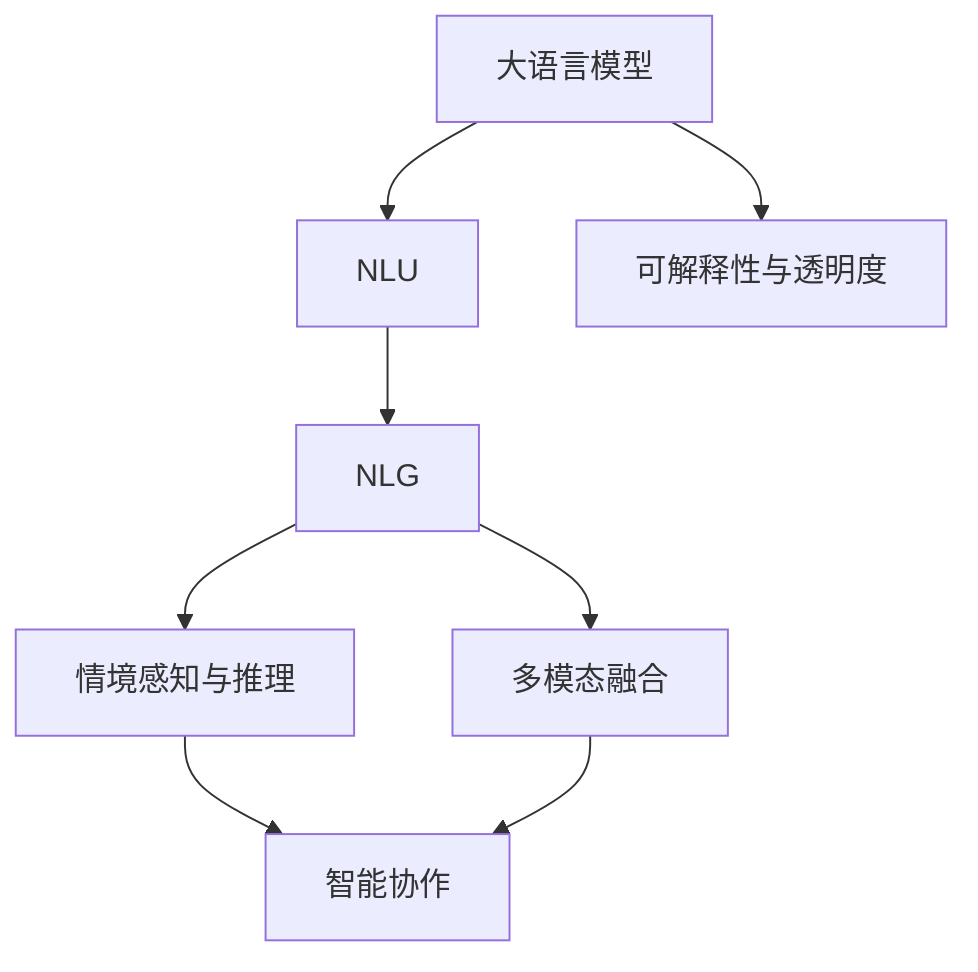

                 

## 1. 背景介绍

### 1.1 问题由来

随着人工智能技术的不断进步，机器人在制造业、物流、服务行业等众多领域的应用日益广泛。传统的工业机器人多以精确控制、重复性作业为主，而智能化机器人则通过融入先进的感知与决策算法，提升了自动化系统的灵活性和适应性。

近年来，大语言模型(Large Language Models, LLMs)在自然语言处理(Natural Language Processing, NLP)领域取得了巨大突破。大模型通过在海量文本数据上进行预训练，获得了丰富的语言理解和生成能力。这种能力使得智能机器人可以更自然地进行人机交互，执行复杂任务，成为机器人技术的重要组成部分。

大语言模型与机器人的结合，不仅提升了机器人的智能化水平，还为其带来了新的可能性。例如，智能客服机器人、智能家居管理、智能医疗助手、智能安防监控等应用，都在借助大模型的语言理解能力，向智能化方向不断迈进。

### 1.2 问题核心关键点

大语言模型与机器人技术结合的核心在于如何构建具有强大语言理解能力、逻辑推理能力和情境感知能力的智能系统。主要涉及以下几个关键点：

1. **自然语言理解(NLU)**：将自然语言转化为机器可理解的形式，如文本解析、意图识别等。
2. **自然语言生成(NLG)**：根据任务需求，生成自然语言文本或指令，如对话回复、自动翻译等。
3. **情境感知与推理**：结合当前情境信息，进行推理和决策，提升系统的响应速度和准确性。
4. **多模态融合**：将视觉、听觉、触觉等多模态数据与语言信息结合，实现综合感知与智能决策。
5. **智能协作**：在多智能体系统中，实现不同机器人之间的通信、协作和资源共享。
6. **可解释性与透明度**：提升系统的决策可解释性，增强用户对系统行为的信任。

这些核心点共同构成了智能机器人与大语言模型结合的基础，为其应用提供了坚实的技术支撑。

### 1.3 问题研究意义

大语言模型与机器人技术的结合，不仅能够极大地提升机器人的智能化水平，还能在智能制造、智能服务、智能家居等多个领域带来颠覆性的创新。其研究意义在于：

1. **降低制造与运营成本**：智能化机器人能够执行复杂的装配、检测、物流等任务，减少对人工的依赖，提高生产效率，降低成本。
2. **提升服务质量与效率**：在服务行业，智能机器人能够24小时提供高质量的服务，如智能客服、智能导购等，大大提升了用户体验。
3. **优化工作环境**：机器人可以执行危险、复杂的工作任务，减轻人力负担，改善工作环境。
4. **创新商业模式**：基于机器人与大语言模型的智能系统，可以提供新的服务和产品，如智能仓储、智能安防、智能娱乐等，开拓新的商业机会。
5. **推动产业升级**：通过引入先进技术，改造传统制造业与服务业，推动产业的数字化、智能化转型。

总之，机器人技术与大语言模型的结合，将为各个行业带来全新的变革，推动社会向智能化方向快速发展。

## 2. 核心概念与联系

### 2.1 核心概念概述

为更好地理解机器人技术与大语言模型结合的核心技术，本节将介绍几个密切相关的核心概念：

- **大语言模型(Large Language Model, LLM)**：以自回归(如GPT)或自编码(如BERT)模型为代表的大规模预训练语言模型。通过在大规模无标签文本语料上进行预训练，学习通用的语言表示，具备强大的语言理解和生成能力。
- **自然语言理解(NLU)**：将自然语言文本转化为结构化数据，供机器进行处理，如分词、词性标注、实体识别等。
- **自然语言生成(NLG)**：根据机器处理的结果，生成自然语言文本，如对话回复、文本摘要、机器翻译等。
- **情境感知与推理**：结合当前情境信息，如时间、地点、任务背景等，进行推理和决策，提升系统的响应速度和准确性。
- **多模态融合**：将视觉、听觉、触觉等多模态数据与语言信息结合，实现综合感知与智能决策。
- **智能协作**：在多智能体系统中，实现不同机器人之间的通信、协作和资源共享。
- **可解释性与透明度**：提升系统的决策可解释性，增强用户对系统行为的信任。

这些核心概念之间的逻辑关系可以通过以下Mermaid流程图来展示：



这个流程图展示了从大语言模型到多模态智能系统构建的全过程，其中NLU和NLG是大语言模型与多模态融合的重要桥梁，情境感知与推理、智能协作、可解释性与透明度则是系统智能化程度的核心体现。

## 3. 核心算法原理 & 具体操作步骤
### 3.1 算法原理概述

机器人技术与大语言模型结合的核心算法原理在于如何通过语言理解和生成，实现机器人的智能决策和行动。具体来说，可以分为以下几个步骤：

1. **自然语言理解(NLU)**：将用户输入的自然语言文本转化为结构化数据，如分词、词性标注、命名实体识别等。
2. **情境感知与推理**：结合当前情境信息，如时间、地点、任务背景等，进行推理和决策。
3. **自然语言生成(NLG)**：根据推理结果，生成自然语言文本，作为机器人的动作指令或回复。
4. **执行与反馈**：机器人根据指令执行相应的动作，并将反馈信息返回到系统中，以便进一步优化。

### 3.2 算法步骤详解

以下详细介绍机器人技术与大语言模型结合的核心算法步骤：

**Step 1: 准备大语言模型和任务数据**
- 选择合适的大语言模型，如GPT、BERT等，作为初始化参数。
- 收集机器人执行任务的示例数据，如对话记录、操作指令、环境感知数据等，构建标注数据集。

**Step 2: 设计任务适配层**
- 根据任务需求，设计合适的任务适配层，如意图识别器、对话管理模块、动作执行器等。
- 选择合适的输出层和损失函数，如交叉熵、均方误差等。

**Step 3: 训练模型**
- 使用标注数据集，通过微调大语言模型，优化其在特定任务上的表现。
- 根据任务复杂度，选择适当的学习率和迭代次数。

**Step 4: 系统集成与测试**
- 将训练好的模型与机器人控制系统集成。
- 在实际环境中测试机器人性能，评估任务执行效果。
- 根据测试结果，不断调整和优化模型。

### 3.3 算法优缺点

机器人技术与大语言模型结合的方法具有以下优点：
1. **提升智能化水平**：通过大语言模型的自然语言理解与生成能力，机器人能够更加智能地执行复杂任务。
2. **降低开发成本**：基于成熟的大语言模型进行微调，减少了从头开发所需的计算和人力成本。
3. **适应性强**：大语言模型能够灵活适应不同任务和场景，提升了系统的通用性。

同时，该方法也存在一些局限性：
1. **数据依赖性强**：机器人任务的性能很大程度上取决于标注数据的质量和数量。
2. **计算资源需求高**：训练大语言模型需要强大的计算资源，对硬件要求较高。
3. **模型复杂度高**：多模态融合和情境感知增加了模型的复杂度，增加了维护难度。
4. **系统鲁棒性不足**：在复杂环境或突发情况下，机器人系统的鲁棒性需要进一步提高。

### 3.4 算法应用领域

机器人技术与大语言模型结合的方法，已经在多个领域得到了广泛应用：

1. **智能客服机器人**：使用大语言模型进行意图识别和对话管理，提升客户服务质量。
2. **智能家居管理**：通过自然语言理解，控制家电设备，实现智能家居场景。
3. **智能医疗助手**：结合医学知识库，进行病情分析和医疗咨询。
4. **智能安防监控**：识别异常行为，生成报警指令，提升安全防护能力。
5. **智能物流与仓储**：通过自然语言理解，执行订单处理、货物配送等任务。
6. **智能娱乐与互动**：实现人机交互，提供个性化娱乐体验。

随着技术的不断发展，机器人技术与大语言模型结合的应用场景将更加多样，为各个行业带来新的创新和变革。

## 4. 数学模型和公式 & 详细讲解 & 举例说明

### 4.1 数学模型构建

在机器人技术与大语言模型结合的过程中，数学模型主要集中在自然语言处理和情境感知推理两个方面。以下是两个典型的数学模型构建过程。

**自然语言理解(NLU)**
- **输入**：用户输入的自然语言文本 $x$。
- **模型输出**：结构化表示 $y$，如意图、实体等。
- **损失函数**：交叉熵损失 $L(x,y)$。
- **优化目标**：最小化损失函数 $L(x,y)$。

**情境感知与推理**
- **输入**：当前情境信息 $c$，自然语言文本 $x$。
- **模型输出**：推理结果 $a$，如任务执行动作、对话回复等。
- **损失函数**：交叉熵损失 $L(x,a)$。
- **优化目标**：最小化损失函数 $L(x,a)$。

### 4.2 公式推导过程

**自然语言理解(NLU)**
- **分词与词性标注**：将文本 $x$ 分词并标注词性，得到序列 $s$。
- **命名实体识别**：将文本 $x$ 转化为命名实体序列 $e$。
- **损失函数**：
  $$
  L(x,y) = -\frac{1}{N}\sum_{i=1}^N [y_i\log p(s_i|x) + (1-y_i)\log(1-p(s_i|x))]
  $$
  其中 $p(s_i|x)$ 为模型在文本 $x$ 中预测序列 $s_i$ 的概率。

**情境感知与推理**
- **时间与空间感知**：结合当前时间 $t$ 和地点 $l$，生成情境表示 $c$。
- **任务推理**：将文本 $x$ 和情境表示 $c$ 输入模型，生成推理结果 $a$。
- **损失函数**：
  $$
  L(x,a) = -\frac{1}{N}\sum_{i=1}^N [y_i\log p(a_i|x,c) + (1-y_i)\log(1-p(a_i|x,c))]
  $$
  其中 $p(a_i|x,c)$ 为模型在文本 $x$ 和情境表示 $c$ 中预测推理结果 $a_i$ 的概率。

### 4.3 案例分析与讲解

**案例分析：智能客服机器人**
- **任务适配层**：意图识别器、对话管理模块、响应生成器。
- **自然语言理解(NLU)**：使用BERT模型进行分词和意图识别。
- **情境感知与推理**：结合时间、地点信息，生成对话上下文，进行对话管理。
- **自然语言生成(NLG)**：使用GPT模型生成对话回复。

**案例讲解：智能家居管理**
- **任务适配层**：设备控制模块、场景生成器、语言翻译器。
- **自然语言理解(NLU)**：使用BERT模型进行语音识别和意图理解。
- **情境感知与推理**：结合家居环境信息，生成智能场景。
- **自然语言生成(NLG)**：使用GPT模型生成控制指令。

## 5. 项目实践：代码实例和详细解释说明
### 5.1 开发环境搭建

在进行机器人技术与大语言模型结合的实践前，我们需要准备好开发环境。以下是使用Python进行PyTorch开发的环境配置流程：

1. 安装Anaconda：从官网下载并安装Anaconda，用于创建独立的Python环境。
2. 创建并激活虚拟环境：
```bash
conda create -n pytorch-env python=3.8 
conda activate pytorch-env
```
3. 安装PyTorch：根据CUDA版本，从官网获取对应的安装命令。例如：
```bash
conda install pytorch torchvision torchaudio cudatoolkit=11.1 -c pytorch -c conda-forge
```
4. 安装Transformers库：
```bash
pip install transformers
```
5. 安装各类工具包：
```bash
pip install numpy pandas scikit-learn matplotlib tqdm jupyter notebook ipython
```

完成上述步骤后，即可在`pytorch-env`环境中开始实践。

### 5.2 源代码详细实现

下面我们以智能客服机器人为例，给出使用Transformers库对BERT模型进行微调的PyTorch代码实现。

首先，定义任务适配层：

```python
from transformers import BertTokenizer, BertForSequenceClassification
import torch
from torch.utils.data import Dataset, DataLoader

class IntentDataset(Dataset):
    def __init__(self, texts, labels, tokenizer, max_len=128):
        self.texts = texts
        self.labels = labels
        self.tokenizer = tokenizer
        self.max_len = max_len
        
    def __len__(self):
        return len(self.texts)
    
    def __getitem__(self, item):
        text = self.texts[item]
        label = self.labels[item]
        
        encoding = self.tokenizer(text, return_tensors='pt', max_length=self.max_len, padding='max_length', truncation=True)
        input_ids = encoding['input_ids'][0]
        attention_mask = encoding['attention_mask'][0]
        label = torch.tensor(label, dtype=torch.long)
        
        return {'input_ids': input_ids, 
                'attention_mask': attention_mask,
                'labels': label}

# 初始化tokenizer和模型
tokenizer = BertTokenizer.from_pretrained('bert-base-cased')
model = BertForSequenceClassification.from_pretrained('bert-base-cased', num_labels=6)

# 准备数据集
train_dataset = IntentDataset(train_texts, train_labels, tokenizer, max_len=128)
dev_dataset = IntentDataset(dev_texts, dev_labels, tokenizer, max_len=128)
test_dataset = IntentDataset(test_texts, test_labels, tokenizer, max_len=128)

# 设置超参数
optimizer = AdamW(model.parameters(), lr=2e-5)
batch_size = 16
epochs = 5

# 训练模型
device = torch.device('cuda') if torch.cuda.is_available() else torch.device('cpu')
model.to(device)

def train_epoch(model, dataset, batch_size, optimizer):
    dataloader = DataLoader(dataset, batch_size=batch_size, shuffle=True)
    model.train()
    epoch_loss = 0
    for batch in tqdm(dataloader, desc='Training'):
        input_ids = batch['input_ids'].to(device)
        attention_mask = batch['attention_mask'].to(device)
        labels = batch['labels'].to(device)
        model.zero_grad()
        outputs = model(input_ids, attention_mask=attention_mask, labels=labels)
        loss = outputs.loss
        epoch_loss += loss.item()
        loss.backward()
        optimizer.step()
    return epoch_loss / len(dataloader)

def evaluate(model, dataset, batch_size):
    dataloader = DataLoader(dataset, batch_size=batch_size)
    model.eval()
    preds, labels = [], []
    with torch.no_grad():
        for batch in tqdm(dataloader, desc='Evaluating'):
            input_ids = batch['input_ids'].to(device)
            attention_mask = batch['attention_mask'].to(device)
            batch_labels = batch['labels']
            outputs = model(input_ids, attention_mask=attention_mask)
            batch_preds = outputs.logits.argmax(dim=2).to('cpu').tolist()
            batch_labels = batch_labels.to('cpu').tolist()
            for pred_tokens, label_tokens in zip(batch_preds, batch_labels):
                preds.append(pred_tokens[:len(label_tokens)])
                labels.append(label_tokens)
                
    print(classification_report(labels, preds))
```

然后，训练模型并在验证集上评估：

```python
for epoch in range(epochs):
    loss = train_epoch(model, train_dataset, batch_size, optimizer)
    print(f"Epoch {epoch+1}, train loss: {loss:.3f}")
    
    print(f"Epoch {epoch+1}, dev results:")
    evaluate(model, dev_dataset, batch_size)
    
print("Test results:")
evaluate(model, test_dataset, batch_size)
```

以上就是使用PyTorch对BERT进行意图识别任务微调的完整代码实现。可以看到，得益于Transformers库的强大封装，我们可以用相对简洁的代码完成BERT模型的加载和微调。

### 5.3 代码解读与分析

让我们再详细解读一下关键代码的实现细节：

**IntentDataset类**：
- `__init__`方法：初始化文本、标签、分词器等关键组件。
- `__len__`方法：返回数据集的样本数量。
- `__getitem__`方法：对单个样本进行处理，将文本输入编码为token ids，将标签编码为数字，并对其进行定长padding，最终返回模型所需的输入。

**model参数**：
- 使用`BertForSequenceClassification`模型，设置输出层的数为6（意图分类）。

**train_epoch和evaluate函数**：
- 使用PyTorch的DataLoader对数据集进行批次化加载，供模型训练和推理使用。
- 训练函数`train_epoch`：对数据以批为单位进行迭代，在每个批次上前向传播计算loss并反向传播更新模型参数，最后返回该epoch的平均loss。
- 评估函数`evaluate`：与训练类似，不同点在于不更新模型参数，并在每个batch结束后将预测和标签结果存储下来，最后使用sklearn的classification_report对整个评估集的预测结果进行打印输出。

**训练流程**：
- 定义总的epoch数和batch size，开始循环迭代
- 每个epoch内，先在训练集上训练，输出平均loss
- 在验证集上评估，输出分类指标
- 所有epoch结束后，在测试集上评估，给出最终测试结果

可以看到，PyTorch配合Transformers库使得BERT微调的代码实现变得简洁高效。开发者可以将更多精力放在数据处理、模型改进等高层逻辑上，而不必过多关注底层的实现细节。

当然，工业级的系统实现还需考虑更多因素，如模型的保存和部署、超参数的自动搜索、更灵活的任务适配层等。但核心的微调范式基本与此类似。

## 6. 实际应用场景
### 6.1 智能客服系统

基于大语言模型与机器人技术结合的对话系统，可以广泛应用于智能客服系统的构建。传统客服往往需要配备大量人力，高峰期响应缓慢，且一致性和专业性难以保证。而使用微调后的对话系统，可以7x24小时不间断服务，快速响应客户咨询，用自然流畅的语言解答各类常见问题。

在技术实现上，可以收集企业内部的历史客服对话记录，将问题和最佳答复构建成监督数据，在此基础上对预训练对话系统进行微调。微调后的对话系统能够自动理解用户意图，匹配最合适的答案模板进行回复。对于客户提出的新问题，还可以接入检索系统实时搜索相关内容，动态组织生成回答。如此构建的智能客服系统，能大幅提升客户咨询体验和问题解决效率。

### 6.2 金融舆情监测

金融机构需要实时监测市场舆论动向，以便及时应对负面信息传播，规避金融风险。传统的人工监测方式成本高、效率低，难以应对网络时代海量信息爆发的挑战。基于大语言模型与机器人技术结合的文本分类和情感分析技术，为金融舆情监测提供了新的解决方案。

具体而言，可以收集金融领域相关的新闻、报道、评论等文本数据，并对其进行主题标注和情感标注。在此基础上对预训练语言模型进行微调，使其能够自动判断文本属于何种主题，情感倾向是正面、中性还是负面。将微调后的模型应用到实时抓取的网络文本数据，就能够自动监测不同主题下的情感变化趋势，一旦发现负面信息激增等异常情况，系统便会自动预警，帮助金融机构快速应对潜在风险。

### 6.3 个性化推荐系统

当前的推荐系统往往只依赖用户的历史行为数据进行物品推荐，无法深入理解用户的真实兴趣偏好。基于大语言模型与机器人技术结合的个性化推荐系统，可以更好地挖掘用户行为背后的语义信息，从而提供更精准、多样的推荐内容。

在实践中，可以收集用户浏览、点击、评论、分享等行为数据，提取和用户交互的物品标题、描述、标签等文本内容。将文本内容作为模型输入，用户的后续行为（如是否点击、购买等）作为监督信号，在此基础上微调预训练语言模型。微调后的模型能够从文本内容中准确把握用户的兴趣点。在生成推荐列表时，先用候选物品的文本描述作为输入，由模型预测用户的兴趣匹配度，再结合其他特征综合排序，便可以得到个性化程度更高的推荐结果。

### 6.4 未来应用展望

随着大语言模型与机器人技术的不断发展，基于该技术结合的智能系统将在更多领域得到应用，为传统行业带来变革性影响。

在智慧医疗领域，基于大语言模型与机器人技术的智能问答、病历分析、药物研发等应用将提升医疗服务的智能化水平，辅助医生诊疗，加速新药开发进程。

在智能教育领域，结合自然语言理解和生成能力，智能机器人可以提供更加个性化的教育服务，因材施教，促进教育公平，提高教学质量。

在智慧城市治理中，基于多模态数据融合和情境感知推理，智能机器人可以实现城市事件监测、舆情分析、应急指挥等环节，提高城市管理的自动化和智能化水平，构建更安全、高效的未来城市。

此外，在企业生产、社会治理、文娱传媒等众多领域，基于大语言模型与机器人技术结合的人工智能应用也将不断涌现，为经济社会发展注入新的动力。相信随着技术的日益成熟，该技术结合将引领人工智能技术迈向更高的台阶，为构建智能、普适、安全的未来社会提供坚实基础。

## 7. 工具和资源推荐
### 7.1 学习资源推荐

为了帮助开发者系统掌握大语言模型与机器人技术的理论基础和实践技巧，这里推荐一些优质的学习资源：

1. 《Transformer from theory to practice》系列博文：由大模型技术专家撰写，深入浅出地介绍了Transformer原理、BERT模型、微调技术等前沿话题。
2. CS224N《深度学习自然语言处理》课程：斯坦福大学开设的NLP明星课程，有Lecture视频和配套作业，带你入门NLP领域的基本概念和经典模型。
3. 《Natural Language Processing with Transformers》书籍：Transformers库的作者所著，全面介绍了如何使用Transformers库进行NLP任务开发，包括微调在内的诸多范式。
4. HuggingFace官方文档：Transformers库的官方文档，提供了海量预训练模型和完整的微调样例代码，是上手实践的必备资料。
5. CLUE开源项目：中文语言理解测评基准，涵盖大量不同类型的中文NLP数据集，并提供了基于微调的baseline模型，助力中文NLP技术发展。

通过对这些资源的学习实践，相信你一定能够快速掌握大语言模型与机器人技术的精髓，并用于解决实际的NLP问题。
###  7.2 开发工具推荐

高效的开发离不开优秀的工具支持。以下是几款用于大语言模型与机器人技术结合开发的常用工具：

1. PyTorch：基于Python的开源深度学习框架，灵活动态的计算图，适合快速迭代研究。大部分预训练语言模型都有PyTorch版本的实现。
2. TensorFlow：由Google主导开发的开源深度学习框架，生产部署方便，适合大规模工程应用。同样有丰富的预训练语言模型资源。
3. Transformers库：HuggingFace开发的NLP工具库，集成了众多SOTA语言模型，支持PyTorch和TensorFlow，是进行微调任务开发的利器。
4. Weights & Biases：模型训练的实验跟踪工具，可以记录和可视化模型训练过程中的各项指标，方便对比和调优。与主流深度学习框架无缝集成。
5. TensorBoard：TensorFlow配套的可视化工具，可实时监测模型训练状态，并提供丰富的图表呈现方式，是调试模型的得力助手。
6. Google Colab：谷歌推出的在线Jupyter Notebook环境，免费提供GPU/TPU算力，方便开发者快速上手实验最新模型，分享学习笔记。

合理利用这些工具，可以显著提升大语言模型与机器人技术结合的开发效率，加快创新迭代的步伐。

### 7.3 相关论文推荐

大语言模型与机器人技术的结合源于学界的持续研究。以下是几篇奠基性的相关论文，推荐阅读：

1. Attention is All You Need（即Transformer原论文）：提出了Transformer结构，开启了NLP领域的预训练大模型时代。
2. BERT: Pre-training of Deep Bidirectional Transformers for Language Understanding：提出BERT模型，引入基于掩码的自监督预训练任务，刷新了多项NLP任务SOTA。
3. Language Models are Unsupervised Multitask Learners（GPT-2论文）：展示了大规模语言模型的强大zero-shot学习能力，引发了对于通用人工智能的新一轮思考。
4. Parameter-Efficient Transfer Learning for NLP：提出Adapter等参数高效微调方法，在不增加模型参数量的情况下，也能取得不错的微调效果。
5. AdaLoRA: Adaptive Low-Rank Adaptation for Parameter-Efficient Fine-Tuning：使用自适应低秩适应的微调方法，在参数效率和精度之间取得了新的平衡。
6. Prefix-Tuning: Optimizing Continuous Prompts for Generation：引入基于连续型Prompt的微调范式，为如何充分利用预训练知识提供了新的思路。

这些论文代表了大语言模型与机器人技术的结合发展脉络。通过学习这些前沿成果，可以帮助研究者把握学科前进方向，激发更多的创新灵感。

## 8. 总结：未来发展趋势与挑战

### 8.1 总结

本文对大语言模型与机器人技术结合的理论基础和实践应用进行了全面系统的介绍。首先阐述了大语言模型与机器人技术结合的研究背景和意义，明确了二者结合的独特价值。其次，从原理到实践，详细讲解了大语言模型与机器人技术结合的数学模型和核心算法步骤，给出了微调任务开发的完整代码实例。同时，本文还广泛探讨了微调方法在智能客服、金融舆情、个性化推荐等多个行业领域的应用前景，展示了其巨大潜力。

通过本文的系统梳理，可以看到，大语言模型与机器人技术的结合为智能机器人技术带来了质的飞跃，使得机器人能够具备更强的语言理解、决策和执行能力。未来，随着技术不断进步，结合方式将更加多样，应用场景也将更加广泛，为各个行业带来更深的变革。

### 8.2 未来发展趋势

展望未来，大语言模型与机器人技术的结合将呈现以下几个发展趋势：

1. **智能化水平提升**：基于大语言模型与机器人技术的智能系统，将更加智能化，具备更强的自然语言理解和生成能力。
2. **多模态融合加强**：将视觉、听觉、触觉等多模态数据与语言信息结合，实现综合感知与智能决策。
3. **情境感知与推理增强**：结合当前情境信息，进行推理和决策，提升系统的响应速度和准确性。
4. **可解释性提升**：提升系统的决策可解释性，增强用户对系统行为的信任。
5. **协作能力增强**：在多智能体系统中，实现不同机器人之间的通信、协作和资源共享。
6. **服务化与云化**：将智能系统作为服务化产品部署，实现按需调度和资源共享。
7. **边缘计算支持**：支持在边缘设备上进行推理计算，减少对中心服务器的依赖。

这些趋势将进一步提升智能机器人的智能化水平和应用范围，为各行各业带来更深刻的变革。

### 8.3 面临的挑战

尽管大语言模型与机器人技术的结合已经取得了瞩目成就，但在迈向更加智能化、普适化应用的过程中，它仍面临着诸多挑战：

1. **数据依赖性强**：机器人任务的性能很大程度上取决于标注数据的质量和数量。
2. **计算资源需求高**：训练大语言模型需要强大的计算资源，对硬件要求较高。
3. **模型复杂度高**：多模态融合和情境感知增加了模型的复杂度，增加了维护难度。
4. **系统鲁棒性不足**：在复杂环境或突发情况下，机器人系统的鲁棒性需要进一步提高。
5. **可解释性不足**：当前机器人系统的决策过程缺乏可解释性，难以对其推理逻辑进行分析和调试。
6. **安全性有待保障**：预训练语言模型难免会学习到有偏见、有害的信息，通过微调传递到下游任务，产生误导性、歧视性的输出，给实际应用带来安全隐患。
7. **知识整合能力不足**：现有的智能系统往往局限于任务内数据，难以灵活吸收和运用更广泛的先验知识。

这些挑战需要研究者不断探索和解决，才能将大语言模型与机器人技术的结合推向更高层次的智能化水平。

### 8.4 研究展望

未来，针对上述挑战，我们需要在以下几个方面进行深入研究：

1. **无监督和半监督学习**：探索基于无监督和半监督学习的大语言模型与机器人技术结合方法，降低对标注数据的需求。
2. **参数高效与计算高效的微调范式**：开发更加参数高效和计算高效的微调方法，提升系统的智能化水平和资源利用效率。
3. **因果分析与推理**：引入因果分析和推理技术，增强系统的决策逻辑和可解释性。
4. **多模态融合与知识整合**：实现多模态数据与语言信息的深度融合，结合外部知识库和规则库，提升系统的知识整合能力。
5. **伦理与安全**：研究如何消除模型偏见，提升系统的伦理与安全性能，确保输出的公平、透明和可信。

通过不断探索和创新，大语言模型与机器人技术的结合必将迎来新的突破，为智能社会的构建提供坚实的技术基础。

## 9. 附录：常见问题与解答

**Q1：大语言模型与机器人技术结合的难点是什么？**

A: 大语言模型与机器人技术结合的难点主要在于以下几个方面：
1. **数据依赖性强**：机器人任务的性能很大程度上取决于标注数据的质量和数量。
2. **计算资源需求高**：训练大语言模型需要强大的计算资源，对硬件要求较高。
3. **模型复杂度高**：多模态融合和情境感知增加了模型的复杂度，增加了维护难度。
4. **系统鲁棒性不足**：在复杂环境或突发情况下，机器人系统的鲁棒性需要进一步提高。
5. **可解释性不足**：当前机器人系统的决策过程缺乏可解释性，难以对其推理逻辑进行分析和调试。
6. **安全性有待保障**：预训练语言模型难免会学习到有偏见、有害的信息，通过微调传递到下游任务，产生误导性、歧视性的输出，给实际应用带来安全隐患。
7. **知识整合能力不足**：现有的智能系统往往局限于任务内数据，难以灵活吸收和运用更广泛的先验知识。

**Q2：如何提高机器人系统的智能化水平？**

A: 提高机器人系统的智能化水平，可以从以下几个方面入手：
1. **大语言模型的引入**：利用大语言模型的自然语言理解与生成能力，提升机器人对自然语言文本的识别和响应能力。
2. **多模态数据融合**：结合视觉、听觉、触觉等多模态数据，增强机器人系统的综合感知能力。
3. **情境感知与推理**：利用情境信息，进行推理和决策，提升机器人系统的响应速度和准确性。
4. **知识图谱与规则库的引入**：结合外部知识库和规则库，增强机器人系统的知识整合能力。
5. **因果分析和博弈论工具**：利用因果分析方法和博弈论工具，增强机器人系统的决策逻辑和可解释性。
6. **持续学习与数据增强**：不断学习新数据，优化模型参数，提升机器人系统的鲁棒性和泛化能力。

**Q3：机器人系统如何进行自然语言理解？**

A: 机器人系统进行自然语言理解，通常采用以下方法：
1. **分词与词性标注**：将自然语言文本进行分词和词性标注，得到结构化表示。
2. **命名实体识别**：识别文本中的命名实体，如人名、地名、机构名等。
3. **意图识别**：判断用户输入的自然语言文本的意图，如咨询、投诉、查询等。
4. **对话管理**：根据用户意图，选择适当的对话模板或知识库，生成对话回复。

**Q4：机器人系统如何进行自然语言生成？**

A: 机器人系统进行自然语言生成，通常采用以下方法：
1. **生成式对话**：根据用户输入的自然语言文本，生成对话回复。
2. **文本摘要**：将长文本压缩成简短摘要。
3. **自动翻译**：将源语言文本翻译成目标语言。
4. **自动生成文档**：根据用户输入的参数和模板，自动生成文档或报告。

通过系统掌握自然语言理解与生成技术，机器人系统能够更加智能地执行任务，提升用户体验和应用效果。

---

作者：禅与计算机程序设计艺术 / Zen and the Art of Computer Programming

