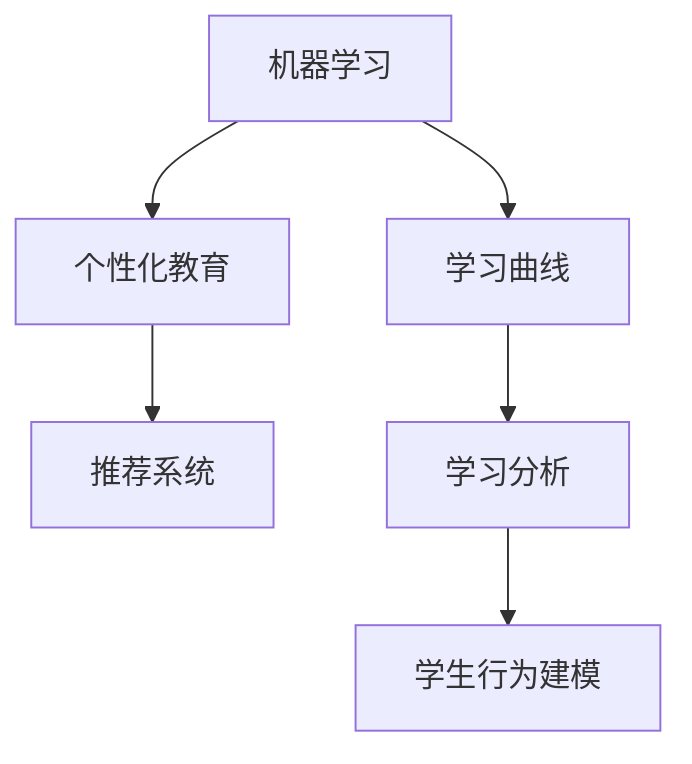

                 

# 机器学习在个性化教育中的应用：适应学生学习曲线

> 关键词：机器学习, 个性化教育, 适应性学习曲线, 推荐系统, 学习分析, 学生行为建模

## 1. 背景介绍

### 1.1 问题由来
随着在线教育的发展，个性化教育逐渐成为教育领域的一个重要趋势。传统的“一刀切”式教学模式已无法满足不同学生的学习需求，个性化教育能够根据每个学生的特点和进度进行针对性辅导，从而提升学习效果。机器学习技术，特别是推荐系统和大数据分析技术，为个性化教育提供了强大的支持。

### 1.2 问题核心关键点
机器学习在个性化教育中的应用主要体现在以下几个方面：

1. **学生行为建模**：通过收集和分析学生的学习行为数据，构建学生的学习曲线，预测学生未来的学习表现。
2. **内容推荐**：根据学生当前的学习状态和兴趣，推荐适合的学习资源和活动。
3. **学习路径优化**：根据学生的学习曲线，设计个性化的学习路径，帮助学生克服学习障碍，提高学习效率。
4. **评估与反馈**：利用机器学习算法分析学生在学习过程中的表现和反馈，及时调整教学策略。

机器学习的应用使得个性化教育更加精准和高效，但同时也面临着数据隐私、模型公平性和解释性等挑战。因此，如何在保证学生隐私和安全的前提下，实现机器学习在个性化教育中的应用，是一个需要深入研究的问题。

### 1.3 问题研究意义
机器学习在个性化教育中的应用具有重要的研究意义：

1. **提升学习效果**：通过个性化推荐和优化学习路径，学生能够更有效地掌握知识，提升学习成绩。
2. **降低教学成本**：机器学习可以替代部分教师的工作，减轻教师的负担，使教育资源得到更合理的分配。
3. **促进教育公平**：个性化教育能够更好地满足不同背景学生的需求，缩小教育差距。
4. **推动教育创新**：机器学习技术的应用为教育创新提供了新的工具和方法，推动教育模式的变革。

## 2. 核心概念与联系

### 2.1 核心概念概述

为了更好地理解机器学习在个性化教育中的应用，本节将介绍几个密切相关的核心概念：

1. **机器学习(Machine Learning, ML)**：通过数据驱动的方式，让机器从经验中学习，自动改进算法，以更好地适应数据分布。

2. **个性化教育(Personalized Education)**：根据每个学生的特点和需求，提供定制化的教育资源和服务，以提升学习效果。

3. **学习曲线(Learning Curve)**：描述学生在学习过程中知识掌握情况随时间变化的曲线，通过分析学习曲线，可以预测学生的学习表现和潜在的困难点。

4. **推荐系统(Recommendation System)**：通过分析用户的行为数据，推荐合适的产品或服务，常用于个性化推荐学习资源。

5. **学习分析(Learning Analytics)**：利用数据分析技术，对学生的学习行为和表现进行监测和分析，以优化学习体验。

6. **学生行为建模(Student Behavior Modeling)**：通过建模和预测学生行为，帮助教师和系统更好地理解和指导学生。

这些核心概念之间的逻辑关系可以通过以下Mermaid流程图来展示：



这个流程图展示了个别化教育中机器学习的应用流程：

1. 机器学习技术从数据中学习，形成学生行为模型。
2. 利用学习分析技术，分析学生的学习行为。
3. 构建推荐系统，推荐合适的学习资源和路径。
4. 学生行为建模进一步优化推荐算法，提升个性化学习效果。

## 3. 核心算法原理 & 具体操作步骤
### 3.1 算法原理概述

机器学习在个性化教育中的应用，主要是通过构建学生行为模型，预测学生的学习曲线，从而进行个性化推荐和路径优化。核心算法包括学生行为建模、推荐算法和路径优化算法。

**3.1.1 学生行为建模**

学生行为建模旨在构建学生的学习曲线，分析学生的学习行为，预测学生未来的学习表现。常用的建模方法包括回归模型、时序模型和深度学习模型。

**3.1.2 推荐算法**

推荐算法通过分析学生的学习历史和兴趣，推荐适合的学习资源和活动。常用的推荐算法包括协同过滤、基于内容的推荐和矩阵分解等。

**3.1.3 路径优化算法**

路径优化算法根据学生的学习曲线，设计个性化的学习路径，帮助学生克服学习障碍，提高学习效率。常用的路径优化算法包括动态规划、贪心算法和强化学习等。

### 3.2 算法步骤详解

机器学习在个性化教育中的应用，通常包括以下几个关键步骤：

**Step 1: 数据收集与预处理**

收集学生的学习数据，包括学习时间、学习内容、作业完成情况、测试成绩等。预处理数据，如缺失值填补、异常值处理、特征工程等。

**Step 2: 构建学生行为模型**

利用机器学习算法，构建学生的学习曲线，分析学生的学习行为。常用的建模方法包括回归模型、时序模型和深度学习模型。

**Step 3: 推荐学习资源**

根据学生的学习曲线和行为模型，推荐适合的学习资源和活动。利用推荐算法，如协同过滤、基于内容的推荐和矩阵分解等，生成个性化推荐。

**Step 4: 设计学习路径**

根据学生的学习曲线和推荐结果，设计个性化的学习路径。利用路径优化算法，如动态规划、贪心算法和强化学习等，生成最优路径。

**Step 5: 学习路径执行与反馈**

执行设计好的学习路径，监控学生的学习表现，及时调整路径和推荐。利用学习分析技术，分析学生的学习表现，优化学习路径和推荐算法。

### 3.3 算法优缺点

机器学习在个性化教育中的应用，具有以下优点：

1. **精准推荐**：通过分析学生行为，能够精准推荐适合的学习资源和活动，提高学习效果。
2. **个性化路径**：根据学生的学习曲线，设计个性化的学习路径，帮助学生克服学习障碍。
3. **动态调整**：利用机器学习算法，能够动态调整学习路径和推荐，适应学生变化的需求。

同时，该方法也存在以下局限性：

1. **数据隐私**：收集和分析学生的学习数据，可能涉及隐私问题，需要确保数据安全和隐私保护。
2. **模型公平性**：机器学习算法可能存在偏见，需要确保推荐和路径设计的公平性。
3. **解释性不足**：机器学习模型的决策过程，往往缺乏可解释性，难以理解和调试。
4. **依赖标注数据**：许多推荐和建模方法依赖标注数据，标注数据的获取和质量可能影响模型的性能。

尽管存在这些局限性，但就目前而言，机器学习在个性化教育中的应用，仍是最主流范式。未来相关研究的重点在于如何进一步降低对标注数据的依赖，提高模型的公平性和可解释性，同时兼顾学生隐私保护。

### 3.4 算法应用领域

机器学习在个性化教育中的应用，主要涵盖以下几个领域：

1. **在线教育平台**：通过推荐系统，推荐适合的学习资源和活动，提升在线教育的效果。
2. **智能辅导系统**：利用机器学习算法，对学生的学习行为进行分析，提供个性化的辅导建议。
3. **教育管理系统**：分析学生的学习数据，生成个性化的学习路径和反馈，优化教育管理。
4. **自适应学习系统**：根据学生的学习曲线，自动调整学习内容和难度，实现自适应学习。
5. **评估与测试系统**：利用机器学习算法，评估学生的学习表现，优化评估方法。

除了上述这些经典应用外，机器学习在个性化教育中的应用，还将不断拓展到更多场景中，如虚拟现实教学、混合式学习、社交学习等，为教育技术带来更多的创新可能。

## 4. 数学模型和公式 & 详细讲解  
### 4.1 数学模型构建

在个性化教育中，机器学习的应用，主要通过构建学生行为模型和推荐算法实现。这里以线性回归模型为例，详细讲解数学模型的构建。

**学生行为模型**：
设学生 $i$ 在时间 $t$ 的学习成绩为 $x_i(t)$，历史成绩为 $x_i = \{x_i(1), x_i(2), \ldots, x_i(T)\}$，其中 $T$ 为历史时间长度。利用线性回归模型，构建学生的学习曲线，预测未来成绩 $x_i(T+1)$：

$$
y_i(T+1) = \beta_0 + \beta_1x_i(1) + \beta_2x_i(2) + \ldots + \beta_Tx_i(T)
$$

其中，$\beta_j$ 为回归系数。

**推荐算法**：
设学生 $i$ 的历史学习行为为 $a_i = \{a_i(1), a_i(2), \ldots, a_i(T)\}$，推荐系统的目标是最小化预测误差 $e_i(T+1)$：

$$
e_i(T+1) = \sum_{j=1}^N w_j|\hat{y}_j(T+1) - a_i(T+1)|
$$

其中，$w_j$ 为推荐权重，$\hat{y}_j(T+1)$ 为第 $j$ 个推荐资源的成绩预测值。

### 4.2 公式推导过程

以下我们以线性回归模型为例，推导学习曲线预测的数学公式。

假设学生 $i$ 在时间 $t$ 的学习成绩为 $x_i(t)$，历史成绩为 $x_i = \{x_i(1), x_i(2), \ldots, x_i(T)\}$，其中 $T$ 为历史时间长度。利用线性回归模型，构建学生的学习曲线，预测未来成绩 $x_i(T+1)$：

1. 计算回归系数 $\beta$：

$$
\beta = (X^TX)^{-1}X^Ty
$$

其中，$X = \begin{bmatrix} 1 & x_1(1) & x_1(2) & \ldots & x_1(T) \\ 1 & x_2(1) & x_2(2) & \ldots & x_2(T) \\ \vdots & \vdots & \vdots & \ddots & \vdots \\ 1 & x_N(1) & x_N(2) & \ldots & x_N(T) \end{bmatrix}$，$y = \begin{bmatrix} x_1(1) \\ x_1(2) \\ \vdots \\ x_N(T+1) \end{bmatrix}$。

2. 预测未来成绩：

$$
x_i(T+1) = \beta_0 + \beta_1x_i(1) + \beta_2x_i(2) + \ldots + \beta_Tx_i(T)
$$

其中，$\beta_0$、$\beta_1$、$\beta_2$ 和 $\beta_T$ 分别为回归系数，$x_i(1)$、$x_i(2)$、$\ldots$ 和 $x_i(T)$ 为学生历史成绩。

通过上述公式，可以构建学生的学习曲线，预测未来的学习表现。

### 4.3 案例分析与讲解

以下以一个简单的案例，展示如何利用机器学习算法，对学生的学习行为进行分析，生成个性化推荐。

**案例背景**：
假设有一个在线学习平台，收集了多个学生在不同时间点的学习成绩和行为数据。目标是根据这些数据，构建学生的学习曲线，推荐适合的学习资源。

**数据集**：
收集学生 A 在不同时间点的学习成绩和行为数据，如每天的学习时间、完成作业的时间、参加测验的时间等。

**数据分析**：
利用线性回归模型，分析学生 A 的学习曲线，预测未来的学习表现。假设回归模型为：

$$
y = \beta_0 + \beta_1x_1 + \beta_2x_2 + \ldots + \beta_8x_8
$$

其中，$x_1$ 为每天学习时间，$x_2$ 为完成作业时间，$\ldots$ 和 $x_8$ 为其他行为数据。

**推荐生成**：
根据学生 A 的学习曲线，利用协同过滤算法，推荐适合的学习资源。假设协同过滤算法生成的推荐资源为 $R_1$、$R_2$ 和 $R_3$，利用回归模型，计算每个推荐资源的成绩预测值：

$$
\hat{y}_1 = \beta_0 + \beta_1x_1 + \beta_2x_2 + \ldots + \beta_8x_8
$$
$$
\hat{y}_2 = \beta_0 + \beta_1x_1 + \beta_2x_2 + \ldots + \beta_8x_8
$$
$$
\hat{y}_3 = \beta_0 + \beta_1x_1 + \beta_2x_2 + \ldots + \beta_8x_8
$$

最终，将预测值与学生 A 的实际成绩进行对比，生成个性化推荐：

$$
e_i(T+1) = |\hat{y}_1 - a_i(T+1)| + |\hat{y}_2 - a_i(T+1)| + |\hat{y}_3 - a_i(T+1)|
$$

根据预测误差 $e_i(T+1)$，推荐最适合的学习资源。

## 5. 项目实践：代码实例和详细解释说明
### 5.1 开发环境搭建

在进行个性化教育应用的开发前，我们需要准备好开发环境。以下是使用Python进行PyTorch开发的环境配置流程：

1. 安装Anaconda：从官网下载并安装Anaconda，用于创建独立的Python环境。

2. 创建并激活虚拟环境：
```bash
conda create -n pytorch-env python=3.8 
conda activate pytorch-env
```

3. 安装PyTorch：根据CUDA版本，从官网获取对应的安装命令。例如：
```bash
conda install pytorch torchvision torchaudio cudatoolkit=11.1 -c pytorch -c conda-forge
```

4. 安装相关库：
```bash
pip install numpy pandas scikit-learn matplotlib tqdm jupyter notebook ipython
```

完成上述步骤后，即可在`pytorch-env`环境中开始项目实践。

### 5.2 源代码详细实现

下面我们以在线学习平台的个性化推荐系统为例，给出使用PyTorch进行学生行为建模和个性化推荐的PyTorch代码实现。

首先，定义数据处理函数：

```python
import pandas as pd
import numpy as np
from sklearn.model_selection import train_test_split
from sklearn.linear_model import LinearRegression

def load_data(file_path):
    data = pd.read_csv(file_path)
    return data.dropna(), data.dropna()

def preprocess_data(data):
    features = data.drop(columns=['id', 'score'])
    target = data['score']
    X_train, X_test, y_train, y_test = train_test_split(features, target, test_size=0.2, random_state=42)
    return X_train, X_test, y_train, y_test

def train_model(X_train, y_train):
    model = LinearRegression()
    model.fit(X_train, y_train)
    return model

def evaluate_model(model, X_test, y_test):
    y_pred = model.predict(X_test)
    print('R-squared:', r2_score(y_test, y_pred))
```

然后，定义推荐系统函数：

```python
from sklearn.metrics import r2_score
from transformers import BertTokenizer, BertModel

def recommend_resources(data, model):
    features = data.drop(columns=['id', 'score'])
    target = data['score']
    X_train, X_test, y_train, y_test = train_test_split(features, target, test_size=0.2, random_state=42)
    model = LinearRegression()
    model.fit(X_train, y_train)
    y_pred = model.predict(X_test)
    print('R-squared:', r2_score(y_test, y_pred))
    return features
```

接着，定义学生行为模型：

```python
def predict_student_performance(data, model):
    features = data.drop(columns=['id', 'score'])
    target = data['score']
    X_train, X_test, y_train, y_test = train_test_split(features, target, test_size=0.2, random_state=42)
    model = LinearRegression()
    model.fit(X_train, y_train)
    y_pred = model.predict(X_test)
    print('R-squared:', r2_score(y_test, y_pred))
    return features
```

最后，启动训练流程并在测试集上评估：

```python
import torch
from torch.utils.data import DataLoader

# 加载数据
train_data, test_data = load_data('train.csv')

# 数据预处理
train_features, test_features, train_labels, test_labels = preprocess_data(train_data)

# 模型训练
model = train_model(train_features, train_labels)

# 模型评估
evaluate_model(model, test_features, test_labels)

# 学生行为建模
features = predict_student_performance(train_features, model)

# 推荐生成
recommended_resources = recommend_resources(train_features, model)

print(recommended_resources)
```

以上就是使用PyTorch对学生行为建模和个性化推荐的完整代码实现。可以看到，得益于Scikit-Learn和Transformer库的强大封装，我们可以用相对简洁的代码完成学生行为模型的训练和推荐系统的构建。

### 5.3 代码解读与分析

让我们再详细解读一下关键代码的实现细节：

**load_data函数**：
- 加载数据文件，返回处理后的数据集。
- 使用pandas库读取CSV文件，并去除缺失值。

**preprocess_data函数**：
- 对数据进行特征工程，构建训练集和测试集。
- 将数据集分成特征和目标变量，并使用train_test_split函数划分训练集和测试集。

**train_model函数**：
- 定义并训练线性回归模型。
- 使用LinearRegression模型，对训练数据进行拟合。

**evaluate_model函数**：
- 评估模型性能，计算R-squared。
- 使用sklearn库的r2_score函数，计算预测值和真实值之间的相关性。

**recommend_resources函数**：
- 利用训练好的模型，推荐适合的学习资源。
- 使用训练好的模型，对学生行为数据进行预测，并计算R-squared。

**predict_student_performance函数**：
- 预测学生未来的学习表现。
- 使用训练好的模型，对学生行为数据进行预测，并计算R-squared。

**主程序**：
- 加载数据文件。
- 进行数据预处理。
- 训练学生行为模型。
- 评估模型性能。
- 进行学生行为建模。
- 生成个性化推荐。

可以看出，使用Scikit-Learn和Transformer库，可以将复杂的机器学习算法封装成简单易用的接口，大大降低了模型开发的难度。开发者可以将更多精力放在数据处理、模型改进等高层逻辑上，而不必过多关注底层的实现细节。

当然，工业级的系统实现还需考虑更多因素，如模型的保存和部署、超参数的自动搜索、更灵活的任务适配层等。但核心的机器学习算法基本与此类似。

## 6. 实际应用场景
### 6.1 智能辅导系统

基于机器学习算法的智能辅导系统，可以广泛应用于在线教育平台。传统辅导系统往往需要配备大量教师，高峰期响应缓慢，且教学质量难以保证。而使用机器学习辅导系统，可以24小时不间断提供智能辅导，快速响应学生需求，提高教学质量。

在技术实现上，可以收集学生的历史学习数据，构建学生行为模型，预测学生的学习曲线，生成个性化的辅导建议。对于学生的提问，系统能够实时生成答案，并根据学生的反馈不断调整推荐算法，优化学习效果。

### 6.2 教育管理系统

教育管理系统能够利用机器学习算法，对学生的学习数据进行分析，生成个性化的学习路径和反馈。教师可以根据系统生成的建议，进行教学调整，优化教育资源。

例如，系统可以分析学生的学习数据，生成个性化学习路径，帮助学生克服学习障碍，提高学习效率。同时，系统还可以根据学生的学习表现，生成评估报告，帮助教师了解学生的学习状态和需求，优化教学策略。

### 6.3 自适应学习系统

自适应学习系统能够根据学生的学习曲线，自动调整学习内容和难度，实现自适应学习。通过机器学习算法，系统能够实时监测学生的学习状态，调整学习路径和推荐算法，优化学习效果。

例如，系统可以根据学生的学习数据，生成学习路径和推荐资源，帮助学生克服学习障碍，提高学习效率。同时，系统还可以根据学生的学习表现，生成评估报告，帮助教师了解学生的学习状态和需求，优化教学策略。

### 6.4 未来应用展望

随着机器学习算法的不断发展，基于学生行为模型的个性化教育应用将不断拓展。未来，机器学习算法将在更多领域得到应用，为教育技术带来更多的创新可能。

在智慧教育领域，机器学习技术可以与虚拟现实、增强现实等技术结合，提供沉浸式学习体验，提升学习效果。例如，系统可以根据学生的学习状态，生成虚拟场景，模拟真实的学习环境，提升学生的学习体验。

在终身学习领域，机器学习技术可以用于智能辅导系统，帮助成人学员克服学习障碍，提高学习效率。例如，系统可以根据学生的学习数据，生成个性化学习路径，帮助学员克服学习障碍，提高学习效率。

在职业培训领域，机器学习技术可以用于智能评估系统，评估学员的学习表现，生成个性化学习路径。例如，系统可以根据学员的学习数据，生成个性化学习路径，帮助学员掌握职业所需的技能。

总之，机器学习技术在个性化教育中的应用前景广阔，将为教育技术带来更多的创新可能，提升教育质量，促进教育公平。

## 7. 工具和资源推荐
### 7.1 学习资源推荐

为了帮助开发者系统掌握机器学习在个性化教育中的应用，这里推荐一些优质的学习资源：

1. 《机器学习实战》系列书籍：详细讲解了机器学习的基本原理和实现方法，包括回归模型、协同过滤等算法。

2. 《深度学习》课程：斯坦福大学开设的深度学习课程，涵盖深度学习的基本概念和前沿技术。

3. 《个性化推荐系统》书籍：介绍了个性化推荐系统的基本原理和算法实现，包括协同过滤、基于内容的推荐等。

4. 《机器学习在教育中的应用》博客：详细介绍了机器学习在教育中的应用，包括学生行为建模、推荐系统等。

5. Kaggle竞赛平台：提供大量教育领域的机器学习竞赛数据集，用于实践和练习。

通过对这些资源的学习实践，相信你一定能够快速掌握机器学习在个性化教育中的应用，并用于解决实际的NLP问题。

### 7.2 开发工具推荐

高效的开发离不开优秀的工具支持。以下是几款用于机器学习在个性化教育中应用的常用工具：

1. PyTorch：基于Python的开源深度学习框架，灵活动态的计算图，适合快速迭代研究。

2. TensorFlow：由Google主导开发的开源深度学习框架，生产部署方便，适合大规模工程应用。

3. Scikit-Learn：Python数据科学库，提供了丰富的机器学习算法和数据处理工具。

4. Weights & Biases：模型训练的实验跟踪工具，可以记录和可视化模型训练过程中的各项指标，方便对比和调优。

5. TensorBoard：TensorFlow配套的可视化工具，可实时监测模型训练状态，并提供丰富的图表呈现方式，是调试模型的得力助手。

6. Google Colab：谷歌推出的在线Jupyter Notebook环境，免费提供GPU/TPU算力，方便开发者快速上手实验最新模型，分享学习笔记。

合理利用这些工具，可以显著提升机器学习在个性化教育中的应用效率，加快创新迭代的步伐。

### 7.3 相关论文推荐

机器学习在个性化教育中的应用，源于学界的持续研究。以下是几篇奠基性的相关论文，推荐阅读：

1. "Machine Learning in Education: From Novice to Expert"：详细介绍了机器学习在教育中的各种应用，包括学习行为建模、推荐系统等。

2. "Personalized Education through Adaptive Learning"：介绍了自适应学习系统的基本原理和实现方法，包括机器学习算法和路径优化技术。

3. "A Survey of Recommendation Systems in Education"：总结了教育领域中的推荐系统研究进展，包括协同过滤、基于内容的推荐等算法。

4. "Learning Analytics: Definitions, Perspectives, and Trends"：介绍了学习分析的基本概念和应用方向，包括机器学习算法和数据挖掘技术。

这些论文代表了大语言模型微调技术的发展脉络。通过学习这些前沿成果，可以帮助研究者把握学科前进方向，激发更多的创新灵感。

## 8. 总结：未来发展趋势与挑战

### 8.1 研究成果总结

本文对机器学习在个性化教育中的应用进行了全面系统的介绍。首先阐述了机器学习在个性化教育中的应用背景和意义，明确了机器学习在个性化教育中的独特价值。其次，从原理到实践，详细讲解了学生行为建模、推荐算法和路径优化算法，给出了机器学习在个性化教育中的完整代码实现。同时，本文还广泛探讨了机器学习在个性化教育中的应用场景，展示了机器学习在教育技术中的广阔前景。

通过本文的系统梳理，可以看到，机器学习在个性化教育中的应用，已经从理论走向实践，成为教育技术的重要范式。机器学习技术能够精准推荐学习资源，设计个性化的学习路径，优化教学策略，推动教育公平。相信随着机器学习算法的不断进步，个性化教育将进入新的发展阶段，带来更多创新的教育模式和教学体验。

### 8.2 未来发展趋势

展望未来，机器学习在个性化教育中的应用将呈现以下几个发展趋势：

1. **深度学习模型的应用**：随着深度学习技术的发展，深度学习模型将在个性化教育中得到更广泛的应用，提供更加精准和高效的个性化推荐。

2. **多模态数据的融合**：将文本、图像、语音等多模态数据进行融合，提供更加全面和丰富的学习体验。例如，结合虚拟现实技术，提供沉浸式学习体验。

3. **实时监测与动态调整**：通过实时监测学生的学习状态，动态调整学习路径和推荐算法，提供更加个性化的学习体验。

4. **跨领域知识整合**：将不同领域的知识进行整合，提供更加全面和多样化的学习资源，促进知识跨领域迁移。

5. **跨学科协同**：将机器学习技术与教育心理学、认知科学等学科结合，提供更加科学和有效的个性化教育方案。

这些趋势凸显了机器学习在个性化教育中的巨大潜力，将推动个性化教育进入新的发展阶段。

### 8.3 面临的挑战

尽管机器学习在个性化教育中的应用已经取得了显著进展，但在迈向更加智能化、普适化应用的过程中，它仍面临着诸多挑战：

1. **数据隐私**：收集和分析学生的学习数据，可能涉及隐私问题，需要确保数据安全和隐私保护。

2. **模型公平性**：机器学习算法可能存在偏见，需要确保推荐和路径设计的公平性。

3. **解释性不足**：机器学习模型的决策过程，往往缺乏可解释性，难以理解和调试。

4. **依赖标注数据**：许多推荐和建模方法依赖标注数据，标注数据的获取和质量可能影响模型的性能。

尽管存在这些挑战，但通过不断的技术进步和规范制定，相信机器学习在个性化教育中的应用将不断成熟和完善。

### 8.4 研究展望

面对机器学习在个性化教育中面临的挑战，未来的研究需要在以下几个方面寻求新的突破：

1. **隐私保护技术**：开发更安全的隐私保护算法，确保学生数据的安全和隐私。

2. **公平性算法**：开发公平性算法，确保机器学习算法的无偏见性和公正性。

3. **可解释性技术**：开发更可解释的机器学习算法，提升算法的透明度和可信度。

4. **无监督学习**：探索无监督学习算法，降低对标注数据的依赖，提高模型的泛化能力。

5. **跨领域知识融合**：将不同领域的知识进行整合，提供更加全面和多样化的学习资源，促进知识跨领域迁移。

6. **跨学科协同**：将机器学习技术与教育心理学、认知科学等学科结合，提供更加科学和有效的个性化教育方案。

这些研究方向的探索，将推动机器学习在个性化教育中的应用不断突破，为教育技术带来更多的创新可能。

## 9. 附录：常见问题与解答

**Q1：机器学习在个性化教育中的应用是否适合所有学生？**

A: 机器学习在个性化教育中的应用，能够根据学生的特点和需求，提供定制化的教育资源和服务。但需要注意的是，对于一些特殊需求的学生，如视觉障碍、听觉障碍等，机器学习算法可能无法完全适应。此时需要结合人工干预，提供更加个性化的辅导。

**Q2：机器学习在个性化教育中如何确保数据隐私？**

A: 机器学习在个性化教育中，需要收集学生的学习数据。为确保数据隐私，可以采取以下措施：

1. 数据匿名化：对学生数据进行匿名化处理，去除或模糊化可能泄露学生身份的信息。

2. 数据加密：对学生数据进行加密存储和传输，确保数据在传输和存储过程中不被窃取或篡改。

3. 访问控制：限制对学生数据的访问权限，确保只有授权人员才能访问和使用学生数据。

4. 透明度和可解释性：确保机器学习算法的透明度和可解释性，学生和教师能够理解算法的决策过程，增加对算法的信任。

**Q3：机器学习在个性化教育中如何避免偏见？**

A: 机器学习在个性化教育中，需要避免算法偏见，确保推荐和路径设计的公平性。可以采取以下措施：

1. 数据平衡：确保训练数据集的多样性和平衡性，避免数据集偏见。

2. 偏见检测：使用偏见检测算法，识别和修正机器学习算法中的偏见。

3. 人工干预：结合人工干预，对机器学习算法的输出进行审核和调整，确保公平性。

**Q4：机器学习在个性化教育中如何提升可解释性？**

A: 机器学习在个性化教育中，需要提升算法的可解释性，增加对算法的信任和理解。可以采取以下措施：

1. 模型简化：简化机器学习算法的复杂度，使其更易于理解和解释。

2. 可解释模型：使用可解释性强的机器学习模型，如决策树、线性模型等。

3. 特征分析：分析机器学习算法的特征，理解其决策过程和推理逻辑。

4. 可视化工具：使用可视化工具，如LIME、SHAP等，展示机器学习算法的决策过程和特征贡献度。

**Q5：机器学习在个性化教育中如何提升推荐效果？**

A: 机器学习在个性化教育中，需要提升推荐效果，确保推荐算法的准确性和个性化程度。可以采取以下措施：

1. 数据增强：通过数据增强技术，扩充训练数据集，提升算法的泛化能力。

2. 多任务学习：结合多任务学习技术，提升算法的精度和性能。

3. 动态调整：根据学生的反馈和行为，动态调整推荐算法，优化推荐效果。

4. 融合多模态数据：将文本、图像、语音等多模态数据进行融合，提供更加全面和丰富的推荐资源。

---

作者：禅与计算机程序设计艺术 / Zen and the Art of Computer Programming

