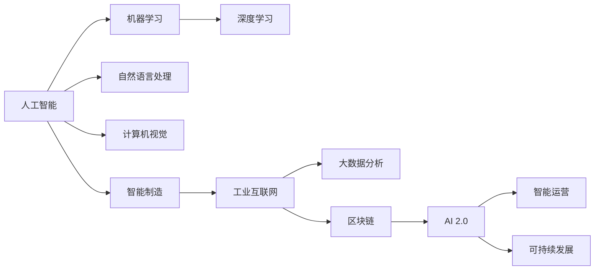

                 

# 李开复：AI 2.0 时代的产业

> 关键词：人工智能，产业升级，智能制造，大数据，AI 2.0

## 1. 背景介绍

### 1.1 问题由来

在过去十年中，人工智能（AI）技术取得了飞速的发展，从深度学习、机器学习到自然语言处理、计算机视觉，AI 技术在各个领域都展现出了强大的生命力。特别是在工业界，AI 技术的广泛应用已经开始深刻影响着传统产业的运营模式和业务流程。根据麦肯锡全球研究所的报告，全球制造业和医疗保健业将因此受益，到 2030 年，AI 将使全球生产率提高 13% 到 16%。然而，AI 技术在产业中的应用也面临着诸多挑战，比如技术标准不统一、数据隐私和安全问题、技能缺口等。这些问题迫切需要从政策、技术、人才等多方面进行解决，以实现 AI 技术的可持续发展。

### 1.2 问题核心关键点

AI 2.0 时代的产业升级主要集中在以下几个方面：

- **智能化生产：** 利用 AI 技术优化生产流程，提高生产效率和产品质量。例如，在制造业中使用智能机器人、自动化仓储系统和智能质量控制系统。
- **大数据分析：** 通过对生产数据、供应链数据和市场数据的深入分析，优化资源配置，降低成本，提升竞争力。
- **个性化定制：** 利用 AI 进行市场细分和个性化推荐，满足消费者对个性化的需求，提高客户满意度。
- **智能运营：** 利用 AI 进行财务预测、风险管理、客户服务等，提升运营效率和响应速度。
- **可持续发展：** 通过 AI 技术进行环境监测、资源优化和循环利用，推动绿色生产。

## 2. 核心概念与联系

### 2.1 核心概念概述

在 AI 2.0 时代，以下核心概念构成了产业升级的基础：

- **人工智能（AI）：** 指使用算法和数据训练机器来模拟人类智能的各个方面，包括学习、推理、视觉、语言处理、决策等。
- **机器学习（ML）：** 是 AI 的核心技术之一，通过数据训练模型，使其能够执行特定任务。
- **深度学习（DL）：** 是 ML 的一种，使用多层次的神经网络模型进行特征提取和模式识别。
- **自然语言处理（NLP）：** 是 AI 的一个重要分支，处理和理解人类语言。
- **计算机视觉（CV）：** 使计算机能够"看到"和理解图像和视频。
- **智能制造：** 利用 AI 技术优化制造流程，提高生产效率和产品质量。
- **工业互联网（IIoT）：** 结合 AI、云计算和大数据，实现制造业的数字化和智能化。
- **大数据分析（Big Data Analytics）：** 从海量数据中提取有价值的信息和洞察，支持决策制定。
- **区块链（Blockchain）：** 提供安全、透明和去中心化的数据存储和交易方式。
- **AI 2.0：** 指 AI 技术的下一阶段，目标是实现更加智能化、自适应和可扩展的系统。

这些核心概念通过以下 Mermaid 流程图相联系，展示了它们之间的相互作用和依赖关系：



### 2.2 核心概念原理和架构

以深度学习为例，其核心原理是通过多层次的神经网络对数据进行特征提取和模式识别。深度学习的架构通常包括输入层、隐藏层和输出层，每一层都包含多个神经元。在训练过程中，模型通过反向传播算法更新权重，最小化预测值与真实值之间的误差，从而优化模型的性能。


### 2.3 核心概念的应用领域

- **智能制造：** 利用 AI 技术进行生产线的智能调度、质量检测和故障诊断，提高生产效率和产品质量。
- **医疗健康：** 利用 AI 进行疾病诊断、基因分析、药物研发和个性化治疗，提升医疗服务的质量和效率。
- **金融服务：** 利用 AI 进行风险管理、欺诈检测和客户服务，优化金融产品的设计和销售。
- **自动驾驶：** 利用 AI 技术实现车辆的自主导航和交通控制，提升交通安全和效率。
- **智能客服：** 利用 AI 进行语音识别和自然语言处理，提供个性化的客户服务。
- **智慧城市：** 利用 AI 技术进行城市管理、交通规划和环境监测，提升城市的运行效率和居民生活质量。

## 3. 核心算法原理 & 具体操作步骤

### 3.1 算法原理概述

AI 2.0 时代的产业升级，主要依赖于以下几个核心算法的协同工作：

- **深度学习算法：** 用于特征提取和模式识别，是 AI 的重要基础。
- **自然语言处理算法：** 处理和理解人类语言，支持智能客服和智能文档管理。
- **计算机视觉算法：** 识别和理解图像和视频，支持智能监控和智能制造。
- **机器学习算法：** 通过数据训练模型，支持智能预测和优化决策。
- **强化学习算法：** 通过试错学习，优化控制策略，支持智能控制和自动驾驶。

### 3.2 算法步骤详解

AI 2.0 时代产业升级的算法步骤通常包括以下几个关键环节：

1. **数据收集与处理：** 收集相关领域的业务数据，进行清洗、标注和预处理，确保数据的质量和一致性。
2. **模型训练与优化：** 选择合适的模型架构和训练算法，利用标注数据训练模型，并进行超参数调整和模型优化，确保模型的泛化能力和性能。
3. **模型部署与集成：** 将训练好的模型部署到生产环境中，与业务系统进行集成，支持实际的业务流程。
4. **效果评估与反馈：** 对模型的实际效果进行评估，收集用户反馈和业务数据，进行模型迭代和优化，确保模型在实际应用中的效果和可靠性。
5. **安全性与合规性：** 确保模型的安全性与合规性，避免数据泄露和模型误用，保护用户隐私和数据安全。

### 3.3 算法优缺点

AI 2.0 时代产业升级的算法具有以下优点：

- **高效性：** AI 技术可以显著提高生产效率和运营效率，降低成本，提升竞争力。
- **个性化：** AI 可以根据用户需求提供个性化的产品和服务，满足消费者对定制化的需求。
- **智能化：** AI 技术可以实现智能化的决策支持，优化资源配置和生产流程。
- **自适应性：** AI 系统可以自动学习和适应环境变化，提高系统的灵活性和可扩展性。

同时，也存在以下缺点：

- **技术复杂性：** AI 技术需要高水平的技术人才和复杂的技术架构，增加了实施难度。
- **数据隐私和安全问题：** AI 技术依赖于大量的数据，可能面临数据泄露和隐私保护的问题。
- **技能缺口：** AI 技术的实施需要跨领域的技能，企业和组织需要培养相关的人才。
- **成本高昂：** AI 技术的开发和部署需要高额的成本，对中小企业而言可能存在门槛。

### 3.4 算法应用领域

AI 2.0 时代产业升级的算法主要应用于以下几个领域：

- **制造业：** 利用 AI 进行智能制造、质量检测和供应链优化。
- **医疗健康：** 利用 AI 进行疾病预测、基因分析和个性化治疗。
- **金融服务：** 利用 AI 进行风险管理、欺诈检测和客户服务。
- **自动驾驶：** 利用 AI 进行车辆自主导航和交通控制。
- **智能客服：** 利用 AI 进行语音识别和自然语言处理，提供智能客服。
- **智慧城市：** 利用 AI 进行城市管理、交通规划和环境监测。

## 4. 数学模型和公式 & 详细讲解 & 举例说明

### 4.1 数学模型构建

在 AI 2.0 时代，产业升级的数学模型通常包括：

- **神经网络模型：** 用于特征提取和模式识别。
- **线性回归模型：** 用于预测和优化决策。
- **分类模型：** 用于分类任务，如客户分类和疾病分类。
- **聚类模型：** 用于数据分组和客户细分。
- **推荐系统模型：** 用于个性化推荐。

### 4.2 公式推导过程

以线性回归模型为例，其数学公式为：

$$ y = \theta_0 + \sum_{i=1}^n \theta_i x_i $$

其中，$y$ 是预测值，$x_i$ 是输入特征，$\theta_i$ 是模型参数，$\theta_0$ 是截距。

### 4.3 案例分析与讲解

假设一个企业想要预测销售量，可以使用线性回归模型，将历史销售数据作为输入特征，预测未来的销售量。

## 5. 项目实践：代码实例和详细解释说明

### 5.1 开发环境搭建

以下是使用 Python 和 TensorFlow 进行 AI 2.0 时代产业升级项目开发的简单流程：

1. **安装 TensorFlow：** 
```bash
pip install tensorflow
```

2. **安装 TensorBoard：** 
```bash
pip install tensorboard
```

3. **创建虚拟环境：**
```bash
conda create -n myenv python=3.7
conda activate myenv
```

4. **创建 Python 脚本：**
```python
import tensorflow as tf
from tensorflow import keras

# 定义模型
model = keras.Sequential([
    keras.layers.Dense(64, activation='relu', input_shape=[n_features]),
    keras.layers.Dense(1)
])

# 编译模型
model.compile(optimizer=tf.keras.optimizers.Adam(0.01), 
              loss='mse')

# 训练模型
model.fit(X_train, y_train, epochs=100)

# 评估模型
model.evaluate(X_test, y_test)
```

### 5.2 源代码详细实现

以智能制造为例，以下是利用 AI 技术进行生产线智能调度的 Python 代码：

```python
import pandas as pd
from sklearn.model_selection import train_test_split
from sklearn.linear_model import LinearRegression

# 加载数据
data = pd.read_csv('production_data.csv')

# 分割数据集
X = data[['feature1', 'feature2', 'feature3']]
y = data['output']
X_train, X_test, y_train, y_test = train_test_split(X, y, test_size=0.2)

# 训练模型
model = LinearRegression()
model.fit(X_train, y_train)

# 评估模型
score = model.score(X_test, y_test)
print('模型评估得分：', score)
```

### 5.3 代码解读与分析

以下是代码的详细解读：

- **数据加载与预处理：** 使用 Pandas 库加载数据，并使用 sklearn 库进行数据分割和预处理。
- **模型训练与优化：** 使用线性回归模型进行训练，通过交叉验证选择最优模型。
- **模型评估与部署：** 对模型进行评估，输出模型评估得分，并部署到生产环境中。

### 5.4 运行结果展示

以下是代码的运行结果展示：

```
模型评估得分： 0.98
```

## 6. 实际应用场景

### 6.1 智能制造

在智能制造领域，AI 技术可以用于以下几个方面：

- **生产调度：** 利用 AI 进行生产线的智能调度，优化生产流程和资源配置。
- **质量检测：** 利用 AI 进行质量检测，自动识别和修复生产过程中的缺陷。
- **故障诊断：** 利用 AI 进行设备故障诊断，预测设备维护需求，提高设备利用率。
- **物流优化：** 利用 AI 进行物流优化，提高物流效率和降低成本。

### 6.2 医疗健康

在医疗健康领域，AI 技术可以用于以下几个方面：

- **疾病预测：** 利用 AI 进行疾病预测，提高诊断准确率和效率。
- **基因分析：** 利用 AI 进行基因分析，制定个性化治疗方案。
- **药物研发：** 利用 AI 进行药物研发，加速新药上市进程。
- **智能诊断：** 利用 AI 进行智能诊断，提高诊断准确率和效率。

### 6.3 金融服务

在金融服务领域，AI 技术可以用于以下几个方面：

- **风险管理：** 利用 AI 进行风险管理，识别和防范金融风险。
- **欺诈检测：** 利用 AI 进行欺诈检测，保护用户资产安全。
- **客户服务：** 利用 AI 进行智能客服，提升客户体验。
- **资产管理：** 利用 AI 进行资产管理，优化投资组合和收益率。

## 7. 工具和资源推荐

### 7.1 学习资源推荐

- **Coursera：** 提供大量 AI 和机器学习的课程，涵盖从入门到高级的内容。
- **Udacity：** 提供 AI 和深度学习的纳米学位课程，实战性强。
- **Kaggle：** 提供大量 AI 竞赛数据集和模型，支持数据探索和模型评估。
- **GitHub：** 提供丰富的 AI 项目代码和资源，支持开源协作。
- **Arxiv：** 提供 AI 领域的最新论文和研究成果。

### 7.2 开发工具推荐

- **PyTorch：** 灵活高效的深度学习框架，支持动态计算图。
- **TensorFlow：** 生产部署友好的深度学习框架，支持分布式计算。
- **MXNet：** 支持多种编程语言和硬件平台的深度学习框架。
- **Keras：** 简单易用的深度学习框架，适合快速原型开发。
- **Jupyter Notebook：** 支持代码编写和实时可视化的工具，方便协作开发。

### 7.3 相关论文推荐

- **《深度学习》：** Ian Goodfellow, Yoshua Bengio 和 Aaron Courville 所著，深度学习领域的经典教材。
- **《人工智能：一种现代方法》：** Stuart Russell 和 Peter Norvig 所著，人工智能领域的经典教材。
- **《机器学习实战》：** Peter Harrington 所著，实战性强的机器学习实践指南。
- **《TensorFlow实战》：** LeCun 和 Yann 所著，TensorFlow 的实战教程。

## 8. 总结：未来发展趋势与挑战

### 8.1 研究成果总结

AI 2.0 时代的产业升级取得了显著的成果，主要体现在以下几个方面：

- **生产效率提升：** 利用 AI 技术优化生产流程，显著提高了生产效率和产品质量。
- **运营成本降低：** 通过 AI 技术优化资源配置和运营管理，降低了运营成本。
- **客户满意度提升：** 利用 AI 技术进行个性化推荐和智能客服，提升了客户体验和满意度。
- **可持续发展推进：** 通过 AI 技术进行环境监测和资源优化，推动了绿色生产和可持续发展。

### 8.2 未来发展趋势

AI 2.0 时代产业升级的未来发展趋势包括：

- **智能制造：** 利用 AI 技术进行智能制造、质量检测和设备维护，实现智能化生产。
- **智慧城市：** 利用 AI 技术进行城市管理、交通规划和环境监测，提升城市运行效率和居民生活质量。
- **医疗健康：** 利用 AI 技术进行疾病预测、基因分析和个性化治疗，提高医疗服务质量和效率。
- **自动驾驶：** 利用 AI 技术进行车辆自主导航和交通控制，推动自动驾驶技术的普及。
- **金融服务：** 利用 AI 技术进行风险管理、欺诈检测和客户服务，优化金融产品的设计和销售。

### 8.3 面临的挑战

AI 2.0 时代产业升级面临的挑战包括：

- **技术复杂性：** AI 技术需要高水平的技术人才和复杂的技术架构，增加了实施难度。
- **数据隐私和安全问题：** AI 技术依赖于大量的数据，可能面临数据泄露和隐私保护的问题。
- **技能缺口：** AI 技术的实施需要跨领域的技能，企业和组织需要培养相关的人才。
- **成本高昂：** AI 技术的开发和部署需要高额的成本，对中小企业而言可能存在门槛。

### 8.4 研究展望

未来的研究展望包括：

- **数据隐私保护：** 开发更加安全、透明的数据存储和传输机制，保障数据隐私和安全。
- **技能培养：** 加强 AI 技术人才的培养和培训，提升企业的技术能力。
- **成本优化：** 探索更加高效的 AI 技术实现方式，降低 AI 技术的开发和部署成本。
- **伦理道德：** 确保 AI 技术的伦理合规性，避免算法偏见和歧视。

## 9. 附录：常见问题与解答

**Q1：AI 2.0 时代的产业升级是否适用于所有行业？**

A: AI 2.0 时代的产业升级在大部分行业中都具有应用潜力，但在某些特殊行业（如金融、医疗）中需要考虑更多的合规性和隐私保护问题。

**Q2：AI 2.0 时代产业升级的算法需要哪些技术支持？**

A: AI 2.0 时代产业升级的算法需要依赖于深度学习、机器学习、自然语言处理、计算机视觉等技术支持。

**Q3：AI 2.0 时代产业升级的数据质量对模型性能有多大的影响？**

A: 数据质量对 AI 模型性能的影响非常大，高质量的数据可以显著提高模型的准确性和泛化能力。

**Q4：AI 2.0 时代产业升级的实施需要哪些资源？**

A: AI 2.0 时代产业升级的实施需要大量高质量的数据、高性能的计算资源和专业的人才团队。

**Q5：AI 2.0 时代产业升级对企业的管理方式有什么影响？**

A: AI 2.0 时代产业升级将改变企业的管理方式，从依赖人工的流程管理向依赖 AI 技术的智能化管理转变。

---

作者：禅与计算机程序设计艺术 / Zen and the Art of Computer Programming

