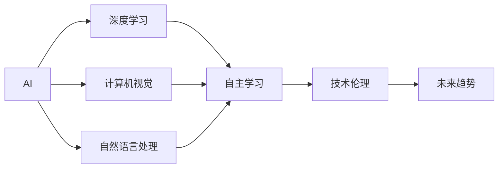

                 

# 李开复：AI 2.0 时代的挑战

> 关键词：人工智能, 深度学习, 计算机视觉, 自然语言处理, 自主学习, 技术伦理, 未来趋势

## 1. 背景介绍

### 1.1 问题由来

在AI 2.0时代，我们正处于一次新的技术革命浪潮之中，从传统的基于规则和符号的逻辑程序设计到如今基于数据和算法的智能系统，AI 正在重塑我们的生活、工作和思维方式。然而，随着技术的进步，我们面临着一系列前所未有的挑战，这些问题不仅关乎技术本身，更关乎伦理、安全、隐私和社会公平。

### 1.2 问题核心关键点

AI 2.0时代的主要挑战包括以下几个方面：

- **技术创新速度**：AI 技术的快速发展使得新的算法和模型层出不穷，如何在保持速度的同时确保质量是关键问题。
- **数据隐私与保护**：AI 系统依赖大量数据进行训练，如何保护用户隐私和数据安全是必须面对的伦理问题。
- **算法透明性与可解释性**：AI 模型往往是“黑箱”，难以解释其决策过程，这对一些高风险应用如医疗、金融等尤为关键。
- **AI 的伦理与公平性**：AI 系统可能存在偏见和歧视，如何在设计和训练过程中避免这些问题，是维持社会公平和伦理道德的必要条件。
- **计算资源与效率**：AI 模型通常需要大量计算资源，如何在保证性能的同时提高资源利用效率是一个现实问题。

这些挑战不仅影响AI技术的进一步发展，也对社会各界产生了深远影响，需要我们从技术、伦理、政策等多个维度共同努力，以实现AI的可持续发展。

## 2. 核心概念与联系

### 2.1 核心概念概述

为深入理解AI 2.0时代的挑战，本节将介绍几个核心概念及其相互联系：

- **AI**：人工智能，指的是能够执行人类智能任务的计算机系统。
- **深度学习**：一种基于神经网络的机器学习技术，通过多层次的抽象和表征学习，实现对复杂数据的处理。
- **计算机视觉**：使计算机能够理解和分析图像和视频数据，应用于识别、分类、检测等任务。
- **自然语言处理**：使计算机能够理解和生成人类语言，应用于机器翻译、文本摘要、对话系统等。
- **自主学习**：指AI系统能够自主地从经验中学习，无需人类干预。
- **技术伦理**：涉及AI技术开发和应用中面临的伦理问题，如隐私、偏见、歧视等。
- **未来趋势**：AI 技术的发展方向和潜在影响，如AI 的泛化能力、跨模态智能等。

这些概念共同构成了AI 2.0时代的核心框架，帮助我们理解AI技术的现状与未来发展方向。

### 2.2 核心概念原理和架构的 Mermaid 流程图



这个流程图展示了AI 2.0时代的主要概念及其相互关系。深度学习作为AI 的核心技术，计算机视觉和自然语言处理是AI 在视觉和语言领域的两个重要应用，自主学习体现了AI 系统在经验获取上的进步，技术伦理关注AI 系统在应用中的伦理问题，未来趋势展望了AI 技术的发展方向。

## 3. 核心算法原理 & 具体操作步骤

### 3.1 算法原理概述

AI 2.0时代的算法原理主要围绕深度学习展开，以下是对深度学习的一些基本原理概述：

1. **神经网络结构**：深度学习模型通常由多层神经网络组成，每一层负责提取不同的特征，最终通过全连接层输出结果。
2. **反向传播算法**：通过反向传播算法，计算模型输出与真实标签之间的误差，并根据误差调整网络权重，以最小化损失函数。
3. **优化算法**：如随机梯度下降(SGD)、AdamW等，用于加速模型训练。
4. **激活函数**：如ReLU、Sigmoid等，用于增加神经网络的非线性特性。
5. **正则化**：如L2正则、Dropout等，防止过拟合。

### 3.2 算法步骤详解

深度学习的训练过程一般包括以下步骤：

1. **数据准备**：收集和预处理训练数据，如图像的归一化、文本的标记化等。
2. **模型选择与设计**：选择合适的深度学习模型架构，如卷积神经网络(CNN)、循环神经网络(RNN)等，并设定超参数。
3. **模型训练**：通过反向传播算法和优化算法更新模型参数，最小化损失函数。
4. **模型评估**：使用验证集或测试集评估模型性能，调整超参数。
5. **模型部署**：将训练好的模型应用于实际问题，如图像分类、语音识别等。

### 3.3 算法优缺点

深度学习在AI 2.0时代的应用非常广泛，但也存在一些局限性：

**优点**：

- **自动化特征提取**：深度学习可以自动学习数据的高级特征，减少了人工设计的复杂性。
- **高精度**：在许多任务上，深度学习模型可以达到甚至超越人类的表现。
- **广泛应用**：深度学习已经成功应用于计算机视觉、自然语言处理等多个领域。

**缺点**：

- **数据依赖**：深度学习模型需要大量标注数据进行训练，数据获取成本高。
- **计算资源需求高**：深度学习模型的训练和推理需要高性能计算资源。
- **可解释性差**：深度学习模型往往是“黑箱”，难以解释其决策过程。
- **对抗样本敏感**：深度学习模型容易受到对抗样本的攻击。

### 3.4 算法应用领域

深度学习在AI 2.0时代的应用领域非常广泛，以下是几个典型应用：

1. **计算机视觉**：如人脸识别、自动驾驶、医学影像分析等。
2. **自然语言处理**：如机器翻译、文本生成、情感分析等。
3. **语音识别**：如语音助手、语音转文本等。
4. **推荐系统**：如电商推荐、音乐推荐等。
5. **游戏AI**：如自动对战、游戏内容生成等。

这些应用展示了深度学习在AI 2.0时代的强大能力，但也提出了新的挑战，如数据隐私保护、模型可解释性等。

## 4. 数学模型和公式 & 详细讲解 & 举例说明

### 4.1 数学模型构建

深度学习的数学模型通常由神经网络构成，以下是一个简单的多层感知器(Multilayer Perceptron, MLP)的数学模型：

$$
\mathcal{L}(\theta) = \frac{1}{N}\sum_{i=1}^N \ell(\sigma(W^{[1]X^{[i]} + b^{[1]}), y^{[i]})
$$

其中，$X^{[i]}$ 为第 $i$ 个样本的输入特征向量，$y^{[i]}$ 为样本的标签向量，$W^{[1]}$ 和 $b^{[1]}$ 为第一层的权重和偏置，$\sigma$ 为激活函数，$\ell$ 为损失函数。

### 4.2 公式推导过程

以二分类问题为例，深度学习的训练过程可以分为以下几个步骤：

1. **前向传播**：将输入数据 $X^{[i]}$ 输入到模型中，计算输出 $\hat{y} = \sigma(W^{[1]X^{[i]} + b^{[1]})$。
2. **计算损失**：计算预测输出 $\hat{y}$ 与真实标签 $y^{[i]}$ 之间的交叉熵损失 $\ell(\hat{y}, y^{[i]}) = -[y^{[i]}\log \hat{y} + (1-y^{[i]})\log(1-\hat{y})]$。
3. **反向传播**：计算损失函数对权重和偏置的梯度，使用随机梯度下降等优化算法更新模型参数。
4. **模型评估**：使用验证集评估模型性能，调整超参数。

### 4.3 案例分析与讲解

以卷积神经网络(CNN)为例，CNN 在图像分类任务中的应用非常广泛。以下是一个简单的卷积神经网络的示意图：

```
Conv -> Pool -> Conv -> Pool -> Fully Connected
```

CNN 主要包括以下几个组件：

- **卷积层(Conv)**：提取图像的局部特征。
- **池化层(Pool)**：降低特征图的空间维度，减少计算量。
- **全连接层(Fully Connected)**：将卷积层的特征图转换为分类结果。

CNN 的训练过程与多层感知器类似，但在卷积层中，通过卷积操作提取局部特征，减少了特征图的空间维度，提高了模型的鲁棒性。

## 5. 项目实践：代码实例和详细解释说明

### 5.1 开发环境搭建

在进行深度学习项目实践前，我们需要准备好开发环境。以下是使用Python进行TensorFlow开发的环境配置流程：

1. 安装Anaconda：从官网下载并安装Anaconda，用于创建独立的Python环境。

2. 创建并激活虚拟环境：
```bash
conda create -n tf-env python=3.8 
conda activate tf-env
```

3. 安装TensorFlow：根据CUDA版本，从官网获取对应的安装命令。例如：
```bash
conda install tensorflow-gpu=2.5.0 
```

4. 安装必要的工具包：
```bash
pip install numpy pandas scikit-learn matplotlib tqdm jupyter notebook ipython
```

完成上述步骤后，即可在`tf-env`环境中开始深度学习项目实践。

### 5.2 源代码详细实现

下面以图像分类为例，给出使用TensorFlow对卷积神经网络进行图像分类的代码实现。

```python
import tensorflow as tf
from tensorflow.keras import datasets, layers, models

# 加载数据集
(train_images, train_labels), (test_images, test_labels) = datasets.cifar10.load_data()

# 数据预处理
train_images, test_images = train_images / 255.0, test_images / 255.0

# 构建模型
model = models.Sequential()
model.add(layers.Conv2D(32, (3, 3), activation='relu', input_shape=(32, 32, 3)))
model.add(layers.MaxPooling2D((2, 2)))
model.add(layers.Conv2D(64, (3, 3), activation='relu'))
model.add(layers.MaxPooling2D((2, 2)))
model.add(layers.Conv2D(64, (3, 3), activation='relu'))
model.add(layers.Flatten())
model.add(layers.Dense(64, activation='relu'))
model.add(layers.Dense(10))

# 编译模型
model.compile(optimizer='adam',
              loss=tf.keras.losses.SparseCategoricalCrossentropy(from_logits=True),
              metrics=['accuracy'])

# 训练模型
model.fit(train_images, train_labels, epochs=10, 
          validation_data=(test_images, test_labels))

# 评估模型
test_loss, test_acc = model.evaluate(test_images,  test_labels, verbose=2)
print('Test accuracy:', test_acc)
```

### 5.3 代码解读与分析

让我们再详细解读一下关键代码的实现细节：

**加载数据集**：
- 使用`datasets.cifar10.load_data()`加载CIFAR-10数据集，包含60,000张32x32像素的彩色图片和10个类别的标签。

**数据预处理**：
- 将像素值归一化到0-1之间，提高模型的收敛速度和泛化能力。

**构建模型**：
- 使用`Sequential`模型定义卷积神经网络，包括卷积层、池化层和全连接层。
- 卷积层使用3x3的卷积核，通过ReLU激活函数提取特征。
- 池化层使用2x2的最大池化，降低特征图的空间维度。
- 全连接层使用ReLU激活函数，输出分类结果。

**编译模型**：
- 使用Adam优化器，设置交叉熵损失函数和准确率指标。

**训练模型**：
- 使用`fit`方法训练模型，设置10个epochs，并使用测试集进行验证。

**评估模型**：
- 使用`evaluate`方法评估模型性能，输出测试集上的准确率。

可以看到，TensorFlow的高级API使得模型构建和训练变得非常简单，开发者只需关注核心逻辑即可，减少了重复的底层代码。

当然，工业级的系统实现还需考虑更多因素，如模型的保存和部署、超参数的自动搜索、更灵活的任务适配层等。但核心的深度学习范式基本与此类似。

## 6. 实际应用场景

### 6.1 智能医疗

深度学习在智能医疗领域有着广泛的应用，如医学影像分析、疾病预测、个性化治疗等。通过深度学习模型，可以从海量的医学数据中提取特征，进行疾病的早期检测和分类，提高诊疗的准确性和效率。

以医学影像分析为例，通过卷积神经网络对医学影像进行特征提取和分类，可以自动检测和标记出病灶，辅助医生进行诊断和治疗。例如，在乳腺癌筛查中，深度学习模型可以识别出早期病灶，提高筛查的准确性和早期诊断率。

### 6.2 智能推荐

推荐系统是深度学习在电商、娱乐等领域的重要应用。通过深度学习模型，可以从用户的历史行为和偏好中提取特征，进行个性化的商品推荐和内容推荐，提高用户体验和满意度。

以电商推荐为例，通过深度学习模型，可以从用户的历史浏览、购买记录中提取特征，进行商品推荐。例如，在推荐某用户的商品时，深度学习模型可以综合考虑用户的历史行为、商品的属性和相关性等因素，提供更加个性化的推荐结果。

### 6.3 智能交通

深度学习在智能交通领域也有着广泛的应用，如交通流量预测、智能驾驶等。通过深度学习模型，可以从交通数据中提取特征，进行交通流量预测和道路规划，提高交通管理的效率和安全性。

以智能驾驶为例，通过深度学习模型，可以从传感器数据中提取特征，进行车辆的路径规划和行为决策。例如，在自动驾驶中，深度学习模型可以分析交通信号、行人、车辆等环境信息，进行智能决策和避障，提高行驶的安全性和效率。

### 6.4 未来应用展望

随着深度学习技术的不断发展，未来AI 2.0时代将呈现出更多创新和应用。以下是几个未来的发展方向：

1. **多模态学习**：结合视觉、听觉、语言等多模态数据，提高AI系统的感知能力和决策能力。例如，结合视频和文本数据的情感分析模型，可以更准确地识别用户情感。
2. **跨领域迁移学习**：将AI 模型从特定领域迁移到其他领域，提高模型泛化能力和应用范围。例如，在医疗领域训练的模型，可以迁移到工业领域进行设备故障预测。
3. **增强学习**：通过模拟环境进行学习和决策，提高AI系统的自主性和适应性。例如，在机器人控制中，增强学习模型可以自主学习最优动作策略，提高机器人执行任务的准确性和效率。
4. **对抗学习**：通过对抗样本训练，提高AI系统的鲁棒性和安全性。例如，在图像分类中，对抗学习模型可以生成对抗样本，提高模型的鲁棒性和泛化能力。
5. **联邦学习**：通过分布式训练，保护数据隐私和安全，提高模型性能。例如，在医疗数据保护中，联邦学习模型可以在保护数据隐私的前提下，进行联合训练和模型更新。

这些发展方向展示了深度学习在AI 2.0时代的巨大潜力，推动了AI技术在各个领域的广泛应用和深入探索。

## 7. 工具和资源推荐

### 7.1 学习资源推荐

为了帮助开发者系统掌握深度学习的基础知识和最新进展，这里推荐一些优质的学习资源：

1. 《深度学习》（Ian Goodfellow等著）：深度学习领域的经典教材，全面介绍了深度学习的基本原理和算法。
2. 《TensorFlow实战Google深度学习》：TensorFlow的官方文档和实践指南，提供了丰富的代码示例和实践经验。
3. Coursera的《深度学习专项课程》：斯坦福大学开设的深度学习课程，由深度学习领域的权威教授讲授，涵盖深度学习的基础知识和应用。
4. Kaggle：数据科学竞赛平台，提供大量的数据集和挑战赛，可以锻炼实战能力。
5. GitHub上的深度学习项目：可以从GitHub上的开源项目中学习深度学习的最佳实践和代码实现。

通过对这些资源的学习实践，相信你一定能够快速掌握深度学习的基本原理和应用技巧，并用于解决实际的AI问题。

### 7.2 开发工具推荐

高效的深度学习开发离不开优秀的工具支持。以下是几款用于深度学习开发的常用工具：

1. TensorFlow：由Google主导开发的开源深度学习框架，生产部署方便，适合大规模工程应用。
2. PyTorch：基于Python的开源深度学习框架，灵活动态的计算图，适合快速迭代研究。
3. Keras：高级API，可以快速构建深度学习模型，适合初学者快速入门。
4. Jupyter Notebook：交互式开发环境，适合进行模型实验和数据分析。
5. TensorBoard：TensorFlow配套的可视化工具，可实时监测模型训练状态，并提供丰富的图表呈现方式。

合理利用这些工具，可以显著提升深度学习开发的效率，加快创新迭代的步伐。

### 7.3 相关论文推荐

深度学习在AI 2.0时代的快速发展，离不开学界的持续研究。以下是几篇奠基性的相关论文，推荐阅读：

1. 《ImageNet Classification with Deep Convolutional Neural Networks》：AlexNet模型在ImageNet数据集上取得突破性成绩，标志着深度学习在计算机视觉领域的兴起。
2. 《Natural Language Processing》（Richard S. Sutton等著）：深度学习在自然语言处理领域的经典教材，介绍了NLP的基础知识和深度学习的应用。
3. 《Attention is All You Need》：Transformer模型在机器翻译任务上取得突破性成绩，推动了深度学习在自然语言处理领域的发展。
4. 《Deep Residual Learning for Image Recognition》：ResNet模型在图像识别任务上取得突破性成绩，展示了深度学习模型的强大能力。
5. 《Reinforcement Learning: An Introduction》：强化学习领域的经典教材，介绍了强化学习的基本原理和应用。

这些论文代表了大规模深度学习的研究进展，帮助读者了解深度学习技术的现状与未来发展方向。

## 8. 总结：未来发展趋势与挑战

### 8.1 研究成果总结

深度学习在AI 2.0时代的快速发展，带来了许多创新和应用。通过深度学习，我们能够从大规模数据中提取复杂的特征，解决许多传统方法难以解决的问题。然而，深度学习技术在实际应用中也面临一些挑战，如数据隐私、模型可解释性、计算资源等。

### 8.2 未来发展趋势

展望未来，深度学习将在AI 2.0时代继续发挥重要作用，带来更多的创新和应用。以下是几个未来的发展方向：

1. **模型自动化**：通过自动化模型设计，提高模型的可扩展性和可复用性。例如，通过自动化超参数优化，提高模型训练效率和性能。
2. **跨领域融合**：将深度学习与其他AI技术进行融合，如知识表示、因果推理、强化学习等，提高AI系统的综合能力和应用范围。
3. **模型集成**：通过集成多个模型，提高系统的鲁棒性和泛化能力。例如，在自动驾驶中，集成多个传感器和模型，提高系统的鲁棒性和安全性。
4. **联邦学习**：通过分布式训练，保护数据隐私和安全，提高模型性能。例如，在医疗数据保护中，联邦学习模型可以在保护数据隐私的前提下，进行联合训练和模型更新。
5. **小样本学习**：通过少样本学习，提高模型的泛化能力和适应性。例如，在医疗诊断中，通过少样本学习，提高模型的诊断准确性和鲁棒性。

这些发展方向展示了深度学习在AI 2.0时代的巨大潜力，推动了AI技术在各个领域的广泛应用和深入探索。

### 8.3 面临的挑战

尽管深度学习在AI 2.0时代的发展前景广阔，但也面临着许多挑战，需要进一步解决：

1. **数据隐私保护**：深度学习模型依赖大量数据进行训练，如何在保护数据隐私的前提下，进行高效的模型训练，是一个重要的挑战。
2. **模型可解释性**：深度学习模型往往是“黑箱”，难以解释其决策过程，这对一些高风险应用如医疗、金融等尤为关键。
3. **计算资源需求**：深度学习模型的训练和推理需要大量计算资源，如何在保证性能的同时，提高资源利用效率，是一个现实问题。
4. **模型鲁棒性**：深度学习模型容易受到对抗样本的攻击，如何在保证安全性的前提下，提高模型的鲁棒性，是一个重要的研究方向。
5. **跨领域迁移能力**：如何在大规模数据上训练深度学习模型，提高其在跨领域任务上的迁移能力，是一个重要的挑战。

这些挑战不仅影响深度学习技术的进一步发展，也对社会各界产生了深远影响，需要我们从技术、伦理、政策等多个维度共同努力，以实现深度学习技术的可持续发展。

### 8.4 研究展望

面向未来，深度学习的研究方向将更加多样和广泛。以下是几个未来研究的方向：

1. **多模态学习**：结合视觉、听觉、语言等多模态数据，提高AI系统的感知能力和决策能力。例如，结合视频和文本数据的情感分析模型，可以更准确地识别用户情感。
2. **跨领域迁移学习**：将深度学习模型从特定领域迁移到其他领域，提高模型泛化能力和应用范围。例如，在医疗领域训练的模型，可以迁移到工业领域进行设备故障预测。
3. **增强学习**：通过模拟环境进行学习和决策，提高AI系统的自主性和适应性。例如，在机器人控制中，增强学习模型可以自主学习最优动作策略，提高机器人执行任务的准确性和效率。
4. **对抗学习**：通过对抗样本训练，提高AI系统的鲁棒性和安全性。例如，在图像分类中，对抗学习模型可以生成对抗样本，提高模型的鲁棒性和泛化能力。
5. **联邦学习**：通过分布式训练，保护数据隐私和安全，提高模型性能。例如，在医疗数据保护中，联邦学习模型可以在保护数据隐私的前提下，进行联合训练和模型更新。

这些研究方向展示了深度学习在AI 2.0时代的巨大潜力，推动了深度学习技术在各个领域的广泛应用和深入探索。

## 9. 附录：常见问题与解答

**Q1：深度学习模型需要大量数据进行训练，如何获取高质量的数据？**

A: 获取高质量的数据是深度学习模型训练的关键。以下是一些常用的数据获取和预处理策略：

1. **公开数据集**：使用公开的数据集进行模型训练，如ImageNet、CIFAR-10等，这些数据集涵盖了广泛的应用场景和领域。
2. **数据生成**：通过数据生成技术，如GANs、VQ-VAE等，生成与真实数据分布相似的高质量数据。
3. **数据增强**：对现有数据进行扩充和增强，如随机旋转、翻转、裁剪等，提高模型的鲁棒性和泛化能力。
4. **数据标注**：对于某些特定任务，如自然语言处理，需要人工进行数据标注，可以使用众包平台进行标注。

通过以上策略，可以有效获取高质量的数据，提高深度学习模型的性能。

**Q2：深度学习模型通常是“黑箱”，难以解释其决策过程，如何解决？**

A: 解决深度学习模型的可解释性问题，是当前AI 2.0时代的一个重要研究方向。以下是一些常用的方法：

1. **可视化技术**：通过可视化工具，如TensorBoard、t-SNE等，展示模型的特征表示和决策过程，帮助理解模型的行为。
2. **可解释模型**：使用可解释模型，如决策树、线性模型等，代替深度学习模型，提供模型输出的可解释性。
3. **注意力机制**：在深度学习模型中加入注意力机制，展示模型对输入数据的关注点，提高模型的可解释性。
4. **模型简化**：通过模型简化，如剪枝、量化等，减少模型的复杂度，提高模型的可解释性。

这些方法可以帮助我们更好地理解深度学习模型的决策过程，提高模型的可解释性和可信度。

**Q3：深度学习模型的训练和推理需要大量计算资源，如何提高资源利用效率？**

A: 提高深度学习模型的计算资源利用效率，是当前AI 2.0时代的一个重要研究方向。以下是一些常用的方法：

1. **模型压缩**：通过模型压缩技术，如剪枝、量化等，减少模型的计算量，提高模型的推理效率。
2. **模型并行**：通过模型并行技术，如分布式训练、混合精度训练等，提高模型的计算效率和资源利用效率。
3. **模型加速**：通过模型加速技术，如TensorRT、ONNX-Runtime等，提高模型的推理速度和计算效率。
4. **模型优化**：通过模型优化技术，如算法优化、硬件加速等，提高模型的计算效率和资源利用效率。

这些方法可以帮助我们更好地利用计算资源，提高深度学习模型的效率和性能。

**Q4：深度学习模型容易受到对抗样本的攻击，如何提高模型的鲁棒性？**

A: 提高深度学习模型的鲁棒性，是当前AI 2.0时代的一个重要研究方向。以下是一些常用的方法：

1. **对抗样本训练**：通过对抗样本训练，如FGSM、PGD等，提高模型的鲁棒性和泛化能力。
2. **模型优化**：通过模型优化，如自适应学习率、梯度裁剪等，提高模型的鲁棒性和泛化能力。
3. **数据增强**：通过数据增强，如随机旋转、翻转、裁剪等，提高模型的鲁棒性和泛化能力。
4. **对抗样本检测**：通过对抗样本检测技术，如VAT、DALEX等，检测和识别对抗样本，提高模型的鲁棒性。

这些方法可以帮助我们更好地提高深度学习模型的鲁棒性和安全性，保障模型在实际应用中的稳定性和可靠性。

**Q5：深度学习模型在特定领域的应用效果不佳，如何提高模型的泛化能力？**

A: 提高深度学习模型的泛化能力，是当前AI 2.0时代的一个重要研究方向。以下是一些常用的方法：

1. **模型迁移学习**：通过模型迁移学习，将深度学习模型从特定领域迁移到其他领域，提高模型在跨领域任务上的泛化能力。
2. **数据增强**：通过数据增强，如随机旋转、翻转、裁剪等，提高模型的泛化能力和鲁棒性。
3. **模型优化**：通过模型优化，如自适应学习率、梯度裁剪等，提高模型的泛化能力和鲁棒性。
4. **多模态学习**：通过多模态学习，结合视觉、听觉、语言等多模态数据，提高模型的感知能力和决策能力，提高模型的泛化能力。

这些方法可以帮助我们更好地提高深度学习模型的泛化能力和鲁棒性，保障模型在实际应用中的稳定性和可靠性。

---

作者：禅与计算机程序设计艺术 / Zen and the Art of Computer Programming

