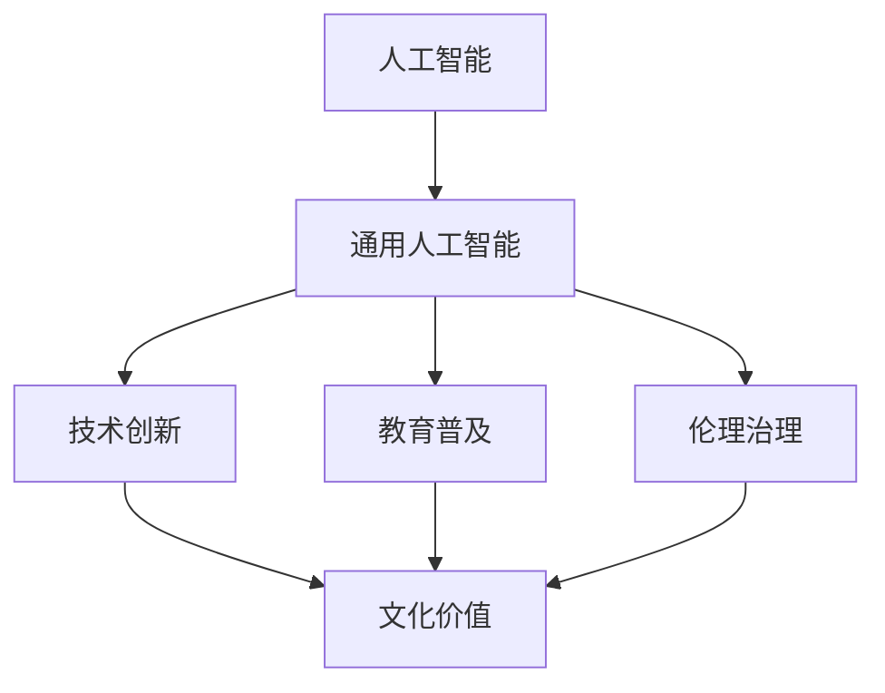

                 

# 李开复：AI 2.0 时代的文化价值

在AI 2.0时代，人工智能技术正在深刻地改变着社会的各个方面。从医疗到教育，从金融到交通，AI已经渗透到我们生活的方方面面。然而，AI技术的快速发展也引发了关于文化价值的诸多讨论。本文将探讨AI 2.0时代下的文化价值，并分析其在技术创新、教育普及、伦理治理等方面的深远影响。

## 1. 背景介绍

### 1.1 人工智能的演进

人工智能的演进可以追溯到20世纪50年代，当时最早的计算机科学家就已经开始研究如何使机器具备智能。经历了几十年的发展，AI技术逐渐从研究走向实际应用。特别是近年来，深度学习、自然语言处理、计算机视觉等技术的突破，使得AI进入了AI 2.0时代，即通用人工智能（AGI）时代。

AI 2.0时代的到来，标志着AI技术从单一任务向多任务、从特定领域向通用领域、从弱智能向强智能的跨越。AI技术的广泛应用，正在逐步改变我们的工作、学习、生活乃至整个社会结构。

### 1.2 AI 2.0时代的文化价值

在AI 2.0时代，文化价值的内涵正在发生深刻变化。一方面，AI技术使得文化内容的生产和传播更加高效、广泛，但同时也带来了伦理、隐私、版权等诸多新问题。如何平衡技术创新与社会价值，是当前AI研究的重要课题。

本文将从技术创新、教育普及、伦理治理三个方面，探讨AI 2.0时代的文化价值，并提出相应的解决方案。

## 2. 核心概念与联系

### 2.1 核心概念概述

在探讨AI 2.0时代的文化价值时，需要理解几个关键概念：

- **人工智能（AI）**：一种通过计算机系统模拟人类智能的技术，包括感知、学习、推理、自然语言处理等方面。
- **通用人工智能（AGI）**：一种具备人类智能水平，可以处理任何类型的信息、应用和决策的AI。
- **文化价值**：指在特定文化背景下，对于技术创新、伦理道德、教育普及等方面所持有的价值观念和评价标准。

这些概念之间的关系可以通过以下Mermaid流程图来展示：



这个流程图展示了AI 2.0时代下，人工智能与技术创新、教育普及、伦理治理之间的关系，并最终影响了文化价值。

## 3. 核心算法原理 & 具体操作步骤

### 3.1 算法原理概述

AI 2.0时代的文化价值主要体现在技术创新、教育普及、伦理治理三个方面。以下将分别探讨这三个方面的算法原理。

#### 3.1.1 技术创新

技术创新是AI 2.0时代的重要驱动力。AI技术的不断进步，推动了各个行业的快速发展。在技术创新方面，AI的价值体现在以下几个方面：

- **深度学习**：深度学习是当前AI研究的热点，通过多层神经网络结构，实现了对复杂问题的高效处理。
- **自然语言处理**：通过自然语言处理技术，AI可以理解、生成、翻译人类语言，为文化内容的生产和传播提供了新的可能性。
- **计算机视觉**：计算机视觉技术使得机器可以理解和分析图像、视频等内容，推动了图像识别、视频处理等应用的发展。

#### 3.1.2 教育普及

AI 2.0时代，教育普及也得到了前所未有的推动。AI技术的应用，使得教育资源更加丰富、教学方式更加灵活，具体体现在以下几个方面：

- **个性化学习**：AI可以根据学生的学习情况，提供个性化的学习路径和推荐内容，提高学习效率。
- **虚拟教师**：AI驱动的虚拟教师，可以24小时提供教学服务，帮助学生解决疑难问题。
- **智能评估**：AI可以自动评估学生的作业和考试，提供详细的反馈，帮助教师和学生及时调整教学和学习策略。

#### 3.1.3 伦理治理

AI技术的广泛应用，也带来了诸多伦理问题。AI 2.0时代的伦理治理，主要体现在以下几个方面：

- **隐私保护**：AI在数据收集和处理过程中，需要保护用户的隐私信息，防止数据泄露和滥用。
- **公平性**：AI模型需要避免偏见和歧视，确保所有人在AI系统中享有平等的待遇。
- **责任归属**：AI系统在决策过程中可能出现错误，需要明确责任归属，防止责任推诿。

### 3.2 算法步骤详解

#### 3.2.1 技术创新

技术创新的算法步骤如下：

1. **数据准备**：收集大量的数据，作为AI模型的训练集。数据需要涵盖各种场景，确保模型的泛化能力。
2. **模型训练**：使用深度学习等技术，训练AI模型。模型训练需要选择合适的架构和超参数，进行多轮迭代优化。
3. **模型评估**：使用测试集对训练好的模型进行评估，确保模型性能满足预期。
4. **模型部署**：将训练好的模型部署到实际应用场景中，进行大规模测试和优化。

#### 3.2.2 教育普及

教育普及的算法步骤如下：

1. **内容构建**：构建丰富的教育资源，包括视频、文本、音频等，涵盖各种学科和知识点。
2. **个性化推荐**：使用AI技术，根据学生的学习情况，推荐个性化的学习内容。
3. **智能评估**：使用AI技术，自动评估学生的作业和考试，提供详细的反馈和建议。
4. **虚拟教师**：开发虚拟教师系统，24小时提供教学服务，帮助学生解决疑难问题。

#### 3.2.3 伦理治理

伦理治理的算法步骤如下：

1. **隐私保护**：在数据收集和处理过程中，采用加密、匿名化等技术，保护用户的隐私信息。
2. **公平性**：在模型训练过程中，避免数据偏见和模型偏见，确保模型公平性。
3. **责任归属**：明确AI系统的决策过程和责任归属，建立完善的法律和监管机制。

### 3.3 算法优缺点

#### 3.3.1 技术创新

**优点**：
- **高效性**：AI技术可以处理大量数据，提高决策效率。
- **广泛性**：AI技术可以应用于各个领域，推动社会进步。

**缺点**：
- **依赖数据**：AI技术的性能很大程度上取决于数据质量，数据不足可能导致性能下降。
- **复杂性**：AI模型的训练和优化过程复杂，需要高水平的专家才能实现。

#### 3.3.2 教育普及

**优点**：
- **个性化**：AI技术可以实现个性化学习，提高学习效率。
- **灵活性**：AI技术可以提供灵活的教学方式，适应不同学生的学习需求。

**缺点**：
- **成本高**：AI技术需要大量计算资源和专家支持，开发成本较高。
- **依赖技术**：AI技术的普及需要一定的技术基础，可能存在数字鸿沟问题。

#### 3.3.3 伦理治理

**优点**：
- **自动化**：AI技术可以实现自动化的伦理治理，提高治理效率。
- **透明性**：AI技术可以帮助明确决策过程，提高治理透明性。

**缺点**：
- **复杂性**：伦理治理涉及多个利益相关方，处理复杂问题需要多方协调。
- **不确定性**：AI技术的决策过程可能存在不确定性，需要建立完善的监管机制。

### 3.4 算法应用领域

AI 2.0时代的文化价值主要应用于以下几个领域：

1. **医疗**：AI可以辅助医生进行疾病诊断、个性化治疗等，提升医疗水平。
2. **金融**：AI可以用于风险评估、智能投顾、欺诈检测等，提高金融安全性和效率。
3. **教育**：AI可以提供个性化学习、智能评估、虚拟教师等，推动教育普及。
4. **媒体**：AI可以用于内容推荐、情感分析、版权保护等，提升媒体质量。
5. **交通**：AI可以用于自动驾驶、智能调度、交通预测等，提升交通效率。

## 4. 数学模型和公式 & 详细讲解 & 举例说明

### 4.1 数学模型构建

在AI 2.0时代，AI模型通常使用深度学习框架进行构建，以神经网络为基本结构。以下以深度学习模型为例，介绍数学模型的构建过程。

设输入为 $x \in \mathbb{R}^n$，输出为 $y \in \mathbb{R}^m$，模型的参数为 $\theta$。模型的输出可以表示为：

$$
y = f(x; \theta)
$$

其中，$f$ 为模型的非线性映射函数。常见的非线性映射函数包括线性层、激活函数、全连接层等。

### 4.2 公式推导过程

以线性层为例，推导其数学模型：

设输入为 $x \in \mathbb{R}^n$，线性层的权重矩阵为 $W \in \mathbb{R}^{m \times n}$，偏置向量为 $b \in \mathbb{R}^m$，则线性层的输出可以表示为：

$$
y = Wx + b
$$

其中，$x$ 为输入向量，$W$ 为权重矩阵，$b$ 为偏置向量。

### 4.3 案例分析与讲解

**案例**：使用线性层进行图像分类

假设输入为图像的像素值 $x \in \mathbb{R}^{784}$，输出为图像所属的类别 $y \in \mathbb{R}^{10}$，其中 $10$ 为分类数目。使用线性层进行图像分类，其数学模型为：

$$
y = Wx + b
$$

其中，$W \in \mathbb{R}^{10 \times 784}$ 为权重矩阵，$b \in \mathbb{R}^{10}$ 为偏置向量。通过训练线性层，可以学习到图像与类别之间的关系，实现图像分类。

## 5. 项目实践：代码实例和详细解释说明

### 5.1 开发环境搭建

为了进行AI模型的开发，需要搭建相应的开发环境。以下以PyTorch为例，介绍开发环境的搭建过程。

1. **安装Python**：从官网下载并安装Python，推荐使用Python 3.6以上版本。
2. **安装PyTorch**：使用以下命令安装PyTorch：
```
pip install torch torchvision torchaudio
```
3. **安装相关库**：安装TensorFlow、NumPy、Pandas等库，可以使用以下命令：
```
pip install tensorflow numpy pandas
```

### 5.2 源代码详细实现

以下是一个简单的图像分类的PyTorch代码实现：

```python
import torch
import torch.nn as nn
import torchvision
import torchvision.transforms as transforms

class Net(nn.Module):
    def __init__(self):
        super(Net, self).__init__()
        self.fc1 = nn.Linear(784, 500)
        self.fc2 = nn.Linear(500, 10)

    def forward(self, x):
        x = x.view(-1, 784)
        x = torch.relu(self.fc1(x))
        x = self.fc2(x)
        return x

# 加载数据集
transform = transforms.Compose([transforms.ToTensor()])
trainset = torchvision.datasets.MNIST(root='./data', train=True, download=True, transform=transform)
trainloader = torch.utils.data.DataLoader(trainset, batch_size=64, shuffle=True)

# 训练模型
net = Net()
criterion = nn.CrossEntropyLoss()
optimizer = torch.optim.Adam(net.parameters(), lr=0.001)
for epoch in range(10):
    running_loss = 0.0
    for i, data in enumerate(trainloader, 0):
        inputs, labels = data
        optimizer.zero_grad()
        outputs = net(inputs)
        loss = criterion(outputs, labels)
        loss.backward()
        optimizer.step()
        running_loss += loss.item()
```

### 5.3 代码解读与分析

**代码解释**：
- 定义了线性层网络结构，包括输入层、隐藏层和输出层。
- 加载了MNIST数据集，并进行数据预处理。
- 定义了损失函数和优化器。
- 进行了多轮训练，并在训练过程中计算损失函数。

**分析**：
- 代码实现了简单的线性层模型，使用MNIST数据集进行训练。
- 在训练过程中，使用Adam优化器更新模型参数，以最小化损失函数。
- 训练完成后，模型可以进行图像分类任务。

## 6. 实际应用场景

### 6.1 医疗

在医疗领域，AI 2.0技术的应用已经取得了显著成效。AI可以帮助医生进行疾病诊断、个性化治疗、药物研发等。

**案例**：AI辅助诊断

假设输入为患者的医学影像数据 $x \in \mathbb{R}^{h \times w}$，输出为诊断结果 $y \in \{0, 1\}$，其中 $0$ 表示正常，$1$ 表示异常。使用深度学习模型进行医学影像分类，其数学模型为：

$$
y = f(x; \theta)
$$

其中，$f$ 为深度学习模型，$\theta$ 为模型参数。通过训练深度学习模型，可以学习到医学影像与诊断结果之间的关系，实现疾病诊断。

### 6.2 金融

在金融领域，AI 2.0技术可以用于风险评估、智能投顾、欺诈检测等。

**案例**：智能投顾

假设输入为用户的投资记录 $x \in \mathbb{R}^{d}$，输出为投资建议 $y \in \{low, medium, high\}$，其中 $low$ 表示低风险，$medium$ 表示中风险，$high$ 表示高风险。使用深度学习模型进行投资风险评估，其数学模型为：

$$
y = f(x; \theta)
$$

其中，$f$ 为深度学习模型，$\theta$ 为模型参数。通过训练深度学习模型，可以学习到投资记录与投资建议之间的关系，实现智能投顾。

### 6.3 教育

在教育领域，AI 2.0技术可以提供个性化学习、智能评估、虚拟教师等服务。

**案例**：个性化学习

假设输入为学生的学习数据 $x \in \mathbb{R}^{n}$，输出为推荐内容 $y \in \mathbb{R}^{m}$，其中 $n$ 为学习数据维度，$m$ 为推荐内容维度。使用深度学习模型进行推荐，其数学模型为：

$$
y = f(x; \theta)
$$

其中，$f$ 为深度学习模型，$\theta$ 为模型参数。通过训练深度学习模型，可以学习到学生的学习数据与推荐内容之间的关系，实现个性化学习。

### 6.4 未来应用展望

随着AI 2.0技术的不断进步，未来在各个领域的应用将更加广泛。以下列举几个未来应用展望：

1. **智能家居**：AI可以用于智能家电控制、环境监测、家庭安全等，提升家居智能化水平。
2. **智慧城市**：AI可以用于交通管理、环境保护、公共安全等，提升城市治理效率。
3. **自动驾驶**：AI可以用于自动驾驶、智能调度、交通预测等，提升交通效率。

## 7. 工具和资源推荐

### 7.1 学习资源推荐

为了帮助开发者掌握AI 2.0技术，以下是一些推荐的学习资源：

1. **《深度学习》课程**：由斯坦福大学开设，涵盖了深度学习的基本原理和实际应用。
2. **《Python深度学习》书籍**：由斯坦福大学教授撰写的经典教材，系统介绍了深度学习的基本概念和实践方法。
3. **TensorFlow官方文档**：提供了详细的TensorFlow API文档，方便开发者快速上手。
4. **Kaggle竞赛**：Kaggle是一个数据科学竞赛平台，提供了大量的实际问题供开发者解决，提高实战能力。

### 7.2 开发工具推荐

为了提高AI模型的开发效率，以下是一些推荐的开发工具：

1. **PyTorch**：一个灵活的深度学习框架，支持动态计算图，适合研究和小规模应用。
2. **TensorFlow**：由Google主导的深度学习框架，支持静态计算图，适合大规模生产部署。
3. **Jupyter Notebook**：一个交互式的开发环境，支持代码编辑、运行和展示。

### 7.3 相关论文推荐

以下是一些重要的AI 2.0相关论文，推荐阅读：

1. **《ImageNet Classification with Deep Convolutional Neural Networks》**：提出了深度卷积神经网络在图像分类任务上的应用，奠定了深度学习在计算机视觉领域的基础。
2. **《Attention is All You Need》**：提出了Transformer模型，推动了自然语言处理领域的发展。
3. **《GPT-3》**：展示了GPT-3模型在自然语言处理任务上的强大能力，推动了AI 2.0时代的到来。

## 8. 总结：未来发展趋势与挑战

### 8.1 研究成果总结

AI 2.0时代的文化价值研究主要集中在技术创新、教育普及、伦理治理三个方面。AI技术通过深度学习、自然语言处理、计算机视觉等技术，推动了各行业的快速发展，提升了文化内容的生产和传播效率。同时，AI技术在教育普及和伦理治理方面也取得了显著成效，推动了文化价值的普及和治理。

### 8.2 未来发展趋势

未来，AI 2.0技术将在更多领域得到应用，带来更广泛的影响。AI技术将在医疗、金融、教育、媒体、交通等领域发挥重要作用，推动社会进步。

### 8.3 面临的挑战

尽管AI 2.0技术的发展取得了显著成效，但仍面临诸多挑战：

1. **数据隐私**：AI在数据收集和处理过程中，需要保护用户的隐私信息，防止数据泄露和滥用。
2. **伦理治理**：AI模型需要避免偏见和歧视，确保所有人在AI系统中享有平等的待遇。
3. **资源消耗**：AI模型的训练和推理需要大量的计算资源，可能存在资源消耗过大的问题。

### 8.4 研究展望

未来，AI 2.0技术的研究将关注以下几个方向：

1. **隐私保护**：研究隐私保护技术，确保AI系统的数据安全。
2. **公平性**：研究公平性算法，确保AI系统的决策公正。
3. **高效性**：研究高效性算法，提升AI系统的计算效率。

## 9. 附录：常见问题与解答

### 9.1 常见问题

**Q1: AI 2.0技术的应用场景有哪些？**

A: AI 2.0技术可以应用于医疗、金融、教育、媒体、交通等多个领域，推动社会进步。

**Q2: AI 2.0技术的训练和推理需要大量的计算资源，如何解决资源消耗问题？**

A: 可以通过模型压缩、量化加速、分布式训练等技术，提升AI系统的计算效率，降低资源消耗。

**Q3: AI 2.0技术在数据隐私方面有哪些挑战？**

A: AI在数据收集和处理过程中，需要保护用户的隐私信息，防止数据泄露和滥用。

**Q4: AI 2.0技术的未来发展趋势是什么？**

A: AI 2.0技术将在更多领域得到应用，推动社会进步。

### 9.2 解答

**A1: AI 2.0技术可以应用于医疗、金融、教育、媒体、交通等多个领域，推动社会进步。**

**A2: 可以通过模型压缩、量化加速、分布式训练等技术，提升AI系统的计算效率，降低资源消耗。**

**A3: AI在数据收集和处理过程中，需要保护用户的隐私信息，防止数据泄露和滥用。**

**A4: AI 2.0技术将在更多领域得到应用，推动社会进步。**

---

作者：禅与计算机程序设计艺术 / Zen and the Art of Computer Programming

