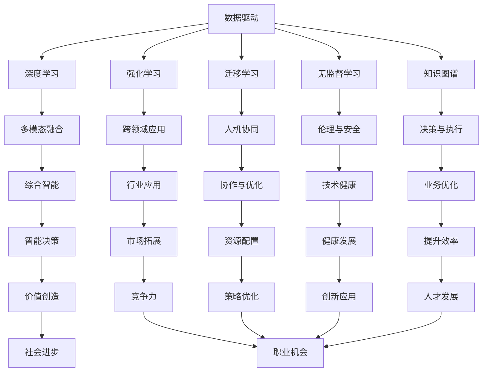

                 

# 李开复：AI 2.0 时代的机遇

## 1. 背景介绍

### 1.1 问题由来

随着人工智能技术的迅猛发展，AI 2.0 时代已经到来。在这个时代，人工智能不再是简单的自动化和算法优化，而是成为推动各行各业创新和变革的核心动力。对于追求技术前沿的企业和个人来说，抓住这一机遇，将显著提升其在未来市场的竞争力。

### 1.2 问题核心关键点

AI 2.0 时代的核心在于以下几个关键点：

- **数据驱动**：人工智能技术的进步离不开大量高质量的数据支持。数据成为驱动AI发展的核心引擎。
- **多模态融合**：AI 2.0 强调不同模态数据（如图像、语音、文本）的融合与协同，提升综合智能水平。
- **跨领域应用**：AI 2.0 不再局限于传统的科研领域，而是广泛应用于医疗、教育、金融、制造等多个行业。
- **人机协同**：AI 2.0 追求人机协作的完美结合，让机器更好地辅助人类决策和执行。
- **伦理与安全**：AI 2.0 时代的AI系统需要更加注重伦理和安全问题，确保技术的健康发展。

### 1.3 问题研究意义

理解AI 2.0 时代的机遇，对于把握技术趋势、优化资源配置、制定发展策略具有重要意义。具体而言：

- 助力企业转型：AI 2.0 为企业提供数字化转型的新路径，帮助其提升效率、降低成本、拓展市场。
- 促进产业升级：AI 2.0 推动产业智能化，优化供应链管理，提升产品和服务质量。
- 驱动创新应用：AI 2.0 推动跨学科交叉融合，催生新的科技产品和服务，推动社会进步。
- 增强竞争力：AI 2.0 技术的广泛应用，将为行业龙头企业带来显著的竞争优势。
- 促进就业增长：AI 2.0 创造新的职业机会，为人才发展提供更多选择。

## 2. 核心概念与联系

### 2.1 核心概念概述

AI 2.0 时代涉及多个核心概念，理解这些概念是把握技术趋势的基础：

- **AI 2.0**：相较于以规则为基础的传统AI 1.0，AI 2.0 强调数据的驱动和模型的自学习能力，目标是构建更加全面、智能的系统。
- **深度学习**：基于神经网络的深度学习技术，通过大量数据训练出具有复杂层次结构的模型，是AI 2.0 的核心算法之一。
- **强化学习**：通过试错学习，AI 2.0 系统能够在不断反馈中优化策略，提升决策能力。
- **迁移学习**：利用已有知识，在新的任务上进行微调，提升模型泛化能力。
- **无监督学习**：通过自监督学习方式，利用未标注数据提升模型的泛化性能。
- **知识图谱**：一种结构化的知识表示方式，帮助AI系统更好地理解复杂世界的实体关系。

### 2.2 核心概念原理和架构的 Mermaid 流程图



这个流程图展示了AI 2.0 时代各个核心概念之间的联系。从数据到模型，从算法到应用，每个环节都互为支撑，共同构成了AI 2.0 的完整生态。

## 3. 核心算法原理 & 具体操作步骤

### 3.1 算法原理概述

AI 2.0 时代的算法原理，可以概括为以下几点：

- **数据驱动**：AI 2.0 系统通过大量标注数据进行训练，学习复杂模式的表示。
- **模型优化**：使用梯度下降等优化算法，不断调整模型参数，最小化损失函数。
- **多模态融合**：通过融合不同模态的数据（如图像、语音、文本），提升系统的综合智能。
- **跨领域应用**：AI 2.0 系统能够在不同领域进行迁移学习，提升泛化能力。
- **人机协同**：AI 2.0 系统通过增强学习等方式，提升人机协作的效率和效果。

### 3.2 算法步骤详解

以下是AI 2.0 系统的一般操作步骤：

1. **数据准备**：收集、清洗、标注数据集，确保数据的质量和多样性。
2. **模型选择**：选择合适的深度学习模型（如卷积神经网络、循环神经网络等），作为初始化参数。
3. **模型训练**：在标注数据集上，使用梯度下降等优化算法训练模型，最小化损失函数。
4. **模型评估**：在验证集上评估模型性能，选择最优模型。
5. **模型部署**：将训练好的模型部署到生产环境中，进行实时推理和决策。
6. **反馈与优化**：根据实际运行结果，收集反馈信息，不断优化模型。

### 3.3 算法优缺点

AI 2.0 算法的优点：

- **高效准确**：深度学习模型在处理复杂数据时，具有高效、准确的特点。
- **适应性强**：多模态融合、跨领域应用使得AI 2.0 系统具备较强的泛化能力。
- **人机协同**：AI 2.0 系统能够与人类协作，提升决策效率和效果。

其缺点：

- **数据依赖**：AI 2.0 系统高度依赖于高质量标注数据，数据收集和标注成本较高。
- **模型复杂**：深度学习模型参数量庞大，训练和推理需要高性能计算资源。
- **黑盒问题**：AI 2.0 系统缺乏可解释性，难以理解其内部决策过程。
- **伦理与安全**：AI 2.0 系统存在偏见、隐私泄露等问题，需要高度关注伦理和安全。

### 3.4 算法应用领域

AI 2.0 算法广泛应用于以下领域：

- **医疗健康**：AI 2.0 用于医疗影像分析、病历记录、疾病预测等，提升医疗服务质量。
- **金融科技**：AI 2.0 用于风险评估、信用评分、智能投顾等，提升金融服务效率。
- **自动驾驶**：AI 2.0 用于环境感知、决策规划、路径优化等，推动自动驾驶技术发展。
- **智能制造**：AI 2.0 用于设备监控、质量检测、生产优化等，提升制造业智能化水平。
- **智慧城市**：AI 2.0 用于交通管理、安防监控、垃圾分类等，提升城市管理水平。
- **教育科技**：AI 2.0 用于个性化教学、智能辅导、内容推荐等，推动教育公平。

## 4. 数学模型和公式 & 详细讲解 & 举例说明

### 4.1 数学模型构建

AI 2.0 算法的数学模型构建，通常包括以下步骤：

1. **输入与输出定义**：定义输入数据集 $X=\{x_i\}_{i=1}^N$，其中 $x_i$ 为数据样本，$y$ 为标签。
2. **模型定义**：定义模型 $f_{\theta}(x)$，其中 $\theta$ 为模型参数。
3. **损失函数定义**：定义损失函数 $L(\theta)$，用于衡量模型预测输出与真实标签之间的差异。
4. **优化目标**：最小化损失函数 $L(\theta)$，得到最优参数 $\theta^*$。

### 4.2 公式推导过程

以二分类任务为例，常见的损失函数为交叉熵损失函数，其公式为：

$$
L(\theta) = -\frac{1}{N}\sum_{i=1}^N [y_i\log f_{\theta}(x_i)+(1-y_i)\log (1-f_{\theta}(x_i))]
$$

其中 $f_{\theta}(x_i)$ 为模型在数据样本 $x_i$ 上的预测概率，$y_i$ 为真实标签。通过梯度下降等优化算法，不断调整模型参数 $\theta$，最小化损失函数 $L(\theta)$。

### 4.3 案例分析与讲解

以图像分类任务为例，使用卷积神经网络（CNN）进行图像分类。首先定义输入图像 $x$，输出标签 $y$。然后定义卷积神经网络模型 $f_{\theta}(x)$，其中 $\theta$ 为模型参数。最后定义交叉熵损失函数 $L(\theta)$，通过反向传播算法更新模型参数 $\theta$，最小化损失函数 $L(\theta)$。

## 5. 项目实践：代码实例和详细解释说明

### 5.1 开发环境搭建

在进行AI 2.0 项目实践前，需要准备好开发环境。以下是使用Python进行PyTorch开发的环境配置流程：

1. 安装Anaconda：从官网下载并安装Anaconda，用于创建独立的Python环境。
2. 创建并激活虚拟环境：
```bash
conda create -n ai-env python=3.8 
conda activate ai-env
```

3. 安装PyTorch：根据CUDA版本，从官网获取对应的安装命令。例如：
```bash
conda install pytorch torchvision torchaudio cudatoolkit=11.1 -c pytorch -c conda-forge
```

4. 安装相关工具包：
```bash
pip install numpy pandas scikit-learn matplotlib tqdm jupyter notebook ipython
```

完成上述步骤后，即可在`ai-env`环境中开始AI 2.0 项目实践。

### 5.2 源代码详细实现

以下是使用PyTorch进行图像分类任务的代码实现：

```python
import torch
import torch.nn as nn
import torch.optim as optim
from torchvision import datasets, transforms
from torch.utils.data import DataLoader

# 定义模型
class Net(nn.Module):
    def __init__(self):
        super(Net, self).__init__()
        self.conv1 = nn.Conv2d(3, 64, kernel_size=3, stride=1, padding=1)
        self.conv2 = nn.Conv2d(64, 128, kernel_size=3, stride=1, padding=1)
        self.pool = nn.MaxPool2d(kernel_size=2, stride=2)
        self.fc1 = nn.Linear(128*4*4, 512)
        self.fc2 = nn.Linear(512, 10)

    def forward(self, x):
        x = self.pool(nn.functional.relu(self.conv1(x)))
        x = self.pool(nn.functional.relu(self.conv2(x)))
        x = x.view(-1, 128*4*4)
        x = nn.functional.relu(self.fc1(x))
        x = self.fc2(x)
        return x

# 加载数据集
transform = transforms.Compose([
    transforms.ToTensor(),
    transforms.Normalize((0.5, 0.5, 0.5), (0.5, 0.5, 0.5))
])
train_dataset = datasets.CIFAR10(root='./data', train=True, download=True, transform=transform)
test_dataset = datasets.CIFAR10(root='./data', train=False, download=True, transform=transform)

# 定义训练参数
device = torch.device('cuda' if torch.cuda.is_available() else 'cpu')
model = Net().to(device)
criterion = nn.CrossEntropyLoss().to(device)
optimizer = optim.Adam(model.parameters(), lr=0.001)

# 训练模型
def train(epoch):
    model.train()
    running_loss = 0.0
    for i, data in enumerate(train_loader, 0):
        inputs, labels = data[0].to(device), data[1].to(device)
        optimizer.zero_grad()
        outputs = model(inputs)
        loss = criterion(outputs, labels)
        loss.backward()
        optimizer.step()
        running_loss += loss.item()
    print(f'Epoch {epoch+1}, loss: {running_loss/len(train_loader)}')

# 测试模型
def test():
    model.eval()
    correct = 0
    with torch.no_grad():
        for data in test_loader:
            inputs, labels = data[0].to(device), data[1].to(device)
            outputs = model(inputs)
            _, predicted = torch.max(outputs.data, 1)
            total = labels.size(0)
            correct += (predicted == labels).sum().item()
    print(f'Accuracy: {(100 * correct / total)}%')

# 主函数
def main():
    train_loader = DataLoader(train_dataset, batch_size=64, shuffle=True)
    test_loader = DataLoader(test_dataset, batch_size=64, shuffle=False)

    for epoch in range(10):
        train(epoch)
        test()

if __name__ == '__main__':
    main()
```

### 5.3 代码解读与分析

这段代码实现了一个简单的卷积神经网络模型，用于CIFAR-10图像分类任务。具体来说：

- 定义了一个包含两个卷积层、两个全连接层的神经网络模型。
- 使用CIFAR-10数据集进行训练和测试。
- 在模型训练过程中，使用Adam优化算法和交叉熵损失函数进行模型更新。
- 在模型测试过程中，计算模型在测试集上的准确率。

## 6. 实际应用场景

### 6.1 医疗健康

AI 2.0 在医疗健康领域具有广泛的应用前景。例如，AI 2.0 用于医学影像分析，通过深度学习模型对医疗影像进行自动解读，提升诊断效率和准确率。AI 2.0 还用于电子病历分析，通过自然语言处理技术对病历进行信息抽取和关系发现，辅助医生进行决策。

### 6.2 金融科技

金融科技领域是AI 2.0 的重要应用方向。AI 2.0 用于风险评估，通过分析海量数据，预测客户违约风险。AI 2.0 还用于智能投顾，通过分析市场数据，生成投资建议，提升投资收益。

### 6.3 自动驾驶

自动驾驶是AI 2.0 的典型应用场景之一。AI 2.0 用于环境感知，通过多模态数据融合，实现对复杂环境的感知和理解。AI 2.0 还用于决策规划，通过优化路径和行为，提升驾驶安全性和舒适性。

### 6.4 智能制造

AI 2.0 在智能制造领域也有广泛应用。AI 2.0 用于设备监控，通过分析传感器数据，预测设备故障，提前进行维护。AI 2.0 还用于质量检测，通过视觉检测技术，自动发现产品缺陷，提升产品质量。

### 6.5 智慧城市

智慧城市是AI 2.0 的重要应用领域。AI 2.0 用于交通管理，通过分析交通数据，优化交通流，提升交通效率。AI 2.0 还用于安防监控，通过人脸识别、行为分析等技术，提升城市安全。

### 6.6 教育科技

AI 2.0 在教育科技领域具有重要应用价值。AI 2.0 用于个性化教学，通过分析学生的学习数据，生成个性化的学习建议。AI 2.0 还用于智能辅导，通过自然语言处理技术，提供智能化的学习辅导。

## 7. 工具和资源推荐

### 7.1 学习资源推荐

为了帮助开发者系统掌握AI 2.0 的技术基础和实践技巧，这里推荐一些优质的学习资源：

1. 《深度学习》书籍：Ian Goodfellow等著，系统介绍了深度学习的基础理论和实践技巧。
2. Coursera《深度学习专项课程》：由Andrew Ng教授主讲，涵盖深度学习的基础理论和应用实例。
3. Udacity《AI Nanodegree》：系统介绍AI 2.0 的核心技术和应用场景，提供实战项目经验。
4. CS231n《卷积神经网络》课程：斯坦福大学开设的图像识别课程，深入讲解卷积神经网络的原理和应用。
5. 《自然语言处理综论》书籍：Daniel Jurafsky等著，全面介绍自然语言处理的基本概念和最新进展。

### 7.2 开发工具推荐

高效的开发离不开优秀的工具支持。以下是几款用于AI 2.0 开发的常用工具：

1. PyTorch：基于Python的开源深度学习框架，灵活动态的计算图，适合快速迭代研究。
2. TensorFlow：由Google主导开发的开源深度学习框架，生产部署方便，适合大规模工程应用。
3. TensorBoard：TensorFlow配套的可视化工具，可实时监测模型训练状态，并提供丰富的图表呈现方式。
4. Jupyter Notebook：免费的交互式编程环境，支持多种语言和库，方便快速开发和实验。
5. Anaconda：Python科学计算平台，集成了多种数据科学工具，方便快速搭建环境。

### 7.3 相关论文推荐

AI 2.0 技术的发展离不开学界的持续研究。以下是几篇奠基性的相关论文，推荐阅读：

1. AlexNet：ImageNet大规模视觉识别挑战赛的获奖模型，标志着深度学习在计算机视觉领域的突破。
2. GoogleNet：通过引入Inception模块，提升深度神经网络的性能和效率。
3. ResNet：通过残差网络结构，解决深度神经网络的退化问题，推动深度学习的进一步发展。
4. VGGNet：通过使用卷积核大小为3x3的卷积层，提高深度神经网络的性能。
5. YOLO：You Only Look Once目标检测算法，通过单阶段预测，提升目标检测的实时性和准确性。
6. BERT：预训练语言模型，通过自监督学习，提升自然语言处理的性能。
7. GPT-3：大规模语言模型，通过大规模预训练，提升自然语言生成和理解能力。

## 8. 总结：未来发展趋势与挑战

### 8.1 研究成果总结

AI 2.0 技术的快速发展，带来了诸多突破和进展：

- **数据驱动**：大数据和云计算技术的成熟，使得AI 2.0 系统能够处理海量数据，提升模型性能。
- **模型优化**：深度学习、强化学习等算法的不断优化，提升了AI 2.0 系统的智能水平。
- **多模态融合**：通过融合不同模态的数据，提升了AI 2.0 系统的综合智能。
- **跨领域应用**：AI 2.0 系统在多个领域的应用实践，验证了其广泛的适用性。

### 8.2 未来发展趋势

展望未来，AI 2.0 技术将呈现以下几个发展趋势：

1. **数据驱动**：数据的多样化和复杂化将继续推动AI 2.0 的发展。
2. **模型优化**：深度学习、强化学习等算法的进一步优化，将提升AI 2.0 的性能。
3. **多模态融合**：通过融合不同模态的数据，提升AI 2.0 系统的智能水平。
4. **跨领域应用**：AI 2.0 系统将在更多领域得到应用，推动各行各业的数字化转型。
5. **人机协同**：AI 2.0 系统将更加注重人机协作，提升系统的决策效率和效果。
6. **伦理与安全**：AI 2.0 系统将更加注重伦理和安全问题，确保技术的健康发展。

### 8.3 面临的挑战

尽管AI 2.0 技术取得了诸多突破，但在迈向更加智能化、普适化应用的过程中，仍面临诸多挑战：

1. **数据依赖**：AI 2.0 系统高度依赖于高质量标注数据，数据收集和标注成本较高。
2. **模型复杂**：深度学习模型参数量庞大，训练和推理需要高性能计算资源。
3. **黑盒问题**：AI 2.0 系统缺乏可解释性，难以理解其内部决策过程。
4. **伦理与安全**：AI 2.0 系统存在偏见、隐私泄露等问题，需要高度关注伦理和安全。

### 8.4 研究展望

未来，AI 2.0 技术需要在以下几个方面进行深入研究：

1. **无监督学习和迁移学习**：探索无监督和半监督学习范式，降低对标注数据的依赖。
2. **参数高效和计算高效**：开发更加参数高效和计算高效的微调方法，提升AI 2.0 系统的性能。
3. **多模态融合与跨领域应用**：研究多模态融合与跨领域应用的结合，提升系统的综合智能。
4. **人机协同与增强学习**：探索人机协同与增强学习的结合，提升系统的决策效率和效果。
5. **伦理与安全**：研究AI 2.0 系统的伦理和安全问题，确保技术的健康发展。

这些研究方向将引领AI 2.0 技术的进一步发展，推动人工智能技术在各个领域的广泛应用。

## 9. 附录：常见问题与解答

**Q1：AI 2.0 系统是否适用于所有行业？**

A: AI 2.0 系统具有广泛的适用性，但在不同行业的应用需要针对具体需求进行定制化设计。例如，在医疗健康领域，AI 2.0 系统需要考虑数据隐私和安全问题；在金融科技领域，AI 2.0 系统需要考虑模型鲁棒性和风险控制。

**Q2：AI 2.0 系统是否需要大量标注数据？**

A: AI 2.0 系统通常需要大量的标注数据进行训练。但在某些领域，如自然语言处理，可以使用无监督学习和迁移学习等方法，降低对标注数据的依赖。

**Q3：AI 2.0 系统的性能提升是否依赖于硬件？**

A: AI 2.0 系统的性能提升确实依赖于高性能计算资源。但通过优化算法和模型结构，可以在有限的计算资源下获得较好的性能提升。

**Q4：AI 2.0 系统是否需要大量的专家知识？**

A: AI 2.0 系统通常需要一定的领域知识进行任务定制化设计。但通过多模态融合和跨领域应用，AI 2.0 系统可以逐步学习并整合更多领域的知识。

**Q5：AI 2.0 系统是否存在伦理和安全问题？**

A: AI 2.0 系统存在一定的伦理和安全问题，如偏见、隐私泄露等。需要在系统设计和应用中高度重视，建立完善的伦理和安全机制。

---

作者：禅与计算机程序设计艺术 / Zen and the Art of Computer Programming

