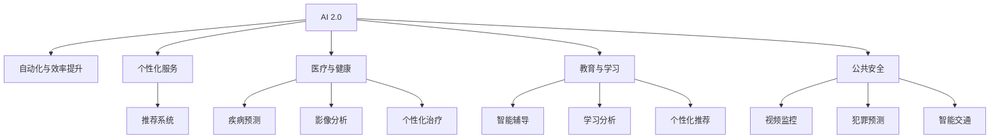

                 

# 李开复：AI 2.0 时代的社会价值

## 1. 背景介绍

### 1.1 问题由来
随着人工智能（AI）技术的迅速发展，我们正在进入一个名为“AI 2.0”的新时代。这个时代的特征是AI与各行各业的深度融合，在医疗、金融、教育、城市管理等领域产生了深远的影响。然而，随着AI技术的广泛应用，其对社会的影响也引发了越来越多的讨论和关注。本文旨在探讨AI 2.0时代的社会价值，分析其在推动社会进步和创新中的作用，以及面临的挑战和应对策略。

### 1.2 问题核心关键点
AI 2.0时代的社会价值主要体现在以下几个方面：
- **自动化与效率提升**：通过自动化和智能化技术，AI可以大幅提高生产效率，降低成本。
- **个性化服务**：利用AI进行个性化推荐和定制化服务，提升用户体验。
- **医疗与健康**：AI在医疗领域的应用，如疾病诊断、个性化治疗等，显著提升了医疗服务的质量和可及性。
- **教育与学习**：通过智能辅导系统和学习平台，AI可以帮助学生个性化学习，提高学习效果。
- **公共安全**：AI在公共安全领域的应用，如视频监控、犯罪预测等，提升了社会安全水平。

然而，AI的快速发展也带来了一些挑战，如就业替代、隐私保护、伦理道德等问题。因此，如何平衡AI的正面影响和负面影响，成为社会必须面对的问题。

### 1.3 问题研究意义
探讨AI 2.0时代的社会价值，对于理解AI技术的潜在影响、制定相关政策和规范、以及引导AI技术的健康发展具有重要意义。它不仅有助于推动AI技术在各行业中的应用，还能促进社会公平和可持续发展，避免AI技术带来的潜在风险。

## 2. 核心概念与联系

### 2.1 核心概念概述

为了深入理解AI 2.0时代的社会价值，我们需要先明确几个核心概念及其之间的关系：

- **AI 2.0**：指AI技术在各行各业的广泛应用，通过智能化和自动化技术提升生产效率和生活质量。
- **自动化与效率提升**：AI通过自动执行重复性任务，减轻人力负担，提升工作效率。
- **个性化服务**：利用AI对用户行为和需求进行分析和预测，提供量身定制的服务和推荐。
- **医疗与健康**：AI在医疗领域的应用，包括疾病预测、影像分析、个性化治疗等。
- **教育与学习**：AI在教育领域的应用，如智能辅导、学习分析、个性化推荐等。
- **公共安全**：AI在公共安全领域的应用，如视频监控、犯罪预测、智能交通等。

这些概念之间相互关联，共同构成了AI 2.0时代的多维社会价值体系。

### 2.2 核心概念原理和架构的 Mermaid 流程图



这个流程图展示了AI 2.0时代不同领域的核心应用及其相互关系。AI通过自动化和智能化技术，提升了各行业的效率和质量，同时提供了个性化和定制化的服务，改善了医疗、教育和公共安全等领域的表现。

## 3. 核心算法原理 & 具体操作步骤

### 3.1 算法原理概述

AI 2.0时代，核心算法原理主要涉及以下几个方面：

- **深度学习与神经网络**：通过深度学习算法，AI可以学习复杂的模式和特征，实现高效的自动推理和决策。
- **强化学习**：通过奖励机制，AI可以优化决策过程，提升智能系统的表现。
- **迁移学习**：通过知识迁移，AI可以在新任务上快速学习和适应，提升泛化能力。
- **增强现实与虚拟现实**：通过增强现实和虚拟现实技术，AI可以提供沉浸式和交互式的用户体验。

这些算法原理构成了AI 2.0时代的技术基础，使AI能够在各个领域实现广泛应用。

### 3.2 算法步骤详解

AI 2.0时代的算法步骤大致包括以下几个关键步骤：

1. **数据收集与预处理**：收集领域相关的数据，并进行清洗和预处理。
2. **模型选择与设计**：根据任务需求选择合适的算法模型，并进行必要的调整和设计。
3. **模型训练与优化**：使用训练数据对模型进行训练，并通过调整超参数、优化算法等手段进行优化。
4. **模型评估与部署**：在验证数据上评估模型性能，将模型部署到实际应用场景中，进行实时推理和决策。

### 3.3 算法优缺点

AI 2.0时代的算法具有以下优点：
- **高效性与自动化**：深度学习等算法可以快速处理大量数据，自动化执行任务。
- **泛化能力强**：通过迁移学习等技术，AI模型能够适应多种领域和场景。
- **用户定制化**：个性化服务和推荐系统可以根据用户需求进行定制化。

同时，AI算法也存在一些缺点：
- **数据依赖性高**：AI模型的性能依赖于高质量的数据，数据不足或质量差会导致模型性能下降。
- **模型可解释性差**：深度学习等算法往往是"黑盒"模型，难以解释其决策过程。
- **计算资源需求高**：大规模模型的训练和推理需要高性能的计算资源，对硬件要求较高。

### 3.4 算法应用领域

AI 2.0时代的算法在多个领域得到了广泛应用，如：

- **金融行业**：通过AI进行风险评估、欺诈检测、投资策略等。
- **制造业**：利用AI进行生产优化、质量检测、设备维护等。
- **零售业**：通过AI进行需求预测、库存管理、个性化推荐等。
- **医疗健康**：利用AI进行疾病诊断、影像分析、个性化治疗等。
- **教育**：通过AI进行智能辅导、学习分析、个性化推荐等。
- **公共安全**：利用AI进行视频监控、犯罪预测、智能交通等。

## 4. 数学模型和公式 & 详细讲解 & 举例说明

### 4.1 数学模型构建

在AI 2.0时代，数学模型构建主要涉及以下几个方面：

- **线性回归**：用于预测连续型变量的模型。
- **逻辑回归**：用于分类任务的模型。
- **卷积神经网络（CNN）**：用于图像处理和视觉任务的模型。
- **循环神经网络（RNN）**：用于序列数据处理的模型。
- **长短时记忆网络（LSTM）**：用于解决长序列数据处理的模型。
- **深度学习模型**：如深度神经网络（DNN）、卷积神经网络（CNN）、循环神经网络（RNN）等。

### 4.2 公式推导过程

以逻辑回归模型为例，其公式推导过程如下：

设$y$为标签，$\theta$为模型参数，$x$为输入特征。则逻辑回归模型的预测公式为：

$$ y' = \frac{1}{1+e^{-\theta^T x}} $$

其中$y'$为预测值，$\theta^T$为模型参数的转置。

模型训练的目标是最小化预测值$y'$与实际标签$y$之间的交叉熵损失函数：

$$ \mathcal{L}(\theta) = -\frac{1}{N}\sum_{i=1}^N y_i \log y'_i + (1-y_i) \log (1-y'_i) $$

其中$N$为样本数量。

通过梯度下降等优化算法，最小化损失函数，更新模型参数$\theta$，使得模型预测结果与实际标签接近。

### 4.3 案例分析与讲解

以医疗领域为例，利用AI进行疾病预测和影像分析的案例如下：

**疾病预测**：通过收集患者的病历数据，包括年龄、性别、病史等，建立逻辑回归模型，预测患者患某种疾病的概率。模型训练数据集包括历史患者数据，测试数据集包括新患者数据。

**影像分析**：通过深度学习算法，如卷积神经网络（CNN），对医疗影像进行分析和识别。以肺部CT影像为例，模型输入为CT图像，输出为肿瘤病灶的位置和大小。

## 5. 项目实践：代码实例和详细解释说明

### 5.1 开发环境搭建

要进行AI 2.0时代的项目实践，首先需要搭建好开发环境。以下是Python开发环境的配置步骤：

1. 安装Python 3.x版本，推荐3.6或以上。
2. 安装Anaconda，创建一个新的Python虚拟环境。
3. 在虚拟环境中安装所需的第三方库，如TensorFlow、PyTorch、Keras等。

### 5.2 源代码详细实现

以下是使用TensorFlow进行图像分类任务的代码实现：

```python
import tensorflow as tf
from tensorflow.keras import layers, models

# 加载数据集
(x_train, y_train), (x_test, y_test) = tf.keras.datasets.mnist.load_data()

# 数据预处理
x_train = x_train.reshape(-1, 28, 28, 1).astype('float32') / 255.0
x_test = x_test.reshape(-1, 28, 28, 1).astype('float32') / 255.0

# 定义模型
model = models.Sequential([
    layers.Conv2D(32, (3, 3), activation='relu', input_shape=(28, 28, 1)),
    layers.MaxPooling2D((2, 2)),
    layers.Flatten(),
    layers.Dense(10, activation='softmax')
])

# 编译模型
model.compile(optimizer='adam',
              loss='sparse_categorical_crossentropy',
              metrics=['accuracy'])

# 训练模型
model.fit(x_train, y_train, epochs=5, batch_size=64)

# 评估模型
model.evaluate(x_test, y_test)
```

### 5.3 代码解读与分析

上述代码实现了基于卷积神经网络（CNN）的图像分类模型。主要步骤如下：

1. 加载数据集：使用TensorFlow内置的MNIST数据集。
2. 数据预处理：将图像数据转换为浮点数，并归一化到[0, 1]区间。
3. 定义模型：构建一个包含卷积层、池化层、全连接层的CNN模型。
4. 编译模型：使用Adam优化器，交叉熵损失函数，准确率作为评估指标。
5. 训练模型：使用训练集数据，迭代5个epochs，每个批次大小为64。
6. 评估模型：使用测试集数据，评估模型性能。

## 6. 实际应用场景

### 6.4 未来应用展望

AI 2.0时代的未来应用前景广阔，以下列举几个潜在的应用场景：

1. **智能交通**：通过AI进行交通流量预测、智能信号控制、自动驾驶等，提升城市交通效率。
2. **智能制造**：利用AI进行生产流程优化、质量检测、设备维护等，降低生产成本，提升生产效率。
3. **智能家居**：通过AI进行智能家电控制、环境监测、安全预警等，提升居住体验。
4. **智能城市**：利用AI进行城市规划、环境监测、灾害预警等，提升城市管理水平。
5. **智能医疗**：通过AI进行疾病预测、影像分析、个性化治疗等，提升医疗服务质量。

## 7. 工具和资源推荐

### 7.1 学习资源推荐

为了深入学习AI 2.0时代的技术和应用，以下是一些推荐的学习资源：

1. 《深度学习》（Goodfellow et al.）：介绍深度学习的基本理论和算法，是学习AI的必备书籍。
2. 《TensorFlow实战》（Manning & Fowers）：介绍TensorFlow的使用和实践，适合初学者。
3. 《Python深度学习》（Francois et al.）：介绍使用Python进行深度学习的实践，包含丰富的代码示例。
4. Coursera上的深度学习课程：由斯坦福大学等知名大学提供，涵盖深度学习的基础理论和实践。
5. Kaggle数据科学竞赛平台：提供大量数据集和模型，适合实践和竞赛。

### 7.2 开发工具推荐

以下是一些推荐的AI开发工具：

1. TensorFlow：谷歌开发的深度学习框架，支持GPU加速，适合大规模模型训练。
2. PyTorch：Facebook开发的深度学习框架，支持动态计算图，适合研究和小规模模型训练。
3. Keras：高级神经网络API，简单易用，适合快速原型开发。
4. Jupyter Notebook：交互式编程环境，适合数据探索和模型实验。
5. GitHub：代码托管平台，适合版本控制和协作开发。

### 7.3 相关论文推荐

为了深入了解AI 2.0时代的最新研究进展，以下是一些推荐的相关论文：

1. "Deep Residual Learning for Image Recognition"（He et al.）：介绍深度残差网络（ResNet）的实现，提升了图像分类模型的深度。
2. "Attention is All You Need"（Vaswani et al.）：介绍Transformer模型，开启了自注意力机制在NLP中的应用。
3. "Natural Language Processing (almost) from Scratch"（Sennrich et al.）：介绍如何从零构建NLP模型，适合初学者。
4. "Generative Adversarial Nets"（Goodfellow et al.）：介绍生成对抗网络（GAN）的实现，适用于生成任务。
5. "Learning Transferable Knowledge for Robotics"（Policies et al.）：介绍迁移学习在机器人学中的应用，提升模型泛化能力。

## 8. 总结：未来发展趋势与挑战

### 8.1 研究成果总结

AI 2.0时代在自动化与效率提升、个性化服务、医疗与健康、教育与学习、公共安全等领域展现了巨大的社会价值。通过深度学习、强化学习、迁移学习等算法，AI在各个领域实现了广泛应用，提升了生产效率和生活质量。

### 8.2 未来发展趋势

AI 2.0时代的未来发展趋势如下：

1. **智能化与自动化**：AI将进一步提升各个领域的自动化水平，减轻人力负担，提高效率。
2. **个性化与定制化**：AI将提供更加个性化的服务和推荐，提升用户体验。
3. **跨领域与跨学科融合**：AI将与其他学科和领域进行更深入的融合，拓展应用范围。
4. **多模态与融合学习**：AI将利用多种模态数据进行融合学习，提升模型的表现。
5. **伦理与道德**：AI将更加注重伦理和道德问题，确保技术的健康发展。

### 8.3 面临的挑战

AI 2.0时代的挑战主要包括以下几个方面：

1. **数据质量与多样性**：高质量、多样化的数据是AI模型表现的关键，数据不足或质量差会导致模型性能下降。
2. **模型可解释性与透明度**：深度学习等算法往往是"黑盒"模型，难以解释其决策过程，影响模型的可信度。
3. **计算资源与硬件成本**：大规模模型的训练和推理需要高性能的计算资源，硬件成本较高。
4. **伦理与隐私**：AI模型的应用可能引发伦理和隐私问题，如数据滥用、隐私泄露等。
5. **社会公平与就业**：AI的广泛应用可能导致部分岗位被替代，引发就业问题。

### 8.4 研究展望

未来，AI 2.0时代的重点研究方向如下：

1. **数据获取与标注**：探索无监督学习和半监督学习的方法，降低对标注数据的依赖。
2. **模型优化与压缩**：开发参数高效和计算高效的模型，降低计算资源需求。
3. **伦理与隐私保护**：建立AI模型的伦理和隐私保护机制，确保技术应用的安全性。
4. **跨领域融合学习**：探索多模态数据融合的方法，提升模型的表现。
5. **社会公平与就业**：研究AI对就业的影响，制定相应的政策和措施。

## 9. 附录：常见问题与解答

**Q1：如何提升AI模型的可解释性？**

A：提升AI模型的可解释性，可以从以下几个方面入手：

1. 使用可视化工具，如TensorBoard，可视化模型的训练过程和结果。
2. 使用模型解释工具，如LIME、SHAP，分析模型的决策过程和特征重要性。
3. 设计简洁的模型结构，避免过于复杂和"黑盒"化的模型。
4. 提供清晰的模型文档和用户指南，帮助用户理解模型的应用场景和限制。

**Q2：如何避免AI模型在实际应用中的过拟合？**

A：避免AI模型在实际应用中的过拟合，可以采取以下措施：

1. 数据增强：通过数据扩充、数据增强等方法，增加训练数据的多样性。
2. 正则化：使用L2正则、Dropout等正则化方法，防止模型过度拟合。
3. 对抗训练：引入对抗样本，提高模型的鲁棒性和泛化能力。
4. 参数共享：使用共享参数的方法，减少模型的复杂度。

**Q3：如何构建高效的AI模型？**

A：构建高效的AI模型，需要综合考虑以下几个方面：

1. 选择合适的模型架构：根据任务需求选择适当的模型，如CNN、RNN、Transformer等。
2. 优化模型结构：简化模型结构，避免冗余和复杂性，提高模型的泛化能力。
3. 优化超参数：使用网格搜索、随机搜索等方法，优化模型的超参数，提升模型性能。
4. 使用预训练模型：利用预训练模型作为初始化参数，加快模型的训练速度和性能提升。

**Q4：如何在实际应用中平衡AI技术的社会效益与风险？**

A：在实际应用中平衡AI技术的社会效益与风险，需要从以下几个方面入手：

1. 制定相关政策和法规，确保AI技术的安全性和合规性。
2. 加强伦理和道德教育，提高公众对AI技术的理解和接受度。
3. 开展技术培训和教育，提升AI开发和应用人员的素质。
4. 加强模型和系统的监测与评估，确保技术应用的透明度和公正性。

---

作者：禅与计算机程序设计艺术 / Zen and the Art of Computer Programming

