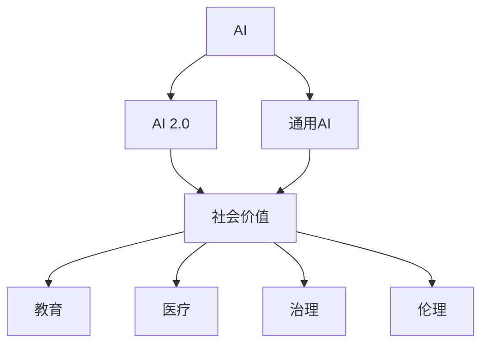

                 

## 1. 背景介绍

### 1.1 问题由来

人工智能（AI）技术已经在过去几十年里取得了长足的发展，从最初的专家系统、机器学习到深度学习、生成对抗网络（GANs），每一次技术突破都极大地扩展了人工智能的应用领域和深度。尤其是近年来，随着大规模数据和强大的计算能力的推动，AI技术进入了一个全新的阶段，即AI 2.0时代。

AI 2.0时代的重要标志是通用人工智能（General AI）的兴起，即能够执行任何智力任务的人工智能系统。这类系统不再局限于某一特定领域或任务，而是具备广泛的应用场景和能力，如自然语言处理、视觉识别、决策制定等。AI 2.0的崛起引发了人们对这一技术的广泛关注，同时也带来了对社会、经济、伦理等各方面影响的深入思考。

### 1.2 问题核心关键点

AI 2.0技术的发展不仅在技术层面带来创新，更在社会层面引发了深远的影响。本文旨在探讨AI 2.0时代，人工智能的社会价值，分析其在教育、医疗、治理、伦理等领域的潜在应用与挑战。

## 2. 核心概念与联系

### 2.1 核心概念概述

为了更好地理解AI 2.0时代人工智能的社会价值，首先需要对以下几个核心概念进行梳理：

- **人工智能（AI）**：指能够执行人类智能任务（如视觉识别、自然语言处理、决策制定等）的技术系统。
- **通用人工智能（General AI）**：能够执行任何智力任务的AI系统，不限于特定领域或任务。
- **AI 2.0**：指AI技术的最新发展阶段，特点包括大规模数据驱动、深度学习等技术。
- **社会价值**：AI技术对社会各个方面（如教育、医疗、治理等）带来的积极影响和潜在收益。

### 2.2 核心概念原理和架构的 Mermaid 流程图



这个流程图展示了AI 2.0技术在社会各领域的潜在应用和价值。

## 3. 核心算法原理 & 具体操作步骤

### 3.1 算法原理概述

AI 2.0时代的核心算法原理主要围绕深度学习和生成对抗网络（GANs）等技术展开。这些算法通过大规模数据训练，学习复杂的数据分布，从而具备强大的智能任务处理能力。

### 3.2 算法步骤详解

AI 2.0技术的核心算法步骤包括数据收集、模型训练、模型评估和模型部署。

1. **数据收集**：收集大规模的数据集，包括结构化数据（如数据库记录）和非结构化数据（如图像、文本等）。
2. **模型训练**：使用深度学习框架（如TensorFlow、PyTorch）训练AI模型，通过反向传播算法优化模型参数。
3. **模型评估**：在测试集上评估模型性能，使用各种指标（如准确率、召回率、F1分数等）评估模型效果。
4. **模型部署**：将训练好的模型部署到实际应用中，如智能助手、自动驾驶、医疗诊断等。

### 3.3 算法优缺点

AI 2.0技术的优点包括：

- **高效性**：能够处理大量数据，并在短时间内训练出高性能模型。
- **灵活性**：适应性强，适用于各种类型的任务。
- **可扩展性**：能够通过增加数据和计算资源来提升模型性能。

然而，也存在一些缺点：

- **数据依赖**：需要大量高质量的数据进行训练，数据不足或质量差会影响模型效果。
- **计算成本高**：需要强大的计算资源和大量计算时间。
- **透明度低**：模型决策过程难以解释，存在"黑箱"问题。

### 3.4 算法应用领域

AI 2.0技术的应用领域广泛，涉及医疗、教育、金融、自动驾驶等多个领域。

- **医疗**：用于疾病诊断、药物研发、患者护理等。
- **教育**：用于个性化学习、智能评估、虚拟导师等。
- **金融**：用于风险评估、欺诈检测、投资决策等。
- **自动驾驶**：用于环境感知、路径规划、避障等。

## 4. 数学模型和公式 & 详细讲解 & 举例说明

### 4.1 数学模型构建

AI 2.0技术通常基于神经网络（如卷积神经网络、循环神经网络、生成对抗网络等）构建数学模型。

### 4.2 公式推导过程

以卷积神经网络（CNN）为例，推导其前向传播和反向传播的数学公式。

**前向传播**：
$$ y = \sigma(Wx + b) $$
其中，$W$为权重矩阵，$b$为偏置向量，$\sigma$为激活函数，$x$为输入向量，$y$为输出向量。

**反向传播**：
$$ \frac{\partial L}{\partial W} = \frac{\partial L}{\partial y} \frac{\partial y}{\partial W} = \frac{\partial L}{\partial y} \frac{\partial \sigma}{\partial z} \frac{\partial z}{\partial W} $$
其中，$L$为损失函数，$z$为激活函数的输出向量。

### 4.3 案例分析与讲解

以图像识别任务为例，使用卷积神经网络进行图像分类。

1. **数据准备**：收集图像数据集，并进行预处理（如归一化、数据增强等）。
2. **模型构建**：定义卷积神经网络的结构，包括卷积层、池化层、全连接层等。
3. **训练模型**：使用反向传播算法更新模型参数，最小化损失函数。
4. **模型评估**：在测试集上评估模型性能，使用混淆矩阵、准确率等指标。

## 5. 项目实践：代码实例和详细解释说明

### 5.1 开发环境搭建

1. **安装Python**：从官网下载并安装Python 3.x版本。
2. **安装依赖库**：使用pip安装TensorFlow、Keras、NumPy等依赖库。
3. **设置环境变量**：配置Python路径，确保所有依赖库可被正确加载。

### 5.2 源代码详细实现

以下是一个使用Keras框架实现图像分类的代码实例：

```python
from keras.models import Sequential
from keras.layers import Conv2D, MaxPooling2D, Flatten, Dense

model = Sequential()
model.add(Conv2D(32, (3, 3), activation='relu', input_shape=(64, 64, 3)))
model.add(MaxPooling2D((2, 2)))
model.add(Conv2D(64, (3, 3), activation='relu'))
model.add(MaxPooling2D((2, 2)))
model.add(Flatten())
model.add(Dense(64, activation='relu'))
model.add(Dense(10, activation='softmax'))

model.compile(optimizer='adam', loss='categorical_crossentropy', metrics=['accuracy'])

model.fit(train_images, train_labels, epochs=10, batch_size=32)
```

### 5.3 代码解读与分析

**代码解读**：
1. **模型构建**：使用Keras框架构建卷积神经网络模型，包括卷积层、池化层、全连接层等。
2. **模型编译**：设置优化器、损失函数和评估指标。
3. **模型训练**：使用fit方法训练模型，指定训练集、批次大小和迭代轮数。

**代码分析**：
1. **模型结构设计**：卷积层和池化层的交替使用，有效提取图像特征。
2. **模型编译配置**：使用Adam优化器，适应性更强。
3. **模型训练设置**：多次迭代，增加模型泛化能力。

### 5.4 运行结果展示

训练完毕后，使用测试集评估模型性能：

```python
test_loss, test_acc = model.evaluate(test_images, test_labels)
print('Test accuracy:', test_acc)
```

## 6. 实际应用场景

### 6.1 医疗领域

AI 2.0技术在医疗领域的应用前景广阔，可以从多个角度提升医疗服务的质量：

- **疾病诊断**：使用深度学习模型对医学影像进行自动分析和诊断，如X光片、CT扫描等。
- **药物研发**：利用生成对抗网络（GANs）生成新药物分子，加速药物研发过程。
- **患者护理**：通过智能助手和聊天机器人，提供24小时在线咨询和指导。

### 6.2 教育领域

AI 2.0技术在教育领域的应用包括：

- **个性化学习**：根据学生的学习行为和成绩，推荐个性化学习内容。
- **智能评估**：自动评分系统，快速评估学生作业和考试。
- **虚拟导师**：虚拟导师系统，提供24小时在线答疑和指导。

### 6.3 治理领域

AI 2.0技术在治理领域的应用包括：

- **公共安全**：利用计算机视觉技术进行视频监控和人脸识别，提升公共安全水平。
- **城市管理**：通过智能交通系统，优化交通流量，减少拥堵。
- **环保监测**：利用卫星图像和传感器数据，进行环境监测和污染预测。

## 7. 工具和资源推荐

### 7.1 学习资源推荐

1. **Coursera**：提供大量AI相关课程，涵盖深度学习、计算机视觉、自然语言处理等多个领域。
2. **Kaggle**：提供数据科学竞赛平台，积累实战经验。
3. **arXiv**：提供大量AI领域的最新研究成果和论文。

### 7.2 开发工具推荐

1. **TensorFlow**：谷歌开发的深度学习框架，支持分布式计算和模型部署。
2. **PyTorch**：Facebook开发的深度学习框架，灵活性强，支持动态图和静态图。
3. **Keras**：高层次API，简化深度学习模型的构建和训练。

### 7.3 相关论文推荐

1. **深度学习**：Goodfellow, I., Bengio, Y., & Courville, A. (2016). Deep Learning.
2. **生成对抗网络**：Goodfellow, I., Pouget-Abadie, J., Mirza, M., Xu, B., Warde-Farley, D., Ozair, S., ... & Bengio, Y. (2014). Generative adversarial nets.
3. **卷积神经网络**：LeCun, Y., Bottou, L., Bengio, Y., & Haffner, P. (1998). Gradient-based learning applied to document recognition.
4. **自然语言处理**：Bengio, Y., Ducharme, R., & Jauvin, P. (2001). Learning long-term dependencies with gradient descent is difficult.

## 8. 总结：未来发展趋势与挑战

### 8.1 研究成果总结

AI 2.0技术在医疗、教育、治理等多个领域展示了巨大的潜力，带来了广泛的社会价值。然而，技术发展也面临诸多挑战，包括数据依赖、计算成本高、透明度低等问题。

### 8.2 未来发展趋势

1. **数据利用**：通过数据增强、迁移学习等技术，提升数据利用效率。
2. **模型优化**：使用更高效的模型架构和算法，降低计算成本。
3. **可解释性**：开发更可解释的模型，提升模型透明度。
4. **跨领域应用**：推动AI技术在更多领域的应用，促进产业升级。

### 8.3 面临的挑战

1. **数据隐私**：保护用户隐私，避免数据滥用。
2. **伦理问题**：确保AI系统的公平性、透明性和安全性。
3. **法律合规**：遵守相关法律法规，避免法律风险。
4. **社会接受度**：增强公众对AI技术的信任和接受度。

### 8.4 研究展望

未来的研究需要重点关注：

1. **伦理道德**：构建公平、透明、安全的AI系统。
2. **法律合规**：确保AI技术在法律框架下的应用。
3. **社会接受**：增强公众对AI技术的理解和接受。
4. **跨领域融合**：推动AI技术与其他技术的融合，提升AI系统能力。

## 9. 附录：常见问题与解答

**Q1：AI 2.0技术的主要应用领域有哪些？**

A: AI 2.0技术在医疗、教育、治理、金融等多个领域具有广泛的应用前景。例如，在医疗领域可以用于疾病诊断、药物研发、患者护理等；在教育领域可以用于个性化学习、智能评估、虚拟导师等；在治理领域可以用于公共安全、城市管理、环保监测等。

**Q2：AI 2.0技术在医疗领域的应用有哪些？**

A: AI 2.0技术在医疗领域的应用包括疾病诊断、药物研发、患者护理等。例如，使用深度学习模型对医学影像进行自动分析和诊断，利用生成对抗网络（GANs）生成新药物分子，通过智能助手和聊天机器人提供24小时在线咨询和指导。

**Q3：AI 2.0技术在教育领域的应用有哪些？**

A: AI 2.0技术在教育领域的应用包括个性化学习、智能评估、虚拟导师等。例如，根据学生的学习行为和成绩推荐个性化学习内容，使用自动评分系统快速评估学生作业和考试，通过虚拟导师系统提供24小时在线答疑和指导。

**Q4：AI 2.0技术在治理领域的应用有哪些？**

A: AI 2.0技术在治理领域的应用包括公共安全、城市管理、环保监测等。例如，利用计算机视觉技术进行视频监控和人脸识别，提升公共安全水平；通过智能交通系统优化交通流量，减少拥堵；利用卫星图像和传感器数据进行环境监测和污染预测。

**Q5：AI 2.0技术的未来发展方向是什么？**

A: AI 2.0技术的未来发展方向包括数据利用、模型优化、可解释性提升、跨领域应用等。例如，通过数据增强、迁移学习等技术提升数据利用效率，使用更高效的模型架构和算法降低计算成本，开发更可解释的模型提升透明度，推动AI技术在更多领域的应用，促进产业升级。

**Q6：AI 2.0技术在医疗领域面临的主要挑战是什么？**

A: AI 2.0技术在医疗领域面临的主要挑战包括数据隐私、伦理问题、法律合规等。例如，需要保护用户隐私，避免数据滥用；确保AI系统的公平性、透明性和安全性；遵守相关法律法规，避免法律风险。

**Q7：AI 2.0技术在教育领域面临的主要挑战是什么？**

A: AI 2.0技术在教育领域面临的主要挑战包括数据隐私、伦理问题、法律合规等。例如，需要保护学生隐私，避免数据滥用；确保AI系统的公平性、透明性和安全性；遵守相关法律法规，避免法律风险。

**Q8：AI 2.0技术在治理领域面临的主要挑战是什么？**

A: AI 2.0技术在治理领域面临的主要挑战包括数据隐私、伦理问题、法律合规等。例如，需要保护用户隐私，避免数据滥用；确保AI系统的公平性、透明性和安全性；遵守相关法律法规，避免法律风险。

**Q9：AI 2.0技术的未来研究方向是什么？**

A: AI 2.0技术的未来研究方向包括伦理道德、法律合规、社会接受、跨领域融合等。例如，构建公平、透明、安全的AI系统；确保AI技术在法律框架下的应用；增强公众对AI技术的理解和接受；推动AI技术与其他技术的融合，提升AI系统能力。

**Q10：AI 2.0技术的优势和劣势是什么？**

A: AI 2.0技术的优势包括高效性、灵活性、可扩展性等，劣势包括数据依赖、计算成本高、透明度低等。例如，能够处理大量数据，并在短时间内训练出高性能模型；适应性强，适用于各种类型的任务；需要大量高质量的数据进行训练，数据不足或质量差会影响模型效果；需要强大的计算资源和大量计算时间；模型决策过程难以解释，存在"黑箱"问题。

作者：禅与计算机程序设计艺术 / Zen and the Art of Computer Programming

