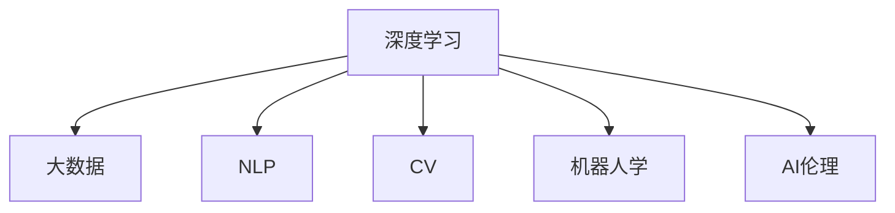

                 

# 李开复：AI 2.0 时代的观察者

## 1. 背景介绍

### 1.1 问题由来
在科技飞速发展的今天，人工智能（AI）已经从AI 1.0进入了AI 2.0的时代。这一时代的核心标志是深度学习技术和大数据的应用，使得AI系统具备了更加强大的学习能力和推理能力。然而，AI 2.0时代也带来了许多新的挑战和问题，如AI的可解释性、伦理和隐私、自动化带来的就业影响等。作为AI领域的知名专家和学者，李开复的观察和思考对于理解这一时代的核心问题具有重要意义。

### 1.2 问题核心关键点
李开复在AI 2.0时代关注的核心问题包括：

1. **AI的可解释性**：如何使AI系统的决策过程透明、可理解，以增强公众对AI的信任。
2. **AI的伦理和隐私**：AI技术在应用中如何保护个人隐私，避免伦理问题。
3. **AI的就业影响**：AI技术在自动化生产中的作用如何，对劳动力市场的影响。
4. **AI的安全和防御**：如何防止AI系统被恶意攻击或误用。
5. **AI的可持续发展**：AI技术在环境保护、能源利用等领域的应用前景。

### 1.3 问题研究意义
通过对这些核心问题的研究和思考，李开复的观察和建议将为AI 2.0时代的技术应用、政策制定和社会伦理提供宝贵的指导。这不仅有助于推动AI技术的健康发展，还能促进AI技术在各个领域的广泛应用，推动社会的整体进步。

## 2. 核心概念与联系

### 2.1 核心概念概述

在AI 2.0时代，核心概念包括：

- **深度学习**：一种利用神经网络进行模型训练的方法，通过多层次的非线性变换，从大量数据中学习复杂模式。
- **大数据**：指在海量数据集上进行训练，以发现数据中的隐含规律和模式。
- **自然语言处理（NLP）**：使计算机能够理解和生成人类语言的技术。
- **计算机视觉（CV）**：使计算机能够理解和分析图像和视频的技术。
- **机器人学**：使机器能够在各种环境中执行复杂任务的技术。
- **AI伦理**：涉及AI系统在设计和应用过程中应遵循的道德规范。

这些概念之间的逻辑关系可以通过以下Mermaid流程图来展示：



这个流程图展示了大规模深度学习与大数据、NLP、CV、机器人学以及AI伦理之间的关系：

- 深度学习和大数据共同构成了AI 2.0时代的技术基础。
- NLP、CV和机器人学是大规模深度学习技术在不同领域的具体应用。
- AI伦理则是在这些技术应用中需遵循的道德规范。

## 3. 核心算法原理 & 具体操作步骤
### 3.1 算法原理概述

AI 2.0时代的主要算法原理包括以下几个方面：

- **反向传播算法**：用于深度神经网络的训练，通过链式法则计算梯度，最小化损失函数，优化模型参数。
- **卷积神经网络（CNN）**：适用于图像识别和处理任务，通过卷积层提取局部特征，然后通过池化层进行特征压缩。
- **循环神经网络（RNN）**：适用于序列数据处理，如自然语言处理任务，通过时间步长处理输入序列。
- **生成对抗网络（GAN）**：通过两个神经网络的对弈，生成逼真的图像、音频等数据，应用广泛。

### 3.2 算法步骤详解

以下是AI 2.0时代深度学习模型的典型训练步骤：

1. **数据预处理**：对输入数据进行归一化、标准化等预处理，确保数据符合模型的要求。
2. **构建模型**：选择合适的神经网络结构，如卷积神经网络、循环神经网络等，构建模型架构。
3. **损失函数定义**：根据任务需求，定义合适的损失函数，如交叉熵损失、均方误差损失等。
4. **反向传播**：通过前向传播计算模型输出，然后反向传播计算梯度，更新模型参数。
5. **模型评估**：使用测试集评估模型性能，如准确率、召回率、F1分数等。
6. **模型优化**：根据评估结果调整模型参数，如学习率、正则化系数等，进行多次迭代训练。

### 3.3 算法优缺点

深度学习算法在AI 2.0时代表现出色，但也存在一些局限性：

**优点**：

- **高准确性**：在图像识别、语音识别等任务上，深度学习模型已经达到了甚至超越人类专家的水平。
- **自适应能力**：通过大规模数据训练，深度学习模型能够自适应复杂的多层次关系。
- **应用广泛**：深度学习技术已经在医疗、金融、自动驾驶等多个领域得到广泛应用。

**缺点**：

- **高计算成本**：深度学习模型的训练需要大量的计算资源，尤其是GPU和TPU等硬件设备。
- **数据依赖**：深度学习模型需要大量的标注数据进行训练，而标注数据的获取和处理成本高。
- **过拟合风险**：模型容易在训练集上过拟合，影响泛化能力。
- **可解释性差**：深度学习模型的决策过程难以解释，导致“黑盒”问题。

### 3.4 算法应用领域

深度学习算法在AI 2.0时代的应用领域非常广泛，包括但不限于：

- **计算机视觉**：如图像识别、物体检测、人脸识别等。
- **自然语言处理**：如机器翻译、文本分类、情感分析等。
- **语音识别**：如语音转文本、语音合成等。
- **机器人学**：如自动驾驶、智能家居、工业自动化等。
- **医疗健康**：如医学影像分析、疾病预测等。
- **金融科技**：如风险评估、欺诈检测、量化交易等。

## 4. 数学模型和公式 & 详细讲解 & 举例说明

### 4.1 数学模型构建

深度学习模型通常使用神经网络作为基本单元，网络中的每个节点都是一个非线性变换。模型的输入数据经过一系列的线性变换和非线性变换后，输出最终的预测结果。

假设一个简单的神经网络模型，包含输入层、隐藏层和输出层。输入层有 $n$ 个节点，隐藏层有 $m$ 个节点，输出层有 $k$ 个节点。模型参数包括输入层到隐藏层的权重矩阵 $W_1$、隐藏层到输出层的权重矩阵 $W_2$ 以及偏置项 $b_1$ 和 $b_2$。

模型的输入数据 $x$ 经过隐藏层后，输出为 $h$，经过输出层后，输出为 $y$。模型的损失函数为 $L(y, \hat{y})$，其中 $y$ 为真实标签，$\hat{y}$ 为模型预测结果。

### 4.2 公式推导过程

以二分类问题为例，我们定义输出层的激活函数为 sigmoid 函数：

$$
h = \sigma(W_1 x + b_1)
$$

$$
y = \sigma(W_2 h + b_2)
$$

其中 $\sigma(t) = \frac{1}{1 + e^{-t}}$ 为 sigmoid 函数。

模型的损失函数通常采用二分类交叉熵损失函数：

$$
L(y, \hat{y}) = -\frac{1}{N} \sum_{i=1}^N (y_i \log \hat{y_i} + (1 - y_i) \log (1 - \hat{y_i}))
$$

其中 $N$ 为样本数量，$y_i$ 为真实标签，$\hat{y_i}$ 为模型预测结果。

### 4.3 案例分析与讲解

以图像分类为例，我们可以使用卷积神经网络（CNN）进行训练。CNN 通过卷积层提取局部特征，然后通过池化层进行特征压缩，最后通过全连接层进行分类。

假设我们有一个包含 28x28 像素的 MNIST 手写数字图片，经过卷积层和池化层后，得到的特征图大小为 14x14。通过一系列的卷积和池化操作，最终输出一个长度为 784 的特征向量。

模型的输入 $x$ 经过卷积层和池化层后，输出为 $h$，经过全连接层后，输出为 $y$。模型的损失函数为 $L(y, \hat{y})$。

## 5. 项目实践：代码实例和详细解释说明

### 5.1 开发环境搭建

为了进行深度学习模型的训练和推理，需要搭建相应的开发环境。以下是使用 Python 和 PyTorch 搭建开发环境的步骤：

1. **安装 Anaconda**：从官网下载并安装 Anaconda，用于创建独立的 Python 环境。
2. **创建虚拟环境**：
```bash
conda create -n deeplearning python=3.8 
conda activate deeplearning
```
3. **安装 PyTorch**：根据 GPU 版本，从官网获取对应的安装命令。例如：
```bash
conda install pytorch torchvision torchaudio cudatoolkit=11.1 -c pytorch -c conda-forge
```
4. **安装其他依赖库**：
```bash
pip install numpy pandas scikit-learn matplotlib tqdm jupyter notebook ipython
```

### 5.2 源代码详细实现

以图像分类为例，使用 PyTorch 实现一个简单的卷积神经网络模型：

```python
import torch
import torch.nn as nn
import torch.optim as optim
import torchvision.transforms as transforms
from torchvision.datasets import MNIST
from torch.utils.data import DataLoader

# 定义模型
class Net(nn.Module):
    def __init__(self):
        super(Net, self).__init__()
        self.conv1 = nn.Conv2d(1, 10, kernel_size=5)
        self.conv2 = nn.Conv2d(10, 20, kernel_size=5)
        self.fc1 = nn.Linear(320, 50)
        self.fc2 = nn.Linear(50, 10)
        
    def forward(self, x):
        x = F.relu(F.max_pool2d(self.conv1(x), 2))
        x = F.relu(F.max_pool2d(self.conv2(x), 2))
        x = x.view(-1, 320)
        x = F.relu(self.fc1(x))
        x = self.fc2(x)
        return F.log_softmax(x, dim=1)

# 加载数据集
transform = transforms.Compose([
    transforms.ToTensor(),
    transforms.Normalize((0.5,), (0.5,))
])

train_dataset = MNIST(root='./data', train=True, transform=transform, download=True)
test_dataset = MNIST(root='./data', train=False, transform=transform, download=True)

train_loader = DataLoader(train_dataset, batch_size=64, shuffle=True)
test_loader = DataLoader(test_dataset, batch_size=64, shuffle=False)

# 定义模型、优化器和损失函数
model = Net()
optimizer = optim.Adam(model.parameters(), lr=0.001)
criterion = nn.CrossEntropyLoss()

# 训练模型
for epoch in range(10):
    model.train()
    running_loss = 0.0
    for i, data in enumerate(train_loader, 0):
        inputs, labels = data
        optimizer.zero_grad()
        outputs = model(inputs)
        loss = criterion(outputs, labels)
        loss.backward()
        optimizer.step()
        running_loss += loss.item()
    print(f'Epoch {epoch+1}, Loss: {running_loss/len(train_loader)}')
    
# 测试模型
model.eval()
with torch.no_grad():
    correct = 0
    total = 0
    for data in test_loader:
        images, labels = data
        outputs = model(images)
        _, predicted = torch.max(outputs.data, 1)
        total += labels.size(0)
        correct += (predicted == labels).sum().item()
    print(f'Accuracy of the network on the test images: {correct/total * 100}%')
```

### 5.3 代码解读与分析

以下是代码中关键部分的详细解释：

- **数据预处理**：使用 `transforms.Compose` 对输入数据进行归一化和标准化处理。
- **模型定义**：定义了一个包含两个卷积层和两个全连接层的卷积神经网络。
- **训练循环**：使用 Adam 优化器和交叉熵损失函数进行模型训练，每次迭代更新模型参数。
- **测试循环**：在测试集上评估模型性能，计算准确率。

## 6. 实际应用场景

### 6.1 自动驾驶

AI 2.0时代，自动驾驶技术得到了飞速发展。深度学习模型在图像识别、目标检测、路径规划等方面发挥了重要作用。例如，通过卷积神经网络对传感器数据进行处理，可以识别道路标志、行人、车辆等交通要素。通过循环神经网络对历史行驶数据进行分析，可以预测行驶路线和速度，实现自动驾驶。

### 6.2 医疗影像诊断

深度学习模型在医学影像诊断中也有广泛应用。通过卷积神经网络对 CT、MRI 等医学影像进行处理，可以识别出肿瘤、病变等异常区域。通过循环神经网络对时间序列数据进行分析，可以预测疾病的进展和治疗效果。

### 6.3 金融风控

深度学习模型在金融风控中也发挥了重要作用。通过卷积神经网络对信用报告和交易记录进行图像处理，可以提取有用的特征。通过循环神经网络对历史交易数据进行分析，可以预测违约风险和欺诈行为。

### 6.4 未来应用展望

随着深度学习技术的发展，AI 2.0时代将迎来更多创新的应用场景：

- **人机交互**：通过自然语言处理技术，实现智能助手、语音识别、语音合成等功能。
- **智能制造**：通过计算机视觉技术，实现智能质检、智能物流、智能制造等功能。
- **个性化推荐**：通过深度学习模型，实现个性化推荐系统，提升用户体验。
- **智慧城市**：通过深度学习技术，实现智慧交通、智慧医疗、智慧环保等功能。

## 7. 工具和资源推荐

### 7.1 学习资源推荐

为了帮助开发者深入理解深度学习技术，推荐以下学习资源：

1. **《深度学习》（Ian Goodfellow 著）**：全面介绍深度学习的基础知识和常用算法。
2. **《Python深度学习》（Francois Chollet 著）**：深入讲解 TensorFlow 和 Keras 框架。
3. **《动手学深度学习》（李沐 著）**：结合 PyTorch 框架，详细讲解深度学习原理和实践。
4. **Coursera 深度学习课程**：由 Andrew Ng 等人主讲，涵盖深度学习基础和高级内容。
5. **Udacity 深度学习纳米学位**：提供实践项目和课程，系统学习深度学习技术。

### 7.2 开发工具推荐

深度学习模型的开发需要高效的计算资源和工具支持，以下是一些推荐的开发工具：

1. **TensorFlow**：由 Google 主导的深度学习框架，支持分布式计算和 GPU 加速。
2. **PyTorch**：由 Facebook 主导的深度学习框架，灵活的动态计算图，适合研究和开发。
3. **JAX**：开源的 Python 库，支持自动求导和 GPU 加速，性能优秀。
4. **MXNet**：由 Apache 维护的深度学习框架，支持多种语言和硬件平台。
5. **Caffe**：适用于计算机视觉任务的深度学习框架，速度快，易于使用。

### 7.3 相关论文推荐

为了深入理解深度学习技术的发展和应用，推荐以下相关论文：

1. **AlexNet**：ImageNet 2012 年的冠军模型，开启了深度学习在计算机视觉领域的突破。
2. **VGG**：利用深度卷积神经网络在 ImageNet 上取得了优异成绩，推动了计算机视觉技术的发展。
3. **Inception**：通过多尺度卷积网络在 ImageNet 上取得了优异成绩，推动了深度学习网络的设计。
4. **ResNet**：通过残差网络解决了深度神经网络训练中的梯度消失问题，推动了深度学习的进一步发展。

## 8. 总结：未来发展趋势与挑战

### 8.1 总结

本文从深度学习算法原理、具体操作步骤、实际应用场景等方面，全面介绍了 AI 2.0 时代的核心内容。深度学习技术在计算机视觉、自然语言处理、机器人学等领域取得了显著成果，推动了 AI 2.0 时代的到来。同时，AI 2.0 时代也面临着数据依赖、计算成本、伦理和安全等挑战，需要多方面的研究和探索。

### 8.2 未来发展趋势

未来深度学习技术的发展趋势包括：

- **自监督学习**：通过无监督学习任务，利用大规模未标注数据进行预训练，减少对标注数据的依赖。
- **联邦学习**：通过分布式训练，保护数据隐私，提高模型泛化能力。
- **模型压缩**：通过量化、剪枝等技术，减少模型参数和计算资源，提高推理效率。
- **模型迁移**：通过迁移学习，利用已有知识，加速模型训练和泛化。
- **模型融合**：通过多模型融合，提高模型鲁棒性和泛化能力。

### 8.3 面临的挑战

深度学习技术在 AI 2.0 时代面临的挑战包括：

- **计算资源**：大规模深度学习模型需要大量的计算资源，如何高效利用资源是一个重要问题。
- **数据依赖**：深度学习模型需要大量标注数据进行训练，数据获取和处理成本高。
- **模型可解释性**：深度学习模型的决策过程难以解释，导致“黑盒”问题。
- **伦理和隐私**：深度学习模型在应用中如何保护个人隐私，避免伦理问题。
- **安全性和鲁棒性**：深度学习模型容易受到攻击，如何提高模型的安全性和鲁棒性。

### 8.4 研究展望

未来深度学习技术的研究方向包括：

- **可解释性研究**：研究如何提高深度学习模型的可解释性，增强公众信任。
- **伦理和安全研究**：研究如何保护数据隐私，避免伦理问题，提高模型的安全性和鲁棒性。
- **联邦学习研究**：研究如何通过分布式训练，提高模型的泛化能力和数据隐私保护。
- **自监督学习研究**：研究如何利用大规模未标注数据进行预训练，减少对标注数据的依赖。
- **模型融合研究**：研究如何通过多模型融合，提高模型的鲁棒性和泛化能力。

## 9. 附录：常见问题与解答

**Q1：深度学习模型如何避免过拟合？**

A: 避免过拟合的方法包括：

- **数据增强**：通过对输入数据进行旋转、裁剪、缩放等操作，增加数据多样性。
- **正则化**：通过 L1、L2 正则、Dropout 等技术，防止模型过度拟合训练数据。
- **早停法**：在验证集上监测模型性能，一旦性能不再提升，立即停止训练。
- **模型集成**：通过训练多个模型，取平均值或投票，提高模型泛化能力。

**Q2：深度学习模型如何提高泛化能力？**

A: 提高泛化能力的方法包括：

- **数据增强**：通过增加数据多样性，提高模型对新数据的适应能力。
- **正则化**：通过 L1、L2 正则、Dropout 等技术，减少模型复杂度。
- **模型融合**：通过多模型融合，提高模型鲁棒性和泛化能力。
- **迁移学习**：通过预训练和微调，利用已有知识，加速模型训练和泛化。

**Q3：深度学习模型如何提高可解释性？**

A: 提高可解释性的方法包括：

- **模型简化**：通过减少模型复杂度，提高模型的可解释性。
- **特征可视化**：通过可视化模型特征，理解模型的决策过程。
- **可解释性方法**：如 SHAP、LIME 等，通过生成局部解释，提高模型的可解释性。

**Q4：深度学习模型如何保护数据隐私？**

A: 保护数据隐私的方法包括：

- **联邦学习**：通过分布式训练，保护数据隐私。
- **差分隐私**：通过引入噪声，保护个体数据隐私。
- **数据脱敏**：通过数据脱敏技术，保护数据隐私。
- **数据匿名化**：通过数据匿名化技术，保护数据隐私。

---

作者：禅与计算机程序设计艺术 / Zen and the Art of Computer Programming

