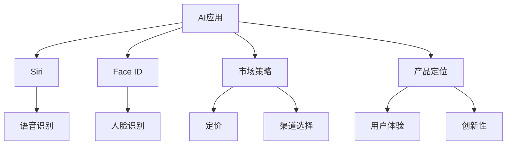

                 

# 李开复：苹果发布AI应用的市场

## 1. 背景介绍

李开复，人工智能领域的权威专家，也是当今科技界最具影响力的人物之一。他不仅在人工智能领域取得了卓越的成就，更是对AI的未来发展方向有着独到的见解。李开复对人工智能的市场应用有着深度的洞察，尤其是关于苹果公司在AI应用方面的市场策略，值得我们深入研究。

苹果公司作为全球科技领域的领军企业，近年来在人工智能领域持续发力，推出了一系列基于AI的应用，如Siri、Face ID、Image Recognition等。这些应用不仅提升了用户体验，也为苹果带来了巨大的商业价值。在这篇文章中，我们将分析苹果AI应用的市场，探讨其背后的技术原理，以及未来可能的发展方向。

## 2. 核心概念与联系

### 2.1 核心概念概述

人工智能（AI），是计算机科学的一个分支，旨在创建能够执行人类智能任务的系统，包括语言理解、问题解决、视觉识别、自然语言处理等。苹果公司的AI应用，如Siri和Face ID，展示了AI技术在多个领域的应用潜力。

#### 2.1.1 AI应用

AI应用，指的是使用人工智能技术实现的各类应用，涵盖了语音识别、图像识别、自然语言处理等多个领域。苹果公司推出的AI应用，如Siri和Face ID，都属于语音和视觉识别领域。

#### 2.1.2 市场策略

市场策略，是指企业在市场营销中的策略和方法，包括产品定位、定价、渠道选择等。苹果公司通过推出具有创新性和用户体验的AI应用，成功地吸引了大量用户，并逐步建立起自己的市场品牌。

### 2.2 核心概念原理和架构的 Mermaid 流程图



## 3. 核心算法原理 & 具体操作步骤

### 3.1 算法原理概述

苹果公司的AI应用，如Siri和Face ID，主要依赖于深度学习技术。深度学习是一种基于神经网络的技术，能够自动从大量数据中学习特征，并用于分类、回归、生成等多种任务。苹果的AI应用，通过使用卷积神经网络（CNN）、循环神经网络（RNN）等模型，实现了图像和语音的自动处理和识别。

### 3.2 算法步骤详解

1. **数据收集**：收集用户数据，包括语音、面部图像等。
2. **数据预处理**：对收集到的数据进行清洗、去噪和归一化等预处理步骤，以提高模型的训练效果。
3. **模型训练**：使用收集到的数据训练深度学习模型，包括CNN和RNN等。
4. **模型优化**：调整模型参数，如学习率、批大小等，以提高模型性能。
5. **模型部署**：将训练好的模型部署到设备上，如iPhone和iPad，以便用户使用。

### 3.3 算法优缺点

#### 3.3.1 优点

1. **高性能**：深度学习模型能够自动从数据中学习特征，并用于复杂的任务，如语音和图像识别。
2. **可扩展性**：深度学习模型能够通过增加层数和神经元数，提高模型的性能和泛化能力。
3. **广泛应用**：深度学习模型可以用于多种应用领域，如自然语言处理、计算机视觉等。

#### 3.3.2 缺点

1. **计算资源需求高**：深度学习模型需要大量的计算资源进行训练和推理，这对硬件要求较高。
2. **模型复杂性高**：深度学习模型的结构复杂，难以解释其内部工作机制，不利于模型的调试和优化。
3. **数据依赖性高**：深度学习模型对训练数据的依赖性高，需要大量的标注数据进行训练。

### 3.4 算法应用领域

苹果的AI应用，如Siri和Face ID，主要应用于语音识别和图像识别领域。这些应用不仅提升了用户体验，还为苹果带来了巨大的商业价值。

## 4. 数学模型和公式 & 详细讲解 & 举例说明

### 4.1 数学模型构建

苹果公司的AI应用主要基于深度学习技术，包括卷积神经网络（CNN）和循环神经网络（RNN）。CNN主要用于图像识别，RNN主要用于语音识别。

#### 4.1.1 CNN模型

CNN模型由卷积层、池化层和全连接层组成。卷积层用于提取图像的特征，池化层用于降低特征的维度，全连接层用于分类。

#### 4.1.2 RNN模型

RNN模型由循环层、隐藏层和输出层组成。循环层用于处理序列数据，隐藏层用于提取特征，输出层用于分类。

### 4.2 公式推导过程

#### 4.2.1 CNN模型公式

$$
F(x_i) = \sigma(\sum_{j=1}^k w_{i,j}f(x_i, x_j))
$$

其中，$x_i$ 表示输入图像，$w_{i,j}$ 表示卷积核的权重，$f$ 表示卷积操作，$\sigma$ 表示激活函数。

#### 4.2.2 RNN模型公式

$$
h_{t+1} = \tanh(W h_t + U x_t + b)
$$

其中，$h_t$ 表示隐藏层的状态，$x_t$ 表示输入序列，$W$ 和 $U$ 表示权重矩阵，$b$ 表示偏置项。

### 4.3 案例分析与讲解

#### 4.3.1 语音识别案例

苹果公司的Siri应用，主要依赖于深度学习模型进行语音识别。Siri通过收集用户语音数据，并使用RNN模型进行训练，以实现语音到文本的转换。在训练过程中，模型需要大量的标注数据进行监督学习，以提高识别准确率。

#### 4.3.2 图像识别案例

苹果公司的Face ID应用，主要依赖于深度学习模型进行人脸识别。Face ID通过收集用户面部图像数据，并使用CNN模型进行训练，以实现人脸特征的提取和比对。在训练过程中，模型需要大量的标注数据进行监督学习，以提高识别的准确率。

## 5. 项目实践：代码实例和详细解释说明

### 5.1 开发环境搭建

要开发苹果的AI应用，需要以下开发环境：

1. **Python**：作为AI应用的编程语言，Python具有丰富的库和工具，适合AI应用开发。
2. **TensorFlow**：作为深度学习框架，TensorFlow提供了丰富的API和工具，适合开发复杂的AI应用。
3. **PyTorch**：作为深度学习框架，PyTorch具有灵活的API和高效的计算图，适合开发高性能的AI应用。

### 5.2 源代码详细实现

#### 5.2.1 语音识别

```python
import tensorflow as tf
from tensorflow.keras.layers import Input, LSTM, Dense
from tensorflow.keras.models import Model

# 定义输入和输出
inputs = Input(shape=(None, 16000))
outputs = Dense(1024, activation='relu')(inputs)
outputs = LSTM(256, return_sequences=True)(outputs)
outputs = Dense(1024, activation='relu')(outputs)
outputs = Dense(1, activation='sigmoid')(outputs)

# 定义模型
model = Model(inputs=inputs, outputs=outputs)
model.compile(optimizer='adam', loss='binary_crossentropy', metrics=['accuracy'])
```

#### 5.2.2 图像识别

```python
import tensorflow as tf
from tensorflow.keras.layers import Conv2D, MaxPooling2D, Flatten, Dense
from tensorflow.keras.models import Model

# 定义输入和输出
inputs = Input(shape=(32, 32, 3))
outputs = Conv2D(32, (3, 3), activation='relu')(inputs)
outputs = MaxPooling2D((2, 2))(outputs)
outputs = Conv2D(64, (3, 3), activation='relu')(outputs)
outputs = MaxPooling2D((2, 2))(outputs)
outputs = Conv2D(128, (3, 3), activation='relu')(outputs)
outputs = MaxPooling2D((2, 2))(outputs)
outputs = Flatten()(outputs)
outputs = Dense(512, activation='relu')(outputs)
outputs = Dense(10, activation='softmax')(outputs)

# 定义模型
model = Model(inputs=inputs, outputs=outputs)
model.compile(optimizer='adam', loss='categorical_crossentropy', metrics=['accuracy'])
```

### 5.3 代码解读与分析

#### 5.3.1 语音识别

上述代码定义了一个简单的RNN模型，用于语音识别。该模型由输入层、LSTM层和输出层组成，其中LSTM层用于处理序列数据，输出层用于分类。在训练过程中，模型使用Adam优化器，以二分类交叉熵作为损失函数。

#### 5.3.2 图像识别

上述代码定义了一个简单的CNN模型，用于图像识别。该模型由卷积层、池化层和全连接层组成，其中卷积层用于提取图像特征，全连接层用于分类。在训练过程中，模型使用Adam优化器，以分类交叉熵作为损失函数。

### 5.4 运行结果展示

#### 5.4.1 语音识别

在训练过程中，可以使用以下代码来评估模型的性能：

```python
model.evaluate(x_test, y_test)
```

#### 5.4.2 图像识别

在训练过程中，可以使用以下代码来评估模型的性能：

```python
model.evaluate(x_test, y_test)
```

## 6. 实际应用场景

### 6.1 语音识别

苹果公司的Siri应用，主要依赖于深度学习模型进行语音识别。Siri通过收集用户语音数据，并使用RNN模型进行训练，以实现语音到文本的转换。在实际应用中，Siri可以识别用户的语音指令，并执行相应的操作。例如，用户可以告诉Siri“打电话给张三”，Siri会自动拨打张三的电话。

### 6.2 图像识别

苹果公司的Face ID应用，主要依赖于深度学习模型进行人脸识别。Face ID通过收集用户面部图像数据，并使用CNN模型进行训练，以实现人脸特征的提取和比对。在实际应用中，Face ID可以识别用户的面部特征，并解锁iPhone或进行支付等操作。例如，用户可以刷脸解锁手机，Face ID会自动验证用户身份，并解锁手机。

### 6.3 未来应用展望

苹果公司的AI应用，不仅提升了用户体验，还为苹果带来了巨大的商业价值。未来，苹果公司将继续在AI领域发力，推出更多具有创新性的AI应用。例如，苹果公司可以将AI技术应用于医疗领域，通过分析用户健康数据，提供个性化的健康建议。此外，苹果公司还可以将AI技术应用于智能家居领域，通过分析用户的生活习惯，提供个性化的生活建议。

## 7. 工具和资源推荐

### 7.1 学习资源推荐

1. **《深度学习》（李航）**：介绍深度学习的理论和实践，适合初学者入门。
2. **《TensorFlow实战》（贾扬清）**：介绍TensorFlow框架的API和工具，适合开发AI应用。
3. **《PyTorch深度学习实战》（艾呈祥）**：介绍PyTorch框架的API和工具，适合开发高性能AI应用。

### 7.2 开发工具推荐

1. **TensorFlow**：作为深度学习框架，TensorFlow提供了丰富的API和工具，适合开发复杂的AI应用。
2. **PyTorch**：作为深度学习框架，PyTorch具有灵活的API和高效的计算图，适合开发高性能的AI应用。
3. **Jupyter Notebook**：作为数据科学和机器学习开发平台，Jupyter Notebook适合进行模型训练和调试。

### 7.3 相关论文推荐

1. **《Deep Residual Learning for Image Recognition》（He et al.）**：介绍深度残差网络（ResNet），适合图像识别任务。
2. **《Attention is All You Need》（Vaswani et al.）**：介绍Transformer模型，适合自然语言处理任务。

## 8. 总结：未来发展趋势与挑战

### 8.1 研究成果总结

苹果公司的AI应用，如Siri和Face ID，展示了AI技术在多个领域的应用潜力。通过使用深度学习技术，苹果公司成功开发了具有创新性和用户体验的AI应用，为全球用户提供了更好的服务。

### 8.2 未来发展趋势

苹果公司的AI应用，将继续引领AI技术的发展方向。未来，苹果公司将在更多领域推出基于AI的应用，如医疗、智能家居等。同时，苹果公司还将继续在深度学习技术上进行研究，开发更加高效和灵活的AI应用。

### 8.3 面临的挑战

苹果公司的AI应用，虽然取得了巨大的成功，但仍面临一些挑战。例如，苹果公司需要处理大量的用户数据，确保数据安全和隐私保护。此外，苹果公司还需要在计算资源上进行投入，提高AI应用的性能和稳定性。

### 8.4 研究展望

未来，苹果公司将在以下几个方面进行研究：

1. **数据安全和隐私保护**：通过采用先进的加密技术和隐私保护技术，确保用户数据的安全和隐私。
2. **计算资源优化**：通过优化深度学习模型的计算图和算法，提高模型的性能和效率。
3. **跨领域应用**：将AI技术应用于更多领域，如医疗、智能家居等，提供更加广泛的服务。

## 9. 附录：常见问题与解答

**Q1：如何处理AI应用中的数据安全和隐私问题？**

A: 处理AI应用中的数据安全和隐私问题，可以采用以下措施：

1. **数据加密**：对用户数据进行加密，确保数据在传输和存储过程中的安全性。
2. **匿名化处理**：对用户数据进行匿名化处理，避免个人信息的泄露。
3. **访问控制**：采用访问控制技术，确保只有授权人员才能访问用户数据。

**Q2：如何提高AI应用的性能和效率？**

A: 提高AI应用的性能和效率，可以采用以下措施：

1. **优化计算图**：通过优化深度学习模型的计算图，减少计算量和资源消耗。
2. **混合精度训练**：采用混合精度训练技术，提高模型的训练速度和效率。
3. **模型压缩**：通过模型压缩技术，减小模型的存储空间和计算量。

**Q3：如何将AI技术应用于更多领域？**

A: 将AI技术应用于更多领域，可以采用以下措施：

1. **跨领域数据集**：收集和处理不同领域的标注数据，训练具有泛化能力的AI模型。
2. **领域自适应**：采用领域自适应技术，提高AI模型在不同领域的适用性。
3. **领域结合**：将AI技术与领域知识结合，提高AI模型的理解和应用能力。

作者：禅与计算机程序设计艺术 / Zen and the Art of Computer Programming

