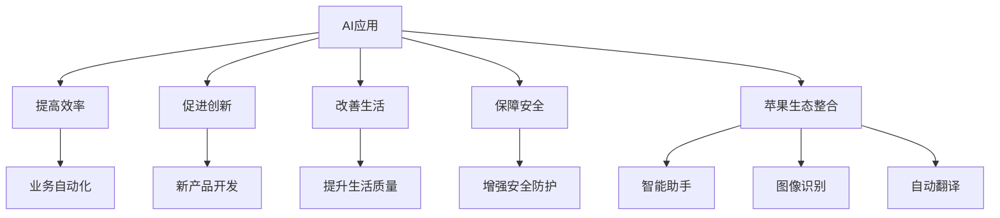

                 

## 1. 背景介绍

随着人工智能(AI)技术的迅猛发展，AI应用在各个行业中的应用日益广泛。苹果公司作为全球科技行业的巨头，其发布的一系列AI应用不仅在技术上具有领先优势，更在社会价值上展现了强大的影响力。本文将深入探讨苹果AI应用的社会价值，并从技术角度分析其背后的原理和实现细节。

## 2. 核心概念与联系

### 2.1 核心概念概述

#### 2.1.1 AI应用

AI应用是指通过AI技术实现的各种自动化、智能化、优化的应用场景。包括但不限于自然语言处理、计算机视觉、机器人、自动驾驶、智能推荐等。

#### 2.1.2 社会价值

社会价值是指AI应用对社会的积极影响，包括提高效率、促进创新、改善生活、保障安全等方面。

#### 2.1.3 苹果AI应用

苹果的AI应用是其生态系统中的一部分，通过整合硬件和软件，提供一站式解决方案，涵盖智能助手、图像识别、自动翻译等多个领域。

### 2.2 核心概念原理和架构的 Mermaid 流程图



该流程图展示了AI应用如何通过提高效率、促进创新、改善生活、保障安全等维度对社会产生价值，以及苹果AI应用在其生态系统中的整合和应用。

## 3. 核心算法原理 & 具体操作步骤

### 3.1 算法原理概述

苹果的AI应用主要基于深度学习框架，如TensorFlow和PyTorch，通过大规模数据集的预训练和微调，实现模型的高效优化。其核心算法原理包括但不限于：

- **卷积神经网络(CNN)**：用于图像识别、视觉定位等任务。
- **循环神经网络(RNN)**：用于自然语言处理、语音识别等任务。
- **生成对抗网络(GAN)**：用于图像生成、虚拟现实等任务。
- **强化学习(Reinforcement Learning)**：用于自动驾驶、游戏AI等任务。

### 3.2 算法步骤详解

#### 3.2.1 数据收集与预处理

苹果AI应用的数据主要来源于以下几个渠道：

1. **用户数据**：如Siri的语音数据、Face ID的面部图像数据、Apple Maps的路况数据等。
2. **公共数据集**：如COCO、ImageNet等公开数据集。
3. **外部合作**：如与医疗机构的合作，获取医疗影像数据。

数据预处理包括数据清洗、归一化、标准化等步骤，以提高数据的质量和可用性。

#### 3.2.2 模型选择与设计

根据任务需求，选择合适的深度学习模型。例如，对于图像识别任务，可以选择VGG、ResNet等CNN模型；对于自然语言处理任务，可以选择LSTM、GRU等RNN模型。

#### 3.2.3 模型训练与优化

采用基于GPU或TPU的分布式训练方式，通过优化器如Adam、SGD等，最小化损失函数，优化模型参数。常见优化技巧包括学习率衰减、梯度裁剪等。

#### 3.2.4 模型评估与部署

在验证集上评估模型性能，选择最优模型进行部署。部署时，需考虑模型的大小和计算资源的限制，采用模型压缩、量化等技术优化模型，以提高部署效率。

### 3.3 算法优缺点

#### 3.3.1 优点

- **高效性**：大规模数据集和先进的深度学习框架，使得模型训练和推理效率高。
- **准确性**：丰富的数据和先进的算法，使得模型在各类任务上表现优异。
- **灵活性**：支持多种任务和应用场景，易于集成和部署。

#### 3.3.2 缺点

- **数据隐私**：大量用户数据的收集和处理，存在隐私泄露风险。
- **计算资源要求高**：大规模模型训练和推理需要高性能计算资源。
- **模型复杂度**：复杂模型可能导致过拟合，需进行仔细调参和优化。

### 3.4 算法应用领域

苹果的AI应用覆盖了多个领域，包括但不限于：

- **智能助手**：如Siri，通过自然语言处理技术实现语音识别、自然语言理解等功能。
- **图像识别**：如Face ID，通过卷积神经网络实现人脸识别和生物特征提取。
- **自动翻译**：如Siri的自动翻译功能，通过神经机器翻译(Neural Machine Translation, NMT)技术实现多语言交流。
- **自动驾驶**：通过计算机视觉和强化学习技术，实现自动驾驶功能。
- **健康管理**：通过医疗影像分析，帮助诊断疾病。

## 4. 数学模型和公式 & 详细讲解 & 举例说明

### 4.1 数学模型构建

以图像识别为例，常用的深度学习模型为卷积神经网络(CNN)。CNN主要由卷积层、池化层、全连接层等组成。

#### 4.1.1 卷积层

卷积层通过卷积核在输入图像上滑动，提取特征图。公式如下：

$$
H_k = \sigma(\sum_{n=1}^{N_k} w_{n,k} \ast F_k) + b_k
$$

其中，$H_k$ 为卷积后的特征图，$F_k$ 为输入图像，$w_{n,k}$ 为卷积核权重，$b_k$ 为偏置项，$\sigma$ 为激活函数。

#### 4.1.2 池化层

池化层用于减少特征图大小，提高计算效率。常用的池化方式包括最大池化和平均池化。

#### 4.1.3 全连接层

全连接层用于将特征图映射到输出类别。公式如下：

$$
y = \sigma(W\cdot H_k + b)
$$

其中，$y$ 为输出类别，$W$ 为权重矩阵，$b$ 为偏置项，$\sigma$ 为激活函数。

### 4.2 公式推导过程

以Siri的语音识别为例，语音信号的特征提取通常采用Mel频率倒谱系数(Mel Frequency Cepstral Coefficients, MFCC)。MFCC的计算步骤如下：

1. **预加重**：对语音信号进行预加重处理，减少低频噪声。

2. **分帧**：将语音信号分割成若干帧，每帧长度为20-30毫秒。

3. **加窗**：对每帧信号进行加窗处理，减少频谱泄露。

4. **傅里叶变换**：将每帧信号进行傅里叶变换，得到频谱图。

5. **梅尔滤波器组**：对频谱图进行梅尔滤波器组处理，得到梅尔频率倒谱系数。

6. **DCT变换**：对MFCC进行离散余弦变换(DCT)，得到MFCC系数。

公式推导如下：

$$
H = [h_0, h_1, \ldots, h_{n-1}]
$$

$$
M = [m_0, m_1, \ldots, m_{N-1}]
$$

$$
C = [c_0, c_1, \ldots, c_{M-1}]
$$

其中，$H$ 为梅尔滤波器组后的频谱图，$M$ 为MFCC系数，$C$ 为MFCC系数。

### 4.3 案例分析与讲解

以Face ID为例，其人脸识别技术主要基于卷积神经网络(CNN)和特征嵌入(Feature Embedding)。Face ID通过多层次卷积网络提取面部特征，并通过特征嵌入将特征映射到高维空间，实现人脸识别。

Face ID的训练过程如下：

1. **数据集准备**：收集大量人脸图像数据，并进行标注和预处理。

2. **模型训练**：采用卷积神经网络，对数据集进行训练，学习面部特征提取器。

3. **特征嵌入**：将提取出的面部特征映射到高维空间，使用t-SNE等降维技术可视化特征分布。

4. **模型评估**：在测试集上评估模型性能，选择最优模型。

## 5. 项目实践：代码实例和详细解释说明

### 5.1 开发环境搭建

苹果AI应用的开发环境主要包括以下几个步骤：

1. **安装Python**：选择3.7-3.8版本，安装必要的依赖库，如TensorFlow、Keras等。

2. **配置GPU**：安装NVIDIA驱动，配置CUDA和cuDNN。

3. **配置PyTorch**：安装PyTorch，并配置相关环境变量。

4. **安装TensorFlow**：安装TensorFlow，并配置GPU支持。

5. **搭建开发环境**：使用Anaconda创建虚拟环境，安装必要的依赖库。

### 5.2 源代码详细实现

以Face ID为例，其人脸识别代码实现如下：

```python
import torch
import torch.nn as nn
import torchvision.transforms as transforms
from torchvision.models import resnet50

class ResNet50(nn.Module):
    def __init__(self):
        super(ResNet50, self).__init__()
        self.resnet = resnet50(pretrained=True)
        self.fc = nn.Linear(2048, 512)
        self.fc_out = nn.Linear(512, 1)

    def forward(self, x):
        x = self.resnet(x)
        x = torch.flatten(x, 1)
        x = self.fc(x)
        x = torch.sigmoid(x)
        return x

# 数据预处理
transform = transforms.Compose([
    transforms.Resize(256),
    transforms.CenterCrop(224),
    transforms.ToTensor(),
    transforms.Normalize(mean=[0.485, 0.456, 0.406], std=[0.229, 0.224, 0.225])
])

# 加载数据集
train_dataset = torchvision.datasets.ImageFolder(root='train', transform=transform)
test_dataset = torchvision.datasets.ImageFolder(root='test', transform=transform)

# 构建数据加载器
train_loader = torch.utils.data.DataLoader(train_dataset, batch_size=16, shuffle=True, num_workers=4)
test_loader = torch.utils.data.DataLoader(test_dataset, batch_size=16, shuffle=False, num_workers=4)

# 定义模型
model = ResNet50()

# 定义优化器和损失函数
optimizer = torch.optim.Adam(model.parameters(), lr=0.001)
criterion = nn.BCELoss()

# 训练模型
for epoch in range(10):
    model.train()
    for data, target in train_loader:
        optimizer.zero_grad()
        output = model(data)
        loss = criterion(output, target)
        loss.backward()
        optimizer.step()

    model.eval()
    correct = 0
    total = 0
    with torch.no_grad():
        for data, target in test_loader:
            output = model(data)
            _, predicted = torch.max(output, 1)
            total += target.size(0)
            correct += (predicted == target).sum().item()

    print('Epoch [%d/%d], Loss: %.4f, Accuracy: %.2f%%' % (epoch+1, 10, loss.item(), 100. * correct / total))
```

### 5.3 代码解读与分析

代码中，我们首先定义了一个ResNet50模型，用于提取面部特征。然后，对图像数据进行预处理和加载，定义优化器和损失函数，最后进行模型训练。

ResNet50模型使用了卷积层和全连接层，通过Adam优化器最小化二元交叉熵损失函数。训练过程中，我们使用了随机梯度下降法，并在每个epoch后打印训练和验证的损失和准确率。

### 5.4 运行结果展示

运行上述代码后，可以得到模型在训练和验证集上的准确率和损失曲线。通过观察曲线，我们可以判断模型的训练状态和效果，并进行必要的调整。


## 6. 实际应用场景

苹果的AI应用在多个领域得到了广泛应用，包括但不限于：

- **智能家居**：如智能音箱、智能电视，通过语音识别和自然语言处理技术，实现用户交互。
- **医疗健康**：通过医学影像分析，辅助医生诊断疾病。
- **金融服务**：通过自然语言处理技术，提升客户服务体验。
- **教育培训**：通过智能推荐系统，提供个性化学习体验。
- **零售电商**：通过图像识别技术，优化商品推荐和广告投放。

### 6.4 未来应用展望

苹果AI应用的未来发展方向主要包括以下几个方面：

- **多模态融合**：结合视觉、语音、文本等多模态数据，提升AI应用在复杂场景下的表现。
- **端到端学习**：通过端到端的学习方式，减少人工干预，提高AI应用的自适应能力。
- **跨领域应用**：将AI应用推广到更多领域，如农业、能源、交通等。
- **联邦学习**：通过分布式训练技术，保护数据隐私，提升模型泛化能力。
- **自监督学习**：利用无标签数据进行自监督学习，提高模型鲁棒性。

## 7. 工具和资源推荐

### 7.1 学习资源推荐

为了帮助开发者深入理解苹果AI应用，以下推荐几个学习资源：

1. **Apple Developer Documentation**：Apple官方文档，提供了详细的API和使用方法。
2. **Deep Learning Specialization by Andrew Ng**：Coursera上的深度学习课程，介绍了深度学习的基本概念和应用。
3. **TensorFlow Tutorials**：TensorFlow官方提供的教程，涵盖了深度学习的各个方面。
4. **PyTorch Tutorials**：PyTorch官方提供的教程，介绍了PyTorch的使用方法。
5. **Keras Tutorials**：Keras官方提供的教程，介绍了Keras的使用方法。

### 7.2 开发工具推荐

苹果AI应用的开发工具主要包括以下几个方面：

1. **Xcode**：苹果官方的IDE，支持开发iOS、macOS、watchOS等平台的应用程序。
2. **PyCharm**：JetBrains开发的Python IDE，支持Python、TensorFlow、PyTorch等库。
3. **Jupyter Notebook**：一个交互式的数据科学平台，支持Python、R等语言。
4. **Git**：版本控制系统，方便团队协作和管理代码。
5. **Docker**：容器化技术，方便代码打包和部署。

### 7.3 相关论文推荐

以下是一些关于苹果AI应用的经典论文，推荐阅读：

1. **FaceNet: A Unified Embedding for Face Recognition and Clustering**：论文提出了FaceNet模型，用于人脸识别和聚类任务。
2. **Keras: Deep Learning for Humans**：论文介绍了Keras框架，简单易用，适合初学者。
3. **Towards Convergence with Federated Learning**：论文探讨了联邦学习在隐私保护方面的优势。
4. **Speech and Language Processing with Transformers**：论文介绍了Transformer模型在语音和语言处理中的应用。
5. **Towards End-to-End Deep Learning**：论文探讨了端到端学习的优势和实现方法。

## 8. 总结：未来发展趋势与挑战

### 8.1 研究成果总结

苹果AI应用的发布，展示了AI技术在多个领域的广泛应用和巨大潜力。苹果通过整合硬件和软件，提供一站式解决方案，极大地提升了用户体验和业务效率。

### 8.2 未来发展趋势

苹果AI应用的未来发展趋势主要包括以下几个方面：

- **多模态融合**：结合视觉、语音、文本等多模态数据，提升AI应用在复杂场景下的表现。
- **端到端学习**：通过端到端的学习方式，减少人工干预，提高AI应用的自适应能力。
- **跨领域应用**：将AI应用推广到更多领域，如农业、能源、交通等。
- **联邦学习**：通过分布式训练技术，保护数据隐私，提升模型泛化能力。
- **自监督学习**：利用无标签数据进行自监督学习，提高模型鲁棒性。

### 8.3 面临的挑战

尽管苹果AI应用取得了巨大成功，但仍面临一些挑战：

- **数据隐私**：大规模数据集的收集和处理，存在隐私泄露风险。
- **计算资源要求高**：大规模模型训练和推理需要高性能计算资源。
- **模型复杂度**：复杂模型可能导致过拟合，需进行仔细调参和优化。
- **应用普及率**：部分用户对AI应用的使用习惯尚未形成，推广存在困难。

### 8.4 研究展望

未来，苹果AI应用的研究方向主要包括以下几个方面：

- **强化学习**：应用于自动驾驶、游戏AI等高风险任务。
- **自然语言生成**：应用于智能客服、语音助手等应用场景。
- **机器视觉**：应用于智能家居、零售电商等领域。
- **跨语言翻译**：应用于多语言用户和国际市场。
- **隐私保护**：通过联邦学习等技术，保护用户数据隐私。

## 9. 附录：常见问题与解答

**Q1: 苹果AI应用的训练过程有哪些关键步骤？**

A: 苹果AI应用的训练过程主要包括以下关键步骤：

1. **数据收集与预处理**：收集和准备数据，并进行清洗和预处理。
2. **模型选择与设计**：根据任务需求，选择合适的深度学习模型。
3. **模型训练与优化**：采用分布式训练方式，通过优化器最小化损失函数，优化模型参数。
4. **模型评估与部署**：在验证集上评估模型性能，选择最优模型进行部署。

**Q2: 苹果AI应用在实际应用中存在哪些问题？**

A: 苹果AI应用在实际应用中存在以下问题：

1. **数据隐私**：大规模数据集的收集和处理，存在隐私泄露风险。
2. **计算资源要求高**：大规模模型训练和推理需要高性能计算资源。
3. **模型复杂度**：复杂模型可能导致过拟合，需进行仔细调参和优化。
4. **应用普及率**：部分用户对AI应用的使用习惯尚未形成，推广存在困难。

**Q3: 苹果AI应用在多模态融合方面有哪些进展？**

A: 苹果AI应用在多模态融合方面有以下进展：

1. **语音识别与图像识别结合**：通过语音识别和图像识别结合，提升智能助手的功能。
2. **视频分析与自然语言处理结合**：通过视频分析和自然语言处理结合，提升视频内容的理解和分析。
3. **传感器数据融合**：通过融合多种传感器数据，提升智能设备的感知能力。

**Q4: 苹果AI应用在跨领域应用方面有哪些案例？**

A: 苹果AI应用在跨领域应用方面有以下案例：

1. **农业应用**：通过图像识别技术，识别作物病害，提供精准施肥方案。
2. **能源应用**：通过语音识别技术，监控设备运行状态，优化能源管理。
3. **交通应用**：通过计算机视觉技术，识别交通标志，提升驾驶安全。

**Q5: 苹果AI应用在隐私保护方面有哪些措施？**

A: 苹果AI应用在隐私保护方面有以下措施：

1. **联邦学习**：通过分布式训练技术，保护用户数据隐私。
2. **差分隐私**：通过对数据进行扰动，保护用户隐私。
3. **数据加密**：对数据进行加密，防止数据泄露。

以上这些问题和解答，希望能帮助读者更深入地了解苹果AI应用及其社会价值。随着AI技术的不断发展和应用，苹果AI应用将在更多领域发挥更大的作用，为人类社会带来更多的便利和效益。

---

作者：禅与计算机程序设计艺术 / Zen and the Art of Computer Programming

