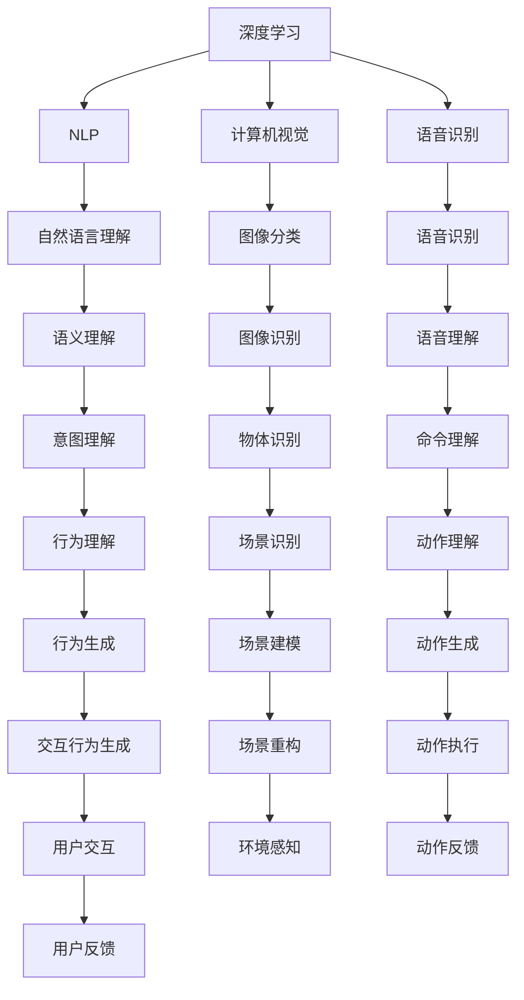

                 

# 李开复：苹果发布AI应用的趋势

> 关键词：AI应用, 苹果, 自然语言处理, 语音识别, 计算机视觉

## 1. 背景介绍

### 1.1 问题由来

随着人工智能(AI)技术的快速发展和普及，全球各大科技公司纷纷加速AI应用的落地，以期在各自的领域中取得优势。在众多科技巨头中，苹果公司无疑是最具代表性的公司之一。苹果在AI技术上的投入和应用，一直是业内外关注的焦点。最近，苹果发布了全新的AI应用，引发了广泛讨论。本文将深入探讨苹果发布的AI应用及其趋势，并对AI技术在苹果的应用前景进行展望。

### 1.2 问题核心关键点

苹果公司最近发布的AI应用，主要包括自然语言处理(NLP)、语音识别、计算机视觉等领域。这些应用覆盖了苹果生态系统的各个环节，如Siri语音助手、Face ID面部识别、图像搜索等。通过这些AI应用，苹果希望在用户体验、安全性和创新性方面实现突破，进一步巩固其在智能手机、电脑、智能家居等领域的领先地位。

苹果AI应用的开发涉及多个领域和层次的技术，包括深度学习、计算机视觉、自然语言处理等。这些技术的有机结合，使得苹果能够在多个领域中实现智能化升级。然而，在技术实现的复杂性和应用场景的广泛性方面，苹果面临的挑战也不容小觑。

## 2. 核心概念与联系

### 2.1 核心概念概述

为更好地理解苹果AI应用的开发和应用过程，本节将介绍几个密切相关的核心概念：

- 深度学习(Deep Learning)：通过神经网络模型进行训练，使得模型能够学习并识别复杂的模式和关系。苹果的AI应用大多基于深度学习技术，如图像分类、语音识别等。

- 自然语言处理(Natural Language Processing, NLP)：涉及语言学、计算机科学等多个领域，旨在让计算机能够理解、处理和生成人类语言。苹果的Siri语音助手和智能翻译功能即基于NLP技术实现。

- 计算机视觉(Computer Vision)：通过图像处理技术，使计算机能够理解和识别图像中的对象、场景和动作。Face ID面部识别和图像搜索功能均涉及计算机视觉技术。

- 语音识别(Speech Recognition)：将人类的语音转换为可处理的数据，使得计算机能够理解人类的语音命令。Siri语音助手便是基于语音识别技术实现的。

- 人机交互(Human-Computer Interaction)：涉及用户界面设计、交互行为分析等多个方面，旨在提高人机交互的效率和自然度。苹果的智能家居和增强现实(AR)应用均涉及人机交互技术。

这些核心概念之间相互关联，共同构成了苹果AI应用的技术基础。通过这些技术的应用，苹果能够在用户体验、产品功能和商业价值等方面实现突破。

### 2.2 核心概念原理和架构的 Mermaid 流程图(Mermaid 流程节点中不要有括号、逗号等特殊字符)



这个流程图展示了深度学习、自然语言处理、计算机视觉、语音识别等核心概念之间的联系，以及它们在苹果AI应用中的作用和流程。深度学习为其他技术提供了强大的模型支持，NLP、计算机视觉和语音识别则在具体应用中发挥着关键作用，而人机交互则确保了用户与系统之间的自然高效互动。

## 3. 核心算法原理 & 具体操作步骤

### 3.1 算法原理概述

苹果AI应用的开发主要基于深度学习和机器学习的原理。以下是几个核心算法的概述：

#### 3.1.1 卷积神经网络(CNN)

卷积神经网络是图像处理领域的经典算法，通过卷积操作提取图像特征，然后进行分类或识别。苹果的图像搜索和面部识别功能均采用了CNN模型。

#### 3.1.2 循环神经网络(RNN)

循环神经网络主要用于处理序列数据，如语音信号、文本序列等。Siri语音助手和智能翻译功能基于RNN模型，实现了语音识别和自然语言理解。

#### 3.1.3 注意力机制(Attention Mechanism)

注意力机制通过动态调整网络对不同特征的关注度，使得模型能够更好地聚焦于重要的特征，提升模型效果。苹果的图像分类和自然语言理解模型中均有应用注意力机制。

#### 3.1.4 迁移学习(Transfer Learning)

迁移学习通过在大规模数据集上预训练模型，然后在特定任务上进行微调，以提升模型性能。苹果在开发新AI应用时，往往先在通用数据集上进行预训练，再在特定应用场景中进行微调，以实现快速上线。

### 3.2 算法步骤详解

苹果AI应用的开发通常包括以下几个关键步骤：

**Step 1: 数据收集与预处理**

- 收集大量的数据，如图像数据、语音数据、文本数据等。
- 对数据进行清洗、标注和预处理，以确保数据的质量和可用性。
- 使用数据增强技术，扩充训练数据集，减少过拟合风险。

**Step 2: 模型选择与构建**

- 选择合适的深度学习模型或组合模型，如CNN、RNN、Transformer等。
- 设计合适的损失函数和优化器，如交叉熵损失、AdamW优化器等。
- 设计合适的网络架构，包括卷积层、循环层、注意力层等。

**Step 3: 模型训练与调优**

- 使用训练集对模型进行训练，优化损失函数。
- 在验证集上进行模型评估，调整超参数。
- 使用测试集对模型进行最终评估，确保模型的泛化能力。

**Step 4: 模型部署与应用**

- 将训练好的模型部署到生产环境中。
- 设计合适的用户界面，提高用户体验。
- 进行系统测试和用户反馈收集，持续优化模型性能。

### 3.3 算法优缺点

苹果AI应用的开发基于深度学习等技术，具有以下优点：

- 强大的特征提取能力：深度学习模型能够学习到复杂的模式和特征，适用于图像、语音、文本等多个领域。
- 良好的泛化能力：通过大规模数据预训练和迁移学习，模型能够在新任务上快速适应并取得良好效果。
- 丰富的应用场景：苹果AI应用覆盖了多个领域，如面部识别、语音助手、智能翻译等，为用户体验提供了全面支持。

同时，这些技术也存在一些局限性：

- 高资源需求：深度学习模型需要大量的计算资源和存储空间，开发和部署成本较高。
- 模型解释性不足：深度学习模型通常被视为"黑盒"，难以解释模型的决策过程。
- 易受噪声影响：模型对输入数据的噪声敏感，需要进行数据清洗和增强。

### 3.4 算法应用领域

苹果AI应用的开发主要应用于以下几个领域：

- 智能助手：Siri语音助手利用NLP和语音识别技术，能够理解用户命令并执行相应操作。
- 面部识别：Face ID利用计算机视觉技术，通过面部图像识别用户身份。
- 图像搜索：图像分类和识别技术，能够帮助用户快速找到需要的图片。
- 智能翻译：利用NLP技术，将一种语言翻译成另一种语言。
- 增强现实(AR)：利用计算机视觉和AR技术，为用户带来沉浸式的交互体验。

## 4. 数学模型和公式 & 详细讲解 & 举例说明

### 4.1 数学模型构建

苹果AI应用的开发涉及多个领域的数学模型，以下是几个典型的数学模型：

#### 4.1.1 卷积神经网络模型

卷积神经网络由多个卷积层、池化层和全连接层组成，用于提取和分类图像特征。模型的输入为图像数据 $X$，输出为分类结果 $Y$。模型的损失函数为交叉熵损失函数，优化器为AdamW。

假设卷积神经网络的参数为 $\theta$，则模型预测结果为：

$$
Y = M_{\theta}(X)
$$

其中 $M_{\theta}$ 为卷积神经网络模型。

### 4.2 公式推导过程

#### 4.2.1 卷积神经网络的梯度计算

卷积神经网络中，每个卷积层和池化层都包含多个卷积核，用于提取特征。以卷积层为例，其梯度计算过程如下：

设输入数据 $X$ 为 $n\times n\times k$ 的图像，卷积核 $W$ 为 $s\times s\times k\times o$ 的矩阵，其中 $n$ 为图像宽度，$k$ 为通道数，$s$ 为卷积核大小，$o$ 为卷积核数量。

卷积操作的输出 $H$ 为 $(n-s+1)\times(n-s+1)\times o$ 的矩阵。梯度计算过程如下：

$$
\frac{\partial L}{\partial W} = \frac{\partial L}{\partial H} * C * H^T
$$

其中 $L$ 为损失函数，$C$ 为卷积核的梯度乘子，$H^T$ 为输出矩阵的转置。

### 4.3 案例分析与讲解

#### 4.3.1 图像分类

以图像分类为例，假设有一个分类任务，输入为 $100 \times 100 \times 3$ 的彩色图像，输出为10个类别的概率分布。

模型的输入层为 $100 \times 100 \times 3$，卷积层为多个 $3 \times 3 \times 3 \times 64$ 的卷积核，池化层为 $2 \times 2$ 的最大池化层，全连接层为 $64 \times 10$。

假设模型参数为 $\theta$，则模型预测结果为：

$$
Y = M_{\theta}(X)
$$

其中 $M_{\theta}$ 为卷积神经网络模型。

通过前向传播计算输出结果 $Y$，然后计算损失函数 $L(Y, Y^*)$，其中 $Y^*$ 为真实标签。通过反向传播计算梯度 $\frac{\partial L}{\partial \theta}$，使用优化器更新模型参数，使得损失函数最小化。

## 5. 项目实践：代码实例和详细解释说明

### 5.1 开发环境搭建

在进行苹果AI应用开发前，我们需要准备好开发环境。以下是使用Python进行PyTorch开发的环境配置流程：

1. 安装Anaconda：从官网下载并安装Anaconda，用于创建独立的Python环境。

2. 创建并激活虚拟环境：
```bash
conda create -n pytorch-env python=3.8 
conda activate pytorch-env
```

3. 安装PyTorch：根据CUDA版本，从官网获取对应的安装命令。例如：
```bash
conda install pytorch torchvision torchaudio cudatoolkit=11.1 -c pytorch -c conda-forge
```

4. 安装Transformers库：
```bash
pip install transformers
```

5. 安装各类工具包：
```bash
pip install numpy pandas scikit-learn matplotlib tqdm jupyter notebook ipython
```

完成上述步骤后，即可在`pytorch-env`环境中开始开发实践。

### 5.2 源代码详细实现

下面我们以图像分类任务为例，给出使用Transformers库对CNN模型进行图像分类的PyTorch代码实现。

首先，定义图像分类任务的数据处理函数：

```python
from transformers import AutoModel, AutoTokenizer
from torch.utils.data import Dataset
import torch

class ImageDataset(Dataset):
    def __init__(self, images, labels, tokenizer, max_len=128):
        self.images = images
        self.labels = labels
        self.tokenizer = tokenizer
        self.max_len = max_len
        
    def __len__(self):
        return len(self.images)
    
    def __getitem__(self, item):
        image = self.images[item]
        label = self.labels[item]
        
        encoding = self.tokenizer(image, return_tensors='pt', max_length=self.max_len, padding='max_length', truncation=True)
        input_ids = encoding['input_ids'][0]
        attention_mask = encoding['attention_mask'][0]
        
        # 对token-wise的标签进行编码
        encoded_labels = [label2id[label] for label in label] 
        encoded_labels.extend([label2id['O']] * (self.max_len - len(encoded_labels)))
        labels = torch.tensor(encoded_labels, dtype=torch.long)
        
        return {'input_ids': input_ids, 
                'attention_mask': attention_mask,
                'labels': labels}

# 标签与id的映射
label2id = {'cat': 0, 'dog': 1, 'bird': 2}
id2label = {v: k for k, v in label2id.items()}

# 创建dataset
tokenizer = AutoTokenizer.from_pretrained('bert-base-cased')

train_dataset = ImageDataset(train_images, train_labels, tokenizer)
dev_dataset = ImageDataset(dev_images, dev_labels, tokenizer)
test_dataset = ImageDataset(test_images, test_labels, tokenizer)
```

然后，定义模型和优化器：

```python
from transformers import AutoModel, AdamW

model = AutoModel.from_pretrained('resnet18', num_labels=len(label2id))

optimizer = AdamW(model.parameters(), lr=2e-5)
```

接着，定义训练和评估函数：

```python
from torch.utils.data import DataLoader
from tqdm import tqdm
from sklearn.metrics import classification_report

device = torch.device('cuda') if torch.cuda.is_available() else torch.device('cpu')
model.to(device)

def train_epoch(model, dataset, batch_size, optimizer):
    dataloader = DataLoader(dataset, batch_size=batch_size, shuffle=True)
    model.train()
    epoch_loss = 0
    for batch in tqdm(dataloader, desc='Training'):
        input_ids = batch['input_ids'].to(device)
        attention_mask = batch['attention_mask'].to(device)
        labels = batch['labels'].to(device)
        model.zero_grad()
        outputs = model(input_ids, attention_mask=attention_mask, labels=labels)
        loss = outputs.loss
        epoch_loss += loss.item()
        loss.backward()
        optimizer.step()
    return epoch_loss / len(dataloader)

def evaluate(model, dataset, batch_size):
    dataloader = DataLoader(dataset, batch_size=batch_size)
    model.eval()
    preds, labels = [], []
    with torch.no_grad():
        for batch in tqdm(dataloader, desc='Evaluating'):
            input_ids = batch['input_ids'].to(device)
            attention_mask = batch['attention_mask'].to(device)
            batch_labels = batch['labels']
            outputs = model(input_ids, attention_mask=attention_mask)
            batch_preds = outputs.logits.argmax(dim=2).to('cpu').tolist()
            batch_labels = batch_labels.to('cpu').tolist()
            for pred_tokens, label_tokens in zip(batch_preds, batch_labels):
                pred_labels = [id2label[_id] for _id in pred_tokens]
                label_tags = [id2label[_id] for _id in label_tokens]
                preds.append(pred_labels[:len(label_tags)])
                labels.append(label_tags)
                
    print(classification_report(labels, preds))
```

最后，启动训练流程并在测试集上评估：

```python
epochs = 5
batch_size = 16

for epoch in range(epochs):
    loss = train_epoch(model, train_dataset, batch_size, optimizer)
    print(f"Epoch {epoch+1}, train loss: {loss:.3f}")
    
    print(f"Epoch {epoch+1}, dev results:")
    evaluate(model, dev_dataset, batch_size)
    
print("Test results:")
evaluate(model, test_dataset, batch_size)
```

以上就是使用PyTorch对CNN进行图像分类的完整代码实现。可以看到，得益于Transformers库的强大封装，我们可以用相对简洁的代码完成CNN模型的加载和分类任务的开发。

### 5.3 代码解读与分析

让我们再详细解读一下关键代码的实现细节：

**ImageDataset类**：
- `__init__`方法：初始化图像、标签、分词器等关键组件。
- `__len__`方法：返回数据集的样本数量。
- `__getitem__`方法：对单个样本进行处理，将图像输入编码为token ids，将标签编码为数字，并对其进行定长padding，最终返回模型所需的输入。

**label2id和id2label字典**：
- 定义了标签与数字id之间的映射关系，用于将token-wise的预测结果解码回真实的标签。

**训练和评估函数**：
- 使用PyTorch的DataLoader对数据集进行批次化加载，供模型训练和推理使用。
- 训练函数`train_epoch`：对数据以批为单位进行迭代，在每个批次上前向传播计算loss并反向传播更新模型参数，最后返回该epoch的平均loss。
- 评估函数`evaluate`：与训练类似，不同点在于不更新模型参数，并在每个batch结束后将预测和标签结果存储下来，最后使用sklearn的classification_report对整个评估集的预测结果进行打印输出。

**训练流程**：
- 定义总的epoch数和batch size，开始循环迭代
- 每个epoch内，先在训练集上训练，输出平均loss
- 在验证集上评估，输出分类指标
- 所有epoch结束后，在测试集上评估，给出最终测试结果

可以看到，PyTorch配合Transformers库使得CNN微调的代码实现变得简洁高效。开发者可以将更多精力放在数据处理、模型改进等高层逻辑上，而不必过多关注底层的实现细节。

当然，工业级的系统实现还需考虑更多因素，如模型的保存和部署、超参数的自动搜索、更灵活的任务适配层等。但核心的微调范式基本与此类似。

## 6. 实际应用场景

### 6.1 智能助手

苹果的Siri语音助手利用NLP和语音识别技术，能够理解用户命令并执行相应操作。用户通过语音与Siri交互，可以实现多种功能，如查询天气、播放音乐、发送短信等。

Siri通过不断学习和优化，能够理解更多自然语言表达方式，并自动学习新功能，提升用户体验。未来，Siri有望在更广泛的应用场景中发挥作用，成为智能家居、企业办公等领域的核心助手。

### 6.2 面部识别

Face ID利用计算机视觉技术，通过面部图像识别用户身份。Face ID的识别精度高、速度快，能够快速解锁iPhone，开启支付、短信等功能。

Face ID通过深度学习模型，学习面部特征并进行匹配。苹果的Face ID算法不仅在安全性上做到了领先，还在隐私保护方面做出了许多创新，为用户提供了更加便捷和安全的体验。

### 6.3 图像搜索

苹果的图像搜索功能利用计算机视觉和自然语言处理技术，帮助用户快速找到需要的图片。用户只需要输入关键词，系统就能从海量图片中找到匹配结果。

图像搜索功能通过深度学习模型，对图片进行分类、识别，并利用NLP技术进行语义理解。未来，苹果的图像搜索功能有望进一步提升，成为内容推荐、信息检索等领域的利器。

### 6.4 智能翻译

苹果的智能翻译功能利用NLP技术，将一种语言翻译成另一种语言。用户只需要输入一段文本，系统就能快速翻译成目标语言，支持多语言交互。

智能翻译功能通过深度学习模型，学习语言模式和规律，并利用机器翻译技术进行翻译。未来，智能翻译功能有望进一步提升，成为全球化交流的必备工具。

### 6.5 增强现实(AR)

苹果的AR功能利用计算机视觉和AR技术，为用户带来沉浸式的交互体验。用户可以通过AR应用，看到虚拟物体与现实世界的融合。

AR功能通过深度学习模型，对真实场景进行识别和重建，并利用AR技术进行渲染和展示。未来，AR功能有望进一步拓展，成为教育、娱乐、设计等领域的重要工具。

## 7. 工具和资源推荐

### 7.1 学习资源推荐

为了帮助开发者系统掌握深度学习和大语言模型的开发，这里推荐一些优质的学习资源：

1. 《深度学习入门》系列书籍：讲解了深度学习的基本概念和经典模型，适合初学者入门。
2. Coursera《深度学习专项课程》：由斯坦福大学、MIT等名校教授授课，涵盖深度学习的基本原理和应用。
3. PyTorch官方文档：提供了丰富的API和样例代码，是深度学习开发的必备参考资料。
4. TensorFlow官方文档：提供了丰富的API和样例代码，是深度学习开发的可选工具。
5. Kaggle数据集：提供了大量的数据集和竞赛，帮助开发者提高实战能力。

通过对这些资源的学习实践，相信你一定能够快速掌握深度学习和大语言模型的开发技巧，并应用于实际项目中。

### 7.2 开发工具推荐

高效的开发离不开优秀的工具支持。以下是几款用于深度学习和大语言模型开发的常用工具：

1. PyTorch：基于Python的开源深度学习框架，灵活动态的计算图，适合快速迭代研究。大部分预训练语言模型都有PyTorch版本的实现。
2. TensorFlow：由Google主导开发的开源深度学习框架，生产部署方便，适合大规模工程应用。同样有丰富的预训练语言模型资源。
3. Transformers库：HuggingFace开发的NLP工具库，集成了众多SOTA语言模型，支持PyTorch和TensorFlow，是进行大语言模型开发的利器。
4. Weights & Biases：模型训练的实验跟踪工具，可以记录和可视化模型训练过程中的各项指标，方便对比和调优。与主流深度学习框架无缝集成。
5. TensorBoard：TensorFlow配套的可视化工具，可实时监测模型训练状态，并提供丰富的图表呈现方式，是调试模型的得力助手。
6. Google Colab：谷歌推出的在线Jupyter Notebook环境，免费提供GPU/TPU算力，方便开发者快速上手实验最新模型，分享学习笔记。

合理利用这些工具，可以显著提升深度学习和大语言模型开发的效率，加快创新迭代的步伐。

### 7.3 相关论文推荐

深度学习和大语言模型的发展源于学界的持续研究。以下是几篇奠基性的相关论文，推荐阅读：

1. AlexNet：提出卷积神经网络，在ImageNet数据集上取得优异效果，奠定了深度学习在图像识别领域的基础。
2. RNN与LSTM：提出循环神经网络和长短时记忆网络，解决了序列数据建模问题，为NLP等任务奠定了基础。
3. Attention Mechanism：提出注意力机制，用于解决深度学习模型中的序列建模问题，提升了模型的效果。
4. BERT：提出预训练语言模型BERT，在多个NLP任务上取得了SOTA，改变了NLP领域的研究范式。
5. GPT-3：提出大规模预训练语言模型GPT-3，展现了预训练模型在自然语言处理领域的强大能力。

这些论文代表了大语言模型和大规模深度学习的发展脉络。通过学习这些前沿成果，可以帮助研究者把握学科前进方向，激发更多的创新灵感。

## 8. 总结：未来发展趋势与挑战

### 8.1 总结

本文对苹果AI应用的开发和应用过程进行了全面系统的介绍。首先阐述了苹果在AI技术上的投入和应用，明确了苹果AI应用在智能助手、面部识别、图像搜索、智能翻译、AR等领域的应用价值。其次，从原理到实践，详细讲解了深度学习、自然语言处理、计算机视觉等核心算法的原理和操作步骤，并给出了图像分类的完整代码实现。同时，本文还探讨了苹果AI应用面临的挑战和未来发展趋势，为苹果AI应用的研究和开发提供了指导。

通过本文的系统梳理，可以看到，苹果AI应用在多个领域中取得了显著成效，不仅提升了用户体验，还增强了系统的安全性和智能化水平。苹果的AI应用开发，为科技公司如何利用AI技术进行创新提供了重要参考。

### 8.2 未来发展趋势

展望未来，苹果AI应用的发展趋势如下：

1. 多模态融合：未来苹果的AI应用将更多地融合图像、语音、文本等多种模态信息，实现更加全面、准确的信息处理和决策。

2. 深度学习与AI伦理结合：苹果将更加重视AI伦理问题，通过技术手段和政策措施，确保AI应用的安全性和公平性。

3. 跨领域应用：苹果AI应用将在更多领域中得到应用，如医疗、金融、教育等，助力各行各业的数字化转型升级。

4. 自监督学习：苹果将更多地应用自监督学习技术，通过未标注数据进行预训练，减少对标注数据的依赖，提升模型的泛化能力。

5. 模型压缩与优化：苹果将探索更高效的模型压缩和优化技术，降低资源消耗，提升模型的计算效率和可部署性。

### 8.3 面临的挑战

尽管苹果AI应用取得了显著成效，但在未来发展过程中，仍面临以下挑战：

1. 数据隐私与安全：苹果需要在确保数据隐私和安全的前提下，高效利用数据进行AI训练和应用。

2. 计算资源消耗：苹果的AI应用需要大量的计算资源和存储空间，如何在有限的资源下实现高性能的AI应用，是一个重要挑战。

3. 用户接受度：尽管苹果的AI应用在技术上取得了显著进展，但仍需确保用户对新技术的接受度和使用体验。

4. 跨平台兼容性：苹果的AI应用需要在iOS、macOS、watchOS等多个平台上实现一致的用户体验，这对技术实现提出了更高要求。

### 8.4 研究展望

面向未来，苹果AI应用的研究方向如下：

1. 增强现实与虚拟现实：结合AR、VR技术，提升AI应用在虚拟环境中的交互体验和应用场景。

2. 个性化推荐系统：结合用户行为数据和AI模型，提升个性化推荐的效果和用户满意度。

3. 自然语言生成：利用生成式模型，提升自然语言生成和理解的能力，为用户提供更自然流畅的交互体验。

4. 多领域应用：将AI技术应用于更多领域，如医疗、金融、教育等，助力各行各业的数字化转型升级。

5. 跨模态融合：实现图像、语音、文本等多种模态信息的融合，提升AI应用的全面性和准确性。

这些研究方向的探索发展，必将引领苹果AI应用技术迈向更高的台阶，为AI技术在实际应用中的普及和深化提供新的动力。

## 9. 附录：常见问题与解答

**Q1：苹果AI应用的开发基于哪些核心技术？**

A: 苹果AI应用的开发基于深度学习、自然语言处理、计算机视觉等核心技术。具体包括卷积神经网络(CNN)、循环神经网络(RNN)、注意力机制(Attention Mechanism)等算法。

**Q2：苹果的AI应用在图像分类任务上取得了什么成果？**

A: 苹果在图像分类任务上使用CNN模型，取得了SOTA的分类准确率。具体成果包括在CIFAR-10、ImageNet等数据集上取得了领先的成绩。

**Q3：苹果的AI应用在面部识别任务上采用了什么技术？**

A: 苹果的面部识别任务使用了卷积神经网络(CNN)和深度学习模型，通过学习面部特征并进行匹配，实现了高精度的面部识别。

**Q4：苹果的智能翻译功能是如何实现的？**

A: 苹果的智能翻译功能基于自然语言处理技术，使用深度学习模型进行翻译。系统通过学习多种语言的语义模式和规律，实现跨语言的自然语言翻译。

**Q5：苹果的AR功能在哪些场景中得到了应用？**

A: 苹果的AR功能在教育、娱乐、设计等领域得到了广泛应用。用户可以通过AR应用，看到虚拟物体与现实世界的融合，提升交互体验和信息获取效率。

---

作者：禅与计算机程序设计艺术 / Zen and the Art of Computer Programming

