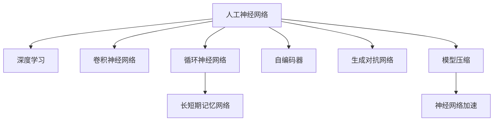

                 

## 1. 背景介绍

### 1.1 问题由来

人工智能（AI）领域的发展离不开深度学习技术的突破。深度神经网络（DNN）作为深度学习的基础，在图像识别、自然语言处理、语音识别等众多领域展现出卓越的性能。然而，传统神经网络面临着计算资源消耗大、模型复杂度高等问题，严重制约了其在实际应用中的部署和扩展。

### 1.2 问题核心关键点

要构建更好的人工神经网络，关键在于以下几个方面：
- **模型架构**：优化网络结构以降低计算复杂度，提高模型泛化能力。
- **优化算法**：改进训练过程，加速模型收敛，提升模型性能。
- **数据准备**：充分预处理和增强数据集，确保模型训练的稳定性和有效性。
- **超参数调优**：系统地调整模型参数，寻找最优的模型配置。

### 1.3 问题研究意义

构建更好的人工神经网络，对于提升人工智能系统的整体性能、降低计算资源消耗、加速模型训练、优化模型部署具有重要意义。

- **提升性能**：优化神经网络可以显著提升其在各类任务上的表现。
- **降低成本**：更高效的模型结构和更优化的训练过程可以大幅减少计算资源的需求。
- **加速部署**：简化模型结构，提高模型推理速度，使得AI技术更容易落地应用。
- **增强泛化**：改进超参数和数据预处理，提升模型在不同场景下的泛化能力。

## 2. 核心概念与联系

### 2.1 核心概念概述

为更好地理解如何构建更好的人工神经网络，本节将介绍几个密切相关的核心概念：

- **人工神经网络（ANN）**：由节点（神经元）和连接（边）构成的计算模型，模拟人类神经系统的工作原理。
- **深度学习**：通过多层次神经网络学习数据特征和模式，广泛应用于计算机视觉、自然语言处理等领域。
- **卷积神经网络（CNN）**：一种常用于图像处理的神经网络，通过卷积操作提取图像局部特征。
- **循环神经网络（RNN）**：适用于序列数据处理的神经网络，能够捕捉时间依赖性。
- **长短期记忆网络（LSTM）**：一种特殊RNN，解决了传统RNN在长序列上的梯度消失问题。
- **自编码器（Autoencoder）**：用于无监督学习的神经网络，用于特征提取和数据压缩。
- **生成对抗网络（GAN）**：通过对抗训练生成逼真的数据样本，具有广泛的应用前景。
- **模型压缩**：通过剪枝、量化等技术，减少模型参数，提升模型推理速度。
- **神经网络加速**：通过硬件优化、模型优化等手段，加速模型计算。

这些核心概念之间的逻辑关系可以通过以下Mermaid流程图来展示：



这个流程图展示了大语言模型的核心概念及其之间的关系：

1. 人工神经网络通过深度学习等技术获得改进和应用。
2. CNN、RNN等特定架构在特定领域中展现出优势。
3. LSTM作为RNN的改进版本，更适合处理序列数据。
4. 自编码器用于特征提取和数据压缩。
5. GAN用于生成高质量的数据样本。
6. 模型压缩和加速技术提升模型性能和计算效率。

这些概念共同构成了构建更好人工神经网络的基础，帮助我们设计更高效、更泛化的模型。

## 3. 核心算法原理 & 具体操作步骤

### 3.1 算法原理概述

构建更好的人工神经网络，涉及神经网络的架构设计、优化算法和超参数调优等多个方面。其核心思想是通过对现有神经网络的优化和改进，降低计算复杂度，提高模型性能，并确保模型在不同场景下的泛化能力。

形式化地，设人工神经网络为 $\mathcal{N}(\mathbf{w}, \mathbf{b})$，其中 $\mathbf{w}$ 和 $\mathbf{b}$ 分别为权重和偏置向量。模型的目标是通过训练数据集 $D = \{(\mathbf{x}_i, y_i)\}_{i=1}^N$ 学习最优的参数 $\mathbf{w}^*$ 和 $\mathbf{b}^*$，使得损失函数 $\mathcal{L}(\mathcal{N}(\mathbf{w}, \mathbf{b}))$ 最小化。

具体来说，优化过程通常包括以下几个步骤：
1. **损失函数设计**：选择合适的损失函数，如均方误差、交叉熵等。
2. **优化算法选择**：如梯度下降、Adam等，通过迭代更新模型参数。
3. **超参数调优**：调整学习率、批量大小等，寻找最优模型配置。
4. **模型验证**：通过验证集评估模型性能，防止过拟合。
5. **模型部署**：将训练好的模型部署到实际应用场景中。

### 3.2 算法步骤详解

#### 3.2.1 损失函数设计

损失函数的选择直接影响模型训练的性能。以下是几种常用的损失函数：

- **均方误差损失（MSE）**：适用于回归问题，衡量预测值与真实值之间的平均误差。
- **交叉熵损失（CE）**：适用于分类问题，衡量模型输出概率分布与真实标签之间的差异。
- **对数损失（LogLoss）**：与交叉熵损失类似，常用于二分类问题。
- **Kullback-Leibler散度损失（KL散度）**：衡量两个概率分布之间的差异。

#### 3.2.2 优化算法选择

优化算法的选择对模型训练的效率和性能至关重要。以下是几种常用的优化算法：

- **梯度下降（GD）**：通过反向传播计算梯度，更新模型参数。
- **随机梯度下降（SGD）**：随机选择一个样本计算梯度，更新模型参数，适用于大规模数据集。
- **Adam（自适应矩估计算法）**：结合梯度的一阶矩和二阶矩估计，自适应调整学习率，适用于大多数深度学习问题。
- **Adagrad（自适应梯度算法）**：根据每个参数的历史梯度信息，自适应调整学习率。
- **RMSprop（均方根传播）**：对Adagrad进行改进，缓解学习率衰减过快的问题。

#### 3.2.3 超参数调优

超参数调优是模型训练中的关键步骤，决定了模型最终的表现。以下是几种常用的超参数调优方法：

- **网格搜索（Grid Search）**：在指定的超参数空间内，通过枚举所有可能的组合，寻找最优参数配置。
- **随机搜索（Random Search）**：随机从超参数空间中采样，寻找最优参数配置。
- **贝叶斯优化（Bayesian Optimization）**：通过高斯过程模型，对超参数空间进行建模，高效寻找最优参数配置。
- **遗传算法（Genetic Algorithm）**：模拟自然进化过程，通过迭代优化寻找最优参数配置。

### 3.3 算法优缺点

构建更好的人工神经网络方法具有以下优点：
- **高效性**：通过优化算法和模型压缩，降低计算复杂度，提升模型训练和推理速度。
- **泛化能力**：改进模型架构和超参数调优，增强模型的泛化能力，适应更多场景。
- **可解释性**：简化模型结构，增加模型的可解释性，方便模型调试和优化。

同时，该方法也存在一定的局限性：
- **计算资源需求高**：优化和压缩技术可能增加计算资源的需求。
- **调试复杂**：模型结构复杂，调试难度大。
- **适应性差**：优化和压缩技术可能影响模型在某些特定任务上的表现。

尽管存在这些局限性，但构建更好的人工神经网络方法仍是深度学习领域的主流范式，不断推动模型性能的提升和应用场景的拓展。

### 3.4 算法应用领域

构建更好的人工神经网络方法在深度学习领域得到了广泛的应用，涵盖图像处理、自然语言处理、语音识别等多个领域：

- **计算机视觉**：如卷积神经网络（CNN）在图像分类、目标检测、图像分割等任务上的应用。
- **自然语言处理**：如循环神经网络（RNN）、长短期记忆网络（LSTM）在文本分类、情感分析、机器翻译等任务上的应用。
- **语音识别**：如循环神经网络（RNN）在语音识别、语音合成等任务上的应用。
- **生成对抗网络（GAN）**：用于生成高质量的数据样本，应用于数据增强、图像生成等任务。

除了这些经典任务外，神经网络优化技术还被创新性地应用到更多场景中，如强化学习、自监督学习等，为深度学习技术带来了全新的突破。

## 4. 数学模型和公式 & 详细讲解 & 举例说明

### 4.1 数学模型构建

神经网络的目标是构建一个函数 $\mathcal{N}(\mathbf{w}, \mathbf{b})$，用于将输入 $\mathbf{x}$ 映射到输出 $\mathbf{y}$。神经网络通常由多个层次构成，每个层次包含多个神经元，每个神经元接收前一层的输出作为输入，并计算加权和进行激活操作。

形式化地，设神经网络包含 $L$ 个隐藏层，每个隐藏层包含 $n_l$ 个神经元，则神经网络可以表示为：

$$
\mathbf{y} = \mathcal{N}(\mathbf{w}, \mathbf{b}) = \mathbf{w}^{(L)} \cdot \phi(\mathbf{w}^{(L-1)} \cdot \phi(\mathbf{w}^{(L-2)} \cdot \phi(\dots \cdot \phi(\mathbf{w}^{(1)} \cdot \mathbf{x} + \mathbf{b}^{(1)})))
$$

其中 $\phi$ 表示激活函数，如 sigmoid、ReLU、tanh 等。权重 $\mathbf{w}^{(l)}$ 和偏置 $\mathbf{b}^{(l)}$ 分别表示第 $l$ 层的参数。

### 4.2 公式推导过程

以下是神经网络的前向传播和反向传播的详细推导过程：

#### 4.2.1 前向传播

前向传播是将输入数据通过神经网络进行计算，得到最终输出的过程。设神经网络的输入为 $\mathbf{x} \in \mathbb{R}^d$，输出为 $\mathbf{y} \in \mathbb{R}^m$。神经网络的前向传播过程可以表示为：

$$
\mathbf{h}^{(l)} = \mathbf{w}^{(l)} \cdot \mathbf{h}^{(l-1)} + \mathbf{b}^{(l)}
$$

$$
\mathbf{y} = \mathbf{w}^{(L)} \cdot \phi(\mathbf{h}^{(L)})
$$

其中 $\mathbf{h}^{(l)}$ 表示第 $l$ 层的输出。

#### 4.2.2 反向传播

反向传播是通过计算梯度，更新神经网络参数的过程。设损失函数为 $\mathcal{L}(\mathbf{y}, \mathbf{y}')$，其中 $\mathbf{y}'$ 表示真实的输出。

反向传播的计算公式为：

$$
\frac{\partial \mathcal{L}}{\partial \mathbf{w}^{(l)}} = \frac{\partial \mathcal{L}}{\partial \mathbf{h}^{(l)}} \cdot \mathbf{h}^{(l-1)} \cdot \mathbf{w}^{(l-1)} \cdot \mathbf{w}^{(l)}
$$

$$
\frac{\partial \mathcal{L}}{\partial \mathbf{b}^{(l)}} = \frac{\partial \mathcal{L}}{\partial \mathbf{h}^{(l)}} \cdot \mathbf{1}
$$

其中 $\frac{\partial \mathcal{L}}{\partial \mathbf{h}^{(l)}}$ 表示损失函数对第 $l$ 层输出的梯度。

### 4.3 案例分析与讲解

#### 4.3.1 卷积神经网络（CNN）

卷积神经网络是一种常用于图像处理的神经网络，通过卷积操作提取图像局部特征。设输入为 $C \times H \times W$ 的图像，输出为 $1 \times M \times N$ 的特征图，其中 $C$ 为通道数，$H$ 和 $W$ 分别为图像的高度和宽度，$M$ 和 $N$ 分别为特征图的高度和宽度。

CNN的结构可以表示为：

$$
\mathbf{y} = \mathcal{N}(\mathbf{w}, \mathbf{b}) = \mathbf{w}^{(L)} \cdot \phi(\mathbf{w}^{(L-1)} \cdot \mathbf{w}^{(L-2)} \cdot \dots \cdot \mathbf{w}^{(1)} \cdot \mathbf{x} + \mathbf{b}^{(1)})
$$

其中 $\mathbf{w}^{(l)}$ 和 $\mathbf{b}^{(l)}$ 分别表示第 $l$ 层的参数。

#### 4.3.2 长短期记忆网络（LSTM）

长短期记忆网络是一种用于处理序列数据的神经网络，能够捕捉时间依赖性。LSTM的输入为序列数据，输出为时间步的预测结果。

LSTM的结构可以表示为：

$$
\mathbf{h}_t = \tanh(\mathbf{w}^{(f)} \cdot (\mathbf{h}_{t-1} \cdot \sigma_1 + \mathbf{x}_t \cdot \sigma_0 + \mathbf{b}^{(f)}) + \mathbf{w}^{(c)} \cdot \sigma_2 + \mathbf{b}^{(c)})
$$

其中 $\sigma_i$ 表示激活函数，$h_t$ 表示时间步 $t$ 的隐藏状态。

## 5. 项目实践：代码实例和详细解释说明

### 5.1 开发环境搭建

在进行神经网络实践前，我们需要准备好开发环境。以下是使用Python进行TensorFlow开发的环境配置流程：

1. 安装Anaconda：从官网下载并安装Anaconda，用于创建独立的Python环境。

2. 创建并激活虚拟环境：
```bash
conda create -n tf-env python=3.8 
conda activate tf-env
```

3. 安装TensorFlow：从官网获取对应的安装命令。例如：
```bash
pip install tensorflow==2.8.0
```

4. 安装各类工具包：
```bash
pip install numpy pandas scikit-learn matplotlib tqdm jupyter notebook ipython
```

完成上述步骤后，即可在`tf-env`环境中开始神经网络实践。

### 5.2 源代码详细实现

下面我们以卷积神经网络（CNN）为例，给出使用TensorFlow进行图像分类任务的PyTorch代码实现。

首先，定义卷积神经网络的架构：

```python
import tensorflow as tf
from tensorflow.keras import layers

model = tf.keras.Sequential([
    layers.Conv2D(32, (3,3), activation='relu', input_shape=(28, 28, 1)),
    layers.MaxPooling2D((2, 2)),
    layers.Flatten(),
    layers.Dense(10, activation='softmax')
])
```

然后，编译模型并设置优化器、损失函数和评价指标：

```python
model.compile(optimizer='adam', loss='sparse_categorical_crossentropy', metrics=['accuracy'])
```

接着，加载数据集并进行预处理：

```python
(x_train, y_train), (x_test, y_test) = tf.keras.datasets.mnist.load_data()
x_train = x_train.reshape(-1, 28, 28, 1) / 255.0
x_test = x_test.reshape(-1, 28, 28, 1) / 255.0
```

最后，训练和评估模型：

```python
model.fit(x_train, y_train, epochs=5, validation_data=(x_test, y_test))
model.evaluate(x_test, y_test)
```

以上就是使用TensorFlow进行图像分类任务的全部代码实现。可以看到，TensorFlow的高级API使得神经网络的构建和训练过程变得非常简单高效。

### 5.3 代码解读与分析

让我们再详细解读一下关键代码的实现细节：

**Sequential模型**：
- 使用 `tf.keras.Sequential` 创建卷积神经网络模型，按照定义的层顺序依次进行前向传播和反向传播。

**Conv2D层**：
- 定义第一层卷积层，输入尺寸为 $(28, 28, 1)$，卷积核尺寸为 $(3, 3)$，激活函数为 ReLU。

**MaxPooling2D层**：
- 定义第一层池化层，池化核尺寸为 $(2, 2)$，用于降采样，减少计算量。

**Flatten层**：
- 将卷积层输出的二维特征图展平成一维向量，供全连接层处理。

**Dense层**：
- 定义全连接层，输出维度为 $10$，激活函数为 softmax，用于多分类任务。

**编译模型**：
- 使用 `model.compile` 设置优化器、损失函数和评价指标。

**加载数据集**：
- 使用 `tf.keras.datasets.mnist.load_data` 加载手写数字数据集，并进行预处理，将像素值归一化到 $[0, 1]$ 区间。

**训练模型**：
- 使用 `model.fit` 训练模型，设置训练轮数和验证集。

**评估模型**：
- 使用 `model.evaluate` 评估模型在测试集上的表现。

可以看出，TensorFlow提供了丰富的API，使得神经网络模型的构建和训练过程变得非常简便。开发者可以更专注于模型架构和数据处理的设计，而不必过多关注底层实现细节。

## 6. 实际应用场景

### 6.1 计算机视觉

卷积神经网络（CNN）在计算机视觉领域得到广泛应用。CNN通过卷积层和池化层提取图像局部特征，通过全连接层进行分类。CNN结构简单、计算高效，广泛应用于图像分类、目标检测、图像分割等任务。

例如，CNN在图像分类任务上的应用：

- **数据准备**：收集图像数据集，并进行预处理，如归一化、数据增强等。
- **模型构建**：定义卷积神经网络模型，包含多个卷积层和全连接层。
- **模型训练**：使用数据集训练模型，设置合适的学习率和优化器。
- **模型评估**：在测试集上评估模型性能，调整模型参数。

### 6.2 自然语言处理

循环神经网络（RNN）和长短期记忆网络（LSTM）在自然语言处理领域得到广泛应用。RNN和LSTM能够处理序列数据，捕捉时间依赖性，广泛应用于文本分类、情感分析、机器翻译等任务。

例如，LSTM在机器翻译任务上的应用：

- **数据准备**：收集双语语料，并进行预处理，如分词、编码等。
- **模型构建**：定义LSTM模型，包含多个LSTM层和全连接层。
- **模型训练**：使用数据集训练模型，设置合适的学习率和优化器。
- **模型评估**：在测试集上评估模型性能，调整模型参数。

### 6.3 未来应用展望

随着深度学习技术的不断发展，神经网络优化方法在更多领域得到应用，为各行各业带来了新的突破：

- **医疗健康**：基于深度学习的医学影像诊断、疾病预测等应用，提高医疗服务水平。
- **金融科技**：基于深度学习的金融风险预测、量化交易等应用，提升金融服务效率。
- **智能制造**：基于深度学习的工业机器人控制、质量检测等应用，提升制造业智能化水平。
- **自动驾驶**：基于深度学习的自动驾驶技术，提升交通安全和驾驶体验。

## 7. 工具和资源推荐

### 7.1 学习资源推荐

为了帮助开发者系统掌握神经网络优化理论基础和实践技巧，这里推荐一些优质的学习资源：

1. 《深度学习》书籍：由Ian Goodfellow、Yoshua Bengio和Aaron Courville合著，深入浅出地介绍了深度学习的基本原理和应用。

2. 《神经网络与深度学习》在线课程：由Michael Nielsen开设，详细讲解了神经网络的结构和训练方法。

3. 《TensorFlow官方文档》：提供了全面的TensorFlow API文档和教程，方便开发者快速上手。

4. 《PyTorch官方文档》：提供了全面的PyTorch API文档和教程，方便开发者快速上手。

5. DeepLearning.AI Coursera课程：由Andrew Ng教授开设，详细讲解了深度学习的基本原理和应用。

通过对这些资源的学习实践，相信你一定能够快速掌握神经网络优化的精髓，并用于解决实际的深度学习问题。

### 7.2 开发工具推荐

高效的开发离不开优秀的工具支持。以下是几款用于神经网络优化开发的常用工具：

1. TensorFlow：由Google主导开发的开源深度学习框架，生产部署方便，适合大规模工程应用。

2. PyTorch：由Facebook主导开发的开源深度学习框架，灵活高效，适合快速迭代研究。

3. Keras：基于TensorFlow和Theano等后端的高级API，适合快速原型设计和模型训练。

4. MXNet：由Apache基金会维护的开源深度学习框架，支持多种编程语言和硬件平台。

5. Caffe：由Berkeley大学开发的开源深度学习框架，适用于图像处理任务。

合理利用这些工具，可以显著提升神经网络优化任务的开发效率，加快创新迭代的步伐。

### 7.3 相关论文推荐

神经网络优化技术的发展源于学界的持续研究。以下是几篇奠基性的相关论文，推荐阅读：

1. LeCun, Y., Bottou, L., Bengio, Y., & Haffner, P. (1998). Gradient-based learning applied to document recognition. Proceedings of the IEEE.

2. Hinton, G. E., Osindero, S., & Teh, Y. W. (2006). A fast learning algorithm for deep belief nets. Neural Computation, 18(7), 1527-1554.

3. Goodfellow, I., Bengio, Y., & Courville, A. (2016). Deep learning. MIT Press.

4. Sutskever, I., Martens, J., Dahl, G. E., & Hinton, G. E. (2013). On the importance of initialization and momentum in deep learning. In Proceedings of the 26th annual conference on Neural information processing systems (pp. 1139-1147).

5. He, K., Zhang, X., Ren, S., & Sun, J. (2015). Delving deep into rectifiers: Surpassing human-level performance on imagenet classification. In Proceedings of the IEEE international conference on computer vision (pp. 1026-1034).

这些论文代表了大神经网络优化技术的发展脉络。通过学习这些前沿成果，可以帮助研究者把握学科前进方向，激发更多的创新灵感。

## 8. 总结：未来发展趋势与挑战

### 8.1 总结

本文对构建更好的人工神经网络进行了全面系统的介绍。首先阐述了神经网络优化技术的研究背景和意义，明确了优化神经网络的重要性。其次，从原理到实践，详细讲解了神经网络优化的方法和步骤，给出了神经网络优化的完整代码实例。同时，本文还广泛探讨了神经网络优化技术在计算机视觉、自然语言处理等领域的应用前景，展示了神经网络优化技术的广泛应用。此外，本文精选了神经网络优化技术的各类学习资源，力求为读者提供全方位的技术指引。

通过本文的系统梳理，可以看到，神经网络优化技术在深度学习领域扮演着重要角色，显著提升了神经网络的性能和泛化能力。未来，伴随神经网络结构和优化算法的不断演进，神经网络优化技术将更加高效、泛化能力强，更好地支持深度学习应用的落地。

### 8.2 未来发展趋势

神经网络优化技术的发展呈现出以下趋势：

1. **模型压缩**：随着大规模神经网络的应用，模型压缩技术将不断发展，通过剪枝、量化等技术，降低模型计算复杂度，提升模型推理速度。

2. **优化算法创新**：未来将涌现更多高效、稳健的优化算法，如自适应梯度算法、稀疏优化算法等，提升模型训练效率和性能。

3. **多任务优化**：神经网络优化技术将支持多任务优化，通过联合训练，提升模型在多个任务上的表现。

4. **异构计算**：结合GPU、TPU等硬件设备，优化神经网络并行计算，提升模型训练和推理速度。

5. **模型迁移**：将已训练好的神经网络迁移到新任务上，通过微调或迁移学习，提升新任务的模型性能。

### 8.3 面临的挑战

尽管神经网络优化技术已经取得了显著进展，但在实际应用中仍面临诸多挑战：

1. **计算资源需求高**：神经网络优化技术需要大量的计算资源，包括GPU、TPU等高性能设备。

2. **模型可解释性差**：神经网络模型通常被视为“黑盒”，难以解释其内部工作机制和决策逻辑。

3. **数据依赖性强**：神经网络优化技术依赖高质量的数据集，数据质量差会导致模型训练效果不佳。

4. **超参数调优困难**：神经网络优化技术需要系统地调整超参数，寻找最优模型配置，但超参数调优难度大，可能导致过拟合或欠拟合。

5. **模型泛化能力差**：神经网络优化技术对数据分布的变化敏感，模型泛化能力差，可能在新数据上表现不佳。

6. **训练时间长**：神经网络优化技术需要较长的训练时间，尤其是大规模模型，训练时间更长。

尽管存在这些挑战，但神经网络优化技术的不断进步和完善，将使得其在深度学习领域的应用更加广泛和深入。相信随着学界和产业界的共同努力，这些挑战终将逐一被克服，神经网络优化技术必将在构建更好的人工智能系统中发挥重要作用。

### 8.4 研究展望

面向未来，神经网络优化技术需要在以下几个方面寻求新的突破：

1. **模型压缩与量化**：开发更加高效、低精度的模型压缩与量化技术，进一步降低计算资源需求。

2. **优化算法创新**：研究新的优化算法，如自适应梯度算法、稀疏优化算法等，提升模型训练效率和性能。

3. **多任务优化**：开发支持多任务优化的技术，提升模型在多个任务上的表现。

4. **异构计算**：结合GPU、TPU等硬件设备，优化神经网络并行计算，提升模型训练和推理速度。

5. **模型迁移与多模态融合**：研究模型迁移与多模态融合技术，提升模型在不同场景下的适应性和泛化能力。

6. **可解释性与模型调试**：开发可解释性更强的神经网络模型，提升模型的调试和优化效率。

这些研究方向的探索，必将引领神经网络优化技术迈向更高的台阶，为构建更好的人工智能系统铺平道路。面向未来，神经网络优化技术还需要与其他人工智能技术进行更深入的融合，如知识表示、因果推理、强化学习等，多路径协同发力，共同推动人工智能技术的发展。

## 9. 附录：常见问题与解答

**Q1：神经网络优化技术的计算资源需求高，如何解决这一问题？**

A: 计算资源需求高是神经网络优化技术的一大挑战。以下是几种解决这一问题的方法：

1. **模型压缩**：通过剪枝、量化等技术，减少模型参数，降低计算资源需求。

2. **分布式训练**：将大规模模型分块训练，分布在多个GPU或TPU上进行并行计算。

3. **硬件加速**：使用GPU、TPU等高性能设备，提升计算速度。

4. **优化算法**：选择高效、稳健的优化算法，提升模型训练效率。

5. **数据增强**：通过数据增强技术，扩充训练集，提高模型泛化能力。

这些方法可以协同应用，进一步降低神经网络优化技术的计算资源需求。

**Q2：神经网络优化技术的超参数调优难度大，如何解决这一问题？**

A: 超参数调优是神经网络优化技术的难点之一。以下是几种解决这一问题的方法：

1. **网格搜索（Grid Search）**：在指定的超参数空间内，通过枚举所有可能的组合，寻找最优参数配置。

2. **随机搜索（Random Search）**：随机从超参数空间中采样，寻找最优参数配置。

3. **贝叶斯优化（Bayesian Optimization）**：通过高斯过程模型，对超参数空间进行建模，高效寻找最优参数配置。

4. **遗传算法（Genetic Algorithm）**：模拟自然进化过程，通过迭代优化寻找最优参数配置。

这些方法可以协同应用，提高超参数调优的效率和效果。

**Q3：神经网络优化技术的可解释性差，如何解决这一问题？**

A: 神经网络优化技术的可解释性差是其一大挑战。以下是几种提高可解释性的方法：

1. **特征可视化**：通过可视化神经网络特征图，理解模型在输入上的响应。

2. **注意力机制**：在神经网络中加入注意力机制，提高模型的可解释性。

3. **解释性模型**：选择解释性更强的模型结构，如决策树、线性模型等。

4. **模型解释工具**：使用模型解释工具，如LIME、SHAP等，分析模型决策过程。

这些方法可以协同应用，提高神经网络优化技术的可解释性和可理解性。

---

作者：禅与计算机程序设计艺术 / Zen and the Art of Computer Programming

