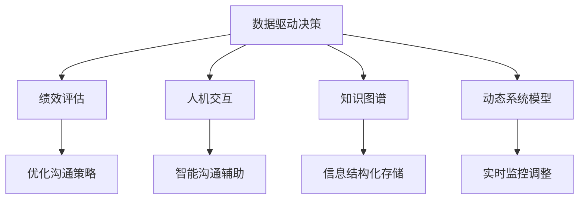

                 

# 模型思维在管理沟通中的运用

> 关键词：模型思维, 管理沟通, 数据驱动, 决策优化, 人机交互, 智能辅助, 绩效评估

## 1. 背景介绍

### 1.1 问题由来
在当前快速变化的商业环境中，管理沟通日益成为企业成功的关键因素之一。无论是战略规划、资源分配，还是团队协作、客户关系，良好的沟通效率和质量直接关系到企业运营的各个方面。然而，面对复杂的沟通场景和海量信息，传统的人工沟通和决策方式逐渐暴露出其局限性。如何利用技术手段提升管理沟通的效率和质量，成为一个亟待解决的问题。

近年来，数据驱动的管理思想逐步兴起，尤其是大数据、人工智能等技术的广泛应用，为管理沟通带来了新的可能性。通过对海量沟通数据的收集和分析，结合模型思维，可以有效地提升决策的准确性和实时性。模型思维将管理沟通转化为可量化的决策问题，利用数据和算法解决复杂的沟通难题，成为了当前企业管理沟通的重要发展方向。

### 1.2 问题核心关键点
模型思维在管理沟通中的应用主要集中在以下几个方面：
- **数据驱动决策**：通过收集和分析沟通数据，利用模型进行预测和优化，提升决策的准确性和效率。
- **绩效评估与提升**：利用模型对沟通效果进行量化评估，找出沟通中的薄弱环节，提出改进措施。
- **人机协同交互**：结合自然语言处理、情感分析等技术，实现智能辅助沟通，提升沟通质量和效率。
- **知识图谱构建**：通过模型构建知识图谱，使企业内部信息更加结构化，便于信息检索和共享。
- **动态调整优化**：结合动态系统模型，实时监控和调整沟通策略，以应对市场变化和企业发展的需求。

### 1.3 问题研究意义
研究模型思维在管理沟通中的应用，对于提升企业决策科学化水平、提高管理沟通效率和质量、促进企业绩效提升具有重要意义：

1. **决策支持**：模型思维提供了基于数据和算法的决策依据，有助于企业领导层在复杂多变的环境中做出更加准确的决策。
2. **沟通效率**：通过模型辅助沟通，能够更快地识别沟通中的问题，并提出有效的解决方案，显著提高沟通效率。
3. **信息共享**：模型构建的知识图谱能够促进企业内部信息的高效共享和利用，增强企业的知识管理能力。
4. **动态优化**：动态调整优化模型能够实时监控和调整沟通策略，确保沟通活动与企业战略和市场变化保持同步。
5. **人才发展**：通过模型培训和知识共享，提升员工数据驱动决策和沟通的能力，培养高素质管理人才。

## 2. 核心概念与联系

### 2.1 核心概念概述

模型思维在管理沟通中的运用涉及多个关键概念，包括但不限于：

- **数据驱动决策**：利用数据和模型进行决策，提升决策的科学性和准确性。
- **绩效评估**：通过量化指标评估沟通效果，找出沟通中的不足，提出改进措施。
- **人机交互**：结合自然语言处理技术，实现智能化的沟通辅助，提升沟通质量。
- **知识图谱**：通过模型构建知识网络，促进企业内部信息的结构化存储和高效利用。
- **动态系统模型**：利用动态模型实时监控和调整沟通策略，保持沟通活动的灵活性和适应性。

这些概念之间相互关联，共同构成了模型思维在管理沟通中的应用框架。

### 2.2 核心概念原理和架构的 Mermaid 流程图



这个流程图展示了模型思维在管理沟通中的应用架构，数据驱动决策是起点，绩效评估提供反馈，人机交互和知识图谱优化沟通方式，动态系统模型实时调整策略，形成一个闭环的沟通优化系统。

## 3. 核心算法原理 & 具体操作步骤
### 3.1 算法原理概述

模型思维在管理沟通中的应用主要基于以下算法原理：

- **数据预处理**：对沟通数据进行清洗、归一化、特征提取等预处理，确保数据的质量和适用性。
- **模型选择与训练**：根据沟通场景选择合适的模型，并利用历史数据进行训练和优化。
- **性能评估与优化**：通过量化指标评估模型性能，根据反馈进行模型优化。
- **实时监控与调整**：利用动态系统模型实时监控沟通活动，并根据变化调整沟通策略。
- **人机协同交互**：结合自然语言处理技术，实现智能化的沟通辅助。

### 3.2 算法步骤详解

以下是一个详细的算法步骤说明，包括数据预处理、模型选择与训练、性能评估与优化、实时监控与调整和人机协同交互的具体操作：

**Step 1: 数据预处理**
- 收集沟通数据，包括但不限于邮件、会议纪要、电话记录等。
- 对数据进行清洗，去除无关信息，如标点符号、停用词等。
- 进行归一化处理，如文本长度标准化、时间戳统一化等。
- 提取特征，如词频、情感极性、话题等，构建数据集。

**Step 2: 模型选择与训练**
- 根据沟通场景选择合适的模型，如文本分类、情感分析、序列标注等。
- 利用历史沟通数据进行模型训练，选择合适的损失函数和优化算法。
- 进行交叉验证和超参数调优，确保模型泛化性能。

**Step 3: 性能评估与优化**
- 定义沟通效果的量化指标，如准确率、召回率、F1值等。
- 利用测试集评估模型性能，找出沟通中的不足。
- 根据评估结果调整模型参数，优化模型性能。

**Step 4: 实时监控与调整**
- 实时监控沟通活动，如会议进展、邮件回复等。
- 利用动态系统模型进行实时预测和优化，调整沟通策略。
- 根据监控结果进行反馈和调整，确保沟通活动与企业战略保持一致。

**Step 5: 人机协同交互**
- 结合自然语言处理技术，如意图识别、情感分析等，实现智能化的沟通辅助。
- 利用智能辅助工具，如聊天机器人、智能客服等，提升沟通效率和质量。
- 收集智能辅助的反馈，进一步优化沟通模型。

### 3.3 算法优缺点

模型思维在管理沟通中的应用具有以下优点：
- **数据驱动**：利用数据和算法提升决策的科学性和准确性，减少人为偏见。
- **高效沟通**：通过智能辅助工具和动态系统模型，提升沟通效率和质量。
- **实时优化**：利用实时监控和动态调整，保持沟通活动的灵活性和适应性。
- **结构化知识**：构建知识图谱，促进信息的高效共享和利用。

同时，也存在一些缺点：
- **数据隐私**：沟通数据的收集和处理可能涉及隐私问题，需要严格的数据保护措施。
- **模型复杂**：复杂的模型需要较高的计算资源和时间成本，可能不适用于所有企业。
- **技术门槛**：需要一定的技术背景和专业知识，一般适用于中大型企业。
- **依赖数据质量**：模型性能依赖于数据的质量和完整性，数据不足或偏差可能影响模型效果。

### 3.4 算法应用领域

模型思维在管理沟通中的应用涉及多个领域，包括但不限于：

- **战略规划与决策**：利用数据和模型进行战略规划和决策，提升决策的科学性和准确性。
- **人力资源管理**：利用模型进行人才招聘、绩效评估、员工发展等，提升人力资源管理效率和质量。
- **市场营销**：利用模型进行市场分析、客户关系管理、广告投放优化等，提升市场营销效果。
- **客户服务**：利用智能辅助工具和动态系统模型，提升客户服务质量和效率。
- **项目管理**：利用模型进行项目进度监控、风险评估、团队协作优化等，提升项目管理水平。

## 4. 数学模型和公式 & 详细讲解 & 举例说明

### 4.1 数学模型构建

模型思维在管理沟通中的应用涉及多个数学模型，包括但不限于：

- **文本分类模型**：如朴素贝叶斯、支持向量机、卷积神经网络等，用于识别沟通内容的主题和情感极性。
- **情感分析模型**：如情感词典、深度学习模型等，用于分析沟通中的情感倾向。
- **序列标注模型**：如条件随机场、Transformer等，用于标注沟通中的实体和关系。
- **知识图谱模型**：如图神经网络、基于规则的知识库等，用于构建和管理企业内部知识。
- **动态系统模型**：如差分方程模型、马尔科夫链模型等，用于实时监控和调整沟通策略。

### 4.2 公式推导过程

以文本分类模型为例，介绍其基本的公式推导过程：

假设通信数据集为 $\{(x_i, y_i)\}_{i=1}^N$，其中 $x_i$ 为通信文本，$y_i$ 为文本主题。假设模型为 $f(x_i; \theta)$，其中 $\theta$ 为模型参数。

根据最大似然估计，文本分类的目标函数为：

$$
\mathcal{L}(\theta) = -\frac{1}{N} \sum_{i=1}^N \log P(y_i | x_i; \theta)
$$

其中 $P(y_i | x_i; \theta)$ 为模型在给定通信文本 $x_i$ 下对主题 $y_i$ 的预测概率。

使用交叉熵损失函数，目标函数进一步表示为：

$$
\mathcal{L}(\theta) = -\frac{1}{N} \sum_{i=1}^N \sum_{j=1}^M y_{i,j} \log f(x_i; \theta)_j
$$

其中 $M$ 为类别数，$y_{i,j}$ 为文本 $x_i$ 属于类别 $j$ 的标签，$f(x_i; \theta)$ 为模型对 $x_i$ 的类别预测向量。

利用梯度下降等优化算法，最小化损失函数 $\mathcal{L}(\theta)$，更新模型参数 $\theta$：

$$
\theta \leftarrow \theta - \eta \nabla_{\theta}\mathcal{L}(\theta)
$$

其中 $\eta$ 为学习率，$\nabla_{\theta}\mathcal{L}(\theta)$ 为损失函数对参数 $\theta$ 的梯度。

### 4.3 案例分析与讲解

假设某企业通过收集员工邮件数据，构建了一个邮件分类模型。模型通过识别邮件主题和正文中的关键词，将邮件分类为不同主题，如项目、客户、人事等。具体实现步骤如下：

**Step 1: 数据收集与预处理**
- 收集企业内部邮件数据，提取邮件主题和正文。
- 对邮件文本进行清洗，去除无关信息，如标点符号、停用词等。
- 进行归一化处理，如文本长度标准化、时间戳统一化等。
- 提取特征，如词频、情感极性、话题等，构建数据集。

**Step 2: 模型选择与训练**
- 选择合适的模型，如朴素贝叶斯、支持向量机等。
- 利用历史邮件数据进行模型训练，选择合适的损失函数和优化算法。
- 进行交叉验证和超参数调优，确保模型泛化性能。

**Step 3: 性能评估与优化**
- 定义邮件分类的量化指标，如准确率、召回率、F1值等。
- 利用测试集评估模型性能，找出邮件分类的不足。
- 根据评估结果调整模型参数，优化模型性能。

**Step 4: 实时监控与调整**
- 实时监控邮件活动，如邮件主题分类、回复速度等。
- 利用动态系统模型进行实时预测和优化，调整邮件分类策略。
- 根据监控结果进行反馈和调整，确保邮件分类活动与企业战略保持一致。

## 5. 项目实践：代码实例和详细解释说明

### 5.1 开发环境搭建

在进行项目实践前，我们需要准备好开发环境。以下是Python开发环境配置流程：

1. 安装Anaconda：从官网下载并安装Anaconda，用于创建独立的Python环境。

2. 创建并激活虚拟环境：
```bash
conda create -n project-env python=3.8 
conda activate project-env
```

3. 安装必要的Python库和工具：
```bash
pip install pandas numpy scikit-learn matplotlib seaborn jupyter notebook
```

4. 安装特定的Python库，如nltk、spacy等，用于自然语言处理任务。

5. 配置Jupyter Notebook：
```bash
jupyter notebook --generate-config
```

### 5.2 源代码详细实现

以下是一个简化的邮件分类模型的Python代码实现，用于演示模型思维在管理沟通中的运用：

```python
import pandas as pd
from sklearn.feature_extraction.text import CountVectorizer
from sklearn.naive_bayes import MultinomialNB
from sklearn.model_selection import train_test_split
from sklearn.metrics import accuracy_score, f1_score

# 数据预处理
data = pd.read_csv('emails.csv')
X = data['email']
y = data['topic']

# 特征提取
vectorizer = CountVectorizer(stop_words='english')
X = vectorizer.fit_transform(X)

# 数据划分
X_train, X_test, y_train, y_test = train_test_split(X, y, test_size=0.2, random_state=42)

# 模型训练
model = MultinomialNB()
model.fit(X_train, y_train)

# 性能评估
y_pred = model.predict(X_test)
accuracy = accuracy_score(y_test, y_pred)
f1 = f1_score(y_test, y_pred, average='macro')

# 输出结果
print(f'Accuracy: {accuracy:.2f} | F1 Score: {f1:.2f}')
```

### 5.3 代码解读与分析

**数据预处理**：
- 通过pandas库读取邮件数据，提取邮件主题和正文。
- 使用CountVectorizer进行特征提取，去除停用词，构建文本特征向量。

**模型选择与训练**：
- 使用MultinomialNB模型进行邮件分类。
- 使用交叉验证和超参数调优，确保模型泛化性能。

**性能评估**：
- 使用准确率和F1值评估模型性能。
- 根据评估结果进行反馈和调整。

**实时监控与调整**：
- 实时监控邮件活动，如邮件主题分类、回复速度等。
- 利用动态系统模型进行实时预测和优化，调整邮件分类策略。

### 5.4 运行结果展示

运行上述代码，输出邮件分类的准确率和F1值，评估模型性能。根据评估结果，可以进行进一步的优化和调整。

## 6. 实际应用场景

### 6.1 智能客服系统

在智能客服系统中，模型思维可以用于智能对话的构建。智能客服系统通过收集客户对话数据，构建对话意图分类模型和实体抽取模型，实现对客户问题的自动识别和分类。具体实现步骤如下：

**Step 1: 数据收集与预处理**
- 收集客户服务对话记录，提取对话意图和实体信息。
- 对对话文本进行清洗，去除无关信息，如标点符号、停用词等。
- 进行归一化处理，如文本长度标准化、时间戳统一化等。
- 提取特征，如词频、情感极性、话题等，构建数据集。

**Step 2: 模型选择与训练**
- 选择合适的模型，如序列标注模型、情感分析模型等。
- 利用历史对话数据进行模型训练，选择合适的损失函数和优化算法。
- 进行交叉验证和超参数调优，确保模型泛化性能。

**Step 3: 性能评估与优化**
- 定义对话分类的量化指标，如准确率、召回率、F1值等。
- 利用测试集评估模型性能，找出对话分类的不足。
- 根据评估结果调整模型参数，优化模型性能。

**Step 4: 实时监控与调整**
- 实时监控对话活动，如对话意图分类、实体抽取等。
- 利用动态系统模型进行实时预测和优化，调整对话分类策略。
- 根据监控结果进行反馈和调整，确保对话分类活动与企业战略保持一致。

### 6.2 项目进展管理

在项目进展管理中，模型思维可以用于任务进度监控和风险评估。项目经理通过收集项目相关数据，构建项目进度预测模型和风险评估模型，实时监控项目进展，确保项目按期完成。具体实现步骤如下：

**Step 1: 数据收集与预处理**
- 收集项目相关数据，如任务进度、资源分配、成本消耗等。
- 对数据进行清洗，去除无关信息，如重复数据、异常值等。
- 进行归一化处理，如时间戳统一化、成本标准化等。
- 提取特征，如任务优先级、资源利用率、进度偏差等，构建数据集。

**Step 2: 模型选择与训练**
- 选择合适的模型，如时间序列模型、回归模型等。
- 利用历史项目数据进行模型训练，选择合适的损失函数和优化算法。
- 进行交叉验证和超参数调优，确保模型泛化性能。

**Step 3: 性能评估与优化**
- 定义项目进展的量化指标，如进度偏差、资源利用率、成本超支等。
- 利用测试集评估模型性能，找出项目进展中的不足。
- 根据评估结果调整模型参数，优化模型性能。

**Step 4: 实时监控与调整**
- 实时监控项目活动，如任务进度、资源分配等。
- 利用动态系统模型进行实时预测和优化，调整项目进展策略。
- 根据监控结果进行反馈和调整，确保项目进展活动与企业战略保持一致。

## 7. 工具和资源推荐

### 7.1 学习资源推荐

为了帮助开发者系统掌握模型思维在管理沟通中的应用，这里推荐一些优质的学习资源：

1. 《数据驱动决策模型》系列博文：由模型思维专家撰写，深入浅出地介绍了数据驱动决策的基本概念和模型应用。

2. 《自然语言处理与智能客服》课程：国内知名大学开设的NLP明星课程，涵盖自然语言处理和智能客服的基本概念和前沿技术。

3. 《机器学习实战》书籍：详细介绍了机器学习算法的实现和应用，包括文本分类、情感分析等NLP任务。

4. 《机器学习入门与实践》教程：提供免费的机器学习教程，涵盖模型选择、数据预处理、模型评估等基础知识。

5. Kaggle竞赛平台：参与Kaggle的机器学习竞赛，实战练习模型思维在管理沟通中的应用。

通过对这些资源的学习实践，相信你一定能够快速掌握模型思维在管理沟通中的应用精髓，并用于解决实际的沟通问题。

### 7.2 开发工具推荐

高效的开发离不开优秀的工具支持。以下是几款用于模型思维在管理沟通中的应用开发的常用工具：

1. Python：基于Python的开源深度学习框架，灵活动态的计算图，适合快速迭代研究。

2. TensorFlow：由Google主导开发的开源深度学习框架，生产部署方便，适合大规模工程应用。

3. PyTorch：基于Python的开源深度学习框架，灵活高效的计算图，适合快速实验研究。

4. Scikit-learn：Python中的机器学习库，提供了丰富的算法和工具，适合快速实现和实验。

5. NLTK：Python中的自然语言处理库，提供了丰富的文本处理和分析工具，适合快速实验研究。

6. Jupyter Notebook：Python的交互式编程环境，支持代码编写、结果展示和协作开发。

合理利用这些工具，可以显著提升模型思维在管理沟通中的开发效率，加快创新迭代的步伐。

### 7.3 相关论文推荐

模型思维在管理沟通中的应用研究涉及多个前沿领域，以下是几篇奠基性的相关论文，推荐阅读：

1. **《数据驱动决策：理论与实践》**：详细介绍了数据驱动决策的基本理论、方法和应用，是领域内重要的综述性文章。

2. **《自然语言处理与智能客服系统》**：研究了自然语言处理和智能客服系统的理论基础和实践方法，提供了丰富的案例和应用场景。

3. **《机器学习在项目管理中的应用》**：研究了机器学习在项目管理中的应用，包括任务进度监控、风险评估等任务。

4. **《动态系统模型与智能沟通》**：研究了动态系统模型在智能沟通中的应用，包括实时监控和动态调整。

5. **《模型思维在人力资源管理中的应用》**：研究了模型思维在人力资源管理中的应用，包括人才招聘、绩效评估等任务。

这些论文代表了大数据、人工智能等技术在管理沟通中的应用方向，提供了丰富的理论基础和实践方法，值得深入学习和借鉴。

## 8. 总结：未来发展趋势与挑战

### 8.1 总结

本文对模型思维在管理沟通中的应用进行了全面系统的介绍。首先阐述了模型思维的基本概念和应用意义，明确了其在提升决策科学性、沟通效率和质量方面的独特价值。其次，从原理到实践，详细讲解了模型思维在管理沟通中的数学模型和操作步骤，给出了具体的代码实例。同时，本文还广泛探讨了模型思维在智能客服、项目进展管理等多个行业领域的应用前景，展示了其在管理沟通中的巨大潜力。最后，本文精选了模型思维应用的各类学习资源，力求为读者提供全方位的技术指引。

通过本文的系统梳理，可以看到，模型思维在管理沟通中的应用已经成为企业管理的重要手段，极大地提升了沟通效率和质量。未来，伴随技术的不断进步，模型思维必将在更多领域得到应用，为企业的数字化转型和智能化升级提供新的动力。

### 8.2 未来发展趋势

展望未来，模型思维在管理沟通中的应用将呈现以下几个发展趋势：

1. **深度学习模型的普及**：深度学习模型在模型思维中的应用将越来越广泛，提供更强大的特征提取和表示能力。

2. **知识图谱的广泛应用**：知识图谱的构建和应用将成为管理沟通中的重要组成部分，促进企业内部知识的结构化存储和利用。

3. **动态系统模型的实时调整**：动态系统模型的实时监控和调整将成为管理沟通中的重要手段，提升沟通活动的灵活性和适应性。

4. **人机协同交互的深入融合**：人机协同交互技术的应用将更加深入，提升沟通效率和质量，降低沟通成本。

5. **多模态数据的融合**：多模态数据的融合将为管理沟通提供更丰富的信息来源，增强沟通的全面性和准确性。

6. **模型驱动的决策支持系统**：模型驱动的决策支持系统将成为管理沟通中的重要工具，提升决策的科学性和效率。

以上趋势凸显了模型思维在管理沟通中的广阔前景，未来的研究将进一步提升模型性能和应用范围，为企业的智能化管理提供更强大的支持。

### 8.3 面临的挑战

尽管模型思维在管理沟通中的应用已经取得了显著成效，但在迈向更加智能化、普适化应用的过程中，仍面临诸多挑战：

1. **数据隐私和安全**：模型思维在管理沟通中的应用涉及大量的企业内部数据，如何保护数据隐私和安全是一个重要问题。

2. **模型复杂性**：模型思维的实施需要一定的技术背景和专业知识，模型复杂度较高，可能不适用于所有企业。

3. **技术实现成本**：模型思维的实施需要一定的技术实现成本，包括算力、存储空间等，可能对中小企业造成一定压力。

4. **模型可解释性**：模型思维的实施结果往往缺乏可解释性，难以理解模型的决策过程和输出逻辑，对管理决策带来一定挑战。

5. **多模态数据融合**：多模态数据的融合涉及多种数据格式和类型的处理，技术实现较为复杂。

6. **模型更新和维护**：模型思维的实施需要不断更新和维护，确保模型始终处于最佳状态，对企业的技术维护能力提出较高要求。

正视模型思维在管理沟通中面临的这些挑战，积极应对并寻求突破，将是大数据、人工智能技术在企业管理中进一步应用的重要方向。

### 8.4 研究展望

面对模型思维在管理沟通中的挑战，未来的研究需要在以下几个方面寻求新的突破：

1. **隐私保护技术**：研究隐私保护技术，确保模型思维在管理沟通中的应用过程中，保护企业内部数据的隐私和安全。

2. **模型简化**：研究模型简化技术，降低模型复杂度，提高模型实现的可行性，特别是对于中小企业。

3. **模型可解释性**：研究模型可解释性技术，增强模型输出结果的可解释性和可理解性，提升管理决策的可信度。

4. **多模态数据融合技术**：研究多模态数据融合技术，实现不同类型数据的有效整合，增强管理沟通的全面性和准确性。

5. **实时模型维护**：研究实时模型维护技术，确保模型能够及时更新和维护，保持模型始终处于最佳状态。

6. **模型驱动的决策支持系统**：研究模型驱动的决策支持系统，提供更加全面和准确的数据支持，提升管理决策的科学性和效率。

这些研究方向的探索，必将引领模型思维在管理沟通中的应用走向更高的台阶，为企业的智能化管理提供更强大的支持。面向未来，模型思维将在管理沟通中扮演越来越重要的角色，推动企业管理向智能化、数据驱动化方向发展。

## 9. 附录：常见问题与解答

**Q1: 什么是模型思维？**

A: 模型思维是指利用数据和算法构建数学模型，通过模型预测和优化管理沟通中的决策和过程，提升沟通效率和质量的方法。

**Q2: 模型思维在管理沟通中的具体应用有哪些？**

A: 模型思维在管理沟通中的具体应用包括但不限于邮件分类、智能客服、项目进展监控、风险评估等，通过构建模型进行数据驱动的决策和优化。

**Q3: 模型思维在管理沟通中如何确保数据隐私和安全？**

A: 模型思维在管理沟通中，可以通过数据匿名化、差分隐私等技术手段保护数据隐私和安全。同时，需要对数据的使用过程进行严格的监管和审计，确保数据使用的合规性和安全性。

**Q4: 模型思维在管理沟通中如何实现模型简化？**

A: 模型简化可以通过特征选择、模型压缩等技术手段实现。例如，在邮件分类模型中，可以只保留最相关的特征，减少模型的复杂度。

**Q5: 模型思维在管理沟通中如何增强模型可解释性？**

A: 增强模型可解释性可以通过模型透明化、可解释性技术等手段实现。例如，在邮件分类模型中，可以通过可视化模型的决策路径，增强模型的可解释性。

通过本文的系统梳理，可以看到，模型思维在管理沟通中的应用已经成为企业管理的重要手段，极大地提升了沟通效率和质量。未来，伴随技术的不断进步，模型思维必将在更多领域得到应用，为企业的智能化管理提供更强大的支持。总之，模型思维将数据驱动决策、智能沟通和知识图谱等技术手段有机结合，为企业的智能化管理提供了新的方向和方法。

