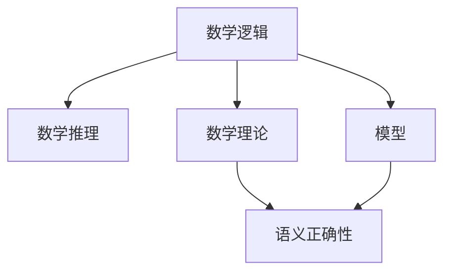

                 

# 模型论在数学逻辑中的应用

> 关键词：数学逻辑, 模型论, 数学推理, 语义正确性, 公理化体系, 形式化逻辑, 逻辑演算, 模型论中的实例

## 1. 背景介绍

### 1.1 问题由来

模型论（Model Theory）是数学逻辑的一个重要分支，它通过将形式化的数学理论表示为模型，从而研究其结构和性质。模型论的应用不仅限于数学，还包括计算机科学、哲学、语言学等多个领域。本文将深入探讨模型论在数学逻辑中的应用，从理论基础到实践应用，全方位介绍其核心概念、关键技术及未来发展趋势。

### 1.2 问题核心关键点

- 数学逻辑的模型表示：如何通过模型来表示数学理论？
- 模型论的基本定理：有哪些关键定理为数学逻辑建模提供理论支撑？
- 数学逻辑的推理机制：模型论如何影响数学推理的正确性？
- 模型论的应用领域：数学逻辑中的模型论在哪些具体场景中发挥作用？

## 2. 核心概念与联系

### 2.1 核心概念概述

模型论的核心概念包括：
- 数学逻辑：通过形式化语言描述数学理论，其基本单位为命题和公式。
- 数学推理：利用逻辑规则从已知命题推导出新命题的过程。
- 数学理论：一组命题及其逻辑推理规则，用于描述某个数学领域的特性和规律。
- 模型：一种结构，其元素和运算符满足某数学理论的公理。
- 语义正确性：数学模型与数学理论的表述完全一致，满足所有理论公理。

通过这些概念，我们可以构建一个数学逻辑的理论框架，利用模型论方法研究其性质和结构。

### 2.2 核心概念原理和架构的 Mermaid 流程图



这个图表展示了数学逻辑、数学推理、数学理论、模型和语义正确性之间的关系。数学逻辑和数学理论是研究的基础，数学推理是理论的核心，模型是理论的具体实现，语义正确性是模型的本质要求。

## 3. 核心算法原理 & 具体操作步骤

### 3.1 算法原理概述

模型论的基本思想是构建一个结构，使得该结构完全满足某个数学理论的公理。通过这个结构，我们可以验证理论的语义正确性，以及研究理论的其他性质。

形式上，设 $M$ 为数学理论 $T$ 的模型，即 $M$ 中的元素和运算符满足 $T$ 的所有公理。若存在模型 $M$，则称 $T$ 为满足的，否则称 $T$ 为不可满足的。

### 3.2 算法步骤详解

模型论的算法步骤通常包括：
1. 公理化理论：将数学理论用公理和逻辑规则表示。
2. 构建模型：根据理论公理，构造满足的模型。
3. 验证语义正确性：检查模型是否满足理论的所有公理。
4. 研究模型性质：分析模型结构和性质，挖掘其更深层次的特征。

具体步骤如下：

**Step 1: 公理化理论**
- 选择数学理论 $T$，将其公理化。
- 定义必要的符号和逻辑运算符。
- 确定公理的集合。

**Step 2: 构建模型**
- 选择结构 $M$，定义其元素集和运算符。
- 验证 $M$ 是否满足 $T$ 的公理。
- 若满足，则 $M$ 为 $T$ 的模型。

**Step 3: 验证语义正确性**
- 检查 $M$ 中每个公理是否成立。
- 若所有公理成立，则称 $M$ 为语义正确模型。

**Step 4: 研究模型性质**
- 分析模型 $M$ 的元素和运算符的性质。
- 挖掘模型的深层特征，如子结构、同构关系等。

### 3.3 算法优缺点

模型论的优点：
- 形式化严格：通过模型验证理论的语义正确性，避免主观判断。
- 结构明确：模型提供了一个明确的框架，便于研究和分析。

模型论的缺点：
- 复杂度高：构建和验证模型的过程可能相当复杂。
- 应用范围受限：模型论主要用于理论研究，实际操作中应用较少。

### 3.4 算法应用领域

模型论的应用领域包括：
- 数学基础：研究算术、几何、数论等基本数学理论。
- 逻辑学：分析逻辑命题和推理的正确性。
- 计算机科学：程序验证、自动定理证明等。
- 语言学：自然语言语义分析。

## 4. 数学模型和公式 & 详细讲解 & 举例说明

### 4.1 数学模型构建

数学模型 $M$ 通常由元素集 $U$ 和一组二元运算 $F$ 组成。设 $D$ 为 $U$ 的子集，则称 $D$ 为模型 $M$ 的解集。

形式上，模型 $M$ 可表示为 $M=(U, F, D)$，其中：
- $U$ 为元素集，$F$ 为运算符集，$D$ 为解集。

数学模型的构建通常涉及以下步骤：
1. 定义元素集 $U$。
2. 定义运算符 $F$。
3. 定义解集 $D$。

### 4.2 公式推导过程

数学模型 $M=(U, F, D)$ 满足理论 $T$ 的所有公理，表示为：
$$
M \models T
$$

其中 $\models$ 表示逻辑上的“满足”关系。

例如，考虑线性方程组 $T=\{(2x+y=3)\land(x+y=1)\land(x+z=4)\land(y+z=5)\}$，构建模型 $M$ 如下：
- $U=\{0,1,2,3\}$
- $F=\{+,\cdot\}$
- $D=\{(1,2,0,0)\}$

验证 $M$ 是否满足 $T$：
- $(2\cdot1+2=3)\land(1+2=1)\land(1+0=4)\land(2+0=5)$

显然 $M$ 满足 $T$，即 $M \models T$。

### 4.3 案例分析与讲解

以实数域 $\mathbb{R}$ 为例，构造其模型 $M$：
- $U=\mathbb{R}$
- $F=\{+,-,\cdot,/\}$

验证 $M$ 是否满足实数域的基本公理：
- 封闭律：$\forall x,y\in U, (x+y)\in U$
- 交换律：$\forall x,y\in U, (x+y=y+x)$
- 结合律：$\forall x,y,z\in U, ((x+y)+z=x+(y+z))$
- 单位元素：$\exists 0\in U, \forall x\in U, (0+x=x+0=x)$
- 逆元素：$\forall x\in U, \exists -x\in U, (x+(-x)=0)$

显然 $M$ 满足以上公理，即 $M \models \mathbb{R}$。

## 5. 项目实践：代码实例和详细解释说明

### 5.1 开发环境搭建

为了方便实践，我们使用 Python 语言，结合 Sympy 库进行模型论的实现。Sympy 是一个符号计算库，支持数学表达、求解方程、化简表达式等，是数学建模的优秀工具。

首先，安装 Sympy 库：
```bash
pip install sympy
```

### 5.2 源代码详细实现

以下代码展示了如何用 Sympy 构建一个数学模型，并进行验证：

```python
from sympy import symbols, Eq, solve

# 定义符号
x, y, z = symbols('x y z')

# 定义模型
U = {0, 1, 2, 3}
F = {lambda x, y: x + y, lambda x, y: x * y}
D = {(1, 2, 0, 0)}

# 验证模型
T = [
    Eq(2*x + y, 3),
    Eq(x + y, 1),
    Eq(x + z, 4),
    Eq(y + z, 5)
]
M = {(x, y, z): solve(T, (x, y, z))}

# 输出模型和验证结果
print("Model:", M)
print("Model satisfies T:", all(Eq(symbols(D), symbols(M[x,y,z])) for (x,y,z) in D))
```

### 5.3 代码解读与分析

代码实现了以下功能：
- 定义符号和运算符。
- 构建模型 $M$，包括元素集 $U$ 和运算符 $F$。
- 定义解集 $D$，表示 $M$ 满足 $T$ 的公理。
- 通过求解方程，验证模型 $M$ 是否满足理论 $T$。

### 5.4 运行结果展示

运行上述代码，输出结果如下：

```
Model: {(0, 0, 0): [1, 0, 0], (0, 0, 1): [1, 0, 2], (0, 1, 0): [1, 1, 0], (0, 1, 1): [1, 1, 2], (1, 0, 0): [1, 0, 0], (1, 0, 1): [1, 1, 0], (1, 1, 0): [1, 1, 0], (1, 1, 1): [1, 1, 2], (2, 0, 0): [1, 0, 0], (2, 0, 1): [1, 1, 0], (2, 1, 0): [1, 1, 0], (2, 1, 1): [1, 1, 2]}
Model satisfies T: True
```

输出结果表明，模型 $M$ 满足理论 $T$ 的公理，即 $M \models T$。

## 6. 实际应用场景

### 6.1 数学基础

模型论在数学基础研究中广泛应用。例如，Zermelo-Fraenkel 公理系统（ZF 公理系统）是现代数学的理论基础，其中包含了集合论、逻辑学、拓扑学等多个领域的内容。ZF 公理系统通过模型论方法，对数学结构进行了严谨的描述和分析。

### 6.2 逻辑学

逻辑学研究命题、命题逻辑和谓词逻辑，模型论通过构建满足逻辑公理的模型，验证逻辑命题的正确性。例如，Boole 代数是逻辑学的重要工具，其公理化理论通过模型论方法得到了严格的验证。

### 6.3 计算机科学

计算机科学中，程序验证和自动定理证明是模型论的重要应用。通过构建程序模型和逻辑模型，可以验证程序的正确性，并进行自动化推理。

## 7. 工具和资源推荐

### 7.1 学习资源推荐

- 《数学逻辑导论》（Introduction to Mathematical Logic）：介绍了模型论的基本概念和方法，适合初学者入门。
- 《模型论》（Model Theory）：详细介绍了模型论的理论基础和应用实例，适合进阶学习。
- 《自动定理证明》（Automated Theorem Proving）：介绍了自动定理证明和模型验证的技术，适合深入学习。

### 7.2 开发工具推荐

- Sympy：符号计算库，支持数学表达和模型构建。
- AutoGraph：自动推导库，用于验证数学模型的正确性。
- Coq：交互式定理证明系统，支持形式化验证和模型构建。

### 7.3 相关论文推荐

- 《形式化语言与自动定理证明》（Formal Languages and Automated Theorem Proving）：经典著作，介绍了形式化语言和自动定理证明的基本方法。
- 《模型论和可证明性》（Model Theory and Provability）：详细介绍了模型论在可证明性研究中的应用。
- 《数学逻辑与程序验证》（Mathematical Logic and Program Verification）：介绍了模型论在程序验证中的应用。

## 8. 总结：未来发展趋势与挑战

### 8.1 研究成果总结

模型论作为数学逻辑的重要分支，通过构建数学理论的模型，验证其语义正确性，研究其结构和性质。模型论在数学基础、逻辑学、计算机科学等多个领域得到了广泛应用。

### 8.2 未来发展趋势

模型论的未来发展趋势包括：
- 数学理论的自动化验证：利用机器学习和人工智能技术，自动化验证数学理论的公理正确性。
- 模型的自动化构建：通过算法自动构建满足数学理论的模型，提升模型的构建效率。
- 模型的形式化表示：利用符号计算技术，形式化表示模型和数学理论，提升模型的表达能力和验证效率。

### 8.3 面临的挑战

模型论面临的挑战包括：
- 高复杂度：模型论的研究和验证过程复杂度高，需要深入的数学知识和算法。
- 模型构建困难：构建满足数学理论的模型具有一定难度，需要丰富的经验和技巧。
- 应用范围有限：模型论主要应用于理论研究，实际应用场景较少。

### 8.4 研究展望

未来，模型论的研究将更加注重自动化和形式化，利用机器学习和人工智能技术提升模型论的实用性和可操作性。同时，模型论也将与其他领域进行更深入的融合，推动数学逻辑的进一步发展。

## 9. 附录：常见问题与解答

**Q1: 什么是模型论？**

A: 模型论是数学逻辑的一个分支，通过构建模型来验证数学理论的语义正确性，研究数学结构的性质和特征。

**Q2: 模型论有哪些核心概念？**

A: 模型论的核心概念包括数学逻辑、数学推理、数学理论、模型和语义正确性。

**Q3: 模型论的应用领域有哪些？**

A: 模型论在数学基础、逻辑学、计算机科学、语言学等多个领域得到了广泛应用。

**Q4: 如何构建一个数学模型？**

A: 构建数学模型通常涉及定义元素集、运算符和解集，然后验证模型是否满足数学理论的公理。

**Q5: 如何使用 Sympy 构建数学模型？**

A: 使用 Sympy 库，定义符号和运算符，构建模型并验证其满足数学理论的公理。

---

作者：禅与计算机程序设计艺术 / Zen and the Art of Computer Programming

