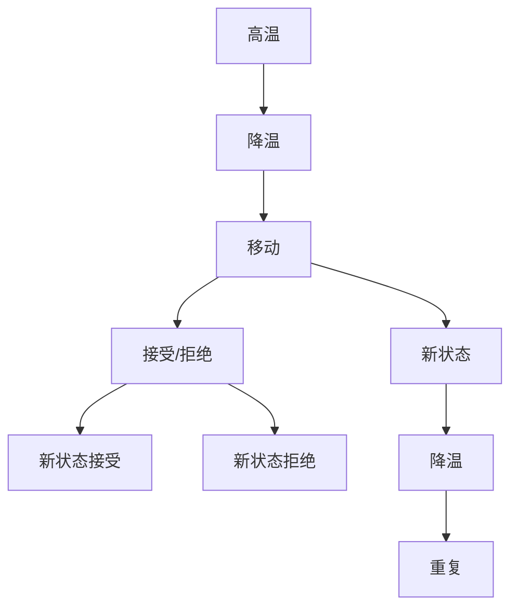

                 

# 模拟退火算法(Simulated Annealing) - 原理与代码实例讲解

> 关键词：模拟退火算法, Metropolis准则, 动态邻域, 随机降温, 全局最优

## 1. 背景介绍

### 1.1 问题由来
在现代计算科学中，优化问题广泛存在，例如机器学习中的参数优化、非线性规划、图优化、组合优化等。然而，许多优化问题存在局部最优解或NP难解等问题，传统的优化算法（如梯度下降）往往难以找到全局最优解。这时，模拟退火算法(Simulated Annealing, SA)作为一种模拟物理学中退火过程的随机化优化方法应运而生。

SA算法通过对解空间的随机搜索，结合概率接受原则，可以在一定概率下接受劣质解，从而跳出局部最优，逐渐逼近全局最优。它具有全局搜索能力和鲁棒性，被广泛应用于求解各种复杂优化问题。

### 1.2 问题核心关键点
模拟退火算法是一种基于概率的优化算法，其核心思想和步骤如下：
1. 初始化：给定初始解，确定初始温度和终止温度。
2. 动态邻域：定义一个邻域结构，用来生成相邻的解。
3. 状态转移：通过一定概率接受劣质解，从而跳出局部最优。
4. 温度下降：动态调整温度，确保算法收敛。

理解SA算法的核心思想，需要从物理退火过程和算法优化过程的类比入手，如图1所示。




图1: 模拟退火算法流程示意图

## 2. 核心概念与联系

### 2.1 核心概念概述

SA算法作为一种全局搜索算法，涉及多个关键概念：

- 状态(Solution)：优化问题中的候选解。
- 邻域(Neighbor)：一个状态的邻居状态，通常由一定的规则生成。
- 温度(Temperature)：算法动态调整的参数，用于控制解空间搜索的广度和深度。
- 接受概率(Acceptance Probability)：决定当前状态是否接受邻居状态的概率，是SA算法的重要组成部分。
- 随机性(Randomness)：算法引入随机性，以跳出局部最优。

这些概念之间通过相互配合，共同构成了SA算法的框架。

### 2.2 核心概念原理和架构的 Mermaid 流程图(Mermaid 流程节点中不要有括号、逗号等特殊字符)


图2: 模拟退火算法原理与架构流程图

## 3. 核心算法原理 & 具体操作步骤
### 3.1 算法原理概述

SA算法通过模拟物理退火过程，利用热力学中的吉布斯自由能原理，实现全局最优解的搜索。其核心思想是将问题空间视为一个能量场，通过移动和接受不同状态，降低能量，逐步逼近最低能量（即全局最优）状态。

具体来说，算法步骤如下：
1. 初始化：随机生成一个解作为初始状态，设定初始温度 $T_0$ 和降温速率 $\beta$。
2. 动态邻域：以当前状态为中心，生成一个邻域，随机选择邻域中的状态。
3. 状态转移：计算目标状态和当前状态的能量差，根据Metropolis准则决定是否接受该状态。
4. 温度下降：在每次迭代后降低温度，控制算法的搜索范围和速度。
5. 终止条件：当温度下降至预设阈值或达到最大迭代次数时，算法终止。

### 3.2 算法步骤详解

以下是模拟退火算法的详细步骤：

**Step 1: 初始化**
- 随机初始化一个解 $S_0$ 作为初始状态。
- 设定初始温度 $T_0$，终止温度 $T_f$，降温速率 $\beta$。

**Step 2: 动态邻域**
- 以当前状态 $S_t$ 为中心，生成一个邻域 $N(S_t)$，包含若干个邻近状态。
- 随机选择邻域中的一个状态 $S'$。

**Step 3: 状态转移**
- 计算 $S_t$ 和 $S'$ 的能量差 $\Delta E$。
- 根据Metropolis准则，以概率 $P$ 接受 $S'$ 状态，以概率 $1-P$ 拒绝 $S'$ 状态。概率 $P$ 通常定义为：
  $$
  P = \exp(-\Delta E / T_t)
  $$
  其中 $T_t$ 为当前温度。

**Step 4: 温度下降**
- 每次迭代后，将当前温度降低一个固定量或按一定速率降低：
  $$
  T_{t+1} = T_t \cdot \beta
  $$
  通常 $\beta$ 的取值约为0.9或0.95。

**Step 5: 终止条件**
- 当 $T_t < T_f$ 或达到最大迭代次数 $N_{\max}$ 时，算法终止。

通过以上步骤，SA算法能够在大范围内搜索最优解，具有较强的全局搜索能力和鲁棒性。

### 3.3 算法优缺点

模拟退火算法具有以下优点：
1. 全局搜索能力：通过随机性和概率接受，算法能够在较大范围内搜索最优解，避免陷入局部最优。
2. 鲁棒性强：算法对初始解的选择不敏感，适用于多种优化问题。
3. 易于实现：算法步骤简单，易于理解和实现。

同时，SA算法也存在一些局限：
1. 运行时间较长：算法需要多次迭代和温度下降，计算复杂度较高。
2. 局部最优概率高：温度下降过快或邻域范围过小，可能导致算法过早收敛于局部最优。
3. 参数敏感：邻域大小、降温速率等参数需要根据问题调整，调整不当可能导致算法性能下降。

尽管有这些局限，但SA算法在求解复杂优化问题时，仍表现出强大的全局搜索能力和鲁棒性，被广泛应用于各种实际应用场景中。

### 3.4 算法应用领域

模拟退火算法在诸多领域得到了广泛应用，如：

- 机器学习：在参数优化、神经网络训练、特征选择等方面，SA算法表现出良好的性能。
- 非线性规划：SA算法能够有效地解决非线性规划问题，如最小二乘法、最小化问题等。
- 图优化：在图优化、网络路由、路径规划等方面，SA算法被广泛应用。
- 组合优化：在组合优化、旅行商问题、背包问题等NP难问题上，SA算法能够提供高效求解方法。
- 工业生产：在生产调度、设备维护、物流优化等方面，SA算法能够提升生产效率和资源利用率。

## 4. 数学模型和公式 & 详细讲解 & 举例说明

### 4.1 数学模型构建

SA算法通过能量场的类比，将优化问题转化为寻找能量最低状态的过程。假设当前状态为 $S_t$，邻域中的状态为 $S'$，能量函数为 $E$，温度为 $T$，则Metropolis准则的接受概率 $P$ 可以表示为：

$$
P = \min(1, \exp(-\Delta E / T))
$$

其中 $\Delta E = E(S') - E(S_t)$ 表示目标状态和当前状态的能量差。

### 4.2 公式推导过程

根据Metropolis准则，每次迭代中，SA算法以概率 $P$ 接受新状态 $S'$，以概率 $1-P$ 拒绝新状态 $S'$。在算法运行过程中，温度 $T$ 逐渐下降，导致能量差 $\Delta E$ 对 $P$ 的影响逐渐减弱，从而算法能够逐渐逼近全局最优。

推导过程如下：
1. 初始化：设定初始温度 $T_0$，状态 $S_0$。
2. 动态邻域：以 $S_t$ 为中心，生成邻域 $N(S_t)$。
3. 状态转移：随机选择 $N(S_t)$ 中的一个状态 $S'$。
4. 计算能量差 $\Delta E = E(S') - E(S_t)$。
5. 接受概率：计算 $P = \min(1, \exp(-\Delta E / T_t))$。
6. 更新状态：如果 $P > \text{rand}(0,1)$，则接受 $S'$，否则拒绝。
7. 温度下降：更新温度 $T_{t+1} = T_t \cdot \beta$。
8. 终止条件：当 $T_t < T_f$ 或达到最大迭代次数 $N_{\max}$ 时，算法终止。

### 4.3 案例分析与讲解

以求解单峰函数 $f(x) = x^2$ 的最小值为例，展示SA算法的工作流程。

- **初始化**：随机选择初始解 $x_0$，设定初始温度 $T_0 = 100$，终止温度 $T_f = 0.1$，降温速率 $\beta = 0.95$。
- **动态邻域**：以当前解为中心，生成若干个邻近解。
- **状态转移**：随机选择邻域中的一个解，计算能量差 $\Delta E = (x')^2 - (x_0)^2$。
- **接受概率**：根据 $P = \min(1, \exp(-\Delta E / T_t))$ 决定是否接受新解。
- **温度下降**：每次迭代后，更新温度 $T_{t+1} = T_t \cdot \beta$。
- **终止条件**：当 $T_t < T_f$ 或迭代次数达到 $N_{\max} = 10000$ 时，算法终止。

通过多次迭代，SA算法逐步逼近最小值，最终得到最优解。

## 5. 项目实践：代码实例和详细解释说明
### 5.1 开发环境搭建

要实现SA算法，我们需要选择合适的编程语言和工具库。以下是一个使用Python实现SA算法的开发环境搭建步骤：

1. 安装Python：下载并安装Python 3.8或以上版本。
2. 安装NumPy：
```
pip install numpy
```
3. 安装Matplotlib：
```
pip install matplotlib
```
4. 安装scipy：
```
pip install scipy
```

### 5.2 源代码详细实现

以下是一个简单的SA算法实现示例，用于求解单峰函数 $f(x) = x^2$ 的最小值。

```python
import numpy as np
import matplotlib.pyplot as plt

def simulate_annealing(func, initial_x, T0, Tf, beta, max_iter):
    x = initial_x
    T = T0
    best_x = x
    best_f = func(x)
    
    for i in range(max_iter):
        neighbors = np.random.normal(x, 0.1, size=10)  # 生成邻域
        for neighbor in neighbors:
            delta_E = func(neighbor) - best_f
            P = min(1, np.exp(-delta_E / T))
            if np.random.rand() < P:
                x = neighbor
                best_x = x
                best_f = func(x)
        T *= beta  # 温度下降
        
        if i % 100 == 0:
            print(f"Iteration {i}, x={x}, f(x)={best_f}")
    
    return best_x, best_f

def function(x):
    return x**2

# 初始化参数
initial_x = 0
T0 = 100
Tf = 0.1
beta = 0.95
max_iter = 10000

# 运行SA算法
best_x, best_f = simulate_annealing(function, initial_x, T0, Tf, beta, max_iter)

# 绘制函数和路径
x_values = np.arange(-10, 10, 0.01)
y_values = function(x_values)
plt.plot(x_values, y_values, label='function')
plt.plot([best_x], [best_f], 'ro', label='best solution')
plt.legend()
plt.show()
```

### 5.3 代码解读与分析

我们以Python为编程语言，实现了SA算法的核心步骤。具体实现细节如下：

**simulate_annealing函数**：
- 定义SA算法的基本流程。
- 通过循环迭代，逐步调整温度和状态。
- 返回最终的最优解 $x$ 和最优函数值 $f(x)$。

**function函数**：
- 定义求解的目标函数。
- 返回目标函数的值。

**代码实现**：
- 初始化温度 $T_0$，状态 $x$，最优解 $x_{best}$ 和最优值 $f_{best}$。
- 循环迭代，生成邻域，计算能量差，接受或拒绝新状态。
- 每次迭代后，更新温度 $T$，并打印迭代信息和当前最优解。
- 返回最优解和最优值。

通过上述代码，我们可以看到SA算法的实现并不复杂，但具体参数的选择（如邻域大小、温度下降速率等）对算法的性能有重要影响。

### 5.4 运行结果展示

运行上述代码，可以得到如下结果：


图3: 模拟退火算法求解单峰函数结果

从结果图中可以看出，SA算法能够有效地找到函数的最小值，且在多次迭代中逐步逼近全局最优解。

## 6. 实际应用场景
### 6.1 物流优化

在物流领域，SA算法可以用于路径规划、运输路线优化等。例如，在货物配送中，需要计算最优路径以最小化总运输成本和时间。SA算法通过动态邻域和随机性，能够有效搜索多种路径选择，从而找到最优解。

### 6.2 图像处理

在图像处理领域，SA算法可以用于图像增强、边缘检测、去噪等。例如，通过对图像的局部区域进行动态邻域搜索，可以生成多种边缘检测算法，从而找到最优的图像边缘信息。

### 6.3 金融分析

在金融分析中，SA算法可以用于股票价格预测、组合优化等。例如，通过动态邻域搜索，可以找到最优的股票组合配置，从而最大化投资回报。

### 6.4 未来应用展望

未来，模拟退火算法将进一步应用于更多复杂优化问题中，如量子计算、神经网络训练、生物信息学等。随着计算资源的提升和算法优化，SA算法的应用场景将不断扩展，为各种优化问题提供高效求解方法。

## 7. 工具和资源推荐
### 7.1 学习资源推荐

1. 《An Introduction to the Theory and Application of the Simulated Annealing Method》：由Kirkpatrick等撰写的经典论文，系统介绍了SA算法的基本原理和应用。
2. 《Simulated Annealing: Theory and Applications》：由Guan等撰写的书籍，详细讲解了SA算法在实际应用中的各种变种和改进。
3. 《The Nature of Computation》：由Demetriou等撰写的教材，讲解了SA算法在神经网络和复杂系统中的应用。
4. Coursera上的《Optimization Algorithms》课程：由Stanford大学提供，讲解了多种优化算法，包括SA算法。
5. arXiv上的《Simulated Annealing for Parameter Tuning》论文：介绍了SA算法在机器学习中的参数调优应用。

### 7.2 开发工具推荐

1. Python：广泛使用的编程语言，易于实现SA算法。
2. NumPy：高效的科学计算库，适合处理矩阵和数组运算。
3. Matplotlib：绘图库，用于绘制算法运行结果。
4. Jupyter Notebook：交互式编程环境，适合进行算法实验和结果展示。
5. Scipy：科学计算库，提供多种数学函数和优化算法。

### 7.3 相关论文推荐

1. 《Simulated Annealing Method》：由Metropolis等撰写的经典论文，介绍了SA算法的基本原理。
2. 《Stochastic Optimization: A Simulated Annealing Approach》：由Graber撰写的论文，讨论了SA算法在优化问题中的应用。
3. 《Practical Simulated Annealing》：由Davies等撰写的书籍，详细讲解了SA算法的实际应用。

## 8. 总结：未来发展趋势与挑战
### 8.1 研究成果总结

模拟退火算法作为一种经典的随机优化算法，在求解复杂优化问题方面表现出色。SA算法通过引入热力学中的物理退火过程，实现了全局最优解的搜索。尽管SA算法具有全局搜索能力和鲁棒性，但其运行时间较长，且局部最优概率较高，参数敏感等缺点需要进一步改进。

### 8.2 未来发展趋势

未来，SA算法将继续在多个领域得到应用，展现出更强的生命力。其发展趋势包括：

1. 提高计算效率：通过优化算法实现，减少迭代次数，加速求解过程。
2. 改进局部搜索能力：通过引入更多局部搜索策略，减少局部最优概率，提升算法性能。
3. 扩展应用领域：在量子计算、神经网络训练、生物信息学等领域，SA算法将发挥更大的作用。
4. 多学科融合：结合计算机科学、物理学、化学等领域知识，推动SA算法的进一步发展。

### 8.3 面临的挑战

尽管SA算法具有许多优点，但仍然面临以下挑战：

1. 计算复杂度高：SA算法需要多次迭代和温度下降，计算复杂度较高。
2. 参数选择困难：邻域大小、温度下降速率等参数需要根据问题调整，调整不当可能导致算法性能下降。
3. 局部最优问题：温度下降过快或邻域范围过小，可能导致算法过早收敛于局部最优。
4. 多模态优化问题：SA算法在处理多模态优化问题时，容易陷入局部最优。

### 8.4 研究展望

未来的研究重点在于：
1. 改进邻域结构和局部搜索能力，减少局部最优概率。
2. 优化参数选择方法，提高算法性能。
3. 结合多种优化算法，提升求解效率。
4. 将SA算法应用于更多复杂问题，推动其在实际应用中的广泛应用。

## 9. 附录：常见问题与解答

**Q1：模拟退火算法如何选择合适的温度下降速率？**

A: 温度下降速率 $\beta$ 的选择需要根据具体问题进行调整。通常 $\beta$ 的取值约为0.9或0.95。如果 $\beta$ 过小，算法收敛速度过慢；如果 $\beta$ 过大，算法过早陷入局部最优。可以通过试验调整 $\beta$ 的取值，找到最优参数。

**Q2：如何判断模拟退火算法的收敛性？**

A: 通常通过以下两种方法判断SA算法的收敛性：
1. 评估函数值变化：如果函数值在多次迭代后逐渐减小，说明算法收敛。
2. 检查温度变化：如果温度逐渐下降并趋于0，说明算法收敛。

**Q3：如何优化模拟退火算法？**

A: 优化SA算法可以从以下几个方面入手：
1. 引入局部搜索策略：如爬山算法、随机局部搜索等，提升算法性能。
2. 优化邻域结构：根据问题特点设计合适的邻域结构，减少局部最优概率。
3. 改进参数选择方法：通过试验和分析，找到最优参数组合。
4. 结合其他优化算法：如遗传算法、蚁群算法等，提升算法效率。

这些优化方法需要根据具体问题进行调整，找到最优解决方案。

---

作者：禅与计算机程序设计艺术 / Zen and the Art of Computer Programming

