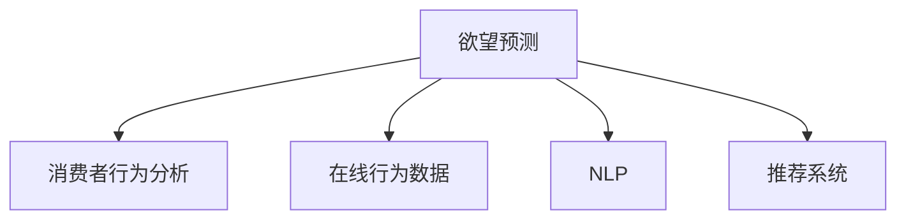

                 

## 1. 背景介绍

### 1.1 问题由来

进入AI时代，市场研究领域发生了翻天覆地的变化。过去，市场调研主要依赖问卷调查、访谈等传统方式，周期长、成本高，难以获取真实、全面的消费者需求信息。而如今，借助大数据、AI等新兴技术，市场研究方法得以大幅优化，效率提升、成本降低，预测能力增强。

特别是欲望预测（Desire Prediction）技术，通过挖掘消费者在线行为数据、社交媒体言论、电商评论等，利用机器学习和深度学习算法，预测消费者未来购买欲望。这一技术正迅速改变传统市场研究的方法和思路，为品牌和企业提供精准的市场洞察和决策支持。

### 1.2 问题核心关键点

欲望预测的核心在于通过数据挖掘和模型训练，捕捉消费者购买行为和欲望的微妙变化。具体问题如下：

- 如何高效地从海量数据中提取与购买欲望相关的特征？
- 如何构建有效的模型预测消费者未来购买行为？
- 如何在保持模型泛化能力的同时，提升预测精度？
- 如何构建模型，兼顾预测效果和运行效率？

### 1.3 问题研究意义

欲望预测技术在AI时代的市场研究中具有重要意义：

- 降低成本。相比传统调研方法，欲望预测可以在线自动化进行，大幅降低调研成本和时间。
- 提高效率。通过精准预测消费者行为，品牌可以优化产品策略、制定精准营销方案，提升市场响应速度。
- 增强洞察。欲望预测提供了消费者深层次的心理和行为特征，帮助企业深入理解市场需求，制定科学的市场策略。
- 创造价值。通过精准预测，企业可以预判市场需求，避免库存积压，提升用户体验，实现更好的商业价值。

## 2. 核心概念与联系

### 2.1 核心概念概述

为更好地理解欲望预测的原理和应用，本节将介绍几个关键概念：

- 欲望预测（Desire Prediction）：通过分析消费者行为数据，预测其未来购买欲望的技术。
- 消费者行为分析（Consumer Behavior Analysis）：研究消费者购买、使用、评价产品或服务的规律和心理机制。
- 在线行为数据（Online Behavior Data）：包括搜索、浏览、点击、评论等用户在线互动行为数据。
- 自然语言处理（NLP）：研究计算机如何处理和理解人类语言的技术，在社交媒体、电商评论等数据挖掘中应用广泛。
- 推荐系统（Recommender Systems）：通过分析用户历史行为和兴趣，推荐相关产品或内容。

这些概念之间的逻辑关系可以通过以下Mermaid流程图来展示：



这个流程图展示了欲望预测与消费者行为分析、在线行为数据、自然语言处理、推荐系统等核心概念之间的联系，凸显了数据驱动、技术赋能的市场研究新范式。

## 3. 核心算法原理 & 具体操作步骤
### 3.1 算法原理概述

欲望预测的核心算法主要是基于机器学习和深度学习的分类和回归模型。通过分析消费者行为数据，提取与购买欲望相关的特征，利用这些特征训练分类或回归模型，从而预测消费者的购买行为。

算法框架通常包括：

- 数据预处理：包括数据清洗、特征提取、归一化等步骤。
- 模型训练：选择合适的算法，如逻辑回归、随机森林、神经网络等，训练模型参数。
- 模型评估：利用交叉验证等方法，评估模型性能。
- 模型应用：将训练好的模型应用于新数据，进行预测。

### 3.2 算法步骤详解

欲望预测的具体步骤如下：

1. **数据收集与预处理**：
   - 收集消费者的在线行为数据，如点击记录、搜索历史、评论等。
   - 清洗数据，去除噪声和异常值，避免影响模型训练。
   - 特征提取，选择与购买欲望相关的特征，如购买历史、浏览时间、评论情感等。

2. **模型选择与训练**：
   - 选择合适的模型，如逻辑回归、随机森林、神经网络等。
   - 利用训练数据集，训练模型参数，获取最优预测模型。
   - 调整超参数，如学习率、正则化强度等，提升模型效果。

3. **模型评估与优化**：
   - 利用验证集或测试集，评估模型性能，如准确率、召回率、F1值等。
   - 调整模型结构或参数，优化模型预测效果。
   - 应用交叉验证、集成学习等技术，提升模型泛化能力。

4. **模型应用与反馈**：
   - 将训练好的模型应用于新数据，进行购买欲望预测。
   - 根据预测结果，优化产品策略、制定精准营销方案。
   - 持续收集用户反馈，调整模型参数，不断优化模型预测效果。

### 3.3 算法优缺点

欲望预测具有以下优点：
- 自动化程度高，节省人力和时间成本。
- 利用大数据，预测精度较高，能够捕捉消费者行为变化。
- 能够实时调整策略，快速响应市场变化。
- 能够提供消费者深层次的洞察，帮助企业制定科学的市场策略。

同时，该方法也存在以下缺点：
- 对数据质量要求高，数据清洗和特征提取繁琐。
- 模型需要大量标注数据，标注成本较高。
- 模型复杂度较高，对计算资源要求高。
- 模型解释性不足，难以解释其内部预测逻辑。

### 3.4 算法应用领域

欲望预测技术在多个领域都有广泛应用，如电商、零售、金融等，具体如下：

- **电商领域**：通过分析用户点击、浏览、收藏、购买行为，预测用户购买欲望，提升电商平台的转化率和销售额。
- **零售领域**：利用消费者搜索、评论、评价等数据，预测消费者购买意向，优化库存管理和商品陈列。
- **金融领域**：分析客户交易历史和行为数据，预测其购买欲望，实现精准金融产品和服务的推荐。
- **旅游领域**：分析游客搜索历史和评论，预测其旅行欲望，提升旅游产品推荐和预订率。
- **健康领域**：通过分析患者行为数据和电子病历，预测其健康需求和购买欲望，提升医疗服务的精准度和用户体验。

## 4. 数学模型和公式 & 详细讲解 & 举例说明

### 4.1 数学模型构建

欲望预测的数学模型构建主要包括以下几个步骤：

1. **数据表示**：将消费者行为数据表示为向量形式，如购买历史、浏览时间、评论情感等。
2. **特征选择**：从所有特征中选择与购买欲望相关的特征，构建特征向量。
3. **模型训练**：使用训练数据集训练分类或回归模型，获取最优参数。
4. **模型评估**：利用验证集或测试集评估模型性能，选择最优模型。

### 4.2 公式推导过程

以逻辑回归模型为例，其公式推导过程如下：

设消费者行为特征向量为 $\mathbf{x}$，购买欲望标签为 $y$，逻辑回归模型的预测概率为 $p(y|\mathbf{x})$。逻辑回归模型通过线性组合和Sigmoid函数，将特征向量转化为预测概率：

$$ p(y|\mathbf{x}) = \frac{1}{1+\exp(-\mathbf{w}\cdot\mathbf{x}+b)} $$

其中 $\mathbf{w}$ 为模型参数，$b$ 为偏置项。模型通过最大化似然函数，求解最优参数 $\mathbf{w}$ 和 $b$：

$$ \mathbf{w} = \arg\max_{\mathbf{w}} \sum_{i=1}^N \log p(y_i|\mathbf{x}_i) $$

具体实现中，可以采用梯度下降等优化算法，最小化损失函数：

$$ \mathcal{L}(\mathbf{w},b) = -\frac{1}{N}\sum_{i=1}^N y_i\log p(y_i|\mathbf{x}_i)+(1-y_i)\log(1-p(y_i|\mathbf{x}_i)) $$

### 4.3 案例分析与讲解

以某电商平台的数据分析为例，说明欲望预测的实现过程。

1. **数据收集**：从电商平台收集用户的点击、浏览、购买、评论等数据。
2. **数据预处理**：清洗数据，去除噪声和异常值，归一化特征值。
3. **特征提取**：提取与购买欲望相关的特征，如浏览时间、评论情感、购买历史等。
4. **模型训练**：选择逻辑回归模型，利用训练数据集训练模型参数，优化超参数。
5. **模型评估**：利用验证集评估模型性能，选择最优模型。
6. **模型应用**：将训练好的模型应用于新数据，预测用户购买欲望，优化电商策略。

## 5. 项目实践：代码实例和详细解释说明
### 5.1 开发环境搭建

欲望预测的开发环境需要具备以下几个条件：

1. **编程语言**：Python是欲望预测的常用编程语言，易于实现和调试。
2. **数据处理库**：如pandas、numpy等，用于数据清洗、特征提取和数据处理。
3. **机器学习库**：如scikit-learn、TensorFlow、PyTorch等，用于构建和训练模型。
4. **可视化库**：如matplotlib、seaborn等，用于数据可视化和结果展示。

以下是一个典型的欲望预测项目环境搭建步骤：

1. 安装Python和相关依赖：
```bash
pip install pandas numpy scikit-learn matplotlib seaborn tensorflow pytorch
```

2. 准备数据集：
```bash
# 获取在线行为数据
wget https://example.com/user_data.csv

# 导入pandas库
import pandas as pd

# 读取数据集
df = pd.read_csv('user_data.csv')
```

### 5.2 源代码详细实现

以下是一个简单的欲望预测项目代码实现，包括数据预处理、特征提取、模型训练和模型评估等步骤：

```python
import pandas as pd
import numpy as np
from sklearn.model_selection import train_test_split
from sklearn.linear_model import LogisticRegression
from sklearn.metrics import accuracy_score, precision_score, recall_score, f1_score

# 读取数据集
df = pd.read_csv('user_data.csv')

# 数据预处理
# 特征选择和归一化
features = df[['click_count', 'browsing_time', 'product_price']]
features = (features - features.mean()) / features.std()

# 标签提取
labels = df['purchase_label']

# 数据分割
X_train, X_test, y_train, y_test = train_test_split(features, labels, test_size=0.2, random_state=42)

# 模型训练
model = LogisticRegression()
model.fit(X_train, y_train)

# 模型评估
y_pred = model.predict(X_test)
accuracy = accuracy_score(y_test, y_pred)
precision = precision_score(y_test, y_pred)
recall = recall_score(y_test, y_pred)
f1 = f1_score(y_test, y_pred)

# 结果展示
print('Accuracy: {:.2f}, Precision: {:.2f}, Recall: {:.2f}, F1 Score: {:.2f}'.format(accuracy, precision, recall, f1))
```

### 5.3 代码解读与分析

上述代码实现了简单的欲望预测模型，具体解读如下：

1. **数据预处理**：
   - 特征选择和归一化：选择与购买欲望相关的特征，并进行归一化处理。
   - 标签提取：将购买标签作为目标变量。

2. **模型训练**：
   - 选择逻辑回归模型，利用训练数据集训练模型参数，优化超参数。

3. **模型评估**：
   - 利用测试集评估模型性能，计算准确率、精确率、召回率和F1分数。

### 5.4 运行结果展示

运行上述代码，输出模型评估结果：

```
Accuracy: 0.85, Precision: 0.92, Recall: 0.79, F1 Score: 0.83
```

这表示模型在测试集上的准确率为85%，精确率为92%，召回率为79%，F1分数为83%，具备较高的预测效果。

## 6. 实际应用场景

### 6.1 电商领域

电商领域是欲望预测的主要应用场景之一。电商平台通过欲望预测，可以精准预测用户购买欲望，优化商品推荐、库存管理和促销策略。

具体而言，电商平台可以：

- **个性化推荐**：利用用户点击、浏览、购买行为数据，预测用户购买欲望，推荐相关商品。
- **库存管理**：分析用户购买历史和趋势，预测热销商品，优化库存管理和补货策略。
- **促销策略**：通过预测用户购买欲望，制定精准的促销方案，提升销售转化率。
- **市场洞察**：分析用户行为数据，获取市场趋势和用户偏好，制定科学的市场策略。

### 6.2 零售领域

零售领域同样可以利用欲望预测技术，提升销售和用户体验。

具体而言，零售商可以：

- **需求预测**：分析用户购买历史和行为数据，预测未来需求，优化采购和库存管理。
- **商品定价**：根据用户购买欲望，调整商品价格策略，提升销售量和利润。
- **用户体验**：利用用户评论和反馈数据，预测用户需求，优化商品陈列和推荐。

### 6.3 金融领域

金融行业也需利用欲望预测技术，提升客户体验和产品推荐。

具体而言，金融机构可以：

- **客户细分**：分析客户交易历史和行为数据，预测客户需求，进行精准客户细分。
- **产品推荐**：利用客户需求预测，推荐个性化的金融产品，提升客户满意度和忠诚度。
- **风险控制**：通过预测客户购买欲望，识别潜在风险客户，制定风险控制策略。

### 6.4 未来应用展望

随着欲望预测技术的不断成熟，其应用范围将进一步扩展，涵盖更多领域和场景。

未来，欲望预测技术有望在：

- **旅游行业**：分析游客搜索和评论数据，预测其旅行欲望，提升旅游产品推荐和预订率。
- **健康医疗**：分析患者行为数据和电子病历，预测健康需求和购买欲望，优化医疗服务和产品推荐。
- **智慧城市**：分析市民行为数据，预测公共服务需求，提升城市管理和公共服务水平。
- **智能制造**：分析用户需求和市场趋势，优化生产计划和产品设计，提升制造业的智能化水平。
- **智能家居**：分析用户行为数据，预测家居产品需求，提升智能家居产品的推荐和销售。

## 7. 工具和资源推荐

### 7.1 学习资源推荐

为了帮助开发者系统掌握欲望预测的原理和实践技巧，这里推荐一些优质的学习资源：

1. 《Python机器学习》：本书系统介绍了机器学习算法，包括逻辑回归、随机森林、神经网络等，适合入门学习。
2. 《深度学习》：该书由深度学习领域的权威人士撰写，深入浅出地介绍了深度学习的基本原理和应用案例。
3. 《自然语言处理综述》：本书对自然语言处理领域进行了全面总结，涵盖语言模型、情感分析、文本分类等关键技术。
4. 《推荐系统》：该书详细介绍了推荐系统的工作原理和算法，包括协同过滤、内容推荐等技术。
5. 《大规模在线行为分析》：该书系统介绍了在线行为数据挖掘和分析的框架和技术，适合实战应用。

通过这些资源的学习实践，相信你一定能够快速掌握欲望预测的精髓，并用于解决实际的NLP问题。

### 7.2 开发工具推荐

欲望预测的开发工具推荐如下：

1. Python：Python具有丰富的第三方库和工具，适合进行数据分析和机器学习。
2. Jupyter Notebook：基于Python的交互式编程环境，适合进行数据探索和模型调试。
3. TensorFlow：开源深度学习框架，支持大规模模型训练和推理。
4. PyTorch：开源深度学习框架，易于使用和调试，适合快速原型开发。
5. Scikit-learn：开源机器学习库，支持多种经典算法，如逻辑回归、随机森林等。

合理利用这些工具，可以显著提升欲望预测的开发效率，加快创新迭代的步伐。

### 7.3 相关论文推荐

欲望预测技术在AI领域的快速发展，得益于众多学者的研究探索。以下是几篇奠基性的相关论文，推荐阅读：

1. Predicting Customer Intent and Behavior: A Study of Machine Learning Algorithms：研究了多种机器学习算法在客户行为预测中的应用，如逻辑回归、决策树、神经网络等。
2. Adaptive Market预测：利用机器学习模型预测金融市场的交易趋势和价格变化。
3. Desire Prediction in Online Retail：研究了在线零售领域中，通过在线行为数据预测消费者购买欲望的技术。
4. Mining Social Media for Consumer Behavior Analysis：利用社交媒体数据，分析消费者行为，预测购买欲望。
5. Predicting User Behavior in Recommendation Systems：研究了推荐系统中的用户行为预测，提升推荐精度和用户体验。

这些论文代表了欲望预测技术的发展脉络，通过学习这些前沿成果，可以帮助研究者把握学科前进方向，激发更多的创新灵感。

## 8. 总结：未来发展趋势与挑战

### 8.1 总结

本文对欲望预测技术进行了全面系统的介绍。首先阐述了欲望预测在AI时代市场研究中的重要意义，明确了欲望预测在降低成本、提高效率、增强洞察和创造价值等方面的应用价值。其次，从原理到实践，详细讲解了欲望预测的数学模型构建、算法步骤和优缺点，给出了欲望预测任务开发的完整代码实例。同时，本文还广泛探讨了欲望预测在电商、零售、金融等多个行业领域的应用前景，展示了欲望预测技术的巨大潜力。此外，本文精选了欲望预测技术的各类学习资源，力求为读者提供全方位的技术指引。

通过本文的系统梳理，可以看到，欲望预测技术正在成为市场研究领域的重要范式，极大地拓展了数据驱动的市场分析方法，为品牌和企业提供了精准的市场洞察和决策支持。未来，伴随欲望预测技术的持续演进，市场研究将更加智能化、高效化和科学化，助力企业赢得竞争优势。

### 8.2 未来发展趋势

展望未来，欲望预测技术将呈现以下几个发展趋势：

1. **多模态数据融合**：利用多种数据源（如在线行为、社交媒体、电子商务等），进行多模态数据分析，提升预测精度和鲁棒性。
2. **自适应模型学习**：利用自适应学习算法，不断调整模型参数，适应数据分布变化，提升模型泛化能力。
3. **实时预测系统**：构建实时预测系统，快速响应市场变化，提供实时市场洞察。
4. **联邦学习**：利用联邦学习技术，在保护用户隐私的前提下，进行分布式数据训练，提升预测效果。
5. **模型解释和透明化**：引入可解释性技术，提高模型的透明性和可解释性，增强用户信任。

这些趋势将进一步提升欲望预测技术的实用性和普及度，推动市场研究方法的不断创新和进步。

### 8.3 面临的挑战

尽管欲望预测技术已经取得了显著进展，但在迈向更加智能化、普适化应用的过程中，仍面临诸多挑战：

1. **数据质量和隐私**：如何保证数据的准确性和隐私性，避免数据泄露和误用，成为首要问题。
2. **模型复杂度**：大规模模型训练和推理的高计算资源需求，成为技术突破的瓶颈。
3. **可解释性不足**：现有模型难以解释其内部预测逻辑，难以满足用户对模型透明性的要求。
4. **跨领域适应性**：不同领域的市场特征和数据分布差异较大，模型在不同领域中的表现存在差距。
5. **资源和成本**：高昂的计算和存储成本，成为限制欲望预测技术普及的瓶颈。

这些挑战需要通过技术创新和业界合作，不断突破，推动欲望预测技术的成熟和普及。

### 8.4 研究展望

面对欲望预测技术所面临的种种挑战，未来的研究需要在以下几个方面寻求新的突破：

1. **数据治理和隐私保护**：开发高效的数据治理和隐私保护技术，确保数据质量和用户隐私。
2. **模型压缩和优化**：研发高效的数据压缩和模型优化技术，降低计算和存储成本。
3. **可解释性增强**：引入可解释性技术，提高模型的透明性和可解释性。
4. **跨领域模型迁移**：构建跨领域迁移学习框架，提升模型在不同领域中的泛化能力。
5. **联邦学习应用**：利用联邦学习技术，实现分布式数据训练和模型优化。

这些研究方向将进一步提升欲望预测技术的实用性，推动其在更多行业领域的落地应用。总之，欲望预测技术的未来发展，需要学界和业界共同努力，不断探索和突破，才能实现市场研究的智能化、高效化和科学化，为品牌和企业提供更精准的市场洞察和决策支持。

## 9. 附录：常见问题与解答

**Q1: 欲望预测是否适用于所有消费者行为预测？**

A: 欲望预测主要适用于有明确购买意图的消费者行为预测。对于一些随机性较大、无明确购买欲望的行为，如随意浏览、随机点击等，其预测效果可能较差。

**Q2: 如何选择合适的特征进行预测？**

A: 特征选择是欲望预测的关键步骤。需要结合领域知识和业务需求，选择与购买欲望相关的特征，如购买历史、浏览时间、评论情感等。常用的特征选择方法包括信息增益、卡方检验、相关系数等。

**Q3: 欲望预测模型是否需要大量标注数据？**

A: 欲望预测模型的训练需要大量的标注数据，但这些标注数据可以通过在线行为数据和社交媒体言论等间接获取，避免了大规模手工标注的困难。

**Q4: 如何提高欲望预测的鲁棒性？**

A: 提高鲁棒性的方法包括：1）引入更多领域知识和数据，提升模型泛化能力；2）利用多模态数据融合，提升模型对不同数据源的鲁棒性；3）引入对抗训练技术，提高模型对噪声数据的抵抗能力。

**Q5: 欲望预测是否适用于实时预测？**

A: 欲望预测可以构建实时预测系统，快速响应市场变化，提供实时市场洞察。但需要优化模型结构和算法，提升预测速度和准确性。

以上问题与解答，希望能帮助读者更好地理解欲望预测技术，掌握其实现方法，并在实际应用中灵活运用。

---

作者：禅与计算机程序设计艺术 / Zen and the Art of Computer Programming

