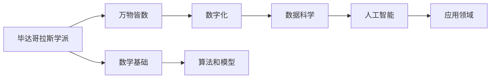

                 

# 毕达哥拉斯学派的“万物皆数”与数字化时代

## 1. 背景介绍

在数字化时代，数据成为了新一代的生产力。数据的规模和复杂度在爆炸性增长，如何在海量数据中提取有用信息，成为各大企业和研究机构面临的重大挑战。与此同时，人工智能（AI）技术正在不断成熟，其背后核心的数学模型和方法，对于理解数字化时代有着重要的启示。本文将从古希腊数学哲学的基础出发，探讨毕达哥拉斯学派“万物皆数”的观念，结合当前数字化时代的特点，揭示数字化与人工智能之间的内在联系。

## 2. 核心概念与联系

### 2.1 核心概念概述

- **毕达哥拉斯学派**：古希腊数学哲学学派，以“万物皆数”为核心思想，认为数学是宇宙的根本规律。
- **数字化时代**：通过信息技术和通信技术，将现实世界的数据进行数字化，实现信息的高效存储和处理。
- **人工智能**：利用计算机算法模拟人类的智能行为，包括感知、认知和决策等方面。
- **数学模型**：数学语言表达的模型，用于描述和解决实际问题，广泛应用于科学研究和工程实践。

### 2.2 核心概念原理和架构的 Mermaid 流程图



这个流程图展示了毕达哥拉斯学派的思想，如何通过数学模型和算法，贯穿于数字化时代的人工智能应用领域。

## 3. 核心算法原理 & 具体操作步骤

### 3.1 算法原理概述

毕达哥拉斯学派的“万物皆数”思想，强调了数学作为宇宙本源的角色。在数字化时代，这一思想转化为数据科学和人工智能的基础。数学模型通过数据科学的方法，将现实世界的数据转化为算法可以理解和处理的信息，从而实现人工智能的各项功能。

### 3.2 算法步骤详解

1. **数据采集与处理**：收集现实世界的数据，通过清洗、标准化等方法，处理成模型可以接受的格式。

2. **特征工程**：通过数学模型和算法，从原始数据中提取有用特征，生成特征向量。

3. **模型训练**：利用机器学习算法，对特征向量进行训练，生成模型参数。

4. **模型评估与优化**：对训练好的模型进行评估，根据性能指标进行优化，保证模型的泛化能力。

5. **模型部署与维护**：将模型部署到生产环境中，进行实时推理，并根据反馈数据，不断优化模型。

### 3.3 算法优缺点

**优点**：
- **数据驱动**：利用数据驱动的方法，可以准确反映现实世界的规律，提高模型的泛化能力。
- **高效计算**：基于数学模型的算法，可以通过计算机高效计算，实现大规模数据处理。

**缺点**：
- **数据质量要求高**：模型效果依赖于数据质量，存在数据偏差等问题。
- **模型复杂度高**：复杂的数学模型，需要大量计算资源和数据，难以进行快速迭代。

### 3.4 算法应用领域

- **金融分析**：利用数学模型，进行风险评估、投资策略优化等。
- **医疗诊断**：通过数据科学和人工智能，实现疾病的早期诊断和个性化治疗。
- **物流管理**：优化货物运输路径和仓储管理，提高物流效率。
- **智能制造**：实现生产线的自动化和智能化，提高生产效率和产品质量。

## 4. 数学模型和公式 & 详细讲解 & 举例说明

### 4.1 数学模型构建

数字化时代的数学模型，通常基于线性回归、逻辑回归、支持向量机、深度学习等算法。这里以线性回归为例，展示其构建和求解过程。

### 4.2 公式推导过程

线性回归模型可以表示为：
$$
y = \theta_0 + \theta_1x_1 + \theta_2x_2 + ... + \theta_nx_n + \epsilon
$$

其中，$y$ 为预测值，$\theta_0, \theta_1, ..., \theta_n$ 为模型参数，$x_1, x_2, ..., x_n$ 为输入特征，$\epsilon$ 为误差项。

最小二乘法求解线性回归模型的最优参数，可以通过矩阵求解的方式实现。具体步骤如下：

1. **矩阵表示**：将输入特征和误差项组成矩阵 $\mathbf{X}$ 和 $\mathbf{y}$。

2. **求解参数**：
$$
\theta = (\mathbf{X}^T\mathbf{X})^{-1}\mathbf{X}^T\mathbf{y}
$$

### 4.3 案例分析与讲解

假设我们要预测房价，利用线性回归模型。收集历史房价数据和相关特征（如房屋面积、地理位置等），构建训练集。利用公式推导过程，求解模型参数，并对新数据进行预测。

## 5. 项目实践：代码实例和详细解释说明

### 5.1 开发环境搭建

为了进行线性回归模型的实践，需要安装Python的NumPy和SciPy库，以及TensorFlow或PyTorch等深度学习框架。

```python
pip install numpy scipy tensorflow
```

### 5.2 源代码详细实现

以下是一个简单的Python代码，实现线性回归模型的训练和预测。

```python
import numpy as np
from sklearn.linear_model import LinearRegression

# 假设数据集为 y = 2x + 3 + N(0,1) 分布
x = np.array([1, 2, 3, 4, 5])
y = np.array([5, 7, 9, 11, 13])

# 构造训练集
X_train = x.reshape(-1, 1)
y_train = y.reshape(-1, 1)

# 构造模型
model = LinearRegression()

# 训练模型
model.fit(X_train, y_train)

# 预测新数据
x_new = np.array([6]).reshape(-1, 1)
y_new = model.predict(x_new)

print(f"模型参数：{model.coef_}")
print(f"预测值：{y_new}")
```

### 5.3 代码解读与分析

以上代码展示了线性回归模型的实现步骤：
- 数据准备：生成训练集。
- 模型训练：使用sklearn库的LinearRegression类，训练模型。
- 模型预测：使用训练好的模型，对新数据进行预测。

## 6. 实际应用场景

### 6.1 金融分析

在金融领域，通过线性回归等数学模型，可以进行股票价格的预测，风险评估等。例如，利用历史交易数据和相关指标，建立股票价格预测模型，提供投资建议。

### 6.2 医疗诊断

在医疗领域，线性回归等数学模型可以用于疾病的预测和诊断。例如，利用患者的历史病历数据和相关特征，建立疾病预测模型，辅助医生进行早期诊断和治疗方案选择。

### 6.3 物流管理

在物流领域，线性回归等数学模型可以用于路线优化和仓储管理。例如，利用货物运输的地理位置和时间数据，建立路径规划模型，提高物流效率。

### 6.4 智能制造

在智能制造领域，线性回归等数学模型可以用于生产线的优化。例如，利用设备运行数据和生产参数，建立生产效率预测模型，优化生产流程。

## 7. 工具和资源推荐

### 7.1 学习资源推荐

- **《Python数据科学手册》**：涵盖Python在数据科学中的应用，包括数据处理、可视化、机器学习等方面。
- **《深度学习》课程**：斯坦福大学吴恩达教授的深度学习课程，涵盖深度学习的基础理论和实践技巧。
- **Kaggle平台**：提供大量数据集和竞赛，可以锻炼数据科学和机器学习的实战能力。

### 7.2 开发工具推荐

- **Jupyter Notebook**：用于编写和运行Python代码，支持数据可视化。
- **Scikit-Learn**：提供各种机器学习算法和工具，方便模型开发和调试。
- **TensorFlow**：Google开发的深度学习框架，支持多种模型和算法。

### 7.3 相关论文推荐

- **《Python数据科学手册》**：Fluent Python, O'Reilly Media, Inc., 2016年。
- **《深度学习》课程**：Deep Learning Specialization, Coursera, 2017年。
- **Kaggle平台**：Kaggle, https://www.kaggle.com/。

## 8. 总结：未来发展趋势与挑战

### 8.1 研究成果总结

数字化时代和人工智能技术的融合，正在改变社会的方方面面。数学模型和算法，作为这一变革的核心，将继续发挥重要作用。

### 8.2 未来发展趋势

未来，数字化和人工智能将继续融合，推动更广泛的创新应用。例如，结合物联网技术，实现智能家居、智慧城市等领域的应用。此外，机器学习算法的自适应能力，将使人工智能系统更加智能和自适应。

### 8.3 面临的挑战

虽然数字化和人工智能技术发展迅速，但仍面临诸多挑战。例如，数据隐私和安全问题，模型解释性和可控性问题等。需要进一步完善相关技术和管理机制，推动技术健康发展。

### 8.4 研究展望

未来的研究，将继续探索数学模型和算法在人工智能中的应用，推动更多创新应用的出现。例如，基于量子计算的量子机器学习算法，将为未来带来新的突破。

## 9. 附录：常见问题与解答

**Q1：如何理解“万物皆数”的观念？**

A: 毕达哥拉斯学派的“万物皆数”思想，认为数学是宇宙的根本规律，所有事物都可以用数学来描述和解释。在数字化时代，这一思想转化为数据科学和人工智能的基础，通过数学模型和算法，实现对现实世界的理解和建模。

**Q2：什么是特征工程？**

A: 特征工程是数据科学中的一个重要步骤，通过数学模型和算法，从原始数据中提取有用特征，生成特征向量，用于模型的训练和预测。特征工程的效果，直接影响到模型的性能和泛化能力。

**Q3：深度学习算法和传统机器学习算法的区别？**

A: 深度学习算法和传统机器学习算法的主要区别在于，深度学习算法利用多层次的非线性变换，可以自动学习复杂的特征，适用于处理高维、大规模数据。而传统机器学习算法需要手动选择和设计特征，适用于数据规模较小、结构较为简单的问题。

**Q4：如何提高模型的泛化能力？**

A: 提高模型泛化能力的方法包括：
- 数据增强：通过扩充训练数据，增强模型的鲁棒性。
- 正则化：通过L1、L2正则化等方法，避免过拟合。
- 交叉验证：通过交叉验证，评估模型在不同数据集上的性能。
- 模型集成：通过多个模型的集成，提高模型的泛化能力。

**Q5：如何解释模型输出结果？**

A: 模型输出结果的解释，需要基于模型结构和训练数据进行分析。通常可以通过特征重要性、模型参数等方法，理解模型的决策逻辑。此外，可视化工具如TensorBoard等，也可以帮助理解模型的内部工作机制。

---

作者：禅与计算机程序设计艺术 / Zen and the Art of Computer Programming

