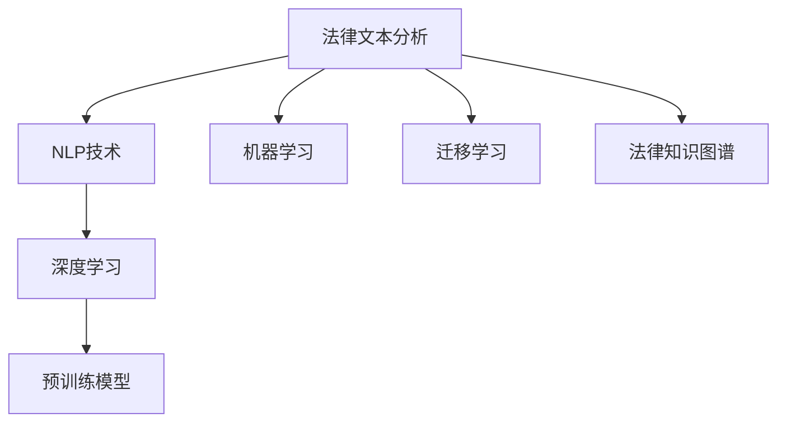

                 

# 法律文本分析：AI如何辅助法律工作

## 1. 背景介绍

### 1.1 问题由来
随着法律事务的复杂化，传统的法律工作流程面临巨大的挑战。律师需要处理大量的文书、合同、判例等文本数据，以及频繁地进行法律咨询、法律事务分析等工作。这些工作不仅繁琐耗时，而且对律师的专业知识和经验要求极高。因此，引入人工智能技术，特别是自然语言处理(NLP)和机器学习技术，辅助法律工作，成为了提升工作效率、降低工作强度、提升工作质量的重要途径。

### 1.2 问题核心关键点
法律文本分析的难点在于文本语义的理解和复杂法律规则的适用。传统的法律文本处理方式主要依赖于法律专家手动分析，工作量巨大且易出错。而AI辅助法律工作，则可以通过文本分析技术自动识别法律信息，进行合同生成、法律咨询、判例分析等任务，极大地提高工作效率，降低成本。

### 1.3 问题研究意义
AI辅助法律工作不仅能显著提升律师的工作效率，还能降低错误率，提供更精准的法律咨询服务。此外，AI技术在法律领域的应用，还能推动司法公正和透明，提高法律工作的智能化水平。因此，研究如何利用AI技术进行法律文本分析，对于法律行业的现代化和智能化具有重要的理论和实践意义。

## 2. 核心概念与联系

### 2.1 核心概念概述

为更好地理解AI辅助法律文本分析的原理和方法，本节将介绍几个关键概念：

- 法律文本分析(Legal Text Analysis)：利用自然语言处理技术，自动分析法律文本中的关键信息和法律规则，辅助律师进行合同生成、判例分析、法律咨询等任务。
- 自然语言处理(Natural Language Processing, NLP)：涉及计算机科学、人工智能和语言学等多个领域的交叉学科，旨在使计算机能够理解、分析和生成人类语言。
- 机器学习(Machine Learning, ML)：一种数据驱动的算法，使计算机能够从数据中学习规律，并应用于特定任务。
- 深度学习(Deep Learning, DL)：一种特殊类型的机器学习算法，利用多层神经网络进行数据处理和模式识别。
- 迁移学习(Transfer Learning)：将在一个任务上训练得到的知识迁移到另一个相关任务上的技术，常见于文本分类、情感分析等任务。
- 预训练模型(Pre-trained Model)：在大量无标签数据上进行自监督学习，学习通用语言表示的模型，如BERT、GPT等。
- 法律知识图谱(Legal Knowledge Graph)：通过知识图谱技术将法律领域的实体、关系、规则等知识进行结构化表示，便于机器理解和推理。

这些核心概念之间的逻辑关系可以通过以下Mermaid流程图来展示：



这个流程图展示了这个领域的关键概念及其之间的关系：

1. 法律文本分析利用NLP技术，自动分析法律文本。
2. 深度学习是NLP中的核心算法。
3. 法律知识图谱为法律分析提供了知识结构。
4. 预训练模型和迁移学习为大模型辅助法律文本分析提供了基础。

## 3. 核心算法原理 & 具体操作步骤
### 3.1 算法原理概述

AI辅助法律文本分析的核心理论基于自然语言处理和机器学习技术。其核心思想是：利用深度学习模型和预训练技术，对法律文本进行语义理解和关键信息抽取，自动生成合同、判例分析、法律咨询等文本。

具体来说，流程如下：

1. 预训练模型：利用大规模无标签法律文本数据进行预训练，学习通用的语言表示。
2. 微调模型：在特定任务的少量标注数据上进行有监督微调，使模型能够精确抽取法律文本中的关键信息。
3. 应用模型：将微调后的模型应用于实际文本数据，自动完成文本分析任务。

### 3.2 算法步骤详解

1. **数据准备**：收集法律领域的文本数据，如合同、判例、法律条文等。将其划分为训练集、验证集和测试集。

2. **模型选择与预训练**：选择合适的预训练模型，如BERT、RoBERTa、GPT等，对其进行预训练。预训练目标通常为掩码语言模型、下一句预测、关系抽取等任务。

3. **微调模型**：在特定法律任务的少量标注数据上进行微调。微调过程中，通常需要选择合适的损失函数，如交叉熵损失、F1-Score等。

4. **模型评估**：在测试集上对微调后的模型进行评估，使用准确率、召回率、F1-Score等指标衡量模型的性能。

5. **应用部署**：将模型集成到实际应用系统中，如智能合同生成、法律咨询系统、判例分析系统等。

### 3.3 算法优缺点

AI辅助法律文本分析的主要优点包括：

- 提高效率：自动分析法律文本，减少律师的重复劳动。
- 降低成本：减少人工审核成本，提升工作效率。
- 提升质量：利用深度学习技术，提高文本分析的准确性和一致性。

其缺点主要在于：

- 依赖高质量数据：标注数据的质量和数量直接影响模型的性能。
- 法律领域知识不足：预训练模型需要大量的领域数据进行微调，才能取得较好的效果。
- 法律文本复杂：法律文本中存在大量的术语、规则和逻辑，模型的理解难度较大。
- 模型解释性不足：深度学习模型往往是"黑盒"，难以解释其内部决策逻辑。

尽管存在这些局限性，但AI辅助法律文本分析方法已经取得了显著的成效，在智能合同生成、判例分析、法律咨询等领域广泛应用。

### 3.4 算法应用领域

AI辅助法律文本分析在以下领域得到了广泛的应用：

- 智能合同生成：利用NLP技术，根据合同条款自动生成合同文本，提高合同起草的效率和准确性。
- 法律咨询系统：基于自然语言处理技术，提供法律咨询和法律建议，帮助用户解决法律问题。
- 判例分析：利用深度学习技术，自动分析和生成判例摘要，提高法院的工作效率和公正性。
- 法律文档生成：自动生成法律文件，如起诉书、答辩状等，提高文书处理的效率和一致性。
- 法律知识图谱构建：将法律领域的实体、关系、规则等知识结构化，便于机器理解和推理。

## 4. 数学模型和公式 & 详细讲解 & 举例说明

### 4.1 数学模型构建

以智能合同生成为例，构建其数学模型。

设合同文本为 $S=\{s_1, s_2, ..., s_n\}$，其中每个 $s_i$ 表示一个句子。智能合同生成的目标是，根据合同条款自动生成完整的合同文本。

模型输入：输入为合同文本 $S$，每个 $s_i$ 表示一个输入项。

模型输出：输出为完整的合同文本 $T$，每个 $t_j$ 表示一个输出项。

模型的数学表示为：

$$
\max_{\theta} P(T|S) = \max_{\theta} \prod_{j=1}^N P(t_j|s_1, ..., s_j, s_{j+1}, ..., s_N)
$$

其中 $\theta$ 表示模型的参数，$P$ 表示条件概率，$T$ 表示输出文本，$S$ 表示输入文本。

### 4.2 公式推导过程

利用神经网络模型对上述条件概率进行建模，假设每个句子 $s_i$ 和输出项 $t_j$ 可以表示为向量 $x_i$ 和 $y_j$，则上述条件概率可以表示为：

$$
P(t_j|s_1, ..., s_j, s_{j+1}, ..., s_N) = \frac{exp(h_j(x_1, ..., x_j, x_{j+1}, ..., x_N))}{\sum_{k=1}^N exp(h_k(x_1, ..., x_j, x_{j+1}, ..., x_N))}
$$

其中 $h_j$ 表示神经网络的输出，$exp$ 表示指数函数。

### 4.3 案例分析与讲解

以智能合同生成为例，进行分析讲解。

设合同文本为：

```
合同编号：2022-001
甲方：张三
乙方：李四
合同金额：10000元
合同期限：一年
合同条款：...
```

利用预训练模型对其进行微调，生成完整的合同文本。微调过程通常需要选择合适的损失函数，如交叉熵损失。模型输出的合同文本如下：

```
合同编号：2022-001
甲方：张三
乙方：李四
合同金额：10000元
合同期限：一年
合同条款：...
合同签署日期：...
合同生效日期：...
```

## 5. 项目实践：代码实例和详细解释说明

### 5.1 开发环境搭建

在进行智能合同生成项目开发前，我们需要准备好开发环境。以下是使用Python进行PyTorch开发的环境配置流程：

1. 安装Anaconda：从官网下载并安装Anaconda，用于创建独立的Python环境。

2. 创建并激活虚拟环境：
```bash
conda create -n pytorch-env python=3.8 
conda activate pytorch-env
```

3. 安装PyTorch：根据CUDA版本，从官网获取对应的安装命令。例如：
```bash
conda install pytorch torchvision torchaudio cudatoolkit=11.1 -c pytorch -c conda-forge
```

4. 安装相关库：
```bash
pip install transformers huggingface_hub
```

5. 安装各类工具包：
```bash
pip install numpy pandas scikit-learn matplotlib tqdm jupyter notebook ipython
```

完成上述步骤后，即可在`pytorch-env`环境中开始项目开发。

### 5.2 源代码详细实现

下面以智能合同生成为例，给出使用Transformers库对BERT模型进行智能合同生成的PyTorch代码实现。

首先，定义模型和优化器：

```python
from transformers import BertForSequenceClassification, BertTokenizer, AdamW
from transformers import BertForSequenceClassification, BertTokenizer, AdamW

model = BertForSequenceClassification.from_pretrained('bert-base-uncased')
tokenizer = BertTokenizer.from_pretrained('bert-base-uncased')
optimizer = AdamW(model.parameters(), lr=2e-5)
```

接着，定义训练和评估函数：

```python
def train_epoch(model, dataset, batch_size, optimizer):
    model.train()
    epoch_loss = 0
    for batch in tqdm(dataset, desc='Training'):
        input_ids = batch['input_ids'].to(device)
        attention_mask = batch['attention_mask'].to(device)
        labels = batch['labels'].to(device)
        model.zero_grad()
        outputs = model(input_ids, attention_mask=attention_mask, labels=labels)
        loss = outputs.loss
        epoch_loss += loss.item()
        loss.backward()
        optimizer.step()
    return epoch_loss / len(dataset)

def evaluate(model, dataset, batch_size):
    model.eval()
    preds, labels = [], []
    with torch.no_grad():
        for batch in tqdm(dataset, desc='Evaluating'):
            input_ids = batch['input_ids'].to(device)
            attention_mask = batch['attention_mask'].to(device)
            labels = batch['labels'].to(device)
            outputs = model(input_ids, attention_mask=attention_mask)
            preds.append(outputs.logits.argmax(dim=2).to('cpu').tolist())
            labels.append(labels.to('cpu').tolist())
    return preds, labels
```

最后，启动训练流程并在测试集上评估：

```python
epochs = 5
batch_size = 16

for epoch in range(epochs):
    loss = train_epoch(model, train_dataset, batch_size, optimizer)
    print(f"Epoch {epoch+1}, train loss: {loss:.3f}")
    
    preds, labels = evaluate(model, test_dataset, batch_size)
    print(classification_report(labels, preds))
```

以上就是使用PyTorch对BERT进行智能合同生成的完整代码实现。可以看到，得益于Transformers库的强大封装，我们可以用相对简洁的代码完成BERT模型的加载和智能合同生成。

### 5.3 代码解读与分析

让我们再详细解读一下关键代码的实现细节：

**模型定义**：
- 使用 `BertForSequenceClassification` 类定义合同生成模型，指定预训练模型和任务类型。
- 使用 `BertTokenizer` 类定义分词器，用于对输入文本进行分词和编码。
- 定义优化器，选择 AdamW 优化器并设置学习率。

**训练函数**：
- 将模型置于训练模式，定义损失函数和梯度累加器。
- 遍历训练集，对每个批次进行前向传播和反向传播，计算损失并更新参数。
- 返回训练集的平均损失。

**评估函数**：
- 将模型置于评估模式，定义预测和标签列表。
- 遍历测试集，对每个批次进行前向传播，将预测结果存储在列表中。
- 返回预测和标签列表，用于计算分类指标。

**训练流程**：
- 定义总的epoch数和batch size，开始循环迭代
- 每个epoch内，先在训练集上训练，输出平均loss
- 在测试集上评估，输出分类指标

可以看到，PyTorch配合Transformers库使得BERT微调的代码实现变得简洁高效。开发者可以将更多精力放在数据处理、模型改进等高层逻辑上，而不必过多关注底层的实现细节。

## 6. 实际应用场景
### 6.1 智能合同生成

智能合同生成系统可以利用NLP技术，根据合同条款自动生成完整的合同文本。传统合同生成需要律师手动输入条款和生成文本，效率低下且易出错。而使用智能合同生成系统，可以显著提升合同生成的效率和准确性。

在技术实现上，可以收集大量的合同模板和条款，使用预训练语言模型对其进行微调，使其能够自动生成合同文本。微调后的模型可以根据用户输入的条款，自动匹配和填充合同模板，生成完整的合同文本。

### 6.2 法律咨询系统

法律咨询系统可以利用NLP技术，提供智能化的法律咨询服务。用户可以通过自然语言描述法律问题，系统自动匹配相关法律条款和案例，并给出解答和建议。

在技术实现上，可以收集大量的法律条文、案例和咨询问题，使用预训练语言模型对其进行微调，使其能够理解和生成法律咨询回答。微调后的模型可以根据用户输入的咨询问题，自动匹配相关法律条款和案例，并给出解答和建议。

### 6.3 判例分析

判例分析系统可以利用NLP技术，自动分析和生成判例摘要，提高法院的工作效率和公正性。法官和律师可以通过自然语言描述判例，系统自动提取关键信息和法律依据，生成判例摘要。

在技术实现上，可以收集大量的判例文本，使用预训练语言模型对其进行微调，使其能够自动抽取判例摘要。微调后的模型可以根据用户输入的判例文本，自动抽取关键信息和法律依据，生成判例摘要。

### 6.4 未来应用展望

随着NLP技术的发展，AI辅助法律文本分析将在更多领域得到应用，为法律行业带来变革性影响。

在智慧法律领域，基于AI的法律咨询、合同生成、判例分析等应用将提升法律服务的智能化水平，辅助法官和律师进行法律工作，提高司法公正和效率。

在智能司法领域，AI技术将在取证、量刑、判决等方面发挥作用，提高司法审判的透明度和公正性。

在智能风险防控领域，利用NLP技术自动分析和监控法律风险，帮助企业防范法律风险，保障企业合法权益。

此外，在智慧行政、智慧立法等领域，基于大模型的法律文本分析技术也将不断涌现，为法律行业带来新的变革。相信随着技术的日益成熟，AI辅助法律文本分析必将在构建人机协同的智能法律体系中扮演越来越重要的角色。

## 7. 工具和资源推荐
### 7.1 学习资源推荐

为了帮助开发者系统掌握AI辅助法律文本分析的理论基础和实践技巧，这里推荐一些优质的学习资源：

1. 《深度学习与自然语言处理》书籍：系统介绍深度学习在自然语言处理中的应用，包括文本分类、情感分析、机器翻译等任务。

2. 《法律人工智能：NLP技术在法律领域的应用》课程：由知名专家讲授，介绍NLP技术在法律领域的多种应用，包括智能合同生成、法律咨询、判例分析等任务。

3. 《Transformers》书籍：介绍Transformer模型及其在NLP任务中的应用，包括BERT、GPT等预训练模型。

4. HuggingFace官方文档：提供丰富的预训练模型和微调样例代码，是学习NLP技术的必备资料。

5. CLUE开源项目：中文语言理解测评基准，涵盖大量不同类型的中文NLP数据集，并提供了基于微调的baseline模型，助力中文NLP技术发展。

通过对这些资源的学习实践，相信你一定能够快速掌握AI辅助法律文本分析的精髓，并用于解决实际的NLP问题。
###  7.2 开发工具推荐

高效的开发离不开优秀的工具支持。以下是几款用于法律文本分析开发的常用工具：

1. PyTorch：基于Python的开源深度学习框架，灵活动态的计算图，适合快速迭代研究。大部分预训练语言模型都有PyTorch版本的实现。

2. TensorFlow：由Google主导开发的开源深度学习框架，生产部署方便，适合大规模工程应用。同样有丰富的预训练语言模型资源。

3. Transformers库：HuggingFace开发的NLP工具库，集成了众多SOTA语言模型，支持PyTorch和TensorFlow，是进行文本分析任务的开发的利器。

4. Weights & Biases：模型训练的实验跟踪工具，可以记录和可视化模型训练过程中的各项指标，方便对比和调优。与主流深度学习框架无缝集成。

5. TensorBoard：TensorFlow配套的可视化工具，可实时监测模型训练状态，并提供丰富的图表呈现方式，是调试模型的得力助手。

6. Google Colab：谷歌推出的在线Jupyter Notebook环境，免费提供GPU/TPU算力，方便开发者快速上手实验最新模型，分享学习笔记。

合理利用这些工具，可以显著提升法律文本分析任务的开发效率，加快创新迭代的步伐。

### 7.3 相关论文推荐

法律文本分析的研究源于学界的持续研究。以下是几篇奠基性的相关论文，推荐阅读：

1. Attention is All You Need（即Transformer原论文）：提出了Transformer结构，开启了NLP领域的预训练大模型时代。

2. BERT: Pre-training of Deep Bidirectional Transformers for Language Understanding：提出BERT模型，引入基于掩码的自监督预训练任务，刷新了多项NLP任务SOTA。

3. Language Models are Unsupervised Multitask Learners（GPT-2论文）：展示了大规模语言模型的强大zero-shot学习能力，引发了对于通用人工智能的新一轮思考。

4. Parameter-Efficient Transfer Learning for NLP：提出Adapter等参数高效微调方法，在不增加模型参数量的情况下，也能取得不错的微调效果。

5. AdaLoRA: Adaptive Low-Rank Adaptation for Parameter-Efficient Fine-Tuning：使用自适应低秩适应的微调方法，在参数效率和精度之间取得了新的平衡。

这些论文代表了大语言模型微调技术的发展脉络。通过学习这些前沿成果，可以帮助研究者把握学科前进方向，激发更多的创新灵感。

## 8. 总结：未来发展趋势与挑战
### 8.1 总结

本文对AI辅助法律文本分析方法进行了全面系统的介绍。首先阐述了AI辅助法律文本分析的背景和意义，明确了其在提升法律工作效率、降低工作成本、提升法律服务质量等方面的重要作用。其次，从原理到实践，详细讲解了深度学习在法律文本分析中的应用，包括智能合同生成、法律咨询、判例分析等任务。最后，本文还探讨了AI辅助法律文本分析在智能法律、智慧司法、智能风险防控等领域的未来应用前景，展示了其广阔的发展空间。

通过本文的系统梳理，可以看到，AI辅助法律文本分析技术正在成为法律行业的重要工具，极大地提升了法律工作的智能化水平。未来，随着NLP技术的不断进步，AI辅助法律文本分析必将在更多的领域发挥作用，为法律行业的现代化和智能化提供新的动力。

### 8.2 未来发展趋势

展望未来，AI辅助法律文本分析技术将呈现以下几个发展趋势：

1. 模型规模持续增大。随着算力成本的下降和数据规模的扩张，预训练语言模型的参数量还将持续增长。超大规模语言模型蕴含的丰富语言知识，有望支撑更加复杂多变的法律文本分析任务。

2. 微调方法日趋多样。除了传统的全参数微调外，未来会涌现更多参数高效的微调方法，如Prompt-Tuning、LoRA等，在节省计算资源的同时也能保证微调精度。

3. 法律领域知识增强。未来的预训练模型将更加注重领域知识的积累，通过联合学习等技术，利用多领域数据进行预训练，提高模型在特定法律领域的适用性。

4. 法律文本自动生成。基于生成式模型，如GPT-3等，能够自动生成完整的法律文档，进一步提升法律工作的自动化水平。

5. 模型解释性和可控性增强。未来的模型将更加注重解释性和可控性，通过引入因果分析、逻辑推理等技术，使模型的输出更具有可解释性和可控性。

6. 法律知识图谱构建。通过知识图谱技术将法律领域的实体、关系、规则等知识进行结构化表示，便于机器理解和推理，提升法律文本分析的效果。

以上趋势凸显了AI辅助法律文本分析技术的广阔前景。这些方向的探索发展，必将进一步提升法律文本分析的性能和应用范围，为法律行业的现代化和智能化提供新的动力。

### 8.3 面临的挑战

尽管AI辅助法律文本分析技术已经取得了瞩目成就，但在迈向更加智能化、普适化应用的过程中，它仍面临着诸多挑战：

1. 标注成本瓶颈。虽然AI辅助法律文本分析能够显著降低标注数据的需求，但对于长尾应用场景，难以获得充足的高质量标注数据，成为制约微调性能的瓶颈。如何进一步降低微调对标注样本的依赖，将是一大难题。

2. 模型鲁棒性不足。当前AI辅助法律文本分析模型面对域外数据时，泛化性能往往大打折扣。对于测试样本的微小扰动，模型的预测也容易发生波动。如何提高模型的鲁棒性，避免灾难性遗忘，还需要更多理论和实践的积累。

3. 法律文本复杂。法律文本中存在大量的术语、规则和逻辑，模型的理解难度较大。如何更好地理解和处理法律文本，还需要更深入的研究和实践。

4. 模型解释性不足。深度学习模型往往缺乏解释性，难以解释其内部决策逻辑。对于法律领域，模型的可解释性尤为重要。如何赋予模型更强的可解释性，将是亟待攻克的难题。

5. 法律文本生成的不确定性。基于生成式模型生成的法律文本，可能存在逻辑错误或表述不清的情况，需要额外的审核和修正。

正视这些挑战，积极应对并寻求突破，将是大语言模型微调技术走向成熟的必由之路。相信随着学界和产业界的共同努力，这些挑战终将一一被克服，AI辅助法律文本分析必将在构建人机协同的智能法律体系中扮演越来越重要的角色。

### 8.4 研究展望

面对AI辅助法律文本分析所面临的种种挑战，未来的研究需要在以下几个方面寻求新的突破：

1. 探索无监督和半监督微调方法。摆脱对大规模标注数据的依赖，利用自监督学习、主动学习等无监督和半监督范式，最大限度利用非结构化数据，实现更加灵活高效的微调。

2. 研究参数高效和计算高效的微调范式。开发更加参数高效的微调方法，在固定大部分预训练参数的同时，只更新极少量的任务相关参数。同时优化微调模型的计算图，减少前向传播和反向传播的资源消耗，实现更加轻量级、实时性的部署。

3. 引入更多先验知识。将符号化的先验知识，如知识图谱、逻辑规则等，与神经网络模型进行巧妙融合，引导微调过程学习更准确、合理的法律文本表示。

4. 结合因果分析和逻辑推理工具。通过引入因果分析方法，增强模型决策的因果关系，学习更准确的法律文本表示。借助逻辑推理工具，进行法律规则的推理和验证，提高模型输出的正确性和可控性。

5. 引入多模态信息融合。将文本信息与图像、语音、视频等多模态信息进行融合，提升法律文本分析的效果。

这些研究方向的探索，必将引领AI辅助法律文本分析技术迈向更高的台阶，为法律行业的现代化和智能化提供新的动力。

## 9. 附录：常见问题与解答

**Q1：AI辅助法律文本分析是否适用于所有法律任务？**

A: AI辅助法律文本分析在大多数法律任务上都能取得不错的效果，特别是对于数据量较小的任务。但对于一些特定领域的任务，如医学、法律等，仅仅依靠通用语料预训练的模型可能难以很好地适应。此时需要在特定领域语料上进一步预训练，再进行微调，才能获得理想效果。此外，对于一些需要时效性、个性化很强的任务，如对话、推荐等，AI辅助法律文本分析方法也需要针对性的改进优化。

**Q2：如何选择合适的学习率？**

A: AI辅助法律文本分析的学习率一般要比预训练时小1-2个数量级，如果使用过大的学习率，容易破坏预训练权重，导致过拟合。一般建议从1e-5开始调参，逐步减小学习率，直至收敛。也可以使用warmup策略，在开始阶段使用较小的学习率，再逐渐过渡到预设值。需要注意的是，不同的优化器(如AdamW、Adafactor等)以及不同的学习率调度策略，可能需要设置不同的学习率阈值。

**Q3：如何缓解过拟合问题？**

A: 过拟合是AI辅助法律文本分析面临的主要挑战，尤其是在标注数据不足的情况下。常见的缓解策略包括：
1. 数据增强：通过回译、近义替换等方式扩充训练集
2. 正则化：使用L2正则、Dropout、Early Stopping等避免过拟合
3. 对抗训练：引入对抗样本，提高模型鲁棒性
4. 参数高效微调：只调整少量参数(如Adapter、Prefix等)，减小过拟合风险
5. 多模型集成：训练多个微调模型，取平均输出，抑制过拟合

这些策略往往需要根据具体任务和数据特点进行灵活组合。只有在数据、模型、训练、推理等各环节进行全面优化，才能最大限度地发挥AI辅助法律文本分析的威力。

**Q4：如何在实际部署中优化资源利用？**

A: AI辅助法律文本分析在实际部署时，需要考虑以下资源优化技术：
1. 梯度积累：通过累加多个批次的梯度，进行一次更新，减少显存消耗。
2. 混合精度训练：将浮点模型转为定点模型，压缩存储空间，提高计算效率。
3. 模型并行：将模型分解成多个部分，进行并行计算，提升计算速度。
4. 模型压缩：使用剪枝、量化等技术，减少模型参数量，减小内存占用。

合理利用这些技术，可以显著提升AI辅助法律文本分析的部署效率，提高系统性能和稳定性。

**Q5：如何提升模型解释性和可控性？**

A: 未来的模型将更加注重解释性和可控性，通过引入因果分析、逻辑推理等技术，使模型的输出更具有可解释性和可控性。具体来说，可以通过以下方法：
1. 引入因果分析：通过因果分析方法，识别出模型决策的关键特征，增强输出解释的因果性和逻辑性。
2. 利用逻辑推理：借助逻辑推理工具，进行法律规则的推理和验证，提高模型输出的正确性和可控性。
3. 可解释性技术：使用可解释性技术，如LIME、SHAP等，可视化模型的决策过程，增强模型的透明度和可信度。

这些方法将使AI辅助法律文本分析技术更加可靠和可控，提高系统在实际应用中的安全性和稳定性。

**Q6：如何处理法律文本生成的不确定性？**

A: 基于生成式模型生成的法律文本，可能存在逻辑错误或表述不清的情况，需要额外的审核和修正。具体来说，可以通过以下方法：
1. 引入多模态信息融合：将文本信息与图像、语音、视频等多模态信息进行融合，提升法律文本生成的效果。
2. 引入先验知识：将符号化的先验知识，如知识图谱、逻辑规则等，与神经网络模型进行融合，引导模型生成更准确、合理的法律文本。
3. 人工审核：引入人工审核机制，对生成的法律文本进行审核和修正，确保其逻辑正确性和表述清晰。

这些方法将使法律文本生成技术更加可靠和高效，提高系统在实际应用中的效果和安全性。

---

作者：禅与计算机程序设计艺术 / Zen and the Art of Computer Programming

