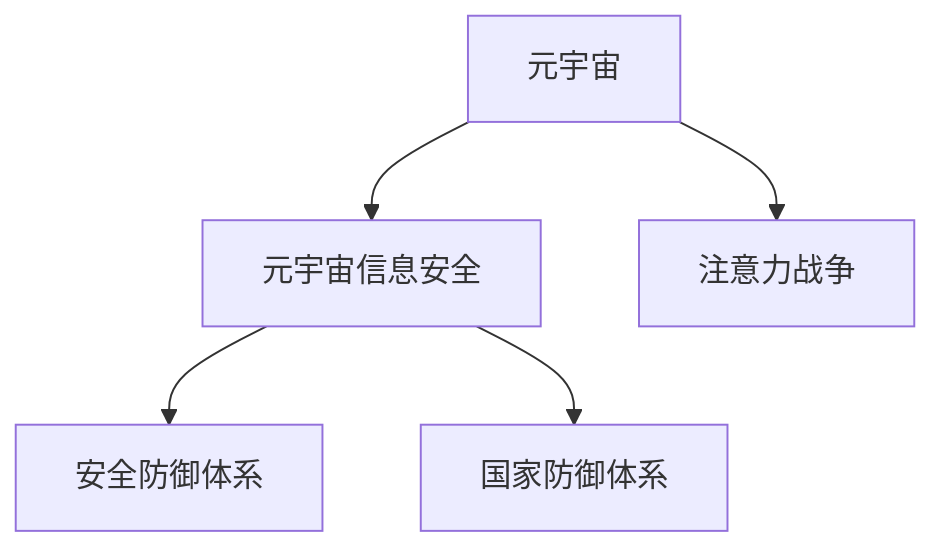

                 

# 注意力战争策略:元宇宙信息安全的国家防御体系

## 1. 背景介绍

随着元宇宙的兴起，信息安全已不仅仅是单个组织或国家的事务，更关乎整个社会的稳定与健康。在元宇宙的虚拟世界中，数据高度集中，信息传输频繁，攻击手法层出不穷，安全威胁日益严峻。

**1.1 元宇宙概述**

元宇宙是虚拟世界与现实世界的融合，它不仅包括游戏、社交等娱乐领域，还包括教育、工作、治理等各个方面。这一新兴领域，有着无限的可能，但同时也带来了新的挑战。

**1.2 信息安全威胁**

在元宇宙中，数据存储、传输、处理的方式和现实世界迥异。这使得传统的信息安全问题，如数据泄露、病毒传播等，在元宇宙中可能被放大数倍。攻击者可以轻易地伪造身份，以假乱真，甚至进行社会工程攻击。

**1.3 元宇宙信息安全的重要性**

元宇宙作为一个高度互联、共享的空间，其信息安全的重要性不言而喻。保障元宇宙信息安全，不仅仅是维护用户的财产安全，更是确保社会秩序稳定、国家安全的重要手段。

## 2. 核心概念与联系

### 2.1 核心概念概述

为更好地理解元宇宙信息安全的国家防御体系，本节将介绍几个核心概念：

- 元宇宙：一个高度集成、互联的虚拟世界，涉及多个领域，如游戏、社交、教育等。
- 元宇宙信息安全：保障元宇宙中数据、应用和用户的安全，防止未经授权的访问和攻击。
- 注意力战争（AI Warfare）：利用人工智能技术进行的攻击，如钓鱼、垃圾信息、深度伪造等。
- 安全防御体系：包括多层次的防御策略，如身份验证、访问控制、数据加密等。
- 国家防御体系：在国家层面，制定元宇宙信息安全的政策法规，建立健全的安全防护框架。

这些核心概念之间的逻辑关系可以通过以下Mermaid流程图来展示：



这个流程图展示了几大核心概念之间的联系：

1. 元宇宙作为一个平台，包含多个应用，因此信息安全问题涉及多个领域。
2. 元宇宙信息安全是保障元宇宙平台稳定运行的基础。
3. 注意力战争是元宇宙中新兴的安全威胁，对信息安全造成巨大挑战。
4. 安全防御体系和国家的防御体系，是应对注意力战争的有效手段。

## 3. 核心算法原理 & 具体操作步骤

### 3.1 算法原理概述

元宇宙信息安全的国家防御体系，本质上是一个多层、多维的安全防御系统。其核心思想是：利用先进的人工智能技术，构建一个多层次、多维度的防御网络，通过身份验证、访问控制、数据加密等手段，有效防范各种攻击。

具体来说，可以分为以下几个关键步骤：

1. **身份验证**：确保用户身份的真实性和可信度，防止恶意用户攻击。
2. **访问控制**：严格控制用户和应用之间的访问权限，确保只有授权用户才能进行操作。
3. **数据加密**：保护数据在存储、传输过程中的机密性，防止数据泄露。
4. **深度学习技术**：利用机器学习算法，实时监控和检测异常行为，提前预警。
5. **安全审计**：定期进行系统安全检查和漏洞扫描，确保系统的安全性和稳定性。

### 3.2 算法步骤详解

以下是元宇宙信息安全国家防御体系的详细步骤：

**Step 1: 身份验证**

身份验证是保障元宇宙信息安全的首要环节。其目的是确认用户身份的真实性和可信度，防止恶意用户攻击。具体实现方法如下：

1. **身份注册**：用户需要通过邮箱、手机号或第三方账号进行注册，注册时需填写真实姓名、身份证号等个人信息。
2. **身份验证**：用户注册完成后，需要通过短信验证码、邮箱验证等方式进行身份验证，确保账号的真实性。
3. **生物特征验证**：采用指纹、面部识别等生物特征进行二次验证，进一步提高安全性。

**Step 2: 访问控制**

访问控制是防止未授权用户访问和操作系统的关键手段。具体实现方法如下：

1. **权限管理**：根据用户角色和权限，设置访问权限，如管理员、普通用户、访客等。
2. **权限认证**：用户在访问系统时，需要输入正确的账号密码，才能进行相关操作。
3. **权限审计**：定期检查系统访问日志，确保权限配置的正确性和安全性。

**Step 3: 数据加密**

数据加密是保障数据在存储、传输过程中机密性的有效手段。具体实现方法如下：

1. **对称加密**：使用相同的密钥对数据进行加密和解密，如AES算法。
2. **非对称加密**：使用公钥和私钥对数据进行加密和解密，如RSA算法。
3. **混合加密**：结合对称加密和非对称加密的优点，提高数据加密的安全性和效率。

**Step 4: 深度学习技术**

深度学习技术是实时监控和检测异常行为的有效手段。具体实现方法如下：

1. **异常检测**：使用深度神经网络模型，对系统行为进行实时监控，检测异常行为。
2. **行为分析**：通过分析用户行为模式，识别出异常操作，如登录异常、数据泄露等。
3. **预警机制**：一旦发现异常行为，立即触发预警机制，提醒管理员进行处理。

**Step 5: 安全审计**

安全审计是定期检查和维护系统安全性的关键手段。具体实现方法如下：

1. **漏洞扫描**：定期对系统进行漏洞扫描，及时发现和修复漏洞。
2. **安全检查**：定期进行系统安全检查，确保系统配置正确。
3. **日志审计**：定期审计系统日志，追踪系统操作，防止内部攻击。

### 3.3 算法优缺点

元宇宙信息安全的国家防御体系具有以下优点：

1. **全面防护**：通过多层次、多维度的防御措施，全面保障元宇宙平台的安全。
2. **高效实时**：利用深度学习技术，实时监控和检测异常行为，提前预警。
3. **自动更新**：通过定期安全检查和漏洞扫描，自动更新系统配置，确保系统安全。

同时，该体系也存在一些局限性：

1. **资源消耗大**：深度学习模型的训练和推理需要大量计算资源，成本较高。
2. **数据依赖强**：异常检测和行为分析需要大量数据进行训练，数据质量和数量直接影响系统的准确性。
3. **安全性仍存隐患**：即使采用了多层次的安全措施，仍然存在被攻击的风险，需要持续监测和改进。

### 3.4 算法应用领域

元宇宙信息安全的国家防御体系，已经在多个领域得到了广泛应用，如游戏、社交、教育等。具体应用场景如下：

**Step 1: 游戏安全**

游戏环境中，玩家数据高度集中，游戏内物品交易频繁，容易成为攻击者的目标。采用元宇宙信息安全的国家防御体系，可以有效防范各种攻击，如账号盗用、钓鱼攻击等。

**Step 2: 社交安全**

社交应用中，用户之间的信息交互频繁，容易发生社交工程攻击。采用元宇宙信息安全的国家防御体系，可以有效保护用户隐私，防止恶意行为。

**Step 3: 教育安全**

在线教育平台中，学生数据和课程内容敏感，容易成为攻击者的目标。采用元宇宙信息安全的国家防御体系，可以有效保护学生数据和课程内容，确保教学质量。

## 4. 数学模型和公式 & 详细讲解 & 举例说明

### 4.1 数学模型构建

在元宇宙信息安全的国家防御体系中，深度学习模型的构建是关键。这里以异常检测模型为例，构建一个基于神经网络模型的异常检测系统。

设异常检测模型为 $M_{\theta}:\mathcal{X} \rightarrow [0,1]$，其中 $\mathcal{X}$ 为输入空间，$\theta$ 为模型参数。

### 4.2 公式推导过程

异常检测模型的目标函数为：

$$
\min_{\theta} \frac{1}{N} \sum_{i=1}^N \ell(y_i, M_{\theta}(x_i))
$$

其中，$y_i$ 为第 $i$ 个样本的标签，$M_{\theta}(x_i)$ 为模型对第 $i$ 个样本的预测结果。

采用二分类交叉熵损失函数，可以表示为：

$$
\ell(y_i, M_{\theta}(x_i)) = -[y_i\log M_{\theta}(x_i) + (1-y_i)\log(1-M_{\theta}(x_i))]
$$

在训练过程中，使用随机梯度下降（SGD）算法更新模型参数 $\theta$，可以得到：

$$
\theta \leftarrow \theta - \eta \nabla_{\theta} \mathcal{L}(\theta)
$$

其中，$\eta$ 为学习率，$\nabla_{\theta} \mathcal{L}(\theta)$ 为损失函数对模型参数的梯度。

### 4.3 案例分析与讲解

以网络钓鱼攻击为例，分析异常检测模型的应用。网络钓鱼攻击通常表现为异常的登录行为，如在非工作时间登录、登录地点异常等。

将用户登录行为作为输入 $x_i$，模型预测结果 $M_{\theta}(x_i)$ 表示登录行为是否异常。当模型预测结果接近1时，表示登录行为异常；当模型预测结果接近0时，表示登录行为正常。

模型训练时，使用正常登录行为的数据作为正样本，使用异常登录行为的数据作为负样本，对模型进行训练。训练过程中，不断调整模型参数 $\theta$，使得模型对正常行为和异常行为的预测结果更加准确。

在实际应用中，可以将模型的预测结果与系统的实时日志进行比对，一旦发现异常行为，立即触发预警机制，提醒管理员进行处理。

## 5. 项目实践：代码实例和详细解释说明

### 5.1 开发环境搭建

在进行元宇宙信息安全的国家防御体系开发前，我们需要准备好开发环境。以下是使用Python进行TensorFlow开发的环境配置流程：

1. 安装Anaconda：从官网下载并安装Anaconda，用于创建独立的Python环境。

2. 创建并激活虚拟环境：
```bash
conda create -n tf-env python=3.8 
conda activate tf-env
```

3. 安装TensorFlow：根据CUDA版本，从官网获取对应的安装命令。例如：
```bash
conda install tensorflow -c conda-forge -c pytorch -c anaconda
```

4. 安装TensorFlow Addons：用于支持TensorFlow的扩展功能，如高级神经网络架构、数据增强等。
```bash
pip install tensorboard -f https://www.tensorflow.org/tensorflow_addons/whl
```

5. 安装各类工具包：
```bash
pip install numpy pandas scikit-learn matplotlib tqdm jupyter notebook ipython
```

完成上述步骤后，即可在`tf-env`环境中开始项目实践。

### 5.2 源代码详细实现

以下是一个简单的异常检测模型实现，使用TensorFlow和Keras库进行搭建。

```python
import tensorflow as tf
from tensorflow.keras.layers import Input, Dense, Activation, Dropout
from tensorflow.keras.models import Model

# 定义模型输入层
input_layer = Input(shape=(100,))

# 添加隐藏层
hidden_layer = Dense(128, activation='relu')(input_layer)
hidden_layer = Dropout(0.5)(hidden_layer)

# 添加输出层
output_layer = Dense(1, activation='sigmoid')(hidden_layer)

# 定义模型
model = Model(inputs=input_layer, outputs=output_layer)

# 编译模型
model.compile(optimizer='adam', loss='binary_crossentropy', metrics=['accuracy'])

# 训练模型
model.fit(x_train, y_train, epochs=10, batch_size=32, validation_data=(x_val, y_val))
```

### 5.3 代码解读与分析

让我们再详细解读一下关键代码的实现细节：

**输入层**：
- `input_layer = Input(shape=(100,))`：定义模型输入层，输入数据的维度为100。

**隐藏层**：
- `hidden_layer = Dense(128, activation='relu')(input_layer)`：添加全连接层，128个神经元，激活函数为ReLU。
- `hidden_layer = Dropout(0.5)(hidden_layer)`：添加Dropout层，防止过拟合。

**输出层**：
- `output_layer = Dense(1, activation='sigmoid')(hidden_layer)`：添加输出层，使用Sigmoid函数作为激活函数。

**模型定义和编译**：
- `model = Model(inputs=input_layer, outputs=output_layer)`：定义模型。
- `model.compile(optimizer='adam', loss='binary_crossentropy', metrics=['accuracy'])`：编译模型，设置优化器为Adam，损失函数为二分类交叉熵，评估指标为准确率。

**模型训练**：
- `model.fit(x_train, y_train, epochs=10, batch_size=32, validation_data=(x_val, y_val))`：使用训练数据进行模型训练，设置10个epochs，每个batch大小为32，使用验证数据进行模型评估。

可以看到，TensorFlow库使得模型构建和训练的过程变得简洁高效。开发者可以将更多精力放在模型改进和优化上，而不必过多关注底层的实现细节。

当然，工业级的系统实现还需考虑更多因素，如模型的保存和部署、超参数的自动搜索、更灵活的任务适配层等。但核心的微调范式基本与此类似。

## 6. 实际应用场景

### 6.1 游戏安全

在游戏环境中，玩家数据高度集中，游戏内物品交易频繁，容易成为攻击者的目标。采用元宇宙信息安全的国家防御体系，可以有效防范各种攻击，如账号盗用、钓鱼攻击等。

在实际应用中，游戏公司可以利用异常检测模型对玩家行为进行实时监控，一旦发现异常登录行为，立即采取措施，防止账号被盗用。同时，利用深度学习技术，实时监控游戏内物品交易行为，识别出异常交易行为，如异地交易、恶意交易等，防止玩家被骗。

### 6.2 社交安全

在社交应用中，用户之间的信息交互频繁，容易发生社交工程攻击。采用元宇宙信息安全的国家防御体系，可以有效保护用户隐私，防止恶意行为。

具体实现方法包括：

1. 对用户登录行为进行实时监控，识别出异常登录行为，如登录地点异常、密码猜测等。
2. 对用户发表的言论进行实时监控，识别出恶意言论，如垃圾信息、暴力言论等，及时进行处理。
3. 利用深度学习技术，对用户行为进行分类，识别出恶意行为，如垃圾信息、垃圾注册等，及时进行处理。

### 6.3 教育安全

在线教育平台中，学生数据和课程内容敏感，容易成为攻击者的目标。采用元宇宙信息安全的国家防御体系，可以有效保护学生数据和课程内容，确保教学质量。

具体实现方法包括：

1. 对学生的登录行为进行实时监控，识别出异常登录行为，如异地登录、多设备登录等。
2. 对学生的课程行为进行实时监控，识别出异常行为，如异常浏览、异常下载等。
3. 利用深度学习技术，对学生的行为进行分类，识别出恶意行为，如作弊、违规操作等，及时进行处理。

### 6.4 未来应用展望

随着元宇宙信息安全的国家防御体系不断发展，其在更多领域得到了应用，为传统行业带来了变革性影响。

在智慧医疗领域，基于元宇宙信息安全的医疗问答、病历分析、药物研发等应用将提升医疗服务的智能化水平，辅助医生诊疗，加速新药开发进程。

在智能教育领域，利用元宇宙信息安全的教育系统，可以提升教育公平性，促进教育资源的共享，提高教学质量。

在智慧城市治理中，基于元宇宙信息安全的智能城市系统，可以提高城市管理的自动化和智能化水平，构建更安全、高效的未来城市。

此外，在企业生产、社会治理、文娱传媒等众多领域，基于元宇宙信息安全的智能系统也将不断涌现，为经济社会发展注入新的动力。

## 7. 工具和资源推荐

### 7.1 学习资源推荐

为了帮助开发者系统掌握元宇宙信息安全的国家防御体系的理论基础和实践技巧，这里推荐一些优质的学习资源：

1. 《深度学习基础》系列博文：由大模型技术专家撰写，深入浅出地介绍了深度学习原理、神经网络架构、异常检测等前沿话题。

2. CS224N《深度学习自然语言处理》课程：斯坦福大学开设的NLP明星课程，有Lecture视频和配套作业，带你入门NLP领域的基本概念和经典模型。

3. 《元宇宙安全技术》书籍：详细介绍了元宇宙信息安全的国家防御体系，包括身份验证、访问控制、数据加密等核心技术。

4. TensorFlow官方文档：TensorFlow官方文档，提供了海量的教程和样例代码，是上手实践的必备资料。

5. Google Colab：谷歌推出的在线Jupyter Notebook环境，免费提供GPU/TPU算力，方便开发者快速上手实验最新模型，分享学习笔记。

通过对这些资源的学习实践，相信你一定能够快速掌握元宇宙信息安全的国家防御体系的精髓，并用于解决实际的NLP问题。

### 7.2 开发工具推荐

高效的开发离不开优秀的工具支持。以下是几款用于元宇宙信息安全的国家防御体系开发的常用工具：

1. TensorFlow：基于Python的开源深度学习框架，灵活动态的计算图，适合快速迭代研究。大部分预训练语言模型都有TensorFlow版本的实现。

2. TensorFlow Addons：TensorFlow的扩展库，支持高级神经网络架构、数据增强等。

3. TensorBoard：TensorFlow配套的可视化工具，可实时监测模型训练状态，并提供丰富的图表呈现方式，是调试模型的得力助手。

4. Weights & Biases：模型训练的实验跟踪工具，可以记录和可视化模型训练过程中的各项指标，方便对比和调优。与主流深度学习框架无缝集成。

5. Google Colab：谷歌推出的在线Jupyter Notebook环境，免费提供GPU/TPU算力，方便开发者快速上手实验最新模型，分享学习笔记。

合理利用这些工具，可以显著提升元宇宙信息安全的国家防御体系开发的效率，加快创新迭代的步伐。

### 7.3 相关论文推荐

元宇宙信息安全的国家防御体系的发展源于学界的持续研究。以下是几篇奠基性的相关论文，推荐阅读：

1. AI Warfare: The Next Security Frontier（AI战争：未来的安全前沿）：提出了AI战争的概念，分析了AI在军事、商业、社会等领域的应用和影响。

2. Deep Learning-based Intrusion Detection System for Cybersecurity（基于深度学习的入侵检测系统）：利用深度神经网络模型，对网络流量进行实时监控，识别出异常行为。

3. Anomaly Detection in Industrial IoT Using Machine Learning（基于机器学习的工业物联网异常检测）：利用机器学习技术，对工业物联网数据进行异常检测，防止设备故障和数据泄露。

4. Real-time Social Media Monitoring Using Deep Learning（基于深度学习的网络社交媒体监控）：利用深度学习技术，对社交媒体数据进行实时监控，识别出恶意行为和垃圾信息。

这些论文代表了大模型微调技术的发展脉络。通过学习这些前沿成果，可以帮助研究者把握学科前进方向，激发更多的创新灵感。

## 8. 总结：未来发展趋势与挑战

### 8.1 总结

本文对元宇宙信息安全的国家防御体系进行了全面系统的介绍。首先阐述了元宇宙信息安全的背景和意义，明确了国家防御体系在保障元宇宙平台安全方面的重要作用。其次，从原理到实践，详细讲解了国家防御体系的核心算法和具体操作步骤，给出了开发实践的完整代码实例。同时，本文还广泛探讨了国家防御体系在多个行业领域的应用前景，展示了其广阔的潜力。

通过本文的系统梳理，可以看到，元宇宙信息安全的国家防御体系正在成为保障元宇宙平台安全的重要范式，极大地提升了元宇宙平台的稳定性和安全性。未来，伴随预训练语言模型和微调方法的持续演进，相信元宇宙技术必将迎来更加智能化、普适化的应用，为人类认知智能的进化带来深远影响。

### 8.2 未来发展趋势

展望未来，元宇宙信息安全的国家防御体系将呈现以下几个发展趋势：

1. **深度学习模型的普及**：深度学习技术将广泛应用于异常检测、行为分析等安全防御场景中，提升系统的准确性和效率。

2. **多模态数据的融合**：将文本、语音、图像等多模态数据进行融合，构建更全面、准确的安全防御体系。

3. **联邦学习的应用**：利用联邦学习技术，对分布式数据进行安全分析，提升系统的隐私保护和安全性能。

4. **区块链技术的应用**：结合区块链技术，构建去中心化的安全防御体系，提高系统的可信度和安全性。

5. **安全与隐私的协同**：在保障安全的同时，注重用户隐私保护，构建更加公平、透明的元宇宙平台。

以上趋势凸显了元宇宙信息安全的国家防御体系的广阔前景。这些方向的探索发展，必将进一步提升元宇宙平台的安全性和可靠性，为构建人机协同的智能时代中扮演越来越重要的角色。

### 8.3 面临的挑战

尽管元宇宙信息安全的国家防御体系已经取得了瞩目成就，但在迈向更加智能化、普适化应用的过程中，它仍面临着诸多挑战：

1. **数据隐私保护**：在保障安全的同时，需要保护用户数据隐私，防止数据泄露和滥用。

2. **模型鲁棒性不足**：深度学习模型在对抗攻击、噪声干扰等方面仍较为脆弱，需要进一步提升模型的鲁棒性。

3. **计算资源消耗大**：深度学习模型的训练和推理需要大量计算资源，成本较高。

4. **系统复杂度高**：元宇宙平台涉及多个领域，系统复杂度高，需要跨学科合作，共同优化。

5. **法律法规不完善**：元宇宙信息安全涉及法律法规、隐私保护等多个领域，法律法规不完善，制约了技术的普及和应用。

正视元宇宙信息安全的国家防御体系面临的这些挑战，积极应对并寻求突破，将是大模型微调走向成熟的必由之路。相信随着学界和产业界的共同努力，这些挑战终将一一被克服，元宇宙技术必将迎来更加智能化、普适化的应用，为人类认知智能的进化带来深远影响。

### 8.4 研究展望

面对元宇宙信息安全的国家防御体系所面临的种种挑战，未来的研究需要在以下几个方面寻求新的突破：

1. **提升模型的鲁棒性**：开发更加鲁棒的深度学习模型，提高其抗干扰和抗攻击能力。

2. **优化计算资源使用**：开发更加高效的深度学习模型，减少计算资源消耗，降低成本。

3. **构建联邦学习系统**：结合联邦学习技术，构建去中心化的安全防御体系，提高系统的隐私保护和安全性能。

4. **制定标准和规范**：制定元宇宙信息安全的标准和规范，保障系统的安全性和可信度。

这些研究方向的探索，必将引领元宇宙信息安全的国家防御体系迈向更高的台阶，为构建安全、可靠、可解释、可控的智能系统铺平道路。面向未来，元宇宙信息安全的国家防御体系还需要与其他人工智能技术进行更深入的融合，如知识表示、因果推理、强化学习等，多路径协同发力，共同推动自然语言理解和智能交互系统的进步。只有勇于创新、敢于突破，才能不断拓展元宇宙平台的边界，让智能技术更好地造福人类社会。

## 9. 附录：常见问题与解答

**Q1：元宇宙信息安全的国家防御体系是否适用于所有元宇宙平台？**

A: 元宇宙信息安全的国家防御体系适用于大多数元宇宙平台，但需要根据平台的特点进行适当调整。不同平台的业务场景、用户需求和安全需求不同，需要针对性地制定安全策略。

**Q2：如何选择合适的深度学习模型？**

A: 选择合适的深度学习模型需要考虑以下几个因素：
1. 任务类型：不同的任务类型需要不同的模型结构，如分类任务可以使用卷积神经网络（CNN），序列任务可以使用循环神经网络（RNN）。
2. 数据规模：数据规模越大，可以选择更加复杂的模型结构，如深度神经网络。
3. 资源限制：在资源有限的情况下，可以选择轻量级的模型，如MobileNet等。

**Q3：深度学习模型在元宇宙平台中的作用是什么？**

A: 深度学习模型在元宇宙平台中主要应用于以下几个方面：
1. 异常检测：通过深度学习模型，实时监控和检测异常行为，提前预警。
2. 行为分析：利用深度学习模型，对用户行为进行分类，识别出恶意行为。
3. 数据加密：利用深度学习模型，对数据进行加密，保护数据的机密性和完整性。

**Q4：如何提高元宇宙平台的安全性？**

A: 提高元宇宙平台的安全性需要从多个方面入手：
1. 多层次防御：利用身份验证、访问控制、数据加密等手段，构建多层次的安全防御体系。
2. 实时监控：利用深度学习技术，实时监控和检测异常行为，提前预警。
3. 定期检查：定期进行系统检查和漏洞扫描，及时发现和修复漏洞。
4. 数据隐私保护：在保障安全的同时，注重用户数据隐私保护，防止数据泄露和滥用。

**Q5：元宇宙信息安全的国家防御体系的未来发展方向是什么？**

A: 元宇宙信息安全的国家防御体系的未来发展方向包括：
1. 深度学习模型的普及：深度学习技术将广泛应用于异常检测、行为分析等安全防御场景中，提升系统的准确性和效率。
2. 多模态数据的融合：将文本、语音、图像等多模态数据进行融合，构建更全面、准确的安全防御体系。
3. 联邦学习的应用：利用联邦学习技术，对分布式数据进行安全分析，提升系统的隐私保护和安全性能。
4. 区块链技术的应用：结合区块链技术，构建去中心化的安全防御体系，提高系统的可信度和安全性。
5. 安全与隐私的协同：在保障安全的同时，注重用户隐私保护，构建更加公平、透明的元宇宙平台。

通过对这些问题的解答，可以看到，元宇宙信息安全的国家防御体系需要在多个方面进行优化和改进，才能真正实现安全、可靠、可控的智能系统。

---

作者：禅与计算机程序设计艺术 / Zen and the Art of Computer Programming

