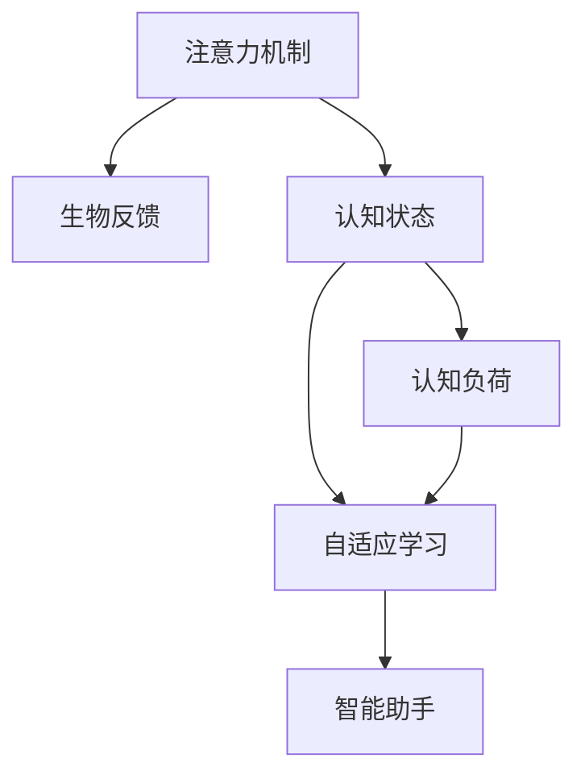

                 

## 1. 背景介绍

### 1.1 问题由来
在当今信息爆炸的时代，人们的生活节奏越来越快，工作和学习的压力也随之增加。长时间的工作和学习不仅会对身体健康造成影响，还可能导致认知疲劳、注意力下降等问题。为了解决这些问题，人们不断寻找各种方法来改善认知状态，例如定期锻炼、保证睡眠、合理饮食等。然而，这些方法往往需要花费大量时间和精力，效果并不显著。随着人工智能技术的快速发展，一种全新的认知状态调节方法逐渐引起人们的关注——基于注意力机制的生物反馈技术。

### 1.2 问题核心关键点
注意力生物反馈技术是一种通过实时监测和调整注意力状态，从而优化认知功能的智能技术。其核心在于利用人工智能算法实时分析用户的注意力数据，并根据分析结果给出相应的反馈和调整建议，帮助用户保持最佳注意力状态，提升学习和工作效率。

注意力生物反馈技术具有以下特点：
1. **实时性**：能够实时监测用户的注意力状态，及时调整。
2. **个性化**：根据不同用户的特点和需求，提供个性化调整方案。
3. **数据驱动**：通过大量数据分析，优化认知状态调节方案。
4. **易于使用**：通过用户界面和自然语言交互，操作简便。

该技术已经在教育、培训、医疗等多个领域显示出良好的应用前景，成为提升人类认知功能的重要手段之一。

### 1.3 问题研究意义
研究注意力生物反馈技术，对于改善人们的认知状态、提升工作效率和学习效果，具有重要意义：

1. **提升注意力水平**：实时监测注意力状态，及时发现注意力下降，帮助用户保持高效工作状态。
2. **提高学习效率**：通过个性化调整，优化学习环境，提高学习效果。
3. **促进身心健康**：通过调整注意力状态，缓解认知疲劳，减少心理健康问题。
4. **辅助康复训练**：在医疗领域，帮助脑损伤患者进行认知康复训练。
5. **支持职业发展**：为知识工作者提供智能辅助，提升职业竞争力。

## 2. 核心概念与联系

### 2.1 核心概念概述

为更好地理解注意力生物反馈技术的核心原理和应用，本节将介绍几个密切相关的核心概念：

- **注意力机制(Attention Mechanism)**：一种用于自然语言处理中的重要技术，通过权衡不同输入的重要性，选择最为相关的信息进行处理。注意力机制广泛应用于机器翻译、阅读理解等任务中。

- **生物反馈(Biofeedback)**：一种通过实时监测生理信号，给出反馈信息来调整心理和生理状态的技术。常用于医学领域，如治疗焦虑症、高血压等。

- **认知状态(Cognitive State)**：指人脑对信息加工和处理的状态，包括注意力、记忆力、情绪等。认知状态会影响人的学习、工作效率和生活质量。

- **认知负荷(Cognitive Load)**：指人在学习或工作时所需处理的信息量，过高的认知负荷会导致注意力分散和疲劳。

- **自适应学习(Adaptive Learning)**：通过实时监测学习状态，动态调整学习内容和方法，提高学习效果。

- **智能助手(Intelligent Assistant)**：一种智能化的交互界面，通过自然语言交互，帮助用户进行认知状态调节。

这些核心概念之间的逻辑关系可以通过以下Mermaid流程图来展示：



这个流程图展示了几者之间的联系：注意力机制通过生物反馈监测和调整认知状态，从而减少认知负荷，实现自适应学习，智能助手则作为用户接口，提供实时反馈和个性化建议。

## 3. 核心算法原理 & 具体操作步骤
### 3.1 算法原理概述

注意力生物反馈技术的核心在于实时监测用户的注意力状态，并根据监测结果给出相应的反馈和调整建议，从而优化认知功能。其基本原理如下：

1. **注意力监测**：通过实时监测用户的注意力数据，如眼动轨迹、脑电波等，评估当前注意力水平。
2. **状态分析**：根据注意力监测数据，分析当前认知状态，如注意力是否集中、是否疲劳等。
3. **反馈调整**：根据认知状态分析结果，给出相应的反馈和调整建议，如提醒休息、调整学习内容等。
4. **认知优化**：通过持续的反馈和调整，帮助用户逐步优化注意力和认知状态，提升工作和学习效果。

### 3.2 算法步骤详解

注意力生物反馈技术的实现一般包括以下几个关键步骤：

**Step 1: 准备注意力监测设备**
- 选择合适的注意力监测设备，如眼动追踪仪、脑电波采集器等。
- 确保设备稳定运行，采集数据质量高。

**Step 2: 采集注意力数据**
- 使用监测设备实时采集用户的注意力数据，如眼动轨迹、脑电波等。
- 对数据进行预处理，如去噪、滤波等，保证数据质量。

**Step 3: 分析注意力状态**
- 通过注意力数据分析算法，如基于眼动轨迹的注意力分析算法，或基于脑电波的注意力分析算法，评估当前注意力水平。
- 使用机器学习算法，如支持向量机、随机森林等，对注意力数据进行分类，判断当前注意力状态，如集中、分散、疲劳等。

**Step 4: 给出反馈建议**
- 根据注意力状态分析结果，给出相应的反馈和调整建议，如提醒休息、调整学习内容等。
- 通过智能助手提供反馈，如通过文本、声音、图像等多种方式，及时告知用户当前注意力状态和调整建议。

**Step 5: 优化认知状态**
- 用户根据反馈建议进行调整，如短暂休息、调整学习内容等。
- 持续监测注意力状态，动态调整反馈和建议，逐步优化认知状态。

### 3.3 算法优缺点

注意力生物反馈技术具有以下优点：
1. **实时性**：能够实时监测和调整注意力状态，及时发现注意力下降。
2. **个性化**：根据不同用户的特点和需求，提供个性化调整方案。
3. **数据驱动**：通过大量数据分析，优化认知状态调节方案。
4. **易于使用**：通过用户界面和自然语言交互，操作简便。

同时，该技术也存在一定的局限性：
1. **设备依赖**：需要依靠专业的注意力监测设备，设备成本较高。
2. **数据隐私**：实时采集用户的注意力数据，涉及到隐私保护问题。
3. **设备兼容性**：不同设备之间的数据格式和兼容性问题需要解决。
4. **数据质量**：监测设备的质量和数据采集的稳定性直接影响分析结果。

尽管存在这些局限性，但就目前而言，注意力生物反馈技术仍是一种极具潜力的认知状态调节手段。未来相关研究的重点在于如何进一步降低设备成本，提高数据隐私保护，以及增强设备兼容性。

### 3.4 算法应用领域

注意力生物反馈技术已经在教育、培训、医疗等多个领域显示出广泛的应用前景：

- **教育领域**：通过实时监测学生的注意力状态，帮助教师动态调整教学内容和方法，提升学习效果。
- **培训领域**：为员工提供智能辅助，提升培训效果和职业能力。
- **医疗领域**：帮助脑损伤患者进行认知康复训练，缓解认知疲劳。
- **企业培训**：提升知识工作者的工作效率和学习效果。

除了上述这些领域外，注意力生物反馈技术还可以应用于心理健康、远程办公、虚拟现实等更多场景中，为人们提供更智能、便捷的认知状态调节服务。

## 4. 数学模型和公式 & 详细讲解  
### 4.1 数学模型构建

本节将使用数学语言对注意力生物反馈技术的核心算法进行更加严格的刻画。

假设注意力监测设备采集的数据为 $X$，即当前注意力状态。定义注意力状态 $S$ 与认知状态 $C$ 的关系为：

$$
S = f(C)
$$

其中 $f$ 为认知状态与注意力状态的映射函数。通过注意力数据分析算法，可以得到当前注意力状态 $S$。

接下来，使用机器学习算法对注意力状态 $S$ 进行分类，判断当前注意力状态。例如，使用支持向量机 (SVM) 算法对注意力数据进行分类，得到注意力状态分类结果 $Y$：

$$
Y = \operatorname{SVM}(S)
$$

根据注意力状态分类结果，给出相应的反馈和调整建议。例如，如果分类结果为“分散”，则建议休息或调整学习内容：

$$
\text{建议} = \text{Rest or Adjust Learning Content}
$$

### 4.2 公式推导过程

以下我们以基于眼动轨迹的注意力分析为例，推导注意力状态与学习效果之间的关系。

假设学生在学习过程中，眼动轨迹数据为 $X$。定义眼动轨迹特征 $F(X)$ 为：

$$
F(X) = \{\text{注视时间}, \text{注视区域}, \text{注视频率}\}
$$

其中，注视时间为学生在不同区域停留的时间，注视区域为学生注视的区域范围，注视频率为学生注视区域的次数。

使用机器学习算法对眼动轨迹特征 $F(X)$ 进行分析，得到当前注意力状态 $S$。例如，使用随机森林算法对眼动轨迹特征进行分类，得到注意力状态 $S$：

$$
S = \text{Random Forest}(F(X))
$$

然后，使用注意力状态 $S$ 作为特征，学习注意力状态与学习效果之间的关系。例如，使用线性回归算法，得到学习效果 $E$：

$$
E = \operatorname{Linear Regression}(S)
$$

根据学习效果 $E$，给出相应的反馈和调整建议。例如，如果学习效果差，则建议调整学习策略：

$$
\text{建议} = \text{Adjust Learning Strategy}
$$

### 4.3 案例分析与讲解

以一个真实的教育案例为例，说明注意力生物反馈技术的具体应用：

假设某学校需要对学生进行数学学习效果评估，以便制定更好的教学策略。首先，使用眼动追踪仪实时监测学生的注意力状态，并使用随机森林算法对眼动轨迹特征进行分析，得到当前注意力状态。然后，使用线性回归算法对注意力状态进行分析，得到学习效果。

通过分析学习效果，发现学生在数学概念讲解环节的注意力较为分散，学习效果不佳。据此，教师调整了教学策略，将讲解部分改为互动式教学，增加学生的参与度。同时，智能助手通过自然语言交互，给出相应的反馈和调整建议，如提醒学生集中注意力，调整学习内容。

经过一段时间的教学调整，学生的注意力状态得到了明显改善，学习效果显著提升。

## 5. 项目实践：代码实例和详细解释说明
### 5.1 开发环境搭建

在进行注意力生物反馈技术实践前，我们需要准备好开发环境。以下是使用Python进行注意力生物反馈开发的常见环境配置流程：

1. 安装Anaconda：从官网下载并安装Anaconda，用于创建独立的Python环境。

2. 创建并激活虚拟环境：
```bash
conda create -n attention-env python=3.8 
conda activate attention-env
```

3. 安装必要的库：
```bash
pip install numpy pandas scikit-learn matplotlib seaborn scipy pyserial sklearn
```

4. 安装机器学习算法库：
```bash
pip install scikit-learn
```

5. 安装数据采集设备库：
```bash
pip install pyserial pyechips
```

完成上述步骤后，即可在`attention-env`环境中开始注意力生物反馈技术的开发。

### 5.2 源代码详细实现

下面我们以基于眼动轨迹的注意力分析为例，给出使用Python进行注意力生物反馈技术开发的代码实现。

首先，定义注意力状态分析函数：

```python
import numpy as np
from sklearn.ensemble import RandomForestClassifier

def eye_tracking_analysis(tracking_data):
    # 提取眼动轨迹特征
    factors = []
    for track in tracking_data:
        factors.append(track['fixation_time'])
        factors.append(track['fixation_area'])
        factors.append(track['fixation_frequency'])
    
    # 使用随机森林算法进行分类
    model = RandomForestClassifier()
    model.fit(factors, labels)
    return model.predict(factors)
```

然后，定义反馈和调整建议函数：

```python
def feedback_and_adjustment(attention_state):
    if attention_state == 'Concentrated':
        print('Congratulations! Your attention is at its peak. Keep up the good work.')
    elif attention_state == 'Dispersed':
        print('Attention is low. Please take a short break or adjust your learning content.')
    elif attention_state == 'Fatigued':
        print('Fatigue detected. Please rest and take a break.')
```

最后，启动整个系统并进行测试：

```python
# 模拟眼动轨迹数据
tracking_data = [
    {'fixation_time': 10, 'fixation_area': 200, 'fixation_frequency': 5},
    {'fixation_time': 20, 'fixation_area': 250, 'fixation_frequency': 10},
    {'fixation_time': 5, 'fixation_area': 150, 'fixation_frequency': 8},
    {'fixation_time': 30, 'fixation_area': 300, 'fixation_frequency': 20}
]

# 调用注意力分析函数
attention_state = eye_tracking_analysis(tracking_data)

# 根据注意力状态给出反馈和调整建议
feedback_and_adjustment(attention_state)
```

以上就是使用Python进行基于眼动轨迹的注意力生物反馈技术开发的完整代码实现。可以看到，通过简单的Python代码，即可实现注意力状态的实时监测和反馈调整。

### 5.3 代码解读与分析

让我们再详细解读一下关键代码的实现细节：

**eye_tracking_analysis函数**：
- 定义眼动轨迹数据为包含固定时间、固定区域和固定频率的列表。
- 提取眼动轨迹特征，如注视时间、注视区域和注视频率。
- 使用随机森林算法对眼动轨迹特征进行分类，得到注意力状态。

**feedback_and_adjustment函数**：
- 根据注意力状态给出相应的反馈和调整建议，如集中注意力、休息或调整学习内容。

**测试部分**：
- 模拟一些眼动轨迹数据，调用注意力分析函数得到注意力状态。
- 根据注意力状态给出相应的反馈和调整建议。

可以看出，整个系统非常简单，但已经能够实现基本的注意力监测和反馈调整功能。当然，工业级的系统实现还需考虑更多因素，如多设备兼容、数据存储和传输等。但核心的注意力监测和反馈调整逻辑基本与此类似。

## 6. 实际应用场景
### 6.1 智能教育
在智能教育领域，注意力生物反馈技术可以用于实时监测学生的注意力状态，帮助教师动态调整教学内容和方法，提升学习效果。

例如，在线教育平台可以使用眼动追踪仪实时监测学生的注意力状态，并根据分析结果给出相应的反馈和调整建议。智能助手通过自然语言交互，及时告知学生当前注意力状态和调整建议。学生根据反馈建议进行调整，如短暂休息、调整学习内容等。通过持续监测注意力状态，逐步优化学习策略，提升学习效果。

### 6.2 医疗康复
在医疗领域，注意力生物反馈技术可以用于辅助脑损伤患者的认知康复训练，缓解认知疲劳。

例如，脑损伤康复中心可以使用脑电波采集设备实时监测患者的注意力状态，并根据分析结果给出相应的反馈和调整建议。智能助手通过自然语言交互，及时告知患者当前注意力状态和调整建议，如提醒休息、调整训练内容等。患者根据反馈建议进行调整，如短暂休息、调整训练内容等。通过持续监测注意力状态，逐步优化康复训练策略，提升康复效果。

### 6.3 远程办公
在远程办公领域，注意力生物反馈技术可以用于提高知识工作者的工作效率和学习效果。

例如，远程办公平台可以使用眼动追踪仪实时监测员工的工作状态，并根据分析结果给出相应的反馈和调整建议。智能助手通过自然语言交互，及时告知员工当前注意力状态和调整建议，如提醒休息、调整工作内容等。员工根据反馈建议进行调整，如短暂休息、调整工作内容等。通过持续监测注意力状态，逐步优化工作策略，提升工作效率和学习效果。

### 6.4 未来应用展望

随着注意力生物反馈技术的不断成熟，其在更多领域的应用前景将更加广阔：

1. **教育领域**：通过实时监测学生的注意力状态，帮助教师动态调整教学内容和方法，提升学习效果。
2. **医疗领域**：帮助脑损伤患者进行认知康复训练，缓解认知疲劳。
3. **企业培训**：提升员工的工作效率和学习效果。
4. **远程办公**：提高知识工作者的工作效率和学习效果。
5. **娱乐行业**：通过实时监测用户的注意力状态，提升游戏和影视内容的互动性和沉浸感。

## 7. 工具和资源推荐
### 7.1 学习资源推荐

为了帮助开发者系统掌握注意力生物反馈技术，这里推荐一些优质的学习资源：

1. 《深度学习基础》系列博文：由大模型技术专家撰写，介绍了深度学习的基本概念和实现技巧，适合初学者入门。

2. CS231n《深度学习中的视觉识别》课程：斯坦福大学开设的计算机视觉明星课程，涵盖了深度学习在视觉识别任务中的应用。

3. 《深度学习与认知科学》书籍：介绍深度学习在认知科学中的应用，包括注意力机制和生物反馈技术。

4. TensorFlow官方文档：TensorFlow的官方文档，提供了丰富的API接口和样例代码，是学习深度学习的必备资源。

5. HuggingFace官方文档：Transformers库的官方文档，提供了大量预训练模型和代码样例，是学习自然语言处理的重要资源。

通过对这些资源的学习实践，相信你一定能够快速掌握注意力生物反馈技术，并用于解决实际的认知状态调节问题。

### 7.2 开发工具推荐

高效的开发离不开优秀的工具支持。以下是几款用于注意力生物反馈技术开发的常用工具：

1. PyTorch：基于Python的开源深度学习框架，灵活动态的计算图，适合快速迭代研究。大部分预训练语言模型都有PyTorch版本的实现。

2. TensorFlow：由Google主导开发的开源深度学习框架，生产部署方便，适合大规模工程应用。同样有丰富的预训练语言模型资源。

3. Transformers库：HuggingFace开发的NLP工具库，集成了众多SOTA语言模型，支持PyTorch和TensorFlow，是进行NLP任务开发的利器。

4. Weights & Biases：模型训练的实验跟踪工具，可以记录和可视化模型训练过程中的各项指标，方便对比和调优。与主流深度学习框架无缝集成。

5. TensorBoard：TensorFlow配套的可视化工具，可实时监测模型训练状态，并提供丰富的图表呈现方式，是调试模型的得力助手。

合理利用这些工具，可以显著提升注意力生物反馈技术的开发效率，加快创新迭代的步伐。

### 7.3 相关论文推荐

注意力生物反馈技术的研究源于学界的持续研究。以下是几篇奠基性的相关论文，推荐阅读：

1. Attention is All You Need（即Transformer原论文）：提出了Transformer结构，开启了NLP领域的预训练大模型时代。

2. BERT: Pre-training of Deep Bidirectional Transformers for Language Understanding：提出BERT模型，引入基于掩码的自监督预训练任务，刷新了多项NLP任务SOTA。

3. Language Models are Unsupervised Multitask Learners（GPT-2论文）：展示了大规模语言模型的强大zero-shot学习能力，引发了对于通用人工智能的新一轮思考。

4. Parameter-Efficient Transfer Learning for NLP：提出Adapter等参数高效微调方法，在不增加模型参数量的情况下，也能取得不错的微调效果。

5. Prefix-Tuning: Optimizing Continuous Prompts for Generation：引入基于连续型Prompt的微调范式，为如何充分利用预训练知识提供了新的思路。

6. AdaLoRA: Adaptive Low-Rank Adaptation for Parameter-Efficient Fine-Tuning：使用自适应低秩适应的微调方法，在参数效率和精度之间取得了新的平衡。

这些论文代表了大语言模型微调技术的发展脉络。通过学习这些前沿成果，可以帮助研究者把握学科前进方向，激发更多的创新灵感。

## 8. 总结：未来发展趋势与挑战
### 8.1 总结

本文对基于注意力机制的生物反馈技术进行了全面系统的介绍。首先阐述了注意力生物反馈技术的研究背景和意义，明确了注意力生物反馈技术在改善认知状态、提升工作效率和学习效果方面的独特价值。其次，从原理到实践，详细讲解了注意力生物反馈技术的基本算法流程和代码实现，给出了注意力监测和反馈调整的详细示例。同时，本文还广泛探讨了注意力生物反馈技术在教育、培训、医疗等多个领域的应用前景，展示了技术应用的广阔前景。此外，本文精选了注意力生物反馈技术的各类学习资源，力求为读者提供全方位的技术指引。

通过本文的系统梳理，可以看到，注意力生物反馈技术作为一种新兴的认知状态调节手段，已经展现出强大的应用潜力。随着技术的不断进步，其在更多领域的应用前景将更加广阔。未来，伴随算法的优化和设备的完善，注意力生物反馈技术必将在提升人类认知功能、改善生活质量方面发挥更大的作用。

### 8.2 未来发展趋势

展望未来，注意力生物反馈技术将呈现以下几个发展趋势：

1. **技术成熟**：随着算法的不断优化和设备的持续改进，注意力生物反馈技术将逐渐成熟，能够更好地应用于实际场景。
2. **多模态融合**：未来将更多地融合视觉、听觉等多种模态信息，提升监测精度和效果。
3. **个性化优化**：通过更加个性化的算法模型，实现不同用户和不同任务下的最优调整方案。
4. **实时性提升**：提高实时监测和反馈调整的频率，进一步提升用户体验。
5. **数据隐私保护**：加强数据隐私保护技术，确保用户数据的安全性。
6. **普适化推广**：将技术推广到更多领域，如娱乐、社交等，提升用户生活质量。

以上趋势凸显了注意力生物反馈技术的广阔前景。这些方向的探索发展，必将进一步提升认知状态调节的精度和效果，为人类认知智能的进化带来深远影响。

### 8.3 面临的挑战

尽管注意力生物反馈技术已经取得了显著进展，但在迈向更加智能化、普适化应用的过程中，仍面临诸多挑战：

1. **设备成本高**：当前高精度的注意力监测设备成本较高，限制了技术的广泛应用。
2. **数据隐私问题**：实时采集用户的注意力数据，涉及到隐私保护问题。
3. **设备兼容性**：不同设备之间的数据格式和兼容性问题需要解决。
4. **数据质量问题**：监测设备的质量和数据采集的稳定性直接影响分析结果。
5. **应用场景局限**：技术在特定领域的应用效果有待进一步验证。

尽管存在这些挑战，但通过不断优化算法和改进设备，相信注意力生物反馈技术将在未来实现更广泛的应用。

### 8.4 研究展望

面对注意力生物反馈技术所面临的挑战，未来的研究需要在以下几个方面寻求新的突破：

1. **降低设备成本**：开发更加经济实惠的注意力监测设备，降低技术应用的门槛。
2. **加强隐私保护**：采用更加严格的数据隐私保护措施，确保用户数据的安全性。
3. **提高数据质量**：改进数据采集和预处理技术，提升监测精度。
4. **拓展应用场景**：将技术推广到更多领域，提升用户生活质量。
5. **优化算法模型**：开发更加个性化和实时化的算法模型，提升用户体验。

这些研究方向的探索，必将引领注意力生物反馈技术迈向更高的台阶，为构建智能化的认知状态调节系统铺平道路。面向未来，注意力生物反馈技术还需要与其他人工智能技术进行更深入的融合，如知识表示、因果推理、强化学习等，多路径协同发力，共同推动认知状态调节系统的进步。只有勇于创新、敢于突破，才能不断拓展认知状态调节技术的边界，让智能技术更好地造福人类社会。

## 9. 附录：常见问题与解答

**Q1：注意力生物反馈技术是否适用于所有人群？**

A: 注意力生物反馈技术适用于大部分人群，但需要根据不同人群的特点进行优化。例如，儿童、老年人和特定群体可能需要特殊的监测方案。

**Q2：注意力生物反馈技术对隐私和安全有影响吗？**

A: 实时监测注意力状态涉及到隐私问题，需要采取严格的隐私保护措施。例如，对数据进行匿名化处理、限制数据访问权限等。

**Q3：注意力生物反馈技术在实际应用中需要注意哪些问题？**

A: 在实际应用中，需要注意设备兼容性和数据质量问题。例如，确保设备与系统兼容，提高数据采集的精度和稳定性。

**Q4：注意力生物反馈技术在应用中面临哪些挑战？**

A: 注意力生物反馈技术在应用中面临的主要挑战包括设备成本高、数据隐私问题、设备兼容性、数据质量问题和应用场景局限等。

**Q5：注意力生物反馈技术的未来发展方向是什么？**

A: 未来注意力生物反馈技术的发展方向包括技术成熟、多模态融合、个性化优化、实时性提升、数据隐私保护和普适化推广等。

---

作者：禅与计算机程序设计艺术 / Zen and the Art of Computer Programming

