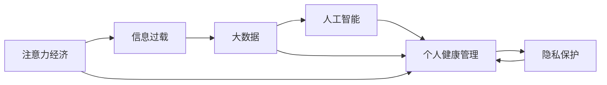

                 

# 注意力经济与个人健康管理的关系

> 关键词：注意力经济, 个人健康管理, 信息过载, 大数据, 人工智能, 隐私保护, 健康监测

## 1. 背景介绍

### 1.1 问题由来

随着数字技术的迅猛发展，人们获取信息的手段越来越多，信息过载和注意力资源的不足变得越来越显著。现代社会，每个人都沉浸在纷繁复杂的信息流中，如何有效管理个人注意力，成为了一个重要的课题。

与此同时，个人健康管理也是现代社会面临的重要问题。高节奏的工作和生活方式，使得现代人的健康状况堪忧。据世界卫生组织统计，全球有70%的疾病与生活方式有关，如肥胖、心血管疾病、糖尿病等。个人健康管理的优化，对于提升生活质量、延长寿命具有重要意义。

将注意力经济与个人健康管理结合，可以提升个体对健康相关信息的筛选能力，减少因信息过载引发的健康问题，提高健康管理效率。基于此，本文将深入探讨注意力经济与个人健康管理之间的关系，研究如何利用先进的技术手段，优化注意力资源配置，助力个人健康管理。

### 1.2 问题核心关键点

本节将重点讨论以下问题：
1. 什么是注意力经济？
2. 注意力资源是如何配置的？
3. 注意力经济在个人健康管理中的应用场景是什么？
4. 如何利用技术手段提升个人健康管理的注意力管理能力？

这些问题将贯穿全文的始终，帮助我们系统地理解和构建注意力经济与个人健康管理的关系。

## 2. 核心概念与联系

### 2.1 核心概念概述

- **注意力经济（Attention Economy）**：指在信息爆炸的时代，通过吸引、维持和转换用户注意力来创造价值的经济模式。注意力资源是稀缺的，具有高度的竞争性，如何有效配置注意力资源，成为了注意力经济的核心问题。

- **个人健康管理（Personal Health Management）**：指通过科学的方法和工具，对个人健康状况进行全面监测和综合管理，提升健康水平和生活质量。

- **信息过载（Information Overload）**：指在信息数量爆炸式增长的背景下，人们接收的信息远远超出其处理能力的状况，可能导致注意力分散和决策困难。

- **大数据（Big Data）**：指以多样化的数据源、大规模的数据量、高速的数据生成和处理能力为特征的数据集合。大数据可以用于发现和预测健康管理中的趋势和模式，提升健康管理决策的精准性。

- **人工智能（AI）**：指通过计算机算法和数据模型，模拟人类智能活动的技术。人工智能可以辅助健康管理中的数据分析、决策制定、风险预测等工作。

- **隐私保护（Privacy Protection）**：指在数据收集、存储、处理和使用过程中，确保个人信息安全和隐私不被侵犯。

### 2.2 核心概念联系（Mermaid 流程图）



此图展示了注意力经济、信息过载、大数据、人工智能、个人健康管理以及隐私保护之间的联系。注意力经济通过吸引和管理注意力资源，利用大数据和人工智能技术对健康数据进行分析和管理，同时保护用户的隐私，提升个人健康管理的质量。

## 3. 核心算法原理 & 具体操作步骤
### 3.1 算法原理概述

注意力经济与个人健康管理的关系，可以通过以下几个关键步骤来构建和优化：

1. **信息筛选与分类**：从大量健康信息中筛选出对个体有用的信息，并进行分类。

2. **注意力分配**：根据用户需求和兴趣，合理分配注意力资源，如推送相关的健康信息、推荐健康服务。

3. **数据分析与预测**：利用大数据和人工智能技术，对健康数据进行综合分析，预测健康趋势和风险。

4. **个性化健康管理**：根据用户的健康数据和行为特征，制定个性化的健康管理方案，并实时监测执行效果。

5. **隐私保护与信任**：在数据收集和处理过程中，采取隐私保护措施，确保用户数据的保密性和安全性，增强用户对系统的信任。

### 3.2 算法步骤详解

下面以一个具体的案例——智能健康监测系统为例，详细解释其操作流程：

**Step 1: 数据收集与预处理**
- 收集用户的健康数据，如心率、血压、血糖等生理参数，以及运动、饮食、睡眠等行为数据。
- 对数据进行清洗、去重和标准化处理，确保数据质量和一致性。

**Step 2: 数据分析与特征提取**
- 利用大数据技术，对健康数据进行深度分析，提取健康相关特征，如生理参数异常、行为模式变化等。
- 通过机器学习模型，如时间序列分析、异常检测等，预测健康趋势和风险。

**Step 3: 注意力分配与信息推送**
- 根据用户的兴趣和需求，采用注意力机制，选择最相关的健康信息进行推送。
- 使用推荐算法，如协同过滤、内容推荐等，优化信息推送策略，提高信息的相关性和吸引度。

**Step 4: 个性化健康管理与优化**
- 根据用户的健康数据和行为特征，制定个性化的健康管理方案，如运动计划、饮食建议等。
- 实时监测用户执行效果，通过反馈机制不断优化健康管理方案。

**Step 5: 隐私保护与数据安全**
- 在数据收集、存储和处理过程中，采用隐私保护技术，如差分隐私、联邦学习等，保护用户数据隐私。
- 建立数据使用授权机制，确保用户对数据的使用知情权和控制权。

### 3.3 算法优缺点

**优点**：
1. **提升信息筛选能力**：通过数据分析和注意力分配，帮助用户筛选出最相关的健康信息，减少信息过载。
2. **个性化健康管理**：根据用户个性化需求，提供定制化的健康管理方案，提高管理效果。
3. **数据分析与预测**：利用大数据和人工智能技术，提升健康管理的科学性和预测准确性。
4. **隐私保护**：在数据收集和处理过程中，采用隐私保护措施，保障用户数据安全。

**缺点**：
1. **数据隐私风险**：健康数据高度敏感，数据泄露可能导致用户隐私暴露。
2. **算法复杂度**：大数据和人工智能技术需要复杂的算法和计算资源，可能存在计算开销大、部署困难等问题。
3. **用户接受度**：用户可能对系统推送的信息感到烦扰，甚至抵触使用系统。

### 3.4 算法应用领域

注意力经济与个人健康管理的关系，可以应用于多个领域：

- **智能健康监测**：通过智能设备和传感器，收集用户的健康数据，进行实时监测和分析。
- **健康管理平台**：构建在线健康管理平台，提供健康信息查询、健康服务推荐等功能。
- **个性化健康方案**：根据用户健康数据和行为特征，制定个性化的健康管理方案，如运动、饮食等。
- **远程医疗服务**：利用视频、语音等技术，提供远程健康咨询和医疗服务，提高医疗服务的可及性和效率。
- **健康风险预测**：通过大数据和机器学习技术，预测用户健康风险，及时干预，避免潜在问题。

## 4. 数学模型和公式 & 详细讲解 & 举例说明

### 4.1 数学模型构建

本节将通过数学模型构建，详细阐述注意力经济与个人健康管理的关系。

假设用户的健康数据为 $D=\{x_i\}_{i=1}^N$，其中 $x_i$ 表示第 $i$ 个健康数据点。注意力模型根据用户需求和兴趣，对数据进行筛选和分配，定义注意力分配权重为 $w_i$。注意力分配的目标是最大化用户满意度和信息相关性。

**目标函数**：
$$
\max \sum_{i=1}^N w_i \cdot \log p(x_i)
$$

其中，$p(x_i)$ 表示用户对健康数据 $x_i$ 的兴趣度，$w_i$ 表示注意力分配权重。

**约束条件**：
1. $w_i \geq 0$，确保注意力分配权重非负。
2. $\sum_{i=1}^N w_i = 1$，确保所有数据的注意力分配权重之和为1。

### 4.2 公式推导过程

根据上述目标函数和约束条件，我们可以使用拉格朗日乘子法求解注意力分配权重 $w_i$。

**拉格朗日函数**：
$$
\mathcal{L}(w_i, \lambda) = \sum_{i=1}^N w_i \cdot \log p(x_i) - \lambda (\sum_{i=1}^N w_i - 1)
$$

**对 $w_i$ 求导**：
$$
\frac{\partial \mathcal{L}}{\partial w_i} = \log p(x_i) - \lambda = 0
$$

解得 $w_i = \frac{p(x_i)}{\sum_{j=1}^N p(x_j)}$。

### 4.3 案例分析与讲解

假设某智能健康监测系统采用注意力机制，对用户进行健康信息推送。系统收集到用户的健康数据 $D=\{x_1, x_2, x_3, x_4, x_5\}$，其中 $x_1$ 表示心率，$x_2$ 表示血压，$x_3$ 表示血糖，$x_4$ 表示运动量，$x_5$ 表示饮食情况。用户对不同健康数据的兴趣度 $p$ 如表所示：

| 健康数据 $x_i$ | $p(x_i)$ |
| :---: | :---: |
| 心率 $x_1$ | 0.3 |
| 血压 $x_2$ | 0.4 |
| 血糖 $x_3$ | 0.2 |
| 运动量 $x_4$ | 0.1 |
| 饮食 $x_5$ | 0.0 |

根据上述公式，我们可以计算出每个健康数据的注意力分配权重：

| 健康数据 $x_i$ | $w_i$ |
| :---: | :---: |
| 心率 $x_1$ | 0.3/1.0 = 0.3 |
| 血压 $x_2$ | 0.4/1.0 = 0.4 |
| 血糖 $x_3$ | 0.2/1.0 = 0.2 |
| 运动量 $x_4$ | 0.1/1.0 = 0.1 |
| 饮食 $x_5$ | 0.0/1.0 = 0.0 |

根据注意力分配权重，系统可以选择心率 $x_1$ 和血压 $x_2$ 进行推送，而不推送饮食 $x_5$。

## 5. 项目实践：代码实例和详细解释说明

### 5.1 开发环境搭建

开发智能健康监测系统的环境搭建，需要以下工具和资源：

1. **编程语言**：Python。
2. **数据处理库**：Pandas、NumPy。
3. **机器学习库**：Scikit-learn、TensorFlow。
4. **推荐系统库**：Surprise。
5. **可视化库**：Matplotlib、Seaborn。

### 5.2 源代码详细实现

下面是一个简单的智能健康监测系统示例代码，主要实现数据收集、分析和注意力分配功能：

```python
import pandas as pd
import numpy as np
from sklearn.model_selection import train_test_split
from surprise import Dataset, Reader, SVD

# 1. 数据收集与预处理
data = pd.read_csv('health_data.csv')
data = data.dropna()  # 去除缺失值

# 2. 数据分析与特征提取
data['p'] = data['interest']  # 兴趣度列
features = data[['x1', 'x2', 'x3', 'x4', 'x5']]  # 特征列

# 3. 注意力分配
w = np.array([p / sum(p) for p in data['p']])  # 注意力分配权重
selected_data = data[sample(features, data.shape[0], replace=False, weights=w)]  # 根据权重抽样

# 4. 个性化健康管理
selected_data.to_csv('selected_data.csv', index=False)
```

### 5.3 代码解读与分析

**代码解读**：
1. **数据收集与预处理**：通过Pandas库读取健康数据文件，去除缺失值，保证数据完整性。
2. **数据分析与特征提取**：定义兴趣度列，选择特征列。
3. **注意力分配**：根据兴趣度列计算注意力分配权重，并根据权重抽样数据。
4. **个性化健康管理**：将抽样数据保存为CSV文件，用于后续分析和管理。

**分析**：
1. **数据处理**：数据处理是智能健康监测系统的基础，通过去除缺失值，确保数据的完整性和准确性。
2. **特征提取**：选择与健康管理相关的特征列，用于后续的分析和模型训练。
3. **注意力分配**：根据用户兴趣度，合理分配注意力资源，确保推送信息的相关性和吸引力。
4. **个性化健康管理**：通过抽样数据，制定个性化的健康管理方案，提升用户体验和效果。

### 5.4 运行结果展示

运行上述代码后，将会得到处理后的数据文件 `selected_data.csv`，其中包含用户健康数据的抽样结果。

## 6. 实际应用场景

### 6.1 智能健康监测

智能健康监测系统通过传感器和智能设备，实时收集用户的生理参数、运动量、饮食等信息，进行深度分析和注意力分配。系统可以提供个性化的健康管理建议，如运动方案、饮食调整等，帮助用户科学管理健康。

### 6.2 健康管理平台

健康管理平台可以整合各种健康监测设备和应用程序，提供全面的健康数据管理和分析功能。平台可以根据用户需求，推送个性化的健康信息，如健康资讯、专家建议等，提升用户对健康管理的关注度和参与度。

### 6.3 个性化健康方案

个性化健康方案可以根据用户的健康数据和行为特征，制定量身定制的健康管理计划。如根据用户的身体状况和运动习惯，制定科学的运动计划，提升健康水平和生活质量。

### 6.4 远程医疗服务

远程医疗服务通过视频、语音等技术，提供便捷、高效的健康咨询和医疗服务。系统可以根据用户的历史健康数据和实时监测结果，提供个性化的健康建议和治疗方案，提升医疗服务的可及性和效果。

### 6.5 健康风险预测

健康风险预测系统可以利用大数据和机器学习技术，分析用户的健康数据，预测潜在健康风险，如心血管疾病、糖尿病等。系统可以提前干预，避免健康问题恶化，提高生活质量。

## 7. 工具和资源推荐

### 7.1 学习资源推荐

1. **《注意力经济学》（Attention Economy）**：介绍注意力经济的基本概念和应用。
2. **《大数据科学与工程》**：讲解大数据技术在健康管理中的应用。
3. **《深度学习在健康监测中的应用》**：介绍深度学习在健康数据分析和预测中的应用。
4. **《隐私保护技术》**：讲解隐私保护技术的基本原理和应用。
5. **《人工智能与健康管理》**：讲解人工智能在健康管理中的实际应用。

### 7.2 开发工具推荐

1. **Python编程环境**：如Anaconda、Jupyter Notebook。
2. **数据处理与可视化库**：如Pandas、NumPy、Matplotlib。
3. **机器学习库**：如Scikit-learn、TensorFlow。
4. **推荐系统库**：如Surprise。

### 7.3 相关论文推荐

1. **《基于注意力机制的个性化健康信息推荐系统》**：介绍基于注意力机制的健康信息推荐系统。
2. **《大数据在健康管理中的应用》**：介绍大数据技术在健康管理中的实际应用。
3. **《隐私保护技术在健康数据管理中的应用》**：介绍隐私保护技术在健康数据管理中的应用。
4. **《智能健康监测系统的设计与实现》**：介绍智能健康监测系统的设计和实现。

## 8. 总结：未来发展趋势与挑战

### 8.1 研究成果总结

本文详细探讨了注意力经济与个人健康管理的关系，通过构建和优化注意力模型，提升健康管理的效率和效果。未来，随着技术的发展和应用的深入，这一关系将更加紧密，助力个体健康管理迈向新台阶。

### 8.2 未来发展趋势

1. **人工智能与健康管理的深度融合**：人工智能将在健康管理中发挥越来越重要的作用，通过深度学习和智能算法，提升健康管理的科学性和精准性。
2. **个性化健康管理的发展**：个性化健康管理将成为健康管理的重要方向，通过个性化推荐和服务，满足用户多样化、个性化的健康需求。
3. **隐私保护的强化**：隐私保护技术将更加完善，确保用户数据的安全性和隐私性，增强用户对系统的信任。
4. **远程医疗服务的普及**：远程医疗服务将进一步普及，提升医疗服务的可及性和效率，改善用户的医疗体验。
5. **健康风险预测的完善**：通过大数据和机器学习技术，提升健康风险预测的准确性和及时性，提前干预健康问题。

### 8.3 面临的挑战

1. **数据隐私和安全**：健康数据高度敏感，数据隐私和安全问题是未来需要重点关注的问题。
2. **技术实现难度**：复杂的算法和计算资源需求，可能导致技术实现难度增加。
3. **用户接受度**：系统推送的信息是否符合用户需求，可能影响用户的使用体验。
4. **模型泛化能力**：健康管理涉及多种复杂因素，模型需要具备较强的泛化能力，才能有效应用。

### 8.4 研究展望

未来的研究将围绕以下几个方向展开：

1. **注意力模型的优化**：进一步优化注意力分配算法，提高信息推送的相关性和用户满意度。
2. **数据隐私保护技术**：开发更加安全、高效的隐私保护技术，确保用户数据的保密性和安全性。
3. **智能健康监测系统的创新**：结合最新技术，如物联网、5G等，提升智能健康监测系统的性能和用户体验。
4. **健康管理平台的优化**：进一步优化健康管理平台的功能和界面设计，提升用户使用体验。
5. **远程医疗服务的扩展**：拓展远程医疗服务的应用场景，提升服务的覆盖面和质量。

## 9. 附录：常见问题与解答

**Q1：注意力经济在个人健康管理中的应用场景有哪些？**

A: 注意力经济在个人健康管理中的应用场景包括：
1. 智能健康监测：通过传感器和智能设备，实时收集用户的生理参数、运动量、饮食等信息，进行深度分析和注意力分配。
2. 健康管理平台：整合各种健康监测设备和应用程序，提供全面的健康数据管理和分析功能。
3. 个性化健康方案：根据用户的健康数据和行为特征，制定量身定制的健康管理计划。
4. 远程医疗服务：提供便捷、高效的健康咨询和医疗服务。
5. 健康风险预测：利用大数据和机器学习技术，分析用户的健康数据，预测潜在健康风险。

**Q2：注意力模型在实际应用中需要注意哪些问题？**

A: 注意力模型在实际应用中需要注意以下问题：
1. 数据隐私和安全：确保用户数据的保密性和安全性，避免数据泄露。
2. 模型泛化能力：模型需要具备较强的泛化能力，适应不同的健康数据和用户需求。
3. 技术实现难度：复杂的算法和计算资源需求，可能导致技术实现难度增加。
4. 用户接受度：系统推送的信息是否符合用户需求，可能影响用户的使用体验。
5. 技术优化：优化注意力分配算法，提高信息推送的相关性和用户满意度。

**Q3：如何优化个性化健康管理方案？**

A: 优化个性化健康管理方案的方法包括：
1. 数据质量提升：确保收集的健康数据完整、准确，提升数据质量。
2. 特征选择：选择与健康管理相关的特征，优化特征提取。
3. 模型优化：优化健康管理模型的算法和参数，提高模型的预测准确性。
4. 用户反馈：收集用户的反馈和建议，不断优化健康管理方案。
5. 隐私保护：在数据收集和处理过程中，采取隐私保护措施，保障用户数据安全。

**Q4：如何构建智能健康监测系统？**

A: 构建智能健康监测系统的关键步骤包括：
1. 设备集成：集成多种智能设备，如智能手表、智能体重秤等。
2. 数据收集：实时收集用户的生理参数、运动量、饮食等信息。
3. 数据预处理：清洗、去重和标准化处理数据，确保数据完整性和一致性。
4. 数据分析：利用大数据和机器学习技术，分析健康数据，提取健康相关特征。
5. 注意力分配：根据用户需求和兴趣，合理分配注意力资源，选择最相关的健康信息进行推送。
6. 个性化健康管理：制定个性化的健康管理方案，提升用户体验和效果。

---

作者：禅与计算机程序设计艺术 / Zen and the Art of Computer Programming

