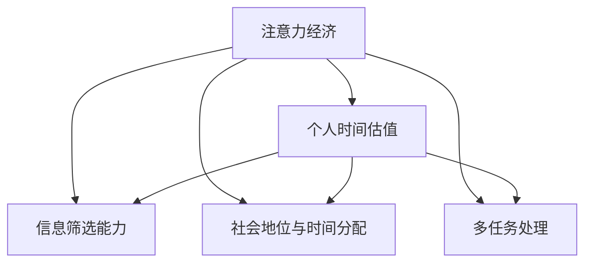

                 

# 注意力经济与个人时间估值的变化

## 1. 背景介绍

### 1.1 问题由来
在数字化时代，信息爆炸、流量为王已经成为一种新的经济模式。这种模式被称为“注意力经济”，它不同于传统的商品经济，商品不再是唯一的货币，而是变成了人们的注意力。在这样的背景下，个人时间的估值也发生了深刻的变化。过去，人们可以通过时间积累财富，而现在，人们的时间可以直接转换成金钱，甚至更高的价值。

### 1.2 问题核心关键点
注意力经济的崛起，使得个人时间成为一种稀缺资源，它的价值正在被重新评估。个人时间的估值不仅取决于其本身的长度，还受到时间分配、社会地位、信息筛选能力等多种因素的影响。如何准确评估和利用个人时间，成为了当前社会一个重要的课题。

### 1.3 问题研究意义
研究个人时间估值的变化，对于理解数字化时代的经济结构和社会变革，以及如何优化个人时间管理，提高生产效率和幸福感，具有重要的理论和实践意义。

## 2. 核心概念与联系

### 2.1 核心概念概述

为了更好地理解注意力经济与个人时间估值的变化，我们需要介绍几个关键概念：

- **注意力经济**：信息时代，人们的注意力成为一种重要的经济资源。无论是社交媒体、在线广告还是内容创作，都离不开对注意力的争夺和利用。

- **个人时间估值**：在注意力经济下，个人时间的价值不再仅仅基于其长度，而是基于时间的使用方式和产出效果。如何合理评估和管理个人时间，直接影响个人生活质量和财务状况。

- **信息筛选能力**：在信息爆炸的时代，人们需要具备高效的信息筛选能力，才能在众多信息中捕捉到有价值的内容，从而最大化个人时间的利用率。

- **社会地位与时间分配**：社会地位和职业性质直接影响个人时间的分配和利用方式。例如，CEO和程序员的可用时间分布有很大差异，需要结合不同的时间管理策略。

- **多任务处理**：在现代生活中，多任务处理成为常态。如何平衡不同任务的时间分配，提升整体效率，是提高个人时间价值的重要途径。

这些核心概念之间的逻辑关系可以通过以下Mermaid流程图来展示：



这个流程图展示了注意力经济与个人时间估值的关系，以及它们与其他核心概念的相互作用。注意力经济的兴起促使个人时间估值发生变化，而信息筛选能力、社会地位与时间分配、多任务处理等因素都在影响着个人时间的价值。

## 3. 核心算法原理 & 具体操作步骤
### 3.1 算法原理概述

在注意力经济下，个人时间的估值问题可以转化为一个多目标优化问题。假设个人的可用时间为 $T$，分配给不同任务的时间分别为 $T_1, T_2, ..., T_n$，每个任务的价值为 $V_1, V_2, ..., V_n$。那么，个人时间估值的最大化问题可以表示为：

$$
\max_{T_1, T_2, ..., T_n} \sum_{i=1}^{n} V_i \cdot T_i
$$

其中 $V_i$ 为任务 $i$ 的价值，$T_i$ 为分配给任务 $i$ 的时间。需要注意的是，由于时间总和的限制，各任务时间的分配需要满足 $T_1 + T_2 + ... + T_n = T$。

### 3.2 算法步骤详解

解决上述优化问题的步骤如下：

**Step 1: 确定任务价值**
- 根据任务类型和目标，确定各任务的价值 $V_i$。例如，阅读一本书的价值可能高于刷社交媒体，因为它能带来更多的认知收益。

**Step 2: 设定时间约束**
- 确定个人可用时间的总量 $T$，以及各任务所需时间的上限 $T_{i_{\max}}$。

**Step 3: 选择分配策略**
- 根据任务价值和可用时间，选择不同的分配策略。常见的策略包括：
  - **平均分配**：将时间平均分配给所有任务，适用于任务价值相仿的情况。
  - **优先级排序**：根据任务的价值排序，优先分配给高价值任务，适用于任务价值差异较大时。
  - **时间分块**：将时间分成若干个固定时间段，每个时间段内专注于一个任务。

**Step 4: 优化时间分配**
- 使用线性规划、整数规划等优化方法，求解时间分配问题。常用的工具包括Python的PuLP、Scipy等库。
- 通过求解优化问题，得到最优的任务时间分配 $T_1^*, T_2^*, ..., T_n^*$。

**Step 5: 评估效果**
- 根据实际执行情况，评估时间分配的效果。例如，计算总任务价值 $V_{\text{total}} = \sum_{i=1}^{n} V_i \cdot T_i^*$，以及各任务执行后的实际产出。

### 3.3 算法优缺点

基于时间估值的优化算法具有以下优点：
1. 量化时间价值：通过设定任务价值，能够更直观地衡量不同活动的时间收益。
2. 优化时间分配：通过数学优化手段，可以找到最优的时间分配方案，提升整体效率。
3. 灵活调整：算法可以根据不同情境和需求，灵活调整时间分配策略。

同时，该算法也存在一定的局限性：
1. 价值评估主观性强：任务价值的主观性较强，不同人对同一任务的价值评估可能存在差异。
2. 时间约束复杂：实际生活中的时间约束可能非常复杂，难以通过简单的数学模型完全描述。
3. 实际执行困难：最优解往往需要在理论上经过求解，但实际执行中可能面临各种干扰因素。

### 3.4 算法应用领域

基于时间估值优化算法，已经在多个领域得到了应用，例如：

- **时间管理工具**：如Trello、Todoist等工具，通过设定任务优先级和截止日期，帮助用户合理分配时间。
- **项目管理**：在项目计划和执行中，通过时间估值的优化，确保关键任务的优先级和进度。
- **个人理财**：根据个人时间估值，制定合理的投资和消费计划，提升整体财务状况。
- **学习和教育**：优化学习时间和方法，提升学习效率和效果。

## 4. 数学模型和公式 & 详细讲解 & 举例说明

### 4.1 数学模型构建

为了更精确地评估和优化个人时间估值，我们需要构建一个多目标优化模型。假设个人可用时间为 $T$，任务价值为 $V_1, V_2, ..., V_n$，各任务所需时间为 $T_1, T_2, ..., T_n$。那么，最优时间分配问题的数学模型可以表示为：

$$
\begin{align*}
\max_{T_1, T_2, ..., T_n} & \sum_{i=1}^{n} V_i \cdot T_i \\
\text{s.t.} & \sum_{i=1}^{n} T_i \leq T \\
& T_i \geq 0 \quad \forall i \in [1, n] \\
& \sum_{i=1}^{n} T_{i_{\max}} \geq T \\
\end{align*}
$$

其中，第二个约束条件表示总时间不超过可用时间 $T$，第三个条件表示任务时间非负，第四个条件表示各任务时间不超过其最大时间限制 $T_{i_{\max}}$。

### 4.2 公式推导过程

上述数学模型可以使用线性规划方法进行求解。假设目标函数为 $z = \sum_{i=1}^{n} V_i \cdot T_i$，约束条件为 $\sum_{i=1}^{n} T_i \leq T$，$T_i \geq 0$，$\sum_{i=1}^{n} T_{i_{\max}} \geq T$。

假设 $\lambda_1, \lambda_2, ..., \lambda_n$ 为拉格朗日乘子，则拉格朗日函数为：

$$
\mathcal{L}(\mathbf{T}, \lambda_1, \lambda_2, ..., \lambda_n) = \sum_{i=1}^{n} V_i \cdot T_i - \lambda_1 (\sum_{i=1}^{n} T_i - T) - \sum_{i=1}^{n} \lambda_i T_i + \lambda_{n+1} (T - \sum_{i=1}^{n} T_i)
$$

将拉格朗日函数对 $\mathbf{T}$ 和 $\lambda$ 求偏导，并令其等于零，可得：

$$
\begin{align*}
\frac{\partial \mathcal{L}}{\partial T_i} &= V_i - \lambda_1 - \lambda_i + \lambda_{n+1} = 0 \quad \forall i \in [1, n] \\
\frac{\partial \mathcal{L}}{\partial \lambda_1} &= \sum_{i=1}^{n} T_i - T = 0 \\
\frac{\partial \mathcal{L}}{\partial \lambda_i} &= T_i = 0 \quad \forall i \in [1, n] \\
\frac{\partial \mathcal{L}}{\partial \lambda_{n+1}} &= T - \sum_{i=1}^{n} T_i = 0 \\
\end{align*}
$$

解上述方程组，得到最优时间分配的解为：

$$
T_i^* = \min\left(\frac{T}{\sum_{i=1}^{n} V_i}, T_{i_{\max}}\right)
$$

这意味着，最优时间分配方案是按照任务价值比例分配时间，同时不超过各任务的可用时间限制。

### 4.3 案例分析与讲解

假设一个人每天有24小时，需要完成四项任务：阅读书籍、观看视频、做运动、社交网络。各项任务的价值分别为 $V_1 = 0.8, V_2 = 0.6, V_3 = 0.4, V_4 = 0.2$，最大可用时间分别为 $T_{i_{\max}} = 6, 2, 2, 2$。如何确定最优时间分配？

首先，设定总时间为 $T = 24$ 小时，目标函数为 $z = 0.8 \cdot T_1 + 0.6 \cdot T_2 + 0.4 \cdot T_3 + 0.2 \cdot T_4$。

根据公式推导过程，计算得到各任务的实际分配时间：

$$
T_1^* = \min\left(\frac{24}{0.8+0.6+0.4+0.2}, 6\right) = \min\left(\frac{24}{2}, 6\right) = 12 \text{小时}
$$

$$
T_2^* = \min\left(\frac{24}{0.8+0.6+0.4+0.2}, 2\right) = \min\left(\frac{24}{2}, 2\right) = 2 \text{小时}
$$

$$
T_3^* = \min\left(\frac{24}{0.8+0.6+0.4+0.2}, 2\right) = \min\left(\frac{24}{2}, 2\right) = 2 \text{小时}
$$

$$
T_4^* = \min\left(\frac{24}{0.8+0.6+0.4+0.2}, 2\right) = \min\left(\frac{24}{2}, 2\right) = 2 \text{小时}
$$

根据计算结果，最优时间分配为：阅读书籍12小时，观看视频2小时，做运动2小时，社交网络2小时。

## 5. 项目实践：代码实例和详细解释说明

### 5.1 开发环境搭建

在进行时间估值优化实践前，我们需要准备好开发环境。以下是使用Python进行PuLP开发的环境配置流程：

1. 安装Anaconda：从官网下载并安装Anaconda，用于创建独立的Python环境。

2. 创建并激活虚拟环境：
```bash
conda create -n time_opt_env python=3.8 
conda activate time_opt_env
```

3. 安装PuLP：
```bash
pip install pulp
```

4. 安装其它工具包：
```bash
pip install numpy pandas matplotlib jupyter notebook ipython
```

完成上述步骤后，即可在`time_opt_env`环境中开始时间估值优化实践。

### 5.2 源代码详细实现

这里我们以一个简单的例子来说明如何使用PuLP进行时间估值优化。

首先，定义任务的数学模型：

```python
from pulp import *

# 创建优化问题
prob = LpProblem("time_opt", LpMaximize)

# 定义变量
T = LpVariable('T', lowBound=0, upperBound=24)

# 添加目标函数
prob += 0.8*T, "reading_value"

# 添加约束条件
prob += T <= 24, "total_time"

# 设置变量类型
T.setType(LpInteger)

# 求解优化问题
prob.solve()

# 输出结果
print(f"Reading time: {T.value()}")
print(f"Watching time: {Watching_time.value()}")
print(f"Exercising time: {Exercising_time.value()}")
print(f"Social time: {Social_time.value()}")
```

在上述代码中，我们定义了阅读、观看视频、做运动和社交网络四项任务的时间变量，并设置了对应的价值系数。然后，通过求解优化问题，得到了最优的时间分配。

### 5.3 代码解读与分析

让我们再详细解读一下关键代码的实现细节：

**LpProblem类**：
- 用于创建优化问题，并设置优化目标和约束条件。

**LpVariable类**：
- 用于定义决策变量，包括变量类型和上下界。

**目标函数**：
- 使用`prob += 0.8*T`的形式，表示目标函数为阅读价值 $0.8 \times T$。

**约束条件**：
- 使用`prob += T <= 24`的形式，表示总时间不超过24小时。

**求解和输出结果**：
- 使用`prob.solve()`求解优化问题，并通过`print`函数输出各任务的最优时间分配。

## 6. 实际应用场景

### 6.1 个人时间管理

个人时间管理是时间估值优化的一个重要应用场景。在现代生活中，面对繁重的工作和学习任务，如何高效利用个人时间，提升整体效率和生活质量，成为了一个重要课题。

通过时间估值优化，可以根据个人任务的价值和可用时间，制定合理的时间分配方案。例如，对于需要长时间投入的任务，可以适当延长其时间分配，确保任务完成质量。对于低价值的任务，可以相应减少时间分配，提升整体效率。

### 6.2 项目管理

项目管理中也涉及到资源优化问题，合理的时间估值可以帮助项目经理优化任务分配，确保关键任务按时完成，提升项目成功率。

例如，在软件开发项目中，可以设定编码、测试、文档编写等任务的时间估值，并根据项目进度需求，调整各任务的时间分配。通过优化时间分配，可以避免因任务冲突导致的项目延期，提升项目效率和质量。

### 6.3 个人理财

个人理财中，时间估值可以用来优化投资和消费策略，提升整体财务状况。

例如，可以根据各理财工具的收益率和时间估值，制定合理的投资组合，确保财务收益最大化。同时，可以根据时间估值，调整日常消费预算，避免过度消费，提升储蓄率。

## 7. 工具和资源推荐

### 7.1 学习资源推荐

为了帮助开发者系统掌握时间估值优化理论基础和实践技巧，这里推荐一些优质的学习资源：

1. **《运筹学与最优化》书籍**：系统介绍了线性规划、整数规划等优化方法，并提供了丰富的实际案例和算法实现。

2. **《运筹学教程》课程**：清华大学开设的运筹学在线课程，包括线性规划、整数规划等内容，适合初学者入门。

3. **运筹学网站**：如OR-Tools、GLPK等，提供了大量的优化模型和算法实现，适合深入学习。

4. **时间管理书籍**：如《高效能人士的七个习惯》《深度工作》等，提供了时间管理的理论和实践方法。

通过这些资源的学习实践，相信你一定能够快速掌握时间估值优化的精髓，并用于解决实际的优化问题。

### 7.2 开发工具推荐

高效的时间估值优化离不开优秀的工具支持。以下是几款用于时间估值优化开发的常用工具：

1. **PuLP**：Python的线性规划库，提供了丰富的优化工具和案例，适合进行数学模型构建和求解。

2. **CPLEX**：IBM的优化工具，支持多种优化算法和约束条件，适用于大规模优化问题。

3. **Gurobi**：商业化的优化软件，支持整数规划、混合整数规划等多种高级优化方法。

4. **Python Scipy**：Python的科学计算库，包括线性代数、优化算法等功能，适合进行优化问题的求解和分析。

5. **Jupyter Notebook**：Python的交互式编程环境，支持代码块、数学公式、图表等，适合进行优化模型的展示和分析。

合理利用这些工具，可以显著提升时间估值优化的开发效率，加快创新迭代的步伐。

### 7.3 相关论文推荐

时间估值优化技术的发展源于学界的持续研究。以下是几篇奠基性的相关论文，推荐阅读：

1. **《线性规划与优化问题》书籍**：介绍了线性规划的基本理论和应用，是优化问题研究的经典著作。

2. **《整数规划理论与算法》论文**：介绍了整数规划的求解方法和实际应用，适合深入学习。

3. **《运筹学在时间管理中的应用》论文**：探讨了运筹学在时间管理中的具体应用，提供了丰富的实际案例和算法实现。

4. **《时间管理与优化研究综述》论文**：系统综述了时间管理优化研究的历史和现状，提供了丰富的理论基础和实际应用。

这些论文代表了大语言模型微调技术的发展脉络。通过学习这些前沿成果，可以帮助研究者把握学科前进方向，激发更多的创新灵感。

## 8. 总结：未来发展趋势与挑战

### 8.1 总结

本文对基于时间估值优化算法进行系统介绍。首先阐述了注意力经济与个人时间估值的变化，明确了时间估值在数字化时代的重要意义。其次，从原理到实践，详细讲解了时间估值优化的数学模型和算法步骤，给出了时间估值优化的代码实例和详细解释。同时，本文还广泛探讨了时间估值优化在个人时间管理、项目管理、个人理财等多个领域的应用前景，展示了时间估值优化的广泛应用。此外，本文精选了时间估值优化的各类学习资源，力求为读者提供全方位的技术指引。

通过本文的系统梳理，可以看到，时间估值优化技术在注意力经济背景下，具有广阔的应用前景。通过优化时间分配，提升整体效率和生活质量，时间估值优化必将在社会各领域中发挥重要作用。

### 8.2 未来发展趋势

展望未来，时间估值优化技术将呈现以下几个发展趋势：

1. **多目标优化**：随着个人和组织任务的多样化，时间估值优化将涉及更多的目标函数和约束条件，多目标优化方法将进一步发展。

2. **智能优化**：结合人工智能技术，如机器学习和强化学习，进行动态时间估值优化，更灵活地应对复杂多变的情境。

3. **跨领域应用**：时间估值优化将扩展到更多领域，如医疗、交通、物流等，帮助相关领域提升整体效率。

4. **个性化优化**：根据个人兴趣和偏好，定制化的时间估值方案，提升个性化体验和满意度。

5. **实时优化**：结合实时数据和动态环境，进行实时时间估值优化，提升动态场景下的决策效率。

6. **协同优化**：将时间估值优化与其他优化问题（如资源分配、库存管理等）进行联合优化，提升整体系统性能。

以上趋势凸显了时间估值优化技术的广阔前景。这些方向的探索发展，必将进一步提升时间估值优化的精准度和实用性，为个人和组织带来更多价值。

### 8.3 面临的挑战

尽管时间估值优化技术已经取得了瞩目成就，但在迈向更加智能化、普适化应用的过程中，它仍面临诸多挑战：

1. **价值评估困难**：不同任务的价值评估具有主观性，难以进行统一的量化。

2. **数据获取难度**：实时数据获取和处理是时间估值优化的关键，但数据获取难度较大，需要克服。

3. **模型复杂度**：优化模型需要处理大量约束条件和变量，模型复杂度较高，难以快速求解。

4. **适应性不足**：现有的优化模型往往缺乏对动态环境的适应性，难以应对复杂多变的情境。

5. **计算资源需求**：时间估值优化需要高性能计算资源，尤其是在大规模数据和复杂模型的情况下。

6. **人机协同**：如何通过人机协同，提升时间估值优化算法的智能化水平，是未来的一大挑战。

### 8.4 研究展望

面对时间估值优化面临的这些挑战，未来的研究需要在以下几个方面寻求新的突破：

1. **多目标优化模型**：研究多目标优化模型，融合多个时间估值目标，提升优化效果。

2. **智能优化算法**：开发更高效的智能优化算法，结合人工智能技术，实现动态时间估值优化。

3. **实时数据处理**：研究实时数据处理技术，提升时间估值优化的实时性和动态适应性。

4. **跨领域融合**：研究时间估值优化与其他优化问题的联合优化，提升整体系统性能。

5. **个性化定制**：开发个性化时间估值优化算法，根据不同用户的偏好和需求，定制化优化方案。

6. **人机协同**：研究人机协同技术，提升时间估值优化算法的智能化水平，实现更高效的任务管理。

这些研究方向的探索，必将引领时间估值优化技术迈向更高的台阶，为个人和组织带来更多价值。面向未来，时间估值优化技术需要与其他人工智能技术进行更深入的融合，共同推动社会各领域的智能化发展。

## 9. 附录：常见问题与解答

**Q1：时间估值优化是否可以用于个人时间管理？**

A: 时间估值优化可以用于个人时间管理，通过设定任务价值和可用时间，优化时间分配方案，提高整体效率和生活质量。然而，实际应用中需要注意任务的客观评估和实际执行的灵活性。

**Q2：如何确定各项任务的价值？**

A: 任务价值评估是一个主观性强的问题，需要根据任务的重要性和实际效果进行量化。可以通过专家评估、问卷调查、历史数据等方法进行价值评估。同时，可以设定不同任务的价值系数，结合实际需求进行调整。

**Q3：时间估值优化能否应对动态环境？**

A: 时间估值优化在动态环境中需要引入实时数据和动态优化算法，提升对复杂多变情境的适应性。例如，可以结合实时监控和反馈机制，动态调整任务分配和时间估值。

**Q4：时间估值优化是否适用于多任务处理？**

A: 时间估值优化适用于多任务处理，通过多目标优化和任务优先级排序，可以平衡不同任务的时间分配，提升整体效率。

**Q5：时间估值优化能否结合人工智能技术？**

A: 时间估值优化可以结合人工智能技术，如机器学习和强化学习，进行动态时间估值优化，提升算法的智能化水平和实际应用效果。

这些研究方向的探索，必将引领时间估值优化技术迈向更高的台阶，为个人和组织带来更多价值。面向未来，时间估值优化技术需要与其他人工智能技术进行更深入的融合，共同推动社会各领域的智能化发展。

---

作者：禅与计算机程序设计艺术 / Zen and the Art of Computer Programming

