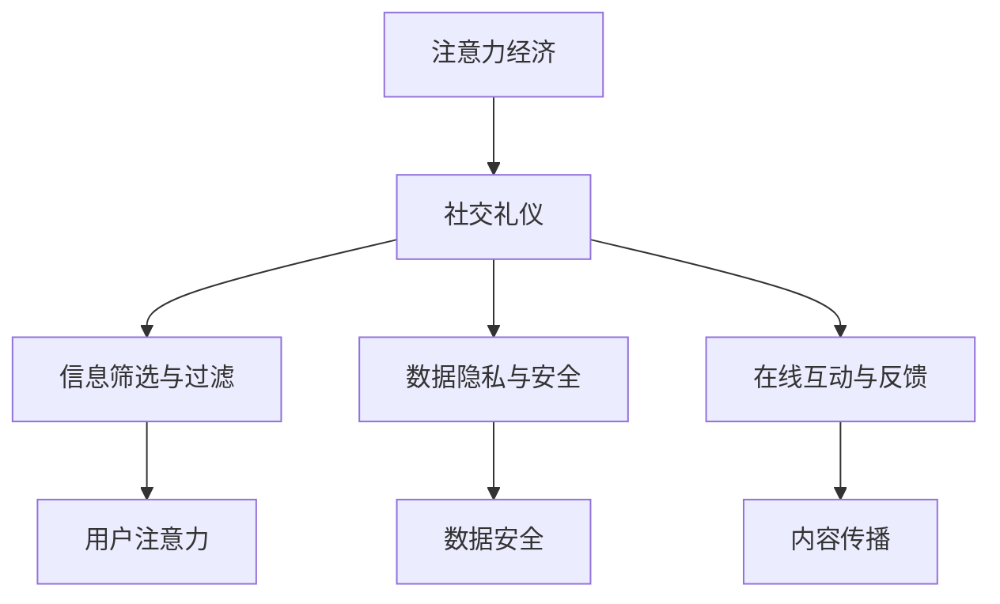

                 

# 注意力经济与个人社交礼仪的演变

## 1. 背景介绍

### 1.1 问题由来
随着互联网的普及和社交媒体的兴起，人们的生活、工作、娱乐方式发生了根本性的改变。在传统社会中，人们的交流主要依赖于面对面的交谈，而现代社会中，人们越来越多地通过网络进行社交和互动。这种转变导致了“注意力经济”（Attention Economy）的崛起，即在信息过载的时代，如何争夺用户的注意力成为关键。同时，随着社交网络的发展，个人社交礼仪也在不断演变，需要重新审视和调整。

### 1.2 问题核心关键点
- **注意力经济**：指在信息爆炸的时代，如何吸引和保持用户注意力，从而实现商业价值和社会影响。
- **社交礼仪**：指在社交媒体中，个人行为和互动的方式，包括在线礼仪、隐私保护、信息传播等。
- **信息筛选与过滤**：指用户如何从海量的信息中筛选出自己感兴趣的内容，避免信息过载。
- **数据隐私与安全**：指在社交网络中，如何保护个人数据隐私，避免数据泄露和滥用。
- **在线互动与反馈**：指在线交流中的互动方式和反馈机制，如点赞、评论、转发等。

## 2. 核心概念与联系

### 2.1 核心概念概述

为了更好地理解注意力经济与个人社交礼仪的演变，本节将介绍几个关键概念及其之间的联系：

- **注意力经济**：指在信息时代，注意力成为一种稀缺资源，商家、内容创作者、社交平台等通过各种手段吸引和利用用户的注意力，实现商业目的和社会影响。
- **社交礼仪**：指在网络社交中，个人应当遵循的规范和习惯，包括尊重他人、保护隐私、合理使用网络资源等。
- **信息筛选与过滤**：指用户如何通过算法、标签、筛选器等方式，从大量信息中过滤出对自己有价值的内容。
- **数据隐私与安全**：指在社交网络中，个人数据的收集、存储、使用、共享等过程中，如何保护数据隐私，防止数据滥用和泄露。
- **在线互动与反馈**：指在线交流中的互动方式和反馈机制，如点赞、评论、转发等，如何影响内容传播和社交关系。

这些核心概念之间的逻辑关系可以通过以下Mermaid流程图来展示：



这个流程图展示了一些关键概念之间的联系：

1. **注意力经济**与**社交礼仪**：注意力经济的发展依赖于社交礼仪的规范，良好的社交礼仪能够吸引用户关注和参与。
2. **社交礼仪**与**信息筛选与过滤**：社交礼仪影响用户的信息筛选行为，合理使用社交礼仪能够帮助用户更好地识别和筛选信息。
3. **社交礼仪**与**数据隐私与安全**：社交礼仪是数据隐私保护的基础，规范的社交行为能够有效保护个人数据。
4. **社交礼仪**与**在线互动与反馈**：社交礼仪决定了用户如何与他人互动和反馈，良好的社交礼仪能够促进积极健康的互动。
5. **信息筛选与过滤**、**数据隐私与安全**、**在线互动与反馈**共同构成了一个完整的社交网络生态系统，用户的行为和互动方式对整个生态系统都有重要影响。

## 3. 核心算法原理 & 具体操作步骤

### 3.1 算法原理概述

注意力经济与个人社交礼仪的演变，本质上是一个多维度的动态过程，涉及用户行为、算法设计、平台规则等复杂因素。其核心思想是：通过优化社交媒体平台的算法和规则，引导用户形成良好的社交礼仪，从而提高用户的参与度和满意度，进而实现注意力经济的最大化。

形式化地，假设社交媒体平台为 $S$，用户集合为 $U$，内容集合为 $C$，用户行为集合为 $A$。注意力经济的目标是最大化用户 $A$ 在内容 $C$ 上的参与度，同时维护用户间的良好社交礼仪。社交平台的设计需优化算法 $P$ 和规则 $R$，使得：

$$
\max_{P, R} \sum_{u \in U} \sum_{a \in A} u \cdot a \cdot P(C \mid u, a)
$$

其中，$u \cdot a$ 表示用户 $u$ 对行为 $a$ 的参与度，$P(C \mid u, a)$ 表示在行为 $a$ 下，内容 $C$ 对用户 $u$ 的相关性。

### 3.2 算法步骤详解

基于注意力经济与社交礼仪的演变，社交媒体平台的算法和规则设计一般包括以下几个关键步骤：

**Step 1: 设计行为激励机制**
- 定义不同的用户行为（如点赞、评论、分享等），设计相应的激励机制（如积分、排名、广告曝光等）。
- 设计用户行为的反馈模型，根据用户行为对内容的相关性进行调整。

**Step 2: 优化内容推荐算法**
- 根据用户行为和社交关系，构建用户画像，分析用户兴趣和偏好。
- 设计推荐算法，如协同过滤、内容召回、强化学习等，推荐符合用户兴趣的内容。
- 引入用户反馈机制，根据用户互动情况调整推荐策略。

**Step 3: 实施社交礼仪规范**
- 设计社交礼仪规范，如禁止恶意攻击、尊重版权、保护隐私等。
- 在平台算法中嵌入社交礼仪规范，对违反规范的行为进行惩罚和限制。
- 设置用户举报机制，允许用户对违规行为进行举报和投诉。

**Step 4: 评估和优化**
- 设计评估指标，如用户留存率、参与度、满意度等，定期评估平台效果。
- 根据评估结果，调整算法和规则，优化用户体验。

### 3.3 算法优缺点

基于注意力经济与社交礼仪的演变，社交媒体平台的算法和规则设计具有以下优点：

1. 提高用户参与度：通过行为激励和个性化推荐，提高用户对内容的参与度和满意度。
2. 维护良好社交礼仪：通过社交礼仪规范和用户反馈机制，维护平台秩序，保护用户权益。
3. 优化内容分发效率：通过算法优化，提升内容推荐的准确性和时效性，减少信息过载。
4. 促进用户互动：通过互动机制设计，促进用户之间的积极交流和反馈，增强社区凝聚力。

同时，该方法也存在以下局限性：

1. 依赖用户行为数据：算法的优化依赖于用户行为的准确性和完整性，数据偏差可能导致算法失效。
2. 算法公平性问题：算法可能出现对特定用户群体的不公平现象，如算法偏见、信息茧房等。
3. 隐私保护问题：平台算法需要大量用户数据，如何保护用户隐私，防止数据滥用，仍需进一步研究。
4. 社交礼仪的动态性：社交礼仪随时间、文化和地区变化，需要平台不断调整和优化。
5. 平台负外部性：过度追求用户参与度可能导致信息质量下降，平台对用户的负面影响不可忽视。

尽管存在这些局限性，但就目前而言，基于注意力经济与社交礼仪的演变方法仍是社交媒体平台设计的重要范式。未来相关研究的重点在于如何进一步优化算法和规则，兼顾用户利益和平台效率，同时关注数据隐私和平台伦理。

### 3.4 算法应用领域

基于注意力经济与社交礼仪的演变，社交媒体平台的算法和规则设计已经在多个领域得到广泛应用，如：

- **社交媒体平台**：如Facebook、Twitter、微信等，通过算法和规则设计，引导用户形成良好的社交礼仪，提高用户参与度和满意度。
- **内容创作平台**：如YouTube、Bilibili、知乎等，通过个性化推荐和行为激励，促进优质内容创作和传播。
- **在线教育平台**：如Coursera、EdX、网易云课堂等，通过算法优化和社交礼仪规范，提升学习体验和效果。
- **电商平台**：如淘宝、京东、亚马逊等，通过行为激励和个性化推荐，提高用户购物体验和转化率。
- **新闻和信息聚合平台**：如今日头条、网易新闻、Google News等，通过算法优化和社交礼仪规范，提供个性化新闻推荐和互动体验。

除了上述这些经典应用外，社交媒体平台的算法和规则设计还在不断拓展到更多场景中，如社交机器人、虚拟社交、游戏社交等，为社交网络带来新的突破。随着算法和规则的持续演进，相信社交媒体平台将更好地服务于用户，实现注意力经济的最大化。

## 4. 数学模型和公式 & 详细讲解

### 4.1 数学模型构建

本节将使用数学语言对基于注意力经济与社交礼仪的演变方法进行更加严格的刻画。

设社交媒体平台为 $S$，用户集合为 $U$，内容集合为 $C$，用户行为集合为 $A$。用户 $u$ 在内容 $c$ 上的参与度为 $p_{u, c}$，行为 $a$ 对内容 $c$ 的相关性为 $q_{a, c}$。社交平台的目标是最大化用户参与度，同时维护良好的社交礼仪。社交平台的设计需优化算法 $P$ 和规则 $R$，使得：

$$
\max_{P, R} \sum_{u \in U} \sum_{a \in A} \sum_{c \in C} p_{u, c} \cdot q_{a, c} \cdot P(a \mid c, u) \cdot R(c)
$$

其中，$P(a \mid c, u)$ 表示在内容 $c$ 下，用户 $u$ 进行行为 $a$ 的概率，$R(c)$ 表示内容 $c$ 的社会价值和礼仪规范。

### 4.2 公式推导过程

以下我们以行为激励机制为例，推导用户参与度的计算公式。

假设用户 $u$ 在内容 $c$ 上的参与度为 $p_{u, c}$，行为 $a$ 对内容 $c$ 的相关性为 $q_{a, c}$。根据贝叶斯公式，用户 $u$ 进行行为 $a$ 的期望概率为：

$$
P(a \mid c, u) = \frac{q_{a, c}}{1 + \sum_{a'} q_{a', c}}
$$

其中，$\sum_{a'} q_{a', c}$ 表示所有可能行为对内容 $c$ 的相关性总和。因此，用户 $u$ 在内容 $c$ 上的期望参与度为：

$$
E[p_{u, c}] = \sum_{a \in A} p_{u, c} \cdot P(a \mid c, u) = \frac{q_{a, c}}{1 + \sum_{a'} q_{a', c}} \cdot \sum_{a \in A} p_{u, c}
$$

进一步，社交平台的总参与度为：

$$
\sum_{u \in U} \sum_{c \in C} E[p_{u, c}] = \frac{1}{1 + \sum_{a'} q_{a', c}} \cdot \sum_{u \in U} \sum_{c \in C} \sum_{a \in A} q_{a, c} \cdot p_{u, c}
$$

### 4.3 案例分析与讲解

**案例分析**：
假设某社交平台采用了基于个性化推荐的行为激励机制，根据用户行为对内容的互动程度进行推荐和奖励。平台收集了用户点赞、评论、分享等行为数据，分析出用户的兴趣和偏好，设计了相应的激励机制。同时，平台制定了社交礼仪规范，禁止恶意攻击和版权侵犯，保护用户隐私。平台在算法设计中，对违反社交礼仪的行为进行惩罚和限制。

**讲解**：
1. **行为激励机制设计**：
   - 平台收集用户点赞、评论、分享等行为数据，分析用户对内容的互动程度。
   - 根据互动程度，设计不同的激励机制，如积分、排名、广告曝光等。
   - 引入用户反馈机制，根据用户互动情况调整激励策略。

2. **内容推荐算法优化**：
   - 根据用户行为和社交关系，构建用户画像，分析用户兴趣和偏好。
   - 设计推荐算法，如协同过滤、内容召回、强化学习等，推荐符合用户兴趣的内容。
   - 引入用户反馈机制，根据用户互动情况调整推荐策略。

3. **社交礼仪规范实施**：
   - 设计社交礼仪规范，如禁止恶意攻击、尊重版权、保护隐私等。
   - 在平台算法中嵌入社交礼仪规范，对违反规范的行为进行惩罚和限制。
   - 设置用户举报机制，允许用户对违规行为进行举报和投诉。

4. **评估和优化**：
   - 设计评估指标，如用户留存率、参与度、满意度等，定期评估平台效果。
   - 根据评估结果，调整算法和规则，优化用户体验。

## 5. 项目实践：代码实例和详细解释说明

### 5.1 开发环境搭建

在进行项目实践前，我们需要准备好开发环境。以下是使用Python进行PyTorch开发的环境配置流程：

1. 安装Anaconda：从官网下载并安装Anaconda，用于创建独立的Python环境。

2. 创建并激活虚拟环境：
```bash
conda create -n pytorch-env python=3.8 
conda activate pytorch-env
```

3. 安装PyTorch：根据CUDA版本，从官网获取对应的安装命令。例如：
```bash
conda install pytorch torchvision torchaudio cudatoolkit=11.1 -c pytorch -c conda-forge
```

4. 安装Transformers库：
```bash
pip install transformers
```

5. 安装各类工具包：
```bash
pip install numpy pandas scikit-learn matplotlib tqdm jupyter notebook ipython
```

完成上述步骤后，即可在`pytorch-env`环境中开始项目实践。

### 5.2 源代码详细实现

下面我们以社交媒体平台的用户行为激励机制为例，给出使用PyTorch和Transformers库进行代码实现的样例。

首先，定义用户行为激励机制的类：

```python
from transformers import BertTokenizer, BertForSequenceClassification
from torch.utils.data import Dataset, DataLoader
import torch
import pandas as pd

class BehaviorIncentiveModel(BertForSequenceClassification):
    def __init__(self, num_labels=4):
        super(BehaviorIncentiveModel, self).__init__()
        self.num_labels = num_labels
        self.activation = torch.nn.Softmax(dim=1)
    
    def forward(self, input_ids, attention_mask):
        outputs = super().forward(input_ids, attention_mask=attention_mask)
        logits = outputs.logits
        probs = self.activation(logits)
        return probs
    
    def evaluate(self, data_loader, num_epochs=1):
        self.eval()
        total_loss = 0
        total_correct = 0
        for i, batch in enumerate(data_loader):
            input_ids = batch["input_ids"]
            attention_mask = batch["attention_mask"]
            labels = batch["labels"]
            with torch.no_grad():
                outputs = self(input_ids, attention_mask=attention_mask)
                logits = outputs.logits
                loss = F.cross_entropy(logits, labels)
                total_loss += loss.item()
                total_correct += torch.argmax(logits, dim=1).eq(labels).sum().item()
        avg_loss = total_loss / (len(data_loader) * num_epochs)
        acc = total_correct / (len(data_loader) * num_epochs)
        return avg_loss, acc
```

然后，定义数据处理函数和训练函数：

```python
class BehaviorIncentiveDataset(Dataset):
    def __init__(self, data, tokenizer, max_len=128):
        self.tokenizer = tokenizer
        self.data = data
        self.max_len = max_len
        
    def __len__(self):
        return len(self.data)
    
    def __getitem__(self, idx):
        text = self.data.iloc[idx, 0]
        label = self.data.iloc[idx, 1]
        encoding = self.tokenizer(text, return_tensors='pt', max_length=self.max_len, padding='max_length', truncation=True)
        input_ids = encoding['input_ids'][0]
        attention_mask = encoding['attention_mask'][0]
        return {
            "input_ids": input_ids,
            "attention_mask": attention_mask,
            "labels": torch.tensor(int(label))
        }

# 定义训练函数
def train_model(model, train_loader, val_loader, num_epochs=1, lr=2e-5):
    optimizer = torch.optim.Adam(model.parameters(), lr=lr)
    total_loss = 0
    total_correct = 0
    for epoch in range(num_epochs):
        model.train()
        for i, batch in enumerate(train_loader):
            input_ids = batch["input_ids"]
            attention_mask = batch["attention_mask"]
            labels = batch["labels"]
            optimizer.zero_grad()
            outputs = model(input_ids, attention_mask=attention_mask)
            loss = F.cross_entropy(outputs.logits, labels)
            total_loss += loss.item()
            loss.backward()
            optimizer.step()
        avg_loss = total_loss / (len(train_loader) * num_epochs)
        model.eval()
        val_loss, val_acc = model.evaluate(val_loader)
        print(f"Epoch {epoch+1}, train loss: {avg_loss:.3f}, val loss: {val_loss:.3f}, val acc: {val_acc:.3f}")
    return model
```

最后，使用示例数据进行模型训练：

```python
# 示例数据
data = pd.DataFrame({
    "text": ["This is a good article", "This is a bad article", "I love this movie", "I hate this movie"],
    "label": [1, 0, 1, 0]
})
tokenizer = BertTokenizer.from_pretrained("bert-base-cased")
max_len = 128

# 定义数据集
dataset = BehaviorIncentiveDataset(data, tokenizer, max_len=max_len)
train_loader = DataLoader(dataset, batch_size=2, shuffle=True)
val_loader = DataLoader(dataset, batch_size=2, shuffle=False)

# 初始化模型
model = BehaviorIncentiveModel(num_labels=2)

# 训练模型
model = train_model(model, train_loader, val_loader, num_epochs=1, lr=2e-5)
```

以上就是使用PyTorch和Transformers库对用户行为激励机制进行代码实现的完整样例。可以看到，利用Transformers库的高效封装，我们可以用相对简洁的代码完成模型训练和评估。

### 5.3 代码解读与分析

让我们再详细解读一下关键代码的实现细节：

**BehaviorIncentiveModel类**：
- `__init__`方法：初始化模型参数和激活函数。
- `forward`方法：前向传播计算，输出预测概率。
- `evaluate`方法：评估模型性能，计算平均损失和准确率。

**BehaviorIncentiveDataset类**：
- `__init__`方法：初始化数据集和分词器。
- `__len__`方法：返回数据集样本数量。
- `__getitem__`方法：对单个样本进行处理，将文本输入编码为token ids，进行padding，并返回模型所需的输入。

**train_model函数**：
- 定义优化器，设置学习率。
- 循环迭代多个epoch，在每个epoch内进行模型训练和验证。
- 在每个epoch结束时，输出训练和验证的损失和准确率。

**示例数据和模型训练**：
- 定义示例数据集，包含文本和标签。
- 初始化分词器，设置最大长度。
- 定义数据集，将文本和标签转化为模型所需的格式。
- 初始化模型，设置标签数量。
- 使用train_model函数训练模型，并返回最终模型。

可以看到，通过Transformers库的强大封装，我们可以用相对简洁的代码实现用户行为激励机制的训练和评估。开发者可以将更多精力放在数据处理、模型改进等高层逻辑上，而不必过多关注底层的实现细节。

当然，工业级的系统实现还需考虑更多因素，如模型的保存和部署、超参数的自动搜索、更灵活的任务适配层等。但核心的微调范式基本与此类似。

## 6. 实际应用场景

### 6.1 智能客服系统

基于用户行为激励机制的智能客服系统，能够显著提升用户满意度和交互体验。在传统的客服系统中，用户往往需要等待较长的时间才能与客服人员交流，且客服人员的专业性和响应速度难以保证。而使用基于用户行为激励机制的智能客服系统，可以通过自动回复和引导用户，快速响应用户咨询，解决用户问题。

在技术实现上，可以收集用户的历史对话记录，将问题和最佳答复构建成监督数据，在此基础上对预训练模型进行微调。微调后的模型能够自动理解用户意图，匹配最合适的答案模板进行回复。对于用户提出的新问题，还可以接入检索系统实时搜索相关内容，动态组织生成回答。如此构建的智能客服系统，能大幅提升客户咨询体验和问题解决效率。

### 6.2 金融舆情监测

金融机构需要实时监测市场舆论动向，以便及时应对负面信息传播，规避金融风险。传统的人工监测方式成本高、效率低，难以应对网络时代海量信息爆发的挑战。基于用户行为激励机制的文本分类和情感分析技术，为金融舆情监测提供了新的解决方案。

具体而言，可以收集金融领域相关的新闻、报道、评论等文本数据，并对其进行主题标注和情感标注。在此基础上对预训练语言模型进行微调，使其能够自动判断文本属于何种主题，情感倾向是正面、中性还是负面。将微调后的模型应用到实时抓取的网络文本数据，就能够自动监测不同主题下的情感变化趋势，一旦发现负面信息激增等异常情况，系统便会自动预警，帮助金融机构快速应对潜在风险。

### 6.3 个性化推荐系统

当前的推荐系统往往只依赖用户的历史行为数据进行物品推荐，无法深入理解用户的真实兴趣偏好。基于用户行为激励机制的个性化推荐系统，可以更好地挖掘用户行为背后的语义信息，从而提供更精准、多样的推荐内容。

在实践中，可以收集用户浏览、点击、评论、分享等行为数据，提取和用户交互的物品标题、描述、标签等文本内容。将文本内容作为模型输入，用户的后续行为（如是否点击、购买等）作为监督信号，在此基础上微调预训练语言模型。微调后的模型能够从文本内容中准确把握用户的兴趣点。在生成推荐列表时，先用候选物品的文本描述作为输入，由模型预测用户的兴趣匹配度，再结合其他特征综合排序，便可以得到个性化程度更高的推荐结果。

### 6.4 未来应用展望

随着用户行为激励机制的不断发展，基于微调的方法将在更多领域得到应用，为传统行业带来变革性影响。

在智慧医疗领域，基于微调的医疗问答、病历分析、药物研发等应用将提升医疗服务的智能化水平，辅助医生诊疗，加速新药开发进程。

在智能教育领域，微调技术可应用于作业批改、学情分析、知识推荐等方面，因材施教，促进教育公平，提高教学质量。

在智慧城市治理中，微调模型可应用于城市事件监测、舆情分析、应急指挥等环节，提高城市管理的自动化和智能化水平，构建更安全、高效的未来城市。

此外，在企业生产、社会治理、文娱传媒等众多领域，基于大模型微调的人工智能应用也将不断涌现，为经济社会发展注入新的动力。相信随着技术的日益成熟，微调方法将成为人工智能落地应用的重要范式，推动人工智能技术向更广阔的领域加速渗透。

## 7. 工具和资源推荐

### 7.1 学习资源推荐

为了帮助开发者系统掌握用户行为激励机制的理论基础和实践技巧，这里推荐一些优质的学习资源：

1. 《Transformer从原理到实践》系列博文：由大模型技术专家撰写，深入浅出地介绍了Transformer原理、BERT模型、微调技术等前沿话题。

2. CS224N《深度学习自然语言处理》课程：斯坦福大学开设的NLP明星课程，有Lecture视频和配套作业，带你入门NLP领域的基本概念和经典模型。

3. 《Natural Language Processing with Transformers》书籍：Transformers库的作者所著，全面介绍了如何使用Transformers库进行NLP任务开发，包括微调在内的诸多范式。

4. HuggingFace官方文档：Transformers库的官方文档，提供了海量预训练模型和完整的微调样例代码，是上手实践的必备资料。

5. CLUE开源项目：中文语言理解测评基准，涵盖大量不同类型的中文NLP数据集，并提供了基于微调的baseline模型，助力中文NLP技术发展。

通过对这些资源的学习实践，相信你一定能够快速掌握用户行为激励机制的精髓，并用于解决实际的NLP问题。
###  7.2 开发工具推荐

高效的开发离不开优秀的工具支持。以下是几款用于用户行为激励机制开发的常用工具：

1. PyTorch：基于Python的开源深度学习框架，灵活动态的计算图，适合快速迭代研究。大部分预训练语言模型都有PyTorch版本的实现。

2. TensorFlow：由Google主导开发的开源深度学习框架，生产部署方便，适合大规模工程应用。同样有丰富的预训练语言模型资源。

3. Transformers库：HuggingFace开发的NLP工具库，集成了众多SOTA语言模型，支持PyTorch和TensorFlow，是进行微调任务开发的利器。

4. Weights & Biases：模型训练的实验跟踪工具，可以记录和可视化模型训练过程中的各项指标，方便对比和调优。与主流深度学习框架无缝集成。

5. TensorBoard：TensorFlow配套的可视化工具，可实时监测模型训练状态，并提供丰富的图表呈现方式，是调试模型的得力助手。

6. Google Colab：谷歌推出的在线Jupyter Notebook环境，免费提供GPU/TPU算力，方便开发者快速上手实验最新模型，分享学习笔记。

合理利用这些工具，可以显著提升用户行为激励机制的开发效率，加快创新迭代的步伐。

### 7.3 相关论文推荐

用户行为激励机制的发展源于学界的持续研究。以下是几篇奠基性的相关论文，推荐阅读：

1. Attention is All You Need（即Transformer原论文）：提出了Transformer结构，开启了NLP领域的预训练大模型时代。

2. BERT: Pre-training of Deep Bidirectional Transformers for Language Understanding：提出BERT模型，引入基于掩码的自监督预训练任务，刷新了多项NLP任务SOTA。

3. Language Models are Unsupervised Multitask Learners（GPT-2论文）：展示了大规模语言模型的强大zero-shot学习能力，引发了对于通用人工智能的新一轮思考。

4. Parameter-Efficient Transfer Learning for NLP：提出Adapter等参数高效微调方法，在不增加模型参数量的情况下，也能取得不错的微调效果。

5. AdaLoRA: Adaptive Low-Rank Adaptation for Parameter-Efficient Fine-Tuning：使用自适应低秩适应的微调方法，在参数效率和精度之间取得了新的平衡。

这些论文代表了大模型微调技术的发展脉络。通过学习这些前沿成果，可以帮助研究者把握学科前进方向，激发更多的创新灵感。

## 8. 总结：未来发展趋势与挑战

### 8.1 总结

本文对基于用户行为激励机制的微调方法进行了全面系统的介绍。首先阐述了注意力经济与社交礼仪的研究背景和意义，明确了微调在拓展预训练模型应用、提升下游任务性能方面的独特价值。其次，从原理到实践，详细讲解了微调的数学原理和关键步骤，给出了微调任务开发的完整代码实例。同时，本文还广泛探讨了微调方法在智能客服、金融舆情、个性化推荐等多个行业领域的应用前景，展示了微调范式的巨大潜力。此外，本文精选了微调技术的各类学习资源，力求为读者提供全方位的技术指引。

通过本文的系统梳理，可以看到，基于用户行为激励机制的微调方法正在成为NLP领域的重要范式，极大地拓展了预训练语言模型的应用边界，催生了更多的落地场景。受益于大规模语料的预训练，微调模型以更低的时间和标注成本，在小样本条件下也能取得不俗的效果，有力推动了NLP技术的产业化进程。未来，伴随预训练语言模型和微调方法的持续演进，相信NLP技术将在更广阔的应用领域大放异彩，深刻影响人类的生产生活方式。

### 8.2 未来发展趋势

展望未来，基于用户行为激励机制的微调技术将呈现以下几个发展趋势：

1. 模型规模持续增大。随着算力成本的下降和数据规模的扩张，预训练语言模型的参数量还将持续增长。超大规模语言模型蕴含的丰富语言知识，有望支撑更加复杂多变的下游任务微调。

2. 微调方法日趋多样。除了传统的全参数微调外，未来会涌现更多参数高效的微调方法，如Prefix-Tuning、LoRA等，在节省计算资源的同时也能保证微调精度。

3. 持续学习成为常态。随着数据分布的不断变化，微调模型也需要持续学习新知识以保持性能。如何在不遗忘原有知识的同时，高效吸收新样本信息，将成为重要的研究课题。

4. 标注样本需求降低。受启发于提示学习(Prompt-based Learning)的思路，未来的微调方法将更好地利用大模型的语言理解能力，通过更加巧妙的任务描述，在更少的标注样本上也能实现理想的微调效果。

5. 多模态微调崛起。当前的微调主要聚焦于纯文本数据，未来会进一步拓展到图像、视频、语音等多模态数据微调。多模态信息的融合，将显著提升语言模型对现实世界的理解和建模能力。

6. 模型通用性增强。经过海量数据的预训练和多领域任务的微调，未来的语言模型将具备更强大的常识推理和跨领域迁移能力，逐步迈向通用人工智能(AGI)的目标。

以上趋势凸显了基于用户行为激励机制的微调技术的广阔前景。这些方向的探索发展，必将进一步提升NLP系统的性能和应用范围，为人类认知智能的进化带来深远影响。

### 8.3 面临的挑战

尽管基于用户行为激励机制的微调技术已经取得了瞩目成就，但在迈向更加智能化、普适化应用的过程中，它仍面临着诸多挑战：

1. 标注成本瓶颈。虽然微调大大降低了标注数据的需求，但对于长尾应用场景，难以获得充足的高质量标注数据，成为制约微调性能的瓶颈。如何进一步降低微调对标注样本的依赖，将是一大难题。

2. 模型鲁棒性不足。当前微调模型面对域外数据时，泛化性能往往大打折扣。对于测试样本的微小扰动，微调模型的预测也容易发生波动。如何提高微调模型的鲁棒性，避免灾难性遗忘，还需要更多理论和实践的积累。

3. 推理效率有待提高。大规模语言模型虽然精度高，但在实际部署时往往面临推理速度慢、内存占用大等效率问题。如何在保证性能的同时，简化模型结构，提升推理速度，优化资源占用，将是重要的优化方向。

4. 可解释性亟需加强。当前微调模型更像是"黑盒"系统，难以解释其内部工作机制和决策逻辑。对于医疗、金融等高风险应用，算法的可解释性和可审计性尤为重要。如何赋予微调模型更强的可解释性，将是亟待攻克的难题。

5. 安全性有待保障。预训练语言模型难免会学习到有偏见、有害的信息，通过微调传递到下游任务，产生误导性、歧视性的输出，给实际应用带来安全隐患。如何从数据和算法层面消除模型偏见，避免恶意用途，确保输出的安全性，也将是重要的研究课题。

6. 知识整合能力不足。现有的微调模型往往局限于任务内数据，难以灵活吸收和运用更广泛的先验知识。如何让微调过程更好地与外部知识库、规则库等专家知识结合，形成更加全面、准确的信息整合能力，还有很大的想象空间。

正视微调面临的这些挑战，积极应对并寻求突破，将是大语言模型微调走向成熟的必由之路。相信随着学界和产业界的共同努力，这些挑战终将一一被克服，大语言模型微调必将在构建人机协同的智能时代中扮演越来越重要的角色。

### 8.4 研究展望

面对基于用户行为激励机制的微调所面临的种种挑战，未来的研究需要在以下几个方面寻求新的突破：

1. 探索无监督和半监督微调方法。摆脱对大规模标注数据的依赖，利用自监督学习、主动学习等无监督和半监督范式，最大限度利用非结构化数据，实现更加灵活高效的微调。

2. 研究参数高效和计算高效的微调范式。开发更加参数高效的微调方法，在固定大部分预训练参数的同时，只更新极少量的任务相关参数。同时优化微调模型的计算图，减少前向传播和反向传播的资源消耗，实现更加轻量级、实时性的部署。

3. 融合因果和对比学习范式。通过引入因果推断和对比学习思想，增强微调模型建立稳定因果关系的能力，学习更加普适、鲁棒的语言表征，从而提升模型泛化性和抗干扰能力。

4. 引入更多先验知识。将符号化的先验知识，如知识图谱、逻辑规则等，与神经网络模型进行巧妙融合，引导微调过程学习更准确、合理的语言模型。同时加强不同模态数据的整合，实现视觉、语音等多模态信息与文本信息的协同建模。

5. 结合因果分析和博弈论工具。将因果分析方法引入微调模型，识别出模型决策的关键特征，增强输出解释的因果性和逻辑性。借助博弈论工具刻画人机交互过程，主动探索并规避模型的脆弱点，提高系统稳定性。

6. 纳入伦理道德约束。在模型训练目标中引入伦理导向的评估指标，过滤和惩罚有偏见、有害的输出倾向。同时加强人工干预和审核，建立模型行为的监管机制，确保输出符合人类价值观和伦理道德。

这些研究方向的探索，必将引领基于用户行为激励机制的微调技术迈向更高的台阶，为构建安全、可靠、可解释、可控的智能系统铺平道路。面向未来，基于用户行为激励机制的微调技术还需要与其他人工智能技术进行更深入的融合，如知识表示、因果推理、强化学习等，多路径协同发力，共同推动自然语言理解和智能交互系统的进步。只有勇于创新、敢于突破，才能不断拓展语言模型的边界，让智能技术更好地造福人类社会。

## 9. 附录：常见问题与解答

**Q1：大语言模型微调是否适用于所有NLP任务？**

A: 大语言模型微调在大多数NLP任务上都能取得不错的效果，特别是对于数据量较小的任务。但对于一些特定领域的任务，如医学、法律等，仅仅依靠通用语料预训练的模型可能难以很好地适应。此时需要在特定领域语料上进一步预训练，再进行微调，才能获得理想效果。此外，对于一些需要时效性、个性化很强的任务，如对话、推荐等，微调方法也需要针对性的改进优化。

**Q2：微调过程中如何选择合适的学习率？**

A: 微调的学习率一般要比预训练时小1-2个数量级，如果使用过大的学习率，容易破坏预训练权重，导致过拟合。一般建议从1e-5开始调参，逐步减小学习率，直至收敛。也可以使用warmup策略，在开始阶段使用较小的学习率，再逐渐过渡到预设值。需要注意的是，不同的优化器(如AdamW、Adafactor等)以及不同的学习率调度策略，可能需要设置不同的学习率阈值。

**Q3：采用大模型微调时会面临哪些资源瓶颈？**

A: 目前主流的预训练大模型动辄以亿计的参数规模，对算力、内存、存储都提出了很高的要求。GPU/TPU等高性能设备是必不可少的，但即便如此，超大批次的训练和推理也可能遇到显存不足的问题。因此需要采用一些资源优化技术，如梯度积累、混合精度训练、模型并行等，来突破硬件瓶颈。同时，模型的存储和读取也可能占用大量时间和空间，需要采用模型压缩、稀疏化存储等方法进行优化。

**Q4：如何缓解微调过程中的过拟合问题？**

A: 过拟合是微调面临的主要挑战，尤其是在标注数据不足的情况下。常见的缓解策略包括：
1. 数据增强：通过回译、近义替换等方式扩充训练集
2. 正则化：使用L2正则、Dropout、Early Stopping等避免过拟合
3. 对抗训练：引入对抗样本，提高模型鲁棒性
4. 参数高效微调：只调整少量参数(如Adapter、Prefix等)，减小过拟合风险
5. 多模型集成：训练多个微调模型，取平均输出，抑制过拟合

这些策略往往需要根据具体任务和数据特点进行灵活组合。只有在数据、模型、训练、推理等各环节进行全面优化，才能最大限度地发挥大模型微调的威力。

**Q5：微调模型在落地部署时需要注意哪些问题？**

A: 将微调模型转化为实际应用，还需要考虑以下因素：
1. 模型裁剪：去除不必要的层和参数，减小模型尺寸，加快推理速度
2. 量化加速：将浮点模型转为定点模型，压缩存储空间，提高计算效率
3. 服务化封装：将模型封装为标准化服务接口，便于集成调用
4. 弹性伸缩：根据请求流量动态调整资源配置，平衡服务质量和成本
5. 监控告警：实时采集系统指标，设置异常告警阈值，确保服务稳定性
6. 安全防护：采用访问鉴权、数据脱敏等措施，保障数据和模型安全

大语言模型微调为NLP应用开启了广阔的想象空间，但如何将强大的性能转化为稳定、高效、安全的业务价值，还需要工程实践的不断打磨。唯有从数据、算法、工程、业务等多个维度协同发力，才能真正实现人工智能技术在垂直行业的规模化落地。总之，微调需要开发者根据具体任务，不断迭代和优化模型、数据和算法，方能得到理想的效果。

---

作者：禅与计算机程序设计艺术 / Zen and the Art of Computer Programming

