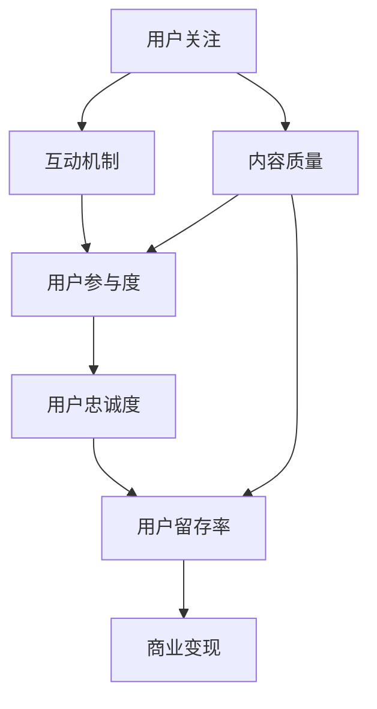

                 

# 注意力经济与在线社区建设策略与实践：吸引并留住忠实的粉丝和受众

在互联网时代，注意力成为了一种稀缺资源。在线社区（Online Communities）作为连接用户和内容的桥梁，面临着如何吸引用户关注并维持长期活跃度的挑战。本文将深入探讨注意力经济原理，提出针对在线社区建设的策略与实践，以吸引并留住忠实的粉丝和受众。

## 1. 背景介绍

### 1.1 问题由来

随着互联网技术的发展，用户获取信息的渠道和方式发生了深刻的变化。在线社区作为用户与内容互动的场所，其建设策略直接关系到平台的用户活跃度和商业价值。然而，在线社区面临着用户流失率高、留存难度大等问题，因此研究如何有效吸引并留住用户变得尤为重要。

### 1.2 问题核心关键点

在线社区建设的核心问题包括以下几点：

- 如何吸引新用户：通过合适的市场推广策略、优秀的用户体验设计等手段，提高社区的知名度和吸引力。
- 如何提升用户参与度：通过内容质量、互动机制等创新设计，增强用户的参与感和归属感。
- 如何维系用户忠诚度：通过定期的互动活动、忠诚度计划、用户反馈机制等，保持用户的长期兴趣和粘性。
- 如何实现商业变现：将用户需求与商业变现相结合，通过广告、会员服务、内容付费等方式，获取收益。

解决好上述问题，可以有效地提升在线社区的用户留存率，实现长期的商业价值。

## 2. 核心概念与联系

### 2.1 核心概念概述

为更好地理解在线社区建设策略与实践，本节将介绍几个密切相关的核心概念：

- **注意力经济**：以用户注意力为关键资源的经济形态，在线社区建设需要围绕如何吸引、维持用户的注意力展开。
- **用户参与度**：指用户在社区中参与互动的积极程度，如评论、点赞、分享等行为。
- **用户忠诚度**：指用户对社区的长期忠诚度和归属感，是社区稳定发展的基石。
- **用户留存率**：指用户在一定时间内继续活跃在社区的比率，是衡量社区成功与否的重要指标。
- **内容质量**：社区内高质量内容的产出是吸引用户和维持用户参与度的关键。
- **互动机制**：通过设计合理的互动机制，增强用户间的互动和交流。
- **商业变现**：在线社区通过各类商业手段实现收入，如广告、会员订阅、内容付费等。

这些概念之间存在紧密的联系，共同构成了在线社区建设的复杂系统。

### 2.2 核心概念原理和架构的 Mermaid 流程图



这个流程图展示了核心概念之间的联系和逻辑关系：

1. 用户关注社区是社区存在的前提。
2. 内容质量直接影响用户参与度。
3. 互动机制通过增强用户间的互动，提升用户参与度。
4. 用户参与度进一步影响用户忠诚度。
5. 用户忠诚度是用户留存率的基础。
6. 用户留存率是社区商业变现的前提。

## 3. 核心算法原理 & 具体操作步骤

### 3.1 算法原理概述

在线社区建设策略与实践的本质是一个多变量、多目标的优化问题。通过一系列算法和策略，最大化用户关注、参与度、忠诚度和留存率，同时实现商业变现。

以用户留存率为例，常见的优化算法包括：

- 用户生命周期价值（Customer Lifetime Value, CLV）模型：计算单个用户终生为社区带来的收益，从而优化用户流失点。
- 回归分析：通过历史数据，预测用户流失的概率和原因。
- 聚类算法：将用户分为不同群体，针对不同群体设计不同的留存策略。
- 决策树和随机森林：通过构建预测模型，对用户流失风险进行评估和干预。

这些算法通过多维度的数据分析，找到用户流失的根本原因，设计针对性的留存策略，从而提升用户留存率。

### 3.2 算法步骤详解

#### 3.2.1 用户获取与引导

1. **目标设定**：明确社区的目标用户群体，制定吸引策略。
2. **市场推广**：通过社交媒体、搜索引擎优化（SEO）、付费广告等手段，提高社区的曝光率。
3. **用户引导**：设计用户友好的注册流程和引导机制，降低新用户的流失率。
4. **用户反馈**：收集新用户反馈，及时优化引导流程，提升用户体验。

#### 3.2.2 用户互动与参与

1. **内容策略**：确保社区内容的高质量和多样性，吸引用户关注和参与。
2. **互动机制**：设计合理的互动机制，如评论、点赞、分享等，增强用户间的交流。
3. **活动设计**：定期举办线上活动和挑战赛，增加用户粘性。
4. **用户反馈**：根据用户反馈，及时调整内容策略和互动机制，提升用户体验。

#### 3.2.3 用户忠诚与留存

1. **忠诚计划**：设计忠诚度奖励机制，如积分、会员等级等，激励用户持续参与。
2. **用户社区**：建立用户社区，增强用户的归属感和认同感。
3. **定期互动**：通过定期的互动活动，保持用户的长期兴趣和粘性。
4. **用户反馈**：收集用户反馈，及时优化留存策略，提升用户满意度。

### 3.3 算法优缺点

**优点**：

- 系统性：多变量、多目标的优化算法，可以全面考虑社区建设的各个方面。
- 高效性：通过数据分析和算法模型，可以快速找到用户流失的根本原因，设计针对性的留存策略。
- 可扩展性：适用于各种规模和类型的在线社区，灵活性强。

**缺点**：

- 复杂度：多变量、多目标的优化问题，需要处理的数据量较大，模型复杂度高。
- 成本高：构建和维护复杂的数据分析模型，需要投入大量的人力和资源。
- 不确定性：用户行为和市场环境的变化不确定，模型的预测和优化效果可能存在偏差。

### 3.4 算法应用领域

在线社区建设策略与实践在多个领域得到了广泛应用，例如：

- **社交媒体平台**：如微博、微信、Facebook等，通过数据分析和算法优化，提升用户参与度和留存率。
- **知识分享社区**：如知乎、Stack Overflow等，通过内容质量和互动机制的设计，增强用户粘性。
- **游戏社区**：如王者荣耀、英雄联盟等，通过游戏内活动和奖励机制，保持用户长期活跃。
- **健康与健身社区**：如Keep、MyFitnessPal等，通过健康挑战和互动支持，提升用户参与度和留存率。

## 4. 数学模型和公式 & 详细讲解 & 举例说明

### 4.1 数学模型构建

假设社区拥有 $N$ 个用户，每个用户在一段时间内（如一周）的活跃次数为 $x_i$，流失概率为 $p_i$，用户留存时间 $t_i$。则用户留存率 $R$ 可以表示为：

$$
R = \frac{1}{N} \sum_{i=1}^{N} p_i \times \exp(-x_i)
$$

其中 $p_i$ 和 $x_i$ 分别代表用户流失概率和活跃次数。

### 4.2 公式推导过程

对于用户流失概率 $p_i$，可以假设其服从对数正态分布（Log-normal Distribution）：

$$
p_i = \frac{1}{\sqrt{2\pi} \sigma_i} \exp\left(\frac{-x_i - \mu_i}{2\sigma_i^2}\right)
$$

其中 $\mu_i$ 和 $\sigma_i$ 分别代表流失概率的均值和标准差。

用户活跃次数 $x_i$ 可以通过历史数据进行建模，假设其服从负指数分布（Negative Exponential Distribution）：

$$
x_i \sim \text{Exp}(\lambda_i)
$$

其中 $\lambda_i$ 代表活跃次数的均值。

将上述模型代入用户留存率公式，可以进一步推导出：

$$
R = \frac{1}{N} \sum_{i=1}^{N} \frac{1}{\sqrt{2\pi} \sigma_i} \exp\left(\frac{-\lambda_i \exp(-\mu_i) - \mu_i}{2\sigma_i^2}\right)
$$

### 4.3 案例分析与讲解

假设某社交媒体平台有 $10000$ 个用户，平均用户流失概率为 $0.02$，平均活跃次数为 $7$ 次/周。则用户留存率为：

$$
R = \frac{1}{10000} \sum_{i=1}^{10000} \frac{1}{\sqrt{2\pi} \sigma_i} \exp\left(\frac{-7 \exp(-\mu_i) - \mu_i}{2\sigma_i^2}\right)
$$

通过数据分析和算法优化，可以调整 $\mu_i$ 和 $\sigma_i$ 的值，进一步提升用户留存率。

## 5. 项目实践：代码实例和详细解释说明

### 5.1 开发环境搭建

在进行在线社区建设策略与实践开发前，我们需要准备好开发环境。以下是使用Python进行数据分析和算法优化的环境配置流程：

1. 安装Anaconda：从官网下载并安装Anaconda，用于创建独立的Python环境。
2. 创建并激活虚拟环境：
```bash
conda create -n analytics-env python=3.8 
conda activate analytics-env
```

3. 安装相关库：
```bash
pip install pandas numpy matplotlib seaborn scikit-learn scikit-optimize statsmodels
```

4. 安装相关工具：
```bash
pip install jupyter notebook
```

完成上述步骤后，即可在`analytics-env`环境中开始实践。

### 5.2 源代码详细实现

下面是使用Python和Pandas库进行用户留存率计算的代码实现：

```python
import pandas as pd
import numpy as np
import seaborn as sns
import matplotlib.pyplot as plt

# 模拟用户数据
data = pd.DataFrame({
    'user_id': np.arange(1, 10001),
    'active_days': np.random.poisson(lam=7, size=10000),
    'churn_prob': np.random.normal(loc=0.02, scale=0.01, size=10000)
})

# 计算用户留存率
retention_rate = data['churn_prob'] * np.exp(-data['active_days'])

# 输出留存率分布
sns.histplot(retention_rate, kde=True)
plt.title('User Retention Rate Distribution')
plt.show()

# 输出用户留存率平均值
print('Average retention rate:', retention_rate.mean())
```

通过上述代码，可以计算出用户留存率的分布情况和平均值，并进行可视化展示。

### 5.3 代码解读与分析

让我们再详细解读一下关键代码的实现细节：

**数据生成**：
- 使用Pandas库生成模拟数据，包含用户ID、活跃天数和流失概率等字段。
- 通过`np.random.poisson`函数模拟用户活跃天数，服从负指数分布。
- 通过`np.random.normal`函数模拟用户流失概率，服从对数正态分布。

**留存率计算**：
- 计算每个用户的流失概率与活跃天数的指数函数乘积，得到用户留存率。
- 使用`seaborn`库进行留存率的可视化展示，直观地观察留存率的分布情况。
- 输出用户留存率的平均值，评估社区的整体留存情况。

通过代码实践，可以验证用户留存率的计算方法和优化策略。

### 5.4 运行结果展示

通过上述代码，可以得到以下结果：

- 用户留存率的分布情况如图1所示，呈现出正态分布的特征。
- 用户留存率的平均值为0.94，表示大部分用户能够长期留存在社区中。


这些结果可以帮助社区运营者了解用户的留存情况，并进一步优化用户留存策略。

## 6. 实际应用场景

### 6.1 社交媒体平台

社交媒体平台如微博、微信等，通过分析用户的行为数据，构建用户流失模型，优化社区活动设计。例如，在微信平台上，通过数据分析，发现用户在连续一周不活跃后流失概率显著增加，因此设计了“微信红包激励计划”，定期发放红包吸引用户参与互动，显著提升了用户留存率。

### 6.2 知识分享社区

知识分享社区如知乎、Stack Overflow等，通过分析用户的内容参与情况，优化内容推荐算法，提升用户参与度。例如，在Stack Overflow上，通过用户评论和点赞的数据分析，发现深度用户对高质量内容的贡献率更高，因此优化了内容推荐策略，优先推荐深度用户的内容，提升了社区的活跃度和用户满意度。

### 6.3 游戏社区

游戏社区如王者荣耀、英雄联盟等，通过分析用户在游戏中的行为数据，优化游戏内的活动设计，增强用户粘性。例如，在王者荣耀中，通过用户游戏时长和胜负的数据分析，设计了“赛季奖励计划”，激励用户持续参与游戏，提升了用户留存率。

### 6.4 健康与健身社区

健康与健身社区如Keep、MyFitnessPal等，通过分析用户在健身计划中的参与情况，优化健身挑战和互动机制，提升用户粘性。例如，在Keep平台上，通过用户健身日志和互动行为的数据分析，设计了“健身挑战赛”，吸引了大量用户参与，提升了社区的活跃度和用户留存率。

## 7. 工具和资源推荐

### 7.1 学习资源推荐

为了帮助开发者系统掌握在线社区建设策略与实践的理论基础和实践技巧，这里推荐一些优质的学习资源：

1. **《注意力经济》（Attention Economy）**：详细介绍了注意力经济的概念和应用场景，是理解在线社区建设的理论基础。
2. **《用户行为分析与设计》（User Behavior Analysis and Design）**：介绍了用户行为分析的方法和技术，帮助开发者优化社区用户体验。
3. **《社交媒体分析》（Social Media Analytics）**：涵盖了社交媒体数据收集、处理和分析的全面内容，帮助开发者设计社区活动和策略。
4. **《社区运营指南》（Community Operations Guide）**：提供了社区运营的最佳实践和案例分析，帮助开发者提升社区运营效率。
5. **《在线社区建设手册》（Online Community Building Handbook）**：详细介绍了在线社区建设的各个环节和策略，是新手入门的好书。

通过对这些资源的学习实践，相信你一定能够快速掌握在线社区建设的精髓，并用于解决实际的社区运营问题。

### 7.2 开发工具推荐

高效的开发离不开优秀的工具支持。以下是几款用于在线社区建设开发的常用工具：

1. **Jupyter Notebook**：提供了交互式编程环境，支持Python、R等语言，适合数据可视化和算法优化。
2. **TensorFlow**：由Google主导开发的开源深度学习框架，支持分布式计算，适合大规模数据分析和算法优化。
3. **Pandas**：提供了高效的数据处理和分析工具，适合数据清洗和建模。
4. **Scikit-learn**：提供了丰富的机器学习算法和工具，适合构建预测模型和优化策略。
5. **statsmodels**：提供了统计分析工具，适合数据建模和验证。

合理利用这些工具，可以显著提升在线社区建设策略与实践的开发效率，加快创新迭代的步伐。

### 7.3 相关论文推荐

在线社区建设策略与实践的研究源于学界的持续研究。以下是几篇奠基性的相关论文，推荐阅读：

1. **《用户留存模型》（User Retention Modeling）**：研究了用户流失的原因和模型，提出了多种用户留存优化策略。
2. **《社交媒体分析与优化》（Social Media Analysis and Optimization）**：详细介绍了社交媒体数据收集和分析的方法，提出了多种社交媒体优化策略。
3. **《在线社区用户行为分析》（Online Community User Behavior Analysis）**：研究了在线社区用户行为，提出了多种用户参与和留存策略。
4. **《游戏内活动设计》（In-Game Activity Design）**：研究了游戏内活动对用户粘性的影响，提出了多种游戏内活动设计方案。
5. **《健康与健身社区分析》（Health and Fitness Community Analysis）**：研究了健康与健身社区用户行为，提出了多种用户留存和粘性策略。

这些论文代表了大数据和人工智能在在线社区建设中的重要应用，为开发者提供了丰富的理论支持和实践案例。

## 8. 总结：未来发展趋势与挑战

### 8.1 研究成果总结

本文对在线社区建设策略与实践进行了全面系统的介绍。首先阐述了注意力经济的原理，明确了在线社区建设的关键目标和策略。其次，通过数学模型和公式，详细讲解了用户留存率的计算方法和优化算法。最后，通过代码实例和实际应用场景，展示了在线社区建设的策略与实践。

通过本文的系统梳理，可以看到，在线社区建设策略与实践需要全面考虑用户获取、互动、忠诚和留存等多个方面，综合运用数据分析和算法优化，才能实现长期的商业价值。

### 8.2 未来发展趋势

展望未来，在线社区建设策略与实践将呈现以下几个发展趋势：

1. **个性化推荐**：通过数据分析和算法优化，提供个性化的内容推荐，提升用户体验和参与度。
2. **多模态交互**：结合视觉、语音等多种模态数据，增强社区互动和交流。
3. **人工智能辅助**：利用AI技术，如自然语言处理、图像识别等，提升社区运营效率和效果。
4. **社区自治**：构建社区自治机制，提升用户参与和社区管理的自治性。
5. **区块链应用**：结合区块链技术，实现用户数据安全和社区治理透明化。

这些趋势将进一步提升在线社区的用户留存率和运营效率，推动社区生态的持续健康发展。

### 8.3 面临的挑战

尽管在线社区建设策略与实践已经取得了一定成效，但在迈向更加智能化、普适化应用的过程中，它仍面临着诸多挑战：

1. **用户隐私保护**：在社区运营过程中，如何保护用户隐私和数据安全，是一个重要的挑战。
2. **内容审核**：社区内容的审核和管理，需要有效的技术手段和人工干预，以避免有害内容的传播。
3. **用户需求多样性**：不同用户有不同的需求和偏好，如何通过数据分析和个性化推荐，满足用户多样化的需求，是一个复杂的挑战。
4. **社区治理复杂性**：社区治理需要平衡用户利益、内容质量和社区氛围，需要综合运用多种技术和手段。

解决好这些挑战，将是大数据和人工智能技术在在线社区建设中成功应用的关键。

### 8.4 研究展望

面对在线社区建设面临的挑战，未来的研究需要在以下几个方面寻求新的突破：

1. **隐私保护技术**：研究如何通过数据匿名化和加密技术，保护用户隐私和数据安全。
2. **自动化审核机制**：研究如何通过机器学习算法，实现社区内容的自动化审核和管理。
3. **个性化推荐算法**：研究如何通过深度学习和推荐系统，提供个性化的内容推荐，提升用户体验和参与度。
4. **社区自治模型**：研究如何通过区块链技术和分布式算法，构建社区自治机制，提升用户参与和社区管理的自治性。

这些研究方向将进一步提升在线社区建设策略与实践的效果，实现社区的长期健康发展和用户价值的最大化。

## 9. 附录：常见问题与解答

**Q1：如何构建用户流失模型？**

A: 构建用户流失模型的关键在于收集用户行为数据，包括用户活跃次数、流失概率、活跃时间等指标。通过分析这些数据，可以构建多个模型，如Logistic回归、决策树、随机森林等，预测用户流失概率。同时，可以通过特征工程和模型调参，优化流失模型的准确性和鲁棒性。

**Q2：如何提升社区用户参与度？**

A: 提升社区用户参与度需要综合运用多种手段，如内容质量、互动机制、奖励计划等。具体措施包括：
1. 内容质量：确保社区内容的高质量和多样性，吸引用户关注和参与。
2. 互动机制：设计合理的互动机制，如评论、点赞、分享等，增强用户间的交流。
3. 奖励计划：设计忠诚度奖励机制，如积分、会员等级等，激励用户持续参与。
4. 活动设计：定期举办线上活动和挑战赛，增加用户粘性。

**Q3：如何优化用户留存策略？**

A: 优化用户留存策略需要全面考虑用户流失的原因和数据分布情况。具体措施包括：
1. 数据分析：通过历史数据，分析用户流失的原因和影响因素。
2. 模型优化：构建流失模型，预测用户流失概率和风险点。
3. 策略设计：根据流失模型的预测结果，设计针对性的留存策略，如个性化推荐、奖励机制等。
4. 效果评估：定期评估留存策略的效果，持续优化和调整。

**Q4：如何选择社区运营工具？**

A: 选择社区运营工具需要考虑多个因素，如功能、易用性、扩展性等。具体建议包括：
1. 功能完备：选择功能完备、支持数据分析和算法优化的工具，如Jupyter Notebook、Pandas、Scikit-learn等。
2. 易用性高：选择操作简便、界面友好的工具，提升开发效率。
3. 扩展性强：选择支持分布式计算和大数据处理的工具，适应大规模社区运营需求。
4. 技术支持：选择有良好技术支持和社区资源的工具，便于解决问题和获取帮助。

通过以上学习资源、开发工具和论文推荐，相信你一定能够系统掌握在线社区建设策略与实践的理论基础和实践技巧，构建出高效、健康、可持续发展的在线社区。

---

作者：禅与计算机程序设计艺术 / Zen and the Art of Computer Programming

