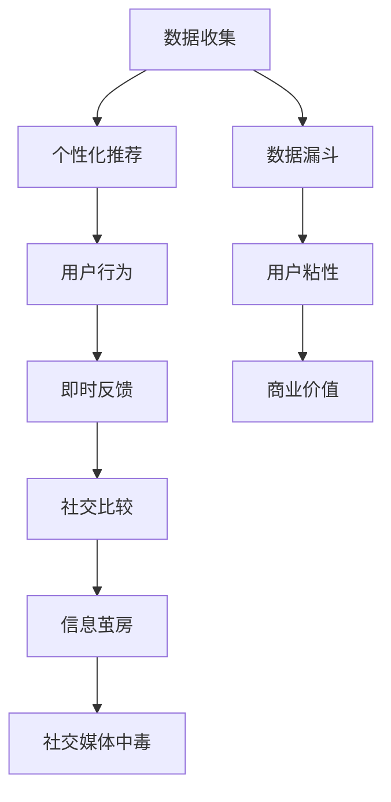

                 

# 注意力经济与社交媒体中毒：如何打破循环并获得自由

> 关键词：注意力经济, 社交媒体中毒, 数据漏斗, 信息茧房, 个人自由, 用户决策, 行为改变

## 1. 背景介绍

### 1.1 问题由来

在数字化时代，注意力经济（Attention Economy）已成为一种普遍的经济形态。无论是新闻业、娱乐业还是电子商务，都在争夺用户有限的时间、注意力资源。社交媒体作为注意力经济的典型代表，通过各种算法和推荐系统，不断地将用户信息推送到眼前，使人们沉浸其中，无法自拔。

### 1.2 问题核心关键点

社交媒体平台对用户注意力的争夺，本质上是通过数据收集、分析和推荐，形成了一个用户行为、内容和反馈的闭环反馈系统。这种系统通过不断增强的信息过滤和推荐机制，逐渐固化用户的注意力分布，最终导致信息茧房（Echo Chambers）和社交媒体中毒（Social Media Addiction）问题。

## 2. 核心概念与联系

### 2.1 核心概念概述

为更好地理解注意力经济和社交媒体中毒问题，本节将介绍几个关键概念及其相互关系：

- **注意力经济（Attention Economy）**：指在信息爆炸的时代，用户注意力的稀缺性成为一种经济资源，成为企业争抢的对象。通过个性化推荐、内容推送等方式，企业不断将注意力资源转化为商业价值。

- **社交媒体中毒（Social Media Addiction）**：指用户过度依赖社交媒体，导致时间、精力过度消耗，生活、工作、学习受到严重影响的心理和行为状态。其成因包括算法推送、即时反馈、社交比较等心理因素。

- **信息茧房（Echo Chambers）**：指用户在社交媒体上接收到相似信息，导致其观点和信息获取范围被限缩在一定的范围内，无法接触更广泛的信息和观点，形成自我封闭的信息环境。

- **数据漏斗（Data Funnel）**：指从用户输入、浏览到点击、评论，再到分享的过程，社交媒体平台不断收集和分析用户行为数据，进行有针对性的推荐，从而增强用户粘性，形成数据驱动的用户行为模式。

这些概念之间的逻辑关系可以通过以下Mermaid流程图来展示：



这个流程图展示了这个复杂系统的工作原理：社交媒体平台通过数据收集和个性化推荐，不断增强用户粘性，形成即时反馈和社交比较机制，进而固化用户的信息茧房，最终导致用户过度依赖，形成社交媒体中毒问题。

## 3. 核心算法原理 & 具体操作步骤
### 3.1 算法原理概述

注意力经济和社交媒体中毒的核心在于个性化推荐算法，其基本原理为：通过分析用户的浏览历史、点击行为、点赞、评论等数据，学习用户的兴趣偏好，从而有针对性地推送相关内容。

这种推荐算法基于以下几个关键步骤：

1. **用户特征提取**：从用户行为数据中提取特征，如浏览时长、点击频率、点赞数、评论内容等。
2. **内容特征提取**：对发布内容进行特征提取，如关键词、标签、时间、地理位置等。
3. **相似度计算**：使用协同过滤、向量空间模型等方法，计算用户和内容之间的相似度。
4. **推荐排序**：根据相似度计算结果，对推荐内容进行排序，展示给用户。

### 3.2 算法步骤详解

以下是基于协同过滤和向量空间模型的推荐算法详细步骤：

1. **用户特征提取**：
   - 收集用户的浏览历史、点击行为、点赞、评论等数据。
   - 对数据进行清洗、归一化等预处理，提取用户兴趣特征。

2. **内容特征提取**：
   - 对发布内容进行分词、向量化等处理。
   - 提取内容特征，如关键词、标签、时间、地理位置等。

3. **相似度计算**：
   - 对用户和内容分别进行特征向量化。
   - 计算用户和内容之间的余弦相似度，得到相似度矩阵。

4. **推荐排序**：
   - 根据相似度矩阵，对推荐内容进行排序。
   - 展示给用户前N条内容。

### 3.3 算法优缺点

基于协同过滤和向量空间模型的推荐算法具有以下优点：

1. **个性化推荐**：能够根据用户兴趣和行为，提供个性化推荐，提升用户满意度。
2. **可扩展性强**：可以处理大规模数据集，适用于社交媒体平台的实时推荐系统。
3. **效果显著**：在实验和实际应用中，通常能够显著提升用户留存率、参与度和转化率。

同时，该算法也存在一些局限性：

1. **冷启动问题**：新用户或新内容难以获得准确推荐。
2. **数据稀疏性**：用户行为数据较为稀疏，可能导致相似度计算不准确。
3. **反馈延迟**：推荐结果可能需要一段时间才能反映在用户行为中，导致动态效果不佳。
4. **多样性问题**：过度个性化可能导致内容多样化减少，陷入信息茧房。

### 3.4 算法应用领域

基于个性化推荐算法的注意力经济和社交媒体中毒问题，已经在多个领域得到了广泛应用，包括但不限于：

- 新闻推荐：如今日头条、腾讯新闻等，通过个性化推荐算法，提供定制化的新闻内容。
- 商品推荐：如亚马逊、京东等电商平台，通过推荐系统，提升用户购物体验和满意度。
- 视频推荐：如YouTube、抖音等平台，通过视频推荐算法，提高用户观看时长和粘性。

除了上述这些经典应用外，推荐算法还在社交网络、游戏、广告等诸多领域得到应用，为数字化经济的蓬勃发展提供了重要支持。

## 4. 数学模型和公式 & 详细讲解 & 举例说明

### 4.1 数学模型构建

本节将使用数学语言对基于协同过滤和向量空间模型的推荐系统进行更加严格的刻画。

记用户集合为 $U=\{u_1, u_2, ..., u_n\}$，内容集合为 $V=\{v_1, v_2, ..., v_m\}$。设用户 $u_i$ 对内容 $v_j$ 的评分（兴趣程度）为 $r_{ij}$。则用户-内容评分矩阵 $R$ 可以表示为：

$$
R = \begin{bmatrix}
r_{11} & r_{12} & ... & r_{1m} \\
r_{21} & r_{22} & ... & r_{2m} \\
... & ... & ... & ... \\
r_{n1} & r_{n2} & ... & r_{nm}
\end{bmatrix}
$$

对于每个用户 $u_i$，假设其兴趣向量为 $\mathbf{p}_i \in \mathbb{R}^m$，内容 $v_j$ 的特征向量为 $\mathbf{q}_j \in \mathbb{R}^m$。则用户对内容的兴趣程度可以通过余弦相似度计算：

$$
s_{ij} = \mathbf{p}_i \cdot \mathbf{q}_j = \sum_{k=1}^{m} p_{ik}q_{kj}
$$

### 4.2 公式推导过程

为了便于计算，通常将余弦相似度转换为向量点积，并归一化：

$$
s_{ij} = \frac{\mathbf{p}_i \cdot \mathbf{q}_j}{\|\mathbf{p}_i\|\|\mathbf{q}_j\|} = \frac{\mathbf{p}_i \cdot \mathbf{q}_j}{\sqrt{\sum_{k=1}^{m} p_{ik}^2}\sqrt{\sum_{k=1}^{m} q_{kj}^2}}
$$

在实际应用中，为了提升计算效率，通常采用矩阵分解的方法，将用户和内容的特征向量化后，进行矩阵乘法运算：

$$
\mathbf{P} \approx U \mathbf{P}_u, \quad \mathbf{Q} \approx V \mathbf{Q}_v
$$

其中 $U$ 和 $V$ 为特征矩阵的低维嵌入，$P_u$ 和 $Q_v$ 为用户和内容的低维表示向量。则用户对内容的兴趣程度可以表示为：

$$
s_{ij} \approx \mathbf{p}_i \cdot \mathbf{q}_j = \mathbf{P}_u \cdot \mathbf{Q}_v
$$

### 4.3 案例分析与讲解

以下以一个简单的推荐系统为例，展示如何通过协同过滤和向量空间模型进行推荐排序。

假设有10个用户和5个内容，他们的评分矩阵如下：

$$
R = \begin{bmatrix}
3 & 0 & 5 & 0 & 0 \\
0 & 4 & 0 & 0 & 1 \\
0 & 0 & 0 & 2 & 0 \\
0 & 0 & 0 & 0 & 0 \\
0 & 0 & 0 & 0 & 4 \\
0 & 0 & 0 & 0 & 0 \\
0 & 0 & 0 & 0 & 0 \\
0 & 0 & 0 & 0 & 0 \\
0 & 0 & 0 & 0 & 0 \\
0 & 0 & 0 & 0 & 0 
\end{bmatrix}
$$

假设用户特征矩阵 $P_u$ 和内容特征矩阵 $Q_v$ 分别为：

$$
\mathbf{P}_u = \begin{bmatrix}
1 & 0.5 & 0.3 & 0.2 & 0.1 \\
0.5 & 1 & 0.3 & 0.2 & 0.1 \\
0.3 & 0.3 & 1 & 0.2 & 0.1 \\
0.2 & 0.2 & 0.2 & 1 & 0.1 \\
0.1 & 0.1 & 0.1 & 0.1 & 1
\end{bmatrix}, \quad \mathbf{Q}_v = \begin{bmatrix}
1 & 0.5 & 0.3 & 0.2 & 0.1 \\
0.5 & 1 & 0.3 & 0.2 & 0.1 \\
0.3 & 0.3 & 1 & 0.2 & 0.1 \\
0.2 & 0.2 & 0.2 & 1 & 0.1 \\
0.1 & 0.1 & 0.1 & 0.1 & 1
\end{bmatrix}
$$

计算用户 $u_1$ 对内容 $v_1$ 的兴趣程度：

$$
s_{11} = \mathbf{p}_1 \cdot \mathbf{q}_1 = 1 \cdot 1 + 0.5 \cdot 0.5 + 0.3 \cdot 0.3 + 0.2 \cdot 0.2 + 0.1 \cdot 0.1 = 0.82
$$

根据相似度矩阵 $S$，计算用户 $u_1$ 对内容的推荐排序：

$$
S = P_u \cdot Q_v = \begin{bmatrix}
0.82 & 0.48 & 0.30 & 0.20 & 0.10 \\
0.48 & 0.82 & 0.30 & 0.20 & 0.10 \\
0.30 & 0.30 & 0.82 & 0.20 & 0.10 \\
0.20 & 0.20 & 0.20 & 0.82 & 0.10 \\
0.10 & 0.10 & 0.10 & 0.10 & 0.82
\end{bmatrix}
$$

推荐前5条内容给用户 $u_1$：

$$
推荐内容 = \text{argmax}_{v_j} S_{1j}
$$

### 4.4 示例代码

以下是使用Python实现基于协同过滤和向量空间模型的推荐系统的示例代码：

```python
import numpy as np

# 用户特征矩阵
P_u = np.array([[1, 0.5, 0.3, 0.2, 0.1],
               [0.5, 1, 0.3, 0.2, 0.1],
               [0.3, 0.3, 1, 0.2, 0.1],
               [0.2, 0.2, 0.2, 1, 0.1],
               [0.1, 0.1, 0.1, 0.1, 1]])

# 内容特征矩阵
Q_v = np.array([[1, 0.5, 0.3, 0.2, 0.1],
               [0.5, 1, 0.3, 0.2, 0.1],
               [0.3, 0.3, 1, 0.2, 0.1],
               [0.2, 0.2, 0.2, 1, 0.1],
               [0.1, 0.1, 0.1, 0.1, 1]])

# 用户评分矩阵
R = np.array([[3, 0, 5, 0, 0],
              [0, 4, 0, 0, 1],
              [0, 0, 0, 2, 0],
              [0, 0, 0, 0, 0],
              [0, 0, 0, 0, 4],
              [0, 0, 0, 0, 0],
              [0, 0, 0, 0, 0],
              [0, 0, 0, 0, 0],
              [0, 0, 0, 0, 0],
              [0, 0, 0, 0, 0]])

# 计算用户对内容的兴趣程度
S = np.dot(P_u, Q_v)

# 推荐前5条内容
top_n = np.argsort(S.ravel())[:5]

# 输出推荐结果
for i in top_n:
    print(f"推荐内容 {i+1}：{R[i].sum()}")
```

以上示例代码展示了如何通过向量空间模型计算用户对内容的兴趣程度，并输出推荐结果。

## 5. 项目实践：代码实例和详细解释说明
### 5.1 开发环境搭建

在进行推荐系统开发前，我们需要准备好开发环境。以下是使用Python进行开发的环境配置流程：

1. 安装Anaconda：从官网下载并安装Anaconda，用于创建独立的Python环境。

2. 创建并激活虚拟环境：
```bash
conda create -n recommendation-env python=3.8 
conda activate recommendation-env
```

3. 安装PyTorch、Pandas等库：
```bash
conda install pytorch pandas scikit-learn torchvision
```

4. 安装相关的推荐系统库：
```bash
pip install lightfm surprise
```

完成上述步骤后，即可在`recommendation-env`环境中开始推荐系统开发。

### 5.2 源代码详细实现

以下是使用Python实现基于协同过滤和向量空间模型的推荐系统的代码实现：

```python
from surprise import Dataset, Reader, SVD
from surprise.model_selection import cross_validate, train_test_split
from surprise.prediction_algorithms import SVD

# 构建用户和内容评分数据集
reader = Reader(rating_scale=(1, 5))
data = Dataset.load_from_file('rating_data.txt', reader=reader)

# 划分训练集和测试集
trainset, testset = train_test_split(data, test_size=0.3, random_state=42)

# 初始化SVD算法
algo = SVD()

# 训练模型
algo.fit(trainset)

# 在测试集上评估模型
results = cross_validate(algo, testset, measures=['rmse', 'mae'], cv=5, verbose=True)

# 输出评估结果
print(f"RMSE: {results['test_rmse'].mean()}")
print(f"MAE: {results['test_mae'].mean()}")
```

### 5.3 代码解读与分析

让我们再详细解读一下关键代码的实现细节：

**Dataset类**：
- `load_from_file`方法：从文件中读取用户和内容评分数据，构建数据集。
- `reader`对象：用于指定评分范围和格式。

**train_test_split方法**：
- 对数据集进行划分，将一部分数据作为训练集，另一部分作为测试集。

**SVD算法**：
- `SVD`类：实现协同过滤算法，用于对用户和内容评分矩阵进行矩阵分解和预测。
- `fit`方法：在训练集上训练模型。
- `cross_validate`方法：在测试集上评估模型的均方根误差（RMSE）和平均绝对误差（MAE）。

**交叉验证和评估**：
- `cross_validate`方法：使用交叉验证评估模型性能。
- `results`对象：包含模型在测试集上的均方根误差和平均绝对误差。

**输出评估结果**：
- 输出模型在测试集上的评估结果，包括RMSE和MAE。

可以看到，使用Python实现推荐系统非常简单，只需要通过简单的几步操作，即可构建、训练和评估推荐模型。

## 6. 实际应用场景
### 6.1 智能推荐系统

基于个性化推荐算法，智能推荐系统广泛应用于电子商务、视频、音乐、新闻等多个领域，通过推荐系统向用户提供定制化的内容，提升用户体验和满意度。

在电商领域，如淘宝、京东等平台，通过推荐系统为用户推荐商品，提高用户点击率、购买率和转化率。在视频领域，如Netflix、YouTube等平台，通过推荐系统为用户推荐视频内容，提高用户观看时长和粘性。在新闻领域，如今日头条、腾讯新闻等平台，通过推荐系统为用户推荐新闻内容，提高用户停留时间和点击率。

### 6.2 个性化广告投放

广告平台通过个性化推荐算法，为用户推荐精准的广告内容，提升广告效果和转化率。通过分析用户行为数据，推荐系统能够识别出用户感兴趣的商品、服务和内容，实现更精准的广告投放。例如，广告平台可以根据用户的浏览记录、搜索历史、点击行为等数据，生成用户的兴趣标签，向其推荐相关的广告内容。

### 6.3 在线教育

在线教育平台通过推荐系统，为用户推荐个性化的课程和资源，提升学习效果和满意度。通过分析用户的学习历史、成绩、兴趣等数据，推荐系统能够推荐适合用户的学习内容和资源，帮助用户更高效地学习和提升。例如，在线教育平台可以根据用户的观看记录、测试成绩、反馈意见等数据，推荐相关课程和资源，提高学习效率和效果。

### 6.4 金融风控

金融领域通过推荐系统，进行风险评估和客户推荐，提升金融服务的效率和准确性。通过分析用户的交易记录、行为数据等，推荐系统能够识别出高风险用户，并提供相应的风控措施。例如，金融平台可以根据用户的交易记录、评分数据等，推荐相应的金融产品和服务，降低风险，提升用户体验。

### 6.5 内容推荐

内容推荐系统通过个性化推荐算法，为用户推荐新闻、文章、视频、音乐等内容，提升用户粘性和满意度。通过分析用户的行为数据和兴趣标签，推荐系统能够推荐适合用户的内容，提高用户参与度和留存率。例如，内容推荐系统可以根据用户的阅读记录、观看历史、点赞行为等数据，推荐相关的新闻、文章和视频内容，提高用户粘性和满意度。

## 7. 工具和资源推荐
### 7.1 学习资源推荐

为了帮助开发者系统掌握推荐系统的理论基础和实践技巧，这里推荐一些优质的学习资源：

1. 《推荐系统实践》书籍：该书系统介绍了推荐系统的工作原理、算法设计和实际应用，是推荐系统开发者的必读书籍。

2. 《深度学习与推荐系统》课程：斯坦福大学开设的深度学习课程，有Lecture视频和配套作业，带你入门推荐系统领域的基本概念和经典模型。

3. 《推荐系统实战》博客：该博客系列介绍了推荐系统的原理和实际应用，是推荐系统开发者的实用指南。

4. Kaggle推荐系统竞赛：Kaggle平台上的推荐系统竞赛，提供了丰富的数据集和模型实现，是推荐系统开发者的实战平台。

5. 《Python推荐系统开发》书籍：该书详细介绍了使用Python实现推荐系统的完整流程，包括数据处理、模型训练、评估等各个环节。

通过对这些资源的学习实践，相信你一定能够快速掌握推荐系统的精髓，并用于解决实际的推荐问题。

### 7.2 开发工具推荐

高效的开发离不开优秀的工具支持。以下是几款用于推荐系统开发的常用工具：

1. Apache Spark：大数据处理引擎，支持推荐系统的分布式计算和数据处理。

2. TensorFlow、PyTorch：深度学习框架，支持大规模推荐模型的训练和部署。

3. LightFM：开源推荐系统框架，支持多种推荐算法，易于使用和扩展。

4. Scikit-learn：数据处理和模型评估工具，支持推荐系统中的特征工程和模型评估。

5. Jupyter Notebook：交互式开发环境，支持实时调试和数据可视化。

合理利用这些工具，可以显著提升推荐系统开发的效率，加快创新迭代的步伐。

### 7.3 相关论文推荐

推荐系统的研究始于20世纪90年代，发展至今已成为数据科学领域的重要分支。以下是几篇奠基性的相关论文，推荐阅读：

1. Collaborative Filtering for Implicit Feedback Datasets（COLLIER）：提出了基于协同过滤的推荐系统模型，解决隐式反馈数据集上的推荐问题。

2. Factorization Machines for Recommender Systems：介绍了基于矩阵分解的推荐系统模型，解决推荐系统中的维度灾难问题。

3. Recommender Systems for Large-Scale Dynamic Environments：提出动态推荐系统模型，应对用户行为和内容快速变化的情况。

4. The BellKor Algorithm for Online Ranking（BellKor）：介绍了在线推荐系统算法，解决推荐系统中的延迟问题。

5. Contextual Bandits for Web Recommendations（CTB）：提出上下文推荐算法，解决用户行为和内容实时变化的情况。

这些论文代表了的推荐系统的发展脉络。通过学习这些前沿成果，可以帮助研究者把握学科前进方向，激发更多的创新灵感。

## 8. 总结：未来发展趋势与挑战
### 8.1 总结

本文对基于协同过滤和向量空间模型的推荐系统进行了全面系统的介绍。首先阐述了推荐系统的核心概念和应用场景，明确了推荐系统在注意力经济和社交媒体中毒问题中的重要作用。其次，从原理到实践，详细讲解了推荐系统的数学模型和算法步骤，给出了推荐系统开发的完整代码实现。同时，本文还探讨了推荐系统在实际应用中的多种场景，展示了推荐系统在多个领域的应用前景。此外，本文精选了推荐系统的各类学习资源，力求为读者提供全方位的技术指引。

通过本文的系统梳理，可以看到，基于协同过滤和向量空间模型的推荐系统已经广泛应用在各个领域，为数字化经济的蓬勃发展提供了重要支持。未来，随着推荐算法的不断演进和新技术的引入，推荐系统将更加智能、精准，更好地服务于用户需求，提升数字化经济的效益和效率。

### 8.2 未来发展趋势

展望未来，推荐系统将呈现以下几个发展趋势：

1. 推荐算法多样化和复杂化。未来的推荐算法将更加多样化和复杂化，结合深度学习、强化学习、因果推断等多种技术，提升推荐效果和用户体验。

2. 实时推荐和动态推荐。推荐系统将更加实时和动态，能够快速响应用户行为和环境变化，提供更加精准的推荐内容。

3. 推荐内容的多样化和个性化。未来的推荐系统将更加注重内容的多样化和个性化，避免信息茧房，提升用户粘性和满意度。

4. 推荐系统的伦理和安全。推荐系统将更加注重伦理和安全问题，如隐私保护、用户选择权等，避免推荐不健康、有害的内容。

5. 推荐系统的可解释性和可控性。未来的推荐系统将更加注重可解释性和可控性，如推荐理由、内容选择等，提升用户信任和满意度。

以上趋势凸显了推荐系统的广阔前景。这些方向的探索发展，必将进一步提升推荐系统的性能和用户体验，为数字化经济的蓬勃发展提供更强支持。

### 8.3 面临的挑战

尽管推荐系统已经取得了巨大的成功，但在迈向更加智能化、普适化应用的过程中，它仍面临着诸多挑战：

1. 数据隐私和安全问题。推荐系统需要大量用户行为数据，涉及用户隐私保护和数据安全问题，需要建立有效的数据管理和保护机制。

2. 推荐系统的公平性和透明性。推荐系统可能存在偏见和歧视，需要建立公平透明的推荐机制，避免对特定群体的歧视。

3. 推荐系统的动态性和实时性。推荐系统需要处理实时数据，对算力、存储和网络带宽等资源要求较高，需要优化系统架构和资源配置。

4. 推荐系统的多样性和个性化。推荐系统需要在保持多样性和个性化的同时，避免信息茧房和过度推荐问题。

5. 推荐系统的可解释性和可控性。推荐系统需要解释推荐理由，提升用户信任和满意度，避免用户对推荐结果的误解和误用。

这些挑战需要推荐系统开发者和研究者共同努力，不断优化算法和系统架构，提升推荐系统的性能和用户体验。

### 8.4 未来突破

面对推荐系统所面临的挑战，未来的研究需要在以下几个方面寻求新的突破：

1. 探索无监督和半监督推荐方法。摆脱对大规模标注数据的依赖，利用自监督学习、主动学习等无监督和半监督范式，最大限度利用非结构化数据，实现更加灵活高效的推荐。

2. 研究参数高效和计算高效的推荐算法。开发更加参数高效的推荐算法，在固定大部分推荐参数的情况下，只更新极少量的任务相关参数。同时优化推荐系统的计算图，减少前向传播和反向传播的资源消耗，实现更加轻量级、实时性的部署。

3. 引入更多先验知识。将符号化的先验知识，如知识图谱、逻辑规则等，与神经网络模型进行巧妙融合，引导推荐过程学习更准确、合理的推荐模型。同时加强不同模态数据的整合，实现视觉、语音等多模态信息与文本信息的协同建模。

4. 结合因果分析和博弈论工具。将因果分析方法引入推荐系统，识别出推荐决策的关键特征，增强推荐结果的因果性和逻辑性。借助博弈论工具刻画人机交互过程，主动探索并规避推荐系统的脆弱点，提高系统稳定性。

5. 纳入伦理道德约束。在推荐系统训练目标中引入伦理导向的评估指标，过滤和惩罚有偏见、有害的推荐内容。同时加强人工干预和审核，建立推荐行为的监管机制，确保推荐内容符合人类价值观和伦理道德。

这些研究方向的探索，必将引领推荐系统技术迈向更高的台阶，为构建安全、可靠、可解释、可控的推荐系统铺平道路。面向未来，推荐系统还需要与其他人工智能技术进行更深入的融合，如知识表示、因果推理、强化学习等，多路径协同发力，共同推动推荐系统的发展和进步。

## 9. 附录：常见问题与解答

**Q1：推荐系统是如何识别用户兴趣的？**

A: 推荐系统通过分析用户的浏览历史、点击行为、评分数据等，提取用户的兴趣特征。例如，用户多次点击某类商品，系统会将其标注为对该类商品感兴趣。用户多次评分高，系统会将其标注为对该类商品评价高。用户多次点赞某类内容，系统会将其标注为对该类内容感兴趣。

**Q2：推荐系统的冷启动问题如何解决？**

A: 推荐系统的冷启动问题可以通过以下方法解决：

1. 基于内容的推荐：通过分析商品或内容的属性和特征，向用户推荐与其兴趣相关的商品或内容。

2. 基于协同过滤的推荐：利用用户行为数据，向新用户推荐与已有用户相似的商品或内容。

3. 基于混合推荐：结合基于内容的推荐和基于协同过滤的推荐，提供更加精准的推荐结果。

**Q3：推荐系统如何避免推荐不健康、有害的内容？**

A: 推荐系统可以通过以下方法避免推荐不健康、有害的内容：

1. 内容过滤：在推荐过程中，过滤掉不健康、有害的内容，确保推荐内容符合伦理道德。

2. 用户反馈：通过用户反馈机制，收集用户对推荐内容的评价，过滤和惩罚有害内容。

3. 行为监控：监控用户的行为数据，识别有害行为，限制或惩罚有害用户。

4. 数据清洗：对数据进行清洗和预处理，过滤掉不健康、有害的数据。

5. 规则约束：在推荐过程中，设置规则约束，限制有害内容的推荐。

**Q4：推荐系统如何保证多样性？**

A: 推荐系统可以通过以下方法保证多样性：

1. 多样化推荐：在推荐结果中引入多样性，避免过度推荐同一种商品或内容。

2. 协同过滤：利用用户兴趣和行为数据的相似度，推荐多样化的商品或内容。

3. 基于群体的推荐：在推荐过程中，考虑群体的兴趣和行为，推荐多样化的商品或内容。

4. 用户反馈：通过用户反馈机制，收集用户对推荐内容的多样性评价，调整推荐策略。

5. 多样性评估：在推荐过程中，评估推荐内容的多样性，优化推荐结果。

**Q5：推荐系统的实时性如何保证？**

A: 推荐系统的实时性可以通过以下方法保证：

1. 缓存机制：使用缓存技术，减少计算量和延迟。

2. 分布式计算：使用分布式计算框架，提高计算效率和性能。

3. 高效算法：使用高效的推荐算法，减少计算量和延迟。

4. 异步处理：使用异步处理机制，提高推荐系统的实时性。

5. 数据流处理：使用数据流处理技术，实时处理和分析用户行为数据。

---

作者：禅与计算机程序设计艺术 / Zen and the Art of Computer Programming

